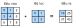

<!-- ===================== Bắt đầu dịch Phần 1 ==================== -->
<!-- ========================================= REVISE PHẦN 1 - BẮT ĐẦU =================================== -->

<!--
# Convolutions for Images
-->

# Phép Tích chập cho Ảnh
:label:`sec_conv_layer`

<!--
Now that we understand how convolutional layers work in theory, we are ready to see how they work in practice.
Building on our motivation of convolutional neural networks as efficient architectures for epxloring structure in image data,
we stick with images as our running example.
-->

Giờ chúng ta đã hiểu cách các tầng tích chập hoạt động trên lý thuyết, hãy xem chúng hoạt động trong thực tế như thế nào.
Dựa vào ý tưởng mạng nơ-ron tích chập là kiến trúc hiệu quả để khám phá cấu trúc của dữ liệu ảnh, chúng tôi vẫn sẽ sử dụng loại dữ liệu này khi lấy ví dụ.

<!--
## The Cross-Correlation Operator
-->

## Toán tử Tương quan Chéo

<!--
Recall that strictly speaking, *convolutional* layers are a (slight) misnomer, since the operations they express are more accurately described as cross correlations.
In a convolutional layer, an input array and a *correlation kernel* array are combined to produce an output array through a cross-correlation operation.
Let's ignore channels for now and see how this works with two-dimensional data and hidden representations.
In :numref:`fig_correlation`, the input is a two-dimensional array with a height of 3 and width of 3.
We mark the shape of the array as $3 \times 3$ or ($3$, $3$).
The height and width of the kernel are both $2$.
Note that in the deep learning research community, this object may be referred to as *a convolutional kernel*, *a filter*, or simply the layer's *weights*.
The shape of the kernel window is given by the height and width of the kernel (here it is $2 \times 2$).
-->

Như ta đã biết, tầng *tích chập* là cái tên có phần không chính xác, vì phép toán mà chúng biểu diễn là phép tương quan chéo (*cross correlation*).
Trong một tầng tích chập, một mảng đầu vào và một mảng *hạt nhân tương quan* được kết hợp để tạo ra mảng đầu ra bằng phép toán tương quan chéo.
Hãy tạm thời bỏ qua chiều kênh và xem phép toán này hoạt động như thế nào với dữ liệu và biểu diễn ẩn hai chiều.
Trong :numref:`fig_correlation`, đầu vào là một mảng hai chiều với chiều dài 3 và chiều rộng 3.
Ta kí hiệu kích thước của mảng là $3 \times 3$ hoặc ($3$, $3$).
Chiều dài và chiều rộng của hạt nhân đều là 2.
Chú ý rằng trong cộng đồng nghiên cứu học sâu, mảng này còn có thể được gọi là *hạt nhân tích chập*, *bộ lọc* hay đơn thuần là *trọng số* của tầng.
Kích thước của cửa sổ hạt nhân là chiều dài và chiều rộng của hạt nhân (ở đây là $2 \times 2$).


<!--

-->


:label:`fig_correlation`

<!--
In the two-dimensional cross-correlation operation, we begin with the convolution window positioned at the top-left corner of the input array 
and slide it across the input array, both from left to right and top to bottom.
When the convolution window slides to a certain position, the input subarray contained in that window and the kernel array are multiplied (elementwise) 
and the resulting array is summed up yielding a single scalar value.
TThis result gives the value of the output array at the corresponding location.
Here, the output array has a height of 2 and width of 2 and the four elements are derived from the two-dimensional cross-correlation operation:
-->

Trong phép tương quan chéo hai chiều, ta bắt đầu với cửa sổ tích chập đặt tại vị trí góc trên bên trái của mảng đầu vào và di chuyển cửa sổ này từ trái sang phải và từ trên xuống dưới.
Khi cửa sổ tích chập được đẩy tới một vị trí nhất định, mảng con đầu vào nằm trong cửa sổ đó và mảng hạt nhân được nhân theo từng phần tử,
rồi sau đó ta lấy tổng các phần tử trong mảng kết quả để có được một giá trị số vô hướng duy nhất.
Giá trị này được ghi vào mảng đầu ra tại vị trí tương ứng.
Ở đây, mảng đầu ra có chiều dài 2 và chiều rộng 2, với bốn phần tử được tính bằng phép tương quan chéo hai chiều:

$$
0\times0+1\times1+3\times2+4\times3=19,\\
1\times0+2\times1+4\times2+5\times3=25,\\
3\times0+4\times1+6\times2+7\times3=37,\\
4\times0+5\times1+7\times2+8\times3=43.
$$

<!-- ===================== Kết thúc dịch Phần 1 ===================== -->

<!-- ===================== Bắt đầu dịch Phần 2 ===================== -->

<!--
Note that along each axis, the output is slightly *smaller* than the input.
Because the kernel has width and height greater than one, we can only properly compute the cross-correlation for locations where the kernel fits wholly within the image,
the output size is given by the input size $H \times W$ minus the size of the convolutional kernel $h \times w$ via $(H-h+1) \times (W-w+1)$.
This is the case since we need enough space to 'shift' the convolutional kernel across the image
(later we will see how to keep the size unchanged by padding the image with zeros around its boundary such that there is enough space to shift the kernel).
Next, we implement this process in the `corr2d` function, which accepts the input array `X` and kernel array `K` and returns the output array `Y`.
-->

Lưu ý rằng theo mỗi trục, kích thước đầu ra *nhỏ hơn* một chút so với đầu vào.
Bởi vì hạt nhân có chiều dài và chiều rộng lớn hơn một, ta chỉ có thể tính độ tương quan chéo cho những vị trí mà ở đó hạt nhân nằm hoàn toàn bên trong ảnh, 
kích thước đầu ra được tính bằng cách lấy đầu vào $H \times W$ trừ kích thước của bộ lọc tích chập $h \times w$ bằng $(H-h+1) \times (W-w+1)$.
Điều này xảy ra vì ta cần đủ không gian để 'dịch chuyển' hạt nhân tích chập qua tấm hình 
(sau này ta sẽ xem làm thế nào để có thể giữ nguyên kích thước bằng cách đệm các số không vào xung quanh biên của hình ảnh sao cho có đủ không gian để dịch chuyển hạt nhân).
Kế tiếp, ta lập trình quá trình ở trên trong hàm `corr2d`.
Hàm này nhận mảng đầu vào `X` với mảng hạt nhân `K` và trả về mảng đầu ra `Y`.


```{.python .input}
from mxnet import autograd, np, npx
from mxnet.gluon import nn
npx.set_np()

# Saved in the d2l package for later use
def corr2d(X, K):
    """Compute 2D cross-correlation."""
    h, w = K.shape
    Y = np.zeros((X.shape[0] - h + 1, X.shape[1] - w + 1))
    for i in range(Y.shape[0]):
        for j in range(Y.shape[1]):
            Y[i, j] = (X[i: i + h, j: j + w] * K).sum()
    return Y
```

<!--
We can construct the input array `X` and the kernel array `K` from the figure above
to validate the output of the above implementation of the two-dimensional cross-correlation operation.
-->

Ta có thể xây dựng mảng đầu vào `X` và mảng hạt nhân `K` như hình trên để kiểm tra lại kết quả của cách lập trình phép toán tương quan chéo hai chiều vừa rồi.

```{.python .input}
X = np.array([[0, 1, 2], [3, 4, 5], [6, 7, 8]])
K = np.array([[0, 1], [2, 3]])
corr2d(X, K)
```

<!-- ========================================= REVISE PHẦN 1 - KẾT THÚC ===================================-->

<!-- ========================================= REVISE PHẦN 2 - BẮT ĐẦU ===================================-->

<!--
## Convolutional Layers
-->

## Tầng Tích chập

<!--
A convolutional layer cross-correlates the input and kernels and adds a scalar bias to produce an output.
The two parameters of the convolutional layer are the kernel and the scalar bias.
When training models based on convolutional layers, we typically initialize the kernels randomly, just as we would with a fully connected layer.
-->

Tầng tích chập thực hiện phép toán tương quan chéo giữa đầu vào và hạt nhân, sau đó cộng thêm một hệ số điều chỉnh để có được đầu ra.
Hai tham số của tầng tích chập là hạt nhân và hệ số điều chỉnh.
Khi huấn luyện mô hình chứa các tầng tích chập, ta thường khởi tạo hạt nhân ngẫu nhiên, giống như cách ta làm với tầng kết nối đầy đủ.

<!--
We are now ready to implement a two-dimensional convolutional layer based on the `corr2d` function defined above.
In the `__init__` constructor function, we declare `weight` and `bias` as the two model parameters.
The forward computation function `forward` calls the `corr2d` function and adds the bias.
As with $h \times w$ cross-correlation we also refer to convolutional layers as $h \times w$ convolutions.
-->

Bây giờ ta đã sẵn sàng lập trình một tầng tích chập hai chiều dựa vào hàm `corr2d` ta vừa định nghĩa ở trên.
Trong hàm khởi tạo `__init__`, ta khai báo hai tham số của mô hình `weight` và `bias`.
Hàm tính lượt truyền xuôi `forward` gọi hàm `corr2d` và cộng thêm hệ số điều chỉnh.
Cũng giống cách gọi phép tương quan chéo $h \times w$, ta cũng gọi các tầng tích chập là phép tích chập $h \times w$.

```{.python .input  n=70}
class Conv2D(nn.Block):
    def __init__(self, kernel_size, **kwargs):
        super(Conv2D, self).__init__(**kwargs)
        self.weight = self.params.get('weight', shape=kernel_size)
        self.bias = self.params.get('bias', shape=(1,))

    def forward(self, x):
        return corr2d(x, self.weight.data()) + self.bias.data()
```

<!-- ===================== Kết thúc dịch Phần 2 ===================== -->

<!-- ===================== Bắt đầu dịch Phần 3 ===================== -->

<!--
## Object Edge Detection in Images
-->

## Phát hiện Biên của Vật thể trong Ảnh

<!--
Let's take a moment to parse a simple application of a convolutional layer: detecting the edge of an object in an image by finding the location of the pixel change.
First, we construct an 'image' of $6\times 8$ pixels.
The middle four columns are black (0) and the rest are white (1).
-->

Hãy quan sát một ứng dụng đơn giản của tầng tích chập: phát hiện đường biên của một vật thể trong một bức ảnh bằng cách xác định vị trí các điểm ảnh thay đổi.
Đầu tiên, ta dựng một 'bức ảnh' có kích thước là $6\times 8$ điểm ảnh.
Bốn cột ở giữa có màu đen (giá trị 0) và các cột còn lại có màu trắng (giá trị 1).

```{.python .input  n=66}
X = np.ones((6, 8))
X[:, 2:6] = 0
X
```

<!--
Next, we construct a kernel `K` with a height of $1$ and width of $2$.
When we perform the cross-correlation operation with the input, if the horizontally adjacent elements are the same, the output is 0. Otherwise, the output is non-zero.
-->

Sau đó, ta tạo một hạt nhân `K` có chiều cao bằng $1$ và chiều rộng bằng $2$.
Khi thực hiện phép tương quan chéo với đầu vào, nếu hai phần tử cạnh nhau theo chiều ngang có giá trị giống nhau thì đầu ra sẽ bằng 0, còn lại đầu ra sẽ khác không.

```{.python .input  n=67}
K = np.array([[1, -1]])
```

<!--
We are ready to perform the cross-correlation operation with arguments `X` (our input) and `K` (our kernel).
As you can see, we detect 1 for the edge from white to black and -1 for the edge from black to white.
All other outputs take value $0$.
-->

Ta đã sẵn sàng thực hiện phép tương quan chéo với các đối số `X` (đầu vào) và `K` (hạt nhân).
Bạn có thể thấy rằng các vị trí biên trắng đổi thành đen có giá trị 1, còn các vị trí biên đen đổi thành trắng có giá trị -1.
Các vị trí còn lại của đầu ra có giá trị 0.

```{.python .input  n=69}
Y = corr2d(X, K)
Y
```

<!--
We can now apply the kernel to the transposed image.
As expected, it vanishes. The kernel `K` only detects vertical edges.
-->

Bây giờ hãy áp dụng hạt nhân này cho chuyển vị của ma trận điểm ảnh.
Như kỳ vọng, giá trị tương quan chéo bằng không. Hạt nhân `K` chỉ có thể phát hiện biên dọc.

```{.python .input}
corr2d(X.T, K)
```

<!-- ===================== Kết thúc dịch Phần 3 ===================== -->

<!-- ===================== Bắt đầu dịch Phần 4 ===================== -->

<!-- ========================================= REVISE PHẦN 2 - KẾT THÚC ===================================-->

<!-- ========================================= REVISE PHẦN 3 - BẮT ĐẦU ===================================-->

<!--
## Learning a Kernel
-->

## Học một Bộ lọc

<!--
Designing an edge detector by finite differences `[1, -1]` is neat if we know this is precisely what we are looking for.
However, as we look at larger kernels, and consider successive layers of convolutions, it might be impossible to specify precisely what each filter should be doing manually.
-->

Việc thiết kế bộ phát hiện biên bằng sai phân hữu hạn `[1, -1]` thì khá gọn gàng nếu ta biết chính xác đây là những gì cần làm.
Tuy nhiên, khi xét tới các bộ lọc lớn hơn và các tầng tích chập liên tiếp, việc chỉ định chính xác mỗi bộ lọc cần làm gì một cách thủ công là bất khả thi.

<!--
Now let us see whether we can learn the kernel that generated `Y` from `X` by looking at the (input, output) pairs only.
We first construct a convolutional layer and initialize its kernel as a random array.
Next, in each iteration, we will use the squared error to compare `Y` to the output of the convolutional layer.
We can then calculate the gradient to update the weight.
For the sake of simplicity, in this convolutional layer, we will ignore the bias.
-->

Bây giờ ta hãy xem liệu có thể học một bộ lọc có khả năng tạo ra `Y` từ` X` chỉ từ các cặp (đầu vào, đầu ra) hay không.
Đầu tiên chúng ta xây dựng một tầng tích chập và khởi tạo một mảng ngẫu nhiên làm bộ lọc.
Tiếp theo, trong mỗi lần lặp, ta sẽ sử dụng bình phương sai số để so sánh `Y` và đầu ra của tầng tích chập, sau đó tính toán gradient để cập nhật trọng số.
Để đơn giản, trong tầng tích chập này, ta sẽ bỏ qua hệ số điều chỉnh.

<!--
We previously constructed the `Conv2D` class.
However, since we used single-element assignments,
Gluon has some trouble finding the gradient.
Instead, we use the built-in `Conv2D` class provided by Gluon below.
-->

Trước đây ta đã tự xây dựng lớp `Conv2D`.
Tuy nhiên, do ta sử dụng các phép gán một phần tử, Gluon sẽ gặp một số khó khăn khi tính gradient.
Thay vào đó, ta sử dụng lớp `Conv2D` có sẵn của Gluon như sau.


```{.python .input  n=83}
# Construct a convolutional layer with 1 output channel
# (channels will be introduced in the following section)
# and a kernel array shape of (1, 2)
conv2d = nn.Conv2D(1, kernel_size=(1, 2))
conv2d.initialize()

# The two-dimensional convolutional layer uses four-dimensional input and
# output in the format of (example, channel, height, width), where the batch
# size (number of examples in the batch) and the number of channels are both 1
X = X.reshape(1, 1, 6, 8)
Y = Y.reshape(1, 1, 6, 7)

for i in range(10):
    with autograd.record():
        Y_hat = conv2d(X)
        l = (Y_hat - Y) ** 2
    l.backward()
    # For the sake of simplicity, we ignore the bias here
    conv2d.weight.data()[:] -= 3e-2 * conv2d.weight.grad()
    if (i + 1) % 2 == 0:
        print('batch %d, loss %.3f' % (i + 1, l.sum()))
```

<!--
Note that the error has dropped to a small value after 10 iterations.
Now we will take a look at the kernel array we learned.
-->

Có thể thấy sai số đã giảm xuống còn khá nhỏ sau 10 lần lặp.
Bây giờ hãy xem mảng bộ lọc đã học được.

```{.python .input}
conv2d.weight.data().reshape(1, 2)
```

<!--
Indeed, the learned kernel array is remarkably close to the kernel array `K` we defined earlier.
-->

Thật vậy, mảng bộ lọc học được rất gần với mảng bộ lọc `K` mà ta tự định nghĩa trước đó.

<!-- ===================== Kết thúc dịch Phần 4 ===================== -->

<!-- ===================== Bắt đầu dịch Phần 5 ===================== -->

<!--
## Cross-Correlation and Convolution
-->

## Tương quan Chéo và Tích chập

<!--
Recall our observation from the previous section of the correspondence between the cross-correlation and convolution operators.
The figure above makes this correspondence apparent.
Simply flip the kernel from the bottom left to the top right.
In this case, the indexing in the sum is reverted, yet the same result can be obtained.
In keeping with standard terminology with deep learning literature, we will continue to refer to the cross-correlation operation
as a convolution even though, strictly-speaking, it is slightly different.
-->

Hãy nhớ lại kiến thức của phần trước về mối liên hệ giữa phép tương quan chéo và tích chập.
Trong hình trên, ta dễ dàng nhận thấy điều này.
Đơn giản chỉ cần lật bộ lọc từ góc dưới cùng bên trái lên góc trên cùng bên phải.
Trong trường hợp này, chỉ số trong phép lấy tổng được đảo ngược, nhưng ta vẫn thu được kết quả tương tự.
Để thống nhất với các thuật ngữ tiêu chuẩn trong tài liệu học sâu, ta sẽ tiếp tục đề cập đến phép tương quan chéo như là phép tích chập, mặc dù đúng ra chúng hơi khác nhau một chút.

<!--
## Summary
-->

## Tóm tắt

<!--
* The core computation of a two-dimensional convolutional layer is a two-dimensional cross-correlation operation. 
In its simplest form, this performs a cross-correlation operation on the two-dimensional input data and the kernel, and then adds a bias.
* We can design a kernel to detect edges in images.
* We can learn the kernel's parameters from data.
-->

* Về cốt lõi, phần tính toán của tầng tích chập hai chiều là phép tương quan chéo hai chiều.
Ở dạng đơn giản nhất, phép tương quan chéo thao tác trên dữ liệu đầu vào hai chiều và bộ lọc, sau đó cộng thêm hệ số điều chỉnh.
* Chúng ta có thể thiết kế bộ lọc để phát hiện các biên trong ảnh.
* Chúng ta có thể học các tham số của bộ lọc từ dữ liệu.

<!--
## Exercises
-->

## Bài tập

<!--
1. Construct an image `X` with diagonal edges.
    * What happens if you apply the kernel `K` to it?
    * What happens if you transpose `X`?
    * What happens if you transpose `K`?
2. When you try to automatically find the gradient for the `Conv2D` class we created, what kind of error message do you see?
3. How do you represent a cross-correlation operation as a matrix multiplication by changing the input and kernel arrays?
4. Design some kernels manually.
    * What is the form of a kernel for the second derivative?
    * What is the kernel for the Laplace operator?
    * What is the kernel for an integral?
    * What is the minimum size of a kernel to obtain a derivative of degree $d$?
-->

1. Xây dựng hình ảnh `X` với các cạnh chéo.
     * Điều gì xảy ra nếu bạn áp dụng bộ lọc `K` lên nó?
     * Điều gì xảy ra nếu bạn chuyển vị `X`?
     * Điều gì xảy ra nếu bạn chuyển vị `K`?
2. Khi thử tự động tìm gradient cho lớp `Conv2D` mà ta đã tạo, bạn thấy loại thông báo lỗi nào?
3. Làm thế nào để bạn biểu diễn một phép tính tương quan chéo như là một phép nhân ma trận bằng cách thay đổi các mảng đầu vào và mảng bộ lọc?
4. Hãy thiết kế thủ công một số bộ lọc sau.
     * Bộ lọc để tính đạo hàm bậc hai có dạng như thế nào?
     * Bộ lọc của toán tử Laplace là gì?
     * Bộ lọc của phép tích phân là gì?
     * Kích thước tối thiểu của bộ lọc để có được đạo hàm bậc $d$ là bao nhiêu?

<!-- ===================== Kết thúc dịch Phần 5 ===================== -->
<!-- ========================================= REVISE PHẦN 3 - KẾT THÚC ===================================-->

## Thảo luận
* [Tiếng Anh](https://discuss.mxnet.io/t/2349)
* [Tiếng Việt](https://forum.machinelearningcoban.com/c/d2l)

## Những người thực hiện
Bản dịch trong trang này được thực hiện bởi:

* Đoàn Võ Duy Thanh
* Nguyễn Văn Cường
* Lê Khắc Hồng Phúc
* Phạm Hồng Vinh
* Lý Phi Long
* Phạm Minh Đức
* Trần Yến Thy
