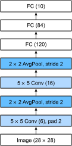

<!-- ===================== Bắt đầu dịch Phần 1 ==================== -->
<!-- ========================================= REVISE PHẦN 1 - BẮT ĐẦU =================================== -->

<!--
# Convolutional Neural Networks (LeNet)
-->

# *dịch tiêu đề phía trên*
:label:`sec_lenet`

<!--
We are now ready to put all of the tools together to deploy your first fully-functional convolutional neural network.
In our first encounter with image data we applied a multilayer perceptron (:numref:`sec_mlp_scratch`) to pictures of clothing in the Fashion-MNIST dataset.
Each image in Fashion-MNIST consisted of a two-dimensional $28 \times 28$ matrix.
To make this data amenable to multilayer perceptrons which anticipate receiving inputs as one-dimensional fixed-length vectors, 
we first flattened each image, yielding vectors of length 784, before processing them with a series of fully-connected layers.
-->

*dịch đoạn phía trên*

<!--
Now that we have introduced convolutional layers, we can keep the image in its original spatially-organized grid, processing it with a series of successive convolutional layers.
Moreover, because we are using convolutional layers, we can enjoy a considerable savings in the number of parameters required.
-->

*dịch đoạn phía trên*

<!--
In this section, we will introduce one of the first published convolutional neural networks whose benefit was first demonstrated by Yann Lecun, 
then a researcher at AT&T Bell Labs, for the purpose of recognizing handwritten digits in images—[LeNet5](http://yann.lecun.com/exdb/lenet/).
In the 90s, their experiments with LeNet gave the first compelling evidence that it was possible to train convolutional neural networks by backpropagation.
Their model achieved outstanding results (only matched by Support Vector Machines at the time) and was adopted to recognize digits for processing deposits in ATM machines.
Some ATMs still run the code that Yann and his colleague Leon Bottou wrote in the 1990s!
-->

*dịch đoạn phía trên*

<!-- ===================== Kết thúc dịch Phần 1 ===================== -->

<!-- ===================== Bắt đầu dịch Phần 2 ===================== -->

<!--
## LeNet
-->

## *dịch tiêu đề phía trên*

<!--
In a rough sense, we can think LeNet as consisting of two parts:
(i) a block of convolutional layers; and
(ii) a block of fully-connected layers.
Before getting into the weeds, let us briefly review the model in :numref:`img_lenet`.
-->

*dịch đoạn phía trên*

<!--

-->


:label:`img_lenet`

<!--
The basic units in the convolutional block are a convolutional layer and a subsequent average pooling layer 
(note that max-pooling works better, but it had not been invented in the 90s yet).
The convolutional layer is used to recognize the spatial patterns in the image, 
such as lines and the parts of objects, and the subsequent average pooling layer is used to reduce the dimensionality.
The convolutional layer block is composed of repeated stacks of these two basic units.
Each convolutional layer uses a $5\times 5$ kernel and processes each output with a sigmoid activation function 
(again, note that ReLUs are now known to work more reliably, but had not been invented yet).
The first convolutional layer has 6 output channels, and second convolutional layer increases channel depth further to 16.
-->

*dịch đoạn phía trên*

<!--
However, coinciding with this increase in the number of channels, the height and width are shrunk considerably.
Therefore, increasing the number of output channels makes the parameter sizes of the two convolutional layers similar.
The two average pooling layers are of size $2\times 2$ and take stride 2 (note that this means they are non-overlapping).
In other words, the pooling layer downsamples the representation to be precisely *one quarter* the pre-pooling size.
-->

*dịch đoạn phía trên*

<!-- ===================== Kết thúc dịch Phần 2 ===================== -->

<!-- ===================== Bắt đầu dịch Phần 3 ===================== -->

<!--
The convolutional block emits an output with size given by (batch size, channel, height, width).
Before we can pass the convolutional block's output to the fully-connected block, we must flatten each example in the minibatch.
In other words, we take this 4D input and transform it into the 2D input expected by fully-connected layers: 
as a reminder, the first dimension indexes the examples in the minibatch and the second gives the flat vector representation of each example.
LeNet's fully-connected layer block has three fully-connected layers, with 120, 84, and 10 outputs, respectively.
Because we are still performing classification, the 10 dimensional output layer corresponds to the number of possible output classes.
-->

*dịch đoạn phía trên*

<!--
While getting to the point where you truly understand what is going on inside LeNet may have taken a bit of work, 
you can see below that implementing it in a modern deep learning library is remarkably simple.
Again, we will rely on the Sequential class.
-->

*dịch đoạn phía trên*

```{.python .input}
import d2l
from mxnet import autograd, gluon, init, np, npx
from mxnet.gluon import nn
npx.set_np()

net = nn.Sequential()
net.add(nn.Conv2D(channels=6, kernel_size=5, padding=2, activation='sigmoid'),
        nn.AvgPool2D(pool_size=2, strides=2),
        nn.Conv2D(channels=16, kernel_size=5, activation='sigmoid'),
        nn.AvgPool2D(pool_size=2, strides=2),
        # Dense will transform the input of the shape (batch size, channel,
        # height, width) into the input of the shape (batch size,
        # channel * height * width) automatically by default
        nn.Dense(120, activation='sigmoid'),
        nn.Dense(84, activation='sigmoid'),
        nn.Dense(10))
```

<!--
As compared to the original network, we took the liberty of replacing the Gaussian activation in the last layer by a regular dense layer, 
which tends to be significantly more convenient to train.
Other than that, this network matches the historical definition of LeNet5.
-->

*dịch đoạn phía trên*

<!--
Next, let us take a look of an example.
As shown in :numref:`img_lenet_vert`, we feed a single-channel example of size $28 \times 28$ into the network and perform 
a forward computation layer by layer printing the output shape at each layer to make sure we understand what is happening here.
-->

*dịch đoạn phía trên*

```{.python .input}
X = np.random.uniform(size=(1, 1, 28, 28))
net.initialize()
for layer in net:
    X = layer(X)
    print(layer.name, 'output shape:\t', X.shape)
```

<!-- ===================== Kết thúc dịch Phần 3 ===================== -->

<!-- ===================== Bắt đầu dịch Phần 4 ===================== -->

<!--
Note that the height and width of the representation at each layer throughout the convolutional block is reduced (compared to the previous layer).
The first convolutional layer uses a kernel with a height and width of $5$, and then a $2$ pixels of padding which compensates the reduction in its original shape.
While the second convolutional layer applies the same shape of $5 x 5$ kernel without padding, resulting in reductions in both height and width by $4$ pixels.
Moreover each pooling layer halves the height and width.
However, as we go up the stack of layers, the number of channels increases layer-over-layer from 1 in the input to 6 after the first convolutional layer and 16 after the second layer.
Then, the fully-connected layer reduces dimensionality layer by layer, until emitting an output that matches the number of image classes.
-->

Xin hãy chú ý rằng, chiều cao và chiều rộng của đặc trưng thu được từ việc học biểu diễn tại mỗi tầng trong toàn bộ khối tính chập sẽ bị giảm đi (so với chiều cao và chiều rộng của đặc trưng ở tầng trước). 
Tầng tính chập đầu tiên sử dụng một kernel với chiều cao và chiều rộng là $5$, và tiếp theo đó là đệm thêm vào $2$ đơn vị điểm ảnh để bù trừ cho sự giảm đi kích thước của đặc trưng đầu ra so với kích thước ban đầu của nó. 
Trong khi đó tầng tính chập thứ hai cũng dùng cùng một kernel với kích thước là $5 x 5$ mà không có sử dụng giá trị đệm thêm vào, dẫn đến việc giảm cả chiều cao và chiều rộng bằng một giá trị là 4 đơn vị điểm ảnh. 
Ngoài ra, mỗi tầng gộp sẽ làm giảm đi một nửa chiều cao và chiều rộng của đặc trưng ánh xạ đầu vào. 
Tuy nhiên, khi chúng ta đi từ thứ tự từ dưới lên trên của các tầng chồng lên nhau, số kênh sẽ tăng lần lượt theo từng tầng, từ 1 kênh của dữ liệu đầu vào cho lên tới 6 kênh sau khi đi qua tầng tính chập thứ nhất và 16 kênh sau khi đi qua tầng tính chập thứ hai. 
Sau đó, tầng kết nối đầy đủ làm giảm số chiều lần lượt qua từng tầng cho đến khi tạo thành một đầu ra khớp với số lượng các loại nhãn của hình ảnh. 

<!--

-->


:label:`img_lenet_vert`

<!-- ========================================= REVISE PHẦN 1 - KẾT THÚC ===================================-->

<!-- ========================================= REVISE PHẦN 2 - BẮT ĐẦU ===================================-->

<!--
## Data Acquisition and Training
-->

## Thu thập và huấn luyện dữ liệu 

<!--
Now that we have implemented the model, we might as well run some experiments to see what we can accomplish with the LeNet model.
We will use Fashion-MNIST as our dataset.
It is more challenging than the original MNIST dataset while it has the same shape ($28\times28$ images).
-->

Sau khi triển khai và xây dựng xong mô hình, chúng ta thực hiện một số thử nghiệm để xem chúng ta có thể đạt được kết quả gì với mô hình LeNet. Chúng ta sẽ sử dụng Fashion-MNIST là bộ dữ liệu huấn luyện. 
Bộ dữ liệu này sẽ thử thách hơn so với bộ MNIST trong bài toán phân loại mặc dù chúng có cùng kích thước của hình ảnh huấn luyện là $28\times28$. 

```{.python .input}
batch_size = 256
train_iter, test_iter = d2l.load_data_fashion_mnist(batch_size=batch_size)
```

<!--
While convolutional networks may have few parameters, they can still be significantly more expensive to compute than a similarly deep multilayer perceptron so if you have access to a GPU, this might be a good time to put it into action to speed up training.
-->

Trong khi những mạng tính chập có thể có số lượng tham số không lớn, nhưng chúng vẫn cần tiêu tốn tài nguyên tính toán hơn nhiều so với việc học sâu với nhiều tầng perceptron, vì vậy, nếu bạn có thể sử dụng được GPU, đây là thời điểm thích hợp để dùng nó vào việc tăng tốc thời gian huấn luyện. 

<!--
For evaluation, we need to make a slight modification to the `evaluate_accuracy` function that we described in :numref:`sec_softmax_scratch`.
Since the full dataset lives on the CPU, we need to copy it to the GPU before we can compute our models.
This is accomplished via the `as_in_ctx` function described in :numref:`sec_use_gpu`.
-->

Để thực hiện việc đánh giá hiệu quả của mô hình huấn luyện, chúng ta cần làm một điều chỉnh nhỏ cho hàm `evaluate_accuracy` mà chúng ta đã mô tả ở phần :numref:`sec_softmax_scratch`.
Bởi vì toàn bộ tập dữ liệu đang nằm trên CPU, chúng ta cần sao chép nó lên GPU trước khi chúng ta có thể thực hiện tính toán với mô hình.
Việc này được hoàn thành thông qua việc dùng hàm `as_in_ctx` đã được mô tả ở phần :numref:`sec_use_gpu`.  

<!-- ===================== Kết thúc dịch Phần 4 ===================== -->

<!-- ===================== Bắt đầu dịch Phần 5 ===================== -->

```{.python .input}
# Saved in the d2l package for later use
def evaluate_accuracy_gpu(net, data_iter, ctx=None):
    if not ctx:  # Query the first device the first parameter is on
        ctx = list(net.collect_params().values())[0].list_ctx()[0]
    metric = d2l.Accumulator(2)  # num_corrected_examples, num_examples
    for X, y in data_iter:
        X, y = X.as_in_ctx(ctx), y.as_in_ctx(ctx)
        metric.add(d2l.accuracy(net(X), y), y.size)
    return metric[0]/metric[1]
```

<!--
We also need to update our training function to deal with GPUs.
Unlike the `train_epoch_ch3` defined in :numref:`sec_softmax_scratch`, we now need to move each batch of data to our designated context (hopefully, the GPU)
prior to making the forward and backward passes.
-->

*dịch đoạn phía trên*

<!--
The training function `train_ch6` is also very similar to `train_ch3` defined in :numref:`sec_softmax_scratch`.
Since we will deal with networks with tens of layers now, the function will only support Gluon models.
We initialize the model parameters on the device indicated by `ctx`, this time using the Xavier initializer.
The loss function and the training algorithm still use the cross-entropy loss function and minibatch stochastic gradient descent.
Since each epoch takes tens of seconds to run, we visualize the training loss in a finer granularity.
-->

*dịch đoạn phía trên*

```{.python .input}
# Saved in the d2l package for later use
def train_ch6(net, train_iter, test_iter, num_epochs, lr, ctx=d2l.try_gpu()):
    net.initialize(force_reinit=True, ctx=ctx, init=init.Xavier())
    loss = gluon.loss.SoftmaxCrossEntropyLoss()
    trainer = gluon.Trainer(net.collect_params(),
                            'sgd', {'learning_rate': lr})
    animator = d2l.Animator(xlabel='epoch', xlim=[0, num_epochs],
                            legend=['train loss', 'train acc', 'test acc'])
    timer = d2l.Timer()
    for epoch in range(num_epochs):
        metric = d2l.Accumulator(3)  # train_loss, train_acc, num_examples
        for i, (X, y) in enumerate(train_iter):
            timer.start()
            # Here is the only difference compared to train_epoch_ch3
            X, y = X.as_in_ctx(ctx), y.as_in_ctx(ctx)
            with autograd.record():
                y_hat = net(X)
                l = loss(y_hat, y)
            l.backward()
            trainer.step(X.shape[0])
            metric.add(l.sum(), d2l.accuracy(y_hat, y), X.shape[0])
            timer.stop()
            train_loss, train_acc = metric[0]/metric[2], metric[1]/metric[2]
            if (i+1) % 50 == 0:
                animator.add(epoch + i/len(train_iter),
                             (train_loss, train_acc, None))
        test_acc = evaluate_accuracy_gpu(net, test_iter)
        animator.add(epoch+1, (None, None, test_acc))
    print('loss %.3f, train acc %.3f, test acc %.3f' % (
        train_loss, train_acc, test_acc))
    print('%.1f examples/sec on %s' % (metric[2]*num_epochs/timer.sum(), ctx))
```

<!--
Now let us train the model.
-->

*dịch đoạn phía trên*

```{.python .input}
lr, num_epochs = 0.9, 10
train_ch6(net, train_iter, test_iter, num_epochs, lr)
```

<!-- ===================== Kết thúc dịch Phần 5 ===================== -->

<!-- ===================== Bắt đầu dịch Phần 6 ===================== -->

<!--
## Summary
-->

## Tóm tắt

<!--
* A convolutional neural network (in short, ConvNet) is a network using convolutional layers.
* In a ConvNet we alternate between convolutions, nonlinearities and often also pooling operations.
* Ultimately the resolution is reduced prior to emitting an output via one (or more) dense layers.
* LeNet was the first successful deployment of such a network.
-->

*dịch đoạn phía trên*

<!--
## Exercises
-->

## Bài tập

<!--
1. Replace the average pooling with max pooling. What happens?
2. Try to construct a more complex network based on LeNet to improve its accuracy.
    * Adjust the convolution window size.
    * Adjust the number of output channels.
    * Adjust the activation function (ReLU?).
    * Adjust the number of convolution layers.
    * Adjust the number of fully connected layers.
    * Adjust the learning rates and other training details (initialization, epochs, etc.)
3. Try out the improved network on the original MNIST dataset.
4. Display the activations of the first and second layer of LeNet for different inputs (e.g., sweaters, coats).
-->

*dịch đoạn phía trên*

<!-- ===================== Kết thúc dịch Phần 6 ===================== -->
<!-- ========================================= REVISE PHẦN 2 - KẾT THÚC ===================================-->

<!--
## [Discussions](https://discuss.mxnet.io/t/2353)
-->

## Thảo luận
* [Tiếng Anh](https://discuss.mxnet.io/t/2353)
* [Tiếng Việt](https://forum.machinelearningcoban.com/c/d2l)

## Những người thực hiện
Bản dịch trong trang này được thực hiện bởi:
<!--
Tác giả của mỗi Pull Request điền tên mình và tên những người review mà bạn thấy
hữu ích vào từng phần tương ứng. Mỗi dòng một tên, bắt đầu bằng dấu `*`.

Lưu ý:
* Nếu reviewer không cung cấp tên, bạn có thể dùng tên tài khoản GitHub của họ
với dấu `@` ở đầu. Ví dụ: @aivivn.

* Tên đầy đủ của các reviewer có thể được tìm thấy tại https://github.com/aivivn/d2l-vn/blob/master/docs/contributors_info.md
-->

* Đoàn Võ Duy Thanh
<!-- Phần 1 -->
*

<!-- Phần 2 -->
*

<!-- Phần 3 -->
*

<!-- Phần 4 -->
* Dac Dinh

<!-- Phần 5 -->
*

<!-- Phần 6 -->
*
