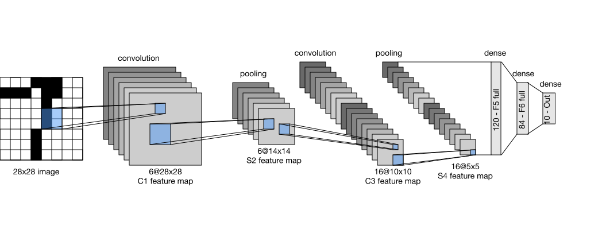

<!-- ===================== Bắt đầu dịch Phần 1 ==================== -->
<!-- ========================================= REVISE PHẦN 1 - BẮT ĐẦU =================================== -->

<!--
# Convolutional Neural Networks (LeNet)
-->

# Mạng Nơ-ron Tích chập (LeNet)
:label:`sec_lenet`

<!--
We are now ready to put all of the tools together to deploy your first fully-functional convolutional neural network.
In our first encounter with image data we applied a multilayer perceptron (:numref:`sec_mlp_scratch`) to pictures of clothing in the Fashion-MNIST dataset.
Each image in Fashion-MNIST consisted of a two-dimensional $28 \times 28$ matrix.
To make this data amenable to multilayer perceptrons which anticipate receiving inputs as one-dimensional fixed-length vectors, 
we first flattened each image, yielding vectors of length 784, before processing them with a series of fully-connected layers.
-->

Bây giờ ta đã sẵn sàng kết hợp tất cả các công cụ lại với nhau để triển khai mạng nơ-ron tích chập hoàn chỉnh đầu tiên.
Lần đầu làm việc với dữ liệu ảnh, ta đã áp dụng một perceptron đa tầng (:numref:`sec_mlp_scratch`) cho ảnh quần áo trong bộ dữ liệu Fashion-MNIST.
Mỗi ảnh trong Fashion-MNIST là một ma trận hai chiều có kích thước $28 \times 28$.
Để tương thích với đầu vào dạng vector một chiều với độ dài cố định của các perceptron đa tầng, 
đầu tiên ta trải phẳng từng hình ảnh và thu được các vector có chiều dài 784, trước khi xử lý chúng với một chuỗi các tầng kết nối đầy đủ.

<!--
Now that we have introduced convolutional layers, we can keep the image in its original spatially-organized grid, processing it with a series of successive convolutional layers.
Moreover, because we are using convolutional layers, we can enjoy a considerable savings in the number of parameters required.
-->

Bây giờ đã có các tầng tích chập, ta có thể giữ nguyên ảnh đầu vào ở dạng không gian hai chiều như ảnh gốc và xử lý chúng với một chuỗi các tầng tích chập liên tiếp.
Hơn nữa, vì ta đang sử dụng các tầng tích chập, số lượng tham số cần thiết sẽ giảm đi đáng kể.

<!--
In this section, we will introduce one of the first published convolutional neural networks whose benefit was first demonstrated by Yann Lecun, 
then a researcher at AT&T Bell Labs, for the purpose of recognizing handwritten digits in images—[LeNet5](http://yann.lecun.com/exdb/lenet/).
In the 90s, their experiments with LeNet gave the first compelling evidence that it was possible to train convolutional neural networks by backpropagation.
Their model achieved outstanding results (only matched by Support Vector Machines at the time) and was adopted to recognize digits for processing deposits in ATM machines.
Some ATMs still run the code that Yann and his colleague Leon Bottou wrote in the 1990s!
-->

Trong phần này, chúng tôi sẽ giới thiệu một trong những mạng nơ-ron tích chập được công bố đầu tiên.
Ưu điểm của mạng tích chập được minh hoạ lần đầu bởi Yann Lecun (lúc đó đang nghiên cứu tại AT&T Bell Labs) với ứng dụng nhận dạng các số viết tay trong ảnh-[LeNet5](http://yann.lecun.com/exdb/lenet/).
Vào những năm 90, các thí nghiệm của các nhà nghiên cứu với LeNet đã đưa ra bằng chứng thuyết phục đầu tiên về tính khả thi của việc huấn luyện mạng nơ-ron tích chập bằng lan truyền ngược.
Mô hình của họ đã đạt được kết quả rất tốt (chỉ có Máy Vector Hỗ trợ --- SVM tại thời điểm đó là có thể sánh bằng) và đã được đưa vào sử dụng để nhận diện các chữ số khi xử lý tiền gửi trong máy ATM.
Một số máy ATM vẫn chạy các đoạn mã mà Yann và đồng nghiệp Leon Bottou đã viết vào những năm 1990!

<!-- ===================== Kết thúc dịch Phần 1 ===================== -->

<!-- ===================== Bắt đầu dịch Phần 2 ===================== -->

<!--
## LeNet
-->

## LeNet

<!--
In a rough sense, we can think LeNet as consisting of two parts:
(i) a block of convolutional layers; and
(ii) a block of fully-connected layers.
Before getting into the weeds, let us briefly review the model in :numref:`img_lenet`.
-->

Một cách đơn giản, ta có thể xem LeNet gồm hai phần:
(i) một khối các tầng tích chập; và
(ii) một khối các tầng kết nối đầy đủ.
Trước khi đi vào các chi tiết cụ thể, hãy quan sát tổng thể mô hình trong :numref:`img_lenet`.

<!--

-->


:label:`img_lenet`

<!--
The basic units in the convolutional block are a convolutional layer and a subsequent average pooling layer 
(note that max-pooling works better, but it had not been invented in the 90s yet).
The convolutional layer is used to recognize the spatial patterns in the image, 
such as lines and the parts of objects, and the subsequent average pooling layer is used to reduce the dimensionality.
The convolutional layer block is composed of repeated stacks of these two basic units.
Each convolutional layer uses a $5\times 5$ kernel and processes each output with a sigmoid activation function 
(again, note that ReLUs are now known to work more reliably, but had not been invented yet).
The first convolutional layer has 6 output channels, and second convolutional layer increases channel depth further to 16.
-->

Các đơn vị cơ bản trong khối tích chập là một tầng tích chập và một lớp gộp trung bình theo sau
(lưu ý rằng gộp cực đại hoạt động tốt hơn, nhưng nó chưa được phát minh vào những năm 90).
Tầng tích chập được sử dụng để nhận dạng các mẫu không gian trong ảnh,
chẳng hạn như các đường cạnh và các bộ phận của vật thể, lớp gộp trung bình phía sau được dùng để giảm số chiều.
Khối tầng tích chập tạo nên từ việc xếp chồng các khối nhỏ gồm hai đơn vị cơ bản này.
Mỗi tầng tích chập sử dụng hạt nhân có kích thước $5\times 5$ và xử lý mỗi đầu ra với một hàm kích hoạt sigmoid
(nhấn mạnh rằng ReLU hiện được biết là hoạt động đáng tin cậy hơn, nhưng chưa được phát minh vào thời điểm đó).
Tầng tích chập đầu tiên có 6 kênh đầu ra và tầng tích chập thứ hai tăng độ sâu kênh hơn nữa lên 16.

<!--
However, coinciding with this increase in the number of channels, the height and width are shrunk considerably.
Therefore, increasing the number of output channels makes the parameter sizes of the two convolutional layers similar.
The two average pooling layers are of size $2\times 2$ and take stride 2 (note that this means they are non-overlapping).
In other words, the pooling layer downsamples the representation to be precisely *one quarter* the pre-pooling size.
-->

Tuy nhiên, cùng với sự gia tăng số lượng kênh này, chiều cao và chiều rộng lại giảm đáng kể.
Do đó, việc tăng số lượng kênh đầu ra làm cho kích thước tham số của hai tầng tích chập tương tự nhau.
Hai lớp gộp trung bình có kích thước $2\times 2$ và sải bước bằng 2 (điều này có nghĩa là chúng không chồng chéo).
Nói cách khác, lớp gộp giảm kích thước của các biểu diễn còn *một phần tư* kích thước trước khi gộp.

<!-- ===================== Kết thúc dịch Phần 2 ===================== -->

<!-- ===================== Bắt đầu dịch Phần 3 ===================== -->

<!--
The convolutional block emits an output with size given by (batch size, channel, height, width).
Before we can pass the convolutional block's output to the fully-connected block, we must flatten each example in the minibatch.
In other words, we take this 4D input and transform it into the 2D input expected by fully-connected layers: 
as a reminder, the first dimension indexes the examples in the minibatch and the second gives the flat vector representation of each example.
LeNet's fully-connected layer block has three fully-connected layers, with 120, 84, and 10 outputs, respectively.
Because we are still performing classification, the 10 dimensional output layer corresponds to the number of possible output classes.
-->

Đầu ra của khối tích chập có kích thước được xác định bằng (kích thước batch, kênh, chiều cao, chiều rộng).
Trước khi chuyển đầu ra của khối tích chập sang khối kết nối đầy đủ, ta phải trải phẳng từng mẫu trong minibatch.
Nói cách khác, ta biến đổi đầu vào 4D thành đầu vào 2D tương thích với các tầng kết nối đầy đủ:
nhắc lại, chiều thứ nhất là chỉ số các mẫu trong minibatch và chiều thứ hai là biểu diễn vector phẳng của mỗi mẫu.
Khối tầng kết nối đầy đủ của LeNet có ba tầng kết nối đầy đủ, với số lượng đầu ra lần lượt là 120, 84 và 10.
Bởi vì ta đang thực hiện bài toán phân loại, tầng đầu ra 10 chiều tương ứng với số lượng các lớp đầu ra khả thi (10 chữ số từ 0 đến 9).

<!--
While getting to the point where you truly understand what is going on inside LeNet may have taken a bit of work, 
you can see below that implementing it in a modern deep learning library is remarkably simple.
Again, we will rely on the Sequential class.
-->

Để thực sự hiểu những gì diễn ra bên trong LeNet có thể đòi hỏi một chút nỗ lực, tuy nhiên
bạn có thể thấy bên dưới đây việc lập trình Lenet bằng thư viện học sâu hiện đại rất đơn giản.
Một lần nữa, ta sẽ dựa vào lớp Sequential.

```{.python .input}
from d2l import mxnet as d2l
from mxnet import autograd, gluon, init, np, npx
from mxnet.gluon import nn
npx.set_np()

net = nn.Sequential()
net.add(nn.Conv2D(channels=6, kernel_size=5, padding=2, activation='sigmoid'),
        nn.AvgPool2D(pool_size=2, strides=2),
        nn.Conv2D(channels=16, kernel_size=5, activation='sigmoid'),
        nn.AvgPool2D(pool_size=2, strides=2),
        # Dense will transform the input of the shape (batch size, channel,
        # height, width) into the input of the shape (batch size,
        # channel * height * width) automatically by default
        nn.Dense(120, activation='sigmoid'),
        nn.Dense(84, activation='sigmoid'),
        nn.Dense(10))
```

<!--
As compared to the original network, we took the liberty of replacing the Gaussian activation in the last layer by a regular dense layer, 
which tends to be significantly more convenient to train.
Other than that, this network matches the historical definition of LeNet5.
-->

So với mạng ban đầu, ta đã thay thế kích hoạt Gauss ở tầng cuối cùng bằng một tầng kết nối đầy đủ thông thường mà thường dễ huấn luyện hơn đáng kể.
Ngoại trừ điểm đó, mạng này giống với định nghĩa gốc của LeNet5.

<!--
Next, let us take a look of an example.
As shown in :numref:`img_lenet_vert`, we feed a single-channel example of size $28 \times 28$ into the network and perform 
a forward computation layer by layer printing the output shape at each layer to make sure we understand what is happening here.
-->

Tiếp theo, ta hãy xem một ví dụ dưới đây.
Như trong :numref:`img_lenet_vert`, ta đưa vào mạng một mẫu đơn kênh kích thước $28 \times 28$ và thực hiện 
một lượt truyền xuôi qua các tầng và in kích thước đầu ra ở mỗi tầng để hiểu rõ những gì đang xảy ra bên trong.

```{.python .input}
X = np.random.uniform(size=(1, 1, 28, 28))
net.initialize()
for layer in net:
    X = layer(X)
    print(layer.name, 'output shape:\t', X.shape)
```

<!-- ===================== Kết thúc dịch Phần 3 ===================== -->

<!-- ===================== Bắt đầu dịch Phần 4 ===================== -->

<!--
Note that the height and width of the representation at each layer throughout the convolutional block is reduced (compared to the previous layer).
The first convolutional layer uses a kernel with a height and width of $5$, and then a $2$ pixels of padding which compensates the reduction in its original shape.
While the second convolutional layer applies the same shape of $5 \times 5$ kernel without padding, resulting in reductions in both height and width by $4$ pixels.
Moreover each pooling layer halves the height and width.
However, as we go up the stack of layers, the number of channels increases layer-over-layer from 1 in the input to 6 after the first convolutional layer and 16 after the second layer.
Then, the fully-connected layer reduces dimensionality layer by layer, until emitting an output that matches the number of image classes.
-->

Xin hãy chú ý rằng, chiều cao và chiều rộng của biểu diễn sau mỗi tầng trong toàn bộ khối tích chập sẽ giảm theo chiều sâu của mạng(so với chiều cao và chiều rộng của biểu diễn ở tầng trước).
Tầng tích chập đầu tiên sử dụng một hạt nhân với chiều cao và chiều rộng là $5$ rồi đệm thêm $2$ đơn vị điểm ảnh để giữ nguyên kích thước đầu vào.
Trong khi đó, tầng tích chập thứ hai cũng dùng cùng một hạt nhân với kích thước là $5 \times 5$ mà không có sử dụng giá trị đệm thêm vào, dẫn đến việc chiều cao và chiều rộng giảm đi 4 đơn vị điểm ảnh.
Ngoài ra, mỗi tầng gộp sẽ làm giảm đi một nửa chiều cao và chiều rộng của đặc trưng ánh xạ đầu vào.
Tuy nhiên, khi chúng ta đi theo chiều sâu của mạng, số kênh sẽ tăng lần lượt theo từng tầng. Từ 1 kênh của dữ liệu đầu vào lên tới 6 kênh sau tầng tích chập thứ nhất và 16 kênh sau tầng tích chập thứ hai.
Sau đó,giảm số chiều lần lượt qua từng tầng kết nối đầy đủ đến khi trả về một đầu ra có kích thước bằng số lượng lớp của hình ảnh.

<!--

-->


:label:`img_lenet_vert`

<!-- ========================================= REVISE PHẦN 1 - KẾT THÚC ===================================-->

<!-- ========================================= REVISE PHẦN 2 - BẮT ĐẦU ===================================-->

<!--
## Data Acquisition and Training
-->

## Thu thập Dữ liệu và Huấn luyện

<!--
Now that we have implemented the model, we might as well run some experiments to see what we can accomplish with the LeNet model.
We will use Fashion-MNIST as our dataset.
It is more challenging than the original MNIST dataset while it has the same shape ($28\times28$ images).
-->

Sau khi xây dựng xong mô hình, chúng ta sẽ thực hiện một số thử nghiệm để xem chất lượng của mô hình LeNet. 
Tập dữ liệu Fashion-MNIST sẽ được dùng trong ví dụ này.
Việc phân loại tập Fashion-MNIST sẽ khó hơn so với tập MNIST gốc mặc dù chúng đều chứa các ảnh có cùng kích thước $28\times28$. 


```{.python .input}
batch_size = 256
train_iter, test_iter = d2l.load_data_fashion_mnist(batch_size=batch_size)
```

<!--
While convolutional networks may have few parameters, they can still be significantly more expensive to compute than a similarly deep multilayer perceptron so if you have access to a GPU, this might be a good time to put it into action to speed up training.
-->

Dù mạng tích chập có thể có số lượng tham số không lớn, chúng vẫn tiêu tốn nhiều tài nguyên tính toán hơn so với perceptron sâu đa tầng. 
Vì vậy, nếu có sẵn GPU, thì đây là thời điểm thích hợp để dùng nó nhằm tăng tốc quá trình huấn luyện. 

<!--
For evaluation, we need to make a slight modification to the `evaluate_accuracy` function that we described in :numref:`sec_softmax_scratch`.
Since the full dataset lives on the CPU, we need to copy it to the GPU before we can compute our models.
This is accomplished via the `as_in_ctx` function described in :numref:`sec_use_gpu`.
-->

Để đánh giá mô hình, chúng ta cần điều chỉnh một chút hàm `evaluate_accuracy` đã mô tả ở phần :numref:`sec_softmax_scratch`.
Vì toàn bộ tập dữ liệu đang nằm trên CPU, ta cần sao chép nó lên GPU trước khi thực hiện tính toán với mô hình.
Việc này được thực hiện thông qua việc gọi hàm `as_in_ctx` được mô tả ở phần :numref:`sec_use_gpu`.  

<!-- ===================== Kết thúc dịch Phần 4 ===================== -->

<!-- ===================== Bắt đầu dịch Phần 5 ===================== -->


```{.python .input}
# Saved in the d2l package for later use
def evaluate_accuracy_gpu(net, data_iter, ctx=None):
    if not ctx:  # Query the first device the first parameter is on
        ctx = list(net.collect_params().values())[0].list_ctx()[0]
    metric = d2l.Accumulator(2)  # num_corrected_examples, num_examples
    for X, y in data_iter:
        X, y = X.as_in_ctx(ctx), y.as_in_ctx(ctx)
        metric.add(d2l.accuracy(net(X), y), y.size)
    return metric[0]/metric[1]
```

<!--
We also need to update our training function to deal with GPUs.
Unlike the `train_epoch_ch3` defined in :numref:`sec_softmax_scratch`, we now need to move each batch of data to our designated context (hopefully, the GPU)
prior to making the forward and backward passes.
-->

Chúng ta cũng cần phải cập nhật hàm huấn luyện để mô hình có thể chạy được trên GPU.
Không giống hàm `train_epoch_ch3` được định nghĩa ở phần :numref:`sec_softmax_scratch`, 
giờ chúng ta cần chuyển từng batch dữ liệu tới ngữ cảnh được chỉ định (hy vọng là GPU thay vì CPU) trước khi thực hiện lượt truyền xuôi và lượt truyền ngược.

<!--
The training function `train_ch6` is also very similar to `train_ch3` defined in :numref:`sec_softmax_scratch`.
Since we will deal with networks with tens of layers now, the function will only support Gluon models.
We initialize the model parameters on the device indicated by `ctx`, this time using the Xavier initializer.
The loss function and the training algorithm still use the cross-entropy loss function and minibatch stochastic gradient descent.
Since each epoch takes tens of seconds to run, we visualize the training loss in a finer granularity.
-->

Hàm huấn luyện `train_ch6` khá giống với hàm huấn luyện `train_ch3` đã được định nghĩa tại :numref:`sec_softmax_scratch`.
Để đơn giản khi làm việc với mạng nơ-ron có tới hàng chục tầng, hàm `train_ch6` chỉ hỗ trợ các mô hình được xây dựng bằng thư viện Gluon.
Để khởi tạo bộ tham số của mô hình trên thiết bị đã được chỉ định bởi `ctx`, ta sẽ sử dụng bộ khởi tạo Xavier.
Ta vẫn sử dụng hàm mất mát entropy chéo và thuật toán huấn luyện là phương pháp hạ gradient ngẫu nhiên theo minibatch.
Với mỗi epoch tốn khoảng hàng chục giây để chạy, ta sẽ vẽ đường biểu diễn giá trị mất mát huấn luyện với nhiều giá trị chi tiết hơn. 

```{.python .input}
# Saved in the d2l package for later use
def train_ch6(net, train_iter, test_iter, num_epochs, lr, ctx=d2l.try_gpu()):
    net.initialize(force_reinit=True, ctx=ctx, init=init.Xavier())
    loss = gluon.loss.SoftmaxCrossEntropyLoss()
    trainer = gluon.Trainer(net.collect_params(),
                            'sgd', {'learning_rate': lr})
    animator = d2l.Animator(xlabel='epoch', xlim=[0, num_epochs],
                            legend=['train loss', 'train acc', 'test acc'])
    timer = d2l.Timer()
    for epoch in range(num_epochs):
        metric = d2l.Accumulator(3)  # train_loss, train_acc, num_examples
        for i, (X, y) in enumerate(train_iter):
            timer.start()
            # Here is the only difference compared to train_epoch_ch3
            X, y = X.as_in_ctx(ctx), y.as_in_ctx(ctx)
            with autograd.record():
                y_hat = net(X)
                l = loss(y_hat, y)
            l.backward()
            trainer.step(X.shape[0])
            metric.add(l.sum(), d2l.accuracy(y_hat, y), X.shape[0])
            timer.stop()
            train_loss, train_acc = metric[0]/metric[2], metric[1]/metric[2]
            if (i+1) % 50 == 0:
                animator.add(epoch + i/len(train_iter),
                             (train_loss, train_acc, None))
        test_acc = evaluate_accuracy_gpu(net, test_iter)
        animator.add(epoch+1, (None, None, test_acc))
    print('loss %.3f, train acc %.3f, test acc %.3f' % (
        train_loss, train_acc, test_acc))
    print('%.1f examples/sec on %s' % (metric[2]*num_epochs/timer.sum(), ctx))
```

<!--
Now let us train the model.
-->

Bây giờ, chúng ta hãy bắt đầu huấn luyện mô hình.

```{.python .input}
lr, num_epochs = 0.9, 10
train_ch6(net, train_iter, test_iter, num_epochs, lr)
```

<!-- ===================== Kết thúc dịch Phần 5 ===================== -->

<!-- ===================== Bắt đầu dịch Phần 6 ===================== -->

<!--
## Summary
-->

## Tóm tắt

<!--
* A convolutional neural network (in short, ConvNet) is a network using convolutional layers.
* In a ConvNet we alternate between convolutions, nonlinearities and often also pooling operations.
* Ultimately the resolution is reduced prior to emitting an output via one (or more) dense layers.
* LeNet was the first successful deployment of such a network.
-->

* Mạng nơ-ron tích chập (gọi tắt là ConvNet) là một mạng sử dụng các tầng tích chập.
* Trong ConvNet, ta xen kẽ các phép tích chập, các hàm phi tuyến và các phép gộp.
* Độ phân giải được giảm xuống trước khi tạo một đầu ra thông qua một (hoặc nhiều) tầng kết nối dày đặc.
* LeNet là mạng ConvNet đầu tiên được triển khai thành công.

<!--
## Exercises
-->

## Bài tập

<!--
1. Replace the average pooling with max pooling. What happens?
2. Try to construct a more complex network based on LeNet to improve its accuracy.
    * Adjust the convolution window size.
    * Adjust the number of output channels.
    * Adjust the activation function (ReLU?).
    * Adjust the number of convolution layers.
    * Adjust the number of fully connected layers.
    * Adjust the learning rates and other training details (initialization, epochs, etc.)
3. Try out the improved network on the original MNIST dataset.
4. Display the activations of the first and second layer of LeNet for different inputs (e.g., sweaters, coats).
-->

1. Điều gì sẽ xảy ra nếu ta thay thế phép gộp trung bình bằng phép gộp cực đại?
2. Thử cải thiện độ chính xác dự đoán dựa trên LeNet bằng cách:
     * Điều chỉnh kích thước cửa sổ tích chập.
     * Điều chỉnh số lượng kênh đầu ra.
     * Điều chỉnh hàm kích hoạt (ReLU?).
     * Điều chỉnh số lượng các tầng tích chập.
     * Điều chỉnh số lượng các tầng kết nối đầy đủ.
     * Điều chỉnh tốc độ học và các chi tiết huấn luyện khác (phương thức khởi tạo, số lượng epoch, v.v.)
3. Thử sử dụng mạng đã cải tiến ở phần 3 với tập dữ liệu MNIST ban đầu.
4. Hiển thị các giá trị kích hoạt của tầng thứ nhất và tầng thứ hai của LeNet với các đầu vào khác nhau (ví dụ: áo len, áo khoác).

<!-- ===================== Kết thúc dịch Phần 6 ===================== -->
<!-- ========================================= REVISE PHẦN 2 - KẾT THÚC ===================================-->


## Thảo luận
* [Tiếng Anh](https://discuss.mxnet.io/t/2353)
* [Tiếng Việt](https://forum.machinelearningcoban.com/c/d2l)

## Những người thực hiện
Bản dịch trong trang này được thực hiện bởi:

* Đoàn Võ Duy Thanh
* Trần Yến Thy
* Nguyễn Văn Cường
* Phạm Minh Đức
* Lê Khắc Hồng Phúc
* Đinh Đắc
* Phạm Hồng Vinh
* Nguyễn Duy Du
