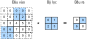

# Đệm và sải chân
:label:`sec_padding`

Trong ví dụ trước của :numref:`fig_correlation`, đầu vào của chúng tôi có cả chiều cao và chiều rộng của 3 và hạt nhân phức tạp của chúng tôi có cả chiều cao và chiều rộng 2, mang lại một biểu diễn đầu ra với chiều $2\times2$. Như chúng ta tổng quát trong :numref:`sec_conv_layer`, giả sử rằng hình dạng đầu vào là $n_h\times n_w$ và hình dạng hạt nhân phức tạp là $k_h\times k_w$, sau đó hình dạng đầu ra sẽ là $(n_h-k_h+1) \times (n_w-k_w+1)$. Do đó, hình dạng đầu ra của lớp phức hợp được xác định bởi hình dạng của đầu vào và hình dạng của hạt nhân phức tạp. 

Trong một số trường hợp, chúng tôi kết hợp các kỹ thuật, bao gồm padding và strided convolutions, ảnh hưởng đến kích thước của đầu ra. Là động lực, lưu ý rằng vì hạt nhân thường có chiều rộng và chiều cao lớn hơn $1$, sau khi áp dụng nhiều phức tạp liên tiếp, chúng ta có xu hướng cuộn lên với các đầu ra nhỏ hơn đáng kể so với đầu vào của chúng tôi. Nếu chúng ta bắt đầu với một hình ảnh $240 \times 240$ pixel, $10$ lớp $5 \times 5$ làm giảm hình ảnh xuống $200 \times 200$ pixel, cắt giảm $30\% $ của hình ảnh và với nó xóa bỏ bất kỳ thông tin thú vị nào về ranh giới của hình ảnh gốc.
*Padding* là công cụ phổ biến nhất để xử lý vấn đề này.

Trong các trường hợp khác, chúng ta có thể muốn giảm kích thước một cách đáng kể, ví dụ, nếu chúng ta thấy độ phân giải đầu vào ban đầu là khó sử dụng.
*Sự phức tạp sóng* là một kỹ thuật phổ biến có thể giúp ích trong những trường hợp này.

## Đệm

Như đã mô tả ở trên, một vấn đề khó khăn khi áp dụng các lớp phức tạp là chúng ta có xu hướng mất pixel trên chu vi của hình ảnh của chúng ta. Vì chúng ta thường sử dụng hạt nhân nhỏ, đối với bất kỳ sự phức tạp nhất định nào, chúng ta có thể chỉ mất một vài pixel, nhưng điều này có thể cộng lại khi chúng ta áp dụng nhiều lớp phức tạp liên tiếp. Một giải pháp đơn giản cho vấn đề này là thêm các pixel phụ xung quanh ranh giới của hình ảnh đầu vào của chúng ta, do đó làm tăng kích thước hiệu quả của hình ảnh. Thông thường, chúng tôi đặt các giá trị của các pixel bổ sung thành 0. Trong :numref:`img_conv_pad`, chúng tôi pad một $3 \times 3$ đầu vào, tăng kích thước của nó lên $5 \times 5$. Đầu ra tương ứng sau đó tăng lên ma trận $4 \times 4$. Các phần bóng mờ là phần tử đầu ra đầu tiên cũng như các phần tử tensor đầu vào và hạt nhân được sử dụng cho tính toán đầu ra: $0\times0+0\times1+0\times2+0\times3=0$. 


:label:`img_conv_pad`

Nói chung, nếu chúng ta thêm tổng cộng $p_h$ hàng đệm (khoảng một nửa ở trên cùng và một nửa ở dưới cùng) và tổng cộng $p_w$ cột đệm (khoảng một nửa ở bên trái và một nửa bên phải), hình dạng đầu ra sẽ là 

$$(n_h-k_h+p_h+1)\times(n_w-k_w+p_w+1).$$

Điều này có nghĩa là chiều cao và chiều rộng của đầu ra sẽ tăng lần lượt là $p_h$ và $p_w$. 

Trong nhiều trường hợp, chúng tôi sẽ muốn đặt $p_h=k_h-1$ và $p_w=k_w-1$ để cung cấp cho đầu vào và đầu ra cùng chiều cao và chiều rộng. Điều này sẽ giúp dự đoán hình dạng đầu ra của mỗi lớp dễ dàng hơn khi xây dựng mạng. Giả sử rằng $k_h$ là lẻ ở đây, chúng tôi sẽ pad $p_h/2$ hàng trên cả hai mặt của chiều cao. Nếu $k_h$ là chẵn, một khả năng là pad $\lceil p_h/2\rceil$ hàng trên đầu vào và $\lfloor p_h/2\rfloor$ hàng ở phía dưới. Chúng tôi sẽ pad cả hai mặt của chiều rộng theo cùng một cách. 

CNN thường sử dụng hạt nhân phức tạp với các giá trị chiều cao và chiều rộng lẻ, chẳng hạn như 1, 3, 5 hoặc 7. Chọn kích thước hạt nhân lẻ có lợi ích là chúng ta có thể giữ nguyên chiều không gian trong khi đệm với cùng số hàng ở trên và dưới cùng, và cùng một số cột ở bên trái và bên phải. 

Hơn nữa, thực hành này sử dụng hạt nhân lẻ và đệm để bảo tồn chính xác chiều hướng mang lại lợi ích văn thư. Đối với bất kỳ tensor hai chiều nào `X`, khi kích thước của hạt nhân là lẻ và số lượng hàng và cột đệm ở tất cả các mặt đều giống nhau, tạo ra một đầu ra có cùng chiều cao và chiều rộng với đầu vào, chúng ta biết rằng đầu ra `Y[i, j]` được tính bằng tương quan chéo của hạt nhân đầu vào và kết hợp với cửa sổ tập trung vào `X[i, j]`. 

Trong ví dụ sau, chúng ta tạo ra một lớp ghép hai chiều với chiều cao và chiều rộng là 3 và (** áp dụng 1 pixel đệm trên tất cả các bên. **) Cho một đầu vào có chiều cao và chiều rộng 8, chúng ta thấy rằng chiều cao và chiều rộng của đầu ra cũng là 8.

```{.python .input}
from mxnet import np, npx
from mxnet.gluon import nn
npx.set_np()

# For convenience, we define a function to calculate the convolutional layer.
# This function initializes the convolutional layer weights and performs
# corresponding dimensionality elevations and reductions on the input and
# output
def comp_conv2d(conv2d, X):
    conv2d.initialize()
    # Here (1, 1) indicates that the batch size and the number of channels
    # are both 1
    X = X.reshape((1, 1) + X.shape)
    Y = conv2d(X)
    # Exclude the first two dimensions that do not interest us: examples and
    # channels
    return Y.reshape(Y.shape[2:])

# Note that here 1 row or column is padded on either side, so a total of 2
# rows or columns are added
conv2d = nn.Conv2D(1, kernel_size=3, padding=1)
X = np.random.uniform(size=(8, 8))
comp_conv2d(conv2d, X).shape
```

```{.python .input}
#@tab pytorch
import torch
from torch import nn

# We define a convenience function to calculate the convolutional layer. This
# function initializes the convolutional layer weights and performs
# corresponding dimensionality elevations and reductions on the input and
# output
def comp_conv2d(conv2d, X):
    # Here (1, 1) indicates that the batch size and the number of channels
    # are both 1
    X = X.reshape((1, 1) + X.shape)
    Y = conv2d(X)
    # Exclude the first two dimensions that do not interest us: examples and
    # channels
    return Y.reshape(Y.shape[2:])
# Note that here 1 row or column is padded on either side, so a total of 2
# rows or columns are added
conv2d = nn.Conv2d(1, 1, kernel_size=3, padding=1)
X = torch.rand(size=(8, 8))
comp_conv2d(conv2d, X).shape
```

```{.python .input}
#@tab tensorflow
import tensorflow as tf

# We define a convenience function to calculate the convolutional layer. This
# function initializes the convolutional layer weights and performs
# corresponding dimensionality elevations and reductions on the input and
# output
def comp_conv2d(conv2d, X):
    # Here (1, 1) indicates that the batch size and the number of channels
    # are both 1
    X = tf.reshape(X, (1, ) + X.shape + (1, ))
    Y = conv2d(X)
    # Exclude the first two dimensions that do not interest us: examples and
    # channels
    return tf.reshape(Y, Y.shape[1:3])
# Note that here 1 row or column is padded on either side, so a total of 2
# rows or columns are added
conv2d = tf.keras.layers.Conv2D(1, kernel_size=3, padding='same')
X = tf.random.uniform(shape=(8, 8))
comp_conv2d(conv2d, X).shape
```

Khi chiều cao và chiều rộng của hạt nhân phức tạp khác nhau, chúng ta có thể làm cho đầu ra và đầu vào có cùng chiều cao và chiều rộng bằng cách [** thiết lập các số đệm khác nhau cho chiều cao và chiều rộng.**]

```{.python .input}
# Here, we use a convolution kernel with a height of 5 and a width of 3. The
# padding numbers on either side of the height and width are 2 and 1,
# respectively
conv2d = nn.Conv2D(1, kernel_size=(5, 3), padding=(2, 1))
comp_conv2d(conv2d, X).shape
```

```{.python .input}
#@tab pytorch
# Here, we use a convolution kernel with a height of 5 and a width of 3. The
# padding numbers on either side of the height and width are 2 and 1,
# respectively
conv2d = nn.Conv2d(1, 1, kernel_size=(5, 3), padding=(2, 1))
comp_conv2d(conv2d, X).shape
```

```{.python .input}
#@tab tensorflow
# Here, we use a convolution kernel with a height of 5 and a width of 3. The
# padding numbers on either side of the height and width are 2 and 1,
# respectively
conv2d = tf.keras.layers.Conv2D(1, kernel_size=(5, 3), padding='same')
comp_conv2d(conv2d, X).shape
```

## Sải chân

Khi tính toán tương quan chéo, chúng ta bắt đầu với cửa sổ covolution ở góc trên bên trái của tensor đầu vào, và sau đó trượt nó trên tất cả các vị trí cả xuống và bên phải. Trong các ví dụ trước, chúng ta mặc định trượt một phần tử tại một thời điểm. Tuy nhiên, đôi khi, cho hiệu quả tính toán hoặc vì chúng tôi muốn hạ mẫu, chúng tôi di chuyển cửa sổ của chúng tôi nhiều hơn một phần tử tại một thời điểm, bỏ qua các vị trí trung gian. 

Chúng tôi đề cập đến số lượng hàng và cột đi qua trên mỗi slide là * stride*. Cho đến nay, chúng tôi đã sử dụng các bước tiến của 1, cả về chiều cao và chiều rộng. Đôi khi, chúng ta có thể muốn sử dụng một sải chân lớn hơn. :numref:`img_conv_stride` cho thấy một hoạt động tương quan chéo hai chiều với một sải chân 3 theo chiều dọc và 2 chiều ngang. Các phần bóng mờ là các phần tử đầu ra cũng như các phần tử tensor đầu vào và hạt nhân được sử dụng cho tính toán đầu ra: $0\times0+0\times1+1\times2+2\times3=8$, $0\times0+6\times1+0\times2+0\times3=6$. Chúng ta có thể thấy rằng khi phần tử thứ hai của cột đầu tiên được xuất ra, cửa sổ covolution trượt xuống ba hàng. Cửa sổ phức tạp trượt hai cột sang phải khi phần tử thứ hai của hàng đầu tiên được xuất ra. Khi cửa sổ covolution tiếp tục trượt hai cột sang phải trên đầu vào, không có đầu ra vì phần tử đầu vào không thể điền vào cửa sổ (trừ khi chúng ta thêm một cột đệm khác). 


:label:`img_conv_stride`

Nói chung, khi sải chân cho chiều cao là $s_h$ và sải chân cho chiều rộng là $s_w$, hình dạng đầu ra là 

$$\lfloor(n_h-k_h+p_h+s_h)/s_h\rfloor \times \lfloor(n_w-k_w+p_w+s_w)/s_w\rfloor.$$

Nếu chúng ta đặt $p_h=k_h-1$ và $p_w=k_w-1$, thì hình dạng đầu ra sẽ được đơn giản hóa thành $\lfloor(n_h+s_h-1)/s_h\rfloor \times \lfloor(n_w+s_w-1)/s_w\rfloor$. Tiến thêm một bước, nếu chiều cao và chiều rộng đầu vào được chia hết bởi các bước nhảy trên chiều cao và chiều rộng, thì hình dạng đầu ra sẽ là $(n_h/s_h) \times (n_w/s_w)$. 

Dưới đây, chúng tôi [** đặt các bước tiến trên cả chiều cao và chiều rộng thành 2**], do đó giảm một nửa chiều cao và chiều rộng đầu vào.

```{.python .input}
conv2d = nn.Conv2D(1, kernel_size=3, padding=1, strides=2)
comp_conv2d(conv2d, X).shape
```

```{.python .input}
#@tab pytorch
conv2d = nn.Conv2d(1, 1, kernel_size=3, padding=1, stride=2)
comp_conv2d(conv2d, X).shape
```

```{.python .input}
#@tab tensorflow
conv2d = tf.keras.layers.Conv2D(1, kernel_size=3, padding='same', strides=2)
comp_conv2d(conv2d, X).shape
```

Tiếp theo, chúng ta sẽ xem xét (** một ví dụ phức tạp hơn**).

```{.python .input}
conv2d = nn.Conv2D(1, kernel_size=(3, 5), padding=(0, 1), strides=(3, 4))
comp_conv2d(conv2d, X).shape
```

```{.python .input}
#@tab pytorch
conv2d = nn.Conv2d(1, 1, kernel_size=(3, 5), padding=(0, 1), stride=(3, 4))
comp_conv2d(conv2d, X).shape
```

```{.python .input}
#@tab tensorflow
conv2d = tf.keras.layers.Conv2D(1, kernel_size=(3,5), padding='valid',
                                strides=(3, 4))
comp_conv2d(conv2d, X).shape
```

Vì lợi ích của ngắn gọn, khi số đệm ở cả hai mặt của chiều cao và chiều rộng đầu vào lần lượt là $p_h$ và $p_w$, chúng tôi gọi là đệm $(p_h, p_w)$. Cụ thể, khi $p_h = p_w = p$, đệm là $p$. Khi các bước tiến trên chiều cao và chiều rộng là $s_h$ và $s_w$, tương ứng, chúng tôi gọi sải chân $(s_h, s_w)$. Cụ thể, khi $s_h = s_w = s$, sải chân là $s$. Theo mặc định, đệm là 0 và sải chân là 1. Trong thực tế, chúng ta hiếm khi sử dụng các bước tiến hoặc đệm không đồng nhất, tức là, chúng ta thường có $p_h = p_w$ và $s_h = s_w$. 

## Tóm tắt

* Đệm có thể làm tăng chiều cao và chiều rộng của đầu ra. Điều này thường được sử dụng để cung cấp cho đầu ra cùng chiều cao và chiều rộng như đầu vào.
* Sải chân có thể làm giảm độ phân giải của đầu ra, ví dụ giảm chiều cao và chiều rộng của đầu ra xuống chỉ $1/n$ chiều cao và chiều rộng của đầu vào ($n$ là một số nguyên lớn hơn $1$).
* Đệm và sải chân có thể được sử dụng để điều chỉnh kích thước của dữ liệu một cách hiệu quả.

## Bài tập

1. Đối với ví dụ cuối cùng trong phần này, sử dụng toán học để tính hình dạng đầu ra để xem nó có phù hợp với kết quả thực nghiệm hay không.
1. Hãy thử các kết hợp đệm và sải chân khác trên các thí nghiệm trong phần này.
1. Đối với tín hiệu âm thanh, một sải chân của 2 tương ứng với những gì?
1. Những lợi ích tính toán của một sải chân lớn hơn 1 là gì?

:begin_tab:`mxnet`
[Discussions](https://discuss.d2l.ai/t/67)
:end_tab:

:begin_tab:`pytorch`
[Discussions](https://discuss.d2l.ai/t/68)
:end_tab:

:begin_tab:`tensorflow`
[Discussions](https://discuss.d2l.ai/t/272)
:end_tab:
