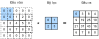

<!-- ===================== Bắt đầu dịch Phần 1 ==================== -->
<!-- ========================================= REVISE PHẦN 1 - BẮT ĐẦU =================================== -->

<!--
# Padding and Stride
-->

# Đệm và Sải Bước
:label:`sec_padding`

<!--
In the previous example, our input had both a height and width of $3$ and our convolution kernel had both a height and width of $2$, yielding an output representation with dimension $2\times2$.
In general, assuming the input shape is $n_h\times n_w$ and the convolution kernel window shape is $k_h\times k_w$, then the output shape will be
-->

Trong ví dụ trước, đầu vào có cả chiều dài và chiều rộng cùng bằng $3$, cửa sổ hạt nhân tích chập có cả chiều dài và chiều rộng cùng bằng $2$, nên ta thu được biểu diễn đầu ra có kích thước $2\times2$.
Nói chung, giả sử kích thước của đầu vào là $n_h\times n_w$ và kích thước của cửa sổ hạt nhân tích chập là $k_h\times k_w$, kích thước của đầu ra sẽ là: 

$$(n_h-k_h+1) \times (n_w-k_w+1).$$

<!--
Therefore, the output shape of the convolutional layer is determined by the shape of the input and the shape of the convolution kernel window.
-->

Do đó, kích thước của đầu ra tầng tích chập được xác định bởi kích thước đầu vào và kích thước cửa sổ hạt nhân tích chập.

<!--
In several cases, we incorporate techniques, including padding and strided convolutions, that affect the size of the output.
As motivation, note that since kernels generally have width and height greater than $1$, after applying many successive convolutions,
we tend to wind up with outputs that are considerably smaller than our input.
If we start with a $240 \times 240$ pixel image, $10$ layers of $5 \times 5$ convolutions reduce the image to $200 \times 200$ pixels, 
slicing off $30 \%$ of the image and with it obliterating any interesting information on the boundaries of the original image. 
*Padding* is the most popular tool for handling this issue.
-->

Trong vài trường hợp, ta sẽ kết hợp thêm các kỹ thuật khác cũng có ảnh hưởng tới kích thước của đầu ra, như thêm phần đệm và phép tích chập sải bước.
Lưu ý rằng vì các hạt nhân thường có chiều rộng và chiều cao lớn hơn $1$ nên sau khi áp dụng nhiều phép tích chập liên tiếp, đầu ra thường có kích thước nhỏ hơn đáng kể so với đầu vào.
Nếu ta bắt đầu với một ảnh có $240 \times 240$ điểm ảnh và áp dụng $10$ tầng tích chập có kích thước $5 \times 5$ thì kích thước ảnh này sẽ giảm xuống $200 \times 200$ điểm ảnh, 
$30 \%$ của ảnh sẽ bị cắt bỏ và mọi thông tin có ích trên viền của ảnh gốc sẽ bị xóa sạch.
*Đệm* là công cụ phổ biến nhất để xử lý vấn đề này.

<!--
In other cases, we may want to reduce the dimensionality drastically, e.g., if we find the original input resolution to be unwieldy. 
*Strided convolutions* are a popular technique that can help in these instances.
-->

Trong những trường hợp khác, ta có thể muốn giảm đáng kể kích thước ảnh, ví dụ như khi độ phân giải của đầu vào quá cao.
*Phép tích chập sải bước (Strided convolution)* là một kỹ thuật phổ biến có thể giúp ích trong trường hợp này.

<!-- ===================== Kết thúc dịch Phần 1 ===================== -->

<!-- ===================== Bắt đầu dịch Phần 2 ===================== -->

<!--
## Padding
-->

## Đệm

<!--
As described above, one tricky issue when applying convolutional layers is that we tend to lose pixels on the perimeter of our image.
Since we typically use small kernels, for any given convolution, we might only lose a few pixels, but this can add up as we apply many successive convolutional layers.
One straightforward solution to this problem is to add extra pixels of filler around the boundary of our input image, thus increasing the effective size of the image.
Typically, we set the values of the extra pixels to $0$.
In :numref:`img_conv_pad`, we pad a $3 \times 3$ input, increasing its size to $5 \times 5$.
The corresponding output then increases to a $4 \times 4$ matrix.
-->

Như mô tả ở trên, một vấn đề rắc rối khi áp dụng các tầng tích chập là việc chúng ta có thể mất một số điểm ảnh trên biên của ảnh.
Vì chúng ta thường sử dụng các hạt nhân nhỏ, với một phép tích chập ta có thể chỉ mất một ít điểm ảnh, tuy nhiên sự mất mát này có thể tích lũy dần khi ta thực hiện qua nhiều tầng tích chập liên tiếp.
Một giải pháp đơn giản cho vấn đề này là chèn thêm các điểm ảnh xung quanh đường biên trên bức ảnh đầu vào, nhờ đó làm tăng kích thước sử dụng của bức ảnh. 
Thông thường, chúng ta thiết lập các giá trị của các điểm ảnh thêm vào là $0$.
Trong :numref:`img_conv_pad`, ta đệm một đầu vào $3 \times 3$, làm tăng kích thước lên thành $5 \times 5$.
Đầu ra tương ứng sẽ tăng lên thành một ma trận $4 \times 4$.

<!--

-->

 
:label:`img_conv_pad`

<!--
In general, if we add a total of $p_h$ rows of padding (roughly half on top and half on bottom) and 
a total of $p_w$ columns of padding (roughly half on the left and half on the right), the output shape will be
-->

Nhìn chung nếu chúng ta chèn thêm tổng cộng $p_h$ hàng đệm (phân nửa ở phía trên và phân nửa ở phía dưới) và $p_w$ cột đệm (phân nửa bên trái và phân nửa bên phải), kích thước đầu ra sẽ là: 

$$(n_h-k_h+p_h+1)\times(n_w-k_w+p_w+1).$$

<!--
This means that the height and width of the output will increase by $p_h$ and $p_w$ respectively.
-->

Điều này có nghĩa là chiều cao và chiều rộng của đầu ra sẽ tăng thêm lần lượt là $p_h$ và $p_w$. 

<!--
In many cases, we will want to set $p_h=k_h-1$ and $p_w=k_w-1$ to give the input and output the same height and width.
This will make it easier to predict the output shape of each layer when constructing the network.
Assuming that $k_h$ is even here, we will pad $p_h/2$ rows on both sides of the height.
If $k_h$ is odd, one possibility is to pad $\lceil p_h/2\rceil$ rows on the top of the input and $\lfloor p_h/2\rfloor$ rows on the bottom.
We will pad both sides of the width in the same way.
-->

Trong nhiều trường hợp, ta sẽ muốn thiết lập $p_h=k_h-1$ và $p_w=w_k-1$ để đầu vào và đầu ra có cùng chiều dài và chiều rộng.
Điều này sẽ giúp việc dự đoán kích thước đầu ra của mỗi tầng dễ dàng hơn khi ta xây dựng mạng.
Giả sử $k_h$ ở đây chẵn, ta sẽ chèn $p_h/2$ hàng ở cả phía trên và phía dưới.
Nếu $k_h$ lẻ, ta có thể chèn $\lceil p_h/2\rceil$ hàng ở phía trên của đầu vào và $\lfloor p_h/2\rfloor$ hàng cho phía dưới.
Chúng ta cũng thực hiện chèn cả hai bên của chiều ngang tương tự như vậy.

<!-- ===================== Kết thúc dịch Phần 2 ===================== -->

<!-- ===================== Bắt đầu dịch Phần 3 ===================== -->

<!--
Convolutional neural networks commonly use convolutional kernels with odd height and width values, such as $1$, $3$, $5$, or $7$.
Choosing odd kernel sizes has the benefit that we can preserve the spatial dimensionality while padding with the same number of rows on top and bottom, and the same number of columns on left and right.
-->

Các mạng nơ-ron tích chập thường sử dụng các hạt nhân tích chập với chiều dài và chiều rộng là số lẻ, như $1$, $3$, $5$ hay $7$.
Việc chọn hạt nhân có kích thước lẻ giúp chúng ta bảo toàn được các chiều không gian khi thêm cùng số hàng đệm cho cạnh trên và dưới, và thêm cùng số cột đệm cho cạnh trái và phải.

<!--
Moreover, this practice of using odd kernels and padding to precisely preserve dimensionality offers a clerical benefit.
For any two-dimensional array `X`, when the kernels size is odd and the number of padding rows and columns on all sides are the same, 
producing an output with the same height and width as the input, 
we know that the output `Y[i, j]` is calculated by cross-correlation of the input and convolution kernel with the window centered on `X[i, j]`.
-->

Hơn nữa, việc sử dụng bộ lọc kích thước lẻ cùng đệm để giữ nguyên số chiều mang lại một lợi ích khác.
Với mảng hai chiều `X` bất kì, khi kích thước bộ lọc lẻ và số hàng và số cột đệm bằng nhau, thu được đầu ra có cùng chiều dài và chiều rộng với đầu vào, 
ta sẽ biết chắc chắn rằng mỗi phần tử đầu ra `Y[i, j]` được tính bằng phép tương quan chéo giữa đầu vào và hạt nhân tích chập có tâm nằm tại `X[i, j]`.

<!--
In the following example, we create a two-dimensional convolutional layer with a height and width of $3$ and apply $1$ pixel of padding on all sides.
Given an input with a height and width of $8$, we find that the height and width of the output is also $8$.
-->

Trong ví dụ dưới, chúng ta tạo một tầng tích chập hai chiều với chiều dài và chiều rộng $3$ và đệm $1$ điểm ảnh vào viền các cạnh.
Với đầu vào có chiều dài và chiều rộng là $8$, ta thấy rằng chiều dài và chiều rộng đầu ra cũng là $8$.


```{.python .input  n=1}
from mxnet import np, npx
from mxnet.gluon import nn
npx.set_np()

# For convenience, we define a function to calculate the convolutional layer.
# This function initializes the convolutional layer weights and performs
# corresponding dimensionality elevations and reductions on the input and
# output
def comp_conv2d(conv2d, X):
    conv2d.initialize()
    # (1, 1) indicates that the batch size and the number of channels
    # (described in later chapters) are both 1
    X = X.reshape((1, 1) + X.shape)
    Y = conv2d(X)
    # Exclude the first two dimensions that do not interest us: batch and
    # channel
    return Y.reshape(Y.shape[2:])

# Note that here 1 row or column is padded on either side, so a total of 2
# rows or columns are added
conv2d = nn.Conv2D(1, kernel_size=3, padding=1)
X = np.random.uniform(size=(8, 8))
comp_conv2d(conv2d, X).shape
```

<!--
When the height and width of the convolution kernel are different,
we can make the output and input have the same height and width by setting different padding numbers for height and width.
-->

Khi chiều dài và chiều rộng của hạt nhân tích chập khác nhau, 
chúng ta có thể chỉnh chiều dài và chiều rộng khác nhau cho phần đệm để đầu vào và đầu ra có cùng kích thước.

```{.python .input  n=2}
# Here, we use a convolution kernel with a height of 5 and a width of 3. The
# padding numbers on both sides of the height and width are 2 and 1,
# respectively
conv2d = nn.Conv2D(1, kernel_size=(5, 3), padding=(2, 1))
comp_conv2d(conv2d, X).shape
```

<!-- ===================== Kết thúc dịch Phần 3 ===================== -->

<!-- ===================== Bắt đầu dịch Phần 4 ===================== -->

<!-- ========================================= REVISE PHẦN 1 - KẾT THÚC ===================================-->

<!-- ========================================= REVISE PHẦN 2 - BẮT ĐẦU ===================================-->

<!--
## Stride
-->

## Sải bước

<!--
When computing the cross-correlation, we start with the convolution window at the top-left corner of the input array, and then slide it over all locations both down and to the right.
In previous examples, we default to sliding one pixel at a time.
However, sometimes, either for computational efficiency or because we wish to downsample, we move our window more than one pixel at a time, skipping the intermediate locations.
-->

Khi thực hiện phép tương quan chéo, ta bắt đầu với cửa sổ tích chập tại góc trên bên trái của mảng đầu vào, rồi di chuyển sang phải và xuống dưới qua tất cả các vị trí.
Trong các ví dụ trước, ta mặc định di chuyển qua một điểm ảnh mỗi lần.
Tuy nhiên, có những lúc để tăng hiệu suất tính toán hoặc vì muốn giảm kích thước của ảnh, ta di chuyển cửa sổ tích chập nhiều hơn một điểm ảnh mỗi lần, bỏ qua các vị trí ở giữa.

<!--
We refer to the number of rows and columns traversed per slide as the *stride*.
So far, we have used strides of $1$, both for height and width.
Sometimes, we may want to use a larger stride.
:numref:`img_conv_stride` shows a two-dimensional cross-correlation operation with a stride of $3$ vertically and $2$ horizontally.
We can see that when the second element of the first column is output, the convolution window slides down three rows.
The convolution window slides two columns to the right when the second element of the first row is output.
When the convolution window slides three columns to the right on the input, there is no output because the input element cannot fill the window (unless we add another column of padding).
-->

Ta gọi số hàng và cột di chuyển qua mỗi lần là *sải bước* (_stride_).
Cho đến giờ, chúng ta sử dụng sải bước $1$ cho cả chiều dài và chiều rộng.
Đôi lúc, chúng ta có thể muốn sử dụng sải bước lớn hơn.
:numref:`img_conv_stride` biểu diễn phép tương quan chéo hai chiều với sải bước $3$ theo chiều dọc và $2$ theo chiều ngang.
Có thể thấy rằng khi tính giá trị phần tử thứ hai của cột đầu tiên, cửa sổ tích chập di chuyển xuống ba hàng.
Cửa sổ này di chuyển sang phải hai cột khi tính giá trị phần tử thứ hai của hàng đầu tiên.
Khi cửa sổ di chuyển sang phải ba cột ở đầu vào, giá trị đầu ra không tồn tại vì các phần tử đầu vào không lấp đầy cửa sổ (trừ khi ta thêm một cột đệm).

<!--

-->


:label:`img_conv_stride`

<!-- ===================== Kết thúc dịch Phần 4 ===================== -->

<!-- ===================== Bắt đầu dịch Phần 5 ===================== -->

<!--
In general, when the stride for the height is $s_h$ and the stride for the width is $s_w$, the output shape is
-->

Nhìn chung, khi sải bước theo chiều cao là $s_h$ và sải bước theo chiều rộng là $s_w$, kích thước đầu ra là:

$$\lfloor(n_h-k_h+p_h+s_h)/s_h\rfloor \times \lfloor(n_w-k_w+p_w+s_w)/s_w\rfloor.$$

<!--
If we set $p_h=k_h-1$ and $p_w=k_w-1$, then the output shape will be simplified to $\lfloor(n_h+s_h-1)/s_h\rfloor \times \lfloor(n_w+s_w-1)/s_w\rfloor$.
Going a step further, if the input height and width are divisible by the strides on the height and width, then the output shape will be $(n_h/s_h) \times (n_w/s_w)$.
-->

Nếu đặt $p_h=k_h-1$ và $p_w=k_w-1$, kích thước đầu ra sẽ được thu gọn thành $\lfloor(n_h+s_h-1)/s_h\rfloor \times \lfloor(n_w+s_w-1)/s_w\rfloor$.
Hơn nữa, nếu chiều cao và chiều rộng của đầu vào chia hết cho sải bước theo chiều cao và chiều rộng tương ứng thì kích thước đầu ra sẽ là $(n_h/s_h) \times (n_w/s_w)$.

<!--
Below, we set the strides on both the height and width to $2$, thus halving the input height and width.
-->

Dưới đây, chúng ta đặt sải bước cho cả chiều cao và chiều rộng là $2$, do đó chiều cao và chiều rộng của đầu ra bằng một nửa chiều cao và chiều rộng của đầu vào.


```{.python .input}
conv2d = nn.Conv2D(1, kernel_size=3, padding=1, strides=2)
comp_conv2d(conv2d, X).shape
```

<!--
Next, we will look at a slightly more complicated example.
-->

Tiếp theo, chúng ta sẽ xem xét một ví dụ phức tạp hơn một chút. 

```{.python .input  n=3}
conv2d = nn.Conv2D(1, kernel_size=(3, 5), padding=(0, 1), strides=(3, 4))
comp_conv2d(conv2d, X).shape
```

<!--
For the sake of brevity, when the padding number on both sides of the input height and width are $p_h$ and $p_w$ respectively, we call the padding $(p_h, p_w)$.
Specifically, when $p_h = p_w = p$, the padding is $p$.
When the strides on the height and width are $s_h$ and $s_w$, respectively, we call the stride $(s_h, s_w)$.
Specifically, when $s_h = s_w = s$, the stride is $s$.
By default, the padding is $0$ and the stride is $1$.
In practice, we rarely use inhomogeneous strides or padding, i.e., we usually have $p_h = p_w$ and $s_h = s_w$.
-->

Để đơn giản hóa vấn đề, khi phần đệm theo chiều cao và chiều rộng của đầu vào lần lượt là $p_h$ và $p_w$, chúng ta sẽ kí hiệu phần đệm là $(p_h, p_w)$.
Ở trường hợp đặc biệt khi $p_h = p_w = p$, ta kí hiệu phần đệm là $p$.
Khi sải bước trên chiều cao và chiều rộng lần lượt là $s_h$ và $s_w$, chúng ta kí hiệu sải bước là $(s_h, s_w)$.
Ở trường hợp đặc biệt khi $s_h = s_w = s$, ta kí hiệu sải bước là $s$.
Mặc định, phần đệm là $0$ và sải bước là $1$.
Trên thực tế, ít khi chúng ta sử dụng các giá trị khác nhau cho sải bước hoặc phần đệm, tức ta thường đặt $p_h = p_w$ và $s_h = s_w$.

<!-- ===================== Kết thúc dịch Phần 5 ===================== -->

<!-- ===================== Bắt đầu dịch Phần 6 ===================== -->

<!--
## Summary
-->

## Tóm tắt

<!--
* Padding can increase the height and width of the output. This is often used to give the output the same height and width as the input.
* The stride can reduce the resolution of the output, for example reducing the height and width of the output to only $1/n$ of the height and width of the input ($n$ is an integer greater than $1$).
* Padding and stride can be used to adjust the dimensionality of the data effectively.
-->

* Phần đệm có thể tăng chiều cao vào chiều rộng của đầu ra. Nó thường được sử dụng để đầu ra có cùng kích thước với đầu vào.
* Sải bước có thể giảm độ phân giải của đầu ra, ví dụ giảm chiều cao và chiều rộng của đầu ra xuống $1/n$ chiều cao và chiều rộng của đầu vào ($n$ là một số nguyên lớn hơn $1$).
* Đệm và sải bước có thể được dùng để điều chỉnh kích thước chiều của dữ liệu một cách hiệu quả.

<!--
## Exercises
-->

## Bài tập

<!--
1. For the last example in this section, use the shape calculation formula to calculate the output shape to see if it is consistent with the experimental results.
2. Try other padding and stride combinations on the experiments in this section.
3. For audio signals, what does a stride of $2$ correspond to?
4. What are the computational benefits of a stride larger than $1$.
-->

1. Trong ví dụ cuối của phần này, tính kích thước đầu ra bằng công thức và xác nhận lại với kết quả khi chạy mã nguồn.
2. Thử các cách kết hợp đệm và sải bước khác trong các ví dụ ở phần này.
3. Với các tín hiệu âm thanh, sải bước bằng $2$ tương ứng với điều gì?
4. Có những lợi ích nào về mặt tính toán khi sử dụng sải bước lớn hơn $1$?


<!-- ===================== Kết thúc dịch Phần 6 ===================== -->
<!-- ========================================= REVISE PHẦN 2 - KẾT THÚC ===================================-->

## Thảo luận
* [Tiếng Anh](https://discuss.mxnet.io/t/2350)
* [Tiếng Việt](https://forum.machinelearningcoban.com/c/d2l)

## Những người thực hiện
Bản dịch trong trang này được thực hiện bởi:

* Đoàn Võ Duy Thanh
* Nguyễn Duy Du
* Nguyễn Lê Quang Nhật
* Nguyễn Văn Cường
* Lê Khắc Hồng Phúc
* Phạm Hồng Vinh
* Nguyễn Thành Hưng
