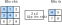

<!-- ===================== Bắt đầu dịch Phần 1 ==================== -->
<!-- ========================================= REVISE PHẦN 1 - BẮT ĐẦU =================================== -->

<!--
# Pooling
-->

# Gộp (*Pooling*)
:label:`sec_pooling`


<!--
Often, as we process images, we want to gradually reduce the spatial resolution of our hidden representations, 
aggregating information so that the higher up we go in the network, the larger the receptive field (in the input) to which each hidden node is sensitive.
-->

Khi xử lý ảnh, ta thường muốn giảm dần độ phân giải không gian của các biểu diễn ẩn, tổng hợp thông tin lại để khi càng đi sâu vào mạng, vùng tiếp nhận (ở đầu vào) ảnh hưởng đến mỗi nút ẩn càng lớn.

<!--
Often our ultimate task asks some global question about the image, e.g., *does it contain a cat?*
So typically the nodes of our final layer should be sensitive to the entire input.
By gradually aggregating information, yielding coarser and coarser maps, we accomplish this goal of ultimately learning a global representation,
while keeping all of the advantages of convolutional layers at the intermediate layers of processing.
-->

Nhiệm vụ cuối cùng thường là trả lời một câu hỏi nào đó về toàn bộ tấm ảnh, ví dụ như: *trong ảnh có mèo không?*
Vậy nên các nút của tầng cuối cùng thường cần phải chịu ảnh hưởng của toàn bộ đầu vào.
Bằng cách dần gộp thông tin lại để tạo ra các ánh xạ đặc trưng thưa dần, ta sẽ học được một biểu diễn toàn cục,
trong khi vẫn có thể giữ nguyên toàn bộ lợi thế đến từ các tầng tích chập xử lý trung gian.

<!--
Moreover, when detecting lower-level features, such as edges (as discussed in :numref:`sec_conv_layer`),
we often want our representations to be somewhat invariant to translation.
For instance, if we take the image `X` with a sharp delineation between black and white
and shift the whole image by one pixel to the right, i.e., `Z[i, j] = X[i, j+1]`, then the output for the new image `Z` might be vastly different.
The edge will have shifted by one pixel and with it all the activations.
In reality, objects hardly ever occur exactly at the same place.
In fact, even with a tripod and a stationary object, vibration of the camera due to the movement of the shutter might shift everything by a pixel or so
(high-end cameras are loaded with special features to address this problem).
-->

Hơn nữa, khi phát hiện các đặc trưng cấp thấp như cạnh (được thảo luận tại :numref:`sec_conv_layer`), 
ta thường muốn cách biểu diễn này bất biến với phép tịnh tiến trong một chừng mực nào đó.
Ví dụ, nếu ta lấy ảnh `X` với một ranh giới rõ rệt giữa màu đen và màu trắng
và dịch chuyển toàn bộ tấm ảnh sang phải một điểm ảnh, tức `Z[i, j] = X[i, j+1]` thì đầu ra cho ảnh mới `Z` có thể sẽ khác đi rất nhiều.
Đường biên đó và các giá trị kích hoạt sẽ đều dịch chuyển sang một điểm ảnh.
Trong thực tế, các vật thể hiếm khi xuất hiện chính xác ở cùng một vị trí.
Thậm chí với một chân máy ảnh và một vật thể tĩnh, chuyển động của màn trập vẫn có thể làm rung máy ảnh và dịch chuyển tất cả đi một vài điểm ảnh 
(các máy ảnh cao cấp được trang bị những tính năng đặc biệt nhằm khắc phục vấn đề này).

<!--
This section introduces pooling layers, which serve the dual purposes of
mitigating the sensitivity of convolutional layers to location and of spatially downsampling representations.
-->

Trong mục này, chúng tôi sẽ giới thiệu về các tầng gộp, với hai chức năng là giảm độ nhạy cảm của các tầng tích chập đối với vị trí và giảm kích thước của các biểu diễn.

<!-- ===================== Kết thúc dịch Phần 1 ===================== -->

<!-- ===================== Bắt đầu dịch Phần 2 ===================== -->

<!--
## Maximum Pooling and Average Pooling
-->

## Gộp cực đại và Gộp trung bình

<!--
Like convolutional layers, pooling operators consist of a fixed-shape window that is slid over all regions in the input according to its stride, 
computing a single output for each location traversed by the fixed-shape window (sometimes known as the *pooling window*).
However, unlike the cross-correlation computation of the inputs and kernels in the convolutional layer, the pooling layer contains no parameters (there is no *filter*).
Instead, pooling operators are deterministic, typically calculating either the maximum or the average value of the elements in the pooling window.
These operations are called *maximum pooling* (*max pooling* for short) and *average pooling*, respectively.
-->

Giống như các tầng tích chập, các toán tử gộp bao gồm một cửa sổ có kích thước cố định được trượt trên tất cả các vùng đầu vào với giá trị sải bước nhất định, 
tính toán một giá trị đầu ra duy nhất tại mỗi vị trí mà cửa sổ (đôi lúc được gọi là *cửa sổ gộp*) trượt qua.
Tuy nhiên, không giống như phép toán tương quan chéo giữa đầu vào và hạt nhân ở tầng tích chập, tầng gộp không chứa bất kỳ tham số nào (ở đây không có "bộ lọc").
Thay vào đó, các toán tử gộp được định sẵn. Chúng thường tính giá trị cực đại hoặc trung bình của các phần tử trong cửa sổ gộp.
Các phép tính này lần lượt được gọi là là *gộp cực đại* (*max pooling*) và *gộp trung bình* (*average pooling*).

<!--
In both cases, as with the cross-correlation operator, we can think of the pooling window as starting from the top left of the input array
and sliding across the input array from left to right and top to bottom.
At each location that the pooling window hits, it computes the maximum or average
value of the input subarray in the window (depending on whether *max* or *average* pooling is employed).
-->

Trong cả hai trường hợp, giống như với toán tử tương quan chéo, ta có thể xem như cửa sổ gộp bắt đầu từ phía trên bên trái của mảng đầu vào 
và trượt qua mảng này từ trái sang phải và từ trên xuống dưới.
Ở mỗi vị trí mà cửa sổ gộp dừng, nó sẽ tính giá trị cực đại hoặc giá trị trung bình của mảng con nằm trong cửa sổ (tùy thuộc vào phép gộp được sử dụng).

<!--

-->


:label:`fig_pooling`

<!--
The output array in :numref:`fig_pooling` above has a height of 2 and a width of 2.
The four elements are derived from the maximum value of $\text{max}$:
-->

Mảng đầu ra ở :numref:`fig_pooling` phía trên có chiều cao là 2 và chiều rộng là 2.
Bốn phần tử của nó được là các giá trị cực đại của hàm $\text{max}$:

$$
\max(0, 1, 3, 4)=4,\\
\max(1, 2, 4, 5)=5,\\
\max(3, 4, 6, 7)=7,\\
\max(4, 5, 7, 8)=8.\\
$$

<!-- ===================== Kết thúc dịch Phần 2 ===================== -->

<!-- ===================== Bắt đầu dịch Phần 3 ===================== -->

<!--
A pooling layer with a pooling window shape of $p \times q$ is called a $p \times q$ pooling layer.
The pooling operation is called $p \times q$ pooling.
-->

Một tầng gộp với cửa sổ gộp có kích thước $p \times q$ được gọi là một tầng gộp $p \times q$.
Phép gộp sẽ được gọi là phép gộp $p \times q$.

<!--
Let us return to the object edge detection example mentioned at the beginning of this section.
Now we will use the output of the convolutional layer as the input for $2\times 2$ maximum pooling.
Set the convolutional layer input as `X` and the pooling layer output as `Y`. Whether or not the values of `X[i, j]` and `X[i, j+1]` are different,
or `X[i, j+1]` and `X[i, j+2]` are different, the pooling layer outputs all include `Y[i, j]=1`.
That is to say, using the $2\times 2$ maximum pooling layer, we can still detect if the pattern recognized by the convolutional layer
moves no more than one element in height and width.
-->

Hãy cùng quay trở lại với ví dụ nhận diện biên của vật thể được đề cập ở đầu mục.
Bây giờ, chúng ta sẽ sử dụng kết quả của tầng tích chập làm giá trị đầu vào cho tầng gộp cực đại $2\times 2$.
Đặt giá trị đầu vào của tầng tích chập là `X` và kết quả của tầng gộp là `Y`.
Dù giá trị của `X[i, j]` và `X[i, j+1]` hay giá trị của `X[i, j+1]` và `X[i, j+2]` có khác nhau hay không, tất cả giá trị trả về của tầng gộp sẽ là `Y[i, j]=1`.
Nói cách khác, khi sử dụng tầng gộp cực đại $2\times 2$, ta vẫn có thể phát hiện ra khuôn mẫu được nhận diện bởi tầng tích chập nếu nó bị chuyển dịch không nhiều hơn một phần tử theo chiều cao và chiều rộng.

<!--
In the code below, we implement the forward computation of the pooling layer in the `pool2d` function.
This function is similar to the `corr2d` function in :numref:`sec_conv_layer`.
However, here we have no kernel, computing the output as either the max or the average of each region in the input..
-->

Trong đoạn mã bên dưới, ta lập trình lượt truyền xuôi của tầng gộp trong hàm `pool2d`.
Hàm này khá giống với hàm `corr2d` trong :numref:`sec_conv_layer`.
Tuy nhiên, hàm này không có bộ lọc nên kết quả đầu ra hoặc là giá trị lớn nhất, hoặc là giá trị trung bình tương ứng của mỗi vùng đầu vào.

```{.python .input  n=3}
from mxnet import np, npx
from mxnet.gluon import nn
npx.set_np()

def pool2d(X, pool_size, mode='max'):
    p_h, p_w = pool_size
    Y = np.zeros((X.shape[0] - p_h + 1, X.shape[1] - p_w + 1))
    for i in range(Y.shape[0]):
        for j in range(Y.shape[1]):
            if mode == 'max':
                Y[i, j] = np.max(X[i: i + p_h, j: j + p_w])
            elif mode == 'avg':
                Y[i, j] = X[i: i + p_h, j: j + p_w].mean()
    return Y
```

<!--
We can construct the input array `X` in the above diagram to validate the output of the two-dimensional maximum pooling layer.
-->
Chúng ta có thể xây dựng mảng đầu vào `X` ở biểu đồ ở trên để kiểm tra giá trị kết quả của tầng gộp cực đại hai chiều.

```{.python .input  n=4}
X = np.array([[0, 1, 2], [3, 4, 5], [6, 7, 8]])
pool2d(X, (2, 2))
```

<!--
At the same time, we experiment with the average pooling layer.
-->
Đồng thời, chúng ta cũng thực hiện thí nghiệm với tầng gộp trung bình.

```{.python .input  n=14}
pool2d(X, (2, 2), 'avg')
```

<!-- ===================== Kết thúc dịch Phần 3 ===================== -->

<!-- ===================== Bắt đầu dịch Phần 4 ===================== -->

<!-- ========================================= REVISE PHẦN 1 - KẾT THÚC ===================================-->

<!-- ========================================= REVISE PHẦN 2 - BẮT ĐẦU ===================================-->

<!--
## Padding and Stride
-->

## Đệm và Sải bước


<!--
As with convolutional layers, pooling layers can also change the output shape.
And as before, we can alter the operation to achieve a desired output shape by padding the input and adjusting the stride.
We can demonstrate the use of padding and strides in pooling layers via the two-dimensional maximum pooling layer MaxPool2D shipped in MXNet Gluon's `nn` module.
We first construct an input data of shape `(1, 1, 4, 4)`, where the first two dimensions are batch and channel.
-->

Cũng giống như các tầng tính chập, các tầng gộp cũng có thể thay đổi kích thước đầu ra.
Và cũng như trước, chúng ta có thể thay đổi cách thức hoạt động của tầng gộp để đạt được kích thước đầu ra như mong muốn bằng cách thêm đệm vào đầu vào và điều chỉnh sải bước.
Chúng ta có thể minh hoạ cách sử dụng đệm và sải bước trong các tầng gộp thông qua tầng gộp cực đại hai chiều MaxPool2D được cung cấp trong mô-đun `nn` của thư viện MXNet Gluon.
Đầu tiên, chúng ta tạo ra dữ liệu đầu vào kích thước `(1, 1, 4, 4)`, trong đó hai chiều đầu tiên lần lượt là kích thước batch và số kênh.


```{.python .input  n=15}
X = np.arange(16).reshape(1, 1, 4, 4)
X
```

<!--
By default, the stride in the `MaxPool2D` class has the same shape as the pooling window.
Below, we use a pooling window of shape `(3, 3)`, so we get a stride shape of `(3, 3)` by default.
-->

Theo mặc định, sải bước trong lớp `MaxPool2D` có cùng kích thước với cửa sổ gộp.
Dưới đây, chúng ta sử dụng cửa sổ gộp kích thước `(3,3)`, vì vậy theo mặc định kích thước của sải bước trong tầng gộp này là `(3,3)`.


```{.python .input  n=16}
pool2d = nn.MaxPool2D(3)
# Because there are no model parameters in the pooling layer, we do not need
# to call the parameter initialization function
pool2d(X)
```

<!--
The stride and padding can be manually specified.
-->

Giá trị của sải bước và đệm có thể được gán thủ công.

```{.python .input  n=7}
pool2d = nn.MaxPool2D(3, padding=1, strides=2)
pool2d(X)
```

<!--
Of course, we can specify an arbitrary rectangular pooling window
and specify the padding and stride for height and width, respectively.
-->

Dĩ nhiên, chúng ta có thể định nghĩa một cửa sổ gộp hình chữ nhật tuỳ ý và chỉ rõ giá trị phần đệm và sải bước tương ứng với chiều cao và chiều rộng của cửa sổ.

```{.python .input  n=8}
pool2d = nn.MaxPool2D((2, 3), padding=(1, 2), strides=(2, 3))
pool2d(X)
```

<!-- ===================== Kết thúc dịch Phần 4 ===================== -->

<!-- ===================== Bắt đầu dịch Phần 5 ===================== -->

<!--
## Multiple Channels
-->

## Với đầu vào Đa Kênh

<!--
When processing multi-channel input data, the pooling layer pools each input channel separately, rather than adding the inputs of each channel by channel as in a convolutional layer.
This means that the number of output channels for the pooling layer is the same as the number of input channels.
Below, we will concatenate arrays `X` and `X+1` on the channel dimension to construct an input with 2 channels.
-->

Khi xử lý dữ liệu đầu vào đa kênh, tầng gộp sẽ áp dụng lên từng kênh một cách riêng biệt thay vì cộng từng phần tử tương ứng của các kênh lại với nhau như tầng tích chập.
Điều này có nghĩa là số lượng kênh đầu ra của tầng gộp sẽ giống số lượng kênh đầu vào.
Dưới đây, chúng ta sẽ ghép 2 mảng `X` và `X+1` theo chiều kênh để tạo ra đầu vào 2 kênh.

```{.python .input  n=9}
X = np.concatenate((X, X + 1), axis=1)
X
```

<!--
As we can see, the number of output channels is still 2 after pooling.
-->

Có thể thấy, số kênh của đầu ra vẫn là 2 sau khi gộp.

```{.python .input  n=10}
pool2d = nn.MaxPool2D(3, padding=1, strides=2)
pool2d(X)
```

<!--
## Summary
-->

## Tóm tắt

<!--
* Taking the input elements in the pooling window, the maximum pooling operation assigns the maximum value as the output and the average pooling operation assigns the average value as the output.
* One of the major functions of a pooling layer is to alleviate the excessive sensitivity of the convolutional layer to location.
* We can specify the padding and stride for the pooling layer.
* Maximum pooling, combined with a stride larger than 1 can be used to reduce the resolution.
* The pooling layer's number of output channels is the same as the number of input channels.
-->

* Với các phần tử đầu vào nằm trong cửa sổ gộp, tầng gộp cực đại sẽ cho đầu ra là giá trị lớn nhất trong số các phần tử đó và tầng gộp trung bình sẽ cho đầu ra là giá trị trung bình của các phần tử.
* Một trong những chức năng chủ yếu của tầng gộp là giảm thiểu sự ảnh hưởng quá mức của vị trí tới tầng tích chập.
* Chúng ta có thể chỉ rõ giá trị của đệm và sải bước cho tầng gộp.
* Tầng gộp cực đại kết hợp với sải bước lớn hơn 1 có thể dùng để giảm độ phân giải.
* Số lượng kênh đầu ra của tầng gộp sẽ bằng số lượng kênh đầu vào tầng gộp đó.

<!--
## Exercises
-->

## Bài tập

<!--
1. Can you implement average pooling as a special case of a convolution layer? If so, do it.
1. Can you implement max pooling as a special case of a convolution layer? If so, do it.
1. What is the computational cost of the pooling layer? Assume that the input to the pooling layer is of size $c\times h\times w$, the pooling window has a shape of $p_h\times p_w$ with a padding of $(p_h, p_w)$ and a stride of $(s_h, s_w)$.
1. Why do you expect maximum pooling and average pooling to work differently?
1. Do we need a separate minimum pooling layer? Can you replace it with another operation?
1. Is there another operation between average and maximum pooling that you could consider (hint: recall the softmax)? Why might it not be so popular?
-->

1. Có thể lập trình tầng gộp trung bình như một trường hợp đặc biệt của tầng tích chập không? Nếu được, hãy thực hiện nó.
2. Có thể lập trình tầng gộp cực đại như một trường hợp đặc biệt của tầng tích chập không? Nếu được, hãy thực hiện nó.
3. Hãy tính chi phí tính toán của tầng gộp trong trường hợp, giả sử đầu vào của tầng gộp có kích thước $c\times h\times w$, 
kích thước của cửa sổ gộp $p_h\times p_w$ với đệm $(p_h, p_w)$ và sải bước $(s_h, s_w)$.
4. Tại sao ta mong đợi tầng gộp cực đại và tầng gộp trung bình có những ảnh hưởng khác nhau?
5. Theo ý kiến của bạn, có cần riêng một tầng gộp cực tiểu không? Có thể thay thế bằng một cơ chế khác không?
6. Hãy thử suy nghĩ một cơ chế khác nằm giữa gộp trung bình và gộp cực đại (gợi ý: hãy nhớ lại hàm softmax). Tại sao nó không phổ biến?

<!-- ===================== Kết thúc dịch Phần 5 ===================== -->
<!-- ========================================= REVISE PHẦN 2 - KẾT THÚC ===================================-->

## Thảo luận
* [Tiếng Anh](https://discuss.mxnet.io/t/2352)
* [Tiếng Việt](https://forum.machinelearningcoban.com/c/d2l)

## Những người thực hiện
Bản dịch trong trang này được thực hiện bởi:

* Đoàn Võ Duy Thanh
* Nguyễn Văn Cường
* Phạm Minh Đức
* Nguyễn Đình Nam
* Lê Khắc Hồng Phúc
* Đinh Đắc
* Phạm Hồng Vinh
