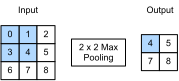

<!-- ===================== Bắt đầu dịch Phần 1 ==================== -->
<!-- ========================================= REVISE PHẦN 1 - BẮT ĐẦU =================================== -->

<!--
# Pooling
-->

# *dịch tiêu đề phía trên*
:label:`sec_pooling`


<!--
Often, as we process images, we want to gradually reduce the spatial resolution of our hidden representations, 
aggregating information so that the higher up we go in the network, the larger the receptive field (in the input) to which each hidden node is sensitive.
-->

*dịch đoạn phía trên*

<!--
Often our ultimate task asks some global question about the image, e.g., *does it contain a cat?*
So typically the nodes of our final layer should be sensitive to the entire input.
By gradually aggregating information, yielding coarser and coarser maps, we accomplish this goal of ultimately learning a global representation,
while keeping all of the advantages of convolutional layers at the intermediate layers of processing.
-->

*dịch đoạn phía trên*


<!--
Moreover, when detecting lower-level features, such as edges (as discussed in :numref:`sec_conv_layer`),
we often want our representations to be somewhat invariant to translation.
For instance, if we take the image `X` with a sharp delineation between black and white
and shift the whole image by one pixel to the right, i.e., `Z[i, j] = X[i, j+1]`, then the output for the new image `Z` might be vastly different.
The edge will have shifted by one pixel and with it all the activations.
In reality, objects hardly ever occur exactly at the same place.
In fact, even with a tripod and a stationary object, vibration of the camera due to the movement of the shutter might shift everything by a pixel or so
(high-end cameras are loaded with special features to address this problem).
-->

*dịch đoạn phía trên*

<!--
This section introduces pooling layers, which serve the dual purposes of
mitigating the sensitivity of convolutional layers to location and of spatially downsampling representations.
-->

*dịch đoạn phía trên*

<!-- ===================== Kết thúc dịch Phần 1 ===================== -->

<!-- ===================== Bắt đầu dịch Phần 2 ===================== -->

<!--
## Maximum Pooling and Average Pooling
-->

## *dịch tiêu đề phía trên*

<!--
Like convolutional layers, pooling operators consist of a fixed-shape window that is slid over all regions in the input according to its stride, 
computing a single output for each location traversed by the fixed-shape window (sometimes known as the *pooling window*).
However, unlike the cross-correlation computation of the inputs and kernels in the convolutional layer, the pooling layer contains no parameters (there is no *filter*).
Instead, pooling operators are deterministic, typically calculating either the maximum or the average value of the elements in the pooling window.
These operations are called *maximum pooling* (*max pooling* for short) and *average pooling*, respectively.
-->

*dịch đoạn phía trên*

<!--
In both cases, as with the cross-correlation operator, we can think of the pooling window as starting from the top left of the input array
and sliding across the input array from left to right and top to bottom.
At each location that the pooling window hits, it computes the maximum or average
value of the input subarray in the window (depending on whether *max* or *average* pooling is employed).
-->

*dịch đoạn phía trên*


<!--

-->


:label:`fig_pooling`

<!--
The output array in :numref:`fig_pooling` above has a height of 2 and a width of 2.
The four elements are derived from the maximum value of $\text{max}$:
-->

*dịch đoạn phía trên*

$$
\max(0, 1, 3, 4)=4,\\
\max(1, 2, 4, 5)=5,\\
\max(3, 4, 6, 7)=7,\\
\max(4, 5, 7, 8)=8.\\
$$

<!-- ===================== Kết thúc dịch Phần 2 ===================== -->

<!-- ===================== Bắt đầu dịch Phần 3 ===================== -->

<!--
A pooling layer with a pooling window shape of $p \times q$ is called a $p \times q$ pooling layer.
The pooling operation is called $p \times q$ pooling.
-->

*dịch đoạn phía trên*

<!--
Let us return to the object edge detection example mentioned at the beginning of this section.
Now we will use the output of the convolutional layer as the input for $2\times 2$ maximum pooling.
Set the convolutional layer input as `X` and the pooling layer output as `Y`. Whether or not the values of `X[i, j]` and `X[i, j+1]` are different,
or `X[i, j+1]` and `X[i, j+2]` are different, the pooling layer outputs all include `Y[i, j]=1`.
That is to say, using the $2\times 2$ maximum pooling layer, we can still detect if the pattern recognized by the convolutional layer
moves no more than one element in height and width.
-->

*dịch đoạn phía trên*

<!--
In the code below, we implement the forward computation of the pooling layer in the `pool2d` function.
This function is similar to the `corr2d` function in :numref:`sec_conv_layer`.
However, here we have no kernel, computing the output as either the max or the average of each region in the input..
-->

*dịch đoạn phía trên*

```{.python .input  n=3}
from mxnet import np, npx
from mxnet.gluon import nn
npx.set_np()

def pool2d(X, pool_size, mode='max'):
    p_h, p_w = pool_size
    Y = np.zeros((X.shape[0] - p_h + 1, X.shape[1] - p_w + 1))
    for i in range(Y.shape[0]):
        for j in range(Y.shape[1]):
            if mode == 'max':
                Y[i, j] = np.max(X[i: i + p_h, j: j + p_w])
            elif mode == 'avg':
                Y[i, j] = X[i: i + p_h, j: j + p_w].mean()
    return Y
```

<!--
We can construct the input array `X` in the above diagram to validate the output of the two-dimensional maximum pooling layer.
-->

*dịch đoạn phía trên*

```{.python .input  n=4}
X = np.array([[0, 1, 2], [3, 4, 5], [6, 7, 8]])
pool2d(X, (2, 2))
```

<!--
At the same time, we experiment with the average pooling layer.
-->

*dịch đoạn phía trên*

```{.python .input  n=14}
pool2d(X, (2, 2), 'avg')
```

<!-- ===================== Kết thúc dịch Phần 3 ===================== -->

<!-- ===================== Bắt đầu dịch Phần 4 ===================== -->

<!-- ========================================= REVISE PHẦN 1 - KẾT THÚC ===================================-->

<!-- ========================================= REVISE PHẦN 2 - BẮT ĐẦU ===================================-->

<!--
## Padding and Stride
-->

## *dịch tiêu đề phía trên*

<!--
As with convolutional layers, pooling layers can also change the output shape.
And as before, we can alter the operation to achieve a desired output shape by padding the input and adjusting the stride.
We can demonstrate the use of padding and strides in pooling layers via the two-dimensional maximum pooling layer MaxPool2D shipped in MXNet Gluon's `nn` module.
We first construct an input data of shape `(1, 1, 4, 4)`, where the first two dimensions are batch and channel.
-->

*dịch đoạn phía trên*

```{.python .input  n=15}
X = np.arange(16).reshape(1, 1, 4, 4)
X
```

<!--
By default, the stride in the `MaxPool2D` class has the same shape as the pooling window.
Below, we use a pooling window of shape `(3, 3)`, so we get a stride shape of `(3, 3)` by default.
-->

*dịch đoạn phía trên*

```{.python .input  n=16}
pool2d = nn.MaxPool2D(3)
# Because there are no model parameters in the pooling layer, we do not need
# to call the parameter initialization function
pool2d(X)
```

<!--
The stride and padding can be manually specified.
-->

*dịch đoạn phía trên*

```{.python .input  n=7}
pool2d = nn.MaxPool2D(3, padding=1, strides=2)
pool2d(X)
```

<!--
Of course, we can specify an arbitrary rectangular pooling window
and specify the padding and stride for height and width, respectively.
-->

*dịch đoạn phía trên*

```{.python .input  n=8}
pool2d = nn.MaxPool2D((2, 3), padding=(1, 2), strides=(2, 3))
pool2d(X)
```

<!-- ===================== Kết thúc dịch Phần 4 ===================== -->

<!-- ===================== Bắt đầu dịch Phần 5 ===================== -->

<!--
## Multiple Channels
-->

## Nhiều Kênh

<!--
When processing multi-channel input data, the pooling layer pools each input channel separately, rather than adding the inputs of each channel by channel as in a convolutional layer.
This means that the number of output channels for the pooling layer is the same as the number of input channels.
Below, we will concatenate arrays `X` and `X+1` on the channel dimension to construct an input with 2 channels.
-->

Khi phải xử lý dữ liệu đầu vào với nhiều kênh, tầng gộp sẽ gộp mỗi kênh của dữ liệu đầu vào một cách tách biệt thay vì cộng từng phần tử tương ứng của từng kênh lại với nhau như trong tầng tính chập.
Điều này có nghĩa là số lượng kênh đầu ra cho tầng gộp sẽ giống như số lượng kênh đầu vào.
Dưới đây, chúng ta sẽ ghép 2 mảng `X` và `X+1` theo chiều kênh để tạo dữ liệu đầu vào với số kênh là 2.

```{.python .input  n=9}
X = np.concatenate((X, X + 1), axis=1)
X
```

<!--
As we can see, the number of output channels is still 2 after pooling.
-->

Như chúng ta thấy bên dưới, số kênh của đầu ra vẫn là 2 sau khi dữ liệu đầu vào đi qua tầng gộp.

```{.python .input  n=10}
pool2d = nn.MaxPool2D(3, padding=1, strides=2)
pool2d(X)
```

<!--
## Summary
-->

## Tóm tắt

<!--
* Taking the input elements in the pooling window, the maximum pooling operation assigns the maximum value as the output and the average pooling operation assigns the average value as the output.
* One of the major functions of a pooling layer is to alleviate the excessive sensitivity of the convolutional layer to location.
* We can specify the padding and stride for the pooling layer.
* Maximum pooling, combined with a stride larger than 1 can be used to reduce the resolution.
* The pooling layer's number of output channels is the same as the number of input channels.
-->

* Sau khi tiếp nhận các phần tử đầu vào trong cửa sổ trượt của phép gộp, tầng gộp cực đại sẽ gán giá trị lớn nhất làm đầu ra và tầng gộp trung bình sẽ cho đầu ra là giá trị trung bình cuả tất cả phần tử đầu vào.
* Một trong những chức năng chủ yếu của tầng gộp là giúp giảm thiểu sự ảnh hưởng quá mức của vị trí đến tầng tích chập.
* Chúng ta có thể định rõ giá trị của đệm và sải bước cho tầng gộp.
* Tầng gộp cực đại kết hợp với sải bước lớn hơn 1 có thể dùng để giảm kích thước dữ liệu đầu vào.
* Số lượng kênh đầu ra của tầng gộp sẽ bằng số lượng kênh đầu vào tầng gộp đó.
<!--
## Exercises
-->

## Bài tập

<!--
1. Can you implement average pooling as a special case of a convolution layer? If so, do it.
1. Can you implement max pooling as a special case of a convolution layer? If so, do it.
1. What is the computational cost of the pooling layer? Assume that the input to the pooling layer is of size $c\times h\times w$, the pooling window has a shape of $p_h\times p_w$ with a padding of $(p_h, p_w)$ and a stride of $(s_h, s_w)$.
1. Why do you expect maximum pooling and average pooling to work differently?
1. Do we need a separate minimum pooling layer? Can you replace it with another operation?
1. Is there another operation between average and maximum pooling that you could consider (hint: recall the softmax)? Why might it not be so popular?
-->

1. Có thể lập trình tầng gộp theo phương thức giá trị trung bình như một trường hợp đặc biệt của tầng tích chập không? Nếu được, hãy thực hiện.
2. Có thể lập trình tầng gộp theo phương thức giá trị lớn nhất như một trường hợp đặc biệt của tầng tích chập không? Nếu được, hãy thực hiện.
3. Bạn hãy tính chi phí tính toán của tầng gộp trong trường hợp, giả sử đầu vào của tầng gộp có kích thước là $c\times h\times w$, kích thước của cửa sổ trượt trong tầng gộp là $p_h\times p_w$ với giá trị số lần đệm là $(p_h, p_w)$ và giá trị sải bước là $(s_h, s_w)$ lần lượt cho chiều cao và chiều rộng của đầu vào.
4. Bạn hãy chỉ ra sự khác biệt giữa kết quả đầu ra khi dùng tầng gộp cực đại và tầng gộp trung bình.
5. Theo bạn nghĩ thì có cần thêm riêng một tầng gộp hoạt động theo phương thức giá trị nhỏ nhất không? Bạn có thể thay thế nó bằng một cơ chế hoạt động khác không?
6. Liệu có một cơ chế hoạt động nào khác giữa tầng gộp theo phương thức giá trị trung bình và giá trị lớn nhất không (gợi ý: hãy nhớ lại hàm softmax)? Và tại sao nó không được phổ biến?

<!-- ===================== Kết thúc dịch Phần 5 ===================== -->
<!-- ========================================= REVISE PHẦN 2 - KẾT THÚC ===================================-->


<!--
## [Discussions](https://discuss.mxnet.io/t/2352)
-->

## Thảo luận
* [Tiếng Anh](https://discuss.mxnet.io/t/2352)
* [Tiếng Việt](https://forum.machinelearningcoban.com/c/d2l)

## Những người thực hiện
Bản dịch trong trang này được thực hiện bởi:
<!--
Tác giả của mỗi Pull Request điền tên mình và tên những người review mà bạn thấy
hữu ích vào từng phần tương ứng. Mỗi dòng một tên, bắt đầu bằng dấu `*`.

Lưu ý:
* Nếu reviewer không cung cấp tên, bạn có thể dùng tên tài khoản GitHub của họ
với dấu `@` ở đầu. Ví dụ: @aivivn.

* Tên đầy đủ của các reviewer có thể được tìm thấy tại https://github.com/aivivn/d2l-vn/blob/master/docs/contributors_info.md
-->

* Đoàn Võ Duy Thanh
<!-- Phần 1 -->
*

<!-- Phần 2 -->
*

<!-- Phần 3 -->
*

<!-- Phần 4 -->
*

<!-- Phần 5 -->
* Dac Dinh
