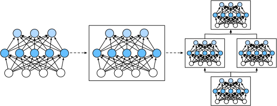

<!-- ===================== Bắt đầu dịch Phần 1 ===================== -->
<!-- ========================================= REVISE PHẦN 1 - BẮT ĐẦU =================================== -->

<!--
# Layers and Blocks
-->

# Tầng và Khối
:label:`sec_model_construction`

<!--
When we first introduced neural networks, we focused on linear models with a single output.
Here, the entire model consists of just a single neuron.
Note that a single neuron (i) takes some set of inputs; (ii) generates a corresponding (*scalar*) output;
and (iii) has a set of associated parameters that can be updated to optimize some objective function of interest.
Then, once we started thinking about networks with multiple outputs, we leveraged vectorized arithmetic to characterize an entire *layer* of neurons.
Just like individual neurons, layers (i) take a set of inputs, (ii) generate corresponding outputs,
and (iii) are described by a set of tunable parameters.
When we worked through softmax regression, a single *layer* was itself *the model*.
However, even when we subsequently introduced multilayer perceptrons, we could still think of the model as retaining this same basic structure.
-->

Khi lần đầu giới thiệu về các mạng nơ-ron, ta tập trung vào các mô hình tuyến tính với một đầu ra duy nhất.
Như vậy toàn bộ mô hình chỉ chứa một nơ-ron. 
Lưu ý rằng một nơ-ron đơn lẻ (i) nhận một vài đầu vào; (ii) tạo một đầu ra (*vô hướng*) tương ứng; 
và (iii) có một tập các tham số liên quan có thể được cập nhật để tối ưu một hàm mục tiêu nào đó mà ta quan tâm. 
Sau đó, khi bắt đầu nghĩ về các mạng có nhiều đầu ra, ta tận dụng các phép tính vector để mô tả nguyên một *tầng* nơ-ron. 
Cũng giống như các nơ-ron riêng lẻ, các tầng (i) nhận một số đầu vào, (ii) tạo các đầu ra tương ứng, và (iii) được mô tả bằng một tập các tham số có thể điều chỉnh được. 
Trong hồi quy softmax, bản thân *tầng* duy nhất ấy chính là một *mô hình*. 
Thậm chí đối với các perceptron đa tầng, ta vẫn có thể nghĩ về chúng theo cấu trúc cơ bản này. 

<!--
Interestingly, for multilayer perceptrons, both the *entire model* and its *constituent layers* share this structure.
The (entire) model takes in raw inputs (the features), generates outputs (the predictions), and possesses parameters (the combined parameters from all constituent layers).
Likewise, each individual layer ingests inputs (supplied by the previous layer) generates outputs (the inputs to the subsequent layer),
and possesses a set of tunable parameters that are updated according to the signal that flows backwards from the subsequent layer.
-->

Điều thú vị là đối với các perceptron đa tầng, cả *mô hình* và các *tầng cấu thành* đều chia sẻ cấu trúc này. 
(Toàn bộ) mô hình nhận các đầu vào thô (các đặc trưng), tạo các đầu ra (các dự đoán) và sở hữu các tham số (được tập hợp từ tất cả các tầng cấu thành). 
Tương tự, mỗi tầng riêng lẻ cũng nhận các đầu vào (được cung cấp bởi tầng trước đó), tính toán các đầu ra (cũng chính là các đầu vào cho tầng tiếp theo), và có một tập các tham số có thể điều chỉnh thông qua việc cập nhật dựa trên tín hiệu được truyền ngược từ tầng kế tiếp. 


<!--
While you might think that neurons, layers, and models give us enough abstractions to go about our business, 
it turns out that we often find it convenient to speak about components that are larger than an individual layer but smaller than the entire model.
For example, the ResNet-152 architecture, which is wildly popular in computer vision, possesses hundreds of layers.
These layers consist of repeating patterns of *groups of layers*. Implementing such a network one layer at a time can grow tedious.
This concern is not just hypothetical---such design patterns are common in practice.
The ResNet architecture mentioned above won the 2015 ImageNet and COCO computer vision competitions for 
both recognition and detection :cite:`He.Zhang.Ren.ea.2016` and remains a go-to architecture for many vision tasks.
Similar patterns are in which layers are arranged in various repeating patterns are now ubiquitous in other domains, including natural language processing and speech.
-->

Dù bạn có thể nghĩ rằng các nơ-ron, các tầng và các mô hình đã cung cấp đủ sự trừu tượng để bắt tay vào làm việc, hóa ra sẽ là thuận tiện hơn khi ta bàn về các thành phần lớn hơn một tầng riêng lẻ nhưng lại nhỏ hơn toàn bộ mô hình. 
Ví dụ, kiến trúc ResNet-152, rất phổ biến trong thị giác máy tính, sở hữu hàng trăm tầng.
Nó bao gồm các khuôn mẫu *nhóm tầng* được lặp lại nhiều lần. Việc lập trình từng tầng của một mạng như vậy có thể trở nên tẻ nhạt. 
Mối quan tâm này không chỉ là trên lý thuyết --- các khuôn mẫu thiết kế như vậy rất phổ biến trong thực tế. 
Kiến trúc ResNet được đề cập ở trên đã giành chiến thắng trong hai cuộc thi thị giác máy tính ImageNet và COCO năm 2015, trong cả bài toán nhận dạng và bài toán phát hiện :cite:`He.Zhang.Ren.ea.2016` và vẫn là một kiến trúc được tin dùng cho nhiều bài toán thị giác. 
Các kiến trúc tương tự, trong đó các tầng được sắp xếp thành những khuôn mẫu lặp lại, hiện đã trở nên thông dụng ở nhiều lĩnh vực khác, bao gồm cả xử lý ngôn ngữ tự nhiên và xử lý tiếng nói. 

<!-- ===================== Kết thúc dịch Phần 1 ===================== -->

<!-- ===================== Bắt đầu dịch Phần 2 ===================== -->

<!--
To implement these complex networks, we introduce the concept of a neural network *block*.
A block could describe a single layer, a component consisting of multiple layers, or the entire model itself!
From a software standpoint, a `Block` is a *class*.
Any subclass of `Block` must define a `forward` method that transforms its input into output and must store any necessary parameters.
Note that some Blocks do not require any parameters at all!
Finally a `Block` must possess a `backward` method, for purposes of calculating gradients.
Fortunately, due to some behind-the-scenes magic supplied by the `autograd` package
(introduced in :numref:`chap_preliminaries`) when defining our own `Block`, we only need to worry about parameters and the `forward` function.
-->

Để lập trình các mạng phức tạp này, ta sẽ giới thiệu khái niệm *khối* trong mạng nơ-ron. 
Một khối có thể mô tả một tầng duy nhất, một mảng đa tầng hoặc toàn bộ một mô hình!
Dưới góc nhìn xây dựng phần mềm, một `Block` (Khối) là một *lớp*. 
Bất kỳ một lớp con nào của `Block` đều phải định nghĩa phương thức `forward` để chuyển hóa đầu vào thành đầu ra và phải lưu trữ mọi tham số cần thiết. 
Lưu ý rằng có một vài `Block` sẽ không yêu cầu chứa bất kỳ tham số nào cả! 
Ngoài ra, một `Block` phải sở hữu một phương thức `backward` cho mục đích tính toán gradient. 
May mắn thay, nhờ sự trợ giúp đắc lực của gói `autograd` (được giới thiệu trong :numref:`chap_preliminaries`) nên khi định nghĩa `Block`, ta chỉ cần quan tâm đến các tham số và hàm `forward`. 

<!--
One benefit of working with the `Block` abstraction is that they can be combined into larger artifacts, often recursively, (see illustration in :numref:`fig_blocks`).
-->

Một lợi ích khi làm việc ở mức độ trừu tượng `Block` đó là ta có thể kết hợp chúng, thường là theo phương pháp đệ quy, để tạo ra các thành phần lớn hơn (xem hình minh họa trong :numref:`fig_blocks`). 

<!--

-->


:label:`fig_blocks`

<!--
By defining code to generate Blocks of arbitrary complexity on demand, we can write surprisingly compact code and still implement complex neural networks.
-->

Bằng cách định nghĩa các khối với độ phức tạp tùy ý, các mạng nơ-ron phức tạp có thể được lập trình với mã nguồn ngắn gọn một cách đáng ngạc nhiên. 

<!--
To begin, we revisit the Blocks that we used to implement multilayer perceptrons (:numref:`sec_mlp_gluon`).
The following code generates a network with one fully-connected hidden layer with 256 units and ReLU activation, followed by a fully-connected *output layer* with 10 units (no activation function).
-->

Để bắt đầu, ta sẽ xem lại các khối mà ta đã sử dụng để lập trình perceptron đa tầng (:numref:`sec_mlp_gluon`).
Đoạn mã nguồn sau tạo ra một mạng gồm một tầng ẩn kết nối đầy đủ với 256 nút sử dụng hàm kích hoạt ReLU, theo sau là một *tầng đầu ra* kết nối đầy đủ với 10 nút (không có hàm kích hoạt).

```{.python .input  n=33}
from mxnet import np, npx
from mxnet.gluon import nn
npx.set_np()

x = np.random.uniform(size=(2, 20))

net = nn.Sequential()
net.add(nn.Dense(256, activation='relu'))
net.add(nn.Dense(10))
net.initialize()
net(x)
```

<!--
In this example, we constructed our model by instantiating an `nn.Sequential`, assigning the returned object to the `net` variable.
Next, we repeatedly call its `add` method, appending layers in the order that they should be executed.
In short, `nn.Sequential` defines a special kind of `Block` that mantains an ordered list of constituent `Blocks`.
The `add` method simply facilitates the addition of each successive `Block` to the list.
Note that each our layer is an instance of the `Dense` class which is itself a subclass of `Block`.
The `forward` function is also remarkably simple: it chains each Block in the list together, passing the output of each as the input to the next.
Note that until now, we have been invoking our models via the construction `net(X)` to obtain their outputs.
This is actually just shorthand for `net.forward(X)`, a slick Python trick achieved via the Block class's `__call__` function.
-->

Trong ví dụ này, ta đã xây dựng mô hình bằng cách khởi tạo một đối tượng `nn.Sequential` và gán vào biến `net`. 
Sau đó, ta gọi phương thức `add` nhiều lần để nối các tầng theo thứ tự mà chúng sẽ được thực thi.
Nói một cách ngắn gọn, `nn.Sequential` định nghĩa một loại `Block` đặc biệt có nhiệm vụ duy trì một danh sách chứa các `Block` cấu thành được sắp xếp theo thứ tự nhất định.
Phương thức `add` chỉ đơn giản hỗ trợ việc thêm liên tiếp từng `Block` vào trong danh sách đó. 
Lưu ý rằng mỗi tầng là một thực thể của lớp `Dense`, và bản thân lớp `Dense` lại là một lớp con của `Block`. 
Hàm `forward` cũng rất đơn giản: nó xâu chuỗi từng `Block` trong danh sách lại với nhau, chuyển đầu ra của từng khối thành đầu vào cho khối tiếp theo. 
Lưu ý rằng cho đến giờ, ta đã gọi mô hình thông qua `net(X)` để thu được đầu ra. 
Thực ra đây chỉ là một cách viết tắt của `net.forward(X)`, một thủ thuật Python khéo léo đạt được thông qua hàm `__call__` của lớp `Block`. 

<!-- ===================== Kết thúc dịch Phần 2 ===================== -->

<!-- ===================== Bắt đầu dịch Phần 3 ===================== -->

<!-- ========================================= REVISE PHẦN 1 - KẾT THÚC ===================================-->

<!-- ========================================= REVISE PHẦN 2 - BẮT ĐẦU ===================================-->

<!--
## A Custom Block
-->

## Một Khối Tùy chỉnh

<!--
Perhaps the easiest way to develop intuition about how `nn.Block` works is to implement one ourselves.
Before we implement our own custom `Block`, we briefly summarize the basic functionality that each `Block` must provide:
-->

Có lẽ cách dễ nhất để hiểu rõ hơn `nn.Block` hoạt động như thế nào là tự lập trình nó. 
Trước khi tự lập trình một `Block` tùy chỉnh, hãy cùng tóm tắt ngắn gọn các chức năng cơ bản mà một `Block` phải cung cấp: 

<!--
1. Ingest input data as arguments to its `forward` method.
2. Generate an output by having `forward` return a value.
Note that the output may have a different shape from the input.
For example, the first Dense layer in our model above ingests an input of arbitrary dimension but returns an output of dimension 256.
3. Calculate the gradient of its output with respect to its input, which can be accessed via its `backward` method.
Typically this happens automatically.
4. Store and provide access to those parameters necessary to execute the `forward` computation.
5. Initialize these parameters as needed.
-->

1. Phương thức `forward` nhận đối số là dữ liệu đầu vào.
2. Phương thức `forward` trả về một giá trị đầu ra.
Lưu ý rằng đầu ra có thể có kích thước khác với đầu vào.
Ví dụ, tầng Dense đầu tiên trong mô hình phía trên nhận đầu vào có kích thước tùy ý nhưng trả về đầu ra có kích thước 256. 
3. Tính gradient của đầu ra theo đầu vào bằng phương thức `backward`, thường thì việc này được thực hiện tự động. 
4. Lưu trữ và cung cấp quyền truy cập tới các tham số cần thiết để tiến hành phương thức tính toán `forward`.
5. Khởi tạo các tham số này khi cần thiết. 

<!--
In the following snippet, we code up a Block from scratch corresponding to a multilayer perceptron with one hidden layer with 256 hidden nodes, and a 10-dimensional output layer.
Note that the `MLP` class below inherits the `Block` class.
We will rely heavily on the parent class's methods, supplying only our own `__init__` and `forward` methods.
-->

Trong đoạn mã dưới đây, chúng ta lập trình từ đầu một Block (Khối) tương đương với một perceptron đa tầng chỉ có một tầng ẩn và 256 nút ẩn, cùng một tầng đầu ra 10 chiều.
Lưu ý rằng lớp `MLP` bên dưới đây kế thừa từ lớp `Block`. 
Ta sẽ phụ thuộc nhiều vào các phương thức của lớp cha, và chỉ tự viết phương thức `__init__` và `forward`. 

```{.python .input  n=34}
from mxnet.gluon import nn

class MLP(nn.Block):
    # Declare a layer with model parameters. Here, we declare two fully
    # connected layers
    def __init__(self, **kwargs):
        # Call the constructor of the MLP parent class Block to perform the
        # necessary initialization. In this way, other function parameters can
        # also be specified when constructing an instance, such as the model
        # parameter, params, described in the following sections
        super(MLP, self).__init__(**kwargs)
        self.hidden = nn.Dense(256, activation='relu')  # Hidden layer
        self.output = nn.Dense(10)  # Output layer

    # Define the forward computation of the model, that is, how to return the
    # required model output based on the input x
    def forward(self, x):
        return self.output(self.hidden(x))
```

<!--
To begin, let's focus on the `forward` method.
Note that it takes `x` as input, calculates the hidden representation (`self.hidden(x)`), and outputs its logits (`self.output( ... )`).
In this MLP implementation, both layers are instance variables.
To see why this is reasonable, imagine instantiating two MLPs, `net1` and `net2`, and training them on different data.
Naturally, we would expect them them to represent two different learned models.
-->

Để bắt đầu, ta sẽ tập trung vào phương thức `forward`. 
Lưu ý rằng nó nhận giá trị đầu vào `x`, tính toán tầng biểu diễn ẩn (`self.hidden(x)`) và trả về các giá trị logit (`self.output( ... )`). 
Ở cách lập trình MLP này, cả hai tầng trên đều là biến thực thể (_instance variables_). 
Để thấy tại sao điều này có lý, tưởng tượng ta khởi tạo hai MLP, `net1` và `net2`, và huấn luyện chúng với dữ liệu khác nhau. 
Dĩ nhiên là ta mong đợi chúng đại diện cho hai mô hình học khác nhau. 

<!--
We instantiate the MLP's layers in the `__init__` method (the constructor) and subsequently invoke these layers on each call to the `forward` method.
Note a few key details.
First, our customized `__init__` method invokes the parent class's `__init__` method via `super(MLP, self).__init__(**kwargs)` sparing us the pain of restating boilerplate code applicable to most Blocks.
We then instantiate our two `Dense` layers, assigning them to `self.hidden` and `self.output`.
Note that unless we implement a new operator, we need not worry about backpropagation (the `backward` method) or parameter initialization (the `initialize` method).
Gluon will generate these methods automatically.
Let's try this out:
-->

Ta khởi tạo các tầng của MLP trong phương thức `__init__` (hàm khởi tạo) và sau đó gọi các tầng này mỗi khi ta gọi phương thức `forward`. 
Hãy chú ý một vài chi tiết quan trọng. 
Đầu tiên, phương thức `__init__` tùy chỉnh của ta gọi phương thức `__init__` của lớp cha thông qua `super(MLP, self).__init__(**kwargs)` để tránh việc viết lại cùng một phần mã nguồn áp dụng cho hầu hết các khối. 
Chúng ta sau đó khởi tạo hai tầng `Dense`, gán chúng lần lượt là `self.hidden` và `self.output`. 
Chú ý rằng trừ khi đang phát triển một toán tử mới, chúng ta không cần lo lắng về lan truyền ngược (phương thức `backward`) hoặc khởi tạo tham số (phương thức `initialize`).
Gluon sẽ tự động khởi tạo các phương thức đó. 
Hãy cùng thử nghiệm điều này:

```{.python .input  n=35}
net = MLP()
net.initialize()
net(x)
```

<!--
A key virtue of the `Block` abstraction is its versatility.
We can subclass `Block` to create layers (such as the `Dense` class provided by Gluon), entire models (such as the `MLP` above), or various components of intermediate complexity.
We exploit this versatility throughout the following chapters, especially when addressing convolutional neural networks.
-->

Một ưu điểm chính của phép trừu tượng hóa `Block` là tính linh hoạt của nó. 
Ta có thể kế thừa từ lớp `Block` để tạo các tầng (chẳng hạn như lớp `Dense` được cung cấp bởi Gluon), toàn bộ cả mô hình (như `MLP` ở phía trên) hoặc các thành phần đa dạng với độ phức tạp vừa phải. 
Ta sẽ tận dụng tính linh hoạt này xuyên suốt ở các chương sau, đặc biệt khi làm việc với các mạng nơ-ron tích chập. 


<!-- ===================== Kết thúc dịch Phần 3 ===================== -->

<!-- ===================== Bắt đầu dịch Phần 4 ===================== -->

<!-- ========================================= REVISE PHẦN 2 - KẾT THÚC ===================================-->

<!-- ========================================= REVISE PHẦN 3 - BẮT ĐẦU ===================================-->

<!--
## The Sequential Block
-->

## Khối Tuần tự

<!--
We can now take a closer look at how the `Sequential` class works.
Recall that `Sequential` was designed to daisy-chain other Blocks together.
To build our own simplified `MySequential`, we just need to define two key methods:
1. An `add` method for appending Blocks one by one to a list.
2. A `forward` method to pass an input through the chain of Blocks (in the same order as they were appended).
-->

Bây giờ ta có thể có cái nhìn rõ hơn về cách mà lớp `Sequential` (Tuần tự) hoạt động. 
Nhắc lại rằng `Sequential` được thiết kế để xâu chuỗi các Khối lại với nhau.
Để tự xây dựng một lớp `MySequential` đơn giản, ta chỉ cần định nghĩa hai phương thức chính sau: 
1. Phương thức `add` nhằm đẩy từng Block một vào trong danh sách. 
2. Phương thức `forward` nhằm truyền một đầu vào qua chuỗi các Blocks (theo thứ tự mà chúng được nối). 

<!--
The following `MySequential` class delivers the same functionality as Gluon's default `Sequential` class:
-->

Lớp `MySequential` dưới đây cung cấp tính năng giống như lớp `Sequential` mặc định của Gluon: 

```{.python .input  n=36}
class MySequential(nn.Block):
    def add(self, block):
        # Here, block is an instance of a Block subclass, and we assume it has
        # a unique name. We save it in the member variable _children of the
        # Block class, and its type is OrderedDict. When the MySequential
        # instance calls the initialize function, the system automatically
        # initializes all members of _children
        self._children[block.name] = block

    def forward(self, x):
        # OrderedDict guarantees that members will be traversed in the order
        # they were added
        for block in self._children.values():
            x = block(x)
        return x
```

<!--
The `add` method adds a single Block to the ordered dictionary `_children`.
You might wonder why every Gluon `Block` possesses a `_children` attribute and why we used it rather than just defining a Python list ourselves.
In short the chief advantage of `_children` is that during our Block's parameter inititialization, 
Gluon knows to look in the `_children` dictionary to find sub-Blocks whose parameters also need to be initialized.
-->

Phương thức `add` thêm một Block đơn vào từ điển có thứ tự `_children`. 
Bạn có thể thắc mắc tại sao mỗi `Block` của Gluon sở hữu một thuộc tính `_children` và tại sao ta sử dụng nó thay vì tự tạo một danh sách Python. 
Thật ra, ưu điểm chính của `_children` là trong quá trình khởi tạo trọng số ban đầu của các khối, Gluon sẽ tự động tìm các khối con có trọng số cần được khởi tạo trong từ điển này.

<!--
When our `MySequential` Block's `forward` method is invoked, each added `Block` is executed in the order in which they were added.
We can now reimplement an MLP using our `MySequential` class.
-->

Khi phương thức `forward` của khối `MySequential` được gọi, các `Block` sẽ được thực thi theo thứ tự mà chúng được thêm vào. 
Bây giờ ta có thể lập trình lại một MLP sử dụng lớp `MySequential`. 

```{.python .input  n=37}
net = MySequential()
net.add(nn.Dense(256, activation='relu'))
net.add(nn.Dense(10))
net.initialize()
net(x)
```

<!--
Note that this use of `MySequential` is identical to the code we previously wrote for the Gluon `Sequential` class (as described in :numref:`sec_mlp_gluon`).
-->

Chú ý rằng việc sử dụng `MySequential` giống hệt với đoạn mã mà ta đã viết trước đó cho lớp `Sequential` của Gluon (được mô tả trong :numref:`sec_mlp_gluon`). 

<!-- ===================== Kết thúc dịch Phần 4 ===================== -->

<!-- ===================== Bắt đầu dịch Phần 5 ===================== -->

<!--
## Executing Code in the `forward` Method
-->

## Thực thi Mã trong Phương thức `forward`

<!--
The `nn.Sequential` class makes model construction easy, allowing us to assemble new architectures without having to defined our own class.
However, not all architectures are simple daisy chains.
When greater flexibility is required, we will want to define our own `Block`s.
For example, we might want to exectute
Python's control flow within the forward method.
Moreover we might want to perform arbitrary mathematical operations, not simply relying on predefined neural network layers.
-->

Lớp `nn.Sequential` giúp việc xây dựng mô hình trở nên dễ hơn, cho phép ta xây dựng các kiến trúc mới mà không cần phải tự định nghĩa một lớp riêng. 
Tuy nhiên, không phải tất cả mô hình đều có cấu trúc chuỗi xích đơn giản. 
Khi cần phải linh hoạt hơn, ta vẫn sẽ muốn định nghĩa từng `Block` theo cách của mình, ví dụ như khi muốn sử dụng luồng điều khiển Python trong lượt truyền xuôi. 
Hơn nữa, ta cũng có thể muốn thực hiện các phép toán tùy ý thay vì chỉ dựa vào các tầng mạng nơ-ron được định nghĩa từ trước.

<!--
You might have noticed that until now, all of the operations in our networks have acted upon our network's activations and its parameters.
Sometimes, however, we might want to incorporate terms constant terms which are neither the result of previous layers nor updatable parameters.
In Gluon, we call these *constant* parameters.
Say for example that we want a layer that calculates the function 
$f(\mathbf{x},\mathbf{w}) = c \cdot \mathbf{w}^\top \mathbf{x}$, where $\mathbf{x}$ is the input, $\mathbf{w}$ is our parameter, 
and $c$ is some specified constant that is not updated during optimization.
-->

Độc giả có thể nhận ra rằng tất cả phép toán trong mạng cho tới giờ đều thao tác trên các giá trị kích hoạt và tham số của mạng. 
Tuy nhiên, trong một vài trường hợp, ta có thể muốn kết hợp thêm các hằng số. Chúng không phải là kết quả của tầng trước mà cũng không phải là tham số có thể cập nhật được. 
Trong Gluon, ta gọi chúng là tham số *không đổi* (_constant parameter_).
Ví dụ ta muốn một tầng tính hàm $f(\mathbf{x},\mathbf{w}) = c \cdot \mathbf{w}^\top \mathbf{x}$, trong đó $\mathbf{x}$, $\mathbf{w}$ là tham số, và $c$ là một hằng số cho trước được giữ nguyên giá trị trong suốt quá trình tối ưu hóa. 

<!--
Declaring constants explicitly (via `get_constant`) makes this clear helps Gluon to speed up execution.
In the following code, we'll implement a model that could not easily be assembled using only predefined layers and `Sequential`.
-->

Khai báo các hằng số một cách tường minh (bằng `get_constant`) giúp Gluon tăng tốc độ thực thi.
Trong đoạn mã sau, ta lập trình một mô hình mà không hề dễ lắp ráp nếu sử dụng `Sequential` và các tầng được định nghĩa trước.

```{.python .input  n=38}
class FixedHiddenMLP(nn.Block):
    def __init__(self, **kwargs):
        super(FixedHiddenMLP, self).__init__(**kwargs)
        # Random weight parameters created with the get_constant are not
        # iterated during training (i.e., constant parameters)
        self.rand_weight = self.params.get_constant(
            'rand_weight', np.random.uniform(size=(20, 20)))
        self.dense = nn.Dense(20, activation='relu')

    def forward(self, x):
        x = self.dense(x)
        # Use the constant parameters created, as well as the relu
        # and dot functions
        x = npx.relu(np.dot(x, self.rand_weight.data()) + 1)
        # Reuse the fully connected layer. This is equivalent to sharing
        # parameters with two fully connected layers
        x = self.dense(x)
        # Here in Control flow, we need to call asscalar to return the scalar
        # for comparison
        while np.abs(x).sum() > 1:
            x /= 2
        return x.sum()
```

<!--
In this `FixedHiddenMLP` model, we implement a hidden layer whose weights (`self.rand_weight`) are initialized randomly at instantiation and are thereafter constant.
This weight is not a model parameter and thus it is never updated by backpropagation.
The network then passes the output of this *fixed* layer through a `Dense` layer.
-->

Trong mô hình `FixedHiddenMLP`, ta lập trình một tầng ẩn có trọng số (`self.rand_ weight`) được khởi tạo ngẫu nhiên và giữ nguyên giá trị về sau.
Trọng số này không phải là một tham số mô hình, vì vậy nó không được cập nhật khi sử dụng lan truyền ngược.
Sau đó, đầu ra của tầng *cố định* này được đưa vào tầng `Dense`.

<!--
Note that before returning output, our model did something unusual.
We ran a `while` loop, testing on the condition `np.abs(x).sum() > 1`, and dividing our output vector by $2$ until it satisfied the condition.
Finally, we outputed the sum of the entries in `x`.
To our knowledge, no standard neural network performs this operation.
Note that this particular operation may not be useful in any real world task.
Our point is only to show you how to integrate arbitrary code into the flow of your neural network computations.
-->

Lưu ý rằng trước khi trả về giá trị đầu ra, mô hình của ta đã làm điều gì đó bất thường. 
Ta đã chạy một vòng lặp `while`, lấy vector đầu ra chia cho $2$ cho đến khi nó thỏa mãn điều kiện `np.abs(x).sum() > 1`.
Cuối cùng, ta gán giá trị đầu ra bằng tổng các phần tử trong `x`.
Theo sự hiểu biết của chúng tôi, không có mạng nơ-ron tiêu chuẩn nào thực hiện phép toán này. 
Lưu ý rằng phép toán đặc biệt này có thể không hữu ích gì trong các công việc ngoài thực tế. 
Mục đích của chúng tôi ở đây là chỉ cho độc giả thấy được cách tích hợp một đoạn mã tùy ý vào luồng tính toán của mạng nơ-ron. 

```{.python .input  n=39}
net = FixedHiddenMLP()
net.initialize()
net(x)
```

<!--
With Gluon, we can mix and match various ways of assembling `Block`s together.
In the following example, we nest `Block`s in some creative ways.
-->

Với Gluon, ta có thể kết hợp nhiều cách khác nhau để lắp ráp các `Block` lại.
Trong ví dụ dưới đây, ta lồng các `Block` với nhau theo nhiều cách sáng tạo.

```{.python .input  n=40}
class NestMLP(nn.Block):
    def __init__(self, **kwargs):
        super(NestMLP, self).__init__(**kwargs)
        self.net = nn.Sequential()
        self.net.add(nn.Dense(64, activation='relu'),
                     nn.Dense(32, activation='relu'))
        self.dense = nn.Dense(16, activation='relu')

    def forward(self, x):
        return self.dense(self.net(x))

chimera = nn.Sequential()
chimera.add(NestMLP(), nn.Dense(20), FixedHiddenMLP())

chimera.initialize()
chimera(x)
```

<!-- ===================== Kết thúc dịch Phần 5 ===================== -->

<!-- ===================== Bắt đầu dịch Phần 6 ===================== -->

<!-- ========================================= REVISE PHẦN 3 - KẾT THÚC ===================================-->

<!-- ========================================= REVISE PHẦN 4 - BẮT ĐẦU ===================================-->

<!--
## Compilation
-->

## Biên dịch Mã nguồn

<!--
The avid reader might start to worry about the efficiency of some of these operations.
After all, we have lots of dictionary lookups, code execution, and lots of other Pythonic things taking place in what is supposed to be a high performance deep learning library.
The problems of Python's [Global Interpreter Lock](https://wiki.python.org/moin/GlobalInterpreterLock) are well known. 
In the context of deep learning, we worry that our extremely fast GPU(s) might have to wait until a puny CPU runs Python code before it gets another job to run.
The best way to speed up Python is by avoiding it altogether.
One way that Gluon does this by allowing for
Hybridization (:numref:`sec_hybridize`).
Here, the Python interpreter executes a Block the first time it is invoked.
The Gluon runtime records what is happening and the next time around it short-circuits calls to Python.
This can accelerate things considerably in some cases but care needs to be taken when control flow (as above) lead down different branches on different passes through the net.
We recommend that the interested reader check out the hybridization section (:numref:`sec_hybridize`) to learn about compilation after finishing the current chapter.
-->

Những người đọc có tâm có thể sẽ bắt đầu lo lắng về hiệu năng của một vài đoạn mã trên. 
Sau cùng thì, chúng ta có rất nhiều thao tác truy cập từ điển, thực thi mã lập trình và rất nhiều thứ "đậm chất Python" khác xuất hiện trong thứ mà lẽ ra nên là một thư viện học sâu hiệu năng cao. 
Vấn đề của [Khóa Trình thông dịch Toàn cục (*Global Interpreter Lock*)](https://wiki.python.org/moin/GlobalInterpreterLock) trong Python khá phổ biến. 
Trong bối cảnh học sâu, ta lo sợ rằng GPU cực kỳ nhanh của ta có thể sẽ phải đợi CPU "rùa bò" chạy xong những dòng lệnh Python trước khi nó có thể nhận tác vụ chạy tiếp theo.
Cách tốt nhất để tăng tốc Python là tránh không sử dụng nó. 
Gluon làm việc này bằng cách cho phép việc Hybrid hóa (:numref:`sec_hybridize`). 
Ở đây, trình thông dịch của Python sẽ thực thi một Khối trong lần chạy đầu tiên.  
Môi trường chạy của Gluon sẽ ghi lại những gì đang diễn ra và trong lần chạy tiếp theo, nó sẽ thực hiện các tác vụ gọi trong Python một cách vắn tắt hơn. 
Điều này có thể giúp tăng tốc độ chạy đáng kể trong một vài trường hợp, tuy nhiên, ta cần quan tâm tới việc luồng điều khiển (như trên) sẽ dẫn đến những nhánh khác nhau với mỗi lần truyền qua mạng. 
Chúng tôi khuyến khích những độc giả có hứng thú sau khi hoàn tất chương này hãy đọc thêm mục hybrid hóa (:numref:`sec_hybridize`) để tìm hiểu về quá trình biên dịch. 

<!--
## Summary
-->

## Tóm tắt

<!--
* Layers are Blocks.
* Many layers can comprise a Block.
* Many Blocks can comprise a Block.
* A Block can contain code.
* Blocks take care of lots of housekeeping, including parameter initialization and backpropagation.
* Sequential concatenations of layers and blocks are handled by the `Sequential` Block.
-->

* Các tầng trong mạng nơ-ron là các Khối. 
* Nhiều tầng có thể cấu thành một Khối. 
* Nhiều Khối có thể cấu thành một Khối. 
* Một Khối có thể chứa các đoạn mã nguồn. 
* Các Khối đảm nhiệm nhiều tác vụ bao gồm khởi tạo tham số và lan truyền ngược. 
* Việc gắn kết các tầng và khối một cách tuần tự được đảm nhiệm bởi Khối `Sequential`. 


<!--
## Exercises
-->

## Bài tập

<!--
1. What kinds of problems will occur if you remove the `asscalar` function in the `FixedHiddenMLP` class?
2. What kinds of problems will occur if you change `self.net` defined by the Sequential instance in the `NestMLP` class to `self.net = [nn.Dense(64, activation='relu'), nn. Dense(32, activation='relu')]`?
3. Implement a block that takes two blocks as an argument, say `net1` and `net2` and returns the concatenated output of both networks in the forward pass (this is also called a parallel block).
4. Assume that you want to concatenate multiple instances of the same network. Implement a factory function that generates multiple instances of the same block and build a larger network from it.
-->

1. Vấn đề gì sẽ xảy ra nếu ta bỏ hàm `asscalar` trong lớp `FixedHiddenMLP`?
2. Vấn đề gì sẽ xảy ra nếu`self.net` được định nghĩa trong thực thể `Sequential` ở lớp `NestMLP` được đổi thành `self.net = [nn.Dense(64, activation='relu'), nn. Dense(32, activation='relu')]`?
3. Hãy lập trình một khối nhận đối số là hai khối khác, ví dụ như `net1` và `net2`, và trả về kết quả là phép nối các giá trị đầu ra của cả hai mạng đó khi thực hiện lượt truyền xuôi.
4. Giả sử bạn muốn nối nhiều thực thể của cùng một mạng với nhau. Hãy lập trình một hàm để tạo ra nhiều thực thể của cùng một mạng và dùng chúng để tạo thành một mạng lớn hơn (các hàm này trong thiết kế phần mềm được gọi là Factory Function).

<!-- ===================== Kết thúc dịch Phần 6 ===================== -->
<!-- ========================================= REVISE PHẦN 4 - KẾT THÚC ===================================-->

## Thảo luận
* [Tiếng Anh](https://discuss.mxnet.io/t/2325)
* [Tiếng Việt](https://forum.machinelearningcoban.com/c/d2l)

## Những người thực hiện
Bản dịch trong trang này được thực hiện bởi:

* Đoàn Võ Duy Thanh
* Nguyễn Duy Du
* Phạm Minh Đức
* Nguyễn Lê Quang Nhật
* Lê Khắc Hồng Phúc
* Trần Yến Thy
* Phạm Hồng Vinh
* Lý Phi Long
