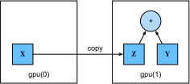

<!-- ===================== Bắt đầu dịch Phần 1 ===================== -->
<!-- ========================================= REVISE PHẦN 1 - BẮT ĐẦU =================================== -->

<!--
# GPUs
-->

# GPU
:label:`sec_use_gpu`

<!--
In the introduction, we discussed the rapid growth of computation over the past two decades.
In a nutshell, GPU performance has increased by a factor of 1000 every decade since 2000.
This offers great opportunity but it also suggests a significant need to provide such performance.
-->

Trong phần giới thiệu của cuốn sách này, chúng ta đã thảo luận về sự tăng trưởng đột phá của năng lực tính toán trong hai thập niên vừa qua.
Một cách ngắn gọn, hiệu năng GPU đã tăng lên gấp 1000 lần trong mỗi thập niên kể từ năm 2000.
Điều này mang lại cơ hội to lớn nhưng kèm theo đó là một nhu cầu không hề nhỏ để cung cấp hiệu năng tính toán như vậy. 

<!--
|Decade|Dataset|Memory|Floating Point Calculations per Second|
|:--|:-|:-|:-|
|1970|100 (Iris)|1 KB|100 KF (Intel 8080)|
|1980|1 K (House prices in Boston)|100 KB|1 MF (Intel 80186)|
|1990|10 K (optical character recognition)|10 MB|10 MF (Intel 80486)|
|2000|10 M (web pages)|100 MB|1 GF (Intel Core)|
|2010|10 G (advertising)|1 GB|1 TF (NVIDIA C2050)|
|2020|1 T (social network)|100 GB|1 PF (NVIDIA DGX-2)|
-->

| Thập niên | Tập dữ liệu                     | Bộ nhớ | Số Phép tính Dấu phẩy động trên Giây |
|:----------|:--------------------------------|:-------|:-------------------------------------|
| 1970      |100 (Iris)                       | 1 KB   | 100 KF (Intel 8080)                  |
| 1980      |1 K (Giá nhà tại Boston)         | 100 KB | 1 MF (Intel 80186)                   |
| 1990      |10 K (Nhận diện ký tự quang học) | 10 MB  | 10 MF (Intel 80486)                  |
| 2000      |10 M (các trang web)             | 100 MB | 1 GF (Intel Core)                    |
| 2010      |10 G (quảng cáo)                 | 1 GB   | 1 TF (NVIDIA C2050)                  |
| 2020      |1 T (mạng xã hội)                | 100 GB | 1 PF (NVIDIA DGX-2)                  |

<!--
In this section, we begin to discuss how to harness this compute performance for your research. 
First by using single GPUs and at a later point, how to use multiple GPUs and multiple servers (with multiple GPUs). 
You might have noticed that MXNet `ndarray` looks almost identical to NumPy. But there are a few crucial differences. 
One of the key features that distinguishes MXNet from NumPy is its support for diverse hardware devices.
-->

Trong phần này, ta bắt đầu thảo luận cách khai thác hiệu năng tính toán này cho việc nghiên cứu.
Đầu tiên ta sẽ tìm hiểu cách sử dụng một GPU duy nhất, rồi sau này tiến tới nhiều GPU và nhiều máy chủ (cùng với nhiều GPU).
Bạn có thể đã nhận ra MXNet `ndarray` trông gần như giống hệt NumPy, nhưng chúng có một vài điểm khác biệt quan trọng.
Một trong những tính năng chính khiến cho MXNet khác với NumPy là MXNet hỗ trợ nhiều loại phần cứng đa dạng.

<!--
In MXNet, every array has a context.
So far, by default, all variables and associated computation have been assigned to the CPU.
Typically, other contexts might be various GPUs.
Things can get even hairier when we deploy jobs across multiple servers.
By assigning arrays to contexts intelligently, we can minimize the time spent transferring data between devices.
For example, when training neural networks on a server with a GPU, we typically prefer for the model’s parameters to live on the GPU.
-->

Trong MXNet, mỗi mảng có một bối cảnh. 
Cho tới giờ, tất cả các biến và phép toán liên quan đều được giao cho CPU theo mặc định.
Các bối cảnh thường có thể là nhiều GPU khác. 
Mọi thứ còn có thể trở nên rối rắm hơn khi ta triển khai công việc trên nhiều máy chủ.
Bằng cách chỉ định bối cảnh cho các mảng một cách thông minh, ta có thể giảm thiểu thời gian truyền tải dữ liệu giữa các thiết bị.
Ví dụ, khi huấn luyện mạng nơ-ron trên máy chủ có GPU, ta thường muốn các tham số mô hình nằm ở trên GPU.

<!-- ===================== Kết thúc dịch Phần 1 ===================== -->

<!-- ===================== Bắt đầu dịch Phần 2 ===================== -->

<!--
In short, for complex neural networks and large-scale data, using only CPUs for computation may be inefficient. 
In this section, we will discuss how to use a single NVIDIA GPU for calculations. 
First, make sure you have at least one NVIDIA GPU installed. 
Then, [download CUDA](https://developer.nvidia.com/cuda-downloads) and follow the prompts to set the appropriate path. 
Once these preparations are complete, the `nvidia-smi` command can be used to view the graphics card information.
-->

Nói ngắn gọn, với những mạng nơ-ron phức tạp và dữ liệu quy mô lớn, việc chỉ sử dụng CPU để tính toán có thể sẽ không hiệu quả.
Trong phần này, ta sẽ thảo luận về cách sử dụng một GPU NVIDIA duy nhất cho việc tính toán.
Đầu tiên, hãy chắc chắn rằng bạn đã lắp đặt ít nhất một GPU NVIDIA.
Sau đó, hãy [tải CUDA](https://developer.nvidia.com/cuda-downloads) và làm theo gợi ý để thiết lập đường dẫn hợp lý.
Một khi các bước chuẩn bị đã được hoàn thành, ta có thể dùng lệnh `nvidia-smi` để xem thông tin card đồ họa.


```{.python .input  n=1}
!nvidia-smi
```

<!--
Next, we need to confirm that the GPU version of MXNet is installed. 
If a CPU version of MXNet is already installed, we need to uninstall it first. 
For example, use the `pip uninstall mxnet` command, then install the corresponding MXNet version according to your CUDA version. 
Assuming you have CUDA 9.0 installed, you can install the MXNet version that supports CUDA 9.0 via `pip install mxnet-cu90`. 
To run the programs in this section, you need at least two GPUs.
-->

Tiếp theo, cần chắc chắn rằng ta đã cài đặt phiên bản GPU của MXNet.
Nếu phiên bản CPU của MXNet đã được cài đặt trước, ta cần phải gỡ bỏ nó.
Ví dụ, hãy sử dụng lệnh `pip uninstall mxnet`, sau đó cài đặt phiên bản MXNet tương ứng với phiên bản CUDA.
Giả sử như bạn đã cài CUDA 9.0, bạn có thể cài phiên bản MXNet có hỗ trợ CUDA 9.0 bằng lệnh `pip install mxnet-cu90`.
Để chạy các chương trình trong phần này, bạn cần ít nhất hai GPU.

<!--
Note that this might be extravagant for most desktop computers but it is easily available in the cloud, 
e.g., by using the AWS EC2 multi-GPU instances. Almost all other sections do *not* require multiple GPUs. 
Instead, this is simply to illustrate how data flows between different devices.
-->

Yêu cầu này có vẻ khá phung phí với hầu hết các bộ máy tính để bàn nhưng lại rất dễ dàng nếu ta dùng các dịch vụ đám mây, chẳng hạn ta có thể thuê một máy chủ AWS EC2 đa GPU.
Hầu hết các phần khác trong cuốn sách này *không* yêu cầu đa GPU.
Tuy nhiên, việc này chỉ để minh họa cách dữ liệu được truyền giữa các thiết bị khác nhau.

<!-- ===================== Kết thúc dịch Phần 2 ===================== -->

<!-- ===================== Bắt đầu dịch Phần 3 ===================== -->

<!-- ========================================= REVISE PHẦN 1 - KẾT THÚC ===================================-->

<!-- ========================================= REVISE PHẦN 2 - BẮT ĐẦU ===================================-->

<!--
## Computing Devices
-->

## Thiết bị Tính toán

<!--
MXNet can specify devices, such as CPUs and GPUs, for storage and calculation.
By default, MXNet creates data in the main memory and then uses the CPU to calculate it.
In MXNet, the CPU and GPU can be indicated by `cpu()` and `gpu()`. 
It should be noted that `cpu()` (or any integer in the parentheses) means all physical CPUs and memory.
This means that MXNet's calculations will try to use all CPU cores.
However, `gpu()` only represents one card and the corresponding memory. 
If there are multiple GPUs, we use `gpu(i)` to represent the $i^\mathrm{th}$ GPU ($i$ starts from 0). 
Also, `gpu(0)` and `gpu()` are equivalent.
-->

MXNet có thể chỉ định các thiết bị, chẳng hạn như CPU và GPU, cho việc lưu trữ và tính toán.
Mặc định, MXNet tạo dữ liệu trong bộ nhớ chính và sau đó sử dụng CPU để tính toán.
Trong MXNet, CPU và GPU có thể được chỉ định bởi `cpu ()` và `gpu ()`.
Cần lưu ý rằng `cpu()` (đơn thuần hoặc thêm bất kỳ số nguyên nào trong ngoặc đơn) có nghĩa là sử dụng tất cả các CPU và bộ nhớ vật lý.
Điều này có nghĩa các tính toán của MXNet sẽ cố gắng tận dụng tất cả các lõi CPU. Tuy nhiên, `gpu()` đơn thuần chỉ đại diện cho một card đồ họa và bộ nhớ đồ họa tương ứng.
Nếu có nhiều GPU, chúng tôi sử dụng `gpu(i)` để thể hiện GPU thứ $i$ (với $i$ bắt đầu từ 0).
Ngoài ra, `gpu(0)` và `gpu()` tương đương nhau.

```{.python .input}
from mxnet import np, npx
from mxnet.gluon import nn
npx.set_np()

npx.cpu(), npx.gpu(), npx.gpu(1)
```

<!--
We can query the number of available GPUs through `num_gpus()`.
-->

Ta có thể truy vấn số lượng GPU có sẵn thông qua `num_gpus()`.

```{.python .input}
npx.num_gpus()
```

<!--
Now we define two convenient functions that allow us to run codes even if the requested GPUs do not exist.
-->

Bây giờ ta định nghĩa hai hàm chức năng thuận tiện cho việc chạy mã kể cả khi GPU được yêu cầu không tồn tại.

```{.python .input}
# Saved in the d2l package for later use
def try_gpu(i=0):
    """Return gpu(i) if exists, otherwise return cpu()."""
    return npx.gpu(i) if npx.num_gpus() >= i + 1 else npx.cpu()

# Saved in the d2l package for later use
def try_all_gpus():
    """Return all available GPUs, or [cpu(),] if no GPU exists."""
    ctxes = [npx.gpu(i) for i in range(npx.num_gpus())]
    return ctxes if ctxes else [npx.cpu()]

try_gpu(), try_gpu(3), try_all_gpus()
```

<!--
## `ndarray` and GPUs
-->

## `ndarray` và GPU

<!--
By default, `ndarray` objects are created on the CPU.
We can use the `ctx` property of `ndarray` to view the device where the `ndarray` is located.
-->

Mặc định, các đối tượng `ndarray` được tạo trên CPU.
Do đó, ta sẽ thấy định danh `@cpu(0)` mỗi khi ta in một `ndarray`.

```{.python .input  n=4}
x = np.array([1, 2, 3])
x.ctx
```

<!--
It is important to note that whenever we want to operate on multiple terms, they need to be in the same context. 
For instance, if we sum two ndarrays, we need to make sure that both arguments live on the same device---otherwise MXNet
would not know where to store the result or even how to decide where to perform the computation.
-->

Điều quan trọng cần lưu ý là bất cứ khi nào ta muốn làm các phép toán trên nhiều số hạng, chúng cần phải ở trong cùng một bối cảnh.
Chẳng hạn, nếu ta tính tổng hai biến, ta cần đảm bảo rằng cả hai đối số đều nằm trên cùng một thiết bị --- nếu không thì MXNet sẽ không biết nơi lưu trữ kết quả hoặc thậm chí cách quyết định nơi thực hiện tính toán.


<!-- ===================== Kết thúc dịch Phần 3 ===================== -->

<!-- ===================== Bắt đầu dịch Phần 4 ===================== -->

<!--
### Storage on the GPU
-->

### Lưu trữ trên GPU

<!--
There are several ways to store an `ndarray` on the GPU.
For example, we can specify a storage device with the `ctx` parameter when creating an `ndarray`.
Next, we create the `ndarray` variable `a` on `gpu(0)`.
Notice that when printing `a`, the device information becomes `@gpu(0)`.
The `ndarray` created on a GPU only consumes the memory of this GPU.
We can use the `nvidia-smi` command to view GPU memory usage.
In general, we need to make sure we do not create data that exceeds the GPU memory limit.
-->


Có một số cách để lưu trữ một `ndarray` trên GPU.
Ví dụ: ta có thể chỉ định một thiết bị lưu trữ với tham số `ctx` khi tạo một` ndarray`.
Tiếp theo, ta tạo biến `ndarray` là `a` trên `gpu(0)`.
Lưu ý rằng khi in `a` ra màn hình, thông tin thiết bị sẽ trở thành `@gpu(0)`.
`ndarray` được tạo trên GPU nào chỉ chiếm bộ nhớ của GPU đó.
Ta có thể sử dụng lệnh `nvidia-smi` để xem việc sử dụng bộ nhớ GPU.
Nói chung, ta cần đảm bảo rằng ta không tạo dữ liệu vượt quá giới hạn bộ nhớ GPU.

```{.python .input  n=5}
x = np.ones((2, 3), ctx=try_gpu())
x
```

<!--
Assuming you have at least two GPUs, the following code will create a random array on `gpu(1)`.
-->


Giả sử bạn có ít nhất hai GPU, đoạn mã sau sẽ tạo ra một mảng ngẫu nhiên trên `gpu(1)`.

```{.python .input}
y = np.random.uniform(size=(2, 3), ctx=try_gpu(1))
y
```

<!-- ========================================= REVISE PHẦN 2 - KẾT THÚC ===================================-->

<!-- ========================================= REVISE PHẦN 3 - BẮT ĐẦU ===================================-->

<!--
### Copying
-->

### Sao chép

<!--
If we want to compute $\mathbf{x} + \mathbf{y}$, we need to decide where to perform this operation.
For instance, as shown in :numref:`fig_copyto`, we can transfer $\mathbf{x}$ to `gpu(1)` and perform the operation there. 
*Do not* simply add `x + y`, since this will result in an exception. 
The runtime engine would not know what to do, it cannot find data on the same device and it fails.
-->

Nếu ta muốn tính $\mathbf{x} + \mathbf{y}$ thì ta cần quyết định nơi thực hiện phép tính này.
Chẳng hạn, như trong :numref:`fig_copyto`, ta có thể chuyển $\mathbf{x}$ sang `gpu(1)` và thực hiện phép tính ở đó.
*Đừng* chỉ thêm `x + y` vì điều này sẽ dẫn đến một lỗi. <!--Từ exception chỉ lỗi khi chạy mã chứ không phải ngoại lệ-->
Hệ thống thời gian chạy sẽ không biết phải làm gì và gặp lỗi bởi nó không thể tìm thấy dữ liệu trên cùng một thiết bị.

<!--

-->


:label:`fig_copyto`

<!--
`copyto` copies the data to another device such that we can add them. 
Since $\mathbf{y}$ lives on the second GPU, we need to move $\mathbf{x}$ there before we can add the two.
-->

Lệnh `copyto` sao chép dữ liệu sang một thiết bị khác để ta có thể cộng chúng. Vì $\mathbf{y}$ tồn tại trên GPU thứ hai, ta cần di chuyển $\mathbf{x}$ trước khi ta có thể cộng chúng lại.


```{.python .input  n=7}
z = x.copyto(try_gpu(1))
print(x)
print(z)
```

<!-- ===================== Kết thúc dịch Phần 4 ===================== -->

<!-- ===================== Bắt đầu dịch Phần 5 ===================== -->

<!--
Now that the data is on the same GPU (both $\mathbf{z}$ and $\mathbf{y}$ are), we can add them up. 
In such cases, MXNet places the result on the same device as its constituents.
In our case, that is `@gpu(1)`.
-->

Bây giờ dữ liệu đã ở trên cùng một GPU (cả $\mathbf{z}$ và $\mathbf{y}$), ta có thể cộng lại.
Trong những trường hợp như vậy MXNet lưu kết quả tại cùng thiết bị với các toán hạng. Trong trường hợp này  là `@gpu(1)`.

```{.python .input}
y + z
```

<!--
Imagine that your variable z already lives on your second GPU (gpu(1)).
What happens if we call z.copyto(gpu(1))? 
It will make a copy and allocate new memory, even though that variable already lives on the desired device!
There are times where depending on the environment our code is running in, two variables may already live on the same device.
So we only want to make a copy if the variables currently lives on different contexts.
In these cases, we can call `as_in_ctx()`.
If the variable already live in the specified context then this is a no-op. 
Unless you specifically want to make a copy, `as_in_ctx()` is the method of choice.
-->

Giả sử biến `z` hiện đang được lưu trong GPU thứ hai (gpu(1)).
Điều gì sẽ xảy ra nếu ta gọi `z.copyto(gpu(1))`?
Hàm này sẽ tạo một bản sao của biến và cấp phát vùng nhớ mới cho bản sao, ngay cả khi biến đang có trong thiết bị.
Có những lúc mà tuỳ thuộc vào môi trường thực thi lệnh, hai biến có thể đã ở trên cùng một thiết bị.
Do đó chúng ta muốn chỉ tạo bản sao khi các biến tồn tại ở các ngữ cảnh khác nhau.
Trong các trường hợp đó, ta có thể gọi `as_in_ctx()`. 
Nếu biến đó đã tồn tại trong ngữ cảnh thì hàm này không thực hiện lệnh nào.
Trên thực tế, trừ trường hợp đặc biệt bạn muốn tạo bản sao, hãy sử dụng `as_in_ctx()`.

```{.python .input}
z = x.as_in_ctx(try_gpu(1))
z
```

<!--
It is important to note that, if the `ctx` of the source variable and the target variable are consistent, 
then the `as_in_ctx` function causes the target variable and the source variable to share the memory of the source variable.
-->

Cần lưu ý rằng, nếu `ctx` của biến nguồn và biến đích là giống nhau, hàm `as_in_ctx` sẽ khiến biến đích có cùng vùng nhớ với biến nguồn.

```{.python .input  n=8}
y.as_in_ctx(try_gpu(1)) is y
```

<!--
The `copyto` function always creates new memory for the target variable.
-->

Hàm `copyto` luôn luôn cấp phát vùng nhớ mới cho biến đích.

```{.python .input}
y.copyto(try_gpu(1)) is y
```

<!-- ===================== Kết thúc dịch Phần 5 ===================== -->

<!-- ===================== Bắt đầu dịch Phần 6 ===================== -->

<!--
### Side Notes
-->

### Những lưu ý bên lề

<!--
People use GPUs to do machine learning because they expect them to be fast.
But transferring variables between contexts is slow.
So we want you to be 100% certain that you want to do something slow before we let you do it.
If MXNet just did the copy automatically without crashing then you might not realize that you had written some slow code.
-->

Mọi người sử dụng GPU để thực hiện việc tính toán trong học máy vì họ kỳ vọng chúng sẽ nhanh hơn.
Nhưng việc truyền các biến giữa các bối cảnh lại diễn ra chậm. 
Do đó, chúng tôi mong bạn chắc chắn 100% rằng bạn muốn thực hiện một việc nào đó thật chậm trước khi chúng tôi để bạn thực hiện nó.
Nếu MXNet chỉ thực hiện việc sao chép tự động mà không gặp sự cố thì có thể bạn sẽ không nhận ra được mình đã có những đoạn mã chưa tối ưu đến nhường nào.

<!--
Also, transferring data between devices (CPU, GPUs, other machines) is something that is *much slower* than computation.
It also makes parallelization a lot more difficult, since we have to wait for data to be sent (or rather to be received) before we can proceed with more operations. 
This is why copy operations should be taken with great care.
As a rule of thumb, many small operations are much worse than one big operation. 
Moreover, several operations at a time are much better than many single operations interspersed in the code (unless you know what you are doing)
This is the case since such operations can block if one device  has to wait for the other before it can do something else.
It is a bit like ordering your coffee in a queue rather than pre-ordering it by phone and finding out that it is ready when you are.
-->

Thêm vào đó, việc truyền dữ liệu giữa các thiết bị (CPU, GPU và các máy khác) *chậm hơn nhiều* so với việc thực hiện tính toán.
Nó cũng làm cho việc song song hóa trở nên khó hơn nhiều, vì chúng ta phải chờ cho dữ liệu được gửi đi (hoặc được nhận về) trước khi chúng ta có thể tiến hành nhiều tác vụ xử lý tính toán hơn.
Đây là lý do tại sao các hoạt động sao chép nên được dành sự lưu tâm lớn. 
Quy tắc nằm lòng là nhiều xử lý tính toán nhỏ thì tệ hơn nhiều so với một xử lý tính toán lớn.
Hơn nữa, xử lý nhiều phép tính toán cùng một thời điểm thì tốt hơn nhiều so với nhiều xử lý tính toán đơn lẻ nằm rải rác trong chương trình (trừ khi là bạn hiểu rõ mình đang làm gì).
Lý do là ở tình huống này những hoạt động như vậy có thể gây tắc nghẽn nếu một thiết bị phải chờ một thiết bị khác trước khi nó có thể làm điều gì đó khác.
Việc này hơi giống việc bạn phải xếp hàng mua cà phê thay vì đặt trước qua điện thoại và biết được khi nào nó đã sẵn sàng để đến lấy. 

<!--
Last, when we print `ndarray`s or convert `ndarray`s to the NumPy format, if the data is not in main memory, 
MXNet will copy it to the main memory first, resulting in additional transmission overhead. 
Even worse, it is now subject to the dreaded Global Interpreter Lock that makes everything wait for Python to complete.
-->


Sau cùng, khi chúng ta in các `ndarray` hoặc chuyển các `ndarray` sang định dạng Numpy, nếu dữ liệu không có trong bộ nhớ chính, MXNet sẽ sao chép nó tới bộ nhớ chính trước tiên, dẫn tới việc tốn thêm thời gian chờ cho việc truyền dữ liệu. 
Thậm chí tệ hơn, điều đáng sợ lúc này là nó phụ thuộc vào Bộ Khóa Phiên dịch Toàn cục (*Global Interpreter Lock*) khiến mọi thứ phải chờ Python hoàn tất.

<!-- ===================== Kết thúc dịch Phần 6 ===================== -->

<!-- ===================== Bắt đầu dịch Phần 7 ===================== -->

<!-- ========================================= REVISE PHẦN 3 - KẾT THÚC ===================================-->

<!-- ========================================= REVISE PHẦN 4 - BẮT ĐẦU ===================================-->

<!--
## Gluon and GPUs
-->

## Gluon và GPU

<!--
Similarly, Gluon's model can specify devices through the `ctx` parameter during initialization. 
The following code initializes the model parameters on the GPU (we will see many more examples of 
how to run models on GPUs in the following, simply since they will become somewhat more compute intensive).
-->

Tương tự, mô hình của Gluon có thể chỉ định thiết bị dựa vào tham số `ctx` trong quá trình khởi tạo.
Đoạn mã dưới đây khởi tạo các tham số của mô hình trên GPU (sau này chúng ta sẽ thấy nhiều ví dụ về cách chạy các mô hình trên GPU, đơn giản bởi chúng phần nào sẽ cần khả năng tính toán mạnh hơn).

```{.python .input  n=12}
net = nn.Sequential()
net.add(nn.Dense(1))
net.initialize(ctx=try_gpu())
```

<!--
When the input is an `ndarray` on the GPU, Gluon will calculate the result on the same GPU.
-->

Khi đầu vào là một `ndarray` trên GPU, Gluon sẽ tính toán kết quả trên cùng GPU đó.

```{.python .input  n=13}
net(x)
```

<!--
Let's confirm that the model parameters are stored on the same GPU.
-->

Hãy kiểm chứng lại rằng các tham số của mô hình được lưu trên cùng GPU.

```{.python .input  n=14}
net[0].weight.data().ctx
```

<!--
In short, as long as all data and parameters are on the same device, we can learn models efficiently. 
In the following we will see several such examples.
-->

Tóm lại, khi dữ liệu và các tham số ở trên cùng thiết bị, ta có thể huấn luyện mô hình một cách hiệu quả.
Ta sẽ xem xét một vài ví dụ như thế trong phần tiếp theo.

<!--
## Summary
-->

## Tóm tắt

<!--
* MXNet can specify devices for storage and calculation, such as CPU or GPU. 
By default, MXNet creates data in the main memory and then uses the CPU for calculations.
* MXNet requires all input data for calculation to be *on the same device*, be it CPU or the same GPU.
* You can lose significant performance by moving data without care. 
A typical mistake is as follows: computing the loss for every minibatch on the GPU and reporting it back to the user 
on the command line (or logging it in a NumPy array) will trigger a global interpreter lock which stalls all GPUs. 
It is much better to allocate memory for logging inside the GPU and only move larger logs.
-->


* MXNet có thể chỉ định các thiết bị thực hiện việc lưu trữ và tính toán như CPU hay GPU.
Mặc định, MXNet tạo dữ liệu trên bộ nhớ chính và sử dụng CPU để tính toán.
* MXNet yêu cầu tất cả dữ liệu đầu vào *nằm trên cùng thiết bị* trước khi thực hiện tính toán, tức cùng một CPU hoặc cùng một GPU.
* Hiệu năng có thể giảm đáng kể nếu di chuyển dữ liệu một cách không cẩn thận.
Một lỗi thường gặp là: việc tính toán mất mát cho các minibatch trên GPU rồi in kết quả ra cửa sổ dòng lệnh (hoặc ghi kết quả vào mảng NumPy) sẽ kích hoạt Bộ Khóa Phiên dịch Toàn cục làm tất cả GPU dừng hoạt động.
Sẽ tốt hơn nếu cấp phát bộ nhớ cho việc ghi lại quá trình hoạt động (*logging*) ở GPU và chỉ di chuyển các bản ghi lớn.  

<!--
## Exercises
-->

## Bài tập

<!--
1. Try a larger computation task, such as the multiplication of large matrices, and see the difference in speed between the CPU and GPU. 
What about a task with a small amount of calculations?
2. How should we read and write model parameters on the GPU?
3. Measure the time it takes to compute 1000 matrix-matrix multiplications of $100 \times 100$ matrices 
and log the matrix norm $\mathrm{tr} M M^\top$ one result at a time vs. keeping a log on the GPU and transferring only the final result.
4. Measure how much time it takes to perform two matrix-matrix multiplications on two GPUs at the same time vs. in sequence 
on one GPU (hint: you should see almost linear scaling).
-->

1. Thử một tác vụ có khối lượng tính toán lớn, ví dụ như nhân các ma trận kích thước lớn để thấy sự khác nhau về tốc độ giữa CPU và GPU.
Và với tác vụ có khối lượng tính toán nhỏ thì sao?
2. Làm thế nào để đọc và ghi các tham số của mô hình trên GPU?
3. Đo thời gian thực hiện 1000 phép nhân ma trận kích thước $100 \times 100$ và ghi lại giá trị chuẩn $\mathrm{tr} M M^\top$ của từng kết quả, rồi so sánh với việc lưu tất cả giá trị chuẩn tại một bản ghi ở GPU và chỉ trả về bản ghi đó.
4. Đo thời gian thực hiện hai phép nhân ma trận tại hai GPU cùng lúc so với việc thực hiện chúng lần lượt trên cùng một GPU (gợi ý: bạn sẽ thấy tỉ lệ gần như tuyến tính).

<!-- ===================== Kết thúc dịch Phần 7 ===================== -->
<!-- ========================================= REVISE PHẦN 4 - KẾT THÚC ===================================-->

## Thảo luận
* [Tiếng Anh](https://discuss.mxnet.io/t/2330)
* [Tiếng Việt](https://forum.machinelearningcoban.com/c/d2l)

## Những người thực hiện
Bản dịch trong trang này được thực hiện bởi:

* Đoàn Võ Duy Thanh
* Trần Yến Thy
* Lê Khắc Hồng Phúc
* Nguyễn Mai Hoàng Long
* Nguyễn Văn Cường
* Phạm Hồng Vinh
* Phạm Minh Đức
* Vũ Hữu Tiệp
