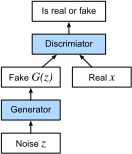

# Mạng đối thủ thế hệ
:label:`sec_basic_gan`

Trong suốt hầu hết cuốn sách này, chúng tôi đã nói về cách đưa ra dự đoán. Ở dạng nào đó hay hình thức khác, chúng tôi đã sử dụng các mạng thần kinh sâu đã học được ánh xạ từ các ví dụ dữ liệu đến nhãn. Loại hình học tập này được gọi là học phân biệt đối xử, như trong, chúng tôi muốn có thể phân biệt đối xử giữa những bức ảnh mèo và hình ảnh của chó. Phân loại và bộ hồi quy đều là ví dụ về việc học phân biệt đối xử. Và mạng lưới thần kinh được đào tạo bởi sự lan truyền ngược đã upended tất cả mọi thứ chúng tôi nghĩ rằng chúng tôi biết về việc học phân biệt đối xử trên các tập dữ liệu phức tạp lớn. Độ chính xác phân loại trên hình ảnh có độ phân giải cao đã đi từ vô dụng đến cấp độ con người (với một số cảnh báo) chỉ trong 5-6 năm. Chúng tôi sẽ dành cho bạn một trò chơi khác về tất cả các nhiệm vụ phân biệt đối xử khác, nơi các mạng thần kinh sâu làm tốt đáng kinh ngạc. 

Nhưng có nhiều hơn để học máy hơn là chỉ giải quyết các nhiệm vụ phân biệt đối xử. Ví dụ, với một tập dữ liệu lớn, không có bất kỳ nhãn nào, chúng ta có thể muốn tìm hiểu một mô hình nắm bắt chính xác các đặc điểm của dữ liệu này. Với một mô hình như vậy, chúng tôi có thể lấy mẫu các ví dụ dữ liệu tổng hợp giống với việc phân phối dữ liệu đào tạo. Ví dụ, với một lượng lớn các bức ảnh khuôn mặt, chúng ta có thể muốn có thể tạo ra một hình ảnh thực tế mới trông giống như nó có thể hợp lý đến từ cùng một tập dữ liệu. Loại học này được gọi là mô hình thế hệ. 

Cho đến gần đây, chúng tôi không có phương pháp nào có thể tổng hợp các hình ảnh photorealistic mới lạ. Nhưng sự thành công của các mạng thần kinh sâu cho việc học phân biệt đối xử đã mở ra những khả năng mới. Một xu hướng lớn trong ba năm qua là việc áp dụng các mạng lưới sâu phân biệt đối xử để vượt qua những thách thức trong các vấn đề mà chúng ta thường không nghĩ là vấn đề học tập được giám sát. Các mô hình ngôn ngữ mạng thần kinh tái phát là một ví dụ về việc sử dụng một mạng phân biệt đối xử (được đào tạo để dự đoán ký tự tiếp theo) mà một khi được đào tạo có thể hoạt động như một mô hình thế hệ. 

Năm 2014, một bài báo đột phá đã giới thiệu mạng đối thủ thế hệ (GAN) :cite:`Goodfellow.Pouget-Abadie.Mirza.ea.2014`, một cách thông minh mới để tận dụng sức mạnh của các mô hình phân biệt đối xử để có được các mô hình thế hệ tốt. Tại trái tim của họ, GAN dựa vào ý tưởng rằng một trình tạo dữ liệu là tốt nếu chúng ta không thể nói dữ liệu giả mạo ngoài dữ liệu thực. Trong thống kê, đây được gọi là thử nghiệm hai mẫu - một bài kiểm tra để trả lời câu hỏi liệu các bộ dữ liệu $X=\{x_1,\ldots, x_n\}$ và $X'=\{x'_1,\ldots, x'_n\}$ có được rút ra từ cùng một phân phối hay không. Sự khác biệt chính giữa hầu hết các giấy tờ thống kê và GAN là sau này sử dụng ý tưởng này một cách mang tính xây dựng. Nói cách khác, thay vì chỉ đào tạo một mô hình để nói “này, hai bộ dữ liệu này trông không giống như chúng đến từ cùng một phân phối”, họ sử dụng [two-sample test](https://en.wikipedia.org/wiki/Two-sample_hypothesis_testing) để cung cấp tín hiệu đào tạo cho một mô hình thế hệ. Điều này cho phép chúng tôi cải thiện trình tạo dữ liệu cho đến khi nó tạo ra một cái gì đó giống với dữ liệu thực. Ít nhất, nó cần phải đánh lừa phân loại. Ngay cả khi phân loại của chúng tôi là một nhà nước của mạng thần kinh sâu sắc nghệ thuật. 


:label:`fig_gan`

Kiến trúc GAN được minh họa vào năm :numref:`fig_gan`. Như bạn có thể thấy, có hai phần trong kiến trúc GAN - trước hết, chúng ta cần một thiết bị (giả sử, một mạng sâu nhưng nó thực sự có thể là bất cứ điều gì, chẳng hạn như một công cụ kết xuất trò chơi) có khả năng có thể tạo ra dữ liệu trông giống như thực tế. Nếu chúng ta đang đối phó với hình ảnh, điều này cần phải tạo ra hình ảnh. Nếu chúng ta đang đối phó với lời nói, nó cần phải tạo ra các chuỗi âm thanh, v.v. Chúng tôi gọi đây là mạng máy phát điện. Thành phần thứ hai là mạng phân biệt đối xử. Nó cố gắng phân biệt dữ liệu giả và thực với nhau. Cả hai mạng đang cạnh tranh với nhau. Mạng máy phát cố gắng đánh lừa mạng phân biệt đối xử. Tại thời điểm đó, mạng phân biệt đối xử thích ứng với dữ liệu giả mới. Thông tin này, lần lượt được sử dụng để cải thiện mạng máy phát điện, v.v. 

Phân biệt đối xử là một phân loại nhị phân để phân biệt nếu đầu vào $x$ là thực (từ dữ liệu thực) hay giả (từ máy phát điện). Thông thường, phân biệt đối xử đầu ra một dự đoán vô hướng $o\in\mathbb R$ cho đầu vào $\mathbf x$, chẳng hạn như sử dụng một lớp dày đặc với kích thước ẩn 1, và sau đó áp dụng hàm sigmoid để có được xác suất dự đoán $D(\mathbf x) = 1/(1+e^{-o})$. Giả sử nhãn $y$ cho dữ liệu thật là $1$ và $0$ cho dữ liệu giả mạo. Chúng tôi đào tạo người phân biệt đối xử để giảm thiểu tổn thất chéo entropy, * tức là *, 

$$ \min_D \{ - y \log D(\mathbf x) - (1-y)\log(1-D(\mathbf x)) \},$$

Đối với máy phát điện, đầu tiên nó rút ra một số tham số $\mathbf z\in\mathbb R^d$ từ một nguồn ngẫu nhiên, *ví dụ*, một phân phối bình thường $\mathbf z \sim \mathcal{N} (0, 1)$. Chúng ta thường gọi $\mathbf z$ là biến tiềm ẩn. Sau đó, nó áp dụng một chức năng để tạo ra $\mathbf x'=G(\mathbf z)$. Mục tiêu của trình tạo là đánh lừa người phân biệt đối xử để phân loại $\mathbf x'=G(\mathbf z)$ là dữ liệu thật, * tức là*, chúng tôi muốn $D( G(\mathbf z)) \approx 1$. Nói cách khác, đối với một phân biệt đối xử nhất định $D$, chúng tôi cập nhật các thông số của máy phát $G$ để tối đa hóa tổn thất ngẫu nhiên chéo khi $y=0$, * i.e.*, 

$$ \max_G \{ - (1-y) \log(1-D(G(\mathbf z))) \} = \max_G \{ - \log(1-D(G(\mathbf z))) \}.$$

Nếu máy phát điện thực hiện một công việc hoàn hảo, thì $D(\mathbf x')\approx 1$ do đó, tổn thất trên gần 0, dẫn đến độ dốc quá nhỏ để đạt được tiến bộ tốt cho người phân biệt đối xử. Vì vậy, thông thường chúng ta giảm thiểu những tổn thất sau: 

$$ \min_G \{ - y \log(D(G(\mathbf z))) \} = \min_G \{ - \log(D(G(\mathbf z))) \}, $$

mà chỉ là thức ăn $\mathbf x'=G(\mathbf z)$ vào phân biệt đối xử nhưng đưa ra nhãn $y=1$. 

Tóm lại, $D$ và $G$ đang chơi một trò chơi “minimax” với chức năng mục tiêu toàn diện: 

$$min_D max_G \{ -E_{x \sim \text{Data}} log D(\mathbf x) - E_{z \sim \text{Noise}} log(1 - D(G(\mathbf z))) \}.$$

Nhiều ứng dụng GAN nằm trong bối cảnh hình ảnh. Là một mục đích trình diễn, chúng ta sẽ tự nội dung với việc lắp một bản phân phối đơn giản hơn nhiều trước tiên. Chúng tôi sẽ minh họa những gì xảy ra nếu chúng ta sử dụng GAN để xây dựng ước tính không hiệu quả nhất thế giới của các tham số cho một Gaussian. Hãy để chúng tôi bắt đầu.

```{.python .input}
%matplotlib inline
from d2l import mxnet as d2l
from mxnet import autograd, gluon, init, np, npx
from mxnet.gluon import nn
npx.set_np()
```

```{.python .input}
#@tab pytorch
%matplotlib inline
from d2l import torch as d2l
import torch
from torch import nn
```

```{.python .input}
#@tab tensorflow
from d2l import tensorflow as d2l
import tensorflow as tf
```

## Tạo ra một số dữ liệu “thực”

Vì đây sẽ là ví dụ đáng sợ nhất thế giới, chúng tôi chỉ đơn giản là tạo ra dữ liệu được rút ra từ Gaussian.

```{.python .input}
#@tab mxnet, pytorch
X = d2l.normal(0.0, 1, (1000, 2))
A = d2l.tensor([[1, 2], [-0.1, 0.5]])
b = d2l.tensor([1, 2])
data = d2l.matmul(X, A) + b
```

```{.python .input}
#@tab tensorflow
X = d2l.normal((1000, 2), 0.0, 1)
A = d2l.tensor([[1, 2], [-0.1, 0.5]])
b = d2l.tensor([1, 2], tf.float32)
data = d2l.matmul(X, A) + b
```

Hãy để chúng tôi xem những gì chúng tôi có. Đây phải là một Gaussian dịch chuyển theo một cách khá tùy ý với trung bình $b$ và ma trận hiệp phương sai $A^TA$.

```{.python .input}
#@tab mxnet, pytorch
d2l.set_figsize()
d2l.plt.scatter(d2l.numpy(data[:100, 0]), d2l.numpy(data[:100, 1]));
print(f'The covariance matrix is\n{d2l.matmul(A.T, A)}')
```

```{.python .input}
#@tab tensorflow
d2l.set_figsize()
d2l.plt.scatter(d2l.numpy(data[:100, 0]), d2l.numpy(data[:100, 1]));
print(f'The covariance matrix is\n{tf.matmul(A, A, transpose_a=True)}')
```

```{.python .input}
#@tab all
batch_size = 8
data_iter = d2l.load_array((data,), batch_size)
```

## Máy phát điện

Mạng máy phát của chúng tôi sẽ là mạng đơn giản nhất có thể - một mô hình tuyến tính lớp duy nhất. Điều này là vì chúng tôi sẽ lái mạng tuyến tính đó với trình tạo dữ liệu Gaussian. Do đó, nó theo nghĩa đen chỉ cần tìm hiểu các thông số để giả mạo mọi thứ một cách hoàn hảo.

```{.python .input}
net_G = nn.Sequential()
net_G.add(nn.Dense(2))
```

```{.python .input}
#@tab pytorch
net_G = nn.Sequential(nn.Linear(2, 2))
```

```{.python .input}
#@tab tensorflow
net_G = tf.keras.layers.Dense(2)
```

## Phân biệt đối xử

Đối với người phân biệt đối xử, chúng ta sẽ phân biệt hơn một chút: chúng ta sẽ sử dụng MLP với 3 lớp để làm cho mọi thứ thú vị hơn một chút.

```{.python .input}
net_D = nn.Sequential()
net_D.add(nn.Dense(5, activation='tanh'),
          nn.Dense(3, activation='tanh'),
          nn.Dense(1))
```

```{.python .input}
#@tab pytorch
net_D = nn.Sequential(
    nn.Linear(2, 5), nn.Tanh(),
    nn.Linear(5, 3), nn.Tanh(),
    nn.Linear(3, 1))
```

```{.python .input}
#@tab tensorflow
net_D = tf.keras.models.Sequential([
    tf.keras.layers.Dense(5, activation="tanh", input_shape=(2,)),
    tf.keras.layers.Dense(3, activation="tanh"),
    tf.keras.layers.Dense(1)
])
```

## Đào tạo

Đầu tiên chúng ta định nghĩa một hàm để cập nhật sự phân biệt đối xử.

```{.python .input}
#@save
def update_D(X, Z, net_D, net_G, loss, trainer_D):
    """Update discriminator."""
    batch_size = X.shape[0]
    ones = np.ones((batch_size,), ctx=X.ctx)
    zeros = np.zeros((batch_size,), ctx=X.ctx)
    with autograd.record():
        real_Y = net_D(X)
        fake_X = net_G(Z)
        # Do not need to compute gradient for `net_G`, detach it from
        # computing gradients.
        fake_Y = net_D(fake_X.detach())
        loss_D = (loss(real_Y, ones) + loss(fake_Y, zeros)) / 2
    loss_D.backward()
    trainer_D.step(batch_size)
    return float(loss_D.sum())
```

```{.python .input}
#@tab pytorch
#@save
def update_D(X, Z, net_D, net_G, loss, trainer_D):
    """Update discriminator."""
    batch_size = X.shape[0]
    ones = torch.ones((batch_size,), device=X.device)
    zeros = torch.zeros((batch_size,), device=X.device)
    trainer_D.zero_grad()
    real_Y = net_D(X)
    fake_X = net_G(Z)
    # Do not need to compute gradient for `net_G`, detach it from
    # computing gradients.
    fake_Y = net_D(fake_X.detach())
    loss_D = (loss(real_Y, ones.reshape(real_Y.shape)) + 
              loss(fake_Y, zeros.reshape(fake_Y.shape))) / 2
    loss_D.backward()
    trainer_D.step()
    return loss_D
```

```{.python .input}
#@tab tensorflow
#@save
def update_D(X, Z, net_D, net_G, loss, optimizer_D):
    """Update discriminator."""
    batch_size = X.shape[0]
    ones = tf.ones((batch_size,)) # Labels corresponding to real data
    zeros = tf.zeros((batch_size,)) # Labels corresponding to fake data
    # Do not need to compute gradient for `net_G`, so it's outside GradientTape
    fake_X = net_G(Z)
    with tf.GradientTape() as tape:
        real_Y = net_D(X)
        fake_Y = net_D(fake_X)
        # We multiply the loss by batch_size to match PyTorch's BCEWithLogitsLoss
        loss_D = (loss(ones, tf.squeeze(real_Y)) + loss(
            zeros, tf.squeeze(fake_Y))) * batch_size / 2
    grads_D = tape.gradient(loss_D, net_D.trainable_variables)
    optimizer_D.apply_gradients(zip(grads_D, net_D.trainable_variables))
    return loss_D
```

Máy phát điện được cập nhật tương tự. Ở đây chúng tôi sử dụng lại tổn thất chéo entropy nhưng thay đổi nhãn của dữ liệu giả từ $0$ thành $1$.

```{.python .input}
#@save
def update_G(Z, net_D, net_G, loss, trainer_G):
    """Update generator."""
    batch_size = Z.shape[0]
    ones = np.ones((batch_size,), ctx=Z.ctx)
    with autograd.record():
        # We could reuse `fake_X` from `update_D` to save computation
        fake_X = net_G(Z)
        # Recomputing `fake_Y` is needed since `net_D` is changed
        fake_Y = net_D(fake_X)
        loss_G = loss(fake_Y, ones)
    loss_G.backward()
    trainer_G.step(batch_size)
    return float(loss_G.sum())
```

```{.python .input}
#@tab pytorch
#@save
def update_G(Z, net_D, net_G, loss, trainer_G):
    """Update generator."""
    batch_size = Z.shape[0]
    ones = torch.ones((batch_size,), device=Z.device)
    trainer_G.zero_grad()
    # We could reuse `fake_X` from `update_D` to save computation
    fake_X = net_G(Z)
    # Recomputing `fake_Y` is needed since `net_D` is changed
    fake_Y = net_D(fake_X)
    loss_G = loss(fake_Y, ones.reshape(fake_Y.shape))
    loss_G.backward()
    trainer_G.step()
    return loss_G
```

```{.python .input}
#@tab tensorflow
#@save
def update_G(Z, net_D, net_G, loss, optimizer_G):
    """Update generator."""
    batch_size = Z.shape[0]
    ones = tf.ones((batch_size,))
    with tf.GradientTape() as tape:
        # We could reuse `fake_X` from `update_D` to save computation
        fake_X = net_G(Z)
        # Recomputing `fake_Y` is needed since `net_D` is changed
        fake_Y = net_D(fake_X)
        # We multiply the loss by batch_size to match PyTorch's BCEWithLogits loss
        loss_G = loss(ones, tf.squeeze(fake_Y)) * batch_size
    grads_G = tape.gradient(loss_G, net_G.trainable_variables)
    optimizer_G.apply_gradients(zip(grads_G, net_G.trainable_variables))
    return loss_G
```

Cả phân biệt đối xử và máy phát điện đều thực hiện hồi quy hậu cần nhị phân với tổn thất chéo entropy. Chúng tôi sử dụng Adam để làm mịn quá trình đào tạo. Trong mỗi lần lặp lại, lần đầu tiên chúng ta cập nhật trình phân biệt đối xử và sau đó là trình tạo. Chúng tôi hình dung cả tổn thất và các ví dụ được tạo ra.

```{.python .input}
def train(net_D, net_G, data_iter, num_epochs, lr_D, lr_G, latent_dim, data):
    loss = gluon.loss.SigmoidBCELoss()
    net_D.initialize(init=init.Normal(0.02), force_reinit=True)
    net_G.initialize(init=init.Normal(0.02), force_reinit=True)
    trainer_D = gluon.Trainer(net_D.collect_params(),
                              'adam', {'learning_rate': lr_D})
    trainer_G = gluon.Trainer(net_G.collect_params(),
                              'adam', {'learning_rate': lr_G})
    animator = d2l.Animator(xlabel='epoch', ylabel='loss',
                            xlim=[1, num_epochs], nrows=2, figsize=(5, 5),
                            legend=['discriminator', 'generator'])
    animator.fig.subplots_adjust(hspace=0.3)
    for epoch in range(num_epochs):
        # Train one epoch
        timer = d2l.Timer()
        metric = d2l.Accumulator(3)  # loss_D, loss_G, num_examples
        for X in data_iter:
            batch_size = X.shape[0]
            Z = np.random.normal(0, 1, size=(batch_size, latent_dim))
            metric.add(update_D(X, Z, net_D, net_G, loss, trainer_D),
                       update_G(Z, net_D, net_G, loss, trainer_G),
                       batch_size)
        # Visualize generated examples
        Z = np.random.normal(0, 1, size=(100, latent_dim))
        fake_X = net_G(Z).asnumpy()
        animator.axes[1].cla()
        animator.axes[1].scatter(data[:, 0], data[:, 1])
        animator.axes[1].scatter(fake_X[:, 0], fake_X[:, 1])
        animator.axes[1].legend(['real', 'generated'])
        # Show the losses
        loss_D, loss_G = metric[0]/metric[2], metric[1]/metric[2]
        animator.add(epoch + 1, (loss_D, loss_G))
    print(f'loss_D {loss_D:.3f}, loss_G {loss_G:.3f}, '
          f'{metric[2] / timer.stop():.1f} examples/sec')
```

```{.python .input}
#@tab pytorch
def train(net_D, net_G, data_iter, num_epochs, lr_D, lr_G, latent_dim, data):
    loss = nn.BCEWithLogitsLoss(reduction='sum')
    for w in net_D.parameters():
        nn.init.normal_(w, 0, 0.02)
    for w in net_G.parameters():
        nn.init.normal_(w, 0, 0.02)
    trainer_D = torch.optim.Adam(net_D.parameters(), lr=lr_D)
    trainer_G = torch.optim.Adam(net_G.parameters(), lr=lr_G)
    animator = d2l.Animator(xlabel='epoch', ylabel='loss',
                            xlim=[1, num_epochs], nrows=2, figsize=(5, 5),
                            legend=['discriminator', 'generator'])
    animator.fig.subplots_adjust(hspace=0.3)
    for epoch in range(num_epochs):
        # Train one epoch
        timer = d2l.Timer()
        metric = d2l.Accumulator(3)  # loss_D, loss_G, num_examples
        for (X,) in data_iter:
            batch_size = X.shape[0]
            Z = torch.normal(0, 1, size=(batch_size, latent_dim))
            metric.add(update_D(X, Z, net_D, net_G, loss, trainer_D),
                       update_G(Z, net_D, net_G, loss, trainer_G),
                       batch_size)
        # Visualize generated examples
        Z = torch.normal(0, 1, size=(100, latent_dim))
        fake_X = net_G(Z).detach().numpy()
        animator.axes[1].cla()
        animator.axes[1].scatter(data[:, 0], data[:, 1])
        animator.axes[1].scatter(fake_X[:, 0], fake_X[:, 1])
        animator.axes[1].legend(['real', 'generated'])
        # Show the losses
        loss_D, loss_G = metric[0]/metric[2], metric[1]/metric[2]
        animator.add(epoch + 1, (loss_D, loss_G))
    print(f'loss_D {loss_D:.3f}, loss_G {loss_G:.3f}, '
          f'{metric[2] / timer.stop():.1f} examples/sec')
```

```{.python .input}
#@tab tensorflow
def train(net_D, net_G, data_iter, num_epochs, lr_D, lr_G, latent_dim, data):
    loss = tf.keras.losses.BinaryCrossentropy(
        from_logits=True, reduction=tf.keras.losses.Reduction.SUM)
    for w in net_D.trainable_variables:
        w.assign(tf.random.normal(mean=0, stddev=0.02, shape=w.shape))
    for w in net_G.trainable_variables:
        w.assign(tf.random.normal(mean=0, stddev=0.02, shape=w.shape))
    optimizer_D = tf.keras.optimizers.Adam(learning_rate=lr_D)
    optimizer_G = tf.keras.optimizers.Adam(learning_rate=lr_G)
    animator = d2l.Animator(
        xlabel="epoch", ylabel="loss", xlim=[1, num_epochs], nrows=2,
        figsize=(5, 5), legend=["discriminator", "generator"])
    animator.fig.subplots_adjust(hspace=0.3)
    for epoch in range(num_epochs):
        # Train one epoch
        timer = d2l.Timer()
        metric = d2l.Accumulator(3)  # loss_D, loss_G, num_examples
        for (X,) in data_iter:
            batch_size = X.shape[0]
            Z = tf.random.normal(
                mean=0, stddev=1, shape=(batch_size, latent_dim))
            metric.add(update_D(X, Z, net_D, net_G, loss, optimizer_D),
                       update_G(Z, net_D, net_G, loss, optimizer_G),
                       batch_size)
        # Visualize generated examples
        Z = tf.random.normal(mean=0, stddev=1, shape=(100, latent_dim))
        fake_X = net_G(Z)
        animator.axes[1].cla()
        animator.axes[1].scatter(data[:, 0], data[:, 1])
        animator.axes[1].scatter(fake_X[:, 0], fake_X[:, 1])
        animator.axes[1].legend(["real", "generated"])
        
        # Show the losses
        loss_D, loss_G = metric[0] / metric[2], metric[1] / metric[2]
        animator.add(epoch + 1, (loss_D, loss_G))
        
    print(f'loss_D {loss_D:.3f}, loss_G {loss_G:.3f}, '
          f'{metric[2] / timer.stop():.1f} examples/sec')
```

Bây giờ chúng tôi chỉ định các siêu tham số để phù hợp với phân phối Gaussian.

```{.python .input}
#@tab all
lr_D, lr_G, latent_dim, num_epochs = 0.05, 0.005, 2, 20
train(net_D, net_G, data_iter, num_epochs, lr_D, lr_G,
      latent_dim, d2l.numpy(data[:100]))
```

## Tóm tắt

* Các mạng đối thủ thế hệ (GAN) bao gồm hai mạng sâu, máy phát điện và người phân biệt đối xử.
* Trình tạo tạo ra hình ảnh càng gần với hình ảnh thật càng tốt để đánh lừa sự phân biệt đối xử, thông qua việc tối đa hóa tổn thất chéo entropy, * tức là *, $\max \log(D(\mathbf{x'}))$.
* Người phân biệt đối xử cố gắng phân biệt các hình ảnh được tạo ra với hình ảnh thật, thông qua việc giảm thiểu tổn thất chéo entropy, * tức là *, $\min - y \log D(\mathbf{x}) - (1-y)\log(1-D(\mathbf{x}))$.

## Bài tập

* Liệu một trạng thái cân bằng tồn tại nơi máy phát chiến thắng, * tức là * người phân biệt đối xử cuối cùng không thể phân biệt hai phân phối trên các mẫu hữu hạn?

:begin_tab:`mxnet`
[Discussions](https://discuss.d2l.ai/t/408)
:end_tab:

:begin_tab:`pytorch`
[Discussions](https://discuss.d2l.ai/t/1082)
:end_tab:
