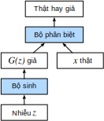

<!--
# Generative Adversarial Networks
-->

# Mạng Đối sinh
:label:`sec_basic_gan`


<!--
Throughout most of this book, we have talked about how to make predictions.
In some form or another, we used deep neural networks learned mappings from data examples to labels.
This kind of learning is called discriminative learning,
as in, we'd like to be able to discriminate between photos cats and photos of dogs.
Classifiers and regressors are both examples of discriminative learning.
And neural networks trained by backpropagation have upended everything 
we thought we knew about discriminative learning on large complicated datasets.
Classification accuracies on high-res images has gone from useless to human-level (with some caveats) in just 5-6 years.
We will spare you another spiel about all the other discriminative tasks where deep neural networks do astoundingly well.
-->

Xuyên suốt phần lớn cuốn sách này, ta đã nói về việc làm thế nào để thực hiện những dự đoán.
Ở dưới dạng nào đi nữa, ta đã cho mạng nơ-ron sâu học cách ánh xạ từ các mẫu dữ liệu sang các nhãn.
Kiểu học này được gọi là học phân biệt,
ví dụ như phân biệt ảnh chó và mèo.
Phân loại và hồi quy là hai ví dụ của việc học phân biệt.
Mạng nơ-ron được huấn luyện bằng phương pháp lan truyền ngược đã đảo lộn mọi thứ
ta từng biết về học phân biệt trên các tập dữ liệu lớn phức tạp.
Độ chính xác của tác vụ phân loại ảnh có độ phân giải cao đã đạt tới mức độ như người (với một số điều kiện) từ chỗ không thể sử dụng được chỉ trong 5-6 năm gần đây.
May mắn cho bạn, sẽ không có một bài diễn thuyết nữa về các tác vụ phân biệt khác mà ở đó mạng nơ-ron sâu thực hiện tốt một cách đáng kinh ngạc.


<!--
But there is more to machine learning than just solving discriminative tasks.
For example, given a large dataset, without any labels, 
we might want to learn a model that concisely captures the characteristics of this data.
Given such a model, we could sample synthetic data examples that resemble the distribution of the training data.
For example, given a large corpus of photographs of faces,
we might want to be able to generate a new photorealistic image that looks like it might plausibly have come from the same dataset.
This kind of learning is called generative modeling.
-->

Nhưng học máy còn làm được nhiều hơn là chỉ giải quyết các tác vụ phân biệt.
Chẳng hạn, với một tập dữ liệu không nhãn cho trước,
ta có thể xây dựng một mô hình nắm bắt chính xác các đặc tính của tập dữ liệu này.
Với một mô hình như vậy, ta có thể tổng hợp ra các mẫu dữ liệu mới giống như phân phối của dữ liệu dùng để huấn luyện.
Ví dụ, với một kho lớn dữ liệu ảnh khuôn mặt cho trước, ta có thể tạo ra
một ảnh như thật, giống như nó được lấy từ cùng tập dữ liệu.
Kiểu học này được gọi là mô hình hóa tác vụ sinh (*generative modelling*).


<!--
Until recently, we had no method that could synthesize novel photorealistic images.
But the success of deep neural networks for discriminative learning opened up new possibilities.
One big trend over the last three years has been the application of
discriminative deep nets to overcome challenges in problems that we do not generally think of as supervised learning problems.
The recurrent neural network language models are one example of using a discriminative network 
(trained to predict the next character) that once trained can act as a generative model.
-->

Cho đến gần đây, ta không có phương pháp nào để có thể tổng hợp các ảnh mới như thật.
Nhưng thành công của mạng nơ-ron sâu với học phân biệt đã mở ra những khả năng mới.
Một xu hướng lớn trong hơn ba năm vừa qua là việc áp dụng
mạng sâu phân biệt để vượt qua các thách thức trong các bài toán mà nhìn chung không được xem là học có giám sát.
Các mô hình ngôn ngữ mạng nơ-ron hồi tiếp là một ví dụ về việc sử dụng một mạng phân biệt
(được huấn luyện để dự đoán ký tự kế tiếp) mà một khi được huấn luyện có thể vận hành như một mô hình sinh. 


<!--
In 2014, a breakthrough paper introduced Generative adversarial networks (GANs) :cite:`Goodfellow.Pouget-Abadie.Mirza.ea.2014`, 
a clever new way to leverage the power of discriminative models to get good generative models.
At their heart, GANs rely on the idea that a data generator is good if we cannot tell fake data apart from real data.
In statistics, this is called a two-sample test - a test to answer 
the question whether datasets $X=\{x_1,\ldots, x_n\}$ and $X'=\{x'_1,\ldots, x'_n\}$ were drawn from the same distribution.
The main difference between most statistics papers and GANs is that the latter use this idea in a constructive way.
In other words, rather than just training a model to say "hey, these two datasets do not look like they came from the same distribution",
they use the [two-sample test](https://en.wikipedia.org/wiki/Two-sample_hypothesis_testing) to provide training signals to a generative model.
This allows us to improve the data generator until it generates something that resembles the real data.
At the very least, it needs to fool the classifier. Even if our classifier is a state of the art deep neural network.
-->

Trong năm 2014, có một bài báo mang tính đột phá đã giới thiệu Mạng đối sinh (*Generative Adversarial Network - GAN*) :cite:`Goodfellow.Pouget-Abadie.Mirza.ea.2014`,
một phương pháp khôn khéo tận dụng sức mạnh của các mô hình phân biệt để có được các mô hình sinh tốt.
Về cốt lõi, GAN dựa trên ý tưởng là một bộ sinh dữ liệu là tốt nếu ta không thể chỉ ra đâu là dữ liệu giả và đâu là dữ liệu thật.
Trong thống kê, điều này được gọi là bài kiểm tra từ hai tập mẫu - một bài kiểm tra để trả lời
câu hỏi liệu tập dữ liệu $X=\{x_1,\ldots, x_n\}$ và  $X'=\{x'_1,\ldots, x'_n\}$ có được rút ra từ cùng một phân phối.
Sự khác biệt chính giữa hầu hết những bài nghiên cứu thống kê và GAN là GAN sử dụng ý tưởng này theo kiểu có tính cách xây dựng.
Nói cách khác, thay vì chỉ huấn luyện một mô hình để nói "này, hai tập dữ liệu này có vẻ như không đến từ cùng một phân phối",
thì chúng sử dụng [phương pháp kiểm tra trên hai tập mẫu](https://en.wikipedia.org/wiki/Two-sample_hypothesis_testing) để cung cấp tín hiệu cho việc huấn luyện cho một mô hình sinh.
Điều này cho phép ta cải thiện bộ sinh dữ liệu tới khi nó sinh ra thứ gì đó giống như dữ liệu thực.
Ở mức tối thiểu nhất, nó cần lừa được bộ phân loại, kể cả nếu bộ phân loại của ta là một mạng nơ-ron sâu tân tiến nhất.


<!--

-->


:label:`fig_gan`


<!--
The GAN architecture is illustrated in :numref:`fig_gan`.
As you can see, there are two pieces in GAN architecture - first off, we need a device
(say, a deep network but it really could be anything, such as a game rendering engine) 
that might potentially be able to generate data that looks just like the real thing.
If we are dealing with images, this needs to generate images.
If we are dealing with speech, it needs to generate audio sequences, and so on.
We call this the generator network. The second component is the discriminator network.
It attempts to distinguish fake and real data from each other.
Both networks are in competition with each other.
The generator network attempts to fool the discriminator network.
At that point, the discriminator network adapts to the new fake data.
This information, in turn is used to improve the generator network, and so on.
-->

Kiến trúc của mạng đối sinh được miêu tả trong hình :numref:`fig_gan`.
Như ta có thể thấy, có hai thành phần trong kiến trúc của GAN - đầu tiên, ta cần một thiết bị (giả sử, một mạng sâu nhưng nó có thể là bất kỳ thứ gì, 
chẳng hạn như công cụ kết xuất đồ họa trò chơi) có khả năng tạo ra dữ liệu giống thật. 
Nếu ta đang làm việc với hình ảnh, mô hình cần tạo ra hình ảnh.
Nếu ta đang làm việc với giọng nói, mô hình cần tạo ra được chuỗi âm thanh, v.v.
Ta gọi mô hình này là mạng sinh (*generator network*). Thành phần thứ hai là mạng phân biệt (*discriminator network*).
Nó cố gắng phân biệt dữ liệu giả và thật.
Cả hai mạng này sẽ cạnh tranh với nhau.
Mạng sinh sẽ cố gắng đánh lừa mạng phân biệt.
Đồng thời, mạng phân biệt sẽ thích nghi với dữ liệu giả vừa mới tạo ra.
Thông tin thu được sẽ được dùng để cải thiện mạng sinh, và cứ tiếp tục như vậy.


<!--
The discriminator is a binary classifier to distinguish if the input $x$ is real (from real data) or fake (from the generator).
Typically, the discriminator outputs a scalar prediction $o\in\mathbb R$ for input $\mathbf x$, 
such as using a dense layer with hidden size 1, 
and then applies sigmoid function to obtain the predicted probability $D(\mathbf x) = 1/(1+e^{-o})$.
Assume the label $y$ for the true data is $1$ and $0$ for the fake data.
We train the discriminator to minimize the cross-entropy loss, *i.e.*,
-->

Mạng phân biệt là một bộ phân loại nhị phân nhằm phân biệt xem đầu vào $x$ là thật (từ dữ liệu thật) hoặc giả (từ mạng sinh).
Thông thường, đầu ra của mạng phân biệt là một số vô hướng $o\in\mathbb R$ dự đoán cho đầu vào $\mathbf x$, 
chằng hạn như sử dụng một tầng kết nối đầy đủ với kích thước ẩn 1 và sau đó sẽ được đưa qua hàm sigmoid để nhận được xác suất dự đoán $D(\mathbf x) = 1/(1+e^{-o})$.
Giả sử nhãn $y$ cho dữ liệu thật là $1$ và $0$ cho dữ liệu giả.
Ta sẽ huấn luyện mạng phân biệt để cực tiểu hóa mất mát entropy chéo, *nghĩa là*, 


$$ \min_D \{ - y \log D(\mathbf x) - (1-y)\log(1-D(\mathbf x)) \},$$


<!--
For the generator, it first draws some parameter $\mathbf z\in\mathbb R^d$ from a source of randomness,
*e.g.*, a normal distribution $\mathbf z \sim \mathcal{N} (0, 1)$.
We often call $\mathbf z$ as the latent variable.
It then applies a function to generate $\mathbf x'=G(\mathbf z)$.
The goal of the generator is to fool the discriminator to classify $\mathbf x'=G(\mathbf z)$ 
as true data, *i.e.*, we want $D( G(\mathbf z)) \approx 1$.
In other words, for a given discriminator $D$, 
we update the parameters of the generator $G$ to maximize the cross-entropy loss when $y=0$, *i.e.*,
-->

Đối với mạng sinh, trước tiên nó tạo ra một vài tham số ngẫu nhiên $\mathbf z\in\mathbb R^d$ từ một nguồn, *ví dụ*, phân phối chuẩn $\mathbf z \sim \mathcal{N} (0, 1)$.
Ta thường gọi $\mathbf z$ như là một biến tiềm ẩn.
Mục tiêu của mạng sinh là đánh lừa mạng phân biệt để phân loại $\mathbf x'=G(\mathbf z)$ là dữ liệu thật, *nghĩa là*, ta muốn $D( G(\mathbf z)) \approx 1$.
Nói cách khác, cho trước một mạng phân biệt $D$, ta sẽ cập nhật tham số của mạng sinh $G$ nhằm cực đại hóa mất mát entropy chéo khi $y=0$, *tức là*,


$$ \max_G \{ - (1-y) \log(1-D(G(\mathbf z))) \} = \max_G \{ - \log(1-D(G(\mathbf z))) \}.$$

<!--
If the generator does a perfect job, then $D(\mathbf x')\approx 1$ so the above loss near 0, 
which results the gradients are too small to make a good progress for the discriminator.
So commonly we minimize the following loss:
-->

Nếu như mạng sinh làm tốt, thì $D(\mathbf x')\approx 1$ để mất mát gần 0, kết quả là các gradient sẽ trở nên quá nhỏ để tạo ra được sự tiến bộ đáng kể cho mạng phân biệt.
Vì vậy, ta sẽ cực tiểu hóa mất mát như sau:


$$ \min_G \{ - y \log(D(G(\mathbf z))) \} = \min_G \{ - \log(D(G(\mathbf z))) \}, $$


<!--
which is just feed $\mathbf x'=G(\mathbf z)$ into the discriminator but giving label $y=1$.
-->


trong đó chỉ đưa $\mathbf x'=G(\mathbf z)$ vào mạng phân biệt nhưng cho trước nhãn $y=1$.


<!--
To sum up, $D$ and $G$ are playing a "minimax" game with the comprehensive objective function:
-->

Nói tóm lại, $D$ và $G$ đang chơi trò "minimax" (cực tiểu hóa cực đại) với một hàm mục tiêu toàn diện như sau:


$$min_D max_G \{ -E_{x \sim \text{Data}} log D(\mathbf x) - E_{z \sim \text{Noise}} log(1 - D(G(\mathbf z))) \}.$$


<!--
Many of the GANs applications are in the context of images.
As a demonstration purpose, we are going to content ourselves with fitting a much simpler distribution first.
We will illustrate what happens if we use GANs to build the world's most inefficient estimator of parameters for a Gaussian. 
Let us get started.
-->

Rất nhiều ứng dụng của GAN liên quan tới hình ảnh.
Để ví dụ, chúng ta sẽ bắt đầu với việc khớp một phân phối đơn giản trước.
Ta sẽ minh họa bằng việc cho thấy việc gì sẽ xảy ra nếu sử dụng GAN để tạo một bộ ước lượng kém hiệu quả nhất thế giới cho một phân phối Gauss.
Hãy tiến hành nào.


```{.python .input}
%matplotlib inline
from d2l import mxnet as d2l
from mxnet import autograd, gluon, init, np, npx
from mxnet.gluon import nn
npx.set_np()
```

```{.python .input}
#@tab pytorch
%matplotlib inline
from d2l import torch as d2l
import torch
from torch import nn
```


<!--
## Generate some "real" data
-->

## Sinh một vài Dữ liệu "thật"


<!--
Since this is going to be the world's lamest example, we simply generate data drawn from a Gaussian.
-->

Vì đây có thể là một ví dụ nhàm chán nhất, ta chỉ đơn giản sinh dữ liệu lấy từ một phân phối Gauss.


```{.python .input}
#@tab all
X = d2l.normal(0.0, 1, (1000, 2))
A = d2l.tensor([[1, 2], [-0.1, 0.5]])
b = d2l.tensor([1, 2])
data = d2l.matmul(X, A) + b
```


<!--
Let us see what we got.
This should be a Gaussian shifted in some rather arbitrary way with mean $b$ and covariance matrix $A^TA$.
-->

Dựa vào đoạn mã trên,
dữ liệu này là một phân phối Gauss được dịch chuyển một cách tùy ý với trung bình $b$ và ma trận hiệp phương sai $A^TA$.


```{.python .input}
#@tab all
d2l.set_figsize()
d2l.plt.scatter(d2l.numpy(data[:100, 0]), d2l.numpy(data[:100, 1]));
print(f'The covariance matrix is\n{d2l.matmul(A.T, A)}')
```

```{.python .input}
#@tab all
batch_size = 8
data_iter = d2l.load_array((data,), batch_size)
```


<!--
## Generator
-->

## Bộ Sinh 


<!--
Our generator network will be the simplest network possible - a single layer linear model.
This is since we will be driving that linear network with a Gaussian data generator.
Hence, it literally only needs to learn the parameters to fake things perfectly.
-->

Bộ sinh sẽ là một mạng đơn giản nhất có thể - một mô hình tuyến tính đơn tầng.
Đó là vì chúng ta sẽ sử dụng mạng tuyến tính này cùng với bộ sinh dữ liệu từ phân phối Gauss.
Vậy nên, nó chỉ cần học những tham số của phân phối này để làm giả dữ liệu một cách hoàn hảo.


```{.python .input}
net_G = nn.Sequential()
net_G.add(nn.Dense(2))
```

```{.python .input}
#@tab pytorch
net_G = nn.Sequential(nn.Linear(2, 2))
```


<!--
## Discriminator
-->

## Bộ Phân biệt


<!--
For the discriminator we will be a bit more discriminating: 
we will use an MLP with 3 layers to make things a bit more interesting.
-->

Đối với bộ phân biệt, nó sẽ hơi khác một chút:
ta sẽ sử dụng một MLP 3 tầng để khiến mọi thứ trở nên thú vị hơn.


```{.python .input}
net_D = nn.Sequential()
net_D.add(nn.Dense(5, activation='tanh'),
          nn.Dense(3, activation='tanh'),
          nn.Dense(1))
```

```{.python .input}
#@tab pytorch
net_D = nn.Sequential(
    nn.Linear(2, 5), nn.Tanh(),
    nn.Linear(5, 3), nn.Tanh(),
    nn.Linear(3, 1))
```


<!--
## Training
-->

## Huấn luyện


<!--
First we define a function to update the discriminator.
-->

Đầu tiên, ta định nghĩa một hàm để cập nhật bộ phân biệt.


```{.python .input}
#@save
def update_D(X, Z, net_D, net_G, loss, trainer_D):
    """Update discriminator."""
    batch_size = X.shape[0]
    ones = np.ones((batch_size,), ctx=X.ctx)
    zeros = np.zeros((batch_size,), ctx=X.ctx)
    with autograd.record():
        real_Y = net_D(X)
        fake_X = net_G(Z)
        # Do not need to compute gradient for `net_G`, detach it from
        # computing gradients.
        fake_Y = net_D(fake_X.detach())
        loss_D = (loss(real_Y, ones) + loss(fake_Y, zeros)) / 2
    loss_D.backward()
    trainer_D.step(batch_size)
    return float(loss_D.sum())
```

```{.python .input}
#@tab pytorch
#@save
def update_D(X, Z, net_D, net_G, loss, trainer_D):
    """Update discriminator."""
    batch_size = X.shape[0]
    ones = torch.ones((batch_size,), device=X.device)
    zeros = torch.zeros((batch_size,), device=X.device)
    trainer_D.zero_grad()
    real_Y = net_D(X)
    fake_X = net_G(Z)
    # Do not need to compute gradient for `net_G`, detach it from
    # computing gradients.
    fake_Y = net_D(fake_X.detach())
    loss_D = (loss(real_Y, ones.reshape(real_Y.shape)) + 
              loss(fake_Y, zeros.reshape(fake_Y.shape))) / 2
    loss_D.backward()
    trainer_D.step()
    return loss_D
```


<!--
The generator is updated similarly.
Here we reuse the cross-entropy loss but change the label of the fake data from $0$ to $1$.
-->

Bộ sinh cũng được cập nhật theo cách tương tự.
Ở đây, ta sử dụng lại làm mất mát entropy chéo nhưng thay nhãn của dữ liệu giả từ $0$ thành $1$.


```{.python .input}
#@save
def update_G(Z, net_D, net_G, loss, trainer_G):
    """Update generator."""
    batch_size = Z.shape[0]
    ones = np.ones((batch_size,), ctx=Z.ctx)
    with autograd.record():
        # We could reuse `fake_X` from `update_D` to save computation
        fake_X = net_G(Z)
        # Recomputing `fake_Y` is needed since `net_D` is changed
        fake_Y = net_D(fake_X)
        loss_G = loss(fake_Y, ones)
    loss_G.backward()
    trainer_G.step(batch_size)
    return float(loss_G.sum())
```

```{.python .input}
#@tab pytorch
#@save
def update_G(Z, net_D, net_G, loss, trainer_G):
    """Update generator."""
    batch_size = Z.shape[0]
    ones = torch.ones((batch_size,), device=Z.device)
    trainer_G.zero_grad()
    # We could reuse `fake_X` from `update_D` to save computation
    fake_X = net_G(Z)
    # Recomputing `fake_Y` is needed since `net_D` is changed
    fake_Y = net_D(fake_X)
    loss_G = loss(fake_Y, ones.reshape(fake_Y.shape))
    loss_G.backward()
    trainer_G.step()
    return loss_G
```


<!--
Both the discriminator and the generator performs a binary logistic regression with the cross-entropy loss.
We use Adam to smooth the training process.
In each iteration, we first update the discriminator and then the generator.
We visualize both losses and generated examples.
-->

Cả bộ phân biệt lẫn bộ sinh hoạt động như một bộ hồi quy logistic nhị phân với mất mát entropy chéo.
Ta sử dụng Adam để làm mượt quá trình huấn luyện.
Với mỗi lần lặp, đầu tiên ta cập nhật bộ phân biệt và sau đó đến bộ sinh.
Ta sẽ theo dõi cả giá trị mất mát lẫn những dữ liệu được sinh ra.


```{.python .input}
def train(net_D, net_G, data_iter, num_epochs, lr_D, lr_G, latent_dim, data):
    loss = gluon.loss.SigmoidBCELoss()
    net_D.initialize(init=init.Normal(0.02), force_reinit=True)
    net_G.initialize(init=init.Normal(0.02), force_reinit=True)
    trainer_D = gluon.Trainer(net_D.collect_params(),
                              'adam', {'learning_rate': lr_D})
    trainer_G = gluon.Trainer(net_G.collect_params(),
                              'adam', {'learning_rate': lr_G})
    animator = d2l.Animator(xlabel='epoch', ylabel='loss',
                            xlim=[1, num_epochs], nrows=2, figsize=(5, 5),
                            legend=['discriminator', 'generator'])
    animator.fig.subplots_adjust(hspace=0.3)
    for epoch in range(num_epochs):
        # Train one epoch
        timer = d2l.Timer()
        metric = d2l.Accumulator(3)  # loss_D, loss_G, num_examples
        for X in data_iter:
            batch_size = X.shape[0]
            Z = np.random.normal(0, 1, size=(batch_size, latent_dim))
            metric.add(update_D(X, Z, net_D, net_G, loss, trainer_D),
                       update_G(Z, net_D, net_G, loss, trainer_G),
                       batch_size)
        # Visualize generated examples
        Z = np.random.normal(0, 1, size=(100, latent_dim))
        fake_X = net_G(Z).asnumpy()
        animator.axes[1].cla()
        animator.axes[1].scatter(data[:, 0], data[:, 1])
        animator.axes[1].scatter(fake_X[:, 0], fake_X[:, 1])
        animator.axes[1].legend(['real', 'generated'])
        # Show the losses
        loss_D, loss_G = metric[0]/metric[2], metric[1]/metric[2]
        animator.add(epoch + 1, (loss_D, loss_G))
    print(f'loss_D {loss_D:.3f}, loss_G {loss_G:.3f}, '
          f'{metric[2] / timer.stop():.1f} examples/sec')
```

```{.python .input}
#@tab pytorch
def train(net_D, net_G, data_iter, num_epochs, lr_D, lr_G, latent_dim, data):
    loss = nn.BCEWithLogitsLoss(reduction='sum')
    for w in net_D.parameters():
        nn.init.normal_(w, 0, 0.02)
    for w in net_G.parameters():
        nn.init.normal_(w, 0, 0.02)
    trainer_D = torch.optim.Adam(net_D.parameters(), lr=lr_D)
    trainer_G = torch.optim.Adam(net_G.parameters(), lr=lr_G)
    animator = d2l.Animator(xlabel='epoch', ylabel='loss',
                            xlim=[1, num_epochs], nrows=2, figsize=(5, 5),
                            legend=['discriminator', 'generator'])
    animator.fig.subplots_adjust(hspace=0.3)
    for epoch in range(num_epochs):
        # Train one epoch
        timer = d2l.Timer()
        metric = d2l.Accumulator(3)  # loss_D, loss_G, num_examples
        for (X,) in data_iter:
            batch_size = X.shape[0]
            Z = torch.normal(0, 1, size=(batch_size, latent_dim))
            metric.add(update_D(X, Z, net_D, net_G, loss, trainer_D),
                       update_G(Z, net_D, net_G, loss, trainer_G),
                       batch_size)
        # Visualize generated examples
        Z = torch.normal(0, 1, size=(100, latent_dim))
        fake_X = net_G(Z).detach().numpy()
        animator.axes[1].cla()
        animator.axes[1].scatter(data[:, 0], data[:, 1])
        animator.axes[1].scatter(fake_X[:, 0], fake_X[:, 1])
        animator.axes[1].legend(['real', 'generated'])
        # Show the losses
        loss_D, loss_G = metric[0]/metric[2], metric[1]/metric[2]
        animator.add(epoch + 1, (loss_D, loss_G))
    print(f'loss_D {loss_D:.3f}, loss_G {loss_G:.3f}, '
          f'{metric[2] / timer.stop():.1f} examples/sec')
```


<!--
Now we specify the hyperparameters to fit the Gaussian distribution.
-->

Bây giờ, ta xác định các siêu tham số để khớp với phân phối Gauss.


```{.python .input}
#@tab all
lr_D, lr_G, latent_dim, num_epochs = 0.05, 0.005, 2, 20
train(net_D, net_G, data_iter, num_epochs, lr_D, lr_G,
      latent_dim, d2l.numpy(data[:100]))
```

## Tóm tắt

<!--
* Generative adversarial networks (GANs) composes of two deep networks, the generator and the discriminator.
* The generator generates the image as much closer to the true image as possible to fool the discriminator, via maximizing the cross-entropy loss, *i.e.*, $\max \log(D(\mathbf{x'}))$.
* The discriminator tries to distinguish the generated images from the true images, via minimizing the cross-entropy loss, *i.e.*, $\min - y \log D(\mathbf{x}) - (1-y)\log(1-D(\mathbf{x}))$.
-->

* Mạng đối sinh (*Generative adversarial networks - GAN*) được cấu thành bởi hai mạng sâu, bộ sinh và bộ phân biệt. 
* Bộ sinh tạo các ảnh gần với ảnh thật nhất có thể nhằm đánh lừa bộ phân biệt, thông qua tối đa hóa mất mát entropy chéo, *nói cách khác*, $\max \log(D(\mathbf{x'}))$. 
* Bộ phân biệt cố gắng phân biệt những ảnh được tạo với ảnh thật, thông qua tối thiểu hóa mất mát entropy chéo, *nói cách khác*, $\min - y \log D(\mathbf{x}) - (1-y)\log(1-D(\mathbf{x}))$. 


## Bài tập

<!--
Does an equilibrium exist where the generator wins, *i.e.* the discriminator ends up unable to distinguish the two distributions on finite samples?
-->

Liệu có tồn tại điểm cân bằng mà tại đó bộ sinh là người chiến thắng, *nói cách khác*, bộ phân biệt không thể phân biệt được hai phân phối trên dữ liệu hữu hạn?


## Thảo luận
* Tiếng Anh: [MXNet](https://discuss.d2l.ai/t/408), [PyTorch](https://discuss.d2l.ai/t/1082)
* Tiếng Việt: [Diễn đàn Machine Learning Cơ Bản](https://forum.machinelearningcoban.com/c/d2l)


## Những người thực hiện
Bản dịch trong trang này được thực hiện bởi:

* Đoàn Võ Duy Thanh
* Nguyễn Mai Hoàng Long
* Lê Khắc Hồng Phúc
* Phạm Hồng Vinh
* Lý Phi Long
* Nguyễn Văn Cường
* Nguyễn Lê Quang Nhật
* Phạm Minh Đức
* Nguyễn Thái Bình

*Lần cập nhật gần nhất: 05/10/2020. (Cập nhật lần cuối từ nội dung gốc: 17/09/2020)*
