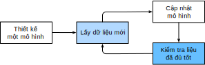
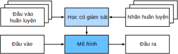
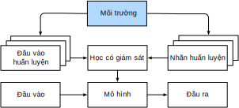
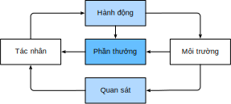

<!-- =================== Bắt đầu dịch Phần 1 ==================== -->

<!--
# Introduction
-->

# Giới thiệu
:label:`chap_introduction`

<!--
Until recently, nearly every computer program that interact with daily
were coded by software developers from first principles.
Say that we wanted to write an application to manage an e-commerce platform.  After huddling around a whiteboard for a few hours to ponder the problem,
we would come up with the broad strokes of a working solution that might probably look something like this:
(i) users interact with the application through an interface
running in a web browser or mobile application;
(ii) our application interacts with a commercial-grade database engine
to keep track of each user's state and maintain records
of historical transactions; and (iii) at the heart of our application,
the *business logic* (you might say, the *brains*) of our application
spells out in methodical detail the appropriate action
that our program should take in every conceivable circumstance.
-->

Mãi tới tận gần đây, gần như tất cả mọi chương trình máy tính mà chúng ta tương tác hàng ngày
đều được tạo ra bởi lập trình viên phần mềm từ những định đề cơ bản.
Giả sử chúng ta muốn viết một ứng dụng quản lý hệ thống thương mại điện tử.
Sau khi túm tụm lại xung quanh chiếc bảng trắng để suy nghĩ về vấn đề một cách cặn kẽ,
chúng ta có thể phác thảo một giải pháp vận hành được, phần nào sẽ nhìn giống như sau:
(i) người dùng tương tác với ứng dụng thông qua một giao diện chạy trên trình duyệt web hoặc ứng dụng trên điện thoại;
(ii) ứng dụng tương tác với một hệ thống cơ sở dữ liệu thương mại
để theo dõi trạng thái của từng người dùng và duy trì hồ sơ lịch sử các giao dịch;
và (iii) (cũng là cốt lõi của ứng dụng) các logic nghiệp vụ (hay cũng có thể nói *bộ não*) mô tả cách thức xử lí cụ thể của ứng dụng trong từng tình huống có thể xảy ra.

<!--
To build the *brains* of our application,
we'd have to step through every possible corner case
that we anticipate encountering, devising appropriate rules.
Each time a customer clicks to add an item to their shopping cart,
we add an entry to the shopping cart database table,
associating that user's ID with the requested product’s ID.
While few developers ever get it completely right the first time
(it might take some test runs to work out the kinks),
for the most part, we could write such a program from first principles
and confidently launch it *before ever seeing a real customer*.
Our ability to design automated systems from first principles
that drive functioning products and systems, often in novel situations,
is a remarkable cognitive feat.
And when you are able to devise solutions that work $100\%$ of the time,
*you should not be using machine learning*.
-->

Để xây dựng *bộ não* của ứng dụng này, ta phải xem xét tất cả mọi trường hợp mà chúng ta cho rằng sẽ gặp phải
, qua đó đặt ra những quy tắc thích hợp.
Ví dụ, mỗi lần người dùng nhấn để thêm một món đồ vào giỏ hàng,
ta thêm một trường vào bảng giỏ hàng trong cơ sở dữ liệu,
liên kết ID của người dùng với ID của món hàng được yêu cầu.
Mặc dù hầu như rất ít lập trình viên có thể làm đúng hết trong lần đầu tiên,
(sẽ cần vài lần chạy kiểm tra để xử lý hết được những trường hợp hiểm hóc),
hầu như phần lớn ta có thể lập trình được từ những định đề cơ bản
và tự tin chạy ứng dụng *trước khi được dùng bởi một khách hàng thực sự nào*.
Khả năng phát triển những sản phầm và hệ thống tự động từ những định đề cơ bản,
thường là trong những điều kiện mới lạ, là một kì công trong suy luận và nhận thức của con người.
Và khi mà bạn có thể tạo ra một giải pháp mà có thể hoạt động được trong mọi tình huống,
*bạn không nên sử dụng học máy*.

<!--
Fortunately for the growing community of ML scientists,
many tasks that we would like to automate
do not bend so easily to human ingenuity.
Imagine huddling around the whiteboard with the smartest minds you know,
but this time you are tackling one of the following problems:
-->

May mắn thay cho cộng đồng đang tăng trưởng của các nhà khoa học về học máy,
nhiều tác vụ mà chúng ta muốn tự động hoá không dễ dàng bị khuất phục bởi sự tài tình của con người.
Thử tưởng tượng bạn đang quây quần bên tấm bảng trắng với những bộ não thông minh nhất mà bạn biết,
nhưng lần này bạn đang đương đầu với một trong những vấn đề dưới đây:

<!--
* Write a program that predicts tomorrow's weather given geographic
information, satellite images, and a trailing window of past weather.
* Write a program that takes in a question, expressed in free-form text, and
 answers it correctly.
* Write a program that given an image can identify all the people it contains,
 drawing outlines around each.
* Write a program that presents users with products that they are likely to
  enjoy but unlikely, in the natural course of browsing, to encounter.
-->

* Viết một chương trình dự báo thời tiết ngày mai, cho biết trước thông tin địa lý,
hình ảnh vệ tinh, và một chuỗi dữ liệu thời tiết trong quá khứ.
* Viết một chương trình lấy đầu vào là một câu hỏi, được diễn đạt không theo khuôn mẫu nào,
và trả lời nó một cách chính xác.
* Viết một chương trình hiển thị ra cho người dùng những sản phẩm mà họ có khả năng cao sẽ thích,
nhưng lại ít có khả năng gặp được khi duyệt qua môt cách tự nhiên.

<!--
In each of these cases, even elite programmers
are incapable of coding up solutions from scratch.
The reasons for this can vary. Sometimes the program
that we are looking for follows a pattern that changes over time,
and we need our programs to adapt.
In other cases, the relationship (say between pixels,
and abstract categories) may be too complicated,
requiring thousands or millions of computations
that are beyond our conscious understanding
(even if our eyes manage the task effortlessly).
Machine learning (ML) is the study of powerful
techniques that can *learn* from *experience*.
As ML algorithm accumulates more experience,
typically in the form of observational data or
interactions with an environment, their performance improves.
Contrast this with our deterministic e-commerce platform,
which performs according to the same business logic,
no matter how much experience accrues,
until the developers themselves *learn* and decide
that it is time to update the software.
In this book, we will teach you the fundamentals of machine learning,
and focus in particular on deep learning, a powerful set of techniques
driving innovations in areas as diverse as computer vision,
natural language processing, healthcare, and genomics.
-->

Trong mỗi trường hợp trên, cho dù có là lập trình viên thượng thừa 
cũng không thể lập trình lên được từ con số không.
Có nhiều lý do khác nhau. Đôi khi chương trình mà chúng ta cần 
lại đi theo một khuôn mẫu thay đổi theo thời gian, và chương trình của chúng ta cần phải thích ứng.
Trong trường hợp khác, mối quan hệ (giả dụ như giữa các điểm ảnh và các hạng mục trừu tượng)
có thể là quá phức tạp, yêu cầu hàng ngàn hàng triệu các phép tính 
vượt ra khỏi khả năng thấu hiểu của nhận thức chúng ta
(mặc dù mắt của chúng ta có thể xử lý tác vụ này một cách dễ dàng).
Học máy (Machine Learning - ML) là lĩnh vực nghiên cứu những kĩ thuật tiên tiến
mà có thể *học* từ *kinh nghiệm*.
Khi thuật toán ML tích luỹ thêm nhiều kinh nghiệm,
thường là dưới dạng dữ liệu quan sát hoặc tương tác với môi trường,
chất lượng của nó sẽ tăng lên.
Tương phản với hệ thống thương mại điện tử tất định của chúng ta,
khi mà nó luôn tuân theo cùng logic nghiệp vụ đã có,
mặc cho đã tích luỹ thêm bao nhiêu là kinh nghiệm,
tận cho tới khi lập trình viên tự quyết định rằng đã tới lúc cập nhật phần mềm này.
Trong cuốn sách này, chúng tôi sẽ dạy cho bạn về những điều căn bản nhất trong học máy,
và tập trung đặc biệt vào học sâu, một tập hợp hùng mạnh những kĩ thuật
đang thúc đẩy sự đổi mới ở nhiều lĩnh vực khác nhau như thị giác máy tính,
xử lý ngôn ngữ tự nhiên, chăm sóc y tế và nghiên cứu cấu trúc gen.

<!-- =================== Kết thúc dịch Phần 1 ==================== -->

<!-- =================== Bắt đầu dịch Phần 2 ==================== -->

<!--
## A Motivating Example
-->

## Một ví dụ tạo động lực

<!--
Before we could begin writing, the authors of this book,
like much of the work force, had to become caffeinated.
We hopped in the car and started driving.
Using an iPhone, Alex called out "Hey Siri",
awakening the phone's voice recognition system.
Then Mu commanded "directions to Blue Bottle coffee shop".
The phone quickly displayed the transcription of his command.
It also recognized that we were asking for directions
and launched the Maps application to fulfill our request.
Once launched, the Maps app identified a number of routes.
Next to each route, the phone displayed a predicted transit time.
While we fabricated this story for pedagogical convenience,
it demonstrates that in the span of just a few seconds,
our everyday interactions with a smart phone
can engage several machine learning models.
-->

Trước khi có thể bắt đầu viết, những tác giả của cuốn sách này, giống nhiều người đi làm khác, cần phải uống cà phê.
Chúng tôi leo lên xe và bắt đầu lái.
Sử dụng một chiếc iPhone, Alex nói "Hey Siri" để đánh thức hệ thống nhận dạng giọng nói của điện thoại.
Sau đó Mu ra lệnh "chỉ đường đến quán cà phê Blue Bottle".
Chiếc điện thoại nhanh chóng hiển thị bản ghi thoại của câu lệnh đó.
Nó cũng nhận ra rằng chúng tôi đang yêu cầu chỉ dẫn đường đi và khởi động ứng dụng Bản đồ để hoàn thành yêu cầu của chúng tôi.
Khi đã khởi động xong, ứng dụng Bản đồ xác định một vài tuyến đường đến đó.
Kế bên mỗi tuyến đường, điện thoại hiển thị con số thời gian di chuyển dự tính.
Trong khi chúng tôi bịa ra câu chuyện này để tiện cho việc giảng dạy, điều này cho thấy rằng chỉ trong khoảng vài giây, những tương tác hàng ngày của chúng ta với một chiếc điện thoại thông minh có thể liên quan đến nhiều mô hình học máy.

<!--
Imagine just writing a program to respond to a *wake word*
like "Alexa", "Okay, Google" or "Siri".
Try coding it up in a room by yourself
with nothing but a computer and a code editor,
as illustrated in :numref:`fig_wake_word`.
How would you write such a program from first principles?
Think about it... the problem is hard.
Every second, the microphone will collect roughly 44,000 samples.
Each sample is a measurement of the amplitude of the sound wave.
What rule could map reliably from a snippet of raw audio to confident predictions ``{yes, no}`` on whether the snippet contains the wake word?
If you are stuck, do not worry.
We do not know how to write such a program from scratch either.
That is why we use ML.
-->

Tưởng tượng rằng ta mới viết một chương trình để phản hồi một *hiệu lệnh đánh thức* như là "Alexa", "Okay, Google" hoặc "Siri".
Hãy thử viết nó chỉ một mình bạn không có gì ngoài một chiếc máy tính và ứng dụng soạn thảo mã nguồn, như được minh hoạ trong :numref:`fig_wake_word`.
Bạn sẽ viết một chương trình như vậy từ những định đề cơ bản như thế nào?
Thử nghĩ về nó... vấn đề này khó quá.
Mỗi giây, chiếc micro sẽ thu thập cỡ tầm 44,000 mẫu.
Mỗi mẫu là một phép đo biên độ của sóng âm.
Quy tắc nào có thể ánh xạ một cách tin cậy từ một đoạn âm thanh thô đến các dự đoán ``{có, không}`` để xác định đoạn âm thanh đó có chứa hiệu lệnh đánh thức hay không?
Nếu bạn không biết xử lý điều này như thế nào, đừng lo lắng.
Chúng tôi cũng không biết làm cách nào để viết một chương trình như vậy từ đầu.
Đó là lý do vì sao chúng tôi sử dụng học máy.

<!--

-->


:label:`fig_wake_word`

<!--
Here's the trick.
Often, even when we do not know how to tell a computer
explicitly how to map from inputs to outputs,
we are nonetheless capable of performing the cognitive feat ourselves.
In other words, even if you do not know
*how to program a computer* to recognize the word "Alexa",
you yourself *are able* to recognize the word "Alexa".
Armed with this ability, we can collect a huge *dataset*
containing examples of audio and label those that *do*
and that *do not* contain the wake word.
In the ML approach, we do not attempt to design a system
*explicitly* to recognize wake words.
Instead, we define a flexible program
whose behavior is determined by a number of *parameters*.
Then we use the dataset to determine the best possible set of parameters, those that improve the performance of our program
with respect to some measure of performance on the task of interest.
-->

Và sau đây là thủ thuật.
Thậm chí ngay cả khi chúng ta không thể nói cho một cái máy tính biết cách để ánh xạ từ đầu vào đến đầu ra như thế nào, thường chúng ta vẫn có khả năng làm việc đó bằng bộ não của mình.
Hay nói cách khác, thậm chí nếu chúng ta không biết *cách lập trình một cái máy tính* để nhận dạng từ "Alexa", chính chúng ta lại *có khả năng* để nhận thức được từ "Alexa".
Với khả năng này, chúng ta có thể thu thập một *tập dữ liệu* lớn các mẫu âm thanh kèm nhãn mà *có chứa* hoặc *không có chứa* hiệu lệnh đánh thức.
Trong cách tiếp cận học máy, chúng ta không thiết kế một hệ thống *rõ ràng* để nhận dạng hiệu lệnh đánh thức.
Thay vào đó, chúng ta định nghĩa ra một chương trình linh hoạt có những hành vi được xác định bởi những *tham số*.
Sau đó chúng ta sử dụng tập dữ liệu để xác định tập hợp các tham số tốt nhất có thể, mà sẽ cải thiện được hiệu suất của chương trình thoả mãn một số yêu cầu về hiệu suất trong nhiệm vụ được giao.

<!--
You can think of the parameters as knobs that we can turn,
manipulating the behavior of the program.
Fixing the parameters, we call the program a *model*.
The set of all distinct programs (input-output mappings)
that we can produce just by manipulating the parameters
is called a *family* of models.
And the *meta-program* that uses our dataset
to choose the parameters is called a *learning algorithm*.
-->

Bạn có thể xem những tham số như là các núm quay mà ta có thể điều chỉnh, để thay đổi hành vi của chương trình.
Khi đã cố định các tham số, chúng ta gọi chương trình này là một *mô hình*.
Tập hợp của tất cả các chương trình khác nhau (ánh xạ đầu vào-đầu ra) mà chúng ta có thể tạo ra chỉ bằng cách thay đổi các tham số được gọi là một *nhóm* các mô hình.
Và *siêu chương trình* mà sử dụng tập dữ liệu của chúng ta để chọn ra các tham số được gọi là *thuật toán học*.

<!-- =================== Kết thúc dịch Phần 2 ==================== -->

<!-- =================== Bắt đầu dịch Phần 3 ==================== -->

<!--
Before we can go ahead and engage the learning algorithm,
we have to define the problem precisely,
pinning down the exact nature of the inputs and outputs,
and choosing an appropriate model family.
In this case, our model receives a snippet of audio as *input*,
and it generates a selection among ``{yes, no}`` as *output*.
If all goes according to plan the model's guesses will
typically be correct as to whether (or not) the snippet contains the wake word.
-->

Trước khi tiếp tục và bắt đầu với các thuật toán học, chúng ta phải xác định vấn đề rõ ràng, hiểu chính xác bản chất của đầu vào và đầu ra, và lựa chọn một loại mô hình thích hợp.
Trong trường hợp này, mô hình của chúng ta nhận *đầu vào* là một đoạn âm thanh, và *đầu ra* là một giá trị giữa ``{đúng, sai}``
Nếu tất cả diễn ra như kế hoạch, mô hình thường dự đoán chính xác liệu đoạn âm thanh có chứa hiệu lệnh kích hoạt hay không.


<!--
If we choose the right family of models,
then there should exist one setting of the knobs
such that the model fires ``yes`` every time it hears the word "Alexa".  Because the exact choice of the wake word is arbitrary,
we will probably need a model family sufficiently rich that,
via another setting of the knobs, it could fire ``yes``
only upon hearing the word "Apricot".
We expect that the same model family should be suitable
for *"Alexa" recognition* and *"Apricot" recognition*
because they seem, intuitively, to be similar tasks.
However, we might need a different family of models entirely
if we want to deal with fundamentally different inputs or outputs,
say if we wanted to map from images to captions,
or from English sentences to Chinese sentences.
-->

Nếu chúng ta lựa chọn đúng loại mô hình, sẽ tồn tại một cách thiết lập các núm quay mà mô hình sẽ đưa ra ``đúng`` mỗi khi nghe thấy từ "Alexa".
Bởi vì việc lựa chọn hiệu lệnh đánh thức nào là tuỳ ý, ta có thể sẽ muốn có một loại mô hình đủ mạnh để với một thiết lập khác của các núm quay, nó sẽ đưa ra ``đúng`` mỗi khi nghe từ "Apricot (quả mơ)".
Bằng trực giác ta có thể nhận thấy rằng việc *nhận dạng "Alexa"* và *nhận dạng "Apricot"* là tương tự nhau, có thể sử dụng chung một loại mô hình.
Tuy nhiên, trong trường hợp có sự khác biệt về bản chất ở đầu vào và đầu ra, chẳng hạn như việc ánh xạ từ hình ảnh sang chú thích, hoặc từ câu tiếng Anh sang câu tiếng Trung thì ta có thể sẽ phải sử dụng các loại mô hình hoàn toàn khác nhau.

<!--
As you might guess, if we just set all of the knobs randomly,
it is not likely that our model will recognize "Alexa",
"Apricot", or any other English word.
In deep learning, the *learning* is the process
by which we discover the right setting of the knobs
coercing the desired behavior from our model.
-->

 Dễ dàng nhận thấy, nếu như chúng ta chỉ thiết lập một cách ngẫu nhiên các núm quay, mô hình sẽ hầu như không có khả năng nhận dạng "Alexa", "Apricot", hay bất cứ từ tiếng Anh nào.
Trong học sâu, *học* là quá trình khám phá ra thiết lập đúng của các núm quay để mô hình có thể  hành xử như chúng ta mong muốn.

<!--
As shown in :numref:`fig_ml_loop`, the training process usually looks like this:
-->

Quá trình huấn luyện thường giống như mô tả trong hình :numref:`fig_ml_loop` : 

<!--
1. Start off with a randomly initialized model that cannot do anything useful.
1. Grab some of your labeled data (e.g., audio snippets and corresponding ``{yes, no}`` labels)
1. Tweak the knobs so the model sucks less with respect to those examples
1. Repeat until the model is awesome.
-->

1. Khởi tạo mô hình một cách ngẫu nhiên chưa thể thực hiện tác vụ có ích nào.
2. Thu thập một số dữ liệu đã được gán nhán (ví dụ., đoạn âm thanh kèm nhãn ``{đúng, sai}` tương ứng).
3. Thay đổi các núm quay để mô hình dự đoán chính xác hơn trên những mẫu đó.
4. Lặp lại cho đến khi có một mô hình tuyệt vời.

<!--

-->


:label:`fig_ml_loop`

<!-- =================== Kết thúc dịch Phần 3 ==================== -->

<!-- =================== Bắt đầu dịch Phần 4 ==================== -->

<!--
To summarize, rather than code up a wake word recognizer,
we code up a program that can *learn* to recognize wake words,
*if we present it with a large labeled dataset*.
You can think of this act of determining a program's behavior
by presenting it with a dataset as *programming with data*.
We can "program" a cat detector by providing our machine learning system
with many examples of cats and dogs, such as the images below:
-->

Tóm lại, thay vì tạo ra một chương trình nhận dạng từ đánh thức, ta tạo ra một chương trình có thể *học* cách nhận dạng các từ đánh thức, *khi được cho xem một tập lớn những ví dụ đã được gán nhãn*.
Ta có thể gọi việc xác định hành vi của một chương trình bằng cách cho nó xem một tập dữ liệu là *lập trình với dữ liệu*.
Chúng ta có thể "lập trình" một bộ phát hiện mèo bằng cách cung cấp cho hệ thống học máy rất nhiều mẫu ảnh chó và mèo, ví dụ như trong hình dưới đây:

<!--
|  |  |  | |
|:---------------:|:---------------:|:---------------:|:---------------:|
|cat|cat|dog|dog|
-->

|  |  |  | |
|:---------------:|:---------------:|:---------------:|:---------------:|
|mèo|mèo|chó|chó|

<!--
This way the detector will eventually learn to emit a very large positive number if it is a cat, a very large negative number if it is a dog,
and something closer to zero if it is not sure,
and this barely scratches the surface of what ML can do.
-->

Bằng cách này bộ phát hiện sẽ dần học cách trả về một số dương lớn nếu đó là một con mèo, hoặc một số âm lớn nếu đó là một con chó,
hoặc một giá trị gần với không nếu nó không chắc chắn.
Đấy mới chỉ là ví dụ nhỏ về những gì mà học máy có thể làm được.

<!--
Deep learning is just one among many popular methods
for solving machine learning problems.
Thus far, we have only talked about machine learning broadly
and not deep learning. To see why deep learning is important,
we should pause for a moment to highlight a couple crucial points.
-->

Học sâu chỉ là một trong nhiều phương pháp phổ biến để giải quyết những bài toán học máy.
Tới giờ chúng ta mới chỉ nói tổng quát về học máy chứ chưa nói về học sâu.
Để thấy được tại sao học sâu lại quan trọng, ta nên dừng lại một chút để làm rõ một vài điểm thiết yếu.

<!--
First, the problems that we have discussed thus far---learning
from raw audio signal, the raw pixel values of images,
or mapping between sentences of arbitrary lengths and
their counterparts in foreign languages---are problems
where deep learning excels and where traditional ML methods faltered.
Deep models are *deep* in precisely the sense
that they learn many *layers* of computation.
It turns out that these many-layered (or hierarchical) models
are capable of addressing low-level perceptual data
in a way that previous tools could not.
In bygone days, the crucial part of applying ML to these problems
consisted of coming up with manually-engineered ways
of transforming the data into some form amenable to *shallow* models.
One key advantage of deep learning is that it replaces not
only the *shallow* models at the end of traditional learning pipelines,
but also the labor-intensive process of feature engineering.
Second, by replacing much of the *domain-specific preprocessing*,
deep learning has eliminated many of the boundaries
that previously separated computer vision, speech recognition,
natural language processing, medical informatics, and other application areas,
offering a unified set of tools for tackling diverse problems.
-->

Thứ nhất, những vấn đề mà chúng ta đã thảo luận
---học từ tín hiệu âm thanh thô, từ những giá trị điểm ảnh của tấm ảnh, hoặc dịch những câu có độ dài bất kỳ sang một ngôn ngữ khác---
là những vấn đề học sâu có thể xử lý tốt còn học máy thì không.
Mô hình sâu thực sự *sâu* theo nghĩa nó có thể học nhiều *tầng* tính toán.
Những mô hình đa tầng (có thứ bậc) này có khả năng xử lý dữ liệu tri giác mức thấp theo cái cách mà những công cụ trước đây không thể.
Trước đây, một phần quan trọng trong việc áp dụng học máy vào các bài toán này là tìm ra những kỹ thuật thủ công để biến đổi dữ liệu sang một hình thức nào đó mà những mô hình *nông* có thể cáng đáng.
Thứ hai, bằng cách thay thế các kỹ thuật "tiền xử lý theo từng phân ngành", học sâu đã loại bỏ ranh giới giữa thị giác máy tính, nhận dạng tiếng nói, xử lý ngôn ngữ tự nhiên, tin học y tế và các lĩnh vực khác.
Học sâu cung cấp một tập hợp các công cụ xử lý những loại bài toán khác nhau.

<!-- =================== Kết thúc dịch Phần 4 ==================== -->

<!-- =================== Bắt đầu dịch Phần 5 ==================== -->

<!--
## The Key Components: Data, Models, and Algorithms
-->

## Các thành phần chính: Dữ liệu, Mô hình và Thuật toán

<!--
In our *wake-word* example, we described a dataset
consisting of audio snippets and binary labels
gave a hand-wavy sense of how we might *train*
a model to approximate a mapping from snippets to classifications.
This sort of problem, where we try to predict a designated unknown *label*
given known *inputs*, given a dataset consisting of examples,
for which the labels are known is called *supervised learning*,
and it is just one among many *kinds* of machine learning problems.
In the next section, we will take a deep dive into the different ML problems.
First, we'd like to shed more light on some core components
that will follow us around, no matter what kind of ML problem we take on:
-->

Trong ví dụ về *từ đánh thức*, chúng tôi đã mô tả một bộ dữ liệu
bao gồm các đoạn âm thanh và các nhãn nhị phân,
giúp các bạn hiểu một cách chung chung về cách chúng ta có thể *huấn luyện*
một mô hình để phân loại các đoạn âm thanh.
Với loại bài toán này, chúng tôi cố gắng dự đoán một *nhãn* chưa biết
với *đầu vào* cho trước, dựa trên tập dữ liệu cho trước bao gồm các mẫu
đã được gán nhãn. Đây là ví dụ về bài toán *học có giám sát*,
 đây chỉ là một trong số rất nhiều *dạng* bài toán học máy khác nhau mà chúng ta sẽ học tới trong các chương sau.
Đầu tiên, chúng tôi muốn làm rõ hơn về một số thành phần cốt lõi 
sẽ theo chúng ta xuyên suốt tất cả các bài toán học máy:

<!--
1. The *data* that we can learn from.
2. A *model* of how to transform the data.
3. A *loss* function that quantifies the *badness* of our model.
4. An *algorithm* to adjust the model's parameters to minimize the loss.
-->

1. *Dữ liệu* mà chúng ta có thể học.
2. Một *mô hình* về cách biến đổi dữ liệu.
3. Một hàm *mất mát* định lượng *độ lỗi* của mô hình.
4. Một *thuật toán* điều chỉnh các tham số của mô hình để giảm thiểu mất mát.

<!--
### Data
-->

### Dữ liệu

<!--
It might go without saying that you cannot do data science without data.
We could lose hundreds of pages pondering what precisely constitutes data,
but for now we will err on the practical side
and focus on the key properties to be concerned with.
Generally we are concerned with a collection of *examples*
(also called *data points*, *samples*, or *instances*).
In order to work with data usefully, we typically
need to come up with a suitable numerical representation.
Each *example* typically consists of a collection
of numerical attributes called *features*.
In the supervised learning problems above,
a special feature is designated as the prediction *target*,
(sometimes called the *label* or *dependent variable*).
The given features from which the model must make its predictions
can then simply be called the *features*,
(or often, the *inputs*, *covariates*, or *independent variables*).
-->

Có thể nói rằng bạn không thể làm khoa học dữ liệu mà không có dữ liệu.
Chúng ta sẽ tốn rất nhiều giấy mực để cân nhắc chính xác những gì cấu thành nên dữ liệu,
nhưng bây giờ chúng ta sẽ rẽ sang khía cạnh thực tế
và tập trung vào các thuộc tính quan trọng cần quan tâm.
Thông thường, chúng ta quan tâm đến một bộ *mẫu*
(còn được gọi là *điểm dữ liệu*, *ví dụ* hoặc *trường hợp*).
Để làm việc với dữ liệu một cách hữu ích, chúng ta thường
cần phải có một cách biễu diễn phù hợp dưới dạng số.
Mỗi *ví dụ* thường bao gồm một bộ
thuộc tính số gọi là *đặc trưng*.
Trong các bài toán học có giám sát ở trên,
một đặc trưng đặc biệt được chọn như *mục tiêu* dự đoán,
(đôi khi được gọi là *nhãn* hoặc *biến phụ thuộc*).
Các đặc trưng nhất định mà mô hình dựa vào để đưa ra dự đoán
có thể được gọi đơn giản là các *đặc trưng*,
(hoặc thường là *đầu vào*, *hiệp biến* hoặc *biến độc lập*).

<!--
If we were working with image data,
each individual photograph might constitute an *example*,
each represented by an ordered list of numerical values
corresponding to the brightness of each pixel.
A $200\times 200$ color photograph would consist of $200\times200\times3=120000$
numerical values, corresponding to the brightness
of the red, green, and blue channels for each spatial location.
In a more traditional task, we might try to predict
whether or not a patient will survive,
given a standard set of features such as age, vital signs, diagnoses, etc.
-->

Nếu chúng ta đang làm việc với dữ liệu hình ảnh,
mỗi bức ảnh riêng lẻ có thể tạo thành một *mẫu*
được biểu diễn bởi một danh sách các giá trị số theo thứ tự
tương ứng với độ sáng của từng pixel.
Một bức ảnh màu có kích thước $200\times 200$ sẽ bao gồm $200\times200\times3=120000$
giá trị số, tương ứng với độ sáng
của các kênh màu đỏ, xanh lá cây và xanh dương cho từng vị trí trong không gian.
Trong một tác vụ truyền thống hơn, chúng ta có thể cố gắng dự đoán
xem một bệnh nhân liệu có cơ hội sống sót hay không,
dựa trên bộ đặc trưng tiêu chuẩn cho trước như tuổi, các triệu chứng quan trọng, thông số chẩn đoán, .v.v.

<!-- =================== Kết thúc dịch Phần 5 ==================== -->

<!-- =================== Bắt đầu dịch Phần 6 ==================== -->

<!--
When every example is characterized by the same number of numerical values,
we say that the data consists of *fixed-length* vectors
and we describe the (constant) length of the vectors
as the *dimensionality* of the data.
As you might imagine, fixed length can be a convenient property.
If we wanted to train a model to recognize cancer in microscopy images,
fixed-length inputs means we have one less thing to worry about.
-->

*dịch đoạn phía trên*

<!--
However, not all data can easily be represented as fixed length vectors.
While we might expect microscope images to come from standard equipment,
we cannot expect images mined from the Internet
to all show up with the same resolution or shape.
For images, we might consider cropping them all to a standard size,
but that strategy only gets us so far.
We risk losing information in the cropped out portions.
Moreover, text data resists fixed-length representations even more stubbornly.
Consider the customer reviews left on e-commerce sites
like Amazon, IMDB, or TripAdvisor.
Some are short: "it stinks!". Others ramble for pages.
One major advantage of deep learning over traditional methods
is the comparative grace with which modern models
can handle *varying-length* data.
-->

*dịch đoạn phía trên*

<!--
Generally, the more data we have, the easier our job becomes.
When we have more data, we can train more powerful models,
and rely less heavily on pre-conceived assumptions.
The regime change from (comparatively small) to big data
is a major contributor to the success of modern deep learning.
To drive the point home, many of the most exciting models in deep learning either do not work without large datasets.
Some others work in the low-data regime,
but no better than traditional approaches.
-->

*dịch đoạn phía trên*

<!--
Finally it is not enough to have lots of data and to process it cleverly.
We need the *right* data. If the data is full of mistakes,
or if the chosen features are not predictive
of the target quantity of interest, learning is going to fail.
The situation is captured well by the cliché: *garbage in, garbage out*.
Moreover, poor predictive performance is not the only potential consequence.
In sensitive applications of machine learning,
like predictive policing, resumé screening, and risk models used for lending,
we must be especially alert to the consequences of garbage data.
One common failure mode occurs in datasets where some groups of people
are unrepresented in the training data.
Imagine applying a skin cancer recognition system in the wild
that had never seen black skin before.
Failure can also occur when the data
does not merely under-represent some groups,
but reflects societal prejudices.
For example if past hiring decisions are used to train a predictive model
that will be used to screen resumes,
then machine learning models could inadvertently
capture and automate historical injustices.
Note that this can all happen without the data scientist
actively conspiring, or even being aware.
-->

*dịch đoạn phía trên*

<!-- =================== Kết thúc dịch Phần 6 ==================== -->

<!-- =================== Bắt đầu dịch Phần 7 ==================== -->

<!--
### Models
-->

### Mô hình


<!--
Most machine learning involves *transforming* the data in some sense.
We might want to build a system that ingests photos and predicts *smiley-ness*.
Alternatively, we might want to ingest a set of sensor readings
and predict how *normal* vs *anomalous* the readings are.
By *model*, we denote the computational machinery for ingesting data
of one type, and spitting out predictions of a possibly different type.
In particular, we are interested in statistical models
that can be estimated from data.
While simple models are perfectly capable of addressing
appropriately simple problems the problems
that we focus on in this book stretch the limits of classical methods.
Deep learning is differentiated from classical approaches
principally by the set of powerful models that it focuses on.
These models consist of many successive transformations of the data
that are chained together top to bottom, thus the name *deep learning*.
On our way to discussing deep neural networks,
we will discuss some more traditional methods.
-->

Phần lớn học máy đều liên quan đến *biến đổi* dữ liệu theo một cách nào đó.
Đó có thể là một hệ thống nhận ảnh đầu vào và dự đoán bức ảnh có chứa khuôn mặt cười hay không.
Hoặc đó cũng có thể là một hệ thống nhận vào dữ liệu đo đạc từ cảm biến và
dự đoán xem những số liệu đó là *bình thường* hay *bất thường*.
Ở đây chúng ta gọi *mô hình* là một hệ thống tính toán lấy đầu vào là một dạng dữ liệu và trả về kết quả dự đoán có thể ở một dạng dữ liệu khác.

<!--
###  Objective functions
-->

### Hàm mục tiêu

<!--
Earlier, we introduced machine learning as "learning from experience".
By *learning* here, we mean *improving* at some task over time.
But who is to say what constitutes an improvement?
You might imagine that we could propose to update our model,
and some people might disagree on whether the proposed update
constituted an improvement or a decline.
-->

Trước đây, chúng tôi giới thiệu học máy theo kiểu "học từ kinh nghiệm".
*Học* ở đây tức là có *tiến bộ* ở một tác vụ nào đó theo thời gian.
Nhưng ai sẽ chỉ ra như thế nào là tiến bộ?
Thử tưởng tượng bạn đang đề xuất cập nhật mô hình nhưng một số người có thể không đồng ý liệu việc đó giúp cải thiện mô hình hay không.

<!--
In order to develop a formal mathematical system of learning machines,
we need to have formal measures of how good (or bad) our models are.
In machine learning, and optimization more generally,
we call these objective functions.
By convention, we usually define objective functions
so that *lower* is *better*.
This is merely a convention. You can take any function $f$
for which higher is better, and turn it into a new function $f'$
that is qualitatively identical but for which lower is better
by setting $f' = -f$.
Because lower is better, these functions are sometimes called
*loss functions* or *cost functions*.
-->

Để có thể phát triển một mô hình toán học chính quy cho học máy,
chúng ta cần những phép đo chính quy xem mô hình đang tốt (hoặc tệ) như thế nào.
Trong học máy, hoặc nói rộng ra là lĩnh vực tối ưu hoá, ta gọi chúng là các hàm mục tiêu (_objective function_).
Theo quy ước, ta thường định nghĩa các hàm tối ưu sao cho giá trị càng thấp thì mô hình càng tốt.
Đây chỉ là một quy ước ngầm.
Bạn cũng có thể lấy một hàm $f$ sao cho giá trị càng cao thì càng tốt,
sau đó lấy một hàm $f' = -f$ tương đương với giá trị càng thấp thì mô hình càng tốt.
Chính vì ta mong muốn hàm có giá trị thấp, nó còn được gọi dưới tên *hàm mất mát* (_loss function_) và *hàm chi phí* (_cost function_)

<!-- =================== Kết thúc dịch Phần 7 ==================== -->

<!-- =================== Bắt đầu dịch Phần 8 ==================== -->

<!--
When trying to predict numerical values,
the most common objective function is squared error $(y-\hat{y})^2$.
For classification, the most common objective is to minimize error rate,
i.e., the fraction of instances on which
our predictions disagree with the ground truth.
Some objectives (like squared error) are easy to optimize.
Others (like error rate) are difficult to optimize directly,
owing to non-differentiability or other complications.
In these cases, it is common to optimize a *surrogate objective*.
-->

Khi cố gắng dự đoán một giá trị số thực, hàm mục tiêu phổ biến nhất là hàm bình phương lỗi $(y-\hat{y})^2$.
Với bài toán phân loại, hàm mục tiêu phổ biến nhất là tối thiểu hoá tỉ lệ lỗi, nghĩa là tỉ lệ mẫu mà mô hình dự đoán lệch với nhãn thực tế.
Một vài hàm mục tiêu (ví dụ bình phương lỗi) khá dễ để tối ưu.
Các hàm khác (như tỉ lệ lỗi) lại khó tối ưu một cách trực tiếp hơn bởi các hàm này không khả vi hoặc phức tạp.
Trong những trường hợp này, người ta thường tối thiểu hoá một *hàm mục tiêu thay thế* (_surrogate function_).

<!--
Typically, the loss function is defined
with respect to the model's parameters
and depends upon the dataset.
The best values of our model's parameters are learned
by minimizing the loss incurred on a *training set*
consisting of some number of *examples* collected for training.
However, doing well on the training data
does not guarantee that we will do well on (unseen) test data.
So we will typically want to split the available data into two partitions:
the training data (for fitting model parameters)
and the test data (which is held out for evaluation),
reporting the following two quantities:
-->

Thông thường, hàm mất mát được định nghĩa theo các tham số mô hình và phụ thuộc vào tập dữ liệu.
Những giá trị tham số mô hình tốt nhất được học bằng cách tối tiểu hoá hàm mất mát trên một *tập huấn luyện* bao gồm các *mẫu* được thu thập cho việc huấn luyện.
Tuy nhiên, mô hình hoạt động tốt trên tập huấn luyện không có nghĩa là nó sẽ hoạt động tốt trên dữ liệu kiểm tra (mà mô hình chưa nhìn thấy).
Bởi vậy, chúng ta thường chia dữ liệu sẵn có thành hai phần: dữ liệu huấn luyện (để khớp các tham số mô hình) và dữ liệu kiểm tra (được giữ lại cho việc đánh giá). Sau đó ta quan sát hai đại lượng:

<!--
 * **Training Error:**
 The error on that data on which the model was trained.
 You could think of this as being like
 a student's scores on practice exams
 used to prepare for some real exam.
 Even if the results are encouraging,
 that does not guarantee success on the final exam.
 * **Test Error:** This is the error incurred on an unseen test set.
 This can deviate significantly from the training error.
 When a model performs well on the training data
 but fails to generalize to unseen data,
 we say that it is *overfitting*.
 In real-life terms, this is like flunking the real exam
 despite doing well on practice exams.
-->

* **Lỗi huấn luyện:**
Lỗi trên dữ liệu được dùng để huấn luyện mô hình.
Bạn có thể coi đây như điểm của sinh viên trên bài thi thử được dùng để chuẩn bị cho bài thi thật.
Ngay cả khi kết quả thi thử khả quan, nó cũng không đảm bảo bài thi thật đạt kết quả tốt.```

* **Lỗi kiểm tra:** Đây là lỗi trên tập kiểm tra (không dùng để huấn luyện mô hình).
Đại lượng này có thể tệ hơn đáng kể so với lỗi huấn luyện.
Khi một mô hình hoạt đồng tốt trên tập huấn luyện nhưng không tổng quát hóa tốt trên dữ liệu chưa gặp, ta nói rằng mô hình bị *quá khớp* (overfit).
Theo ngôn ngữ thông thường, đây là hiện tượng "học lệch tủ" khi kết quả bài thi thật rất kém mặc dù có kết quả cao trong bài thi thử.

<!-- =================== Kết thúc dịch Phần 8 ==================== -->

<!-- =================== Bắt đầu dịch Phần 9 ==================== -->

<!--
### Optimization algorithms
-->

### Các thuật toán tối ưu

<!--
Once we have got some data source and representation,
a model, and a well-defined objective function,
we need an algorithm capable of searching
for the best possible parameters for minimizing the loss function.
The most popular optimization algorithms for neural networks
follow an approach called gradient descent.
In short, at each step, they check to see, for each parameter,
which way the training set loss would move
if you perturbed that parameter just a small amount.
They then update the parameter in the direction that reduces the loss.
-->

Một khi đã có dữ liệu, mô hình và một hàm mục tiêu rõ ràng, ta cần một thuật toán có khả năng tìm kiếm các tham số khả dĩ tốt nhất để tối thiểu hoá hàm mất mát.
Các thuật toán tối ưu phổ biến nhất cho mạng nơ-ron đi theo một hướng tiếp cận được gọi là hạ gradient.
Một cách ngắn gọn, tại mỗi bước, ta kiểm tra xem hàm mất mát thay đổi như thế nào nếu mỗi tham số thay đổi chỉ một lượng nhỏ.
Sau đó các tham số này được cập nhật theo hướng làm giảm hàm mất mát.


<!--
## Kinds of Machine Learning
-->

## Các dạng Học Máy

<!--
In the following sections, we discuss a few *kinds*
of machine learning problems in greater detail.
We begin with a list of *objectives*, i.e.,
a list of things that we would like machine learning to do.
Note that the objectives are complemented
with a set of techniques of *how* to accomplish them,
including types of data, models, training techniques, etc.
The list below is just a sampling of the problems ML can tackle
to motivate the reader and provide us with some common language
for when we talk about more problems throughout the book.
-->

Trong các mục tiếp theo, chúng ta thảo luận một vài *dạng* bài toán học máy một cách chi tiết hơn. Chúng ta bắt đầu với một danh sách *các mục tiêu*, tức một danh sách các tác vụ chúng ta muốn học máy thực hiện.
Chú ý rằng các mục tiêu được gắn với một tập các kỹ thuật giúp trả lời câu hỏi "làm sao" để đạt được chúng, bao gồm các kiểu dữ liệu, mô hình, kỹ thuật huấn luyện, v.v.
Danh sách dưới đây là một tập con các bài toán mà Học Máy có thể xử lý nhằm tạo động lực cho độc giả, đồng thời cung cấp một ngôn ngữ chung khi ta nói về những bài toán khác xuyên suốt cuốn sách.

<!-- =================== Kết thúc dịch Phần 9 ==================== -->

<!-- =================== Bắt đầu dịch Phần 10 ==================== -->

<!--
### Supervised learning
-->

### Học có giám sát

<!--
Supervised learning addresses the task of
predicting *targets* given *inputs*.
The targets, which we often call *labels*, are generally denoted by *y*.
The input data, also called the *features* or covariates,
are typically denoted $\mathbf{x}$.
Each (input, target) pair is called an *examples* or an *instances*.
Some times, when the context is clear, we may use the term examples,
to refer to a collection of inputs,
even when the corresponding targets are unknown.
We denote any particular instance with a subscript, typically $i$,
for instance ($\mathbf{x}_i, y_i$).
A dataset is a collection of $n$ instances $\{\mathbf{x}_i, y_i\}_{i=1}^n$.
Our goal is to produce a model $f_\theta$ that maps any input $\mathbf{x}_i$
 to a prediction $f_{\theta}(\mathbf{x}_i)$.
-->

Học có giám sát giải quyết tác vụ dự đoán *mục tiêu* khi cho trước *đầu vào*.
Các mục tiêu, mà chúng ta thường gọi là *nhãn*, thường được ký hiệu bằng $y$. <!-- $y$ chuẩn hơn *y* -->
Dữ liệu đầu vào, cũng thường được gọi là *đặc trưng* hoặc hiệp biến, thường được ký hiệu là $\mathbf{x}$.
Mỗi cặp (đầu vào, mục tiêu) được gọi là một *mẫu*.
Thi thoảng, khi văn cảnh rõ ràng hơn, chúng ta có thể sử dụng thuật ngữ *các ví dụ* để chỉ một tập các đầu vào, ngay cả khi mục tiêu tương ứng là chưa biết.
Ta ký hiệu bất cứ một mẫu cụ thể nào với một chỉ số dưới, thường là $i$, ví dụ ($\mathbf{x}_i, y_i$).
Một tập dữ liệu là một tập của $n$ mẫu $\{\mathbf{x}_i, y_i\}_{i=1}^n$.
Mục đích của chúng ta là tạo một mô hình $f_\theta$ ánh xạ bất kỳ đầu vào $\mathbf{x}_i$ tới một dự đoán $f_{\theta}(\mathbf{x}_i)$.

<!--
To ground this description in a concrete example,
if we were working in healthcare,
then we might want to predict whether or not
a patient would have a heart attack.
This observation, *heart attack* or *no heart attack*,
would be our label $y$.
The input data $\mathbf{x}$ might be vital signs
such as heart rate, diastolic and systolic blood pressure, etc.
-->

Một ví dụ cụ thể hơn, nếu chúng ta đang làm việc trong lĩnh vực chăm sóc sức khoẻ, chúng ta có thể mong muốn dự đoán liệu rằng một bệnh nhân có bị đau tim không.
Việc *bị đau tim* hay *không bị đau tim* sẽ là nhãn $y$. <!-- đây nhé -->
Dữ liệu đầu vào $\mathbf{x}$ có thể là các dấu hiệu quan trọng như nhịp tim, huyết áp tâm trương và tâm thu, v.v.

<!--
The supervision comes into play because for choosing the parameters $\theta$, we (the supervisors) provide the model with a dataset
consisting of *labeled examples* ($\mathbf{x}_i, y_i$),
where each example $\mathbf{x}_i$ is matched with the correct label.
-->

Sự giám sát xuất hiện ở đây bởi để chọn các tham số $\theta$, chúng ta (các giám sát viên) cung cấp cho mô hình một tập dữ liệu chứa các *mẫu được gán nhãn* ($\mathbf{x}_i, y_i$), ở đó mỗi mẫu $\mathbf{x}_i$ tương ứng một nhãn cho trước.

<!--
In probabilistic terms, we typically are interested in estimating
the conditional probability $P(y|x)$.
While it is just one among several paradigms within machine learning,
supervised learning accounts for the majority of successful
applications of machine learning in industry.
Partly, that is because many important tasks
can be described crisply as estimating the probability
of something unknown given a particular set of available data:
-->

Theo thuật ngữ xác suất, ta thường quan tâm tới việc đánh giá xác suất có điều kiện $P(y|$\mathbf{x})$. <!-- mình tự sửa để chính xác hơn -->
Mặc dù chỉ là một trong số nhiều mô hình trong học máy, học có giám sát là nhân tố chính đem đến sự thành công cho các ứng dụng của học máy trong công nghiệp.
Một phần, đó là bởi rất nhiều tác vụ có thể được mô tả dưới dạng ước lượng xác suất của một đại lượng chưa biết cho trước một tập dữ liệu cụ thể:

<!--
* Predict cancer vs not cancer, given a CT image.
* Predict the correct translation in French, given a sentence in English.
* Predict the price of a stock next month based on this month's financial reporting data.
-->

* Dự đoán có bị ung thư hay không cho trước một bức ảnh CT.
* Dự đoán bản dịch chính xác trong tiếng Pháp cho trước một câu trong tiếng Anh.
* Dự đoán giá của cổ phiếu trong tháng tới dựa trên dữ liệu báo cáo tài chính của tháng này.

<!-- =================== Kết thúc dịch Phần 10 ==================== -->

<!-- =================== Bắt đầu dịch Phần 11 ==================== -->

<!--
Even with the simple description "predict targets from inputs"
supervised learning can take a great many forms
and require a great many modeling decisions,
depending on (among other considerations) the type, size,
and the number of inputs and outputs.
For example, we use different models to process sequences
(like strings of text or time series data)
and for processing fixed-length vector representations.
We will visit many of these problems in depth
throughout the first 9 parts of this book.
-->

Ngay cả với mô tả đơn giản là "dự đoán mục tiêu từ đầu vào", học có giám sát đã có nhiều hình thái đa dạng và đòi hỏi đưa ra nhiều quyết định mô hình hoá khác nhau, phụ thuộc vào kiểu, kích thước, số lượng của cặp đầu vào và đầu ra cũng như các yếu tố khác.
Ví dụ, ta sử dụng các mô hình khác nhau để xử lý các chuỗi (như chuỗi ký tự hay dữ liệu chuỗi thời gian) và để xử lý các biểu diễn vector với chiều dài cố định.
Chúng ta sẽ đào sâu vào rất nhiều bài toán dạng này thông qua 9 phần đầu của cuốn sách.

<!--
Informally, the learning process looks something like this:
Grab a big collection of examples for which the covariates are known
and select from them a random subset,
acquiring the ground truth labels for each.
Sometimes these labels might be available data that has already been collected
(e.g., did a patient die within the following year?)
and other times we might need to employ human annotators to label the data,
(e.g., assigning images to categories).
-->

Một cách dễ hiểu, quá trình học tương tự với:
Lấy một tập mẫu lớn ở đó các hiệp biến đã biết trước.
Từ đó chọn ra một tập con ngẫu nhiên, thu thập các nhãn gốc cho chúng.
Đôi khi những nhãn này có thể đã có sẵn trong dữ liệu (ví dụ liệu bệnh nhân đã qua đời trong năm tiếp theo?), khi khác chúng ta cần thuê người gán nhãn cho dữ liệu (ví dụ gán một bức ảnh vào một hạng mục nào đó).

<!--
Together, these inputs and corresponding labels comprise the training set.
We feed the training dataset into a supervised learning algorithm,
a function that takes as input a dataset
and outputs another function, *the learned model*.
Finally, we can feed previously unseen inputs to the learned model,
using its outputs as predictions of the corresponding label.
The full process in drawn in :numref:`fig_supervised_learning`.
-->

Những đầu vào và nhãn tương ứng này cùng tạo nên tập huấn luyện.
Chúng ta đưa tập dữ liệu huấn luyện vào một thuật toán học có giám sát -- một hàm số mà đầu vào là tập dữ liệu và đầu ra là một hàm số khác thể hiện *mô hình đã học được*.
Cuối cùng, ta có thể đưa dữ liệu chưa nhìn thấy vào mô hình đã học được, sử dụng đầu ra của nó như là giá trị dự đoán của các nhãn tương ứng.
Toàn bộ quá trình được mô tả trong :numref:`fig_supervised_learning`.

<!-- =================== Kết thúc dịch Phần 11 ==================== -->

<!-- =================== Bắt đầu dịch Phần 12 ==================== -->

<!--

-->


:label:`fig_supervised_learning`


<!--
#### Regression
-->

#### Hồi quy

<!--
Perhaps the simplest supervised learning task
to wrap your head around is *regression*.
Consider, for example a set of data harvested
from a database of home sales.
We might construct a table, where each row corresponds to a different house,
and each column corresponds to some relevant attribute,
such as the square footage of a house, the number of bedrooms, the number of bathrooms, and the number of minutes (walking) to the center of town.
In this dataset each *example* would be a specific house,
and the corresponding *feature vector* would be one row in the table.
-->

Có lẽ tác vụ học có giám sát đơn giản nhất là *hồi quy*.
Xét ví dụ một tập dữ liệu thu thập được từ cơ sở dữ liệu buôn bán nhà.
Chúng ta có thể xây dựng một bảng dữ liệu, ở đó mỗi hàng tương ứng với một nhà và mỗi cột tương ứng với một thuộc tính liên quan nào đó, chẳng hạn như diện tích nhà, số lượng phòng ngủ, số lượng phòng tắm và thời gian (theo phút) để đi bộ tới trung tâm thành phố.
Trong tập dữ liệu này, mỗi *mẫu* là một căn nhà cụ thể và *vector đặc trưng* tương ứng là một hàng trong bảng.

<!--
If you live in New York or San Francisco,
and you are not the CEO of Amazon, Google, Microsoft, or Facebook,
the (sq. footage, no. of bedrooms, no. of bathrooms, walking distance)
feature vector for your home might look something like: $[100, 0, .5, 60]$.
However, if you live in Pittsburgh, it might look more like $[3000, 4, 3, 10]$.
Feature vectors like this are essential
for most classic machine learning algorithms.
We will continue to denote the feature vector correspond
to any example $i$ as $\mathbf{x}_i$ and we can compactly refer
to the full table containing all of the feature vectors as $X$.
-->

Nếu bạn sống ở New York hoặc San Francisco và bạn không phải là CEO của Amazon, Google, Microsoft hay Facebook, thì vector đặc trưng (diện tích, số phòng ngủ, số phòng tắm, khoảng cách đi bộ) của căn nhà của bạn có thể có dạng $[100, 0, 0.5, 60]$.
Tuy nhiên, nếu bạn sống ở Pittsburgh, vector đó có thể là $[3000, 4, 3, 10]$.
Vector đặc trưng là thiết yếu trong hầu hết các thuật toán học máy cổ điển.
Chúng ta sẽ tiếp tục ký hiệu vector đặc trưng tương ứng với bất ký mẫu $i$ nào bởi $\mathbf{x}_i$ và có thể đặt $X$ là toàn bộ bảng chứa tất cả các vector đặc trưng.

<!--
What makes a problem a *regression* is actually the outputs.
Say that you are in the market for a new home.
You might want to estimate the fair market value of a house,
given some features like these.
The target value, the price of sale, is a *real number*.
If you remember the formal definition of the reals
you might be scratching your head now.
Homes probably never sell for fractions of a cent,
let alone prices expressed as irrational numbers.
In cases like this, when the target is actually discrete,
but where the rounding takes place on a sufficiently fine scale,
we will abuse language just a bit cn continue to describe
our outputs and targets as real-valued numbers.
-->

Để xác định một bài toán là *hồi quy* hay không, ta dựa vào đầu ra của nó.
Chẳng hạn, bạn đang khảo sát thị trường cho một căn nhà mới.
Bạn có thể ước lượng giá thị trường của một căn nhà khi biết trước những đặc trưng phía trên. Giá trị mục tiêu, hay giá bán của căn nhà, là một *số thực*.
Nếu bạn còn nhớ định nghĩa toán học của số thực, bạn có thể băn khoăn.
Nhà đất có lẽ không bao giờ bán với giá lẻ tới từng cent chứ đừng nói đến nhỏ hơn cent (các số vô tỉ).
Trong trường hợp này, khi mục tiêu thực sự là các số rời rạc, nhưng việc làm tròn có thể chấp nhận được, chúng ta sẽ lạm dụng cách dùng từ một chút để tiếp tục mô tả đầu ra và mục tiêu như các số thực.

<!-- =================== Kết thúc dịch Phần 12 ==================== -->

<!-- =================== Bắt đầu dịch Phần 13 ==================== -->

<!--
We denote any individual target $y_i$
(corresponding to example $\mathbf{x_i}$)
and the set of all targets $\mathbf{y}$
(corresponding to all examples $X$).
When our targets take on arbitrary values in some range,
we call this a regression problem.
Our goal is to produce a model whose predictions
closely approximate the actual target values.
We denote the predicted target for any instance $\hat{y}_i$.
Do not worry if the notation is bogging you down.
We will unpack it more thoroughly in the subsequent chapters.
-->

Ký hiệu mục tiêu là $y_i$ (tương ứng với mẫu $\mathbf{x_i}$) và tập tất cả các mục tiêu là $\mathbf{y}$ (tương ứng với tất cả các mẫu $X$).
Khi các mục tiêu lấy các giá trị bất kỳ trong một khoảng, chúng ta gọi đây là bài toán hồi quy.
Mục đích của chúng ta là tạo ra một mô hình mà các giá trị dự đoán của nó xấp xỉ với các giá trị mục tiêu thực sự. Chúng ta ký hiệu mục tiêu dự đoán của một mẫu là $\hat{y}_i$.
Đừng quá lo lắng nếu có quá nhiều ký hiệu.
Chúng ta sẽ tìm hiểu kỹ từng kỳ hiệu trong các chương tiếp theo.


<!--
Lots of practical problems are well-described regression problems.
Predicting the rating that a user will assign to a movie
can be thought of as a regression problem
and if you designed a great algorithm to accomplish this feat in 2009,
you might have won the [1-million-dollar Netflix prize](https://en.wikipedia.org/wiki/Netflix_Prize).
Predicting the length of stay for patients in the hospital
is also a regression problem.
A good rule of thumb is that any *How much?* or *How many?* problem
should suggest regression.
-->

Rất nhiều bài toán thực tế có thể được mô tả thông qua các bài toán hồi quy.
Dự đoán điểm số một người dùng gán cho một bộ phim có thể được coi là một bài toán hồi quy và nếu bạn thiết kế một thuật toán tốt để đạt được điều này năm 2009, bạn có thể đã giành [giải thưởng Netflix một triệu Đô-la](https://en.wikipedia.org/wiki/Netflix_Prize).
Dự đoán thời gian nằm viện của một bệnh nhân cũng là một bài toán hồi quy.
Một quy tắc dễ nhớ là các bài toán mà ta phải trả lời cho câu hỏi *bao nhiêu* (*bao lâu*, *bao xa*, v.v.) có thể được coi là các bài toán hồi quy.

<!--
* "How many hours will this surgery take?": *regression*
* "How many dogs are in this photo?": *regression*.
-->

* "Ca phẫu thuật này sẽ mất bao lâu?": *hồi quy*
* "Có bao nhiêu chú chó trong bức ảnh?": *hồi quy*

<!--
However, if you can easily pose your problem as "Is this a _ ?",
then it is likely, classification, a different kind
of supervised problem that we will cover next.
Even if you have never worked with machine learning before,
you have probably worked through a regression problem informally.
Imagine, for example, that you had your drains repaired
and that your contractor spent $x_1=3$ hours
removing gunk from your sewage pipes.
Then she sent you a bill of $y_1 = \$350$.
Now imagine that your friend hired the same contractor for $x_2 = 2$ hours
and that she received a bill of $y_2 = \$250$.
If someone then asked you how much to expect
on their upcoming gunk-removal invoice
you might make some reasonable assumptions,
such as more hours worked costs more dollars.
You might also assume that there is some base charge
and that the contractor then charges per hour.
If these assumptions held true, then given these two data points,
you could already identify the contractor's pricing structure:
\$100 per hour plus \$50 to show up at your house.
If you followed that much then you already understand
the high-level idea behind linear regression
(and you just implicitly designed a linear model with a bias term).
-->

Tuy nhiên, nếu bạn có thể biến bài toán của bạn thành "Có đúng là \_?" thì khả năng cao đó là bài toán phân loại, một dạng khác của bài toán học có giám sát mà chúng ta thảo luận trong phần tiếp.
Ngay cả khi bạn chưa từng làm việc với học máy, bạn có thể đã làm việc với các bài toán hồi quy một cách không chính thức.
Ví dụ, hãy tưởng tượng bạn cần sửa chữa đường ống cống và người thợ đã dành $x_1=3$ giờ để thông cống rồi gửi hoá đơn $y_1 = \$350$.
Bây giờ bạn của bạn thuê cùng người thợ trong $x_2 = 2$ tiếng và cô ấy nhận được hoá đơn là $y_2 = \$250$.
Nếu một người sau đó hỏi bạn dự tính giá phải trả để thông cống, bạn có thể có một vài giả sử có lý, chẳng hạn nhiều thời gian sẽ tốn nhiều tiền hơn.
Bạn cũng có thể giả sử rằng có một mức phí cơ bản và sau đó người thợ tính tiền theo giờ.
Nếu giả sử này là đúng, thì cho trước hai điểm dữ liệu, bạn đã có thể tính được cách mà người thợ xây dựng bảng giá: \$100 một giờ cộng với \$50 cho việc tới nhà bạn.
Nếu bạn theo được logic tới đây thì bạn đã có thể hiểu ý tưởng sơ lược đằng sau hồi quy tuyến tính (và bạn vô tình đã thiết kế một mô hình tuyến tính với thành phần điều chỉnh).
<!-- Lưu ý rằng bias này có ý nghĩa khác với bias trong "bias-variance trade off. Bias này là đại lượng thường được thêm vào công thức của các quan hệ tuyến tính để điều chỉnh giá trị. Nó cũng chính là số hạng tự do mà chúng ta thường dùng trong chương trình phổ thông. Mọi người có thể thảo luận cách dịch. Mình sẽ xoá dòng này sau khi thảo luận xong.--> 


<!-- =================== Kết thúc dịch Phần 13 ==================== -->

<!-- =================== Bắt đầu dịch Phần 14 ==================== -->

<!--
In this case, we could produce the parameters
that exactly matched the contractor's prices.
Sometimes that is not possible, e.g., if some of
the variance owes to some factors besides your two features.
In these cases, we will try to learn models
that minimize the distance between our predictions and the observed values.
In most of our chapters, we will focus on one of two very common losses,
the [L1 loss](http://mxnet.incubator.apache.org/api/python/gluon/loss.html#mxnet.gluon.loss.L1Loss)
where
-->

Trong trường hợp này, chúng ta có thể tìm được các tham số chính xác cho mô hình ước tính chi phí của người thợ sửa ống cống.
Đôi khi việc này là không khả thi, ví dụ một biến thể nào đó gây ra bởi các yếu tố ngoài hai đặc trưng kể trên.
Trong những trường hợp này, ta sẽ cố học các mô hình sao cho nó tối thiểu hoá khoảng cách giữa các giá trị dự đoán và các giá trị thực sự.
Trong hầu hết các chương, chúng ta sẽ tập trong vào một trong hai hàm mất mát phổ biến nhất: hàm [mất mát L1](http://mxnet.incubator.apache.org/api/python/gluon/loss.html#mxnet.gluon.loss.L1Loss), ở đó

$$l(y, y') = \sum_i |y_i-y_i'|$$

<!--
and the least mean squares loss, or
[L2 loss](http://mxnet.incubator.apache.org/api/python/gluon/loss.html#mxnet.gluon.loss.L2Loss),
where
-->

và hàm thứ hai là mất mát trung bình bình phương nhỏ nhất, hoặc [mất mát L2](http://mxnet.incubator.apache.org/api/python/gluon/loss.html#mxnet.gluon.loss.L2Loss), ở đó 

$$l(y, y') = \sum_i (y_i - y_i')^2.$$

<!--
As we will see later, the $L_2$ loss corresponds to the assumption
that our data was corrupted by Gaussian noise,
whereas the $L_1$ loss corresponds to an assumption
of noise from a Laplace distribution.
-->

Như chúng ta sẽ thấy về sau, mất mát $L_2$ tương ứng với giả sử rằng dữ liệu của chúng ta có nhiễu Gauss,
trong khi mất mát $L_1$ tương ứng với giả sử nhiễu đến từ một phân phối Laplace.

<!-- =================== Kết thúc dịch Phần 14 ==================== -->

<!-- =================== Bắt đầu dịch Phần 15 ==================== -->

<!--
#### Classification
-->

#### Phân loại

<!--
While regression models are great for addressing *how many?* questions,
lots of problems do not bend comfortably to this template.
For example, a bank wants to add check scanning to their mobile app.
This would involve the customer snapping a photo of a check
with their smart phone's camera
and the machine learning model would need to be able
to automatically understand text seen in the image.
It would also need to understand hand-written text to be even more robust.
This kind of system is referred to as optical character recognition (OCR),
and the kind of problem it addresses is called *classification*.
It is treated with a different set of algorithms
than those used for regression (although many techniques will carry over).
-->

Trong khi các mô hình hồi quy hiệu quả cho việc trả lời các câu hỏi *có bao nhiêu?*, rất nhiều bài toán không phù hợp với nhóm mô hình này.
Ví dụ, một ngân hàng muốn thêm chức năng quét ngân phiếu trong ứng dụng di động của họ.
Việc này sẽ bao gồm việc khách hàng chụp một bức ảnh của ngân phiếu với camera của điện thoại và mô hình học máy sẽ cần phải tự động hiểu nội dung chữ trong bức ảnh.
Hiểu được cả chữ viết tay sẽ giúp ứng dụng hoạt động còn ổn định hơn nữa.
Kiểu hệ thống này được gọi là nhận dạng ký tự quang học (_optical charactor recognition_ -- OCR), và kiểu bài toán mà nó giải quyết được gọi là *phân loại*.
Nó được thiết kế bởi một tập các thuật toán khác với thuật toán dùng trong hồi quy (mặc dù có nhiều kỹ thuật chung).

<!--
In classification, we want our model to look at a feature vector,
e.g., the pixel values in an image,
and then predict which category (formally called *classes*),
among some (discrete) set of options, an example belongs.
For hand-written digits, we might have 10 classes,
corresponding to the digits 0 through 9.
The simplest form of classification is when there are only two classes,
a problem which we call binary classification.
For example, our dataset $X$ could consist of images of animals
and our *labels* $Y$ might be the classes $\mathrm{\{cat, dog\}}$.
While in regression, we sought a *regressor* to output a real value $\hat{y}$,
in classification, we seek a *classifier*, whose output $\hat{y}$ is the predicted class assignment.
-->

Trong phân loại, ta muốn mô hình nhìn vào một vector đặc trưng, ví dụ như các giá trị điểm ảnh trong một bức ảnh, và sau đó dự đoán mẫu đó rơi vào hạng mục nào (được gọi là *lớp*) trong số một tập (rời rạc) các lựa chọn.
Với chữ số viết tay, ta có thể có 10 lớp tương ứng với các chữ số từ 0 tới 9.
Dạng đơn giản nhất của phân loại là khi chỉ có hai lớp, khi đó ta gọi bài toán này là phân loại nhị phân.
Ví dụ, tập dữ liệu $X$ có thể chứa các bức ảnh động vật và các *nhãn* $Y$ có thể là các lớp $\mathrm{\{cat, dog\}}$.
Với hồi quy, ta tìm một *bộ hồi quy* để đưa ra một giá trị thực $\hat{y}$. Trong khi đó với phân loại, ta tìm một *bộ phân loại* để dự đoán lớp $\hat{y}$.
<!-- Mình phải nói là mấy bác Tàu này thi thoảng còn viết sai ngữ pháp, rất thích dùng các câu dài với các dấu phẩy vô tội vạ. Tuy nhiên, do cùng không nói tiếng Anh nên khá dễ để hiểu ý tứ của các bác. Mình đánh giá cao nội dung và cấu trúc của cuốn sách mặc dù diễn đạt chưa được tốt lắm .-->

<!--
For reasons that we will get into as the book gets more technical,
it can be hard to optimize a model that can only output
a hard categorical assignment, e.g., either *cat* or *dog*.
In these cases, it is usually much easier to instead express
our model in the language of probabilities.
Given an example $x$, our model assigns a probability $\hat{y}_k$
to each label $k$. Because these are probabilities,
they need to be positive numbers and add up to $1$
and thus we only need $K-1$ numbers
to assign probabilities of $K$ categories.
This is easy to see for binary classification.
If there is a $0.6$ ($60\%$) probability that an unfair coin comes up heads,
then there is a $0.4$ ($40\%$) probability that it comes up tails.
Returning to our animal classification example,
a classifier might see an image and output the probability
that the image is a cat $P(y=\text{cat} \mid x) = 0.9$.
We can interpret this number by saying that the classifier
is $90\%$ sure that the image depicts a cat.
The magnitude of the probability for the predicted class
conveys one notion of uncertainty.
It is not the only notion of uncertainty
and we will discuss others in more advanced chapters.
-->

Khi cuốn sách đi sâu hơn vào các vấn đề kỹ thuật, chúng ta sẽ bàn về các lý do tại sao lại khó hơn để tối ưu hoá một mô hình mà đầu ra là các giá trị hạng mục rời rạc, ví dụ *mèo* hoặc *chó*. 
Trong những trường hợp này, thường sẽ dễ hơn khi thay vào đó, ta biểu diễn mô hình dưới ngôn ngữ xác suất. 
Cho trước một mẫu $\mathbf{x}$, mô hình cần gán một giá trị xác suất $\hat{y}_k$ cho mỗi nhãn $k$.
Vì là các giá trị xác suất, chúng phải là các số dương có tổng bằng $1$.
Bởi vậy, ta chỉ cần $K-1$ số để gán xác suất cho $K$ hạng mục.
Việc này dễ nhận thấy đối với phân loại nhị phân.
Nếu một đồng xu không đều có xác suất ra mặt ngửa là $0.6$ ($60\%$), thì xác suất ra mặt xấp là $0.4$ ($40\%$).
Trở lại với ví dụ phân loại động vật, một bộ phân loại có thể nhìn một bức ảnh và đưa ra xác suất để bức ảnh đó là mèo $P(y=\text{mèo} \mid x) = 0.9$.
Chúng ta có thể diễn giải giá trị này tương ứng với việc bộ phân loại $90\%$ tin rằng bức ảnh đó chứa một con mèo.
Giá trị xác suất của một lớp được dự đoán mang ý nghĩa về sự không chắc chắn. <!-- Hmm -->
Đó không phải là ký hiệu duy nhất của sự không chắc chắn, chúng ta sẽ thảo luận các ký hiệu khác trong các chương nâng cao.

<!--
When we have more than two possible classes,
we call the problem *multiclass classification*.
Common examples include hand-written character recognition
`[0, 1, 2, 3 ... 9, a, b, c, ...]`.
While we attacked regression problems by trying
to minimize the L1 or L2 loss functions,
the common loss function for classification problems is called cross-entropy.
In MXNet Gluon, the corresponding loss function can be found [here](https://mxnet.incubator.apache.org/api/python/gluon/loss.html#mxnet.gluon.loss.SoftmaxCrossEntropyLoss).
-->

Khi có nhiều hơn hai lớp, ta gọi bài toán này là *phân loại đa lớp*. <!-- to glossary -->
Bài toán phân loại chữ viết tay `[0, 1, 2, 3 ... 9, a, b, c, ...]` là một trong số các ví dụ điển hình.
Trong khi các hàm mất mát thường được sử dụng trong các bài toán hồi quy là hàm mất mát L1 hoặc L2, hàm mất mát phổ biến cho bài toán phân loại được gọi là entropy chéo (_cross-entropy_), hàm tương ứng trong MXNet Gluon có thể xem [tại đây](https://mxnet.incubator.apache.org/api/python/gluon/loss.html#mxnet.gluon.loss.SoftmaxCrossEntropyLoss)

<!-- =================== Kết thúc dịch Phần 15 ==================== -->

<!-- =================== Bắt đầu dịch Phần 16 ==================== -->

<!--
Note that the most likely class is not necessarily
the one that you are going to use for your decision.
Assume that you find this beautiful mushroom in your backyard
as shown in :numref:`fig_death_cap`.
-->

Lưu ý rằng lớp có khả năng xảy ra nhất theo dự đoán của mô hình không nhất thiết là lớp mà ta quyết định sử dụng.
Giả sử bạn tìm được một cây nấm rất đẹp trong sân nhà như hình :numref:`fig_death_cap`.

<!--

-->


:width:`200px`
:label:`fig_death_cap`

<!--
Now, assume that you built a classifier and trained it
to predict if a mushroom is poisonous based on a photograph.
Say our poison-detection classifier outputs
$P(y=\mathrm{death cap}|\mathrm{image}) = 0.2$.
In other words, the classifier is $80\%$ sure
that our mushroom *is not* a death cap.
Still, you'd have to be a fool to eat it.
That is because the certain benefit of a delicious dinner
is not worth a $20\%$ risk of dying from it.
In other words, the effect of the *uncertain risk*
outweighs the benefit by far. We can look at this more formally.
Basically, we need to compute the expected risk that we incur,
i.e., we need to multiply the probability of the outcome
with the benefit (or harm) associated with it:
-->

Bây giờ giả sử ta đã xây dựng một bộ phân loại và huấn luyện nó để dự đoán liệu một cây nấm có độc hay không dựa trên ảnh chụp.
Giả sử bộ phân loại phát hiện chất độc đưa ra $P(y=\mathrm{nấm độc}|\mathrm{bức ảnh}) = 0.2$.
Nói cách khác, bộ phân loại này chắc chắn rằng $80\%$ cây này *không phải* nấm độc.
Dù vậy, đừng dại mà ăn nhé.
Vì việc có bữa tối ngon lành không đáng gì so với rủi ro $20\%$ sẽ chết vì nấm độc.
Nói cách khác, hậu quả của *rủi ro không chắc chắn* nghiêm trọng hơn nhiều so với lợi ích thu được.
Ta có thể nhìn việc này một cách hợp thức hơn.
Về cơ bản, ta cần tính toán rủi ro kỳ vọng mà mình sẽ gánh chịu, ví dụ, ta nhân xác suất xảy ra kết quả đó với lợi ích (hoặc hậu quả) đi liền tương ứng:

$$L(\mathrm{hành động}| x) = E_{y \sim p(y| x)}[\mathrm{mất mát}(\mathrm{hành động},y)].$$

<!--
Hence, the loss $L$ incurred by eating the mushroom
is $L(a=\mathrm{eat}| x) = 0.2 * \infty + 0.8 * 0 = \infty$,
whereas the cost of discarding it is
$L(a=\mathrm{discard}| x) = 0.2 * 0 + 0.8 * 1 = 0.8$.
-->

Do đó, mất mát $L$ do ăn phải nấm là $L(a=\mathrm{ăn}}| x) = 0.2 * \infty + 0.8 * 0 = \infty$, mặc dù phí tổn do bỏ nấm đi là $L(a=\mathrm{bỏ đi}| x) = 0.2 * 0 + 0.8 * 1 = 0.8$.

<!--
Our caution was justified: as any mycologist would tell us,
the above mushroom actually *is* a death cap.
Classification can get much more complicated than just
binary, multiclass, or even multi-label classification.
For instance, there are some variants of classification
for addressing hierarchies.
Hierarchies assume that there exist some relationships among the many classes.
So not all errors are equal---if we must err, we would prefer
to misclassify to a related class rather than to a distant class.
Usually, this is referred to as *hierarchical classification*.
One early example is due to [Linnaeus](https://en.wikipedia.org/wiki/Carl_Linnaeus), who organized the animals in a hierarchy.
-->

Sự thận trọng của chúng ta là chính đáng: như bất kỳ nhà nghiên cứu nấm nào cũng sẽ nói, cây nấm ở trên thực sự *là* nấm độc.
Việc phân loại có thể còn phức tạp hơn nhiều so với phân loại nhị phân, đa lớp, hoặc thậm chí đa nhãn.
Ví dụ, có vài biến thể của phân loại để xử lý vấn đề phân cấp bậc (_hierarchy_).
Việc phân cấp giả định rằng tồn tại các mối quan hệ giữa các lớp với nhau.
Vậy nên không phải tất cả các lỗi đều như nhau---nếu bắt buộc có lỗi, ta sẽ mong rằng các mẫu bị phân loại nhầm thành một lớp liên quan thay vì một lớp khác xa nào đó.
Thông thường, việc này được gọi là *phân loại cấp bậc (hierarchical classification)*.
Một trong những ví dụ đầu tiên về việc xây dựng hệ thống phân cấp là từ [Linnaeus](https://en.wikipedia.org/wiki/Carl_Linnaeus), người đã sắp xếp các loại động vật theo hệ thống phân cấp.

<!--
In the case of animal classification,
it might not be so bad to mistake a poodle for a schnauzer,
but our model would pay a huge penalty
if it confused a poodle for a dinosaur.
Which hierarchy is relevant might depend
on how you plan to use the model.
For example, rattle snakes and garter snakes
might be close on the phylogenetic tree,
but mistaking a rattler for a garter could be deadly.
-->

Trong trường hợp phân loại động vật, cũng không tệ lắm nếu phân loại nhầm hai giống chó xù poodle và schnauzer, nhưng sẽ rất nghiêm trọng nếu ta nhầm lẫn chó poodle với một con khủng long.
Hệ phân cấp nào là phù hợp phụ thuộc vào việc ta dự định dùng mô hình như thế nào.
Ví dụ, rắn đuôi chuông và rắn sọc không độc có thể nằm gần nhau trong cây phả hệ, nhưng phân loại nhầm hai loài này có thể dẫn tới hậu quả chết người.


<!-- =================== Kết thúc dịch Phần 16 ==================== -->

<!-- =================== Bắt đầu dịch Phần 17 ==================== -->

<!--
#### Tagging
-->

#### Gán thẻ

<!--
Some classification problems do not fit neatly
into the binary or multiclass classification setups.
For example, we could train a normal binary classifier
to distinguish cats from dogs.
Given the current state of computer vision,
we can do this easily, with off-the-shelf tools.
Nonetheless, no matter how accurate our model gets,
we might find ourselves in trouble when the classifier
encounters an image of the Town Musicians of Bremen.
-->

Một vài bài toán phân loại không phù hợp với các mô hình phân loại nhị phân hoặc đa lớp.
Ví dụ, chúng ta có thể huấn luyện một bộ phân loại nhị phân thông thường để phân loại mèo và chó.
Với khả năng hiện tại của thị giác máy tính, việc này có thể được thực hiện dễ dàng bằng các công cụ sẵn có.
Tuy nhiên, bất kể mô hình của bạn chính xác đến đâu, nó có thể gặp rắc rối khi thấy bức ảnh Những Nhạc Sĩ thành Bremen. <!-- https://www.google.com/search?q=Nh%E1%BB%AFng+nh%E1%BA%A1c+s%C4%A9+th%C3%A0nh+bremen&oq=Nh%E1%BB%AFng+nh%E1%BA%A1c+s%C4%A9+th%C3%A0nh+bremen&aqs=chrome..69i57j0l2.7126j0j9&sourceid=chrome&ie=UTF-8 -->

<!--

-->


:width:`300px`

<!--
As you can see, there is a cat in the picture,
and a rooster, a dog, a donkey and a bird,
with some trees in the background.
Depending on what we want to do with our model
ultimately, treating this as a binary classification problem
might not make a lot of sense.
Instead, we might want to give the model the option of
saying the image depicts a cat *and* a dog *and* a donkey
*and* a rooster *and* a bird.
-->

Bạn có thể thấy trong ảnh có một con mèo, một con gà trống, một con chó, một con lừa và một con chim, cùng với một vài cây ở hậu cảnh.
Tuỳ vào mục đích cuối cùng của mô hình, sẽ không hợp lý nếu coi đây là một bài toán phân loại nhị phân.
Thay vào đó, ta có thể cho mô hình lựa chọn nói rằng bức ảnh có một con mèo *và* một con chó *và* một con cừu *và* một con gà trống *và* một con chim.

<!--
The problem of learning to predict classes that are
*not mutually exclusive* is called multi-label classification.
Auto-tagging problems are typically best described
as multi-label classification problems.
Think of the tags people might apply to posts on a tech blog,
e.g., "machine learning", "technology", "gadgets",
"programming languages", "linux", "cloud computing", "AWS".
A typical article might have 5-10 tags applied
because these concepts are correlated.
Posts about "cloud computing" are likely to mention "AWS"
and posts about "machine learning" could also deal
with "programming languages".
-->

Bài toán học để dự đoán các lớp *không xung khắc* được gọi là phân loại đa nhãn.
Các bài toán tự động gán thẻ là các ví dụ điển hình của phân loại đa nhãn.
Nghĩ về các thẻ mà một người có thể gán cho một blog công nghệ, ví dụ "học máy", "công nghệ", "ngôn ngữ lập trình", "linux", "điện toán đám mây" hay "AWS".
Một bài báo thông thường có thể có từ 5-10 thẻ bởi các khái niệm này có liên quan với nhau.
Các bài về "điện toán đám mây" khả năng cao đề cập "AWS" và các bài về "học máy" cũng có thể dính dáng tới "ngôn ngữ lập trình".

<!--
Từ *mutually exclusive* được dịch là *xung khắc*. Giáo trình xác suất thống kê, Tống Đình Quỳ, tái bản lần thứ năm, NXB ĐHBKHN, trang 21
https://i.ibb.co/HYSGx87/Screen-Shot-2019-12-16-at-11-57-21-PM.png
-->

<!--
We also have to deal with this kind of problem when dealing
with the biomedical literature, where correctly tagging articles is important
because it allows researchers to do exhaustive reviews of the literature.
At the National Library of Medicine, a number of professional annotators
go over each article that gets indexed in PubMed
to associate it with the relevant terms from MeSH,
a collection of roughly 28k tags.
This is a time-consuming process and the
annotators typically have a one year lag between archiving and tagging.
Machine learning can be used here to provide provisional tags
until each article can have a proper manual review.
Indeed, for several years, the BioASQ organization
has [hosted a competition](http://bioasq.org/) to do precisely this.
-->

Ta cũng phải xử lý các vấn đề này trong nghiên cứu y sinh, ở đó việc gán thẻ cho các bài báo một cách chính xác là quan trọng bởi nó cho phép các nhà nghiên cứu tổng hợp đầy đủ các tài liệu liên quan.
Tại Thư Viện Y Khoa Quốc Gia, một số chuyên gia gán nhãn duyệt qua tất cả các bài báo được lưu trên PubMed để gán chúng với các thuật ngữ y khoa (_MeSH_) liên quan -- một bộ sư tập với khoảng 28 nghìn thẻ.
Đây là một quá trình tốn thời gian và những người gán nhãn thường có một năm trễ kể từ khi lưu trữ tới khi gán thẻ.
Học máy có thể được sử dụng ở đây để cung cấp các thẻ tạm thời cho tới khi được kiểm chứng lại một cách thủ công.
Thực vậy, BioASQ đã [tổ chức một cuộc thi]((http://bioasq.org/) dành riêng cho việc này.

<!-- =================== Kết thúc dịch Phần 17 ==================== -->

<!-- =================== Bắt đầu dịch Phần 18 ==================== -->

<!--
#### Search and ranking
-->

#### Tìm kiếm và xếp hạng

<!--
Sometimes we do not just want to assign each example to a bucket
or to a real value. In the field of information retrieval,
we want to impose a ranking on a set of items.
Take web search for example, the goal is less to determine whether
a particular page is relevant for a query, but rather,
which one of the plethora of search results is *most relevant*
for a particular user.
We really care about the ordering of the relevant search results
and our learning algorithm needs to produce ordered subsets
of elements from a larger set.
In other words, if we are asked to produce the first 5 letters from the alphabet, there is a difference
between returning ``A B C D E`` and ``C A B E D``.
Even if the result set is the same,
the ordering within the set matters.
-->

Đôi khi ta không chỉ muốn gán một lớp hoặc một giá trị vào một mẫu.
Trong lĩnh vực thu thập thông tin (_intromation retrieval_), ta muốn gán thứ hạng cho một tập các mẫu.
Lấy ví dụ trong tìm kiếm web, mục tiêu không dừng lại ở việc xác định liệu một trang nào đó có liên quan tới một từ khoá mà xa hơn, trang nào trong số vô vàn kết quả trả về có *liên quan nhất* tới một người dùng.
Ta thực sự quan tâm đến thứ tự của các kết quả tìm kiếm liên quan và thuật toán cần đưa ra một tập con có thứ tự của các thành phần trong một tập lớn hơn.
Nói cách khác, nếu được hỏi đưa ra năm chữ cái từ bảng chữ cái, hai kết quả ``A B C D E`` và ``C A B E D`` là khác nhau.
Ngay cả khi hai tập kết quả là như nhau, thứ tự các phần tử trong mỗi tập mới là điều quan trọng.

<!--
One possible solution to this problem is to first assign
to every element in the set a corresponding relevance score
and then to retrieve the top-rated elements.
[PageRank](https://en.wikipedia.org/wiki/PageRank),
the original secret sauce behind the Google search engine
was an early example of such a scoring system but it was
peculiar in that it did not depend on the actual query.
Here they relied on a simple relevance filter
to identify the set of relevant items
and then on PageRank to order those results
that contained the query term.
Nowadays, search engines use machine learning and behavioral models
to obtain query-dependent relevance scores.
There are entire academic conferences devoted to this subject.
-->

Một giải pháp khả dĩ cho bài toán này là trước tiên gán cho mỗi phần tử trong tập hợp một điểm liên quan tương ứng và sau đó trả về những phẩn tử có điểm cao nhất.
[PageRank](https://en.wikipedia.org/wiki/PageRank), vũ khí bí mật đằng sau cỗ máy tìm kiếm của Google là một trong những ví dụ đầu tiên của hệ thống tính điểm kiểu này.
Tuy nhiên, điều bất thường là nó không phụ thuộc vào từ khoá tìm kiếm.
Chúng phụ thuộc vào một bộ lọc đơn giản để xác định tập hợp các trang liên quan rồi sau đó mới dùng PageRank để sắp xếp các kết quả có chứa cụm tìm kiếm.
Có cả những hội thảo khoa học chuyên nghiên cứu về lĩnh vực này.

<!-- =================== Kết thúc dịch Phần 18 ==================== -->

<!-- =================== Bắt đầu dịch Phần 19 ==================== -->

<!--
#### Recommender systems
-->

#### Hệ thống gợi ý
:label:`subsec_recommender_systems`

<!--
Recommender systems are another problem setting
that is related to search and ranking.
The problems are similar insofar as the goal
is to display a set of relevant items to the user.
The main difference is the emphasis on *personalization*
to specific users in the context of recommender systems.
For instance, for movie recommendations,
the results page for a SciFi fan and the results page
for a connoisseur of Peter Sellers comedies might differ significantly.
Similar problems pop up in other recommendation settings,
e.g., for retail products, music, or news recommendation.
-->

Hệ thống gợi ý là một bài toán khác liên quan đến tìm kiếm và xếp hạng.
Chúng có chung mục đích là hiển thị một tập các kết quả liên quan tới người dùng.
Sự khác biệt chính là nó nhấn mạnh tới *cá nhân hoá* cho từng người dùng cụ thể với trường hợp hệ thống gợi ý.
Ví dụ, với gợi ý phim ảnh, trang kết quả cho một fan của phim khoa học viễn tưởng và cho một người sành sỏi hài Peter Sellers có thể khác nhau một cách đáng kể.
Tương tự với các bài toán gợi ý khác như các hệ thống gợi ý sản phẩm bán lẻ, âm nhạc hoặc tin tức.

<!--
In some cases, customers provide explicit feedback communicating
how much they liked a particular product
(e.g., the product ratings and reviews on Amazon, IMDB, GoodReads, etc.).
In some other cases, they provide implicit feedback,
e.g., by skipping titles on a playlist,
which might indicate dissatisfaction but might just indicate
that the song was inappropriate in context.
In the simplest formulations, these systems are trained
to estimate some score $y_{ij}$, such as an estimated rating
or the probability of purchase, given a user $u_i$ and product $p_j$.
-->

Trong một vài trường hợp, khách hàng cung cấp phản hồi trực tiếp (_explicit feedback_) họ thích một sản phẩm cụ thể như thế nào (ví dụ các đánh giá sản phẩm và phản hồi trên Amazon, IMDB, GoodReads, v.v.).
Trong vài trường hợp khác, họ cung cấp phản hồi gián tiếp (_implicit feedback_), ví dụ như bỏ qua các bài hát trong một danh sách nhạc.
Việc này có thể chỉ ra sự không thoả mãn hoặc có thể chỉ đơn giản là bài hát không phù hợp trong bối cảnh.
Trong cách trình bày đơn giản nhất, những hệ thống này được huấn luyện để ước lượng một điểm $y_{ij}$ nào đó, ví dụ như một ước lượng đánh giá hoặc xác suất mua hàng, của một người dùng $u_i$ tới một sản phẩm $p_j$.

<!--
Given such a model, then for any given user,
we could retrieve the set of objects with the largest scores $y_{ij}$,
which are could then be recommended to the customer.
Production systems are considerably more advanced and take
detailed user activity and item characteristics into account
when computing such scores. :numref:`fig_deeplearning_amazon` is an example
of deep learning books recommended by Amazon based on personalization algorithms tuned to capture the author's preferences.
-->

Cho trước mô hình, với một người dùng bất kỳ, ta có thể thu thập một tập các sản phẩm với điểm lớn nhất $y_{ij}$ để gợi ý cho khách hàng.
Các hệ thống đang vận hành còn cao cấp hơn nữa. Chúng sử dụng hành vi của người dùng và các thuộc tính sản phẩm để tính điểm.
:numref:`fig_deeplearning_amazon` là một ví dụ về các cuốn sách học sâu được gợi ý bởi Amazon dựa trên các thuật toán cá nhân hoá sử dụng các thông tin của tác giả.

<!--

-->


:label:`fig_deeplearning_amazon`

<!--
Despite their tremendous economic value, recommendation systems
naively built on top of predictive models
suffer some serious conceptual flaws.
To start, we only observe *censored feedback*.
Users preferentially rate movies that they feel strongly about:
you might notice that items receive many 5 and 1 star ratings
but that there are conspicuously few 3-star ratings.
Moreover, current purchase habits are often a result
of the recommendation algorithm currently in place,
but learning algorithms do not always take this detail into account.
Thus it is possible for feedback loops to form
where a recommender system preferentially pushes an item
that is then taken to be better (due to greater purchases)
and in turn is recommended even more frequently.
Many of these problems about how to deal with censoring,
incentives, and feedback loops, are important open research questions.
-->

Mặc dù có giá trị kinh tế lớn, các hệ thống gợi ý được xây dựng đơn thuần theo các mô hình dự đoán cũng có những hạn chế nghiêm trọng.
Ban đầu, ta chỉ quan sát các *phản hồi được kiểm duyệt*.
Người dùng thường có xu hướng đánh giá các bộ phim họ thực sự thích hoặc ghét: bạn có thể để ý rằng các bộ phim nhận được rất nhiều đánh giá 5 và 1 sao nhưng rất ít các bộ phim với 3 sao.
Hơn nữa, thói quen mua hàng hiện tại thường là kết quả của thuật toán gợi ý đang được dùng, nhưng các thuật toán gợi ý không luôn để ý đến chi tiết này.
Bởi vậy có khả năng xảy ra các vòng phản hồi (_feedback loop_) luẩn quẩn mà ở đó một hệ thống gợi ý đẩy lên một sản phẩm và sau đó nó cho rằng sản phẩm này tốt hơn (do được mua nhiều hơn) rồi cuối cùng sản phẩm đó lại được hệ thống gợi ý thường xuyên hơn nữa.
Rất nhiều trong số các bài toán về cách xử lý với kiểm duyệt, động cơ [của việc đánh giá] và vòng phản hồi là các câu hỏi quan trọng cho nghiên cứu.

<!-- =================== Kết thúc dịch Phần 19 ==================== -->

<!-- =================== Bắt đầu dịch Phần 20 ==================== -->

<!--
#### Sequence Learning
-->

#### *dịch tiêu đề phía trên*

<!--
So far, we have looked at problems where we have
some fixed number of inputs and produce a fixed number of outputs.
Before we considered predicting home prices from a fixed set of features: square footage, number of bedrooms,
number of bathrooms, walking time to downtown.
We also discussed mapping from an image (of fixed dimension)
to the predicted probabilities that it belongs to each
of a fixed number of classes, or taking a user ID and a product ID,
and predicting a star rating. In these cases,
once we feed our fixed-length input
into the model to generate an output,
the model immediately forgets what it just saw.
-->

*dịch đoạn phía trên*

<!--
This might be fine if our inputs truly all have the same dimensions
and if successive inputs truly have nothing to do with each other.
But how would we deal with video snippets?
In this case, each snippet might consist of a different number of frames.
And our guess of what is going on in each frame might be much stronger
if we take into account the previous or succeeding frames.
Same goes for language. One popular deep learning problem
is machine translation: the task of ingesting sentences
in some source language and predicting their translation in another language.
-->

*dịch đoạn phía trên*

<!--
These problems also occur in medicine.
We might want a model to monitor patients in the intensive care unit
and to fire off alerts if their risk of death
in the next 24 hours exceeds some threshold.
We definitely would not want this model to throw away
everything it knows about the patient history each hour
and just make its predictions based on the most recent measurements.
-->

*dịch đoạn phía trên*

<!--
These problems are among the most exciting applications of machine learning
and they are instances of *sequence learning*.
They require a model to either ingest sequences of inputs
or to emit sequences of outputs (or both!).
These latter problems are sometimes referred to as ``seq2seq`` problems.  Language translation is a ``seq2seq`` problem.
Transcribing text from spoken speech is also a ``seq2seq`` problem.
While it is impossible to consider all types of sequence transformations,
a number of special cases are worth mentioning:
-->

*dịch đoạn phía trên*

<!-- =================== Kết thúc dịch Phần 20 ==================== -->

<!-- =================== Bắt đầu dịch Phần 21 ==================== -->

<!--
**Tagging and Parsing**. This involves annotating a text sequence with attributes.
In other words, the number of inputs and outputs is essentially the same.
For instance, we might want to know where the verbs and subjects are.
Alternatively, we might want to know which words are the named entities.
In general, the goal is to decompose and annotate text based on structural
and grammatical assumptions to get some annotation.
This sounds more complex than it actually is.
Below is a very simple example of annotating a sentence
with tags indicating which words refer to named entities.
-->

*dịch đoạn phía trên*

```text
Tom has dinner in Washington with Sally.
Ent  -    -    -     Ent      -    Ent
```


<!--
**Automatic Speech Recognition**. With speech recognition, the input sequence $x$
is an audio recording of a speaker (shown in :numref:`fig_speech`), and the output $y$
is the textual transcript of what the speaker said.
The challenge is that there are many more audio frames
(sound is typically sampled at 8kHz or 16kHz)
than text, i.e., there is no 1:1 correspondence between audio and text,
since thousands of samples correspond to a single spoken word.
These are ``seq2seq`` problems where the output is much shorter than the input.
-->

*dịch đoạn phía trên*

<!--

-->


:width:`700px`
:label:`fig_speech`

<!--
**Text to Speech**. Text-to-Speech (TTS) is the inverse of speech recognition.
In other words, the input $x$ is text
and the output $y$ is an audio file.
In this case, the output is *much longer* than the input.
While it is easy for *humans* to recognize a bad audio file,
this is not quite so trivial for computers.
-->

*dịch đoạn phía trên*

<!--
**Machine Translation**. Unlike the case of speech recognition, where corresponding
inputs and outputs occur in the same order (after alignment),
in machine translation, order inversion can be vital.
In other words, while we are still converting one sequence into another,
neither the number of inputs and outputs nor the order
of corresponding data points are assumed to be the same.
Consider the following illustrative example
of the peculiar tendency of Germans
to place the verbs at the end of sentences.
-->

*dịch đoạn phía trên*

```text
German:           Haben Sie sich schon dieses grossartige Lehrwerk angeschaut?
English:          Did you already check out this excellent tutorial?
Wrong alignment:  Did you yourself already this excellent tutorial looked-at?
```


<!--
Many related problems pop up in other learning tasks.
For instance, determining the order in which a user
reads a Webpage is a two-dimensional layout analysis problem.
Dialogue problems exhibit all kinds of additional complications,
where determining what to say next requires taking into account
real-world knowledge and the prior state of the conversation
across long temporal distances. This is an active area of research.
-->

*dịch đoạn phía trên*

<!-- =================== Kết thúc dịch Phần 21 ==================== -->

<!-- =================== Bắt đầu dịch Phần 22 ==================== -->

<!--
### Unsupervised learning
-->

### *dịch tiêu đề phía trên*

<!--
All the examples so far were related to *Supervised Learning*,
i.e., situations where we feed the model a giant dataset
containing both the features and corresponding target values.
You could think of the supervised learner as having
an extremely specialized job and an extremely anal boss.
The boss stands over your shoulder and tells you exactly what to do
in every situation until you learn to map from situations to actions.
Working for such a boss sounds pretty lame.
On the other hand, it is easy to please this boss.
You just recognize the pattern as quickly as possible
and imitate their actions.
-->

*dịch đoạn phía trên*

<!--
In a completely opposite way, it could be frustrating
to work for a boss who has no idea what they want you to do.
However, if you plan to be a data scientist, you'd better get used to it.
The boss might just hand you a giant dump of data and tell you to *do some data science with it!* This sounds vague because it is.
We call this class of problems *unsupervised learning*,
and the type and number of questions we could ask
is limited only by our creativity.
We will address a number of unsupervised learning techniques
in later chapters. To whet your appetite for now,
we describe a few of the questions you might ask:
-->

*dịch đoạn phía trên*

<!--
* Can we find a small number of prototypes
that accurately summarize the data?
Given a set of photos, can we group them into landscape photos,
pictures of dogs, babies, cats, mountain peaks, etc.?
Likewise, given a collection of users' browsing activity,
can we group them into users with similar behavior?
This problem is typically known as *clustering*.
* Can we find a small number of parameters
that accurately capture the relevant properties of the data?
The trajectories of a ball are quite well described
by velocity, diameter, and mass of the ball.
Tailors have developed a small number of parameters
that describe human body shape fairly accurately
for the purpose of fitting clothes.
These problems are referred to as *subspace estimation* problems.
If the dependence is linear, it is called *principal component analysis*.
* Is there a representation of (arbitrarily structured) objects
in Euclidean space (i.e., the space of vectors in $\mathbb{R}^n$)
such that symbolic properties can be well matched?
This is called *representation learning* and it is used
to describe entities and their relations,
such as Rome $-$ Italy $+$ France $=$ Paris.
* Is there a description of the root causes
of much of the data that we observe?
For instance, if we have demographic data
about house prices, pollution, crime, location,
education, salaries, etc., can we discover
how they are related simply based on empirical data?
The fields concerned with *causality* and
*probabilistic graphical models* address this problem.
* Another important and exciting recent development in unsupervised learning
is the advent of *generative adversarial networks*.
These give us a procedural way to synthesize data,
even complicated structured data like images and audio.
The underlying statistical mechanisms are tests
to check whether real and fake data are the same.
We will devote a few notebooks to them.
-->

*dịch đoạn phía trên*

<!-- =================== Kết thúc dịch Phần 22 ==================== -->

<!-- =================== Bắt đầu dịch Phần 23 ==================== -->

<!--
### Interacting with an Environment
-->

### *dịch tiêu đề phía trên*

<!--
So far, we have not discussed where data actually comes from,
or what actually *happens* when a machine learning model generates an output.
That is because supervised learning and unsupervised learning
do not address these issues in a very sophisticated way.
In either case, we grab a big pile of data up front,
then set our pattern recognition machines in motion
without ever interacting with the environment again.
Because all of the learning takes place
after the algorithm is disconnected from the environment,
this is sometimes called *offline learning*.
For supervised learning, the process looks like :numref:`fig_data_collection`.
-->

*dịch đoạn phía trên*

<!--

-->


:label:`fig_data_collection`

<!--
This simplicity of offline learning has its charms.
The upside is we can worry about pattern recognition
in isolation, without any distraction from these other problems.
But the downside is that the problem formulation is quite limiting.
If you are more ambitious, or if you grew up reading Asimov's Robot Series,
then you might imagine artificially intelligent bots capable
not only of making predictions, but of taking actions in the world.
We want to think about intelligent *agents*, not just predictive *models*.
That means we need to think about choosing *actions*,
not just making *predictions*. Moreover, unlike predictions,
actions actually impact the environment.
If we want to train an intelligent agent,
we must account for the way its actions might
impact the future observations of the agent.
-->

*dịch đoạn phía trên*


<!--
Considering the interaction with an environment
opens a whole set of new modeling questions.
Does the environment:
-->

*dịch đoạn phía trên*

<!--
* Remember what we did previously?
* Want to help us, e.g., a user reading text into a speech recognizer?
* Want to beat us, i.e., an adversarial setting like spam filtering (against spammers) or playing a game (vs an opponent)?
* Not care (as in many cases)?
* Have shifting dynamics (does future data always resemble the past or do the patterns change over time, either naturally or in response to our automated tools)?
-->

*dịch đoạn phía trên*

<!--
This last question raises the problem of *distribution shift*,
(when training and test data are different).
It is a problem that most of us have experienced
when taking exams written by a lecturer,
while the homeworks were composed by her TAs.
We will briefly describe reinforcement learning and adversarial learning,
two settings that explicitly consider interaction with an environment.
-->

*dịch đoạn phía trên*

<!-- =================== Kết thúc dịch Phần 23 ==================== -->

<!-- =================== Bắt đầu dịch Phần 24 ==================== -->

<!--
### Reinforcement learning
-->

### *dịch tiêu đề phía trên*

<!--
If you are interested in using machine learning
to develop an agent that interacts with an environment
and takes actions, then you are probably going to wind up
focusing on *reinforcement learning* (RL).
This might include applications to robotics,
to dialogue systems, and even to developing AI for video games.
*Deep reinforcement learning* (DRL), which applies
deep neural networks to RL problems, has surged in popularity.
The breakthrough [deep Q-network that beat humans at Atari games using only the visual input](https://www.wired.com/2015/02/google-ai-plays-atari-like-pros/),
and the [AlphaGo program that dethroned the world champion at the board game Go](https://www.wired.com/2017/05/googles-alphago-trounces-humans-also-gives-boost/) are two prominent examples.
-->

*dịch đoạn phía trên*

<!--
Reinforcement learning gives a very general statement of a problem,
in which an agent interacts with an environment over a series of *timesteps*.
At each timestep $t$, the agent receives some observation $o_t$
from the environment and must choose an action $a_t$
that is subsequently transmitted back to the environment
via some mechanism (sometimes called an actuator).
Finally, the agent receives a reward $r_t$ from the environment.
The agent then receives a subsequent observation,
and chooses a subsequent action, and so on.
The behavior of an RL agent is governed by a *policy*.
In short, a *policy* is just a function that maps
from observations (of the environment) to actions.
The goal of reinforcement learning is to produce a good policy.
-->

*dịch đoạn phía trên*

<!--

-->


<!--
It is hard to overstate the generality of the RL framework.
For example, we can cast any supervised learning problem as an RL problem.
Say we had a classification problem.
We could create an RL agent with one *action* corresponding to each class.
We could then create an environment which gave a reward
that was exactly equal to the loss function
from the original supervised problem.
-->

*dịch đoạn phía trên*

<!-- =================== Kết thúc dịch Phần 24 ==================== -->

<!-- =================== Bắt đầu dịch Phần 25 ==================== -->

<!--
That being said, RL can also address many problems
that supervised learning cannot.
For example, in supervised learning we always expect
that the training input comes associated with the correct label.
But in RL, we do not assume that for each observation,
the environment tells us the optimal action.
In general, we just get some reward.
Moreover, the environment may not even tell us which actions led to the reward.
-->

*dịch đoạn phía trên*

<!--
Consider for example the game of chess.
The only real reward signal comes at the end of the game
when we either win, which we might assign a reward of 1,
or when we lose, which we could assign a reward of -1.
So reinforcement learners must deal with the *credit assignment problem*:
determining which actions to credit or blame for an outcome.
The same goes for an employee who gets a promotion on October 11.
That promotion likely reflects a large number
of well-chosen actions over the previous year.
Getting more promotions in the future requires figuring out
what actions along the way led to the promotion.
-->

*dịch đoạn phía trên*

<!--
Reinforcement learners may also have to deal
with the problem of partial observability.
That is, the current observation might not
tell you everything about your current state.
Say a cleaning robot found itself trapped
in one of many identical closets in a house.
Inferring the precise location (and thus state) of the robot
might require considering its previous observations before entering the closet.
-->

*dịch đoạn phía trên*

<!--
Finally, at any given point, reinforcement learners
might know of one good policy,
but there might be many other better policies
that the agent has never tried.
The reinforcement learner must constantly choose
whether to *exploit* the best currently-known strategy as a policy,
or to *explore* the space of strategies,
potentially giving up some short-run reward in exchange for knowledge.
-->

*dịch đoạn phía trên*

<!-- =================== Kết thúc dịch Phần 25 ==================== -->

<!-- =================== Bắt đầu dịch Phần 26 ==================== -->

<!--
#### MDPs, bandits, and friends
-->

#### *dịch tiêu đề phía trên*

<!--
The general reinforcement learning problem
is a very general setting.
Actions affect subsequent observations.
Rewards are only observed corresponding to the chosen actions.
The environment may be either fully or partially observed.
Accounting for all this complexity at once may ask too much of researchers.
Moreover, not every practical problem exhibits all this complexity.
As a result, researchers have studied a number of
*special cases* of reinforcement learning problems.
-->

*dịch đoạn phía trên*

<!--
When the environment is fully observed,
we call the RL problem a *Markov Decision Process* (MDP).
When the state does not depend on the previous actions,
we call the problem a *contextual bandit problem*.
When there is no state, just a set of available actions
with initially unknown rewards, this problem
is the classic *multi-armed bandit problem*.
-->

*dịch đoạn phía trên*

<!-- =================== Kết thúc dịch Phần 26 ==================== -->

<!-- =================== Bắt đầu dịch Phần 27 ==================== -->

<!--
## Roots
-->

## *dịch tiêu đề phía trên*

<!--
Although many deep learning methods are recent inventions,
humans have held the desire to analyze data
and to predict future outcomes for centuries.
In fact, much of natural science has its roots in this.
For instance, the Bernoulli distribution is named after
[Jacob Bernoulli (1655-1705)](https://en.wikipedia.org/wiki/Jacob_Bernoulli), and the Gaussian distribution was discovered
by [Carl Friedrich Gauss (1777-1855)](https://en.wikipedia.org/wiki/Carl_Friedrich_Gauss).
He invented for instance the least mean squares algorithm,
which is still used today for countless problems
from insurance calculations to medical diagnostics.
These tools gave rise to an experimental approach
in the natural sciences---for instance, Ohm's law
relating current and voltage in a resistor
is perfectly described by a linear model.
-->

*dịch đoạn phía trên*

<!--
Even in the middle ages, mathematicians had a keen intuition of estimates.
For instance, the geometry book of [Jacob Köbel (1460-1533)](https://www.maa.org/press/periodicals/convergence/mathematical-treasures-jacob-kobels-geometry) illustrates
averaging the length of 16 adult men's feet to obtain the average foot length.
-->

*dịch đoạn phía trên*

<!--

-->


:width:`500px`
:label:`fig_koebel`

<!--
:numref:`fig_koebel` illustrates how this estimator works.
The 16 adult men were asked to line up in a row, when leaving church.
Their aggregate length was then divided by 16
to obtain an estimate for what now amounts to 1 foot.
This "algorithm" was later improved to deal with misshapen feet---the
2 men with the shortest and longest feet respectively were sent away,
averaging only over the remainder.
This is one of the earliest examples of the trimmed mean estimate.
-->

*dịch đoạn phía trên*

<!--
Statistics really took off with the collection and availability of data.
One of its titans, [Ronald Fisher (1890-1962)](https://en.wikipedia.org/wiki/Ronald_Fisher), contributed significantly to its theory
and also its applications in genetics.
Many of his algorithms (such as Linear Discriminant Analysis)
and formula (such as the Fisher Information Matrix)
are still in frequent use today (even the Iris dataset
that he released in 1936 is still used sometimes
to illustrate machine learning algorithms).
Fisher was also a proponent of eugenics,
which should remind us that the morally dubious use data science
has as long and enduring a history as its productive use
in industry and the natural sciences.
-->

*dịch đoạn phía trên*

<!-- =================== Kết thúc dịch Phần 27 ==================== -->

<!-- =================== Bắt đầu dịch Phần 28 ==================== -->

<!--
A second influence for machine learning came from Information Theory
[(Claude Shannon, 1916-2001)](https://en.wikipedia.org/wiki/Claude_Shannon) and the Theory of computation via [Alan Turing (1912-1954)](https://en.wikipedia.org/wiki/Alan_Turing).
Turing posed the question "can machines think?”
in his famous paper [Computing machinery and intelligence](https://en.wikipedia.org/wiki/Computing_Machinery_and_Intelligence) (Mind, October 1950).
In what he described as the Turing test, a machine
can be considered intelligent if it is difficult
for a human evaluator to distinguish between the replies
from a machine and a human based on textual interactions.
-->

*dịch đoạn phía trên*

<!--
Another influence can be found in neuroscience and psychology.
After all, humans clearly exhibit intelligent behavior.
It is thus only reasonable to ask whether one could explain
and possibly reverse engineer this capacity.
One of the oldest algorithms inspired in this fashion
was formulated by [Donald Hebb (1904-1985)](https://en.wikipedia.org/wiki/Donald_O._Hebb).
In his groundbreaking book The Organization of Behavior :cite:`Hebb.Hebb.1949`,
he posited that neurons learn by positive reinforcement.
This became known as the Hebbian learning rule.
It is the prototype of Rosenblatt's perceptron learning algorithm
and it laid the foundations of many stochastic gradient descent algorithms
that underpin deep learning today: reinforce desirable behavior
and diminish undesirable behavior to obtain good settings
of the parameters in a neural network.
-->

*dịch đoạn phía trên*

<!--
Biological inspiration is what gave *neural networks* their name.
For over a century (dating back to the models of Alexander Bain, 1873
and James Sherrington, 1890), researchers have tried to assemble
computational circuits that resemble networks of interacting neurons.
Over time, the interpretation of biology has become less literal
but the name stuck. At its heart, lie a few key principles
that can be found in most networks today:
-->

*dịch đoạn phía trên*

<!--
* The alternation of linear and nonlinear processing units, often referred to as *layers*.
* The use of the chain rule (also known as *backpropagation*) for adjusting parameters in the entire network at once.
-->

*dịch đoạn phía trên*

<!--
After initial rapid progress, research in neural networks
languished from around 1995 until 2005.
This was due to a number of reasons.
Training a network is computationally very expensive.
While RAM was plentiful at the end of the past century,
computational power was scarce.
Second, datasets were relatively small.
In fact, Fisher's Iris dataset from 1932
was a popular tool for testing the efficacy of algorithms.
MNIST with its 60,000 handwritten digits was considered huge.
-->

*dịch đoạn phía trên*

<!--
Given the scarcity of data and computation,
strong statistical tools such as Kernel Methods,
Decision Trees and Graphical Models proved empirically superior.
Unlike neural networks, they did not require weeks to train
and provided predictable results with strong theoretical guarantees.
-->

*dịch đoạn phía trên*

<!-- =================== Kết thúc dịch Phần 28 ==================== -->

<!-- =================== Bắt đầu dịch Phần 29 ==================== -->

<!--
## The Road to Deep Learning
-->

## *dịch tiêu đề phía trên*

<!--
Much of this changed with the ready availability of large amounts of data,
due to the World Wide Web, the advent of companies serving
hundreds of millions of users online, a dissemination of cheap,
high quality sensors, cheap data storage (Kryder's law),
and cheap computation (Moore's law), in particular in the form of GPUs, originally engineered for computer gaming.
Suddenly algorithms and models that seemed computationally infeasible
became relevant (and vice versa).
This is best illustrated in :numref:`tab_intro_decade`.
-->

*dịch đoạn phía trên*

<!--
:Dataset versus computer memory and computational power
-->

*dịch đoạn phía trên*

<!--
|Decade|Dataset|Memory|Floating Point Calculations per Second|
|:--|:-|:-|:-|
|1970|100 (Iris)|1 KB|100 KF (Intel 8080)|
|1980|1 K (House prices in Boston)|100 KB|1 MF (Intel 80186)|
|1990|10 K (optical character recognition)|10 MB|10 MF (Intel 80486)|
|2000|10 M (web pages)|100 MB|1 GF (Intel Core)|
|2010|10 G (advertising)|1 GB|1 TF (Nvidia C2050)|
|2020|1 T (social network)|100 GB|1 PF (Nvidia DGX-2)|
:label:`tab_intro_decade`

<!--
It is evident that RAM has not kept pace with the growth in data.
At the same time, the increase in computational power
has outpaced that of the data available.
This means that statistical models needed to become more memory efficient
(this is typically achieved by adding nonlinearities)
while simultaneously being able to spend more time
on optimizing these parameters, due to an increased compute budget.
Consequently the sweet spot in machine learning and statistics
moved from (generalized) linear models and kernel methods to deep networks.
This is also one of the reasons why many of the mainstays
of deep learning, such as multilayer perceptrons
:cite:`McCulloch.Pitts.1943`, convolutional neural networks
:cite:`LeCun.Bottou.Bengio.ea.1998`, Long Short-Term Memory
:cite:`Hochreiter.Schmidhuber.1997`,
and Q-Learning :cite:`Watkins.Dayan.1992`,
were essentially "rediscovered" in the past decade,
after laying comparatively dormant for considerable time.
-->

*dịch đoạn phía trên*

<!--
The recent progress in statistical models, applications, and algorithms,
has sometimes been likened to the Cambrian Explosion:
a moment of rapid progress in the evolution of species.
Indeed, the state of the art is not just a mere consequence
of available resources, applied to decades old algorithms.
Note that the list below barely scratches the surface
of the ideas that have helped researchers achieve tremendous progress
over the past decade.
-->

*dịch đoạn phía trên*

<!-- =================== Kết thúc dịch Phần 29 ==================== -->

<!-- =================== Bắt đầu dịch Phần 30 ==================== -->

<!--
* Novel methods for capacity control, such as Dropout
  :cite:`Srivastava.Hinton.Krizhevsky.ea.2014`
  have helped to mitigate the danger of overfitting.
  This was achieved by applying noise injection :cite:`Bishop.1995`
  throughout the network, replacing weights by random variables
  for training purposes.
-->

*dịch đoạn phía trên*

<!--
* Attention mechanisms solved a second problem
  that had plagued statistics for over a century:
  how to increase the memory and complexity of a system without
  increasing the number of learnable parameters.
  :cite:`Bahdanau.Cho.Bengio.2014` found an elegant solution
  by using what can only be viewed as a learnable pointer structure.
  Rather than having to remember an entire sentence, e.g.,
  for machine translation in a fixed-dimensional representation,
  all that needed to be stored was a pointer to the intermediate state
  of the translation process. This allowed for significantly
  increased accuracy for long sentences, since the model
  no longer needed to remember the entire sentence before
  commencing the generation of a new sentence.
-->

*dịch đoạn phía trên*

<!--
* Multi-stage designs, e.g., via the Memory Networks (MemNets)
  :cite:`Sukhbaatar.Weston.Fergus.ea.2015` and the Neural Programmer-Interpreter :cite:`Reed.De-Freitas.2015`
  allowed statistical modelers to describe iterative approaches to reasoning. These tools allow for an internal state of the deep network
  to be modified repeatedly, thus carrying out subsequent steps
  in a chain of reasoning, similar to how a processor
  can modify memory for a computation.
-->

*dịch đoạn phía trên*

<!--
* Another key development was the invention of GANS
  :cite:`Goodfellow.Pouget-Abadie.Mirza.ea.2014`.
  Traditionally, statistical methods for density estimation
  and generative models focused on finding proper probability distributions
  and (often approximate) algorithms for sampling from them.
  As a result, these algorithms were largely limited by the lack of
  flexibility inherent in the statistical models.
  The crucial innovation in GANs was to replace the sampler
  by an arbitrary algorithm with differentiable parameters.
  These are then adjusted in such a way that the discriminator
  (effectively a two-sample test) cannot distinguish fake from real data. Through the ability to use arbitrary algorithms to generate data,
  it opened up density estimation to a wide variety of techniques.
  Examples of galloping Zebras :cite:`Zhu.Park.Isola.ea.2017`
  and of fake celebrity faces :cite:`Karras.Aila.Laine.ea.2017`
  are both testimony to this progress.
-->

*dịch đoạn phía trên*

<!--
* In many cases, a single GPU is insufficient to process
  the large amounts of data available for training.
  Over the past decade the ability to build parallel
  distributed training algorithms has improved significantly.
  One of the key challenges in designing scalable algorithms
  is that the workhorse of deep learning optimization,
  stochastic gradient descent, relies on relatively
  small minibatches of data to be processed.
  At the same time, small batches limit the efficiency of GPUs.
  Hence, training on 1024 GPUs with a minibatch size of,
  say 32 images per batch amounts to an aggregate minibatch
  of 32k images. Recent work, first by Li :cite:`Li.2017`,
  and subsequently by :cite:`You.Gitman.Ginsburg.2017`
  and :cite:`Jia.Song.He.ea.2018` pushed the size up to 64k observations,
  reducing training time for ResNet50 on ImageNet to less than 7 minutes.
  For comparison\-\-initially training times were measured in the order of days.
-->

*dịch đoạn phía trên*

<!--
* The ability to parallelize computation has also contributed quite crucially
  to progress in reinforcement learning, at least whenever simulation is an
  option. This has led to significant progress in computers achieving
  superhuman performance in Go, Atari games, Starcraft, and in physics
  simulations (e.g., using MuJoCo). See e.g.,
  :cite:`Silver.Huang.Maddison.ea.2016` for a description
  of how to achieve this in AlphaGo. In a nutshell,
  reinforcement learning works best if plenty of (state, action, reward)triples are available, i.e., whenever it is possible to try out lots of things to learn how they relate to each
  other. Simulation provides such an avenue.
-->

*dịch đoạn phía trên*

<!--
* Deep Learning frameworks have played a crucial role
  in disseminating ideas. The first generation of frameworks
  allowing for easy modeling encompassed
  [Caffe](https://github.com/BVLC/caffe),
  [Torch](https://github.com/torch), and
  [Theano](https://github.com/Theano/Theano).
  Many seminal papers were written using these tools.
  By now, they have been superseded by
  [TensorFlow](https://github.com/tensorflow/tensorflow),
  often used via its high level API [Keras](https://github.com/keras-team/keras), [CNTK](https://github.com/Microsoft/CNTK), [Caffe 2](https://github.com/caffe2/caffe2), and [Apache MxNet](https://github.com/apache/incubator-mxnet). The third generation of tools, namely imperative tools for deep learning,
  was arguably spearheaded by [Chainer](https://github.com/chainer/chainer),
  which used a syntax similar to Python NumPy to describe models.
  This idea was adopted by [PyTorch](https://github.com/pytorch/pytorch)
  and the [Gluon API](https://github.com/apache/incubator-mxnet) of MXNet.
  It is the latter group that this course uses to teach deep learning.
-->

*dịch đoạn phía trên*

<!--
The division of labor between systems researchers building better tools
and statistical modelers building better networks
has greatly simplified things. For instance,
training a linear logistic regression model
used to be a nontrivial homework problem,
worthy to give to new machine learning
PhD students at Carnegie Mellon University in 2014.
By now, this task can be accomplished with less than 10 lines of code,
putting it firmly into the grasp of programmers.
-->

*dịch đoạn phía trên*

<!-- =================== Kết thúc dịch Phần 30 ==================== -->

<!-- =================== Bắt đầu dịch Phần 31 ==================== -->

<!--
## Success Stories
-->

## *dịch tiêu đề phía trên*

<!--
Artificial Intelligence has a long history of delivering results
that would be difficult to accomplish otherwise.
For instance, mail is sorted using optical character recognition.
These systems have been deployed since the 90s
(this is, after all, the source of the famous MNIST and USPS sets of handwritten digits).
The same applies to reading checks for bank deposits and scoring
creditworthiness of applicants.
Financial transactions are checked for fraud automatically.
This forms the backbone of many e-commerce payment systems,
such as PayPal, Stripe, AliPay, WeChat, Apple, Visa, MasterCard.
Computer programs for chess have been competitive for decades.
Machine learning feeds search, recommendation, personalization
and ranking on the Internet. In other words, artificial intelligence
and machine learning are pervasive, albeit often hidden from sight.
-->

*dịch đoạn phía trên*

<!--
It is only recently that AI has been in the limelight, mostly due to
solutions to problems that were considered intractable previously.
-->

*dịch đoạn phía trên*

<!-- =================== Kết thúc dịch Phần 31 ==================== -->

<!-- =================== Bắt đầu dịch Phần 32 ==================== -->

<!--
* Intelligent assistants, such as Apple's Siri, Amazon's Alexa, or Google's
  assistant are able to answer spoken questions with a reasonable degree of
  accuracy. This includes menial tasks such as turning on light switches (a boon to the disabled) up to making barber's appointments and offering phone support dialog. This is likely the most noticeable sign that AI is affecting our lives.
-->

*dịch đoạn phía trên*

<!--
* A key ingredient in digital assistants is the ability to recognize speech
  accurately. Gradually the accuracy of such systems has increased to the point
  where they reach human parity :cite:`Xiong.Wu.Alleva.ea.2018` for certain
  applications.
-->

*dịch đoạn phía trên*

<!--
* Object recognition likewise has come a long way. Estimating the object in a
  picture was a fairly challenging task in 2010. On the ImageNet benchmark
  :cite:`Lin.Lv.Zhu.ea.2010` achieved a top-5 error rate of 28%. By 2017,
  :cite:`Hu.Shen.Sun.2018` reduced this error rate to 2.25%. Similarly stunning
  results have been achieved for identifying birds, or diagnosing skin cancer.
-->

*dịch đoạn phía trên*

<!--
* Games used to be a bastion of human intelligence.
  Starting from TDGammon [23], a program for playing Backgammon
  using temporal difference (TD) reinforcement learning,
  algorithmic and computational progress has led to algorithms
  for a wide range of applications. Unlike Backgammon,
  chess has a much more complex state space and set of actions.
  DeepBlue beat Gary Kasparov, Campbell et al.
  :cite:`Campbell.Hoane-Jr.Hsu.2002`, using massive parallelism,
  special purpose hardware and efficient search through the game tree.
  Go is more difficult still, due to its huge state space.
  AlphaGo reached human parity in 2015, :cite:`Silver.Huang.Maddison.ea.2016` using Deep Learning combined with Monte Carlo tree sampling.
  The challenge in Poker was that the state space is
  large and it is not fully observed (we do not know the opponents'
  cards). Libratus exceeded human performance in Poker using efficiently
  structured strategies :cite:`Brown.Sandholm.2017`.
  This illustrates the impressive progress in games
  and the fact that advanced algorithms played a crucial part in them.
-->

*dịch đoạn phía trên*

<!--
* Another indication of progress in AI is the advent of self-driving cars
  and trucks. While full autonomy is not quite within reach yet,
  excellent progress has been made in this direction,
  with companies such as Tesla, NVIDIA,
  and Waymo shipping products that enable at least partial autonomy.
  What makes full autonomy so challenging is that proper driving
  requires the ability to perceive, to reason and to incorporate rules
  into a system. At present, deep learning is used primarily
  in the computer vision aspect of these problems.
  The rest is heavily tuned by engineers.
-->

*dịch đoạn phía trên*

<!-- =================== Kết thúc dịch Phần 32 ==================== -->

<!-- =================== Bắt đầu dịch Phần 33 ==================== -->

<!--
Again, the above list barely scratches the surface of where machine learning has impacted practical applications. For instance, robotics, logistics, computational biology, particle physics, and astronomy owe some of their most impressive recent advances at least in parts to machine learning. ML is thus becoming a ubiquitous tool for engineers and scientists.
-->

*dịch đoạn phía trên*

<!--
Frequently, the question of the AI apocalypse, or the AI singularity
has been raised in non-technical articles on AI.
The fear is that somehow machine learning systems
will become sentient and decide independently from their programmers
(and masters) about things that directly affect the livelihood of humans.
To some extent, AI already affects the livelihood of humans
in an immediate way---creditworthiness is assessed automatically,
autopilots mostly navigate cars, decisions about
whether to grant bail use statistical data as input.
More frivolously, we can ask Alexa to switch on the coffee machine.
-->

*dịch đoạn phía trên*

<!--
Fortunately, we are far from a sentient AI system
that is ready to manipulate its human creators (or burn their coffee).
First, AI systems are engineered, trained and deployed in a specific,
goal-oriented manner. While their behavior might give the illusion
of general intelligence, it is a combination of rules, heuristics
and statistical models that underlie the design.
Second, at present tools for *artificial general intelligence*
simply do not exist that are able to improve themselves,
reason about themselves, and that are able to modify,
extend and improve their own architecture
while trying to solve general tasks.
-->

*dịch đoạn phía trên*

<!--
A much more pressing concern is how AI is being used in our daily lives.
It is likely that many menial tasks fulfilled by truck drivers
and shop assistants can and will be automated.
Farm robots will likely reduce the cost for organic farming
but they will also automate harvesting operations.
This phase of the industrial revolution
may have profound consequences on large swaths of society
(truck drivers and shop assistants are some
of the most common jobs in many states).
Furthermore, statistical models, when applied without care
can lead to racial, gender or age bias and raise
reasonable concerns about procedural fairness
if automated to drive consequential decisions.
It is important to ensure that these algorithms are used with care.
With what we know today, this strikes us a much more pressing concern
than the potential of malevolent superintelligence to destroy humanity.
-->

*dịch đoạn phía trên*

<!-- =================== Kết thúc dịch Phần 33 ==================== -->

<!-- =================== Bắt đầu dịch Phần 34 ==================== -->

<!--
## Summary
-->

## *dịch tiêu đề phía trên*

<!--
* Machine learning studies how computer systems can leverage *experience* (often data) to improve performance at specific tasks. It combines ideas from statistics, data mining, artificial intelligence, and optimization. Often, it is used as a means of implementing artificially-intelligent solutions.
* As a class of machine learning, representational learning focuses on how to automatically find the appropriate way to represent data. This is often accomplished by a progression of learned transformations.
* Much of the recent progress in deep learning has been triggered by an abundance of data arising from cheap sensors and Internet-scale applications, and by significant progress in computation, mostly through GPUs.
* Whole system optimization is a key component in obtaining good performance. The availability of efficient deep learning frameworks has made design and implementation of this significantly easier.
-->

*dịch đoạn phía trên*

<!--
## Exercises
-->

## *dịch tiêu đề phía trên*

<!--
1. Which parts of code that you are currently writing could be "learned", i.e., improved by learning and automatically determining design choices that are made in your code? Does your code include heuristic design choices?
1. Which problems that you encounter have many examples for how to solve them, yet no specific way to automate them? These may be prime candidates for using deep learning.
1. Viewing the development of artificial intelligence as a new industrial revolution, what is the relationship between algorithms and data? Is it similar to steam engines and coal (what is the fundamental difference)?
1. Where else can you apply the end-to-end training approach? Physics? Engineering? Econometrics?
-->

*dịch đoạn phía trên*

<!--
## [Discussions](https://discuss.mxnet.io/t/2310)
-->

## *dịch tiêu đề phía trên*

<!--

-->


<!-- =================== Kết thúc dịch Phần 34 ==================== -->

### Những người thực hiện
Bản dịch trong trang này được thực hiện bởi:
<!--
Tác giả của mỗi Pull Request điền tên mình và tên những người review mà bạn thấy
hữu ích vào từng phần tương ứng. Mỗi dòng một tên.

Lưu ý:
* Mỗi tên chỉ xuất hiện một lần: Nếu bạn đã dịch hoặc review phần 1 của trang này
thì không cần điền vào các phần sau nữa.
* Nếu reviewer không cung cấp tên, bạn có thể dùng tên tài khoản GitHub của họ
với dấu `@` ở đầu. Ví dụ: @aivivn.
-->

<!-- Phần 1 -->
* Lê Khắc Hồng Phúc
* Vũ Hữu Tiệp
* Sâm Thế Hải
* Hoàng Trọng Tuấn

<!-- Phần 2 -->
*

<!-- Phần 3 -->
*

<!-- Phần 4 -->
*

<!-- Phần 5 -->
* Trần Thị Hồng Hạnh

<!-- Phần 6 -->
*

<!-- Phần 7 -->
*

<!-- Phần 8 -->
*

<!-- Phần 9 -->
*

<!-- Phần 10 -->
*

<!-- Phần 11 -->
*

<!-- Phần 12 -->
*

<!-- Phần 13 -->
*

<!-- Phần 14 -->
*

<!-- Phần 15 -->
*

<!-- Phần 16 -->
* Mai Sơn Hải
<!-- Phần 18 -->
*

<!-- Phần 19 -->
* Vũ Đình Quyền
* Nguyễn Cảnh Thướng

<!-- Phần 20 -->
*

<!-- Phần 21 -->
*

<!-- Phần 22 -->
*

<!-- Phần 23 -->
*

<!-- Phần 24 -->
*

<!-- Phần 25 -->
*

<!-- Phần 26 -->
*

<!-- Phần 27 -->
*

<!-- Phần 28 -->
*

<!-- Phần 29 -->
*

<!-- Phần 30 -->
*

<!-- Phần 31 -->
*

<!-- Phần 32 -->
*

<!-- Phần 33 -->
*

<!-- Phần 34 -->
*
