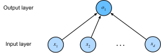

<<<<<<< HEAD
# Gluon Implementation of Linear Regression

The surge of deep learning has inspired the development 
of a variety of mature software frameworks,
that automate much of the repetitive work 
of implementing deep learning models.
In the previous section we relied only 
on NDarray for data storage and linear algebra
and the auto-differentiation capabilities in the `autograd` package.
In practice, because many of the more abstract operations, e.g.
data iterators, loss functions, model architectures, and optimizers,
are so common, deep learning libraries will give us 
library functions for these as well. 

In this section, we will introduce Gluon, MXNet's high-level interface
for implementing neural networks and show how we can implement 
the linear regression model from the previous section much more concisely.
=======
# Concise Implementation of Linear Regression
:label:`sec_linear_gluon`

Broad and intense interest in deep learning for the past several years
has inspired both companies, academics, and hobbyists
to develop a variety of mature open source frameworks
for automating the repetitive work of implementing
gradient-based learning algorithms.
In the previous section, we relied only on
(i) `ndarray` for data storage and linear algebra;
and (ii) `autograd` for calculating derivatives.
In practice, because data iterators, loss functions, optimizers,
and neural network layers (and some whole architectures)
are so common, modern libraries implement these components for us as well.

In this section, we will show you how to implement
the linear regression model from :numref:`sec_linear_scratch`
concisely by using Gluon.
>>>>>>> 1ec5c63... copy from d2l-en (#16)

## Generating the Dataset

To start, we will generate the same dataset as in the previous section.

```{.python .input  n=2}
<<<<<<< HEAD
from mxnet import autograd, nd

num_inputs = 2
num_examples = 1000
true_w = nd.array([2, -3.4])
=======
import d2l
from mxnet import autograd, gluon, np, npx
npx.set_np()

true_w = np.array([2, -3.4])
>>>>>>> 1ec5c63... copy from d2l-en (#16)
true_b = 4.2
features = nd.random.normal(scale=1, shape=(num_examples, num_inputs))
labels = nd.dot(features, true_w) + true_b
labels += nd.random.normal(scale=0.01, shape=labels.shape)
```

## Reading the Dataset

<<<<<<< HEAD
Rather than rolling our own iterator, 
we can call upon Gluon's `data` module to read data. 
Since `data` is often used as a variable name, 
we will replace it with the pseudonym `gdata` 
(adding the first letter of Gluon),
too differentiate the imported `data` module
from a variable we might define. 
The first step will be to instantiate an `ArrayDataset`,
which takes in one or more NDArrays as arguments.
Here, we pass in `features` and `labels` as arguments.
Next, we will use the ArrayDataset to instantiate a DataLoader,
which also requires that we specify a `batch_size` 
and specify a Boolean value `shuffle` indicating whether or not 
we want the `DataLoader` to shuffle the data 
on each epoch (pass through the dataset).

```{.python .input  n=3}
from mxnet.gluon import data as gdata
=======
Rather than rolling our own iterator,
we can call upon Gluon's `data` module to read data.
The first step will be to instantiate an `ArrayDataset`.
This object's constructor takes one or more `ndarray`s as arguments.
Here, we pass in `features` and `labels` as arguments.
Next, we will use the `ArrayDataset` to instantiate a `DataLoader`,
which also requires that we specify a `batch_size`
and specify a Boolean value `shuffle` indicating whether or not
we want the `DataLoader` to shuffle the data
on each epoch (pass through the dataset).

```{.python .input  n=3}
# Saved in the d2l package for later use
def load_array(data_arrays, batch_size, is_train=True):
    """Construct a Gluon data loader"""
    dataset = gluon.data.ArrayDataset(*data_arrays)
    return gluon.data.DataLoader(dataset, batch_size, shuffle=is_train)
>>>>>>> 1ec5c63... copy from d2l-en (#16)

batch_size = 10
# Combine the features and labels of the training data
dataset = gdata.ArrayDataset(features, labels)
# Randomly reading mini-batches
data_iter = gdata.DataLoader(dataset, batch_size, shuffle=True)
```

Now we can use `data_iter` in much the same way as we called
the `data_iter` function in the previous section.
To verify that it is working, we can read and print
the first minibatch of instances.

```{.python .input  n=5}
for X, y in data_iter:
    print(X, '\n', y)
    break
```

## Defining the Model

When we implemented linear regression from scratch
(in :numref`sec_linear_scratch`),
we defined our model parameters explicitly
and coded up the calculations to produce output
using basic linear algebra operations.
You *should* know how to do this.
But once your models get more complex,
and once you have to do this nearly every day,
you will be glad for the assistance.
The situation is similar to coding up your own blog from scratch.
Doing it once or twice is rewarding and instructive,
but you would be a lousy web developer
if every time you needed a blog you spent a month
reinventing the wheel.

For standard operations, we can use Gluon's predefined layers,
which allow us to focus especially
on the layers used to construct the model
rather than having to focus on the implementation.
To define a linear model, we first import the `nn` module,
which defines a large number of neural network layers
<<<<<<< HEAD
(note that "nn" is an abbreviation for neural networks). 
We will first define a model variable `net`, which is a `Sequential` instance. In Gluon, a `Sequential` instance can be regarded as a container 
that concatenates the various layers in sequence. 
When input data is given, each layer in the container will be calculated in order, and the output of one layer will be the input of the next layer.
In this example, since our model consists of only one layer,
we do not really need `Sequential`.
But since nearly all of our future models will involve multiple layers, 
let's get into the habit early.
=======
(note that "nn" is an abbreviation for neural networks).
We will first define a model variable `net`,
which will refer to an instance of the `Sequential` class.
In Gluon, `Sequential` defines a container
for several layers that will be chained together.
Given input data, a `Sequential` passes it through
the first layer, in turn passing the output
as the second layer's input and so forth.
In the following example, our model consists of only one layer,
so we do not really need `Sequential`.
But since nearly all of our future models
will involve multiple layers,
we will use it anyway just to familiarize you
with the most standard workflow.
>>>>>>> 1ec5c63... copy from d2l-en (#16)


```{.python .input  n=5}
from mxnet.gluon import nn
net = nn.Sequential()
```

<<<<<<< HEAD
Recall the architecture of a single layer network. 
The layer is fully connected since it connects all inputs 
with all outputs by means of a matrix-vector multiplication. 
In Gluon, the fully-connected layer is defined in the `Dense` class. 
Since we only want to generate a single scalar output, 
=======
Recall the architecture of a single-layer network as shown in :numref:`fig_singleneuron`.
The layer is said to be *fully-connected*
because each of its inputs are connected to each of its outputs
by means of a matrix-vector multiplication.
In Gluon, the fully-connected layer is defined in the `Dense` class.
Since we only want to generate a single scalar output,
>>>>>>> 1ec5c63... copy from d2l-en (#16)
we set that number to $1$.


:label:`fig_singleneuron`

```{.python .input  n=6}
net.add(nn.Dense(1))
```

<<<<<<< HEAD
It is worth noting that, for convenience, 
Gluon does not require us to specify 
the input shape for each layer. 
So here, we don't need to tell Gluon 
how many inputs go into this linear layer.
When we first try to pass data through our model,
e.g., when we exedcute `net(X)` later, 
Gluon will automatically infer the number of inputs to each layer. 
We will describe how this works in more detail 
in the chapter "Deep Learning Computation".  
=======
It is worth noting that, for convenience,
Gluon does not require us to specify
the input shape for each layer.
So here, we do not need to tell Gluon
how many inputs go into this linear layer.
When we first try to pass data through our model,
e.g., when we execute `net(X)` later,
Gluon will automatically infer the number of inputs to each layer.
We will describe how this works in more detail
in the chapter "Deep Learning Computation".
>>>>>>> 1ec5c63... copy from d2l-en (#16)


## Initializing Model Parameters

<<<<<<< HEAD
Before using `net`, we need to initialize the model parameters, 
such as the weights and biases in the linear regression model. 
We will import the `initializer` module from MXNet. 
This module provides various methods for model parameter initialization. 
Gluon makes `init` available as a shortcut (abbreviation) 
to access the `initializer` package. 
By calling `init.Normal(sigma=0.01)`, we specify that each *weight* parameter
should be randomly sampled from a normal distribution 
with mean 0 and standard deviation 0.01. 
The *bias* parameter will be initialized to zero by default.
=======
Before using `net`, we need to initialize the model parameters,
such as the weights and biases in the linear regression model.
We will import the `initializer` module from MXNet.
This module provides various methods for model parameter initialization.
Gluon makes `init` available as a shortcut (abbreviation)
to access the `initializer` package.
By calling `init.Normal(sigma=0.01)`,
we specify that each *weight* parameter
should be randomly sampled from a normal distribution
with mean $0$ and standard deviation $0.01$.
The *bias* parameter will be initialized to zero by default.
Both the weight vector and bias will have attached gradients.
>>>>>>> 1ec5c63... copy from d2l-en (#16)

```{.python .input  n=7}
from mxnet import init
net.initialize(init.Normal(sigma=0.01))
```

<<<<<<< HEAD
The code above looks straightforward but in reality 
something quite strange is happening here. 
We are initializing parameters for a network
even though we haven't yet told Gluon how many dimensions the input will have. 
It might be 2 as in our example or it might be 2,000, 
so we couldn't just preallocate enough space to make it work.

Gluon let's us get away with this because behind the scenes,
the initialization is deferred until the first time 
that we attempt to pass data through our network. 
Just be careful to remember that since the parameters 
have not been initialized yet we cannot yet manipulate them in any way.
=======
The code above may look straightforward but you should note
that something strange is happening here.
We are initializing parameters for a network
even though Gluon does not yet know
how many dimensions the input will have!
It might be $2$ as in our example or it might be $2000$.
Gluon lets us get away with this because behind the scenes,
the initialization is actually *deferred*.
The real initialization will take place only
when we for the first time attempt to pass data through the network.
Just be careful to remember that since the parameters
have not been initialized yet,
we cannot access or manipulate them.
>>>>>>> 1ec5c63... copy from d2l-en (#16)


## Defining the Loss Function

<<<<<<< HEAD
In Gluon, the `loss` module defines various loss functions. 
We will replace the imported module `loss` with the pseudonym `gloss`, 
and directly use its implementation of squared loss (`L2Loss`).
=======
In Gluon, the `loss` module defines various loss functions.
We will the imported module `loss` with the pseudonym `gloss`,
to avoid confusing it for the variable
holding our chosen loss function.
In this example, we will use the Gluon
implementation of squared loss (`L2Loss`).
>>>>>>> 1ec5c63... copy from d2l-en (#16)

```{.python .input  n=8}
from mxnet.gluon import loss as gloss
loss = gloss.L2Loss()  # The squared loss is also known as the L2 norm loss
```

## Defining the Optimization Algorithm

<<<<<<< HEAD
Not surpisingly, we aren't the first people 
to implement mini-batch stochastic gradient descent,
and thus `Gluon` supports SGD alongside a number of 
variations on this algorithm through its `Trainer` class. 
When we instantiate the `Trainer`, we'll specify the parameters to optimize over (obtainable from our net via `net.collect_params()`),
the optimization algortihm we wish to use (`sgd`),
and a dictionary of hyper-parameters required by our optimization algorithm.
SGD just requires that we set the value `learning_rate`, 
=======
Minibatch SGD and related variants
are standard tools for optimizing neural networks
and thus Gluon supports SGD alongside a number of
variations on this algorithm through its `Trainer` class.
When we instantiate the `Trainer`,
we will specify the parameters to optimize over
(obtainable from our net via `net.collect_params()`),
the optimization algorithm we wish to use (`sgd`),
and a dictionary of hyper-parameters
required by our optimization algorithm.
SGD just requires that we set the value `learning_rate`,
>>>>>>> 1ec5c63... copy from d2l-en (#16)
(here we set it to 0.03).

```{.python .input  n=9}
from mxnet import gluon
trainer = gluon.Trainer(net.collect_params(), 'sgd', {'learning_rate': 0.03})
```

## Training

You might have noticed that expressing our model through Gluon
<<<<<<< HEAD
requires comparatively few lines of code. 
We didn't have to individually allocate parameters, 
define our loss function, or implement stochastic gradient descent. 
Once we start working with much more complex models,
the benefits of relying on Gluon's abstractions will grow considerably. 
But once we have all the basic pieces in place, 
the training loop itself is strikingly similar 
to what we did when implementing everything from scratch.

To refresh your memory: for some number of epochs, 
we'll make a complete pass over the dataset (train_data), 
grabbing one mini-batch of inputs and corresponding ground-truth labels at a time. For each batch, we'll go through the following ritual:
=======
requires comparatively few lines of code.
We did not have to individually allocate parameters,
define our loss function, or implement stochastic gradient descent.
Once we start working with much more complex models,
Gluon's advantages will grow considerably.
However, once we have all the basic pieces in place,
the training loop itself is strikingly similar
to what we did when implementing everything from scratch.

To refresh your memory: for some number of epochs,
we will make a complete pass over the dataset (train_data),
iteratively grabbing one minibatch of inputs
and the corresponding ground-truth labels.
For each minibatch, we go through the following ritual:
>>>>>>> 1ec5c63... copy from d2l-en (#16)

* Generate predictions by calling `net(X)` and calculate the loss `l` (the forward pass).
* Calculate gradients by calling `l.backward()` (the backward pass).
* Update the model parameters by invoking our SGD optimizer (note that `trainer` already knows which parameters to optimize over, so we just need to pass in the minibatch size.

For good measure, we compute the loss after each epoch and print it to monitor progress.

```{.python .input  n=10}
num_epochs = 3
for epoch in range(1, num_epochs + 1):
    for X, y in data_iter:
        with autograd.record():
            l = loss(net(X), y)
        l.backward()
        trainer.step(batch_size)
    l = loss(net(features), labels)
    print('epoch %d, loss: %f' % (epoch, l.mean().asnumpy()))
```

Below, we compare the model parameters learned by training on finite data
and the actual parameters that generated our dataset.
To access parameters with Gluon,
we first access the layer that we need from `net`
and then access that layer's weight (`weight`) and bias (`bias`).
To access each parameter's values as an `ndarray`,
we invoke its `data` method.
As in our from-scratch implementation,
note that our estimated parameters are
close to their ground truth counterparts.

```{.python .input  n=12}
w = net[0].weight.data()
print('Error in estimating w', true_w.reshape(w.shape) - w)
b = net[0].bias.data()
print('Error in estimating b', true_b - b)
```

## Summary

* Using Gluon, we can implement models much more succinctly.
* In Gluon, the `data` module provides tools for data processing, the `nn` module defines a large number of neural network layers, and the `loss` module defines many common loss functions.
* MXNet's module `initializer` provides various methods for model parameter initialization.
* Dimensionality and storage are automatically inferred (but be careful not to attempt to access parameters before they have been initialized).


## Exercises

1. If we replace `l = loss(output, y)` with `l = loss(output, y).mean()`, we need to change `trainer.step(batch_size)` to `trainer.step(1)` for the code to behave identically. Why?
1. Review the MXNet documentation to see what loss functions and initialization methods are provided in the modules `gluon.loss` and `init`. Replace the loss by Huber's loss.
1. How do you access the gradient of `dense.weight`?

## [Discussions](https://discuss.mxnet.io/t/2333)


