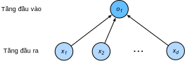

<!-- ===================== Bắt đầu dịch Phần 1 ===================== -->
<!-- ========================================= REVISE PHẦN 1 - BẮT ĐẦU =================================== -->

<!--
# Concise Implementation of Linear Regression
-->

# Cách lập trình súc tích Hồi quy Tuyến tính
:label:`sec_linear_gluon`

<!--
Broad and intense interest in deep learning for the past several years has inspired both companies, academics, 
and hobbyists to develop a variety of mature open source frameworks for automating the repetitive work of implementing gradient-based learning algorithms.
In the previous section, we relied only on (i) `ndarray` for data storage and linear algebra; and (ii) `autograd` for calculating derivatives.
In practice, because data iterators, loss functions, optimizers, and neural network layers (and some whole architectures) are so common, modern libraries implement these components for us as well.
-->

Sự quan tâm nhiệt thành và rộng khắp với học sâu trong những năm gần đây đã tạo cảm hứng cho các công ty, học viện và những người đam mê tới học sâu phát triển nhiều framework mã nguồn mở hoàn thiện, giúp tự động hóa các công việc lặp đi lặp lại trong quá trình triển khai các thuật toán học dựa trên gradient.
Trong chương trước, chúng ta chỉ dựa vào (i) `ndarray` để lưu dữ liệu và thực hiện tính toán đại số tuyến tính; và (ii) `autograd` để thực hiện tính đạo hàm.
Trên thực tế, do các iterator dữ liệu, các hàm mất mát, các bộ tối ưu và các tầng của mạng nơ-ron (thậm chí là toàn bộ kiến trúc) rất phổ biển, các thư viện hiện đại đã cài đặt sẵn những thành phần này cho chúng ta.

<!--
In this section, we will show you how to implement the linear regression model from :numref:`sec_linear_scratch` concisely by using Gluon.
-->

Mục này sẽ hướng dẫn bạn cách để xây dựng mô hình hồi quy tuyến tính trong phần :numref:`sec_linear_scratch` một cách súc tích với Gluon.

<!--
## Generating the Dataset
-->

## Tạo Tập dữ liệu

<!--
To start, we will generate the same dataset as in the previous section.
-->

Chúng ta bắt đầu bằng việc tạo một tập dữ liệu như ở mục trước.

```{.python .input  n=2}
from d2l import mxnet as d2l
from mxnet import autograd, gluon, np, npx
npx.set_np()

true_w = np.array([2, -3.4])
true_b = 4.2
features, labels = d2l.synthetic_data(true_w, true_b, 1000)
```

<!-- ===================== Kết thúc dịch Phần 1 ===================== -->

<!-- ===================== Bắt đầu dịch Phần 2 ===================== -->

<!--
## Reading the Dataset
-->

## Đọc tập dữ liệu

<!--
Rather than rolling our own iterator, we can call upon Gluon's `data` module to read data.
The first step will be to instantiate an `ArrayDataset`.
This object's constructor takes one or more `ndarray`s as arguments.
Here, we pass in `features` and `labels` as arguments.
Next, we will use the `ArrayDataset` to instantiate a `DataLoader`, which also requires that we specify a `batch_size` 
and specify a Boolean value `shuffle` indicating whether or not we want the `DataLoader` to shuffle the data on each epoch (pass through the dataset).
-->

Thay vì tự viết iterator riêng để đọc dữ liệu thì ta có thể gọi mô-đun `data` của Gluon để xử lý việc này. 
Bước đầu tiên sẽ là khởi tạo một `ArrayDataset`.
Hàm tạo của đối tượng này sẽ lấy một hoặc nhiều `ndarray` làm đối số.
Tại đây, ta truyền vào hàm hai đối số là `features` và `labels`.
Kế tiếp, ta sử dụng `ArrayDataset` để khởi tạo một` DataLoader`, lớp này yêu cầu ta truyền vào một giá trị `batch_size` và giá trị Boolean `shuffle` để cho biết chúng ta có muốn `DataLoader` xáo trộn dữ liệu trên mỗi epoch (một lần duyệt qua toàn bộ tập dữ liệu) hay không.

```{.python .input  n=3}
# Saved in the d2l package for later use
def load_array(data_arrays, batch_size, is_train=True):
    """Construct a Gluon data loader"""
    dataset = gluon.data.ArrayDataset(*data_arrays)
    return gluon.data.DataLoader(dataset, batch_size, shuffle=is_train)

batch_size = 10
data_iter = load_array((features, labels), batch_size)
```

<!--
Now we can use `data_iter` in much the same way as we called the `data_iter` function in the previous section.
To verify that it is working, we can read and print the first minibatch of instances.
-->

Bây giờ, ta có thể sử dụng `data_iter` theo cách tương tự như cách ta gọi hàm `data_iter` trong phần trước.
Để biết rằng nó có hoạt động được hay không, ta có thể thử đọc và in ra minibatch đầu tiên.

```{.python .input  n=5}
for X, y in data_iter:
    print(X, '\n', y)
    break
```

<!-- ========================================= REVISE PHẦN 1 - KẾT THÚC ===================================-->

<!-- ========================================= REVISE PHẦN 2 - BẮT ĐẦU ===================================-->

<!--
## Defining the Model
-->

## Định nghĩa Mô hình

<!--
When we implemented linear regression from scratch (in :numref:`sec_linear_scratch`), 
we defined our model parameters explicitly and coded up the calculations to produce output using basic linear algebra operations.
You *should* know how to do this.
But once your models get more complex, and once you have to do this nearly every day, you will be glad for the assistance.
The situation is similar to coding up your own blog from scratch.
Doing it once or twice is rewarding and instructive, but you would be a lousy web developer if every time you needed a blog you spent a month reinventing the wheel.
-->

Khi ta lập trình hồi quy tuyến tính từ đầu (trong :numref:`sec_linear_scratch`), ta đã định nghĩa rõ ràng các tham số của mô hình và lập trình các tính toán cho giá trị đầu ra sử dụng các phép toán đại số tuyến tính cơ bản.
Bạn *nên* biết cách để làm được điều này.
Nhưng một khi mô hình trở nên phức tạp hơn và đồng thời khi bạn phải làm điều này gần như hàng ngày, bạn sẽ thấy vui mừng khi có sự hỗ trợ từ các thư viện.
Tình huống này tương tự như việc lập trình blog của riêng bạn lại từ đầu.
Làm điều này một hoặc hai lần thì sẽ bổ ích và mang tính hướng dẫn, nhưng bạn sẽ trở thành một nhà phát triển web "khó ở" nếu mỗi khi cần một trang blog bạn lại phải dành ra cả một tháng chỉ để phát triển lại từ đầu.

<!-- ===================== Kết thúc dịch Phần 2 ===================== -->

<!-- ===================== Bắt đầu dịch Phần 3 ===================== -->

<!--
For standard operations, we can use Gluon's predefined layers, which allow us to focus especially on the layers used to construct the model rather than having to focus on the implementation.
To define a linear model, we first import the `nn` module, which defines a large number of neural network layers (note that "nn" is an abbreviation for neural networks).
We will first define a model variable `net`, which will refer to an instance of the `Sequential` class.
In Gluon, `Sequential` defines a container for several layers that will be chained together.
Given input data, a `Sequential` passes it through the first layer, in turn passing the output as the second layer's input and so forth.
In the following example, our model consists of only one layer, so we do not really need `Sequential`.
But since nearly all of our future models will involve multiple layers, we will use it anyway just to familiarize you with the most standard workflow.
-->

Đối với những tác vụ tiêu chuẩn, chúng ta có thể sử dụng các tầng đã được định nghĩa trước trong Gluon, điều này cho phép chúng ta tập trung vào những tầng được dùng để xây dựng mô hình hơn là việc phải tập trung vào cách lập trình các tầng đó.
Để định nghĩa một mô hình tuyến tính, đầu tiên chúng ta cần nhập vào mô-đun `nn`, giúp ta định nghĩa một lượng lớn các tầng trong mạng nơ-ron (lưu ý rằng "nn" là chữ viết tắt của "neural network").
Đầu tiên ta sẽ định nghĩa một biến mô hình là `net`, tham chiếu đến một thực thể của lớp `Sequential`.
Trong Gluon, `Sequential` định nghĩa một lớp chứa nhiều tầng được liên kết với nhau.
Khi nhận được dữ liệu đầu vào, `Sequential` sẽ truyền dữ liệu vào tầng đầu tiên, kết quả đầu ra từ đó trở thành đầu vào của tầng thứ hai và cứ tiếp tục như thế ở các tầng kế tiếp.
Trong ví dụ tiếp theo, mô hình chúng ta chỉ có duy nhất một tầng, vì vậy không nhất thiết phải sử dụng `Sequential`.
Tuy nhiên vì hầu hết các mô hình chúng ta gặp phải trong tương lai đều có nhiều tầng, do đó dù sao cũng nên dùng để làm quen với quy trình làm việc tiêu chuẩn nhất.

```{.python .input  n=5}
from mxnet.gluon import nn
net = nn.Sequential()
```

<!--
Recall the architecture of a single-layer network as shown in :numref:`fig_singleneuron`. 
The layer is said to be *fully-connected* because each of its inputs are connected to each of its outputs by means of a matrix-vector multiplication.
In Gluon, the fully-connected layer is defined in the `Dense` class.
Since we only want to generate a single scalar output, we set that number to $1$.
-->

Hãy cùng nhớ lại kiến trúc của mạng đơn tầng như đã trình bày tại :numref:`fig_singleneuron`.
Tầng đó được gọi là *kết nối đầy đủ* bởi vì mỗi đầu vào được kết nối lần lượt với từng đầu ra bằng một phép nhân ma trận với vector.
Trong Gluon, tầng kết nối đầy đủ được định nghĩa trong lớp `Dense`.
Bởi vì chúng ta chỉ mong xuất ra một số vô hướng duy nhất, nên ta gán giá trị là $1$.
<!--

-->


:label:`fig_singleneuron`

```{.python .input  n=6}
net.add(nn.Dense(1))
```

<!--
It is worth noting that, for convenience,
Gluon does not require us to specify the input shape for each layer.
So here, we do not need to tell Gluon how many inputs go into this linear layer.
When we first try to pass data through our model, e.g., when we execute `net(X)` later, Gluon will automatically infer the number of inputs to each layer.
We will describe how this works in more detail in the chapter "Deep Learning Computation".
-->

Để thuận tiện, điều đáng chú ý là Gluon không yêu cầu chúng ta chỉ định kích thước đầu vào mỗi tầng.
Nên tại đây, chúng ta không cần thiết cho Gluon biết có bao nhiêu đầu vào cho mỗi tầng tuyến tính.
Khi chúng ta cố gắng truyền dữ liệu qua mô hình lần đầu tiên, ví dụ: khi chúng ta thực hiện `net(X)` sau đó, Gluon sẽ tự động suy ra số lượng đầu vào cho mỗi tầng.
Chúng ta sẽ mô tả cách hoạt động của cơ chế này một cách chi tiết hơn trong chương "Tính toán trong Học sâu".

<!-- ===================== Kết thúc dịch Phần 3 ===================== -->

<!-- ===================== Bắt đầu dịch Phần 4 ===================== -->

<!-- ========================================= REVISE PHẦN 2 - KẾT THÚC ===================================-->

<!-- ========================================= REVISE PHẦN 3 - BẮT ĐẦU ===================================-->

<!--
## Initializing Model Parameters
-->

## Khởi tạo Tham số Mô hình

<!--
Before using `net`, we need to initialize the model parameters, such as the weights and biases in the linear regression model.
We will import the `initializer` module from MXNet.
This module provides various methods for model parameter initialization.
Gluon makes `init` available as a shortcut (abbreviation) to access the `initializer` package.
By calling `init.Normal(sigma=0.01)`, we specify that each *weight* parameter should be randomly sampled from a normal distribution with mean $0$ and standard deviation $0.01$.
The *bias* parameter will be initialized to zero by default.
Both the weight vector and bias will have attached gradients.
-->

Trước khi sử dụng `net`, chúng ta cần phải khởi tạo tham số cho mô hình, chẳng hạn như trọng số và hệ số điều chỉnh trong mô hình hồi quy tuyến tính.
Chúng ta sẽ nhập mô-đun `initializer` từ MXNet.
Mô-đun này cung cấp nhiều phương thức khác nhau để khởi tạo tham số cho mô hình.
Gluon cho phép dùng `init` như một cách ngắn gọn (viết tắt) để truy cập đến gói `initializer`.
Bằng cách gọi `init.Normal(sigma=0.01)`, chúng ta sẽ khởi tạo ngẫu nhiên các *trọng số* từ một phân phối chuẩn với trung bình bằng $0$ và độ lệch chuẩn bằng $0.01$.
Mặc định, tham số *hệ số điều chỉnh* sẽ được khởi tạo bằng không.
Cả hai vector trọng số và hệ số điều chỉnh sẽ có gradient kèm theo.

```{.python .input  n=7}
from mxnet import init
net.initialize(init.Normal(sigma=0.01))
```

<!--
The code above may look straightforward but you should note that something strange is happening here.
We are initializing parameters for a network even though Gluon does not yet know how many dimensions the input will have!
It might be $2$ as in our example or it might be $2000$.
Gluon lets us get away with this because behind the scenes, the initialization is actually *deferred*.
The real initialization will take place only when we for the first time attempt to pass data through the network.
Just be careful to remember that since the parameters have not been initialized yet, we cannot access or manipulate them.
-->

Đoạn mã nguồn trên trông khá đơn giản nhưng bạn đọc hãy chú ý một vài điểm khác thường ở đây.
Chúng ta khởi tạo các tham số cho một mạng mà thậm chí Gluon chưa hề biết số chiều của đầu vào là bao nhiêu!
Nó có thể là $2$ trong trường hợp của chúng ta nhưng cũng có thể là $2000$.
Gluon khiến chúng ta không cần bận tâm về điều này bởi ở hậu trường, quá trình khởi tạo thực sự vẫn đang bị *trì hoãn*.
Quá trình khởi tạo thực sự chỉ bắt đầu khi chúng ta truyền dữ liệu vào mạng lần đầu tiên.
Hãy ghi nhớ rằng, do các tham số chưa thực sự được khởi tạo, chúng ta không thể truy cập hoặc thao tác với chúng.

<!-- ===================== Kết thúc dịch Phần 4 ===================== -->

<!-- ===================== Bắt đầu dịch Phần 5 ===================== -->

<!--
## Defining the Loss Function
-->

## Định nghĩa Hàm mất mát

<!--
In Gluon, the `loss` module defines various loss functions.
We will use the imported module `loss` with the pseudonym `gloss`, to avoid confusing it for the variable holding our chosen loss function.
In this example, we will use the Gluon implementation of squared loss (`L2Loss`).
-->

Trong Gluon, mô-đun `loss` định nghĩa các hàm mất mát khác nhau.
Chúng ta sẽ sử dụng mô-đun `loss` được thêm vào dưới tên gọi là `gloss`, để tránh nhầm lẫn nó với biến đang giữ hàm mất mát mà ta đã chọn.
Trong ví dụ này, chúng ta sẽ sử dụng triển khai trong Gluon của mất mát bình phương (`L2Loss`).

```{.python .input  n=8}
from mxnet.gluon import loss as gloss
loss = gloss.L2Loss()  # The squared loss is also known as the L2 norm loss
```

<!-- ========================================= REVISE PHẦN 3 - KẾT THÚC ===================================-->

<!-- ========================================= REVISE PHẦN 4 - BẮT ĐẦU ===================================-->

<!--
## Defining the Optimization Algorithm
-->

## Định nghĩa Thuật toán Tối ưu

<!--
Minibatch SGD and related variants are standard tools for optimizing neural networks and thus Gluon supports SGD alongside a number of variations on this algorithm through its `Trainer` class.
When we instantiate the `Trainer`, we will specify the parameters to optimize over (obtainable from our net via `net.collect_params()`), 
the optimization algorithm we wish to use (`sgd`), and a dictionary of hyper-parameters required by our optimization algorithm.
SGD just requires that we set the value `learning_rate`, (here we set it to 0.03).
-->

Minibatch SGD và các biến thể liên quan đều là các công cụ chuẩn cho việc tối ưu hóa mạng nơ-ron, vì vậy Gluon có hỗ trợ SGD cùng với một số biến thể của thuật toán này thông qua lớp `Trainer`.
Khi khởi tạo lớp `Trainer`, ta cần chỉ định các tham số để tối ưu hóa (có thể lấy từ mạng thông qua `net.collect_params()`), thuật toán tối ưu muốn sử dụng (`sgd`) và một từ điển gồm các siêu tham số cần thiết cho thuật toán tối ưu.
SGD chỉ yêu cầu giá trị của `learning_rate`, (ở đây chúng ta đặt nó bằng 0.03).

```{.python .input  n=9}
from mxnet import gluon
trainer = gluon.Trainer(net.collect_params(), 'sgd', {'learning_rate': 0.03})
```

<!-- ===================== Kết thúc dịch Phần 5 ===================== -->

<!-- ===================== Bắt đầu dịch Phần 6 ===================== -->

<!--
## Training
-->

## Huấn luyện

<!--
You might have noticed that expressing our model through Gluon requires comparatively few lines of code.
We did not have to individually allocate parameters, define our loss function, or implement stochastic gradient descent.
Once we start working with much more complex models, Gluon's advantages will grow considerably.
However, once we have all the basic pieces in place, the training loop itself is strikingly similar to what we did when implementing everything from scratch.
-->

Bạn có thể thấy rằng việc biểu diễn mô hình thông qua Gluon đòi hỏi tương đối ít dòng lệnh.
Chúng ta không cần phải khởi tạo từng tham số riêng lẻ, định nghĩa hàm mất mát hay lập trình thuật toán hạ gradient ngẫu nhiên.
Lợi ích mà Gluon mang lại sẽ rất lớn khi chúng ta bắt đầu làm việc với những mô hình phức tạp hơn.
Tuy nhiên, một khi ta có các mảnh ghép cơ bản, vòng lặp huấn luyện lại rất giống với những gì ta đã làm khi lập trình mọi thứ từ đầu.

<!--
To refresh your memory: for some number of epochs, we will make a complete pass over the dataset (train_data), iteratively grabbing one minibatch of inputs and the corresponding ground-truth labels.
For each minibatch, we go through the following ritual:
-->

Nhắc lại rằng: với số lượng epoch nhất định, trong mỗi epoch chúng ta sẽ duyệt qua toàn bộ tập dữ liệu (`train_data`), lần lượt lấy từng minibatch chứa dữ liệu đầu vào và các nhãn gốc tương ứng.
Đối với mỗi minibatch, chúng ta cần tuân thủ theo trình tự sau:

<!--
* Generate predictions by calling `net(X)` and calculate the loss `l` (the forward pass).
* Calculate gradients by calling `l.backward()` (the backward pass).
* Update the model parameters by invoking our SGD optimizer (note that `trainer` already knows which parameters to optimize over, so we just need to pass in the minibatch size.
-->

* Đưa ra dự đoán bằng cách gọi `net(X)` và tính giá trị mất mát `l` (lượt truyền xuôi).
* Tính gradient bằng cách gọi `l.backward()` (lượt truyền ngược).
* Cập nhật các tham số của mô hình bằng cách gọi bộ tối ưu SGD (chú ý rằng `trainer` đã biết các tham số cần tối ưu, nên ta chỉ cần truyền thêm kích thước của minibatch).

<!--
For good measure, we compute the loss after each epoch and print it to monitor progress.
-->

Ngoài ra, ta tính giá trị mất mát sau mỗi epoch và in nó ra màn hình để giám sát tiến trình. 
```{.python .input  n=10}
num_epochs = 3
for epoch in range(1, num_epochs + 1):
    for X, y in data_iter:
        with autograd.record():
            l = loss(net(X), y)
        l.backward()
        trainer.step(batch_size)
    l = loss(net(features), labels)
    print('epoch %d, loss: %f' % (epoch, l.mean().asnumpy()))
```

<!-- ===================== Kết thúc dịch Phần 6 ===================== -->

<!-- ===================== Bắt đầu dịch Phần 7 ===================== -->

<!--
Below, we compare the model parameters learned by training on finite data and the actual parameters that generated our dataset.
To access parameters with Gluon, we first access the layer that we need from `net` and then access that layer's weight (`weight`) and bias (`bias`).
To access each parameter's values as an `ndarray`, we invoke its `data` method.
As in our from-scratch implementation, note that our estimated parameters are close to their ground truth counterparts.
-->

Dưới đây, ta so sánh các tham số của mô hình đã được học thông qua việc huấn luyện trên tập dữ liệu hữu hạn với các tham số được dùng để tạo ra tập dữ liệu. 
Để truy cập các tham số trong Gluon, trước hết ta truy cập tầng ta quan tâm thông qua biến `net`, sau đó truy cập trọng số (`weight`) và hệ số điều chỉnh (`bias`) của tầng đó.
Để truy cập giá trị tham số dưới dạng một mảng `ndarray`, ta sử dụng phương thức `data`.
Giống với phiên bản lập trình từ đầu của chúng ta, các tham số ước lượng có giá trị gần với giá trị chính xác của chúng.

```{.python .input  n=12}
w = net[0].weight.data()
print('Error in estimating w', true_w.reshape(w.shape) - w)
b = net[0].bias.data()
print('Error in estimating b', true_b - b)
```

<!-- ========================================= REVISE PHẦN 4 - KẾT THÚC ===================================-->

<!-- ========================================= REVISE PHẦN 5 - BẮT ĐẦU ===================================-->

<!--
## Summary
-->

## Tóm tắt

<!--
* Using Gluon, we can implement models much more succinctly.
* In Gluon, the `data` module provides tools for data processing, the `nn` module defines a large number of neural network layers, and the `loss` module defines many common loss functions.
* MXNet's module `initializer` provides various methods for model parameter initialization.
* Dimensionality and storage are automatically inferred (but be careful not to attempt to access parameters before they have been initialized).
-->


* Sử dụng Gluon giúp việc lập trình các mô hình trở nên ngắn gọn hơn rất nhiều.
* Trong Gluon, mô-đun `data` cung cấp các công cụ để xử lý dữ liệu, mô-đun `nn` định nghĩa một lượng lớn các tầng cho mạng nơ-ron, và mô-đun `loss` cho phép ta thiết lập nhiều hàm mất mát phổ biến. 
* Mô-đun `initializer` của MXNet cung cấp nhiều phương thức khác nhau để khởi tạo tham số cho mô hình.
* Kích thước và dung lượng lưu trữ của các tham số sẽ được suy ra một cách tự động (nhưng nên cẩn thận tránh truy cập các tham số trước khi chúng được khởi tạo).

<!--
## Exercises
-->

## Bài tập

<!--
1. If we replace `l = loss(output, y)` with `l = loss(output, y).mean()`, we need to change `trainer.step(batch_size)` to `trainer.step(1)` for the code to behave identically. Why?
2. Review the MXNet documentation to see what loss functions and initialization methods are provided in the modules `gluon.loss` and `init`. Replace the loss by Huber's loss.
3. How do you access the gradient of `dense.weight`?
-->

1. Nếu thay thế `l = loss(output, y)` bằng `l = loss(output, y).mean()`, chúng ta cần đổi `trainer.step(batch_size)` thành `trainer.step(1)` để phần mã nguồn này hoạt động giống như trước. Tại sao lại thế?
2. Xem lại tài liệu về MXNet để biết các hàm mất mát và các phương thức khởi tạo được cung cấp trong hai mô-đun `gluon.loss` và `init`. Hãy thay thế hàm mất mát đang sử dụng bằng hàm mất mát Huber (*Huber loss*).
3. Làm thế nào để truy cập gradient của `dense.weight`?

<!-- ===================== Kết thúc dịch Phần 7 ===================== -->

<!-- ========================================= REVISE PHẦN 5 - KẾT THÚC ===================================-->

<!--
## [Discussions](https://discuss.mxnet.io/t/2333)
-->

## Thảo luận
* [Tiếng Anh](https://discuss.mxnet.io/t/2333)
* [Tiếng Việt](https://forum.machinelearningcoban.com/c/d2l)

## Những người thực hiện
Bản dịch trong trang này được thực hiện bởi:
<!--
Tác giả của mỗi Pull Request điền tên mình và tên những người review mà bạn thấy
hữu ích vào từng phần tương ứng. Mỗi dòng một tên, bắt đầu bằng dấu `*`.

Lưu ý:
* Nếu reviewer không cung cấp tên, bạn có thể dùng tên tài khoản GitHub của họ
với dấu `@` ở đầu. Ví dụ: @aivivn.

* Tên đầy đủ của các reviewer có thể được tìm thấy tại https://github.com/aivivn/d2l-vn/blob/master/docs/contributors_info.md.
-->

* Đoàn Võ Duy Thanh
* Trần Thị Hồng Hạnh
* Phạm Hồng Vinh
* Vũ Hữu Tiệp 
* Lý Phi Long
* Phạm Đăng Khoa
* Lê Khắc Hồng Phúc
* Dương Nhật Tân
* Nguyễn Văn Tâm
* Bùi Nhật Quân
* Nguyễn Mai Hoàng Long