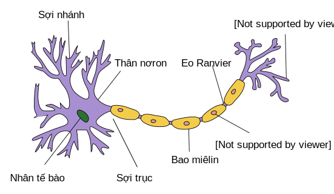

<!-- ===================== Bắt đầu dịch Phần 1 ===================== -->
<!-- ========================================= REVISE PHẦN 1 - BẮT ĐẦU =================================== -->

<!--
# Linear Regression
-->

# Hồi quy Tuyến tính
:label:`sec_linear_regression`

<!--
Regression refers to a set of methods for modeling the relationship between data points $\mathbf{x}$ and corresponding real-valued targets $y$.
In the natural sciences and social sciences, the purpose of regression is most often to *characterize* the relationship between the inputs and outputs.
Machine learning, on the other hand, is most often concerned with *prediction*.
-->

Hồi quy liên quan đến các phương pháp để xây dựng mối quan hệ giữa điểm dữ liệu $\mathbf{x}$ và giá trị mục tiêu $y$.
Trong khoa học tự nhiên và khoa học xã hội, mục tiêu của hồi quy thường là *đặc trưng hóa* mối quan hệ của đầu vào và đầu ra.
Mặt khác, học máy thường quan tâm đến *dự đoán*.

<!--
Regression problems pop up whenever we want to predict a numerical value.
Common examples include predicting prices (of homes, stocks, etc.), predicting length of stay (for patients in the hospital), demand forecasting (for retail sales), among countless others.
Not every prediction problem is a classic *regression* problem.
In subsequent sections, we will introduce classification problems, where the goal is to predict membership among a set of categories.
-->

Bài toán hồi quy xuất hiện mỗi khi chúng ta muốn dự đoán một giá trị số.
Các ví dụ thông dụng bao gồm dự đoán giá cả (nhà, cổ phiếu, ..), dự đoán thời gian ở lại (cho bệnh nhân trong viện), dự đoán nhu cầu (cho bán lẻ), và nhiều thứ khác.
Không phải mọi bài toán về dự đoán đều là bài toán *hồi quy* cổ điển.
Trong các phần tiếp theo, chúng tôi sẽ giới thiệu bài toán phân loại, trong đó mục tiêu là dự đoán thành viên giữa một nhóm các hạng mục.

<!-- ===================== Kết thúc dịch Phần 1 ===================== -->

<!-- ===================== Bắt đầu dịch Phần 2 ===================== -->

<!--
## Basic Elements of Linear Regression
-->

## Một số Thành phần Cơ bản của Hồi quy Tuyến tính

<!--
*Linear regression* may be both the simplest and most popular among the standard tools to regression.
Dating back to the dawn of the 19th century, linear regression flows from a few simple assumptions.
First, we assume that the relationship between the *features* $\mathbf{x}$ and targets $y$ is linear, 
i.e., that $y$ can be expressed as a weighted sum of the inputs $\textbf{x}$, give or take some noise on the observations.
Second, we assume that any noise is well-behaved (following a Gaussian distribution).
To motivate the approach, let's start with a running example.
Suppose that we wish to estimate the prices of houses (in dollars) based on their area (in square feet) and age (in years).
-->

*Hồi quy tuyến tính* có lẽ là công cụ tiêu chuẩn đơn giản và phổ biến nhất cho hồi quy.
Quay trở về đầu thế kỉ 19, hồi quy tuyến tính tuân theo một vài giả thuyết đơn giản.
Đầu tiên, ta giả sử quan hệ giữa *các đặc trưng* $\mathbf{x}$ và mục tiêu $y$ là tuyến tính, do đó $y$ có thể biểu diễn qua tổng trọng số của đầu vào $\textbf{x}$, cộng thêm nhiễu qua sự quan sát.
Thứ hai, ta giả sử nhiễu là có quy tắc (theo phân phối Gauss).
Để tạo động lực, chúng ta hãy bắt đầu chạy một ví dụ.
Hãy cho là ta muốn ước lượng giá nhà (bằng dollars) dựa vào diện tích nhà (đơn vị feet vuông) và tuổi đời (theo năm).

<!--
To actually fit a model for predicting house prices, we would need to get our hands on a dataset consisting of sales for which we know the sale price, area and age for each home.
In the terminology of machine learning, the dataset is called a *training data* or *training set*, and each row (here the data corresponding to one sale) is called an *instance* or *example*.
The thing we are trying to predict (here, the price) is called a *target* or *label*.
The variables (here *age* and *area*) upon which the predictions are based are called *features* or *covariates*.
-->

Để thực sự khớp một mô hình để dự đoán giá nhà, chúng ta cần một tập dữ liệu các giao dịch mà chúng ta đã biết giá bán, diện tích, tuổi đời cho từng căn nhà.
Trong thuật ngữ của học máy, dữ liệu được gọi là *dữ liệu huấn luyện* hoặc *tập huấn luyện*, và mỗi hàng (tương ứng với dữ liệu cho một lần bán) được gọi là một *ví dụ* hoặc *mẫu*.
Thứ mà chúng ta muốn dự đoán (giá nhà) được gọi là *mục tiêu* hoặc *nhãn*.
Các biến (*tuổi đời* và *diện tích*) mà những dự đoán dựa vào được gọi là *những đặc trưng* hoặc *những hiệp biến*.

<!--
Typically, we will use $n$ to denote the number of examples in our dataset.
We index the samples by $i$, denoting each input data point as $x^{(i)} = [x_1^{(i)}, x_2^{(i)}]$ and the corresponding label as $y^{(i)}$.
-->

Thông thường, chúng ta sẽ dùng $n$ để kí hiệu số mẫu trong dữ liệu.
Chúng ta truy cập các mẫu bằng chỉ số $i$, kí hiệu mỗi điểm dữ liệu đầu vào là $x^{(i)} = [x_1^{(i)}, x_2^{(i)}]$ và tương ứng nhãn là $y^{(i)}$.  

<!-- ===================== Kết thúc dịch Phần 2 ===================== -->

<!-- ===================== Bắt đầu dịch Phần 3 ===================== -->

<!-- ========================================= REVISE PHẦN 1 - KẾT THÚC ===================================-->

<!-- ========================================= REVISE PHẦN 2 - BẮT ĐẦU ===================================-->

<!--
### Linear Model
-->

### Mô hình Tuyến tính

<!--
The linearity assumption just says that the target (price) can be expressed as a weighted sum of the features (area and age):
-->

Giả định tuyến tính trên cho thấy rằng mục tiêu (giá nhà) có thể được biểu diễn như là tổng có trọng số của các đặc trưng (diện tích và tuổi đời):

$$\mathrm{price} = w_{\mathrm{area}} \cdot \mathrm{area} + w_{\mathrm{age}} \cdot \mathrm{age} + b.$$

<!--
Here, $w_{\mathrm{area}}$ and $w_{\mathrm{age}}$ are called *weights*, and $b$ is called a *bias* (also called an *offset* or *intercept*).
The weights determine the influence of each feature on our prediction and the bias just says what value the predicted price should take when all of the features take value $0$.
Even if we will never see any homes with zero area, or that are precisely zero years old, we still need the intercept or else we will limit the expressivity of our linear model.
-->

Ở đây, $w_{\mathrm{area}}$ và $w_{\mathrm{age}}$ được gọi là *trọng số*, và $b$ được gọi là *độ chệch* (còn được gọi là *độ dời* hoặc *độ cản*).
Các trọng số xác định mức độ đóng góp của mỗi đặc trưng tới đầu ra còn độ chệch chỉ ra giá trị của giá nhà trong trường hợp tất cả các đặc trưng đều bằng $0$.
Thậm chí ngay cả khi chúng ta không bao giờ thấy một ngôi nhà có diện tích bằng không, hoặc tuổi đời bằng không, ta vẫn cần sử dụng độ cản nếu không ta sẽ làm giảm khả năng biểu diễn của mô hình tuyến tính.

<!--
Given a dataset, our goal is to choose the weights $w$ and bias $b$ such that on average, the predictions made according our model best fit the true prices observed in the data.
-->

Cho một tập dữ liệu, mục đích của chúng ta là chọn được các trọng số $w$ và độ chệch $b$, sao cho dự đoán dựa trên mô hình của ta phải khớp nhất với giá nhà thực tế quan sát được trong tập dữ liệu.

<!--
In disciplines where it is common to focus on datasets with just a few features, explicitly expressing models long-form like this is common.
In ML, we usually work with high-dimensional datasets, so it is more convenient to employ linear algebra notation. When our inputs consist of $d$ features, we express our prediction $\hat{y}$ as
-->

Trong các ngành học thường tập trung vào các tập dữ liệu thường chỉ có một vài đặc trưng, biễu diễn tường minh mô hình ở dạng biểu thức dài như trên khá là phổ biến.
Trong học máy, chúng ta thường làm việc với các tập dữ liệu nhiều chiều, vì vậy sẽ tốt hơn khi ta sử dụng ký hiệu đại số tuyến tính để biểu diễn.
Khi đầu vào của mô hình có $d$ đặc trưng, ta biễu diễn dự đoán $\hat{y}$ là

$$\hat{y} = w_1 \cdot x_1 + ... + w_d \cdot x_d + b.$$

<!--
Collecting all features into a vector $\mathbf{x}$ and all weights into a vector $\mathbf{w}$, we can express our model compactly using a dot product:
-->

Thu thập toàn bộ các đặc trưng vào một vector $\mathbf{x}$ và toàn bộ các trọng số vào một vector $\mathbf{w}$, ta có thể biễu diễu mô hình bằng phép tích vô hướng:

$$\hat{y} = \mathbf{w}^T \mathbf{x} + b.$$

<!-- ===================== Kết thúc dịch Phần 3 ===================== -->

<!-- ===================== Bắt đầu dịch Phần 4 ===================== -->

<!--
Here, the vector $\mathbf{x}$ corresponds to a single data point.
We will often find it convenient to refer to our entire dataset via the *design matrix* $X$.
Here, $X$ contains one row for every example and one column for every feature.
-->

Ở đây, vector $\mathbf{x}$ tương ứng với một điểm dữ liệu.
Chúng ta sẽ thấy rằng việc truy cập đến toàn bộ tập dữ liệu thường sẽ tiện hơn thông qua việc sử dụng *ma trận* $\mathbf{X}$.
Mỗi hàng của ma trận $\mathbf{X}$ thể hiện một mẫu và mỗi cột thể hiện một đặc trưng.

<!--
For a collection of data points $\mathbf{X}$, the predictions $\hat{\mathbf{y}}$ can be expressed via the matrix-vector product:
-->

Với một tập hợp điểm dữ liệu $\mathbf{X}$, kết quả dự đoán $\hat{\mathbf{y}}$ có thể được biểu diễn bằng phép nhân của giữa ma trận và vector:

$${\hat{\mathbf{y}}} = \mathbf X \mathbf{w} + b.$$

<!--
Given a training dataset $X$ and corresponding (known) targets $\mathbf{y}$, 
the goal of linear regression is to find the *weight* vector $w$ and bias term $b$ that given some a new data point $\mathbf{x}_i$, 
sampled from the same distribution as the training data will (in expectation) predict the target $y_i$ with the lowest error.
-->

Cho một tập dữ liệu huấn luyện $\mathbf{X}$ và các giá trị mục tiêu (đã biết trước) $\mathbf{y}$, mục tiêu của hồi quy tuyến tính là tìm vector *trọng số* $\mathbf{w}$ và hệ số điều chỉnh $b$ sao cho với một điểm dữ liệu mới $\mathbf{x}_i$, được lấy mẫu từ cùng phân phối của tập huấn luyện sẽ (theo kỳ vọng) dự đoán giá trị mục tiêu $y_i$ với sai số nhỏ nhất.

<!--
Even if we believe that the best model for predicting $y$ given  $\mathbf{x}$ is linear, 
we would not expect to find real-world data where $y_i$ exactly equals $\mathbf{w}^T \mathbf{x}+b$ for all points ($\mathbf{x}, y)$.
For example, whatever instruments we use to observe the features $X$ and labels $\mathbf{y}$ might suffer small amount of measurement error.
Thus, even when we are confident that the underlying relationship is linear, we will incorporate a noise term to account for such errors.
-->

Kể cả khi biết rằng mô hình tuyến tính là tốt nhất để dự đoán $y$ từ $\mathbf{x}$, chúng ta cũng không mong muốn tìm được dữ liệu thực tế ở đó $y$ đúng bằng $\mathbf{w}^T \mathbf{x}+b$ với mọi điểm ($\mathbf{x}, y)$.
Để dễ hình dung, mọi thiết bị đo lường dùng để quan sát đặc trưng $\mathbf{X}$ và nhãn $\mathbf{y}$ đều có một khoảng sai số nhất định.
Chính vì vậy, mặc dù tự tin rằng mối quan hệ trong dữ liệu là tuyến tính, chúng ta sẽ kết hợp thêm với nhiễu để tạo ra kết quả tự nhiên hơn.

<!--
Before we can go about searching for the best parameters $w$ and $b$, we will need two more things:
(i) a quality measure for some given model; and (ii) a procedure for updating the model to improve its quality.
-->

Trước khi nghiên cứu cách tìm các giá trị tối ưu $\mathbf{w}$ và $b$, chúng ta sẽ cần quan tâm thêm hai vấn đề nữa: (i) một phép đo đánh giá chất lượng mô hình và (ii) quy trình cập nhật mô hình để cải thiện chất lượng.

<!-- ===================== Kết thúc dịch Phần 4 ===================== -->

<!-- ===================== Bắt đầu dịch Phần 5 ===================== -->

<!-- ========================================= REVISE PHẦN 2 - KẾT THÚC ===================================-->

<!-- ========================================= REVISE PHẦN 3 - BẮT ĐẦU ===================================-->

<!--
### Loss Function
-->

### Hàm mất mát

<!--
Before we start thinking about how *to fit* our model, we need to determine a measure of *fitness*.
The *loss function* quantifies the distance between the *real* and *predicted* value of the target.
The loss will usually be a non-negative number where smaller values are better and perfect predictions incur a loss of $0$.
The most popular loss function in regression problems is the sum of squared errors.
When our prediction for some example $i$ is $\hat{y}^{(i)}$ and the corresponding true label is $y^{(i)}$, the squared error is given by:
-->

Trước khi suy nghĩ làm thế nào để *khớp* mô hình vào với dữ liệu, ta cần phải xác định một cách để đo *mức độ khớp*.
*Hàm mất mát* định lượng khoảng cách giữa giá trị *thực* và giá trị *dự đoán* của mục tiêu.
Độ mất mát thường là một số không âm mà giá trị càng nhỏ thì càng tốt và các dự đoán hoàn hảo sẽ có độ mất mát $0$.
Hàm mất mát thông dụng nhất trong các bài toán hồi quy là hàm tổng bình phương các lỗi.
Khi giá trị dự đoán của một dữ liệu huấn luyện $i$ là $\hat{y}^{(i)}$ và nhãn trị thực tương ứng của nó là $y^{(i)}$, bình phương của lỗi được xác định như sau:

$$l^{(i)}(\mathbf{w}, b) = \frac{1}{2} \left(\hat{y}^{(i)} - y^{(i)}\right)^2.$$

<!--
The constant $1/2$ makes no real difference but will prove notationally convenient, cancelling out when we take the derivative of the loss.
Since the training dataset is given to us, and thus out of our control, the empirical error is only a function of the model parameters.
To make things more concrete, consider the example below where we plot a regression problem for a one-dimensional case as shown in :numref:`fig_fit_linreg`.
-->

Hằng số $1/2$ không có một vai trò gì quan trọng nhưng sẽ giúp ký hiệu thuận tiện hơn: nó sẽ bị giản ước đi khi ta lấy đạo hàm.
Vì các dữ liệu trong tập huấn luyện đã được xác định trước, và không thể thay đổi, hàm lỗi thực nghiệm chỉ là một hàm trên các tham số của mô hình.
Để cụ thể hơn, ta hãy xét ví dụ dưới đây về một bài toán hồi quy cho trường hợp một chiều trong hình :numref:`fig_fit_linreg`.

<!--

-->


:label:`fig_fit_linreg`

<!--
Note that large differences between estimates $\hat{y}^{(i)}$ and observations $y^{(i)}$ lead to even larger contributions to the loss, due to the quadratic dependence.
To measure the quality of a model on the entire dataset, we simply average (or equivalently, sum) the losses on the training set.
-->

Lưu ý rằng các khác biệt lớn giữa giá trị ước tính $\hat{y}^{(i)}$ và giá trị quan sát $y^{(i)}$ có sự đóng góp còn lớn hơn nữa vào tổng độ mất mát do sự phụ thuộc bậc hai.
Để đo chất lượng của mô hình trên toàn bộ tập dữ liệu, ta chỉ đơn giản lấy trung bình (hay tương đương là lấy tổng) của các độ mất mát trên tập huấn luyện.

$$L(\mathbf{w}, b) =\frac{1}{n}\sum_{i=1}^n l^{(i)}(\mathbf{w}, b) =\frac{1}{n} \sum_{i=1}^n \frac{1}{2}\left(\mathbf{w}^\top \mathbf{x}^{(i)} + b - y^{(i)}\right)^2.$$

<!--
When training the model, we want to find parameters ($\mathbf{w}^*, b^*$) that minimize the total loss across all training samples:
-->

Khi huấn luyện mô hình, chúng ta tìm các tham số ($\mathbf{w}^*, b^*$) để tối thiểu hóa tổng độ mất mát trên toàn bộ tất cả các mẫu huấn luyện:

$$\mathbf{w}^*, b^* = \operatorname*{argmin}_{\mathbf{w}, b}\  L(\mathbf{w}, b).$$

<!-- ===================== Kết thúc dịch Phần 5 ===================== -->

<!-- ===================== Bắt đầu dịch Phần 6 ===================== -->

<!-- ========================================= REVISE PHẦN 3 - KẾT THÚC ===================================-->

<!-- ========================================= REVISE PHẦN 4 - BẮT ĐẦU ===================================-->

<!--
### Analytic Solution
-->

### *Nghiệm theo công thức*

<!--
Linear regression happens to be an unusually simple optimization problem.
Unlike most other models that we will encounter in this book, linear regression can be solved analytically by applying a simple formula, yielding a global optimum.
To start, we can subsume the bias $b$ into the parameter $\mathbf{w}$ by appending a column to the design matrix consisting of all $1s$.
Then our prediction problem is to minimize $||\mathbf{y} - X\mathbf{w}||$.
Because this expression has a quadratic form, it is convex, and so long as the problem is not degenerate (our features are linearly independent), it is strictly convex.
-->

Hồi quy tuyến tính là một bài toán tối ưu hóa đơn giản.
Không giống hầu hết các mô hình khác sẽ gặp trong cuốn sách này, hồi quy tuyến tính có thể được giải bằng cách áp dụng một công thức đơn giản, tạo ra một nghiệm tối ưu toàn cục.
Để bắt đầu, chúng ta có thể gộp hệ số điều chỉnh $b$ vào tham số $\mathbf{w}$ bằng cách thêm một cột toàn $1$ vào ma trận dữ liệu.
Sau đó bài toán tối ưu hóa trở thành tối thiểu hóa $||\mathbf{y} - X\mathbf{w}||$.
Bởi vì biểu thức này có dạng toàn phương, nó là một hàm số lồi, và miễn là bài toán này không suy biến (các đặc trưng độc lập tuyến tính), nó là một hàm số lồi chặt.

<!--
Thus there is just one critical point on the loss surface and it corresponds to the global minimum.
Taking the derivative of the loss with respect to $\mathbf{w}$ and setting it equal to $0$ yields the analytic solution:
-->

Bởi vậy chỉ có một điểm cực trị trên bề mặt mất mát và nó tương ứng với giá trị nhỏ nhất toàn cục.
Lấy đạo hàm của hàm mất mát theo $\mathbf{w}$ và giải phương trình đạo hàm này bằng $0$, ta sẽ được nghiệm theo công thức:

$$\mathbf{w}^* = (\mathbf X^T \mathbf X)^{-1}\mathbf X^T y.$$

<!--
While simple problems like linear regression may admit analytic solutions, you should not get used to such good fortune.
Although analytic solutions allow for nice mathematical analysis, the requirement of an analytic solution is so restrictive that it would exclude all of deep learning.
-->

Trong khi những bài toán đơn giản như hồi quy tuyến tính có thể có nghiệm theo công thức, bạn không nên làm quen với sự may mắn này.
Trong khi các nghiệm theo công thức cho ta một phân tích toán học đẹp, các điều kiện để có một nghiệm theo công thức khá chặt đến nỗi nó không được sử dụng trong học sâu.

<!-- ===================== Kết thúc dịch Phần 6 ===================== -->

<!-- ===================== Bắt đầu dịch Phần 7 ===================== -->

<!--
### Gradient descent
-->

### Hạ Gradient

<!--
Even in cases where we cannot solve the models analytically, and even when the loss surfaces are high-dimensional and nonconvex, it turns out that we can still train models effectively in practice.
Moreover, for many tasks, these difficult-to-optimize models turn out to be so much better that figuring out how to train them ends up being well worth the trouble.
-->

Trong nhiều trường hợp mà ở đó ta không thể giải quyết các mô hình theo phép phân tích, và thậm chí khi mất mát ở các bề mặt là lớn ở các mặt và không lồi, thì trên thực tế ta vẫn có thể huấn luyện các mô hình này một cách hiện quả.
Hơn nữa, đối với nhiều tác vụ thì những mô hình khó để tối ưu hóa là một lựa chọn tốt cho chúng ta để nhận ra cách huấn luyện các mô hình đó trở nên tốt hơn và xứng đáng với những rắc rối đã qua.

<!--
The key technique for optimizing nearly any deep learning model, and which we will call upon throughout this book, 
consists of iteratively reducing the error by updating the parameters in the direction that incrementally lowers the loss function.
This algorithm is called *gradient descent*.
On convex loss surfaces, it will eventually converge to a global minimum, and while the same cannot be said for nonconvex surfaces, 
it will at least lead towards a (hopefully good) local minimum.
-->

Kỹ thuật chính để tối ưu hóa bất kỳ mô hình học sâu nào, và ta sẽ sử dụng nó xuyên suốt cuốn sách này, bao gồm việc giảm thiểu lỗi qua các vòng lặp bằng cách cập nhật tham số theo một hướng để làm giảm dần hàm mất mát.
Thuật toán này được gọi là *hạ gradient*.
Trên bề mặt mất mát lồi, mô hình cuối cùng sẽ hội tụ tại điểm tối thiểu toàn cục, và tuy điều tương tự không thể áp dụng cho bề mặt không lồi, nhưng ít nhất thuật toán sẽ dẫn tới điểm tối thiểu cục bộ (hy vọng là tốt) .

<!--
The most naive application of gradient descent consists of taking the derivative of the true loss, which is an average of the losses computed on every single example in the dataset.
In practice, this can be extremely slow.
We must pass over the entire dataset before making a single update.
Thus, we will often settle for sampling a random minibatch of examples every time we need to computer the update, a variant called *stochastic gradient descent*.
-->

Ứng dụng đơn giản của hạ gradient bao gồm việc tính đạo hàm mất mát là trung bình của các mất mát được tính toán trên mỗi mẫu của tập dữ liệu.
Trong thực tế, việc này có thể cực kì chậm.
Chúng ta phải truyền toàn bộ tập dữ liệu trước khi thực hiện một lần cập nhật.
Vì thế, đôi khi chúng ta chỉ muốn lấy một minibatch ngẫu nhiên của các mẫu mỗi khi chúng ta cần tính toán cho việc cập nhật, biến thể này được gọi là *hạ gradient ngẫu nhiên*.

<!-- ===================== Kết thúc dịch Phần 7 ===================== -->

<!-- ===================== Bắt đầu dịch Phần 8 ===================== -->

<!-- ========================================= REVISE PHẦN 4 - KẾT THÚC ===================================-->

<!-- ========================================= REVISE PHẦN 5 - BẮT ĐẦU ===================================-->

<!--
In each iteration, we first randomly sample a minibatch $\mathcal{B}$ consisting of a fixed number of training data examples.
We then compute the derivative (gradient) of the average loss on the mini batch with regard to the model parameters.
Finally, we multiply the gradient by a predetermined step size $\eta > 0$ and subtract the resulting term from the current parameter values.
-->
Trong mỗi vòng lặp, đầu tiên chúng ta tạo ngẫu nhiên một minibatch $\mathcal{B}$ chứa một số lượng cố định dữ liệu của tập huấn luyện. 
Sau đó, chúng ta tính đạo hàm (tính gradient) của hàm mất mát trên một tập minibatch theo các tham số của mô hình. 
Cuối cùng, chúng ta nhân gradient với tốc độ nhảy $\eta > 0$ và ta lấy kết quả vừa rồi trừ cho giá trị tham số hiện tại.


<!--
We can express the update mathematically as follows ($\partial$ denotes the partial derivative) :
-->
Chúng ta có thể biểu diễn việc cập nhật bằng công thức toán như sau ($\partial$ là ký hiệu đạo hàm riêng của hàm số) : 

$$(\mathbf{w},b) \leftarrow (\mathbf{w},b) - \frac{\eta}{|\mathcal{B}|} \sum_{i \in \mathcal{B}} \partial_{(\mathbf{w},b)} l^{(i)}(\mathbf{w},b).$$


<!--
To summarize, steps of the algorithm are the following:
(i) we initialize the values of the model parameters, typically at random;
(ii) we iteratively sample random batches from the the data (many times), updating the parameters in the direction of the negative gradient.
-->
Tổng kết lại, các bước của thuật toán như sau: 
(i) Chúng ta khởi tạo ngẫu nhiên các giá trị tham số của mô hình. 
(ii) Tại mỗi vòng lặp, ta lấy ngẫu nhiên từng batch từ tập dữ liệu (nhiều lần), rồi tiến hành cập nhật các tham số của mô hình theo hướng âm của gradient.


<!--
For quadratic losses and linear functions, we can write this out explicitly as follows:
Note that $\mathbf{w}$ and $\mathbf{x}$ are vectors.
Here, the more elegant vector notation makes the math much more readable than expressing things in terms of coefficients, say $w_1, w_2, \ldots, w_d$.
-->
Đối với hàm mất mát bậc hai và tuyến tính, chúng ta có thể viết lại một cách rõ ràng như sau: 
Lưu ý rằng $\mathbf{w}$ và $\mathbf{x}$ là các vector. 
Ở đây, việc ký hiệu bằng các vector làm cho công thức dễ đọc hơn nhiều so với diễn đạt công thức bằng các hệ số như $w_1, w_2, \ldots, w_d$.


$$
\begin{aligned}
\mathbf{w} &\leftarrow \mathbf{w} -   \frac{\eta}{|\mathcal{B}|} \sum_{i \in \mathcal{B}} \partial_{\mathbf{w}} l^{(i)}(\mathbf{w}, b) && =
\mathbf{w} - \frac{\eta}{|\mathcal{B}|} \sum_{i \in \mathcal{B}} \mathbf{x}^{(i)} \left(\mathbf{w}^\top \mathbf{x}^{(i)} + b - y^{(i)}\right),\\
b &\leftarrow b -  \frac{\eta}{|\mathcal{B}|} \sum_{i \in \mathcal{B}} \partial_b l^{(i)}(\mathbf{w}, b)  && =
b - \frac{\eta}{|\mathcal{B}|} \sum_{i \in \mathcal{B}} \left(\mathbf{w}^\top \mathbf{x}^{(i)} + b - y^{(i)}\right).
\end{aligned}
$$

<!-- ===================== Kết thúc dịch Phần 8 ===================== -->

<!-- ===================== Bắt đầu dịch Phần 9 ===================== -->

<!--
In the above equation, $|\mathcal{B}|$ represents the number of examples in each minibatch (the *batch size*) and $\eta$ denotes the *learning rate*.
We emphasize that the values of the batch size and learning rate are manually pre-specified and not typically learned through model training.
These parameters that are tunable but not updated in the training loop are called *hyper-parameters*.
*Hyperparameter tuning* is the process by which these are chosen, and typically requires that we adjust the hyperparameters based on the results of the inner (training) loop as assessed on a separate *validation* split of the data.
-->

Trong phương trình trên, $|\mathcal{B}|$ là số ví dụ trong mỗi batch con (*kích thước batch*) và $\eta$ là *tốc độ học*.
Cũng cần phải nhấn mạnh rằng các giá trị của kích thước batch và tốc độ học được lựa chọn trước một cách thủ công và thường không được học thông qua quá trình huấn luyện mô hình.
Các tham số điều chỉnh được nhưng không được cập nhật trong vòng huấn luyện được gọi là *siêu tham số*.
*Điều chỉnh siêu tham số* là quá trình lựa chọn chúng, thường dựa trên kết quả của vòng lặp huấn luyện đánh giá trên tập *kiểm định*.

<!--
After training for some predetermined number of iterations (or until some other stopping criteria is met), 
we record the estimated model parameters, denoted $\hat{\mathbf{w}}, \hat{b}$ (in general the "hat" symbol denotes estimates).
Note that even if our function is truly linear and noiseless, these parameters will not be the exact minimizers of the loss because, 
although the algorithm converges slowly towards a local minimum it cannot achieve it exactly in a finite number of steps.
-->

Sau khi huấn luyện đủ số vòng lặp được xác định trước (hoặc đạt được một tiêu chí dừng nhất định khác),
ta sẽ ghi lại các tham số mô hình đã được ước lượng, ký hiệu là $\hat{\mathbf{w}}, \hat{b}$ (thường thì biểu tượng "mũ" thể hiện các giá trị ước lượng).
Lưu ý rằng ngay cả khi hàm số thực sự tuyến tính và không có nhiễu, các tham số này sẽ không tối thiểu hóa được hàm mất mát.
Mặc dù thuật toán dần dần hội tụ đến một cực tiểu cục bộ, nó vẫn không thể tới được chính xác cực tiểu đó với số bước hữu hạn.

<!--
Linear regression happens to be a convex learning problem, and thus there is only one (global) minimum.
However, for more complicated models, like deep networks, the loss surfaces contain many minima.
Fortunately, for reasons that are not yet fully understood, deep learning practitioners seldom struggle to find parameters that minimize the loss *on training data*.
The more formidable task is to find parameters that will achieve low loss on data that we have not seen before, a challenge called *generalization*.
We return to these topics throughout the book.
-->

Hồi quy tuyến tính thực ra là một bài toán tối ưu lồi, do đó chỉ có một cực tiểu (toàn cục).
Tuy nhiên, đối với các mô hình phức tạp hơn, như mạng sâu, bề mặt của hàm mất mát sẽ có nhiều cực tiểu.
May mắn thay, vì một lý do nào đó mà những người làm về học sâu hiếm khi phải vật lộn để tìm ra các tham số tối thiểu hóa hàm mất mát *trên dữ liệu huấn luyện*.
Nhiệm vụ khó khăn hơn là tìm ra các tham số dẫn đến giá trị mất mát thấp trên dữ liệu mà mô hình chưa từng thấy trước đây, một thử thách được gọi là *khái quát hóa*.
Chúng ta sẽ nhắc lại những chủ đề này xuyên suốt cuốn sách.

<!-- ===================== Kết thúc dịch Phần 9 ===================== -->

<!-- ===================== Bắt đầu dịch Phần 10 ===================== -->

<!-- ========================================= REVISE PHẦN 5 - KẾT THÚC ===================================-->

<!-- ========================================= REVISE PHẦN 6 - BẮT ĐẦU ===================================-->

<!--
### Making Predictions with the Learned Model
-->

### Dự đoán bằng mô hình đã được huấn luyện


<!--
Given the learned linear regression model $\hat{\mathbf{w}}^\top x + \hat{b}$, 
we can now estimate the price of a new house (not contained in the training data) given its area $x_1$ and age (year) $x_2$.
Estimating targets given features is commonly called *prediction* and *inference*.
-->

Với mô hình hồi quy tuyến tính đã được huấn luyện $\hat{\mathbf{w}}^\top x + \hat{b}$, ta có thể ước lượng giá của một căn nhà mới (ngoài bộ dữ liệu dùng để huấn luyện) với diện tích $x_1$ và niên đại $x_2$ của nó.
Ước lượng biến mục tiêu bằng những đặc trưng của nó thường được gọi là *dự đoán* (_prediction_) hay *suy luận* (_inference_).

<!--
We will try to stick with *prediction* because calling this step *inference*, despite emerging as standard jargon in deep learning, is somewhat of a misnomer.
In statistics, *inference* more often denotes estimating parameters based on a dataset.
This misuse of terminology is a common source of confusion when deep learning practitioners talk to statisticians.
-->

Ở đây ta sẽ dùng từ *dự đoán* thay vì *suy luận*, dù *suy luận* là một thuật ngữ khá phổ biến trong học sâu, áp dụng thuật ngữ này ở đây lại không phù hợp.
Trong thống kê, *suy luận* thường được dùng cho việc ước lượng thông số dựa trên tập dữ liệu.
Việc dùng sai thuật ngữ này dễ gây hiểu nhầm khi một chuyên viên học sâu thảo luận cùng một chuyên viên thống kê.

<!-- ===================== Kết thúc dịch Phần 10 ===================== -->

<!-- ===================== Bắt đầu dịch Phần 11 ===================== -->

<!--
### Vectorization for Speed
-->

### Vector hóa để tăng Tốc độ Tính toán

<!--
When training our models, we typically want to process whole minibatches of examples simultaneously.
Doing this efficiently requires that we vectorize the calculations and leverage fast linear algebra libraries rather than writing costly for-loops in Python.
-->

Khi huấn luyện mô hình, chúng ta thường muốn các tập dữ liệu nhỏ được xử lý một cách đồng thời.
Để làm được điều này một cách hiệu quả, chúng ta phải vector hóa các tác vụ tính toán bằng cách sử dụng các thư viện đại số tuyến tính thay vì sử dụng các vòng lặp `for` trong Python.

<!--
To illustrate why this matters so much, we can consider two methods for adding vectors.
To start we instantiate two $10000$-dimensional vectors containing all ones.
In one method we will loop over the vectors with a Python `for` loop.
In the other method we will rely on a single call to `np`.
-->

Chúng ta sẽ sử dụng hai phương pháp cộng vector dưới đây để hiểu được tại sao vector hóa là cần thiết trong học máy.
Đầu tiên, ta khởi tạo hai vector $10000$ chiều chứa toàn giá trị một.
Chúng ta sẽ sử dụng vòng lặp `for` trong Python ở phương pháp thứ nhất và một hàm trong thư viện `np` ở phương pháp thứ hai.

```{.python .input}
%matplotlib inline
import d2l
import math
from mxnet import np
import time

n = 10000
a = np.ones(n)
b = np.ones(n)
```

<!--
Since we will benchmark the running time frequently in this book, let's define a timer (hereafter accessed via the `d2l` package to track the running time.
-->

Vì ta sẽ cần đánh giá xếp hạng thời gian xử lý một cách thường xuyên trong cuốn sách này, ta sẽ định nghĩa một bộ tính giờ (sau đó có thể truy cập được thông qua gói `d2l` để theo dõi thời gian chạy).

```{.python .input  n=1}
# Saved in the d2l package for later use
class Timer(object):
    """Record multiple running times."""
    def __init__(self):
        self.times = []
        self.start()

    def start(self):
        # Start the timer
        self.start_time = time.time()

    def stop(self):
        # Stop the timer and record the time in a list
        self.times.append(time.time() - self.start_time)
        return self.times[-1]

    def avg(self):
        # Return the average time
        return sum(self.times)/len(self.times)

    def sum(self):
        # Return the sum of time
        return sum(self.times)

    def cumsum(self):
        # Return the accumuated times
        return np.array(self.times).cumsum().tolist()
```

<!--
Now we can benchmark the workloads.
First, we add them, one coordinate at a time, using a `for` loop.
-->

Bây giờ, ta có thể đánh giá xếp hạng hai phương pháp cộng vector.
Đầu tiên, ta sử dụng vòng lặp `for` để cộng các tọa độ tương ứng.

```{.python .input  n=2}
timer = Timer()
c = np.zeros(n)
for i in range(n):
    c[i] = a[i] + b[i]
'%.5f sec' % timer.stop()
```

<!--
Alternatively, we rely on `np` to compute the elementwise sum:
-->

Trong phương pháp hai, ta dựa vào thư viện `np` để tính tổng hai vector theo từng phần tử.

```{.python .input  n=3}
timer.start()
d = a + b
'%.5f sec' % timer.stop()
```

<!--
You probably noticed that the second method is dramatically faster than the first.
Vectorizing code often yields order-of-magnitude speedups.
Moreover, we push more of the math to the library and need not write as many calculations ourselves, reducing the potential for errors.
-->

Bạn có thể nhận thấy rằng, phương pháp thứ hai nhanh hơn rất nhiều lần so với phương pháp đầu tiên.
Việc vector hóa thường tăng tốc độ tính toán lên nhiều lần.
Ngoài ra, ta giao phó phần toán cho thư viện để tránh phải tự viết các tính toán, giảm thiểu khả năng xảy ra lỗi.

<!-- ===================== Kết thúc dịch Phần 11 ===================== -->

<!-- ===================== Bắt đầu dịch Phần 12 ===================== -->

<!-- ========================================= REVISE PHẦN 6 - KẾT THÚC ===================================-->

<!-- ========================================= REVISE PHẦN 7 - BẮT ĐẦU ===================================-->

<!--
## The Normal Distribution and Squared Loss
-->

## Phân phối Chuẩn và Hàm mất mát Bình phương

<!--
While you can already get your hands dirty using only the information above, in the following section we can more formally motivate the square loss objective via assumptions about the distribution of noise.
-->

Mặc dù bạn đã có thể thực hành mà chỉ sử dụng thông tin phía trên, trong phần tiếp theo chúng ta có thể hiểu rõ hơn nguồn gốc của hàm mất mát bình phương thông qua các giả định về phân phối của nhiễu. 

<!--
Recall from the above that the squared loss $l(y, \hat{y}) = \frac{1}{2} (y - \hat{y})^2$ has many convenient properties.
These include a simple derivative $\partial_{\hat{y}} l(y, \hat{y}) = (\hat{y} - y)$.
-->

Nhớ lại ở trên rằng hàm mất mát bình phương $l(y, \hat{y}) = \frac{1}{2} (y - \hat{y})^2$ có nhiều thuộc tính tiện lợi.
Một trong số đó là đạo hàm đơn giản $\partial_{\hat{y}} l(y, \hat{y}) = (\hat{y} - y)$. 

<!--
As we mentioned earlier, linear regression was invented by Gauss in 1795, who also discovered the normal distribution (also called the *Gaussian*).
It turns out that the connection between the normal distribution and linear regression runs deeper than common parentage.
To refresh your memory, the probability density of a normal distribution with mean $\mu$ and variance $\sigma^2$ is given as follows:
-->

Như được đề cập trước đó, hồi quy tuyến tính được phát minh bởi Gauss vào năm 1795, ông cũng là người khám phá ra phân phối chuẩn (còn được gọi là *Gaussian*). 
Hóa ra là mối liên hệ giữa phân phối chuẩn và hồi quy tuyến tính sâu hơn chỉ đơn thuần là có chung cha đẻ.
Để gợi nhớ lại cho bạn, mật độ xác suất của phân phối chuẩn với trung bình $\mu$ và phương sai $\sigma^2$ được cho bởi:

$$p(z) = \frac{1}{\sqrt{2 \pi \sigma^2}} \exp\left(-\frac{1}{2 \sigma^2} (z - \mu)^2\right).$$

<!--
Below we define a Python function to compute the normal distribution.
-->

Dưới đây ta định nghĩa một hàm Python để tính toán phân phối chuẩn. 

```{.python .input}
x = np.arange(-7, 7, 0.01)

def normal(z, mu, sigma):
    p = 1 / math.sqrt(2 * math.pi * sigma**2)
    return p * np.exp(- 0.5 / sigma**2 * (z - mu)**2)
```

<!--
We can now visualize the normal distributions.
-->

Giờ ta có thể biểu diễn các phân phối chuẩn. 

```{.python .input  n=2}
# Mean and variance pairs
parameters = [(0, 1), (0, 2), (3, 1)]
d2l.plot(x, [normal(x, mu, sigma) for mu, sigma in parameters], xlabel='z',
         ylabel='p(z)', figsize=(4.5, 2.5),
         legend=['mean %d, var %d' % (mu, sigma) for mu, sigma in parameters])
```

<!-- ===================== Kết thúc dịch Phần 12 ===================== -->

<!-- ===================== Bắt đầu dịch Phần 13 ===================== -->

<!--
As you can see, changing the mean corresponds to a shift along the *x axis*, and increasing the variance spreads the distribution out, lowering its peak.
-->

Ta có thể thấy rằng, thay đổi giá trị trung bình tương ứng với việc dịch chuyển phân phối dọc theo *trục x*, tăng giá trị phương sai sẽ trải rộng phân phối và làm giảm giá trị đỉnh của nó.

<!--
One way to motivate linear regression with the mean squared error loss function is to formally assume that observations arise from noisy observations, where the noise is normally distributed as follows
-->

Để thấy rõ hơn mối quan hệ giữa hồi quy tuyến tính và hàm mất mát trung bình bình phương sai số (MSE), ta có thể giả định rằng các quan sát bắt nguồn từ những quan sát nhiễu, giá trị nhiễu này tuân theo phân phối chuẩn như sau: 

$$y = \mathbf{w}^\top \mathbf{x} + b + \epsilon \text{ where } \epsilon \sim \mathcal{N}(0, \sigma^2).$$

<!--
Thus, we can now write out the *likelihood* of seeing a particular $y$ for a given $\mathbf{x}$ via
-->

Do đó, chúng ta có thể viết *khả năng* thu được giá trị cụ thể của $y$ khi biết trước $\mathbf{x}$ thông qua

$$p(y|\mathbf{x}) = \frac{1}{\sqrt{2 \pi \sigma^2}} \exp\left(-\frac{1}{2 \sigma^2} (y - \mathbf{w}^\top \mathbf{x} - b)^2\right).$$

<!--
Now, according to the *maximum likelihood principle*, the best values of $b$ and $\mathbf{w}$ are those that maximize the *likelihood* of the entire dataset:
-->

Dựa vào *nguyên lý hợp lý cực đại*, giá trị tốt nhất của $b$ và $\mathbf{w}$ là những điểm giúp tối đa hóa *sự hợp lý* của bộ dữ liệu:

$$P(Y\mid X) = \prod_{i=1}^{n} p(y^{(i)}|\mathbf{x}^{(i)}).$$

<!--
Estimators chosen according to the *maximum likelihood principle* are called *Maximum Likelihood Estimators* (MLE).
While, maximizing the product of many exponential functions, might look difficult, we can simplify things significantly, without changing the objective, by maximizing the log of the likelihood instead.
For historical reasons, optimizations are more often expressed as minimization rather than maximization.
So, without changing anything we can minimize the *Negative Log-Likelihood (NLL)* $-\log p(\mathbf y|\mathbf X)$.
Working out the math gives us:
-->

Bộ ước lượng được chọn theo *nguyên lý hợp lý cực đại* được gọi là *bộ ước lượng hợp lý cực đại* (*Maximum Likelihood Estimators* -- MLE). 
Trong khi việc tối đa hóa tích của nhiều hàm mũ có thể gặp khó khăn, chúng ta có thể đơn giản hóa phép tính mà không làm ảnh hưởng tới mục đích đề ra bằng cách tối đa hóa log của hàm hợp lý.
Vì lý do lịch sử, các bài toán tối ưu thường được biểu diễn dưới dạng bài toán tối thiểu hóa thay vì tối đa hóa. 
Vì vậy chúng ta có thể tối thiểu hóa *hàm đối log hợp lý* (*Negative Log-Likelihood - NLL*) $-\log p(\mathbf y|\mathbf X)$ mà không cần thay đổi gì. 
Ta có: 

$$-\log p(\mathbf y|\mathbf X) = \sum_{i=1}^n \frac{1}{2} \log(2 \pi \sigma^2) + \frac{1}{2 \sigma^2} \left(y^{(i)} - \mathbf{w}^\top \mathbf{x}^{(i)} - b\right)^2.$$

<!-- ===================== Kết thúc dịch Phần 13 ===================== -->

<!-- ===================== Bắt đầu dịch Phần 14 ===================== -->

<!--
Now we just need one more assumption: that $\sigma$ is some fixed constant.
Thus we can ignore the first term because it does not depend on $\mathbf{w}$ or $b$.
Now the second term is identical to the squared error objective introduced earlier, but for the multiplicative constant $\frac{1}{\sigma^2}$.
Fortunately, the solution does not depend on $\sigma$.
It follows that minimizing squared error is equivalent to maximum likelihood estimation of a linear model under the assumption of additive Gaussian noise.
-->

Bây giờ, ta chỉ cần thêm một giả định rằng: $\sigma$ là một hằng số cố định.
Do đó, ta có thể bỏ qua số hạng đầu tiên bởi nó không phụ thuộc vào $\mathbf{w}$ hoặc $b$.
Khi đó, số hạng thứ hai giống hệt hàm bình phương sai số đã được giới thiệu trên đây, nhưng với nhân tử hằng $\frac{1}{\sigma^2}$.
May mắn là nghiệm không phụ thuộc vào $\sigma$.
Điều này dẫn tới việc tối thiểu hóa bình phương sai số tương đương với việc ước lượng hợp lý cực đại cho mô hình dưới giả định có nhiễu cộng Gauss.

<!-- ========================================= REVISE PHẦN 7 - KẾT THÚC ===================================-->

<!-- ========================================= REVISE PHẦN 8 - BẮT ĐẦU ===================================-->

<!--
## From Linear Regression to Deep Networks
-->

## Từ Hồi quy tuyến tính tới Mạng học sâu

<!--
So far we only talked about linear functions.
While neural networks cover a much richer family of models, we can begin thinking of the linear model as a neural network by expressing it the language of neural networks.
To begin, let's start by rewriting things in a 'layer' notation.
-->

Cho đến nay, chúng ta mới chỉ đề cập về các hàm tuyến tính.
Trong khi mạng nơ-ron có thể xấp xỉ rất nhiều họ mô hình, nhưng ta có thể bắt đầu bằng cách nhìn mô hình tuyến tính như là một mạng nơ-ron và biểu diễn nó theo ngôn ngữ của mạng nơ-ron.
Để bắt đầu, hãy cùng viết lại mọi thứ theo kiểu 'tầng'.

<!-- ===================== Kết thúc dịch Phần 14 ===================== -->

<!-- ===================== Bắt đầu dịch Phần 15 ===================== -->

<!--
### Neural Network Diagram
-->

### Giản đồ mạng nơ-ron

<!--
Deep learning practitioners like to draw diagrams to visualize what is happening in their models.
In :numref:`fig_single_neuron`, we depict our linear model as a neural network.
Note that these diagrams indicate the connectivity pattern (here, each input is connected to the output) but not the values taken by the weights or biases.
-->

Những người làm học sâu thích vẽ giản đồ để trực quan hóa những gì đang xảy ra trong mô hình của họ.
Hình :numref:`fig_single_neuron`, chúng tôi minh họa mô hình tuyến tính như là một mạng nơ-ron.
Những giản đồ này chỉ ra cách kết nối (ở đây, mỗi đầu vào được kết nối tới đầu ra) nhưng không có giá trị của các trọng số và độ chệch.

<!--

-->


:label:`fig_single_neuron`

<!--
Because there is just a single computed neuron (node) in the graph (the input values are not computed but given), 
we can think of linear models as neural networks consisting of just a single artificial neuron.
Since for this model, every input is connected to every output (in this case there is only one output!), 
we can regard this transformation as a *fully-connected layer*, also commonly called a *dense layer*.
We will talk a lot more about networks composed of such layers in the next chapter on multilayer perceptrons.
-->

Vì chỉ có một nơ-ron tính toán (một nút) trong đồ thị (các giá trị đầu vào không được tính mà được cho trước), chúng ta có thể coi mô hình tuyến tính như mạng nơ-ron chỉ có một nơ-ron nhân tạo duy nhất.
Với mô hình này, mọi đầu vào đều được kết nối tới mọi đầu ra (trong trường hợp này chỉ có một đầu ra!), ta có thể coi phép biến đổi này là một *tầng kết nối đầy đủ*, hay còn gọi là *tầng kết nối dày đặc*.
Chúng ta sẽ nói nhiều hơn về các mạng nơ-ron cấu tạo từ những tầng như vậy trong chương kế tiếp về mạng perceptron đa tầng.

<!-- ===================== Kết thúc dịch Phần 15 ===================== -->

<!-- ===================== Bắt đầu dịch Phần 16 ===================== -->

<!-- ========================================= REVISE PHẦN 8 - KẾT THÚC ===================================-->

<!-- ========================================= REVISE PHẦN 9 - BẮT ĐẦU ===================================-->

<!--
### Biology
-->

### Sinh vật học

<!--
Although linear regression (invented in 1795) predates computational neuroscience, so it might seem anachronistic to describe linear regression as a neural network.
To see why linear models were a natural place to begin when the cyberneticists/neurophysiologists Warren McCulloch and Walter Pitts looked when they began to develop models of artificial neurons, 
consider the cartoonish picture of a biological neuron in :numref:`fig_Neuron`, 
consisting of *dendrites* (input terminals), the *nucleus* (CPU), the *axon* (output wire), 
and the *axon terminals* (output terminals), enabling connections to other neurons via *synapses*.
-->

Mặc dù hồi quy tuyến tính (được phát minh vào năm 1795) có trước khoa học thần kinh tính toán, nhưng có vẻ lỗi thời khi mô tả hồi quy tuyến tính như một mạng nơ-ron.
Để hiểu tại sao các mô hình tuyến tính là điểm khởi đầu tự nhiên cho các nhà nghiên cứu sinh vật học/thần kinh học Warren McCulloch và Walter Pitts tìm hiểu và bắt đầu phát triển các mô hình nơ-ron nhân tạo, hãy xem xét bức tranh hoạ hình của một nơ-ron sinh học tại :numref:`fig_Neuron`, bao gồm *sợi nhánh* (cổng đầu vào), *nhân tế bào* (bộ xử lý trung tâm), *sợi trục* (dây đầu ra), và *đầu cuối sợi trục* (cổng đầu ra), cho phép kết nối với các tế bào thần kinh khác thông qua *synapses*.

<!--

-->


:label:`fig_Neuron`

<!--
Information $x_i$ arriving from other neurons (or environmental sensors such as the retina) is received in the dendrites.
In particular, that information is weighted by *synaptic weights* $w_i$ determining the effect of the inputs (e.g., activation or inhibition via the product $x_i w_i$).
The weighted inputs arriving from multiple sources are aggregated in the nucleus as a weighted sum $y = \sum_i x_i w_i + b$, 
and this information is then sent for further processing in the axon $y$, typically after some nonlinear processing via $\sigma(y)$.
From there it either reaches its destination (e.g., a muscle) or is fed into another neuron via its dendrites.
-->

Thông tin $x_i$ đến từ các nơ-ron khác (hoặc các cảm biến môi trường, giống như võng mạc) được nhận thông qua các sợi nhánh.
Cụ thể, thông tin đó được tính trọng số bởi *trọng số của synapses* $w_i$, là trọng số xác định độ ảnh hướng của các đầu vào (ví dụ: kích hoạt hoặc ức chế thông qua phép nhân của $x_i$ và $w_i$).
Các đầu vào có trọng số đến từ nhiều nguồn được tổng hợp trong nhân tế bào dưới dạng tổng trọng số $y = \ sum_i x_i w_i + b$, và thông tin này sau đó được gửi đi để xử lý thêm trong sợi trục $y$, thường là sau một vài xử lý phi tuyến tính qua $\sigma(y)$.
Từ đó, nó được gửi đến đích (ví dụ, cơ bắp) hoặc được đưa vào một tế bào thần kinh khác thông qua các sợi nhánh của nó.

<!--
Certainly, the high-level idea that many such units could be cobbled together with the right connectivity and right learning algorithm, 
to produce far more interesting and complex behavior than any one neuron along could express owes to our study of real biological neural systems.
-->

Chắc chắn rằng, ý tưởng lớn chính là nhiều đơn vị như vậy có thể được kết hợp lại với nhau bằng những cách kết nối và với thuật toán học tập đúng đắn để tạo ra hành vi thú vị và phức tạp hơn nhiều so với bất kỳ nơ-ron đơn lẻ nào có thể làm được.
Tất cả là nhờ vào nghiên cứu của chúng ta về các hệ thống thần kinh sinh học trong thực tế.

<!-- ===================== Kết thúc dịch Phần 16 ===================== -->

<!-- ===================== Bắt đầu dịch Phần 17 ===================== -->

<!--
At the same time, most research in deep learning today draws little direct inspiration in neuroscience.
We invoke Stuart Russell and Peter Norvig who, in their classic AI text book *Artificial Intelligence: A Modern Approach* :cite:`Russell.Norvig.2016`, 
pointed out that although airplanes might have been *inspired* by birds, ornithology has not been the primary driver of aeronautics innovation for some centuries.
Likewise, inspiration in deep learning these days comes in equal or greater measure from mathematics, statistics, and computer science.
-->

Đồng thời, hầu hết các nghiên cứu trong học sâu ngày nay chỉ lấy một phần cảm hứng từ ngành thần kinh học.
Như Stuart Russell và Peter Norvig, những người mà trong cuốn sách kinh điển về học sâu *Trí tuệ nhân tạo: Một phương pháp hiện đại* :cite:`Russell.Norvig.2016`, chỉ ra rằng: mặc dù máy bay có thể được lấy *cảm hứng* từ loài chim, ngành điểu học không phải động lực chính làm đổi mới ngành hàng không trong nhiều thế kỷ qua.
Tương tự, cảm hứng trong học sâu hiện nay chủ yếu đến từ ngành toán học, thống kê và khoa học máy tính.

<!-- ========================================= REVISE PHẦN 9 - KẾT THÚC ===================================-->

<!-- ========================================= REVISE PHẦN 10 - BẮT ĐẦU ===================================-->

<!--
## Summary
-->

## Tổng kết

<!--
* Key ingredients in a machine learning model are training data, a loss function, an optimization algorithm, and quite obviously, the model itself.
* Vectorizing makes everything better (mostly math) and faster (mostly code).
* Minimizing an objective function and performing maximum likelihood can mean the same thing.
* Linear models are neural networks, too.
-->

* Yếu tố quyết định đối với một mô hình học máy bao gồm dữ liệu huấn luyện, một hàm mất mát, một thuật toán tối ưu, và tất nhiên là cả chính mô hình đó.
* Vector hóa giúp mọi thứ trở nên dễ hiểu hơn (về mặt toán học) và nhanh hơn (về mặt lập trình).
* Cực tiểu hóa một hàm mục tiêu và thực hiện cực đại ước lượng hợp lý hoàn toàn giống nhau.
* Các mô hình tuyến tính cũng là mạng nơ-ron.

<!-- ===================== Kết thúc dịch Phần 17 ===================== -->

<!-- ===================== Bắt đầu dịch Phần 18 ===================== -->

<!--
## Exercises
-->

## Bài tập

<!--
1. Assume that we have some data $x_1, \ldots, x_n \in \mathbb{R}$. Our goal is to find a constant $b$ such that $\sum_i (x_i - b)^2$ is minimized.
    * Find a closed-form solution for the optimal value of $b$.
    * How does this problem and its solution relate to the normal distribution?
2. Derive the closed-form solution to the optimization problem for linear regression with squared error. 
To keep things simple, you can omit the bias $b$ from the problem (we can do this in principled fashion by adding one column to $X$ consisting of all ones).
    * Write out the optimization problem in matrix and vector notation (treat all the data as a single matrix, all the target values as a single vector).
    * Compute the gradient of the loss with respect to $w$.
    * Find the closed form solution by setting the gradient equal to zero and solving the matrix equation.
    * When might this be better than using stochastic gradient descent? When might this method break?
3. Assume that the noise model governing the additive noise $\epsilon$ is the exponential distribution. That is, $p(\epsilon) = \frac{1}{2} \exp(-|\epsilon|)$.
    * Write out the negative log-likelihood of the data under the model $-\log P(Y \mid X)$.
    * Can you find a closed form solution?
    * Suggest a stochastic gradient descent algorithm to solve this problem. 
    What could possibly go wrong (hint - what happens near the stationary point as we keep on updating the parameters). Can you fix this?
-->

1. Giả sử, chúng ta có dữ liệu $x_1, \ldots, x_n \in \mathbb{R}$.
Mục tiêu của ta là đi tìm một hằng số $b$ sao cho $\sum_i (x_i - b)^2$ được tối thiểu hóa.
    * Tìm một công thức nghiệm cho giá trị tối ưu của $b$.
    * Bài toán và nghiệm của nó có liên hệ như thế nào tới phân phối chuẩn?
2. Tìm công thức nghiệm cho bài toán tối ưu hóa hồi quy tuyến tính với bình phương sai số.
Để đơn giản hơn, bạn có thể bỏ qua hệ số điều chỉnh $b$ ra khỏi bài toán (chúng ta có thể thực hiện việc này bằng cách thêm vào một cột toàn giá trị một vào $X$).
* Viết bài toán tối ưu hóa theo ký hiệu ma trận-vector (xem tất cả các điểm dữ liệu như một ma trận và tất cả các giá trị mục tiêu như một vector).
    * Tính gradient của hàm mất mát theo $w$.
    * Tìm công thức nghiệm bằng cách giải bài toán gradient bằng không và giải phương trình ma trận.
    * Khi nào phương pháp làm này tốt hơn so với sử dụng hạ gradient ngẫu nhiên? Khi nào phương pháp này không hoạt động?
3. Giả sử rằng mô hình nhiễu điều chỉnh sự cộng gộp nhiễu $\epsilon$ là phân phối mũ. Điều đó là  $p(\epsilon) = \frac{1}{2} \exp(-|\epsilon|)$.
    * Viết hàm đối log hợp lý của dữ liệu theo mô hình $-\log P(Y \mid X)$.
    * Bạn có thể tìm ra nghiệm theo công thức không?
    * Gợi ý là thuật toán hạ gradient ngẫu nhiên có thể giải quyết vấn đề này.
    * Điều gì có thể dẫn đến sai (gợi ý - những gì xảy ra gần điểm dừng như chúng ta tiếp tục cập nhật các tham số). Bạn có thể sửa nó không?
    

<!-- ===================== Kết thúc dịch Phần 18 ===================== -->

<!-- ========================================= REVISE PHẦN 10 - KẾT THÚC ===================================-->

<!--
## [Discussions](https://discuss.mxnet.io/t/2331)
-->

## Thảo luận
* [Tiếng Anh](https://discuss.mxnet.io/t/2331)
* [Tiếng Việt](https://forum.machinelearningcoban.com/c/d2l)

## Những người thực hiện
Bản dịch trong trang này được thực hiện bởi:
<!--
Tác giả của mỗi Pull Request điền tên mình và tên những người review mà bạn thấy
hữu ích vào từng phần tương ứng. Mỗi dòng một tên, bắt đầu bằng dấu `*`.

Lưu ý:
* Nếu reviewer không cung cấp tên, bạn có thể dùng tên tài khoản GitHub của họ
với dấu `@` ở đầu. Ví dụ: @aivivn.
-->

* Đoàn Võ Duy Thanh
<!-- Phần 1 -->
*

<!-- Phần 2 -->

<!-- Phần 3 -->
* Nguyễn Văn Tâm
* Đoàn Võ Duy Thanh
* Phạm Hồng Vinh

<!-- Phần 4 -->
* Nguyễn Phan Hùng Thuận
* Vũ Hữu Tiệp
* Đoàn Võ Duy Thanh
* Phạm Hồng Vinh

<!-- Phần 5 -->
* Tạ H. Duy Nguyên

<!-- Phần 6 -->
* Bùi Nhật Quân

<!-- Phần 7 -->
* Lê Gia Thiên Bửu

<!-- Phần 8 -->
* Lý Phi Long

<!-- Phần 9 -->
* Nguyễn Minh Thư

<!-- Phần 10 -->
* Tạ Đức Huy
* Phạm Hồng Vinh

<!-- Phần 11 -->
* Minh Trí Nguyễn
* Đoàn Võ Duy Thanh
* Vũ Hữu Tiệp
* Phạm Hồng Vinh

<!-- Phần 12 -->
* Trần Thị Hồng Hạnh

<!-- Phần 13 -->
* Nguyễn Quang Hải

<!-- Phần 14 -->
* Nguyễn Văn Tâm

<!-- Phần 15 -->
*

<!-- Phần 16 -->
* Nguyễn Phan Hùng Thuận
* Phạm Hồng Vinh
* Đoàn Võ Duy Thanh

<!-- Phần 17 -->
* Nguyễn Văn Tâm

<!-- Phần 18 -->
* Bùi Nhật Quân
