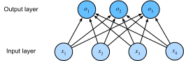

<!-- ===================== Bắt đầu dịch Phần 1 ===================== -->
<!-- ========================================= REVISE PHẦN 1 - BẮT ĐẦU =================================== -->

<!--
# Softmax Regression
-->

# Hồi quy Softmax
:label:`sec_softmax`

<!--
In :numref:`sec_linear_regression`, we introduced linear regression, working through implementations from scratch in :numref:`sec_linear_scratch` 
and again using Gluon in :numref:`sec_linear_gluon` to do the heavy lifting.
-->

Trong :numref:`sec_linear_regression`, chúng ta đã giới thiệu về hồi quy tuyến tính, từ việc tự xây dựng mô hình hồi quy tuyến tính từ đầu tại :numref:`sec_linear_scratch` cho đến xây dựng mô hình hồi quy tuyến tính với Gluon thực hiện phần việc nặng nhọc tại :numref:`sec_linear_gluon`.

<!--
Regression is the hammer we reach for when we want to answer *how much?* or *how many?* questions.
If you want to predict the number of dollars (the *price*) at which a house will be sold, or the number of wins a baseball team might have,
or the number of days that a patient will remain hospitalized before being discharged, then you are probably looking for a regression model.
-->

Hồi quy là công cụ đắc lực có thể sử dụng khi ta muốn trả lời câu hỏi *bao nhiêu?*.
Nếu bạn muốn dự đoán một ngôi nhà sẽ được bán với giá bao nhiêu tiền (*Đô la*), hay số trận thắng mà một đội bóng có thể đạt được, hoặc số ngày một bệnh nhân phải điều trị nội trú trước khi được xuất viện, thì có lẽ bạn đang cần một mô hình hồi quy.

<!--
In practice, we are more often interested in classification: asking not *how much?* but *which one?*
-->

Trong thực tế, chúng ta thường quan tâm đến việc phân loại hơn: không phải câu hỏi *bao nhiêu?* mà là *loại nào?*

<!--
* Does this email belong in the spam folder or the inbox*?
* Is this customer more likely *to sign up* or *not to sign up* for a subscription service?*
* Does this image depict a donkey, a dog, a cat, or a rooster?
* Which movie is Aston most likely to watch next?
-->

* Email này có phải thư rác hay không?
* Khách hàng này nhiều khả năng *đăng ký* hay *không đăng ký* một dịch vụ thuê bao?
* Hình ảnh này mô tả một con lừa, một con chó, một con mèo hay một con gà trống?
* Bộ phim nào có khả năng cao nhất được Aston xem tiếp theo?

<!--
Colloquially, machine learning practitioners overload the word *classification* to describe two subtly different problems:
(i) those where we are interested only in *hard* assignments of examples to categories; and (ii) those where we wish to make *soft assignments*,
i.e., to assess the *probability* that each category applies.
The distinction tends to get blurred, in part, because often, even when we only care about hard assignments, we still use models that make soft assignments.
-->

Thông thường, những người làm về học máy dùng từ *phân loại* để mô tả đôi chút sự khác nhau giữa hai bài toán:
(i) ta chỉ quan tâm đến việc gán *cứng* một danh mục cho mỗi ví dụ: là chó, là gà, hay là mèo?; và (ii) ta muốn *gán mềm* tất cả các danh mục cho mỗi ví dụ, tức đánh giá *xác suất* một ví dụ rơi vào từng danh mục khả dĩ: là chó (92%), là gà (1%), là mèo (7%).
Sự khác biệt này thường không rõ ràng, một phần bởi vì thông thường ngay cả khi chúng ta chỉ quan tâm đến việc gán cứng, chúng ta vẫn sử dụng các mô hình thực hiện các phép gán mềm.

<!-- ===================== Kết thúc dịch Phần 1 ===================== -->

<!-- ===================== Bắt đầu dịch Phần 2 ===================== -->

<!--
## Classification Problems
-->

## Bài toán Phân loại

<!--
To get our feet wet, let's start off with a simple image classification problem.
Here, each input consists of a $2\times2$ grayscale image.
We can represent each pixel value with a single scalar, giving us four features $x_1, x_2, x_3, x_4$.
Further, let's assume that each image belongs to one among the categories "cat", "chicken" and "dog".
-->

Hãy khởi động với một bài toán phân loại hình ảnh đơn giản.
Ở đây, mỗi đầu vào là một ảnh xám có kích thước $2\times2$.
Bằng cách biểu diễn mỗi giá trị điểm ảnh bởi một số vô hướng, ta thu được bốn đặc trưng $x_1, x_2, x_3, x_4$.
Hơn nữa, giả sử rằng mỗi hình ảnh đều thuộc về một trong các danh mục "mèo", "gà" và "chó".

<!--
Next, we have to choose how to represent the labels.
We have two obvious choices.
Perhaps the most natural impulse would be to choose $y \in \{1, 2, 3\}$, where the integers represent {dog, cat, chicken} respectively.
This is a great way of *storing* such information on a computer.
If the categories had some natural ordering among them, say if we were trying to predict {baby, toddler, adolescent, young adult, adult, geriatric},
then it might even make sense to cast this problem as regression and keep the labels in this format.
-->

Tiếp theo, ta cần phải chọn cách biểu diễn nhãn. 
Ta có hai cách làm hiển nhiên.
Cách tự nhiên nhất có lẽ là chọn $y \in \{1, 2, 3\}$ lần lượt ứng với {chó, mèo,  gà}.
Đây là một cách *lưu trữ* thông tin tuyệt vời trên máy tính.
Nếu các danh mục có một thứ tự tự nhiên giữa chúng, chẳng hạn như {trẻ sơ sinh, trẻ tập đi, thiếu niên, thanh niên, người trưởng thành, người cao tuổi}, sẽ là tự nhiên hơn nếu coi bài toán này là một bài toán hồi quy và nhãn sẽ được giữ nguyên dưới dạng số.

<!--
But general classification problems do not come with natural orderings among the classes.
Fortunately, statisticians long ago invented a simple way to represent categorical data: the *one hot encoding*.
A one-hot encoding is a vector with as many components as we have categories.
The component corresponding to particular instance's category is set to 1 and all other components are set to 0.
-->

Nhưng nhìn chung các lớp của bài toán phân loại không tuân theo một trật tự tự nhiên nào.
May mắn thay, các nhà thông kê từ lâu đã tìm ra một cách đơn giản để có thể biểu diễn dữ liệu danh mục: *biểu diễn one-hot*.
Biểu diễn one-hot là một vector với số lượng thành phần bằng số danh mục mà ta có.
Thành phần tương ứng với từng danh mục cụ thể sẽ được gán giá trị 1 và tất cả các thành phần khác sẽ được gán giá trị 0.

$$y \in \{(1, 0, 0), (0, 1, 0), (0, 0, 1)\}.$$

<!--
In our case, $y$ would be a three-dimensional vector, with $(1, 0, 0)$ corresponding to "cat", $(0, 1, 0)$ to "chicken" and $(0, 0, 1)$ to "dog".
-->

Trong trường hợp này, $y$ sẽ là một vector 3 chiều, với $(1, 0, 0)$ tương ứng với "mèo", $(0, 1, 0)$ ứng với "gà" và $(0, 0, 1)$ ứng với "chó".

<!-- ===================== Kết thúc dịch Phần 2 ===================== -->

<!-- ===================== Bắt đầu dịch Phần 3 ===================== -->

<!-- ========================================= REVISE PHẦN 1 - KẾT THÚC ===================================-->

<!-- ========================================= REVISE PHẦN 2 - BẮT ĐẦU ===================================-->

<!--
### Network Architecture
-->

### Kiến trúc mạng

<!--
In order to estimate the conditional probabilities associated with each classes, we need a model with multiple outputs, one per class.
To address classification with linear models, we will need as many linear functions as we have outputs.
Each output will correspond to its own linear function.
In our case, since we have 4 features and 3 possible output categories, we will need 12 scalars to represent the weights, 
($w$ with subscripts) and 3 scalars to represent the biases ($b$ with subscripts).
We compute these three *logits*, $o_1, o_2$, and $o_3$, for each input:
-->

Để tính xác suất có điều kiện ứng với mỗi lớp, chúng ta cần một mô hình có nhiều đầu ra với một đầu ra cho mỗi lớp.
Để phân loại với các mô hình tuyến tính, chúng ta cần số hàm tuyến tính tương đương số đầu ra.
Mỗi đầu ra sẽ tương ứng với hàm tuyến tính của chính nó.
Trong trường hợp này, vì có 4 đặc trưng và 3 đầu ra, chúng ta sẽ cần 12 số vô hướng để thể hiện các trọng số, ($w$ với các chỉ số dưới) và 3 số vô hướng để thể hiện các hệ số điều chỉnh ($b$ với các chỉ số dưới).
Chúng ta sẽ tính ba *logits*, $o_1, o_2$, và $o_3$, cho mỗi đầu vào:

$$
\begin{aligned}
o_1 &= x_1 w_{11} + x_2 w_{12} + x_3 w_{13} + x_4 w_{14} + b_1,\\
o_2 &= x_1 w_{21} + x_2 w_{22} + x_3 w_{23} + x_4 w_{24} + b_2,\\
o_3 &= x_1 w_{31} + x_2 w_{32} + x_3 w_{33} + x_4 w_{34} + b_3.
\end{aligned}
$$

<!--
We can depict this calculation with the neural network diagram shown in :numref:`fig_softmaxreg`.
Just as in linear regression, softmax regression is also a single-layer neural network.
And since the calculation of each output, $o_1, o_2$, and $o_3$, depends on all inputs, $x_1$, $x_2$, $x_3$, and $x_4$,
the output layer of softmax regression can also be described as fully-connected layer.
-->

Chúng ta có thể mô tả phép tính này với biểu đồ mạng nơ-ron được thể hiện trong :numref:`fig_softmaxreg`.
Như hồi quy tuyến tính, hồi quy softmax cũng là một mạng nơ-ron đơn tầng.
Và vì sự tính toán của mỗi đầu ra, $o_1, o_2$, và $o_3$, phụ thuộc vào tất cả đầu vào, $x_1$, $x_2$, $x_3$, và $x_4$, tầng đầu ra của hồi quy softmax cũng có thể được xem như một tầng kết nối đầy đủ.

<!--

-->

:label:`fig_softmaxreg`

<!--
To express the model more compactly, we can use linear algebra notation.
In vector form, we arrive at $\mathbf{o} = \mathbf{W} \mathbf{x} + \mathbf{b}$, a form better suited both for mathematics, and for writing code.
Note that we have gathered all of our weights into a $3\times4$ matrix and that for a given example $\mathbf{x}$, 
our outputs are given by a matrix-vector product of our weights by our inputs plus our biases $\mathbf{b}$.
-->

Để biểu diễn mô hình gọn hơn, chúng ta có thể sử dụng ký hiệu đại số tuyến tính.
Ở dạng vector, ta có $\mathbf{o} = \mathbf{W} \mathbf{x} + \mathbf{b}$, một dạng phù hợp hơn cho cả toán và lập trình.
Chú ý rằng chúng ta đã tập hợp tất cả các trọng số vào một ma trận $3\times4$ và với một mẫu cho trước $\mathbf{x}$, các đầu ra được tính bởi tích ma trận-vector của các trọng số và đầu vào cộng với vector hệ số điều chỉnh $\mathbf{b}$.
<!-- ===================== Kết thúc dịch Phần 3 ===================== -->

<!-- ===================== Bắt đầu dịch Phần 4 ===================== -->

<!--
### Softmax Operation
-->

### Hàm Softmax

<!--
The main approach that we are going to take here is to interpret the outputs of our model as probabilities.
We will optimize our parameters to produce probabilities that maximize the likelihood of the observed data.
Then, to generate predictions, we will set a threshold, for example, choosing the *argmax* of the predicted probabilities.
-->

Chúng ta sẽ xem các giá trị đầu ra của mô hình là các giá trị xác suất.
Ta sẽ tối ưu hóa các tham số của mô hình sao cho khả năng xuất hiện dữ liệu quan sát được là cao nhất.
Sau đó, ta sẽ đưa ra dự đoán bằng cách đặt ngưỡng xác suất, ví dụ dự đoán nhãn đúng là nhãn có xác suất cao nhất (dùng hàm *argmax*).

<!--
Put formally, we would like outputs $\hat{y}_k$ that we can interpret as the probability that a given item belongs to class $k$.
Then we can choose the class with the largest output value as our prediction $\operatorname*{argmax}_k y_k$.
For example, if $\hat{y}_1$, $\hat{y}_2$, and $\hat{y}_3$ are $0.1$, $.8$, and $0.1$, respectively, then we predict category $2$, which (in our example) represents "chicken".
-->

Nói một cách chính quy hơn, ta mong muốn diễn dịch kết quả $\hat{y}_k$ là xác suất để một điểm dữ liệu cho trước thuộc về một lớp $k$ nào đó.
Sau đó, ta có thể chọn lớp cho điểm đó tương ứng với giá trị lớn nhất mà mô hình dự đoán $\operatorname*{argmax}_k y_k$.
Ví dụ, nếu $\hat{y}_1$, $\hat{y}_2$ và $\hat{y}_3$ lần lượt là $0.1$, $0.8$, and $0.1$, thì ta có thể dự đoán điểm đó thuộc về lớp số $2$ là "gà" (ứng với trong ví dụ trước).

<!--
You might be tempted to suggest that we interpret the logits $o$ directly as our outputs of interest.
However, there are some problems with directly interpreting the output of the linear layer as a probability.
Nothing constrains these numbers to sum to 1.
Moreover, depending on the inputs, they can take negative values.
These violate basic axioms of probability presented in :numref:`sec_prob`
-->

Bạn có thể muốn đề xuất rằng ta lấy trực tiếp logit $o$ làm đầu ra mong muốn.
Tuy nhiên, sẽ có vấn đề khi coi kết qủa trả về trực tiếp từ tầng tuyến tính như là các giá trị xác suất.
Lý do là không có bất cứ điều kiện nào để ràng buộc tổng của những con số này bằng $1$.
Hơn nữa, tùy thuộc vào đầu vào mà ta có thể nhận được giá trị âm.
Các lý do trên khiến kết quả của tầng tuyến tính vi phạm vào các tiên đề cơ bản của xác xuất đã được nhắc đến trong :numref:`sec_prob`.

<!--
To interpret our outputs as probabilities, we must guarantee that (even on new data), they will be nonnegative and sum up to 1.
Moreover, we need a training objective that encourages the model to estimate faithfully *probabilities*.
Of all instances when a classifier outputs $.5$, we hope that half of those examples will *actually* belong to the predicted class.
This is a property called *calibration*.
-->

Để có thể diễn dịch kết quả đầu ra là xác xuất, ta phải đảm bảo rằng các kết quả không âm và tổng của chúng phải bằng 1 (điều này phải đúng trên cả dữ liệu mới).
Hơn nữa, ta cần một hàm mục tiêu trong quá trình huấn luyện để cho mô hình có thể ước lượng *xác suất* một cách chính xác.
Trong tất cả các trường hợp, khi kết quả phân lớp cho ra xác suất là $0.5$ thì ta hy vọng phân nửa số mẫu đó *thực sự* thuộc về đúng lớp được dự đoán.
Đây được gọi là *hiệu chuẩn*.

<!--
The *softmax function*, invented in 1959 by the social scientist R Duncan Luce in the context of *choice models* does precisely this.
To transform our logits such that they become nonnegative and sum to $1$, while requiring that the model remains differentiable, 
we first exponentiate each logit (ensuring non-negativity) and then divide by their sum (ensuring that they sum to $1$).
-->

*Hàm softmax*, được phát minh vào năm 1959 bởi nhà khoa học xã hội R Duncan Luce với chủ đề *mô hình lựa chọn*, thỏa mãn chính xác những điều trên.
Để biến đổi kết quả logit thành kết quả không âm và có tổng là $1$, trong khi vẫn giữ tính chất khả vi, đầu tiên ta cần lấy hàm mũ cho từng logit (để chắc chắn chúng không âm) và sau đó ta chia cho tổng của chúng (để chắc rằng tổng của chúng luôn bằng 1).

$$
\hat{\mathbf{y}} = \mathrm{softmax}(\mathbf{o})\quad \text{tại}\quad
\hat{y}_i = \frac{\exp(o_i)}{\sum_j \exp(o_j)}.
$$

<!--
It is easy to see $\hat{y}_1 + \hat{y}_2 + \hat{y}_3 = 1$ with $0 \leq \hat{y}_i \leq 1$ for all $i$.
Thus, $\hat{y}$ is a proper probability distribution and the values of $\hat{\mathbf{y}}$ can be interpreted accordingly.
Note that the softmax operation does not change the ordering among the logits, and thus we can still pick out the most likely class by:
-->

Dễ thấy rằng $\hat{y}_1 + \hat{y}_2 + \hat{y}_3 = 1$ với $0 \leq \hat{y}_i \leq 1$ với mọi $i$.
Do đó, $\hat{y}$ là phân phối xác suất phù hợp và các giá trị của $\hat{\mathbf{y}}$ có thể được hiểu theo đó.
Lưu ý rằng hàm softmax không thay đổi thứ tự giữa các logit và do đó ta vẫn có thể chọn ra lớp phù hợp nhất bằng cách: 

$$
\hat{\imath}(\mathbf{o}) = \operatorname*{argmax}_i o_i = \operatorname*{argmax}_i \hat y_i.
$$

<!--
The logits $\mathbf{o}$ then are simply the pre-softmax values that determining the probabilities assigned to each category.
Summarizing it all in vector notation we get ${\mathbf{o}}^{(i)} = \mathbf{W} {\mathbf{x}}^{(i)} + {\mathbf{b}}$, where ${\hat{\mathbf{y}}}^{(i)} = \mathrm{softmax}({\mathbf{o}}^{(i)})$.
-->

Các logit $\mathbf{o}$ đơn giản chỉ là các giá trị trước khi cho qua hàm softmax để xác định xác xuất thuộc về mỗi danh mục. 
Tóm tắt lại, ta có ký hiệu dưới dạng vector như sau: ${\mathbf{o}}^{(i)} = \mathbf{W} {\mathbf{x}}^{(i)} + {\mathbf{b}}$, với ${\hat{\mathbf{y}}}^{(i)} = \mathrm{softmax}({\mathbf{o}}^{(i)})$.

<!-- ===================== Kết thúc dịch Phần 4 ===================== -->

<!-- ===================== Bắt đầu dịch Phần 5 ===================== -->

<!-- ========================================= REVISE PHẦN 2 - KẾT THÚC ===================================-->

<!-- ========================================= REVISE PHẦN 3 - BẮT ĐẦU ===================================-->

<!--
### Vectorization for Minibatches
-->

### Vector hóa Minibatch

<!--
To improve computational efficiency and take advantage of GPUs, we typically carry out vector calculations for minibatches of data.
Assume that we are given a minibatch $\mathbf{X}$ of examples with dimensionality $d$ and batch size $n$.
Moreover, assume that we have $q$ categories (outputs).
Then the minibatch features $\mathbf{X}$ are in $\mathbb{R}^{n \times d}$, weights $\mathbf{W} \in \mathbb{R}^{d \times q}$, and the bias satisfies $\mathbf{b} \in \mathbb{R}^q$.
-->

Để cải thiện hiệu suất tính toán và tận dụng GPU, ta thường phải thực hiện các phép tính vector cho các minibatch dữ liệu.
Giả sử, ta có một minibatch $\mathbf{X}$ của mẫu với số chiều $d$ và kích thước batch là $n$.
Thêm vào đó, chúng ta có $q$ lớp đầu ra.
Như vậy, minibatch đặc trưng $\mathbf{X}$ sẽ thuộc $\mathbb{R}^{n \times d}$, trọng số $\mathbf{W} \in \mathbb{R}^{d \times q}$, và độ chệch sẽ thỏa mãn $\mathbf{b} \in \mathbb{R}^q$.

$$
\begin{aligned}
\mathbf{O} &= \mathbf{X} \mathbf{W} + \mathbf{b}, \\
\hat{\mathbf{Y}} & = \mathrm{softmax}(\mathbf{O}).
\end{aligned}
$$

<!--
This accelerates the dominant operation into a matrix-matrix product $\mathbf{W} \mathbf{X}$ vs the matrix-vector products we would be executing if we processed one example at a time.
The softmax itself can be computed by exponentiating all entries in $\mathbf{O}$ and then normalizing them by the sum.
-->

Việc tăng tốc diễn ra chủ yếu tại tích ma trận - ma trận $\mathbf{W} \mathbf{X}$ so với tích ma trận - vector nếu chúng ta xử lý từng mẫu một.
Bản thân softmax có thể được tính bằng cách lũy thừa tất cả các mục trong $\mathbf{O}$ và sau đó chuẩn hóa chúng theo tổng.

<!--
## Loss Function
-->

## Hàm mất mát

<!--
Next, we need a *loss function* to measure the quality of our predicted probabilities.
We will rely on *likelihood maximization*, the very same concept that we encountered when providing a probabilistic justification for the least squares objective in linear regression 
(:numref:`sec_linear_regression`).
-->

Tiếp theo, chúng ta cần một *hàm mất mát* để đánh giá chất lượng các dự đoán xác suất.
Chúng ta sẽ dựa trên *hợp lý cực đại*, khái niệm tương tự đã gặp khi đưa ra lý giải xác suất cho hàm mục tiêu bình phương nhỏ nhất trong hồi quy tuyến tính (:numref:`sec_linear_regression`).

<!-- ===================== Kết thúc dịch Phần 5 ===================== -->

<!-- ===================== Bắt đầu dịch Phần 6 ===================== -->

<!--
### Log-Likelihood
-->

### Log hợp lý

<!--
The softmax function gives us a vector $\hat{\mathbf{y}}$, which we can interpret as estimated conditional probabilities of each class given the input $x$, 
e.g., $\hat{y}_1$ = $\hat{P}(y=\mathrm{cat} \mid \mathbf{x})$.
We can compare the estimates with reality by checking how probable the *actual* classes are according to our model, given the features.
-->

Hàm softmax cho chúng ta một vector $\hat{\mathbf{y}}$, có thể được hiểu như các xác suất có điểu kiện của từng lớp với đầu vào $x$.
Ví dụ: $\hat{y}_1$ = $\hat{P}(y=\mathrm{cat} \mid \mathbf{x})$.
Để biết các ước lượng có sát với thực tế hay không, ta kiểm tra xác suất mà mô hình gán cho lớp *thật sự* khi biết các đặc trưng.

$$
P(Y \mid X) = \prod_{i=1}^n P(y^{(i)} \mid x^{(i)})
\text{ và vì vậy }
-\log P(Y \mid X) = \sum_{i=1}^n -\log P(y^{(i)} \mid x^{(i)}).
$$

<!--
Maximizing $P(Y \mid X)$ (and thus equivalently minimizing $-\log P(Y \mid X)$) corresponds to predicting the label well.
This yields the loss function (we dropped the superscript $(i)$ to avoid notation clutter):
-->

Cực đại hoá $P(Y \mid X)$ (và vì vậy tương đương với cực tiểu hóa $-\log P(Y \mid X)$) giúp việc dự đoán nhãn tốt hơn.
Điều này dẫn đến hàm mất mát (chúng tôi lược bỏ chỉ số trên $(i)$ để tránh sự nhập nhằng về kí hiệu):

$$
l = -\log P(y \mid x) = - \sum_j y_j \log \hat{y}_j.
$$

<!--
For reasons explained later on, this loss function is commonly called the *cross-entropy* loss.
Here, we used that by construction $\hat{y}$ is a discrete probability distribution and that the vector $\mathbf{y}$ is a one-hot vector.
Hence the the sum over all coordinates $j$ vanishes for all but one term.
Since all $\hat{y}_j$ are probabilities, their logarithm is never larger than $0$.
Consequently, the loss function cannot be minimized any further if we correctly predict $y$ with *certainty*, i.e., if $P(y \mid x) = 1$ for the correct label.
Note that this is often not possible.
For example, there might be label noise in the dataset (some examples may be mislabeled).
It may also not be possible when the input features are not sufficiently informative to classify every example perfectly.
-->
Bởi vì những lý do sẽ được giải thích sau đây, hàm mất mát này thường được gọi là mất mát *entropy chéo*.
Ở đây, chúng ta đã sử dụng nó bằng cách xây dựng $\hat{y}$ giống như một phân phối xác suất rời rạc và vector $\mathbf{y}$ là một vector one-hot.
Do đó, tổng các số hạng với chỉ số $j$ sẽ tiêu biến tạo thành một giá trị duy nhất.
Bởi mọi $\hat{y}_j$ đều là xác suất, log của chúng không bao giờ lớn hơn $0$.
Vì vậy, hàm mất mát sẽ không thể giảm thêm được nữa nếu chúng ta dự đoán chính xác $y$ với *độ chắc chắn tuyệt đối*, tức $P(y \mid x) = 1$ cho nhãn đúng.
Chú ý rằng điều này thường không khả thi.
Ví dụ, nhãn bị nhiễu sẽ xuất hiện trong tập dữ liệu (một vài mẫu bị dán nhầm nhãn).
Điều này cũng khó xảy ra khi những đặc trưng đầu vào không chứa đủ thông tin để phân loại các mẫu một cách hoàn hảo.

<!-- ===================== Kết thúc dịch Phần 6 ===================== -->

<!-- ===================== Bắt đầu dịch Phần 7 ===================== -->

<!-- ========================================= REVISE PHẦN 3 - KẾT THÚC ===================================-->

<!-- ========================================= REVISE PHẦN 4 - BẮT ĐẦU ===================================-->

<!--
### Softmax and Derivatives
-->

### Softmax và Đạo hàm

<!--
Since the softmax and the corresponding loss are so common, it is worth while understanding a bit better how it is computed.
Plugging $o$ into the definition of the loss $l$ and using the definition of the softmax we obtain:
-->

Vì softmax và hàm mất mát softmax rất phổ biến, nên việc hiểu cách tính giá trị các hàm này sẽ có ích về sau.
Thay $o$ vào định nghĩa của hàm mất mát $l$ và dùng định nghĩa của softmax, ta được: 

$$
l = -\sum_j y_j \log \hat{y}_j = \sum_j y_j \log \sum_k \exp(o_k) - \sum_j y_j o_j
= \log \sum_k \exp(o_k) - \sum_j y_j o_j.
$$

<!--
To understand a bit better what is going on, consider the derivative with respect to $o$. We get
-->

Để hiểu rõ hơn, hãy cùng xét đạo hàm riêng của $l$ theo $o$. Ta có: 

$$
\partial_{o_j} l = \frac{\exp(o_j)}{\sum_k \exp(o_k)} - y_j = \mathrm{softmax}(\mathbf{o})_j - y_j = P(y = j \mid x) - y_j.
$$

<!--
In other words, the gradient is the difference between the probability assigned to the true class by our model, as expressed by the probability $P(y \mid x)$, and what actually happened, as expressed by $y$.
In this sense, it is very similar to what we saw in regression, where the gradient was the difference between the observation $y$ and estimate $\hat{y}$. This is not coincidence.
In any [exponential family](https://en.wikipedia.org/wiki/Exponential_family) model, the gradients of the log-likelihood are given by precisely this term.
This fact makes computing gradients easy in practice.
-->

Nói cách khác, gradient chính là hiệu giữa xác xuất mô hình gán cho lớp đúng $P(y \mid x)$, và nhãn của dữ liệu $y$. 
Điều này cũng tương tự như trong bài toán hồi quy, khi gradient là hiệu giữa dữ liệu quan sát được $y$ và kết quả ước lượng $\hat{y}$. Đây không phải là ngẫu nhiên. 
Trong mọi mô hình [họ lũy thừa](https://en.wikipedia.org/wiki/Exponential_family), gradient của hàm log hợp lý đều có dạng như thế này. 
Điều này giúp cho việc tính toán gradient trong thực tế trở nên dễ dàng hơn. 

<!-- ===================== Kết thúc dịch Phần 7 ===================== -->

<!-- ===================== Bắt đầu dịch Phần 8 ===================== -->

<!--
### Cross-Entropy Loss
-->

### Hàm mất mát Entropy chéo

<!--
Now consider the case where we observe not just a single outcome but an entire distribution over outcomes.
We can use the same representation as before for $y$.
The only difference is that rather than a vector containing only binary entries, say $(0, 0, 1)$, we now have a generic probability vector, say $(0.1, 0.2, 0.7)$.
The math that we used previously to define the loss $l$ still works out fine, just that the interpretation is slightly more general.
It is the expected value of the loss for a distribution over labels.
-->

Giờ hãy xem xét trường hợp mà ta quan sát được toàn bộ phân phối của đầu ra thay vì chỉ một giá trị đầu ra duy nhất. 
Ta có thể biểu diễn $y$ giống hệt như trước. 
Sự khác biệt duy nhất là thay vì có một vector chỉ chứa các phần tử nhị phân, giả sử như $(0, 0, 1)$, giờ ta có một vector xác suất tổng quát, ví dụ như $(0.1, 0.2, 0.7)$. 
Các công thức toán học ta dùng trước đó để định nghĩa hàm mất mát $l$ vẫn áp dụng tốt ở đây nhưng khái quát hơn một chút. 
Giá trị của các phần tử trong vector tương ứng giá trị kỳ vọng của hàm mất mát trên phân phối của nhãn. 

$$
l(\mathbf{y}, \hat{\mathbf{y}}) = - \sum_j y_j \log \hat{y}_j.
$$

<!--
This loss is called the cross-entropy loss and it is one of the most commonly used losses for multiclass classification.
We can demystify the name by introducing the basics of information theory.
-->

Hàm trên được gọi là hàm mát mát entropy chéo và là một trong những hàm mất mát phổ biến nhất dùng cho bài toán phân loại đa lớp. 
Ta có thể làm sáng tỏ cái tên entropy chéo bằng việc giới thiệu các kiến thức cơ bản trong lý thuyết thông tin. 

<!--
## Information Theory Basics
-->

## Lý thuyết Thông tin Cơ bản

<!--
Information theory deals with the problem of encoding, decoding, transmitting and manipulating information (also known as data) in as concise form as possible.
-->

Lý thuyết thông tin giải quyết các bài toán mã hóa, giải mã, truyền tải và xử lý thông tin (hay còn được gọi là dữ liệu) dưới dạng ngắn gọn nhất có thể. 
<!-- ===================== Kết thúc dịch Phần 8 ===================== -->

<!-- ===================== Bắt đầu dịch Phần 9 ===================== -->

<!--
### Entropy
-->

### Entropy

<!--
The central idea in information theory is to quantify the information content in data.
This quantity places a hard limit on our ability to compress the data.
In information theory, this quantity is called the [entropy](https://en.wikipedia.org/wiki/Entropy) of a distribution $p$, and it is captured by the following equation:
-->

Ý tưởng cốt lõi trong lý thuyết thông tin chính là việc định lượng lượng thông tin chứa trong dữ liệu. 
Giá trị định lượng này chỉ ra giới hạn tối đa cho khả năng nén dữ liệu (khi tìm biểu diễn ngắn gọn nhất mà không mất thông tin). 
Giá trị định lượng này gọi là [entropy](https://en.wikipedia.org/wiki/Entropy), xác định trên phân phối $p$ của bộ dữ liệu, được định nghĩa bằng phương trình dưới đây: 

$$
H[p] = \sum_j - p(j) \log p(j).
$$

<!--
One of the fundamental theorems of information theory states that in order to encode data drawn randomly from the distribution $p$, we need at least $H[p]$ "nats" to encode it.
If you wonder what a "nat" is, it is the equivalent of bit but when using a code with base $e$ rather than one with base 2.
One nat is $\frac{1}{\log(2)} \approx 1.44$ bit. 
$H[p] / 2$ is often also called the binary entropy.
-->

Một định lý căn bản của lý thuyết thông tin là để có thể mã hóa dữ liệu thu thập ngẫu nhiên từ phân phối $p$, chúng ta cần sử dụng ít nhất $H[p]$ "nat". 
"nat" là đơn vị biểu diễn dữ liệu sử dụng cơ số $e$, tương tự với bit biểu diễn dữ liệu sử dụng cơ số 2. 
Một nat bằng $\frac{1}{\log(2)} \approx 1.44$ bit. 
$H[p] / 2$ thường được gọi là entropy nhị phân. 

<!--
### Surprisal
-->

### Lượng tin

<!--
You might be wondering what compression has to do with prediction.
Imagine that we have a stream of data that we want to compress.
If it is always easy for us to predict the next token, then this data is easy to compress!
Take the extreme example where every token in the stream always takes the same value.
That is a very boring data stream!
And not only is it boring, but it is easy to predict.
Because they are always the same, we do not have to transmit any information to communicate the contents of the stream.
Easy to predict, easy to compress.
-->

Có lẽ bạn sẽ tự hỏi việc nén dữ liệu thì liên quan gì với việc đưa ra dự đoán? 
Hãy tưởng tượng chúng ta có một luồng (stream) dữ liệu cần nén. 
Nếu ta luôn có thể dễ dàng đoán được đơn vị dữ liệu (token) kế tiếp thì dữ liệu này rất dễ nén! 
Ví như tất cả các đơn vị dữ liệu trong dòng dữ liệu luôn có một giá trị cố định thì đây là một dòng dữ liệu tẻ nhạt! 
Không những tẻ nhạt, mà nó còn dễ đoán nữa. 
Bởi vì chúng luôn có cùng giá trị, ta sẽ không phải truyền bất cứ thông tin nào để trao đổi nội dung của dòng dữ liệu này. 
Dễ đoán thì cũng dễ nén là vậy. 

<!-- ===================== Kết thúc dịch Phần 9 ===================== -->

<!-- ===================== Bắt đầu dịch Phần 10 ===================== -->

<!--
However if we cannot perfectly predict every event, then we might some times be surprised.
Our surprise is greater when we assigned an event lower probability.
For reasons that we will elaborate in the appendix,
Claude Shannon settled on $\log(1/p(j)) = -\log p(j)$ to quantify one's *surprisal* at observing an event $j$ having assigned it a (subjective) probability $p(j)$.
The entropy is then the *expected surprisal* when one assigned the correct probabilities (that truly match the data-generating process).
The entropy of the data is then the least surprised that one can ever be (in expectation).
-->

Tuy nhiên, nếu ta không thể dự đoán một cách hoàn hảo cho mỗi sự kiện, thì thi thoảng ta sẽ thấy ngạc nhiên. 
Sự ngạc nhiên trong chúng ta sẽ lớn hơn khi ta gán một xác suất thấp hơn cho sự kiện. 
Vì nhiều lý do mà chúng ta sẽ nghiên cứu trong phần phụ lục, 
Claude Shannon đã đưa ra giải pháp $\log(1/p(j)) = -\log p(j)$ để định lượng *sự ngạc nhiên* của một người lúc quan sát sự kiện $j$ sau khi đã gán cho sự kiện đó một xác suất (chủ quan) $p(j)$.
Entropy lúc này sẽ là *lượng tin (độ ngạc nhiên) kỳ vọng* khi mà xác suất của các sự kiện đó được gán chính xác, khớp với phân phối sinh dữ liệu. 
Nói cách khác, entropy là lượng thông tin hay mức độ ngạc nhiên tối thiểu mà dữ liệu sẽ đem lại theo kỳ vọng. 

<!-- ========================================= REVISE PHẦN 4 - KẾT THÚC ===================================-->

<!-- ========================================= REVISE PHẦN 5 - BẮT ĐẦU ===================================-->

<!--
### Cross-Entropy Revisited
-->

### Xem xét lại Entropy chéo

<!--
So if entropy is level of surprise experienced by someone who knows the true probability, then you might be wondering, *what is cross-entropy?*
The cross-entropy *from $p$ to $q$*, denoted H(p, q), is the expected surprisal of an observer with subjective probabilities $q$ upon seeing data that was actually generated according to probabilities $p$.
The lowest possible cross-entropy is achieved when $p=q$.
In this case, the cross-entropy from $p$ to $q$ is $H(p, p)= H(p)$.
Relating this back to our classification objective, even if we get the best possible predictions, if the best possible possible, then we will never be perfect.
Our loss is lower-bounded by the entropy given by the actual conditional distributions $P(\mathbf{y} \mid \mathbf{x})$.
-->

Nếu entropy là mức độ ngạc nhiên trải nghiệm bởi một người nắm rõ xác suất thật, thì bạn có thể băn khoăn rằng *entropy chéo là gì?*
Entropy chéo *từ* $p$ *đến* $q$, ký hiệu $H(p, q)$, là sự ngạc nhiên kỳ vọng của một người quan sát với các xác suất chủ quan $q$ đối với dữ liệu sinh ra dựa trên các xác suất $p$.
Giá trị entropy chéo thấp nhất có thể đạt được khi $p = q$.
Trong trường hợp này, entropy chéo từ $p$ đến $q$ là $H(p, p) = H(p)$.
Liên hệ điều này lại với mục tiêu phân loại của chúng ta, thậm chí khi ta có khả năng dự đoán tốt nhất có thể và cho rằng việc này là khả thi, thì ta sẽ không bao giờ đạt đến mức hoàn hảo.
Mất mát của ta bị giới hạn dưới (*lower-bounded*) bởi entropy tạo bởi các phân phối thực tế có điều kiện $P(\mathbf{y} \mid \mathbf{x})$.

<!--
### Kullback Leibler Divergence
-->

### Phân kỳ Kullback Leibler

<!--
Perhaps the most common way to measure the distance between two distributions is to calculate the *Kullback Leibler divergence* $D(p\|q)$.
This is simply the difference between the cross-entropy and the entropy, i.e., the additional cross-entropy incurred over the irreducible minimum value it could take:
-->

Có lẽ cách thông dụng nhất để đo lường khoảng cách giữa hai phân phối là tính toán *phân kỳ Kullback Leibler* $D(p\|q)$.
Phân kỳ Kullback Leibler đơn giản là sự khác nhau giữa entropy chéo và entropy, có nghĩa là giá trị entropy chéo bổ sung phát sinh so với giá trị nhỏ nhất không thể giảm được mà nó có thể nhận:

$$
D(p\|q) = H(p, q) - H[p] = \sum_j p(j) \log \frac{p(j)}{q(j)}.
$$

<!--
Note that in classification, we do not know the true $p$, so we cannot compute the entropy directly.
However, because the entropy is out of our control, minimizing $D(p\|q)$ with respect to $q$ is equivalent to minimizing the cross-entropy loss.
-->

Lưu ý rằng trong bài toán phân loại, ta không biết giá trị thật của $p$, vì thế mà ta không thể tính toán entropy trực tiếp được. 
Tuy nhiên, bởi vì entropy nằm ngoài tầm kiểm soát của chúng ta, việc giảm thiểu $D(p\|q)$ so với $q$ là tương đương với việc giảm thiểu mất mát entropy chéo.

<!--
In short, we can think of the cross-entropy classification objective in two ways: (i) as maximizing the likelihood of the observed data; 
and (ii) as minimizing our surprise (and thus the number of bits) required to communicate the labels.
-->

Tóm lại, chúng ta có thể nghĩ đến mục tiêu của phân loại entropy chéo theo hai hướng: (i) cực đại hóa khả năng xảy ra của dữ liệu được quan sát;
và (ii) giảm thiểu sự ngạc nhiên của ta (cũng như số lượng các bit) cần thiết để truyền đạt các nhãn.

<!-- ===================== Kết thúc dịch Phần 10 ===================== -->

<!-- ===================== Bắt đầu dịch Phần 11 ===================== -->

<!--
## Model Prediction and Evaluation
-->

## Sử dụng Mô hình để Dự đoán và Đánh giá

<!--
After training the softmax regression model, given any example features,
we can predict the probability of each output category.
Normally, we use the category with the highest predicted probability as the output category. The prediction is correct if it is consistent with the actual category (label).
In the next part of the experiment, we will use accuracy to evaluate the model’s performance.
This is equal to the ratio between the number of correct predictions a nd the total number of predictions.
-->

Sau khi huấn luyện mô hình hồi quy softmax với các đặc trưng đầu vào bất kì, chúng ta có thể dự đoán xác suất đầu ra ứng với mỗi lớp. 
Thông thường, chúng ta sử dụng lớp với xác suất dự đoán cao nhất làm lớp đầu ra. 
Một dự đoán được xem là chính xác nếu nó trùng khớp hay tương thích với lớp thật sự (nhãn).
Ở phần tiếp theo của thí nghiệm, chúng ta sẽ sử dụng độ chính xác để đánh giá chất lượng của mô hình. 
Giá trị này là tỉ lệ giữa số mẫu được dự đoán chính xác so với tổng số mẫu được dự đoán.

<!--
## Summary
-->

## Tóm tắt

<!--
* We introduced the softmax operation which takes a vector maps it into probabilities.
* Softmax regression applies to classification problems. It uses the probability distribution of the output category in the softmax operation.
* cross-entropy is a good measure of the difference between two probability distributions. It measures the number of bits needed to encode the data given our model.
-->

* Chúng tôi đã giới thiệu về hàm softmax giúp ánh xạ một vector đầu vào sang các giá trị xác suất. 
* Hồi quy softmax được áp dụng cho các bài toán phân loại. Nó sử dụng phân phối xác suất của các lớp đầu ra thông qua hàm softmax. 
* Entropy chéo là một phép đánh giá tốt cho sự khác nhau giữa 2 phân phối xác suất. Nó đo lường số lượng bit cần để biểu diễn dữ liệu cho mô hình.

<!--
## Exercises
-->

## Bài tập

<!--
1. Show that the Kullback-Leibler divergence $D(p\|q)$ is nonnegative for all distributions $p$ and $q$. Hint: use Jensen's inequality, i.e., use the fact that $-\log x$ is a convex function.
2. Show that $\log \sum_j \exp(o_j)$ is a convex function in $o$.
3. We can explore the connection between exponential families and the softmax in some more depth
    * Compute the second derivative of the cross-entropy loss $l(y,\hat{y})$ for the softmax.
    * Compute the variance of the distribution given by $\mathrm{softmax}(o)$ and show that it matches the second derivative computed above.
4. Assume that we three classes which occur with equal probability, i.e., the probability vector is $(\frac{1}{3}, \frac{1}{3}, \frac{1}{3})$.
    * What is the problem if we try to design a binary code for it? Can we match the entropy lower bound on the number of bits?
    * Can you design a better code. Hint: what happens if we try to encode two independent observations? What if we encode $n$ observations jointly?
5. Softmax is a misnomer for the mapping introduced above (but everyone in deep learning uses it). The real softmax is defined as $\mathrm{RealSoftMax}(a, b) = \log (\exp(a) + \exp(b))$.
    * Prove that $\mathrm{RealSoftMax}(a, b) > \mathrm{max}(a, b)$.
    * Prove that this holds for $\lambda^{-1} \mathrm{RealSoftMax}(\lambda a, \lambda b)$, provided that $\lambda > 0$.
    * Show that for $\lambda \to \infty$ we have $\lambda^{-1} \mathrm{RealSoftMax}(\lambda a, \lambda b) \to \mathrm{max}(a, b)$.
    * What does the soft-min look like?
    * Extend this to more than two numbers.
-->

1. Chứng minh rằng độ phân kì Kullback-Leibler $D(p\|q)$ không âm với mọi phân phối $p$ và $q$. Gợi ý: sử dụng bất đẳng thức Jensen hay nghĩa là sử dụng bổ đề $-\log x$ là một hàm lồi.
2. Chứng minh rằng $\log \sum_j \exp(o_j)$ là một hàm lồi với $o$.
3. Chúng ta có thể tìm hiểu sâu hơn về sự liên kết giữa các họ hàm mũ và softmax.
   * Tính đạo hàm cấp hai của hàm mất mát entropy chéo $l(y,\hat{y})$ cho softmax. 
   * Tính phương sai của phân phối được cho bởi $\mathrm{softmax}(o)$ và chứng minh rằng nó khớp với đạo hàm cấp hai được tính ở trên.
4. Giả sử rằng chúng ta có 3 lớp, xác suất xảy ra cho mỗi lớp bằng nhau, nói cách khác vector xác suất là $(\frac{1}{3}, \frac{1}{3}, \frac{1}{3})$.
   * Vấn đề là gì nếu chúng ta cố gắng thiết kế một mã nhị phân cho nó? Chúng ta có thể làm khớp cận dưới của entropy trên số lượng bits hay không? 
   * Bạn có thể thiết kế một mã tốt hơn không? Gợi ý: Điều gì xảy ra nếu chúng ta cố gắng biểu diễn 2 quan sát độc lập và nếu chúng ta biểu diễn $n$ quan sát đồng thời?
5. Softmax là một cách gọi sai cho phép ánh xạ đã được giới thiệu ở trên (nhưng cộng đồng học sâu vẫn sử dụng nó). Công thức thật sự của softmax là $\mathrm{RealSoftMax}(a, b) = \log (\exp(a) + \exp(b))$.
   * Chứng minh rằng $\mathrm{RealSoftMax}(a, b) > \mathrm{max}(a, b)$.
   * Chứng minh rằng $\lambda^{-1} \mathrm{RealSoftMax}(\lambda a, \lambda b) > \mathrm{max}(a, b)$ với $\lambda > 0$.
   * Chứng minh rằng khi $\lambda \to \infty$, chúng ta có $\lambda^{-1} \mathrm{RealSoftMax}(\lambda a, \lambda b) \to \mathrm{max}(a, b)$.
   * Soft-min sẽ trông như thế nào? 
   * Mở rộng nó cho nhiều hơn 2 số.
<!-- ===================== Kết thúc dịch Phần 11 ===================== -->

<!-- ========================================= REVISE PHẦN 5 - KẾT THÚC ===================================-->

<!--
## [Discussions](https://discuss.mxnet.io/t/2334)
-->

## Thảo luận
* [Tiếng Anh](https://discuss.mxnet.io/t/2334)
* [Tiếng Việt](https://forum.machinelearningcoban.com/c/d2l)

## Những người thực hiện
Bản dịch trong trang này được thực hiện bởi:
<!--
Tác giả của mỗi Pull Request điền tên mình và tên những người review mà bạn thấy
hữu ích vào từng phần tương ứng. Mỗi dòng một tên, bắt đầu bằng dấu `*`.

Lưu ý:
* Nếu reviewer không cung cấp tên, bạn có thể dùng tên tài khoản GitHub của họ
với dấu `@` ở đầu. Ví dụ: @aivivn.

* Tên đầy đủ của các reviewer có thể được tìm thấy tại https://github.com/aivivn/d2l-vn/blob/master/docs/contributors_info.md.
-->

* Đoàn Võ Duy Thanh
* Trần Thị Hồng Hạnh
* Nguyễn Lê Quang Nhật
* Lý Phi Long
* Lê Khắc Hồng Phúc
* Bùi Nhật Quân
* Nguyễn Minh Thư
* Trần Kiến An
* Vũ Hữu Tiệp
* Dương Nhật Tân
* Nguyễn Văn Tâm
* Trần Yến Thy
* Đinh Minh Tân
* Phạm Hồng Vinh
* Nguyễn Cảnh Thướng
* Phạm Minh Đức