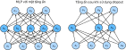

<!-- ===================== Bắt đầu dịch Phần 1 ===================== -->
<!-- ========================================= REVISE PHẦN 1 - BẮT ĐẦU =================================== -->

<!--
# Dropout
-->

# Dropout
:label:`sec_dropout`

<!--
Just now, in :numref:`sec_weight_decay`, we introduced the classical approach to regularizing statistical models by penalizing the $\ell_2$ norm of the weights.
In probabilistic terms, we could justify this technique by arguing that we have assumed a prior belief that weights take values from a Gaussian distribution with mean $0$.
More intuitively, we might argue that we encouraged the model to spread out its weights among many features and rather than depending too much on a small number of potentially spurious associations.
-->

Vừa xong ở :numref:`sec_weight_decay`, chúng tôi đã giới thiệu cách tiếp cận điển hình để điều chuẩn các mô hình thống kê bằng cách phạt giá trị chuẩn $\ell_2$ của các trọng số. 
Theo ngôn ngữ xác suất, ta có thể giải thích kĩ thuật này bằng cách nói ta đã có một niềm tin từ trước rằng các trọng số được lấy ngẫu nhiên từ một phân phối Gauss với trung bình bằng $0$.
Hiểu một cách trực quan, ta có thể nói rằng mô hình được khuyến khích trải rộng giá trị các trọng số ra trên nhiều đặc trưng thay vì quá phụ thuộc vào một vài những liên kết có khả năng không chính xác. 

<!--
## Overfitting Revisited
-->

## Bàn lại về Quá khớp

<!--
Faced with more features than examples, linear models tend to overfit.
But given more examples than features, we can generally count on linear models not to overfit.
Unfortunately, the reliability with which linear models generalize comes at a cost:
Naively applied, linear models do not take into account interactions among features.
For every feature, a linear model must assign either a positive or a negative weight, ignoring context.
-->

Khi có nhiều đặc trưng hơn số mẫu, các mô hình tuyến tính sẽ có xu hướng quá khớp.
Tuy nhiên nếu có nhiều mẫu hơn số đặc trưng, nhìn chung ta có thể tin cậy mô hình tuyến tính sẽ không quá khớp.
Thật không may, mô hình tuyến tính dựa trên tính ổn định này để khái quát hoá lại kèm theo một cái giá phải trả:
Mô hình tuyến tính không màng tới sự tương tác giữa các đặc trưng, nếu chỉ được áp dụng một cách đơn giản.
Mỗi đặc trưng sẽ được gán một giá trị trọng số hoặc là âm, hoặc là dương mà không màng tới ngữ cảnh.

<!--
In traditional texts, this fundamental tension between generalizability and flexibility is described as the *bias-variance tradeoff*.
Linear models have high bias (they can only represent a small class of functions), but low variance (they give similar results across different random samples of the data).
-->

Trong các tài liệu truyền thống, vấn đề cốt lõi giữa khả năng khái quát và tính linh hoạt này được gọi là *đánh đổi độ chệch - phương sai* (*bias-variance tradeoff*).
Mô hình tuyến tính có độ chệch cao (vì nó chỉ có thể biểu diễn một nhóm nhỏ các hàm số) nhưng lại có phương sai thấp (vì nó cho kết quả khá tương đồng trên nhiều tập dữ liệu được lấy mẫu ngẫu nhiên).

<!--
Deep neural networks inhabit the opposite end of the bias-variance spectrum.
Unlike linear models, neural networks, are not confined to looking at each feature individually.
They can learn interactions among groups of features.
For example, they might infer that “Nigeria” and “Western Union” appearing together in an email indicates spam but that separately they do not.
-->

Mạng nơ-ron sâu lại nằm ở thái cực trái ngược trên phổ độ chệch - phương sai.
Khác với mô hình tuyến tính, các mạng nơ-ron không bị giới hạn ở việc chỉ được xét từng đặc trưng một cách riêng biệt.
Chúng có thể học được sự tương tác giữa các nhóm đặc trưng.
Chẳng hạn, chúng có thể suy ra được rằng nếu từ "Nigeria" và "Western Union" xuất hiện cùng nhau trong một email thì đó là thư rác, nhưng nếu hai từ đó xuất hiện riêng biệt thì lại không phải.

<!--
Even when we have far more examples than features, deep neural networks are capable of overfitting.
In 2017, a group of researchers demonstrated the extreme flexibility of neural networks by training deep nets on randomly-labeled images.
Despite the absence of any true pattern linking the inputs to the outputs, they found that the neural network optimized by SGD could label every image in the training set perfectly.
-->

Ngay cả khi số mẫu nhiều hơn hẳn so với số đặc trưng, mạng nơ-ron sâu vẫn có thể quá khớp.
Năm 2017, một nhóm các nhà nghiên cứu đã minh họa khả năng linh hoạt tột cùng của mạng nơ-ron bằng cách huấn luyện mạng nơ-ron sâu trên tập ảnh được gán nhãn ngẫu nhiên.
Dù không hề có bất cứ một khuôn mẫu nào liên kết đầu vào và đầu ra, họ phát hiện rằng mạng nơ-ron được tối ưu bằng SGD vẫn có thể khớp tất cả nhãn trên tập huấn luyện một cách hoàn hảo.

<!--
Consider what this means.
If the labels are assigned uniformly at random and there are 10 classes, then no classifier can do better than 10% accuracy on holdout data.
The generalization gap here is a whopping 90%.
If our models are so expressive that they can overfit this badly, then when should we expect them not to overfit?
The mathematical foundations for the puzzling generalization properties of deep networks remain open research questions, and we encourage the theoretically-oriented reader to dig deeper into the topic.
For now, we turn to the more terrestrial investigation of practical tools that tend (empirically) to improve the generalization of deep nets.
-->

Hãy cùng xem xét ý nghĩa của điều này.
Nếu nhãn được gán ngẫu nhiên từ một phân phối đều với 10 lớp, sẽ không có bộ phân loại nào có thể có độ chính xác cao hơn 10% trên tập dữ liệu kiểm tra.
Khoảng cách khái quát là tận 90%.
Nếu mô hình của chúng ta có đủ năng lực để quá khớp tới như vậy, phải như thế nào chúng ta mới có thể trông đợi rằng mô hình sẽ không quá khớp?
Nền tảng toán học đằng sau tính chất khái quát hoá hóc búa của mạng nơ-ron sâu vẫn còn là một câu hỏi mở và chúng tôi khuyến khích bạn đọc chú trọng lý thuyết đào sâu hơn vào chủ đề này.
Còn bây giờ, hãy quay về bề mặt của vấn đề và chuyển sang tìm hiểu các công cụ dựa trên thực nghiệm để cải thiện khả năng khái quát của các mạng nơ-ron sâu. 

<!-- ===================== Kết thúc dịch Phần 1 ===================== -->

<!-- ===================== Bắt đầu dịch Phần 2 ===================== -->

<!-- ========================================= REVISE PHẦN 1 - KẾT THÚC ===================================-->

<!-- ========================================= REVISE PHẦN 2 - BẮT ĐẦU ===================================-->

<!--
## Robustness through Perturbations
-->

## Khả năng Kháng Nhiễu

<!--
Let's think briefly about what we expect from a good predictive model.
We want it to peform well on unseen data.
Classical generalization theory suggests that to close the gap between train and test performance, we should aim for a *simple* model.
Simplicity can come in the form of a small number of dimensions, as we explored when discussing linear models monomial basis functions :numref:`sec_model_selection`.
As we saw when discussing weight decay ($\ell_2$ regularization) :numref:`sec_weight_decay`, the (inverse) norm of the parameters represents another useful measure of simplicity.
Another useful notion of simplicity is smoothness, i.e., that the function should not be sensitive
to small changed to its inputs.
For instance, when we classify images, we would expect that adding some random noise to the pixels should be mostly harmless.
-->

Hãy cùng nghĩ một chút về thứ mà ta mong đợi từ một mô hình dự đoán tốt.
Ta muốn mô hình hoạt động tốt khi gặp dữ liệu mà nó chưa từng thấy.
Lý thuyết khái quát cổ điển cho rằng: để thu hẹp khoảng cách giữa chất lượng khi huấn luyện và chất lượng khi kiểm tra, ta nên hướng tới một mô hình *đơn giản*.
Sự đơn giản này có thể nằm ở việc đặc trưng có số chiều thấp, điều mà chúng ta đã nghiên cứu khi thảo luận về hàm cơ sở đơn thức trong mô hình tuyến tính ở :numref:`sec_model_selection`. 
Như ta đã thấy khi bàn về suy giảm trọng số (điều chuẩn $\ell_2$) ở :numref:`sec_weight_decay`, chuẩn (nghịch đảo) của các tham số là một phép đo khác cho sự đơn giản.
Một khái niệm hữu ích khác để biểu diễn sự đơn giản là độ mượt, tức hàm số không nên quá nhạy với những thay đổi nhỏ ở đầu vào.
Ví dụ, khi phân loại ảnh, ta mong muốn rằng việc thêm một chút nhiễu ngẫu nhiên vào các điểm ảnh sẽ không ảnh hưởng nhiều tới kết quả dự đoán.

<!--
In 1995, Christopher Bishop formalized this idea when he proved that training with input noise is equivalent to Tikhonov regularization :cite:`Bishop.1995`.
This work drew a clear mathematical connection between the requirement that a function be smooth (and thus simple), and the requirement that it be resilient to perturbations in the input.
-->

Vào năm 1995, Christopher Bishop đã chính quy hóa ý tưởng này khi ông chứng minh rằng việc huấn luyện với đầu vào chứa nhiễu tương đương với điều chuẩn Tikhonov :cite:`Bishop.1995`.
Công trình này đã chỉ rõ mối liên kết toán học giữa điều kiện hàm là mượt (nên nó cũng đơn giản) với khả năng kháng nhiễu đầu vào của hàm số.

<!--
Then, in 2014, Srivastava et al. :cite:`Srivastava.Hinton.Krizhevsky.ea.2014` developed a clever idea for how to apply Bishop's idea to the *internal* layers of the network, too.
Namely, they proposed to inject noise into each layer of the network before calculating the subsequent layer during training.
They realized that when training a deep network with many layers, injecting noise enforces smoothness just on the input-output mapping.
-->

Và rồi vào năm 2014, Srivastava et al. :cite:`Srivastava.Hinton.Krizhevsky.ea.2014` đã phát triển một ý tưởng thông minh để áp dụng ý tưởng trên của Bishop cho các tầng *nội bộ* của mạng nơ-ron.
Cụ thể, họ đề xuất việc thêm nhiễu vào mỗi tầng của mạng trước khi tính toán các tầng kế tiếp trong quá trình huấn luyện.
Họ nhận ra rằng khi huấn luyện mạng đa tầng, thêm nhiễu vào dữ liệu chỉ ép buộc điều kiện mượt lên phép ánh xạ giữa đầu vào và đầu ra.

<!--
Their idea, called *dropout*, involves injecting noise while computing each internal layer during forward propagation, and it has become a standard technique for training neural networks.
The method is called *dropout* because we literally *drop out* some neurons during training.
Throughout training, on each iteration, standard dropout consists of zeroing out some fraction (typically 50%) of the nodes in each layer before calculating the subsequent layer.
-->

Ý tưởng này, có tên gọi là *dropout*, hoạt động bằng cách thêm nhiễu khi tính toán các tầng nội bộ trong lượt truyền xuôi và nó đã trở thành một kỹ thuật tiêu chuẩn để huấn luyện các mạng nơ-ron.
Phương pháp này có tên gọi như vậy là bởi ta *loại bỏ* (*drop out*) một số nơ-ron trong quá trình huấn luyện.
Tại mỗi vòng lặp huấn luyện, phương pháp dropout tiêu chuẩn sẽ đặt giá trị của một lượng nhất định (thường là 50%) các nút trong mỗi tầng về không, trước khi tính toán các tầng kế tiếp.

<!--
To be clear, we are imposing our own narrative with the link to Bishop.
The original paper on dropout offers intuition through a surprising analogy to sexual reproduction.
The authors argue that neural network overfitting is characterized by a state in which each layer relies on a specifc pattern of activations in the previous layer, calling this condition *co-adaptation*.
Dropout, they claim, breaks up co-adaptation just as sexual reproduction is argued to break up co-adapted genes.
-->

Để nói cho rõ, mối liên kết đến Bishop là của chúng tôi tự đặt ra.
Đáng ngạc nhiên, bài báo gốc về dropout xây dựng cách hiểu trực giác bằng việc so sánh nó với quá trình sinh sản hữu tính.
Các tác giả cho rằng hiện tượng quá khớp mạng nơ-ron là biểu hiện của việc mỗi tầng đều dựa vào một khuôn mẫu nhất định của các giá trị kích hoạt ở tầng trước đó, họ gọi trạng thái này là *đồng thích nghi*.
Họ khẳng định rằng dropout phá bỏ sự đồng thích nghi này, tương tự như luận điểm sinh sản hữu tính phá bỏ các gen đã đồng thích nghi.

<!--
The key challenge then is *how* to inject this noise.
One idea is to inject the noise in an *unbiased* manner so that the expected value of each layer---while fixing the others---equals to the value it would have taken absent noise.
-->

Thách thức chính bây giờ là *làm thế nào* để thêm nhiễu.
Một cách để làm điều này là thêm nhiễu một cách *không thiên lệch* sao cho giá trị kỳ vọng của mỗi tầng bằng giá trị kỳ vọng của chính tầng đó trước khi được thêm nhiễu, giả sử rằng các tầng khác được giữ nguyên.

<!-- ===================== Kết thúc dịch Phần 2 ===================== -->

<!-- ===================== Bắt đầu dịch Phần 3 ===================== -->

<!--
In Bishop's work, he added Gaussian noise to the inputs to a linear model:
At each training iteration, he added noise sampled from a distribution with mean zero $\epsilon \sim \mathcal{N}(0,\sigma^2)$ to the input $\mathbf{x}$, 
yielding a perturbed point $\mathbf{x}' = \mathbf{x} + \epsilon$.
In expectation, $E[\mathbf{x}'] = \mathbf{x}$.
-->

Trong nghiên cứu của Bishop, ông thêm nhiễu Gauss cho đầu vào của một mô hình tuyến tính như sau:
Tại mỗi bước huấn luyện, ông đã thêm nhiễu lấy từ một phân phối có trung bình bằng không $\epsilon \sim \mathcal{N}(0,\sigma^2)$ cho đầu vào $\mathbf{x}$, thu được một điểm bị nhiễu $\mathbf{x}' = \mathbf{x} + \epsilon$ với kỳ vọng $E[\mathbf{x}'] = \mathbf{x}$.

<!--
In standard dropout regularization, one debiases each layer by normalizing by the fraction of nodes that were retained (not dropped out).
In other words, dropout with *dropout probability* $p$ is applied as follows:
-->

Với điều chuẩn dropout tiêu chuẩn, ta khử độ chệch tại mỗi tầng bằng cách chuẩn hóa theo tỉ lệ các nút được giữ lại (chứ không phải các nút bị loại bỏ).
Nói cách khác, dropout với *xác suất dropout* $p$ được áp dụng như sau:

$$
\begin{aligned}
h' =
\begin{cases}
    0 & \text{ với~xác~suất } p \\
    \frac{h}{1-p} & \text{ khác }
\end{cases}
\end{aligned}
$$

<!--
By design, the expectation remains unchanged, i.e., $E[h'] = h$.
Intermediate activations $h$ are replaced by a random variable $h'$ with matching expectation.
-->

Như ta mong muốn, kỳ vọng không bị thay đổi, hay nói cách khác $E[h'] = h$.
Đầu ra của các hàm kích hoạt trung gian $h$ được thay thế bởi một biến ngẫu nhiên $h'$ với kỳ vọng tương ứng. 

<!-- ========================================= REVISE PHẦN 2 - KẾT THÚC ===================================-->

<!-- ========================================= REVISE PHẦN 3 - BẮT ĐẦU ===================================-->

<!--
## Dropout in Practice
-->

## Dropout trong Thực tiễn

<!--
Recall the multilayer perceptron (:numref:`sec_mlp`) with a hidden layer and 5 hidden units.
Its architecture is given by
-->

Nhắc lại về mạng perceptron đa tầng (:numref:`sec_mlp`) với duy nhất một tầng ẩn có 5 nút ẩn.
Kiến trúc mạng được biểu diễn như sau

$$
\begin{aligned}
    \mathbf{h} & = \sigma(\mathbf{W}_1 \mathbf{x} + \mathbf{b}_1), \\
    \mathbf{o} & = \mathbf{W}_2 \mathbf{h} + \mathbf{b}_2, \\
    \hat{\mathbf{y}} & = \mathrm{softmax}(\mathbf{o}).
\end{aligned}
$$

<!--
When we apply dropout to a hidden layer, zeroing out each hidden unit with probability $p$, the result can be viewed as a network containing only a subset of the original neurons.
In :numref:`fig_dropout2`, $h_2$ and $h_5$ are removed.
Consequently, the calculation of $y$ no longer depends on $h_2$ and $h_5$ and their respective gradient also vanishes when performing backprop.
In this way, the calculation of the output layer cannot be overly dependent on any one element of $h_1, \ldots, h_5$.
-->

Khi chúng ta áp dụng dropout cho một tầng ẩn, tức gán mỗi nút ẩn bằng không với xác suất là $p$, kết quả có thể được xem như là một mạng chỉ chứa một tập con của các nơ-ron ban đầu.
Trong :numref:`fig_dropout2`, $h_2$ và $h_5$ bị loại bỏ.
Hệ quả là, việc tính toán $y$ không còn phụ thuộc vào $h_2$ và $h_5$ nữa và gradient tương ứng của chúng cũng biến mất khi thực hiện lan truyền ngược.
Theo cách này, việc tính toán tầng đầu ra không thể quá phụ thuộc vào bất kỳ một thành phần nào trong $h_1, \ldots, h_5$.

<!--

-->


:label:`fig_dropout2`

<!--
Typically, ***we disable dropout at test time***.
Given a trained model and a new example, we do not drop out any nodes (and thus do not need to normalize).
However, there are some exceptions: some researchers use dropout at test time as a heuristic for estimating the *uncertainty* of neural network predictions: 
if the predictions agree across many different dropout masks, then we might say that the network is more confident.
For now we will put off uncertainty estimation for subsequent chapters and volumes.
-->

Thông thường, **chúng ta sẽ vô hiệu hóa dropout tại thời điểm kiểm tra**.
Với một mô hình đã huấn luyện và một mẫu kiểm tra, ta sẽ không thực hiện loại bỏ bất kỳ nút nào (do đó cũng không cần chuẩn hóa).
Tuy nhiên cũng có một vài ngoại lệ. Một vài nhà nghiên cứu sử dụng dropout tại thời điểm kiểm tra như một thủ thuật đề ước lượng *độ bất định* trong dự đoán của mạng nơ-ron: nếu các dự đoán giống nhau với nhiều mặt nạ dropout khác nhau, ta có thể nói rằng mạng đó đáng tin cậy hơn.
Hiện tại, ta sẽ để dành phần ước lượng độ bất định này cho các chương sau.

<!-- ===================== Kết thúc dịch Phần 3 ===================== -->

<!-- ===================== Bắt đầu dịch Phần 4 ===================== -->

<!--
## Implementation from Scratch
-->

## Lập trình từ đầu

<!--
To implement the dropout function for a single layer, we must draw as many samples from a Bernoulli (binary) random variable as our layer has dimensions, 
where the random variable takes value $1$ (keep) with probability $1-p$ and $0$ (drop) with probability $p$.
One easy way to implement this is to first draw samples from the uniform distribution $U[0, 1]$. 
Then we can keep those nodes for which the corresponding sample is greater than $p$, dropping the rest.
-->

Để lập trình hàm dropout cho một tầng đơn, ta sẽ lấy mẫu từ một biến ngẫu nhiên Bernoulli (nhị phân) với số lượng bằng với số chiều của tầng, trong đó biến ngẫu nhiên đạt giá trị $1$ (giữ) với xác suất bằng $1-p$ và giá trị $0$ (bỏ) với xác suất bằng $p$.
Một cách đơn giản để thực hiện việc này là lấy mẫu từ một phân phối đều $U[0, 1]$, sau đó ta có thể giữ các nút có mẫu tương ứng lớn hơn $p$ và bỏ đi những nút còn lại.

<!--
In the following code, we implement a `dropout_layer` function that drops out the elements in the `ndarray` input `X` with probability `dropout`, 
rescaling the remainder as described above (dividing the survivors by `1.0-dropout`).
-->

Trong đoạn mã nguồn bên dưới, ta lập trình hàm `dropout_layer` có chức năng bỏ đi các phần tử trong mảng `ndarray` đầu vào `X` với xác suất `dropout`, rồi chia các phần tử còn lại cho `1.0-dropout` như đã mô tả bên trên. 

```{.python .input  n=1}
from d2l import mxnet as d2l
from mxnet import autograd, gluon, init, np, npx
from mxnet.gluon import nn
npx.set_np()

def dropout_layer(X, dropout):
    assert 0 <= dropout <= 1
    # In this case, all elements are dropped out
    if dropout == 1:
        return np.zeros_like(X)
    # In this case, all elements are kept
    if dropout == 0:
        return X
    mask = np.random.uniform(0, 1, X.shape) > dropout
    return mask.astype(np.float32) * X / (1.0-dropout)
```

<!--
We can test out the `dropout_layer` function on a few examples.
In the following lines of code, we pass our input `X` through the dropout operation, with probabilities 0, 0.5, and 1, respectively.
-->

Ta có thể thử nghiệm hàm `dropout_layer` với một vài mẫu.
Trong đoạn mã nguồn dưới đây, đầu vào `X` được truyền qua bước dropout với xác suất lần lượt là 0, 0.5 và 1.

```{.python .input  n=2}
X = np.arange(16).reshape(2, 8)
print(dropout_layer(X, 0))
print(dropout_layer(X, 0.5))
print(dropout_layer(X, 1))
```

<!-- ========================================= REVISE PHẦN 3 - KẾT THÚC ===================================-->

<!-- ========================================= REVISE PHẦN 4 - BẮT ĐẦU ===================================-->

<!--
### Defining Model Parameters
-->

### Định nghĩa các Tham số Mô hình

<!--
Again, we work with the Fashion-MNIST dataset introduced in :numref:`sec_softmax_scratch`.
We define a multilayer perceptron with two hidden layers containing 256 outputs each.
-->

Một lần nữa, ta sẽ làm việc với bộ dữ liệu Fashion-MNIST được giới thiệu ở :numref:`sec_softmax_scratch`. 
Ta sẽ tạo một perception đa tầng với hai tầng ẩn, mỗi tầng gồm 256 đầu ra.

```{.python .input  n=3}
num_inputs, num_outputs, num_hiddens1, num_hiddens2 = 784, 10, 256, 256

W1 = np.random.normal(scale=0.01, size=(num_inputs, num_hiddens1))
b1 = np.zeros(num_hiddens1)
W2 = np.random.normal(scale=0.01, size=(num_hiddens1, num_hiddens2))
b2 = np.zeros(num_hiddens2)
W3 = np.random.normal(scale=0.01, size=(num_hiddens2, num_outputs))
b3 = np.zeros(num_outputs)

params = [W1, b1, W2, b2, W3, b3]
for param in params:
    param.attach_grad()
```

<!-- ===================== Kết thúc dịch Phần 4 ===================== -->

<!-- ===================== Bắt đầu dịch Phần 5 ===================== -->

<!--
### Defining the Model
-->

### Định nghĩa Mô hình

<!--
The model below applies dropout to the output of each hidden layer (following the activation function).
We can set dropout probabilities for each layer separately. A common trend is to set a lower dropout probability closer to the input layer.
Below we set it to 0.2 and 0.5 for the first and second hidden layer respectively.
By using the `is_training` function described in :numref:`sec_autograd`, we can ensure that dropout is only active during training.
-->

Mô hình dưới đây áp dụng dropout cho đầu ra của mỗi tầng ẩn (theo sau hàm kích hoạt).
Ta có thể đặt các giá trị xác suất dropout riêng biệt cho mỗi tầng. Một xu hướng chung là đặt xác suất dropout thấp hơn cho tầng ở gần với tầng đầu vào hơn.
Bên dưới ta đặt xác suất dropout bằng 0.2 và 0.5 tương ứng cho tầng ẩn thứ nhất và thứ hai.
Bằng cách sử dụng hàm `is_training` mô tả ở :numref:`sec_autograd`, ta có thể chắc chắn rằng dropout chỉ được kích hoạt trong quá trình huấn luyện.

```{.python .input  n=4}
dropout1, dropout2 = 0.2, 0.5

def net(X):
    X = X.reshape(-1, num_inputs)
    H1 = npx.relu(np.dot(X, W1) + b1)
    # Use dropout only when training the model
    if autograd.is_training():
        # Add a dropout layer after the first fully connected layer
        H1 = dropout_layer(H1, dropout1)
    H2 = npx.relu(np.dot(H1, W2) + b2)
    if autograd.is_training():
        # Add a dropout layer after the second fully connected layer
        H2 = dropout_layer(H2, dropout2)
    return np.dot(H2, W3) + b3
```

<!--
### Training and Testing
-->

### Huấn luyện và Kiểm tra

<!--
This is similar to the training and testing of multilayer perceptrons described previously.
-->

Việc này tương tự với quá trình huấn luyện và kiểm tra của các perceptron đa tầng trước đây.

```{.python .input  n=5}
num_epochs, lr, batch_size = 10, 0.5, 256
loss = gluon.loss.SoftmaxCrossEntropyLoss()
train_iter, test_iter = d2l.load_data_fashion_mnist(batch_size)
d2l.train_ch3(net, train_iter, test_iter, loss, num_epochs,
              lambda batch_size: d2l.sgd(params, lr, batch_size))
```

<!-- ========================================= REVISE PHẦN 4 - KẾT THÚC ===================================-->

<!-- ========================================= REVISE PHẦN 5 - BẮT ĐẦU ===================================-->

<!--
## Concise Implementation
-->

## Cách lập trình súc tích

<!--
Using Gluon, all we need to do is add a `Dropout` layer (also in the `nn` package) after each fully-connected layer, passing in the dropout probability as the only argument to its constructor.
During training, the `Dropout` layer will randomly drop out outputs of the previous layer (or equivalently, the inputs to the subsequent layer) according to the specified dropout probability.
When MXNet is not in training mode, the `Dropout` layer simply passes the data through during testing.
-->

Bằng việc sử dụng Gluon, tất cả những gì ta cần làm là thêm một tầng `Dropout` (cũng nằm trong gói `nn`) vào sau mỗi tầng kết nối đầy đủ và truyền vào xác suất dropout, đối số duy nhất của hàm khởi tạo.
Trong quá trình huấn luyện, hàm `Dropout` sẽ bỏ ngẫu nhiên một số đầu ra của tầng trước (hay tương đương với đầu vào của tầng tiếp theo) dựa trên xác suất dropout được định nghĩa trước đó.

```{.python .input  n=6}
net = nn.Sequential()
net.add(nn.Dense(256, activation="relu"),
        # Add a dropout layer after the first fully connected layer
        nn.Dropout(dropout1),
        nn.Dense(256, activation="relu"),
        # Add a dropout layer after the second fully connected layer
        nn.Dropout(dropout2),
        nn.Dense(10))
net.initialize(init.Normal(sigma=0.01))
```

<!--
Next, we train and test the model.
-->

Tiếp theo, ta huấn luyện và kiểm tra mô hình.

```{.python .input  n=7}
trainer = gluon.Trainer(net.collect_params(), 'sgd', {'learning_rate': lr})
d2l.train_ch3(net, train_iter, test_iter, loss, num_epochs, trainer)
```

<!-- ===================== Kết thúc dịch Phần 5 ===================== -->

<!-- ===================== Bắt đầu dịch Phần 6 ===================== -->

<!--
## Summary
-->

## Tóm tắt

<!--
* Beyond controlling the number of dimensions and the size of the weight vector, dropout is yet another tool to avoid overfitting. Often all three are used jointly.
* Dropout replaces an activation $h$ with a random variable $h'$ with expected value $h$ and with variance given by the dropout probability $p$.
* Dropout is only used during training.
-->

* Ngoài phương pháp kiểm soát số chiều và độ lớn của vector trọng số, dropout cũng là một công cụ khác để tránh tình trạng quá khớp. Thông thường thì cả ba cách được sử dụng cùng nhau.
* Dropout thay thế giá trị kích hoạt $h$ bằng một biến ngẫu nhiên $h'$ với giá trị kỳ vọng $h$ và phương sai bằng xác suất dropout $p$. 
* Dropout chỉ được sử dụng trong quá trình huấn luyện.


<!--
## Exercises
-->

## Bài tập

<!--
1. What happens if you change the dropout probabilities for layers 1 and 2? In particular, what happens if you switch the ones for both layers? 
Design an experiment to answer these questions, describe your results quantitatively, and summarize the qualitative takeaways.
2. Increase the number of epochs and compare the results obtained when using dropout with those when not using it.
3. What is the variance of the activations in each hidden layer when dropout is and is not applied? Draw a plot to show how this quantity evolves over time for both models.
4. Why is dropout not typically used at test time?
5. Using the model in this section as an example, compare the effects of using dropout and weight decay. 
What happens when dropout and weight decay are used at the same time? Are the results additive, are their diminish returns or (worse), do they cancel each other out?
6. What happens if we apply dropout to the individual weights of the weight matrix rather than the activations?
7. Invent another technique for injecting random noise at each layer that is different from the standard dropout technique. 
Can you develop a method that outperforms dropout on the FashionMNIST dataset (for a fixed architecture)?
-->

1. Điều gì xảy ra nếu bạn thay đổi xác suất dropout của tầng 1 và 2? Cụ thể, điều gì xảy ra nếu bạn tráo đổi xác suất của hai tầng này? 
Thiết kế một thí nghiệm để trả lời những câu hỏi này, mô tả các kết quả một cách định lượng và tóm tắt các bài học rút ra một cách định tính.
2. Tăng số lượng epoch và so sánh các kết quả thu được khi sử dụng và khi không sử dụng dropout.
3. Tính toán phương sai của các giá trị kích hoạt ở mỗi tầng ẩn khi sử dụng và khi không sử dụng dropout. Vẽ biểu đồ thể hiện sự thay đổi của giá trị phương sai này theo thời gian cho cả hai mô hình.
4. Tại sao dropout thường không được sử dụng tại bước kiểm tra?
5. Sử dụng mô hình trong phần này làm ví dụ, so sánh hiệu quả của việc sử dụng dropout và suy giảm trọng số.
Điều gì xảy ra khi dropout và suy giảm trọng số được sử dụng cùng một lúc? Hai phương pháp này bổ trợ cho nhau, làm giảm hiệu quả của nhau hay (tệ hơn) loại trừ lẫn nhau?
6. Điều gì xảy ra nếu chúng ta áp dụng dropout cho các trọng số riêng lẻ của ma trận trọng số thay vì các giá trị kích hoạt?
7. Hãy phát minh một kỹ thuật khác với kỹ thuật dropout tiêu chuẩn để thêm nhiễu ngẫu nhiên ở mỗi tầng.
Bạn có thể phát triển một phương pháp cho kết quả tốt hơn dropout trên bộ dữ liệu FashionMNIST không (với cùng một kiến trúc)?

<!-- ===================== Kết thúc dịch Phần 6 ===================== -->

<!-- ========================================= REVISE PHẦN 5 - KẾT THÚC ===================================-->

<!--
## [Discussions](https://discuss.mxnet.io/t/2343)
-->

## Thảo luận
* [Tiếng Anh](https://discuss.mxnet.io/t/2343)
* [Tiếng Việt](https://forum.machinelearningcoban.com/c/d2l)

## Những người thực hiện
Bản dịch trong trang này được thực hiện bởi:
<!--
Tác giả của mỗi Pull Request điền tên mình và tên những người review mà bạn thấy
hữu ích vào từng phần tương ứng. Mỗi dòng một tên, bắt đầu bằng dấu `*`.

Lưu ý:
* Nếu reviewer không cung cấp tên, bạn có thể dùng tên tài khoản GitHub của họ
với dấu `@` ở đầu. Ví dụ: @aivivn.

* Tên đầy đủ của các reviewer có thể được tìm thấy tại https://github.com/aivivn/d2l-vn/blob/master/docs/contributors_info.md.
-->

* Đoàn Võ Duy Thanh
* Lê Khắc Hồng Phúc
* Phạm Minh Đức
* Nguyễn Văn Tâm
* Phạm Hồng Vinh
* Nguyễn Duy Du
* Vũ Hữu Tiệp
