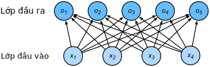
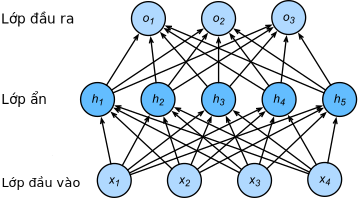

<!-- ===================== Bắt đầu dịch Phần 1 ===================== -->
<!-- ========================================= REVISE PHẦN 1 - BẮT ĐẦU =================================== -->

<!--
# Multilayer Perceptrons
-->

# Perceptron đa tầng
:label:`sec_mlp`

<!--
In the previous chapter, we introduced softmax regression (:numref:`sec_softmax`), 
implementing the algorithm from scratch (:numref:`sec_softmax_scratch`) and in gluon (:numref:`sec_softmax_gluon`) 
and training classifiers to recognize 10 categories of clothing from low-resolution images.
Along the way, we learned how to wrangle data, coerce our outputs into a valid probability distribution (via `softmax`), 
apply an appropriate loss function, and to minimize it with respect to our model's parameters.
Now that we have mastered these mechanics in the context of simple linear models, 
we can launch our exploration of deep neural networks, the comparatively rich class of models with which this book is primarily concerned.
-->

Trong chương trước, chúng tôi đã giới thiệu hồi quy softmax (:numref:`sec_softmax`), cách lập trình giải thuật này từ đầu (:numref:`sec_softmax_scratch`), sử dụng nó trong gluon (:numref:`sec_softmax_gluon`), và huấn luyện các bộ phân loại để nhận diện 10 lớp quần áo khác nhau từ các bức ảnh có độ phân giải thấp. 
Cùng với đó, chúng ta đã học cách xử lý dữ liệu, ép buộc các giá trị đầu ra tạo thành một phân phối xác suất hợp lệ (thông qua hàm `softmax`), áp dụng một hàm mất mát phù hợp và cực tiểu hoá nó theo các tham số mô hình. 
Bây giờ, sau khi đã thành thạo các cơ chế nêu trên trong ngữ cảnh của những mô hình tuyến tính đơn giản, chúng ta có thể bắt đầu khám phá trọng tâm của cuốn sách này: lớp mô hình phong phú của các mạng nơ-ron sâu.

<!--
## Hidden Layers
-->

## Các tầng ẩn

<!--
To begin, recall the model architecture corresponding to our softmax regression example, illustrated in  :numref:`fig_singlelayer` below.
This model mapped our inputs directly to our outputs via a single linear transformation:
-->

Để bắt đầu, hãy nhớ lại kiến trúc mô hình trong ví dụ của hồi quy softmax, được minh hoạ trong :numref:`fig_singlelayer` bên dưới.
Mô hình này ánh xạ trực tiếp các đầu vào của chúng ta sang các giá trị đầu ra thông qua một phép biến đổi tuyến tính duy nhất:

$$
\hat{\mathbf{o}} = \mathrm{softmax}(\mathbf{W} \mathbf{x} + \mathbf{b}).
$$

<!--

-->


:label:`fig_singlelayer`

<!--
If our labels truly were related to our input data by a linear function, then this approach would be sufficient.
But linearity is a *strong assumption*.
-->

Nếu các nhãn của chúng ta thật sự có mối quan hệ tuyến tính với dữ liệu đầu vào, thì cách tiếp cận này là đủ. 
Nhưng tính tuyến tính là một *giả định chặt*. 

<!--
For example, linearity implies the *weaker* assumption of *monotonicity*: 
that any increase in our feature must either always cause an increase in our model's output (if the corresponding weight is positive), 
or always always cause a decrease in our model's output (if the corresponding weight is negative).
Sometimes that makes sense.
For example, if we were trying to predict whether an individual will repay a loan, 
we might reasonably imagine that holding all else equal, an applicant with a higher income would always be more likely to repay than one with a lower income.
While monotonic, this relationship likely isn't linearly associated with the probability of repayment.
A increase in income from $0 to $50k likely corresponds to a bigger increase in likelihood of repayment than an increase from $1M to $1.05M.
One way to handle this might be to pre-process our data such that linearity becomes more plausible, say, by using the logarithm of income as our feature.
-->

Ví dụ, tính tuyến tính ngụ ý về giả định *yếu hơn* của *tính đơn điệu*: tức giá trị đặc trưng tăng luôn dẫn đến việc đầu ra mô hình tăng (nếu trọng số tương ứng dương), hoặc đầu ra mô hình giảm (nếu trọng số tương ứng âm).
Điều này đôi khi cũng hợp lý.
Ví dụ, nếu chúng ta đang dự đoán liệu một người có trả được khoản vay hay không, chúng ta có thể suy diễn một cách hợp lý như sau: bỏ qua mọi yếu tố khác, ứng viên nào có thu nhập cao hơn sẽ có khả năng trả được nợ cao hơn so với những ứng viên khác có thu nhập thấp hơn. 
Dù có tính đơn điệu, mối quan hệ này khả năng cao là không liên quan tuyến tính tới xác suất trả nợ. 
Khả năng trả được nợ thường sẽ có mức tăng lớn hơn khi thu nhập tăng từ $0 lên $50k so với khi tăng từ $1M lên $1.05M.
Một cách để giải quyết điều này là tiền xử lý dữ liệu để tính tuyến tính trở nên hợp lý hơn, ví dụ như sử dụng logarit của thu nhập để làm đặc trưng. 

<!-- ===================== Kết thúc dịch Phần 1 ===================== -->

<!-- ===================== Bắt đầu dịch Phần 2 ===================== -->

<!--
Note that we can easily come up with examples that violate *monotonicity*.
Say for example that we want to predict probability of death based on body temperature.
For individuals with a body temperature above 37°C (98.6°F), higher termperatures indicate greater risk.
However, for individuals with body termperatures below 37° C, higher temperatures indicate *lower* risk!
In this case too, we might resolve the problem with some clever preprocessing.
Namely, we might use the *distance* from 37°C as our feature.
-->

Lưu ý rằng chúng ta có thể dễ dàng đưa ra các ví dụ vi phạm *tính đơn điệu*.
Ví dụ như, ta muốn dự đoán xác suất tử vong của một người dựa trên thân nhiệt.
Đối với người có thân nhiệt trên 37°C (98.6°F), nhiệt độ càng cao gây ra nguy cơ tử vong càng cao.
Tuy nhiên, với những người có thân nhiệt thấp hơn 37°C, khi gặp nhiệt độ cao hơn thì nguy cơ tử vong lại *thấp hơn*!
Trong bài toán này, ta có thể giải quyết nó bằng một vài bước tiền xử lý thật khéo léo.
Cụ thể, ta có thể sử dụng *khoảng cách* từ 37°C tới thân nhiệt làm đặc trưng.


<!--
But what about classifying images of cats and dogs?
Should increasing the intensity of the pixel at location (13, 17) always increase (or always decrease) the likelihood that the image depicts a dog?
Reliance on a linear model corrsponds to the (implicit) assumption that the only requirement for differentiating cats vs. dogs is to assess the brightness of individual pixels.
This approach is doomed to fail in a world where inverting an image preserves the category.
-->

Nhưng còn với bài toán phân loại hình ảnh chó mèo thì sao?
Liệu việc tăng cường độ sáng của điểm ảnh tại vị trí (13, 17) sẽ luôn tăng (hoặc giảm) khả năng đó là hình một con chó?
Sử dụng mô hình tuyến tính trong trường hợp này tương ứng với việc ngầm giả định rằng chỉ cần đánh giá độ sáng của từng pixel để phân biệt giữa mèo và chó .
Cách tiếp cận này chắc chắn sẽ không chính xác khi các hình ảnh bị đảo ngược màu sắc.


<!--
And yet despite the apparent absurdity of linearity here, as compared to our previous examples, it's less obvious that we could address the problem with a simple preprocessing fix.
That is because the significance of any pixel depends in complex ways on its context (the values of the surrounding pixels).
While there might exist a representation of our data that would take into account the relevant interactions among our features (and on top of which a linear model would be suitable), 
we simply do not know how to calculate it by hand.
With deep neural networks, we used observational data to jointly learn both a representation (via hidden layers) and a linear predictor that acts upon that representation.
-->

Tuy nhiên, ta bỏ qua sự phi lý của tuyến tính ở đây, so với các ví dụ trước, rõ ràng là ta không thể giải quyết bài toán này với vài bước tiền xử lý chỉnh sửa đơn giản.
Bởi vì ý nghĩa của các điểm ảnh phụ thuộc một cách phức tạp vào bối cảnh xung quanh nó (các giá trị xung quanh của điểm ảnh).
Có thể vẫn tồn tại một cách biểu diễn dữ liệu nào đó nắm bắt được sự tương tác giữa các đặc trưng liên quan (và quan trọng nhất là phù hợp với mô hình tuyến tính), ta đơn giản là không biết làm thế nào để tính toán nó một cách thủ công.
Với các mạng nơ-ron sâu, ta sử dụng dữ liệu đã quan sát được để đồng thời học cách biểu diễn (thông qua các tầng ẩn) và học một bộ dự đoán tuyến tính hoạt động dựa trên biểu diễn đó.

<!-- ========================================= REVISE PHẦN 1 - KẾT THÚC ===================================-->

<!-- ========================================= REVISE PHẦN 2 - BẮT ĐẦU =================================== -->

<!--
### Incorporating Hidden Layers
-->

### Kết hợp các Tầng ẩn

<!--
We can overcome these limitations of linear models and handle a more general class of functions by incorporating one or more hidden layers.
The easiest way to do this is to stack many fully-connected layers on top of each other.
Each layer feeds into the layer above it, until we generate an output.
We can think of the first $L-1$ layers as our representation and the final layer as our linear predictor.
This architecture is commonly called a *multilayer perceptron*, often abbreviated as *MLP*.
Below, we depict an MLP diagramtically (:numref:`fig_nlp`).
-->

Ta có thể vượt qua những hạn chế của mô hình tuyến tính và làm việc với một lớp hàm tổng quát hơn bằng cách thêm vào một hoặc nhiều tầng ẩn.
Cách dễ nhất để làm điều này là xếp chồng nhiều tầng kết nối đầy đủ lên nhau.
Giá trị đầu ra của mỗi tầng được đưa làm giá trị đầu vào cho tầng bên trên, cho đến khi ta tạo được một đầu ra.
Ta có thể xem $L-1$ tầng đầu tiên như các tầng học biểu diễn dữ liệu và tầng cuối cùng là bộ dự đoán tuyến tính.
Kiến trúc này thường được gọi là *perceptron đa tầng* (*multilayer percention*), hay được viết tắt là *MLP*.
Dưới đây, ta mô tả sơ đồ MLP (:numref:`fig_nlp`).

<!--

-->


:label:`fig_nlp`

<!--
This multilayer perceptron has 4 inputs, 3 outputs, and its hidden layer contains 5 hidden units.
Since the input layer does not involve any calculations, producing outputs with this network requires implementing the computations for each of the 2 layers (hidden and output).
Note that these layers are both fully connected.
Every input influences every neuron in the hidden layer, and each of these in turn influences every neuron in the output layer.
-->

Perceptron đa tầng này có 4 đầu vào, 3 đầu ra và tầng ẩn của nó chứa 5 nút ẩn.
Vì tầng đầu vào không cần bất kỳ tính toán nào, do đó đối với mạng này để tạo đầu ra đòi hỏi phải lập trình các phép tính cho hai tầng còn lại (tầng ẩn và tầng đầu ra).
Lưu ý, tất cả tầng này đều kết nối đầy đủ.
Mỗi đầu vào đều ảnh hưởng đến mọi nơ-ron trong tầng ẩn và mỗi nơ-ron này lại ảnh hưởng đến mọi nơ-ron trong tầng đầu ra.

<!-- ===================== Kết thúc dịch Phần 2 ===================== -->

<!-- ===================== Bắt đầu dịch Phần 3 ===================== -->

<!--
### From Linear to Nonlinear
-->

### Từ Tuyến tính đến Phi tuyến

<!--
Formally, we calculate each layer in this one-hidden-layer MLP as follows:
-->

Về mặt hình thức, chúng ta tính toán mỗi tầng trong MLP một-tầng-ẩn này như sau:


$$
\begin{aligned}
    \mathbf{h} & = \mathbf{W}_1 \mathbf{x} + \mathbf{b}_1, \\
    \mathbf{o} & = \mathbf{W}_2 \mathbf{h} + \mathbf{b}_2, \\
    \hat{\mathbf{y}} & = \mathrm{softmax}(\mathbf{o}).
\end{aligned}
$$

<!--
Note that after adding this layer, our model now requires us to track and update two additional sets of parameters.
So what have we gained in exchange?
You might be surprised to find out that---in the model defined above---*we gain nothing for our troubles!*
The reason is plain.
The hidden units above are given by a linear function of the inputs, and the outputs (pre-softmax) are just a linear function of the hidden units.
A linear function of a linear function is itself a linear function.
Moreover, our linear model was already capable of representing any linear function.
-->

Chú ý rằng sau khi thêm tầng này vào, mô hình lập tức yêu cầu chúng ta phải theo dõi và cập nhật thêm hai tập tham số.
Vậy thì đổi lại ta sẽ nhận được gì?
Bạn có thể bất ngờ khi phát hiện ra rằng---trong mô hình định nghĩa bên trên---*chúng ta chẳng thu được lợi ích gì từ những rắc rối thêm vào!*
Lý do rất đơn giản.
Các nút ẩn bên trên được định nghĩa bởi một hàm tuyến tính của các đầu vào, và các đầu ra (tiền Softmax) chỉ là một hàm tuyến tính của các nút ẩn.
Một hàm tuyến tính của một hàm tuyến tính bản thân nó cũng chính là một hàm tuyến tính.
Hơn nữa, mô hình tuyến tính của chúng ta vốn dĩ đã có khả năng biểu diễn bất kỳ hàm tuyến tính nào rồi.


<!--
We can view the equivalence formally by proving that for any values of the weights, we can just collapse out the hidden layer, yielding an equivalent single-layer model with paramters
-->

Ta có thể thấy sự tương đồng về mặt hình thức bằng cách chứng minh rằng với mọi giá trị của các trọng số, ta đều có thể loại bỏ tầng ẩn và tạo ra một mô hình đơn-tầng với các tham số

$\mathbf{W} = \mathbf{W}_2 \mathbf{W}_1$ và $\mathbf{b} = \mathbf{W}_2 \mathbf{b}_1 + \mathbf{b}_2$.

$$\mathbf{o} = \mathbf{W}_2 \mathbf{h} + \mathbf{b}_2 = \mathbf{W}_2 (\mathbf{W}_1 \mathbf{x} + \mathbf{b}_1) + \mathbf{b}_2 = (\mathbf{W}_2 \mathbf{W}_1) \mathbf{x} + (\mathbf{W}_2 \mathbf{b}_1 + \mathbf{b}_2) = \mathbf{W} \mathbf{x} + \mathbf{b}.$$


<!--
In order to realize the potential of multilayer architectures,
we need one more key ingredient---an
elementwise *nonlinear activation function* $\sigma$
to be applied to each hidden unit
(following the linear transformation).
The most popular choice for the nonlinearity
these days is the rectified linear unit (ReLU)
$\mathrm{max}(x, 0)$.
In general, with these activation functions in place,
it is no longer possible to collapse our MLP into a linear model.
-->

Để hiện thực được tiềm năng của các kiến trúc đa tầng, chúng ta cần một thành phần quan trọng nữa---một *hàm kích hoạt phi tuyến* theo từng phần tử $\sigma$ để áp dụng lên từng nút ẩn (theo sau phép biến đổi tuyến tính).
Hiện nay, lựa chọn phổ biến nhất cho tính phi tuyến là đơn vị tuyến tính chỉnh lưu (ReLU) $\mathrm{max}(x, 0)$.
Nhìn chung, với việc sử dụng các hàm kích hoạt này, chúng ta sẽ không thể biến MLP thành một mô hình tuyến tính được nữa.

$$
\begin{aligned}
    \mathbf{h} & = \sigma(\mathbf{W}_1 \mathbf{x} + \mathbf{b}_1), \\
    \mathbf{o} & = \mathbf{W}_2 \mathbf{h} + \mathbf{b}_2, \\
    \hat{\mathbf{y}} & = \mathrm{softmax}(\mathbf{o}).
\end{aligned}
$$

<!--
To build more general MLPs, we can continue stacking such hidden layers, 
e.g., $\mathbf{h}_1 = \sigma(\mathbf{W}_1 \mathbf{x} + \mathbf{b}_1)$ and $\mathbf{h}_2 = \sigma(\mathbf{W}_2 \mathbf{h}_1 + \mathbf{b}_2)$, 
one atop another, yielding ever more expressive models (assuming fixed width).
-->

Để xây dựng các MLP tổng quan hơn, chúng ta có thể tiếp tục chồng thêm các tầng ẩn, ví dụ, $\mathbf{h}_1 = \sigma(\mathbf{W}_1 \mathbf{x} + \mathbf{b}_1)$ và $\mathbf{h}_2 = \sigma(\mathbf{W}_2 \mathbf{h}_1 + \mathbf{b}_2)$, kế tiếp nhau, tạo ra các mô hình có khả năng biểu diễn càng cao (giả sử chiều rộng cố định).

<!--
MLPs can capture complex interactions among our inputs via their hidden neurons, which depend on the values of each of the inputs.
We can easily design hidden nodes to perform arbitrary computation, for instance, basic logic operations on a pair of inputs.
Moreover, for certain choices of the activation function, it is widely known that MLPs are universal approximators.
Even with a single-hidden-layer network, given enough nodes (possibly absurdly many), and the right set of weights, we can model any function.
*Actually learning that function is the hard part.* You might think of your neural network as being a bit like the C programming language.
The language, like any other modern language, is capable of expressing any computable program.
But actually coming up with a program that meets your specifications is the hard part.
-->

Các MLP có thể biểu diễn được những tương tác phức tạp giữa các đầu vào thông qua các nơ-ron ẩn, các nơ-ron ẩn này phụ thuộc vào giá trị của mỗi đầu vào.
Chúng ta có thể dễ dàng thiết kế các nút ẩn để thực hiện bất kỳ tính toán nào, ví dụ, các phép tính logic cơ bản trên một cặp đầu vào.
Ngoài ra, với một số hàm kích hoạt cụ thể, các MLP được biết đến rộng rãi như là các bộ xấp xỉ vạn năng.
Thậm chí với một mạng chỉ có một tầng ẩn, nếu có đủ số nút (có thể nhiều một cách vô lý) và một tập các trọng số thích hợp, chúng ta có thể mô phỏng bất kỳ một hàm nào.
*Thật ra thì việc học được hàm đó mới là phần khó khăn.* Bạn có thể tưởng tượng mạng nơ-ron của mình có nét giống với ngôn ngữ lập trình C.
Ngôn ngữ này giống như bất kỳ ngôn ngữ hiện đại nào khác, có khả năng biểu diễn bất kỳ chương trình tính toán nào.
Tuy nhiên việc tạo ra một chương trình đáp ứng được các các chỉ tiêu kỹ thuật mới là phần việc khó khăn.

<!--
Moreover, just because a single-layer network *can* learn any function does not mean that you should try to solve all of your problems with single-layer networks.
In fact, we can approximate many functions much more compactly by using deeper (vs wider) networks.
We'll touch upon more rigorous arguments in subsequent chapters, but first let's actually build an MLP in code.
In this example, we’ll implement an MLP with two hidden layers and one output layer.
-->

Hơn nữa, chỉ vì một mạng đơn-tầng *có thể* học bất kỳ hàm nào không có nghĩa rằng bạn nên cố gắng giải quyết tất cả các vấn đề của mình bằng các mạng đơn-tầng.
Thực tế, chúng ta có thể ước lượng các hàm một cách gọn gàng hơn rất nhiều bằng cách sử dụng mạng sâu hơn (thay vì rộng hơn).
Chúng ta sẽ đề cập đến những lập luận chặt chẽ hơn trong các chương tiếp theo, nhưng trước tiên hãy lập trình một MLP.
Trong ví dụ này, chúng ta lập trình một MLP với hai tầng ẩn và một tầng đầu ra.

<!-- ===================== Kết thúc dịch Phần 3 ===================== -->

<!-- ===================== Bắt đầu dịch Phần 4 ===================== -->

<!-- ========================================= REVISE PHẦN 2 - KẾT THÚC ===================================-->

<!-- ========================================= REVISE PHẦN 3 - BẮT ĐẦU =================================== -->

<!--
### Vectorization and Minibatch
-->

### Vector hoá và Minibatch

<!--
As before, by the matrix $\mathbf{X}$, we denote a minibatch of inputs.
The calculations to produce outputs from an MLP with two hidden layers can thus be expressed:
-->

Giống như trước, chúng ta dùng ma trận $\mathbf{X}$ để ký hiệu một minibatch các giá trị đầu vào.
Các phép tính toán dẫn đến các giá trị đầu ra từ một MLP với hai tầng ẩn khi đó có thể được biểu diễn như sau:

$$
\begin{aligned}
    \mathbf{H}_1 & = \sigma(\mathbf{W}_1 \mathbf{X} + \mathbf{b}_1), \\
    \mathbf{H}_2 & = \sigma(\mathbf{W}_2 \mathbf{H}_1 + \mathbf{b}_2), \\
    \mathbf{O} & = \mathrm{softmax}(\mathbf{W}_3 \mathbf{H}_2 + \mathbf{b}_3).
\end{aligned}
$$

<!--
With some abuse of notation, we define the nonlinearity $\sigma$ to apply to its inputs in a row-wise fashion, i.e., one observation at a time.
Note that we are also using the notation for *softmax* in the same way to denote a row-wise operation.
Often, as in this section, the activation functions that we apply to hidden layers are not merely row-wise, but component wise.
That means that after computing the linear portion of the layer, we can calculate each nodes activation without looking at the values taken by the other hidden units.
This is true for most activation functions (the batch normalization operation will be introduced in :numref:`sec_batch_norm` is a notable exception to that rule).
-->

Bằng việc lạm dụng ký hiệu một chút, chúng ta định nghĩa hàm phi tuyến $\sigma$ là một phép toán áp dụng theo từng hàng, tức lần lượt từng điểm dữ liệu một.
Cần chú ý rằng ta cũng sử dụng quy ước này cho hàm *softmax* để ký hiệu toán tử tính theo từng hàng.
Thông thường, như trong mục này, các hàm kích hoạt không chỉ đơn thuần được áp dụng vào tầng ẩn theo từng hàng mà còn theo từng phần tử.
Điều đó có nghĩa là sau khi tính toán xong phần tuyến tính của tầng, chúng ta có thể tính giá trị kích hoạt của từng nút mà không cần đến giá trị của các nút còn lại.
Điều này cũng đúng đối với hầu hết các hàm kích hoạt (toán tử chuẩn hoá theo batch được giới thiệu trong :numref:`sec_batch_norm` là một trường hợp ngoại lệ của quy tắc này).

```{.python .input  n=1}
%matplotlib inline
from d2l import mxnet as d2l
from mxnet import autograd, np, npx
npx.set_np()
```

<!--
## Activation Functions
-->

## Các hàm Kích hoạt

<!--
Activation functions decide whether a neuron should be activated or not by calculating the weighted sum and further adding bias with it.
They are differentiable operators to transform input signals to outputs, while most of them add non-linearity.
Because activation functions are fundamental to deep learning, let's briefly survey some common activation functions.
-->

Các hàm kích hoạt quyết định một nơ-ron có được kích hoạt hay không bằng cách tính tổng có trọng số và cộng thêm hệ số điều chỉnh vào nó.
Chúng là các toán tử khả vi và hầu hết đều biến đổi các tín hiệu đầu vào thành các tín hiệu đầu ra theo một cách phi tuyến tính.
Bởi vì các hàm kích hoạt rất quan trọng trong học sâu, hãy cùng tìm hiểu sơ lược một số hàm kích hoạt thông dụng.

<!-- ===================== Kết thúc dịch Phần 4 ===================== -->

<!-- ===================== Bắt đầu dịch Phần 5 ===================== -->

<!--
### ReLU Function
-->

### Hàm ReLU

<!--
As stated above, the most popular choice, due to both simplicity of implementation its performance on a variety of predictive tasks is the rectified linear unit (ReLU).
ReLU provide a very simple nonlinear transformation.
Given the element $z$, the function is defined as the maximum of that element and 0.
-->

Như đã đề cập trước đó, đơn vị tuyến tính chỉnh lưu (ReLU) là sự lựa chọn phổ biến nhất do tính đơn giản khi lập trình và hiệu quả trong nhiều tác vụ dự đoán.
ReLU là một phép biến đổi phi tuyến đơn giản.
Cho trước một phần tử $z$, ta định nghĩa hàm ReLU là giá trị lớn nhất giữa chính phần tử đó và 0.

$$\mathrm{ReLU}(z) = \max(z, 0).$$

<!--
Informally, the ReLU function retains only positive elements and discards all negative elements (setting the corresponding activations to 0).
To gain some intuition, we can plot the function.
Because it is used so commonly, `ndarray` supports the `relu` function as a native operator.
As you can see, the activation function is piecewise linear.
-->

Nói một cách dễ hiểu hơn, hàm ReLU chỉ giữ lại các phần tử có giá trị dương và loại bỏ tất cả các phần tử có giá trị âm (đặt kích hoạt tương ứng là 0).
Để có một cái nhìn khái quát, ta có thể vẽ đồ thị hàm số.
Bởi vì ReLU được sử dụng rất phổ biến, `ndarray` đã hỗ trợ sẵn một toán tử `relu`.
Như bạn thấy trong hình, hàm kích hoạt là một hàm tuyến tính từng đoạn.

```{.python .input  n=2}
x = np.arange(-8.0, 8.0, 0.1)
x.attach_grad()
with autograd.record():
    y = npx.relu(x)
d2l.set_figsize((4, 2.5))
d2l.plot(x, y, 'x', 'relu(x)')
```

<!--
When the input is negative, the derivative of ReLU function is 0 and when the input is positive, the derivative of ReLU function is 1.
Note that the ReLU function is not differentiable when the input takes value precisely equal to 0.
In these cases, we default to the left-hand-side (LHS) derivative and say that the derivative is 0 when the input is 0.
We can get away with this because the input may never actually be zero.
There is an old adage that if subtle boundary conditions matter, we are probably doing (*real*) mathematics, not engineering.
That conventional wisdom may apply here.
We plot the derivative of the ReLU function plotted below.
-->

Khi đầu vào mang giá trị âm thì đạo hàm của hàm ReLu bằng 0 và khi đầu vào mang giá trị dương thì đạo hàm của hàm ReLu bằng 1.
Lưu ý rằng, hàm ReLU không khả vi tại 0.
Trong thường hợp này, ta mặc định lấy đạo hàm trái (*left-hand-side* -- LHS) và nói rằng đạo hàm của hàm ReLU tại 0 thì bằng 0.
Chỗ này có thể du di được vì đầu vào thông thường không có giá trị chính xác bằng không.
Có một ngạn ngữ xưa nói rằng, nếu ta quan tâm nhiều đến điều kiện biên thì có lẽ ta chỉ đang làm toán (*thuần túy*), chứ không phải đang làm kỹ thuật.
Và trong trường hợp này, ngạn ngữ đó đúng.
Đồ thị đạo hàm của hàm ReLU như hình dưới.

```{.python .input  n=9}
y.backward()
d2l.plot(x, x.grad, 'x', 'grad of relu')
```

<!--
Note that there are many variants to the ReLU function, including the parameterized ReLU (pReLU) of [He et al., 2015](https://arxiv.org/abs/1502.01852).
This variation adds a linear term to the ReLU, so some information still gets through, even when the argument is negative.
-->

Lưu ý rằng, có nhiều biến thể của hàm ReLU, bao gồm ReLU được tham số hóa (pReLU) của [He et al., 2015](https://arxiv.org/abs/1502.01852).
Phiên bản này thêm một thành phần tuyến tính vào ReLU, do đó một số thông tin vẫn được giữ lại ngay cả khi đối số là âm.

$$\mathrm{pReLU}(x) = \max(0, x) + \alpha \min(0, x).$$

<!--
The reason for using the ReLU is that its derivatives are particularly well behaved: either they vanish or they just let the argument through.
This makes optimization better behaved and it mitigated the well-documented problem of *vanishing gradients* that plagued previous versions of neural networks (more on this later).
-->

Ta sử dụng hàm ReLU bởi vì đạo hàm của nó khá đơn giản: hoặc là chúng biến mất hoặc là chúng cho đối số đi qua.
Điều này làm cho việc tối ưu trở nên tốt hơn và giảm thiểu được nhược điểm *tiêu biến gradient* đã từng gây khó khăn trong các phiên bản trước của mạng nơ-ron (sẽ được đề cập lại sau này).

<!-- ===================== Kết thúc dịch Phần 5 ===================== -->

<!-- ===================== Bắt đầu dịch Phần 6 ===================== -->

<!-- ========================================= REVISE PHẦN 3 - KẾT THÚC ===================================-->

<!-- ========================================= REVISE PHẦN 4 - BẮT ĐẦU =================================== -->

<!--
### Sigmoid Function
-->

### Hàm Sigmoid

<!--
The sigmoid function transforms its inputs, which values lie in the domain $\mathbb{R}$, to outputs that lie the interval $(0, 1)$.
For that reason, the sigmoid is often called a *squashing* function: it *squashes* any input in the range (-inf, inf) to some value in the range (0, 1).
-->

Hàm sigmoid biến đổi các giá trị đầu vào có miền giá trị thuộc $\mathbb{R}$ thành các giá trị đầu ra nằm trong khoảng $(0, 1)$.
Vì vậy, hàm sigmoid thường được gọi là hàm *ép*: nó *ép* một giá trị đầu vào bất kỳ nằm trong khoảng ($-\infty$, $\infty$) thành một giá trị đầu ra nằm trong khoảng (0, 1).

$$\mathrm{sigmoid}(x) = \frac{1}{1 + \exp(-x)}.$$

<!--
In the earliest neural networks, scientists were interested in modeling biological neurons which either *fire* or *do not fire*.
Thus the pioneers of this field, going all the way back to McCulloch and Pitts, the inventors of the artificial neuron, focused on thresholding units.
A thresholding activation takes value $0$ when its input is below some threshold and value $1$ when the input exceeds the threshold.
-->

 Các nơ-ron sinh học mà có thể ở một trong hai trạng thái *kích hoạt* hoặc *không kích hoạt*, là một chủ đề mô hình hoá rất được quan tâm từ những nghiên cứu đầu tiên về mạng nơ-ron.
Vì vậy mà những người tiên phong trong lĩnh vực này, bao gồm [McCulloch](https://en.wikipedia.org/wiki/Warren_Sturgis_McCulloch) và [Pitts](https://en.wikipedia.org/wiki/Walter_Pitts), những người phát minh ra nơ-ron nhân tạo, đã tập trung nghiên cứu về các đơn vị ngưỡng.
Một kích hoạt ngưỡng có giá trị là $0$ khi đầu vào của nó ở dưới mức ngưỡng và giá trị là $1$ khi đầu vào vượt mức ngưỡng đó.

<!--
When attention shifted to gradient based learning, the sigmoid function was a natural choice because it is a smooth, differentiable approximation to a thresholding unit.
Sigmoids are still widely used as activation functions on the output units, 
when we want to interpret the outputs as probabilities for binary classification problems (you can think of the sigmoid as a special case of the softmax).
However, the sigmoid has mostly been replaced by the simpler and more easily trainable ReLU for most use in hidden layers.
In the "Recurrent Neural Network" chapter (:numref:`sec_plain_rnn`), we will describe architectures that leverage sigmoid units to control the flow of information across time.
-->

Khi phương pháp học dựa trên gradient trở nên phổ biến, hàm sigmoid là một lựa chọn tất yếu của đơn vị ngưỡng bởi tính liên tục và khả vi của nó.
Hàm sigmoid vẫn là hàm kích hoạt được sử dụng rộng rãi ở các đơn vị đầu ra, khi ta muốn biểu diễn kết quả đầu ra như là các xác suất của bài toán phân loại nhị phân (bạn có thể xem sigmoid như một trường hợp đặc biệt của softmax).
Tuy nhiên, trong các tầng ẩn, hàm sigmoid hầu hết bị thay thế bằng hàm ReLU vì nó đơn giản hơn và giúp cho việc huấn luyện trở nên dễ dàng hơn.
Trong chương "Mạng nơ-ron hồi tiếp" (:numref:`sec_plain_rnn`), chúng tôi sẽ mô tả các mô hình sử dụng đơn vị sigmoid để kiểm soát luồng thông tin theo thời gian.

<!--
Below, we plot the sigmoid function.
Note that when the input is close to 0, the sigmoid function approaches a linear transformation.
-->

Dưới đây, ta vẽ đồ thị hàm sigmoid.
Cần chú ý rằng, khi đầu vào có giá trị gần bằng 0, hàm sigmoid tiến tới một phép biến đổi tuyến tính.

```{.python .input  n=4}
with autograd.record():
    y = npx.sigmoid(x)
d2l.plot(x, y, 'x', 'sigmoid(x)')
```

<!--
The derivative of sigmoid function is given by the following equation:
-->

Đạo hàm của hàm sigmoid được tính bởi phương trình sau:

$$\frac{d}{dx} \mathrm{sigmoid}(x) = \frac{\exp(-x)}{(1 + \exp(-x))^2} = \mathrm{sigmoid}(x)\left(1-\mathrm{sigmoid}(x)\right).$$


<!--
The derivative of sigmoid function is plotted below.
Note that when the input is 0, the derivative of the sigmoid function reaches a maximum of 0.25.
As the input diverges from 0 in either direction, the derivative approaches 0.
-->

Đồ thị đạo hàm của hàm sigmoid được vẽ ở dưới.
Chú ý rằng khi đầu vào là 0, đạo hàm của hàm sigmoid đạt giá trị lớn nhất là 0.25.
Khi đầu vào phân kỳ từ 0 theo một trong hai hướng, đạo hàm sẽ tiến tới 0.

```{.python .input  n=11}
y.backward()
d2l.plot(x, x.grad, 'x', 'grad of sigmoid')
```

<!-- ===================== Kết thúc dịch Phần 6 ===================== -->

<!-- ===================== Bắt đầu dịch Phần 7 ===================== -->

<!--
### Tanh Function
-->

### Hàm "Tanh"

<!--
Like the sigmoid function, the tanh (Hyperbolic Tangent) function also squashes its inputs, transforms them into elements on the interval between -1 and 1:
-->

Tương tự như hàm sigmoid, hàm tanh (Hyperbolic Tangent) cũng ép các biến đầu vào và biến đổi chúng thành các phần tử nằm trong khoảng -1 và 1:

$$\text{tanh}(x) = \frac{1 - \exp(-2x)}{1 + \exp(-2x)}.$$

<!--
We plot the tanh function blow. Note that as the input nears 0, the tanh function approaches a linear transformation. 
Although the shape of the function is similar to the sigmoid function, the tanh function exhibits point symmetry about the origin of the coordinate system.
-->

Chúng ta sẽ vẽ hàm tanh như sau. Chú ý rằng nếu đầu vào có giá trị gần bằng 0, hàm tanh sẽ tiến đến một phép biến đổi tuyến tính.
Mặc dù hình dạng của hàm tanh trông khá giống hàm sigmoid, hàm tanh lại thể hiện tính đối xứng tâm qua gốc của hệ trục tọa độ.

```{.python .input  n=12}
with autograd.record():
    y = np.tanh(x)
d2l.plot(x, y, 'x', 'tanh(x)')
```

<!--
The derivative of the Tanh function is:
-->

Đạo hàm của hàm Tanh là:

$$\frac{d}{dx} \mathrm{tanh}(x) = 1 - \mathrm{tanh}^2(x).$$

<!--
The derivative of tanh function is plotted below.
As the input nears 0, the derivative of the tanh function approaches a maximum of 1.
And as we saw with the sigmoid function, as the input moves away from 0 in either direction, the derivative of the tanh function approaches 0.
-->

Đạo hàm của hàm tanh được vẽ như sau.
Khi đầu vào có giá trị gần bằng 0, đạo hàm của hàm tanh tiến tới giá trị lớn nhất là 1.
Tương tự như hàm sigmoid, khi đầu vào phân kỳ từ 0 theo bất kỳ hướng nào, đạo hàm của hàm tanh sẽ tiến đến 0.

```{.python .input  n=13}
y.backward()
d2l.plot(x, x.grad, 'x', 'grad of tanh')
```

<!--
In summary, we now know how to incorporate nonlinearities to build expressive multilayer neural network architectures.
As a side note, your knowledge already puts you in command of a similar toolkit to a practitioner circa 1990.
In some ways, you have an advantage over anyone working the 1990s, because you can leverage powerful open-source deep learning frameworks to build models rapidly, using only a few lines of code.
Previously, getting these nets training required researchers to code up thousands of lines of C and Fortran.
-->

Tóm lại, bây giờ chúng ta đã biết cách kết hợp các hàm phi tuyến để xây dựng các kiến trúc mạng nơ-ron đa tầng mạnh mẽ.
Một lưu ý bên lề đó là, kiến thức của bạn bây giờ cung cấp cho bạn cách sử dụng một bộ công cụ tương đương với của một người có chuyên môn về học sâu vào những năm 1990.
Xét theo một khía cạnh nào đó, bạn còn có lợi thế hơn bất kỳ ai làm việc trong những năm 1990, bởi vì bạn có thể tận dụng triệt để các framework học sâu nguồn mở để xây dựng các mô hình một cách nhanh chóng, chỉ với một vài dòng mã.
Trước đây, việc huấn luyện các mạng nơ-ron đòi hỏi các nhà nghiên cứu phải viết đến hàng ngàn dòng mã C và Fortran.

<!-- ===================== Kết thúc dịch Phần 7 ===================== -->

<!-- ===================== Bắt đầu dịch Phần 8 ===================== -->

<!--
## Summary
-->

## Tóm tắt

<!--
* The multilayer perceptron adds one or multiple fully-connected hidden layers between the output and input layers and transforms the output of the hidden layer via an activation function.
* Commonly-used activation functions include the ReLU function, the sigmoid function, and the tanh function.
-->

* Perceptron đa tầng sẽ thêm một hoặc nhiều tầng ẩn được kết nối đầy đủ giữa các tầng đầu ra và các tầng đầu vào nhằm biến đổi đầu ra của tầng ẩn thông qua hàm kích hoạt.
* Các hàm kích hoạt thường được sử dụng bao gồm hàm ReLU, hàm sigmoid, và hàm tanh.


<!--
## Exercises
-->

## Bài tập

<!--
1. Compute the derivative of the tanh and the pReLU activation function.
2. Show that a multilayer perceptron using only ReLU (or pReLU) constructs a continuous piecewise linear function.
3. Show that $\mathrm{tanh}(x) + 1 = 2 \mathrm{sigmoid}(2x)$.
4. Assume we have a multilayer perceptron *without* nonlinearities between the layers. 
In particular, assume that we have $d$ input dimensions, $d$ output dimensions and that one of the layers had only $d/2$ dimensions. 
Show that this network is less expressive (powerful) than a single layer perceptron.
5. Assume that we have a nonlinearity that applies to one minibatch at a time. What kinds of problems do you expect this to cause?
-->

1. Tính đạo hàm của hàm kích hoạt tanh và pReLU.
2. Chứng minh rằng một perceptron đa tầng chỉ sử dụng ReLU (hoặc pReLU) sẽ tạo thành một hàm tuyến tính từng đoạn liên tục.
3. Chứng minh rằng $\mathrm{tanh}(x) + 1 = 2 \mathrm{sigmoid}(2x)$.
4. Giả sử ta có một perceptron đa tầng mà *không có* tính phi tuyến giữa các tầng.
Cụ thể là, giả sử ta có chiều của đầu vào $d$, chiều đầu ra $d$ và tầng ẩn có chiều $d/2$.
Chứng minh rằng mạng này có ít khả năng biểu diễn hơn một perceptron đơn tầng.
5. Giả sử ta có một hàm phi tuyến tính áp dụng cho từng minibatch mỗi lúc. Việc này sẽ dẫn đến vấn đề gì?


<!-- ===================== Kết thúc dịch Phần 8 ===================== -->

<!-- ========================================= REVISE PHẦN 4 - KẾT THÚC ===================================-->

<!--
## [Discussions](https://discuss.mxnet.io/t/2338)
-->

## Thảo luận
* [Tiếng Anh](https://discuss.mxnet.io/t/2338)
* [Tiếng Việt](https://forum.machinelearningcoban.com/c/d2l)


## Những người thực hiện
Bản dịch trong trang này được thực hiện bởi:
<!--
Tác giả của mỗi Pull Request điền tên mình và tên những người review mà bạn thấy
hữu ích vào từng phần tương ứng. Mỗi dòng một tên, bắt đầu bằng dấu `*`.

Lưu ý:
* Nếu reviewer không cung cấp tên, bạn có thể dùng tên tài khoản GitHub của họ
với dấu `@` ở đầu. Ví dụ: @aivivn.

* Tên đầy đủ của các reviewer có thể được tìm thấy tại https://github.com/aivivn/d2l-vn/blob/master/docs/contributors_info.md.
-->

* Đoàn Võ Duy Thanh
* Đinh Minh Tân
* Phạm Minh Đức
* Vũ Hữu Tiệp
* Nguyễn Lê Quang Nhật
* Nguyễn Minh Thư
* Nguyễn Duy Du
* Phạm Hồng Vinh
* Lê Cao Thăng
* Lý Phi Long
* Lê Khắc Hồng Phúc
* Lâm Ngọc Tâm
* Bùi Nhật Quân
