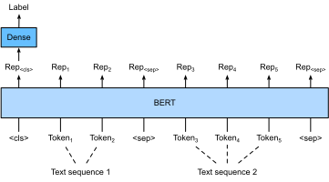
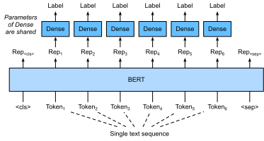

# Tinh chỉnh BERT cho các ứng dụng cấp Sequence-Level và Token-Level
:label:`sec_finetuning-bert`

Trong các phần trước của chương này, chúng tôi đã thiết kế các mô hình khác nhau cho các ứng dụng xử lý ngôn ngữ tự nhiên, chẳng hạn như dựa trên RNN, CNN, sự chú ý và MLP. Các mô hình này rất hữu ích khi có không gian hoặc thời gian hạn chế, tuy nhiên, việc tạo ra một mô hình cụ thể cho mọi nhiệm vụ xử lý ngôn ngữ tự nhiên thực tế là không khả thi. Trong :numref:`sec_bert`, chúng tôi giới thiệu một mô hình pretraining, BERT, đòi hỏi những thay đổi kiến trúc tối thiểu cho một loạt các nhiệm vụ xử lý ngôn ngữ tự nhiên. Một mặt, tại thời điểm đề xuất của mình, BERT đã cải thiện trạng thái của nghệ thuật về các nhiệm vụ xử lý ngôn ngữ tự nhiên khác nhau. Mặt khác, như đã lưu ý trong :numref:`sec_bert-pretraining`, hai phiên bản của mô hình BERT ban đầu đi kèm với 110 triệu và 340 triệu thông số. Do đó, khi có đủ tài nguyên tính toán, chúng ta có thể xem xét BERT tinh chỉnh cho các ứng dụng xử lý ngôn ngữ tự nhiên ở hạ nguồn. 

Sau đây, chúng tôi khái quát hóa một tập hợp con của các ứng dụng xử lý ngôn ngữ tự nhiên dưới dạng cấp trình tự và cấp token. Ở cấp độ trình tự, chúng tôi giới thiệu cách chuyển đổi biểu diễn BERT của đầu vào văn bản thành nhãn đầu ra trong phân loại văn bản đơn và phân loại cặp văn bản hoặc hồi quy. Ở cấp độ token, chúng tôi sẽ giới thiệu ngắn gọn các ứng dụng mới như gắn thẻ văn bản và trả lời câu hỏi và làm sáng tỏ cách BERT có thể đại diện cho đầu vào của chúng và được chuyển đổi thành nhãn đầu ra. Trong quá trình tinh chỉnh, “những thay đổi kiến trúc tối thiểu” theo yêu cầu của BERT trên các ứng dụng khác nhau là các lớp được kết nối đầy đủ bổ sung. Trong quá trình học được giám sát về một ứng dụng hạ lưu, các tham số của các lớp bổ sung được học từ đầu trong khi tất cả các tham số trong mô hình BERT được đào tạo trước đều được tinh chỉnh. 

## Phân loại văn bản đơn

*Phân loại văn bản đơn* lấy một chuỗi văn bản duy nhất làm đầu vào và xuất kết quả phân loại của nó.
Bên cạnh phân tích tình cảm mà chúng ta đã nghiên cứu trong chương này, Corpus of Linguistic Acceptability (cola) cũng là một tập dữ liệu để phân loại văn bản đơn lẻ, đánh giá liệu một câu cho trước có được chấp nhận về mặt ngữ pháp hay không :cite:`Warstadt.Singh.Bowman.2019`. Ví dụ, “Tôi nên học.” là chấp nhận được nhưng “Tôi nên học.” thì không. 

:label:`fig_bert-one-seq`

:numref:`sec_bert` mô tả biểu diễn đầu vào của BERT. Dãy đầu vào BERT thể hiện rõ ràng cả hai cặp văn bản và văn bản đơn lẻ, trong đó mã thông báo phân loại đặc biệt “<cls>” được sử dụng để phân loại trình tự và mã thông báo phân loại đặc biệt “<sep>” đánh dấu phần cuối của văn bản đơn hoặc tách một cặp văn bản. Như thể hiện trong :numref:`fig_bert-one-seq`, trong các ứng dụng phân loại văn bản đơn lẻ, đại diện BERT của mã thông báo phân loại đặc biệt “<cls>” mã hóa thông tin của toàn bộ chuỗi văn bản đầu vào. Là biểu diễn của văn bản đơn đầu vào, nó sẽ được đưa vào một MLP nhỏ bao gồm các lớp được kết nối hoàn toàn (dày đặc) để xuất ra sự phân bố của tất cả các giá trị nhãn rời rạc. 

## Phân loại cặp văn bản hoặc hồi quy

Chúng tôi cũng đã kiểm tra suy luận ngôn ngữ tự nhiên trong chương này. Nó thuộc về phân loại cặp văn bản*, một loại ứng dụng phân loại một cặp văn bản. 

Lấy một cặp văn bản làm đầu vào nhưng xuất ra một giá trị liên tục,
*ngữ nghĩa tương tự văn bản* là một tác vụ hồi quy cặp văn bản* phổ biến.
Nhiệm vụ này đo lường sự giống nhau ngữ nghĩa của câu. Ví dụ, trong tập dữ liệu Điểm chuẩn tương tự ngữ nghĩa văn bản, điểm tương đồng của một cặp câu là một thang thứ tự khác nhau, từ 0 (không có nghĩa là chồng lên nhau) đến 5 (có nghĩa là tương đương) :cite:`Cer.Diab.Agirre.ea.2017`. Mục tiêu là để dự đoán những điểm số này. Các ví dụ từ tập dữ liệu điểm chuẩn tương tự ngữ nghĩa văn bản bao gồm (câu 1, câu 2, điểm tương đồng): 

* “Một chiếc máy bay đang cất cánh. “, “Một chiếc máy bay đang cất cánh. “, 5.000;
* “Một người phụ nữ đang ăn một cái gì đó. “, “Một người phụ nữ đang ăn thịt. “, 3.000;
* “Một người phụ nữ đang nhảy múa. “, “Một người đàn ông đang nói chuyện. “, 0.000.

:label:`fig_bert-two-seqs`

So sánh với phân loại văn bản đơn trong :numref:`fig_bert-one-seq`, tinh chỉnh BERT cho phân loại cặp văn bản trong :numref:`fig_bert-two-seqs` là khác nhau trong biểu diễn đầu vào. Đối với các tác vụ hồi quy cặp văn bản như tương tự văn bản ngữ nghĩa, những thay đổi tầm thường có thể được áp dụng như xuất ra giá trị nhãn liên tục và sử dụng tổn thất bình phương trung bình: chúng phổ biến cho hồi quy. 

## Gắn thẻ văn bản

Bây giờ chúng ta hãy xem xét các tác vụ cấp token, chẳng hạn như *text tagging*, trong đó mỗi token được gán một nhãn. Trong số các tác vụ gắn thẻ văn bản,
*một phần của lời nói tagging* gán cho mỗi từ một phần của thẻ phát biểu (ví dụ, tính từ và xác định)
theo vai trò của từ trong câu. Ví dụ, theo bộ thẻ Penn Treebank II, câu “xe của John Smith là mới” nên được gắn thẻ là “NNP (danh từ, số ít thích hợp) NNP POS (sở hữu kết thúc) NN (danh từ, số ít hoặc khối lượng) VB (động từ, dạng cơ sở) JJ (tính từ)”. 

:label:`fig_bert-tagging`

Tinh chỉnh BERT cho các ứng dụng gắn thẻ văn bản được minh họa trong :numref:`fig_bert-tagging`. So với :numref:`fig_bert-one-seq`, sự khác biệt duy nhất nằm ở chỗ gắn thẻ văn bản, biểu diễn BERT của * mỗi token* của văn bản đầu vào được đưa vào cùng một lớp được kết nối đầy đủ để xuất nhãn của mã thông báo, chẳng hạn như thẻ một phần lời nói. 

## Câu hỏi trả lời

As another khác token-level cấp application ứng dụng,
*câu trả lời câu hỏi* phản ánh khả năng đọc hiểu.
Ví dụ, tập dữ liệu trả lời câu hỏi Stanford (Squad v1.1) bao gồm đọc đoạn và câu hỏi, trong đó câu trả lời cho mọi câu hỏi chỉ là một đoạn văn bản (khoảng văn bản) từ đoạn văn mà câu hỏi là khoảng :cite:`Rajpurkar.Zhang.Lopyrev.ea.2016`. Để giải thích, hãy xem xét một đoạn văn “Một số chuyên gia báo cáo rằng hiệu quả của mặt nạ là không kết luận. Tuy nhiên, các nhà sản xuất mặt nạ nhấn mạnh rằng các sản phẩm của họ, chẳng hạn như mặt nạ phòng độc N95, có thể bảo vệ chống lại virus.” và một câu hỏi “Ai nói rằng mặt nạ phòng độc N95 có thể bảo vệ chống lại virus?”. Câu trả lời nên là khoảng văn bản “nhà sản xuất mặt nạ” trong đoạn văn. Do đó, mục tiêu trong Squad v1.1 là dự đoán bắt đầu và kết thúc của khoảng văn bản trong đoạn văn được đưa ra một cặp câu hỏi và đoạn văn. 

:label:`fig_bert-qa`

Để tinh chỉnh BERT để trả lời câu hỏi, câu hỏi và đoạn văn được đóng gói như chuỗi văn bản đầu tiên và thứ hai, tương ứng, trong đầu vào của BERT. Để dự đoán vị trí bắt đầu của khoảng văn bản, cùng một lớp kết nối đầy đủ bổ sung sẽ biến đổi biểu diễn BERT của bất kỳ mã thông báo nào từ việc thông qua vị trí $i$ thành một điểm vô hướng $s_i$. Điểm số như vậy của tất cả các mã thông qua được chuyển đổi thêm bởi hoạt động softmax thành một phân phối xác suất, do đó mỗi vị trí mã thông báo $i$ trong đoạn văn được gán một xác suất $p_i$ là sự bắt đầu của khoảng văn bản. Dự đoán kết thúc khoảng văn bản giống như trên, ngoại trừ các tham số trong lớp được kết nối hoàn toàn bổ sung của nó độc lập với các tham số để dự đoán bắt đầu. Khi dự đoán kết thúc, bất kỳ mã thông báo đoạn văn nào của vị trí $i$ được chuyển đổi bởi cùng một lớp kết nối hoàn toàn thành một điểm vô hướng $e_i$. :numref:`fig_bert-qa` mô tả BERT tinh chỉnh để trả lời câu hỏi. 

Đối với câu trả lời câu hỏi, mục tiêu đào tạo của học tập được giám sát là đơn giản như tối đa hóa các log-likelihoods của các vị trí bắt đầu và kết thúc nền đất-chân lý. Khi dự đoán khoảng, chúng ta có thể tính điểm số $s_i + e_j$ cho một khoảng hợp lệ từ vị trí $i$ đến vị trí $j$ ($i \leq j$) và xuất nhịp với điểm cao nhất. 

## Tóm tắt

* BERT yêu cầu các thay đổi kiến trúc tối thiểu (các lớp kết nối đầy đủ) cho các ứng dụng xử lý ngôn ngữ tự nhiên cấp trình tự và cấp token, chẳng hạn như phân loại văn bản đơn (ví dụ: phân tích tình cảm và khả năng chấp nhận ngôn ngữ kiểm tra), phân loại cặp văn bản hoặc hồi quy (ví dụ: ngôn ngữ tự nhiên suy luận và tương tự văn bản ngữ nghĩa), gắn thẻ văn bản (ví dụ, gắn thẻ một phần lời nói) và trả lời câu hỏi.
* Trong quá trình học được giám sát về một ứng dụng hạ lưu, các tham số của các lớp bổ sung được học từ đầu trong khi tất cả các tham số trong mô hình BERT được đào tạo trước đều được tinh chỉnh.

## Bài tập

1. Hãy để chúng tôi thiết kế một thuật toán công cụ tìm kiếm cho các bài báo tin tức. Khi hệ thống nhận được một truy vấn (ví dụ: “ngành công nghiệp dầu khí trong đợt bùng phát coronavirus”), nó sẽ trả lại một danh sách xếp hạng các bài báo có liên quan nhất đến truy vấn. Giả sử rằng chúng ta có một nhóm lớn các bài báo tin tức và một số lượng lớn các truy vấn. Để đơn giản hóa vấn đề, giả sử rằng bài viết có liên quan nhất đã được dán nhãn cho mỗi truy vấn. Làm thế nào chúng ta có thể áp dụng lấy mẫu âm (xem :numref:`subsec_negative-sampling`) và BERT trong thiết kế thuật toán?
1. Làm thế nào chúng ta có thể tận dụng BERT trong các mô hình ngôn ngữ đào tạo?
1. Chúng ta có thể tận dụng BERT trong dịch máy không?

[Discussions](https://discuss.d2l.ai/t/396)
