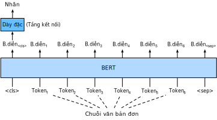
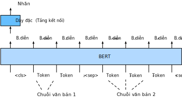
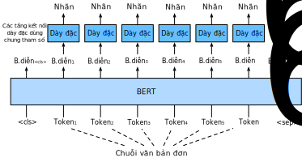
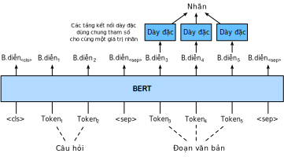

<!--
# Fine-Tuning BERT for Sequence-Level and Token-Level Applications
-->

# Tinh chỉnh BERT cho các Ứng dụng Cấp Chuỗi và Cấp Token
:label:`sec_finetuning-bert`

<!--
In the previous sections of this chapter, we have designed different models for 
natural language processing applications, such as based on RNNs, CNNs, attention, and MLPs.
These models are helpful when there is space or time constraint, however, 
crafting a specific model for every natural language processing task is practically infeasible.
In :numref:`sec_bert`, we introduced a pretraining model, BERT, 
that requires minimal architecture changes for a wide range of natural language processing tasks.
One one hand, at the time of its proposal, BERT improved the state of the art on various natural language processing tasks.
On the other hand, as noted in :numref:`sec_bert-pretraining`, 
the two versions of the original BERT model come with 110 million and 340 million parameters.
Thus, when there are sufficient computational resources, 
we may consider fine-tuning BERT for downstream natural language processing applications.
-->

Trong các phần trước, ta đã thiết kế các mô hình khác nhau cho
các ứng dụng xử lý ngôn ngữ tự nhiên, dựa trên RNN, CNN, MLP và cơ chế tập trung.
Những mô hình này rất hữu ích khi mô hình bị giới hạn về không gian bộ nhớ hoặc thời gian thực thi;
tuy nhiên, việc thiết kế thủ công một mô hình cụ thể cho mọi tác vụ xử lý ngôn ngữ tự nhiên trong thực tế là điều không khả thi.
Trong :numref:`sec_bert`, chúng ta đã giới thiệu mô hình BERT được tiền huấn luyện mà chỉ
yêu cầu thay đổi kiến trúc tối thiểu cho một loạt các tác vụ xử lý ngôn ngữ tự nhiên.
Một mặt, tại thời điểm BERT được đề xuất, nó đã cải thiện kết quả tốt nhất trên các tác vụ xử lý ngôn ngữ tự nhiên khác nhau.
Mặt khác, như đã lưu ý trong :numref:`sec_bert-pretraining`,
hai phiên bản của mô hình BERT gốc lần lượt có 110 triệu và 340 triệu tham số.
Do đó, khi có đủ tài nguyên tính toán,
ta có thể xem xét việc tinh chỉnh BERT cho các ứng dụng xử lý ngôn ngữ tự nhiên xuôi dòng.

<!--
In the following, we generalize a subset of natural language processing applications as sequence-level and token-level.
On the sequence level, we introduce how to transform the BERT representation of the text input 
to the output label in single text classification and text pair classification or regression.
On the token level, we will briefly introduce new applications such as text tagging 
and question answering and shed light on how BERT can represent their inputs and get transformed into output labels.
During fine-tuning, the "minimal architecture changes" required by BERT across different applications are the extra fully-connected layers.
During supervised learning of a downstream application, parameters of the extra layers are 
learned from scratch while all the parameters in the pretrained BERT model are fine-tuned.
-->

Sau đây, ta sẽ tổng quát hóa một số ứng dụng xử lý ngôn ngữ tự nhiên thành các ứng dụng cấp độ chuỗi và cấp độ token.
Ở cấp độ chuỗi, chúng tôi sẽ giới thiệu cách chuyển đổi biểu diễn BERT của văn bản đầu vào
thành nhãn đầu ra trong các tác vụ phân loại văn bản đơn và phân loại hay hồi quy cặp văn bản.
Ở cấp độ token, chúng tôi sẽ giới thiệu ngắn gọn các ứng dụng mới như gán thẻ văn bản
và trả lời câu hỏi, từ đó làm sáng tỏ cách BERT biểu diễn đầu vào và biến đổi chúng thành nhãn đầu ra như thế nào.
Trong quá trình tinh chỉnh, những "thay đổi kiến trúc tối thiểu" mà BERT yêu cầu trên các ứng dụng khác nhau là các tầng kết nối đầy đủ được bổ sung.
Trong quá trình học có giám sát của một ứng dụng xuôi dòng, tham số của các tầng bổ sung này
được học từ đầu trong khi tất cả các tham số trong mô hình BERT đã tiền huấn luyện sẽ được tinh chỉnh.

<!--
## Single Text Classification
-->

## Phân loại Văn bản Đơn

<!--
*Single text classification* takes a single text sequence as the input and outputs its classification result.
Besides sentiment analysis that we have studied in this chapter,
the Corpus of Linguistic Acceptability (CoLA) is also a dataset for single text classification,
judging whether a given sentence is grammatically acceptable or not :cite:`Warstadt.Singh.Bowman.2019`.
For instance, "I should study." is acceptable but "I should studying." is not.
-->

Tác vụ *phân loại văn bản đơn* nhận một chuỗi văn bản đơn làm đầu vào và đầu ra là kết quả phân loại của văn bản đó.
Bên cạnh tác vụ phân tích cảm xúc mà ta đã nghiên cứu trong chương này,
tập dữ liệu CoLA (*Corpus of Linguistic Acceptability*) cũng được sử dụng cho tác vụ phân loại văn bản đơn, 
đánh giá xem một câu đã cho có chấp nhận được về mặt ngữ pháp hay không :cite:`Warstadt.Singh.Bowman.2019`.
Ví dụ, câu "I should study." là chấp nhận được nhưng câu "I should studying." thì không.

<!--

-->

:label:`fig_bert-one-seq`

<!--
:numref:`sec_bert` describes the input representation of BERT.
The BERT input sequence unambiguously represents both single text and text pairs,
where the special classification token  “&lt;cls&gt;” is used for sequence classification and 
the special classification token  “&lt;sep&gt;” marks the end of single text or separates a pair of text.
As shown in :numref:`fig_bert-one-seq`, in single text classification applications,
the BERT representation of the special classification token  “&lt;cls&gt;” encodes the information of the entire input text sequence.
As the representation of the input single text, it will be fed into a small MLP consisting of fully-connected (dense) layers
to output the distribution of all the discrete label values.
-->

:numref:`sec_bert` mô tả biểu diễn đầu vào của BERT.
Chuỗi đầu vào BERT biểu diễn cả văn bản đơn và cặp văn bản một cách rạch ròi,
trong đó token đặc biệt “&lt;cls&gt;” được sử dụng cho các tác vụ phân loại chuỗi, 
và token đặc biệt “&lt;sep&gt;” đánh dấu vị trí kết thúc của văn bản đơn hoặc vị trí phân tách cặp văn bản.
Như minh họa trong :numref:`fig_bert-one-seq`, biểu diễn BERT của token đặc biệt “&lt;cls&gt;” mã hóa thông tin của toàn bộ chuỗi văn bản đầu vào trong các tác vụ phân loại văn bản đơn.
Là biểu diễn của văn bản đầu vào đơn, vector này sẽ được truyền vào một mạng MLP nhỏ chứa các tầng kết nối đầy đủ để biến đổi thành phân phối của các giá trị nhãn rời rạc.

<!--
## Text Pair Classification or Regression
-->

## Phân loại hoặc Hồi quy Cặp Văn bản

<!--
We have also examined natural language inference in this chapter.
It belongs to *text pair classification*, a type of application classifying a pair of text.
-->

Ta cũng sẽ xem xét tác vụ suy luận ngôn ngữ tự nhiên trong chương này.
Tác vụ này nằm trong bài toán *phân loại cặp văn bản* (*text pair classification*).

<!--
Taking a pair of text as the input but outputting a continuous value, *semantic textual similarity* is a popular *text pair regression* task.
This task measures semantic similarity of sentences.
For instance, in the Semantic Textual Similarity Benchmark dataset, the similarity score of a pair of sentences
is an ordinal scale ranging from 0 (no meaning overlap) to 5 (meaning equivalence) :cite:`Cer.Diab.Agirre.ea.2017`.
The goal is to predict these scores.
Examples from the Semantic Textual Similarity Benchmark dataset include (sentence 1, sentence 2, similarity score):
-->

Nhận một cặp văn bản làm đầu vào và cho ra một giá trị liên tục, đo độ tương tự ngữ nghĩa của văn bản (*semantic textual similarity*) 
là một tác vụ *hồi quy cặp văn bản* (*text pair regression*) rất phổ biến.
Tác vụ này đo độ tương tự ngữ nghĩa của các câu đầu vào.
Ví dụ, trong tập dữ liệu đánh giá độ tương tự ngữ nghĩa của văn bản (*Semantic Textual Similarity Benchmark*), độ tương tự của một cặp câu nằm trong khoảng từ 0 (không trùng lặp ngữ nghĩa) tới 5 (tương tự ngữ nghĩa) :cite:`Cer.Diab.Agirre.ea.2017`.
Các mẫu dữ liệu trong tập dữ liệu này có dạng (câu thứ 1, câu thứ 2, độ tương tự):

<!--
* "A plane is taking off.", "An air plane is taking off.", 5.000;
* "A woman is eating something.", "A woman is eating meat.", 3.000;
* "A woman is dancing.", "A man is talking.", 0.000.
-->

* "A plane is taking off.", "An air plane is taking off.", 5.000;
* "A woman is eating something.", "A woman is eating meat.", 3.000;
* "A woman is dancing.", "A man is talking.", 0.000.

<!--

-->

:label:`fig_bert-two-seqs`

<!--
Comparing with single text classification in :numref:`fig_bert-one-seq`,
fine-tuning BERT for text pair classification in :numref:`fig_bert-two-seqs` is different in the input representation.
For text pair regression tasks such as semantic textual similarity, trivial changes can be applied such as outputting a continuous label value
and using the mean squared loss: they are common for regression.
-->

So với tác vụ phân loại văn bản đơn trong :numref:`fig_bert-one-seq`,
việc tinh chỉnh BERT để phân loại cặp văn bản trong :numref:`fig_bert-two-seqs` có khác biệt trong biểu diễn đầu vào.
Đối với các tác vụ hồi quy cặp văn bản, chẳng hạn như đo độ tương tự ngữ nghĩa văn bản, một vài thay đổi nhỏ có thể được áp dụng như xuất ra giá trị nhãn liên tục và sử dụng trung bình bình phương mất mát.

<!--
## Text Tagging
-->

## Gán thẻ Văn bản

<!--
Now let us consider token-level tasks, such as *text tagging*, where each token is assigned a label.
Among text tagging tasks, *part-of-speech tagging* assigns each word a part-of-speech tag (e.g., adjective and determiner)
according to the role of the word in the sentence.
For example, according to the Penn Treebank II tag set,
the sentence "John Smith 's car is new" should be tagged as
"NNP (noun, proper singular) NNP POS (possessive ending) NN (noun, singular or mass) VB (verb, base form) JJ (adjective)".
-->

Bây giờ ta hãy xem xét các tác vụ ở mức token, ví dụ như *gán thẻ văn bản*, nơi mỗi token được gán một nhãn.
Trong số các tác vụ gán thẻ văn bản, *gán thẻ từ loại (part-of-speech tagging)* gán cho mỗi từ một thẻ từ loại (ví dụ, tính từ hay danh từ) dựa vào vai trò của từ đó trong câu.
Ví dụ, dựa vào tập thẻ Penn Treebank II,
câu "John Smith 's car is new" nên được gán thẻ như
"NNP (danh từ riêng, số ít) NNP POS (sở hữu cách) NN (danh từ, số ít hoặc nhiều) VB (động từ, động từ nguyên thể không "to") JJ (tính từ)".

<!--

-->

:label:`fig_bert-tagging`

<!--
Fine-tuning BERT for text tagging applications is illustrated in :numref:`fig_bert-tagging`.
Comparing with :numref:`fig_bert-one-seq`, the only distinction lies in that
in text tagging, the BERT representation of *every token* of the input text
is fed into the same extra fully-connected layers to output the label of the token, such as a part-of-speech tag.
-->

Tinh chỉnh BERT cho ứng dụng gán thẻ văn bản được minh họa trong :numref:`fig_bert-tagging`.
So với :numref:`fig_bert-one-seq`, sự khác biệt duy nhất là biểu diễn BERT của *mỗi token* trong văn bản đầu vào
được truyền vào cùng một mạng kết nối đầy đủ bổ sung để đưa ra nhãn của các token, ví dụ như thẻ từ loại.

<!--
## Question Answering
-->

## Trả lời Câu hỏi

<!--
As another token-level application, *question answering* reflects capabilities of reading comprehension.
For example, the Stanford Question Answering Dataset (SQuAD v1.1)
consists of reading passages and questions, where the answer to every question
is just a segment of text (text span) from the passage that the question is about :cite:`Rajpurkar.Zhang.Lopyrev.ea.2016`.
To explain, consider a passage
"Some experts report that a mask's efficacy is inconclusive. However, mask makers insist that their products, such as N95 respirator masks, can guard against the virus."
and a question "Who say that N95 respirator masks can guard against the virus?".
The answer should be the text span "mask makers" in the passage.
Thus, the goal in SQuAD v1.1 is to predict the start and end of the text span in the passage given a pair of question and passage.
-->

Là một ứng dụng khác ở mức token, *trả lời câu hỏi* phản ánh khả năng đọc hiểu.
Ví dụ, tập dữ liệu trả lời câu hỏi Stanford (SQuAD v1.1)
bao gồm các đoạn văn và các câu hỏi, nơi mà câu trả lời cho mỗi câu hỏi
chỉ là một phần văn bản (khoảng văn bản - *text span*) trong đoạn văn mà câu hỏi đang đề cập tới :cite:`Rajpurkar.Zhang.Lopyrev.ea.2016`.
Để giải thích, hãy xét đoạn văn sau
"Một số chuyên gia cho rằng sự hiệu quả của khẩu trang là chưa thể khẳng định. Tuy nhiên, các nhà sản xuất khẩu trang cho rằng sản phẩm của họ, như là khẩu trang N95, có thể bảo vệ khỏi virus."
và câu hỏi "Ai cho rằng khẩu trang N95 có thể bảo vệ khỏi virus?".
Câu trả lời nên là khoảng văn bản "các nhà sản xuất khẩu trang" trong đoạn văn.
Vì thế, mục đích trong SQuAD v1.1 là dự đoán điểm khởi đầu và kết thúc của khoảng văn bản trong đoạn văn, khi cho trước câu hỏi và đoạn văn.

<!--

-->

:label:`fig_bert-qa`

<!--
To fine-tune BERT for question answering, the question and passage are packed as
the first and second text sequence, respectively, in the input of BERT.
To predict the position of the start of the text span, the same additional fully-connected layer will transform
the BERT representation of any token from the passage of position $i$ into a scalar score $s_i$.
Such scores of all the passage tokens are further transformed by the softmax operation
into a probability distribution, so that each token position $i$ in the passage is assigned
a probability $p_i$ of being the start of the text span.
Predicting the end of the text span is the same as above, except that
parameters in its additional fully-connected layer are independent from those for predicting the start.
When predicting the end, any passage token of position $i$ is transformed by the same fully-connected layer into a scalar score $e_i$.
:numref:`fig_bert-qa` depicts fine-tuning BERT for question answering.
-->

Để tinh chỉnh BERT cho ứng dụng trả lời câu hỏi, câu hỏi và đoạn văn được đóng gói tương ứng lần lượt là
chuỗi văn bản thứ nhất và thứ hai trong đầu vào của BERT.
Để dự đoán vị trí của phần bắt đầu của khoảng văn bản, cùng một tầng kết nối đầy đủ được thêm vào sẽ chuyển hóa
biểu diễn BERT của bất kỳ token nào từ đoạn văn bản có vị trí $i$ thành một giá trị vô hướng $s_i$. 
Các giá trị vô hướng của tất cả token trong đoạn văn được tiếp tục biến đổi bởi hàm softmax
trở thành một phân phối xác suất, dẫn tới mỗi vị trí $i$ của token trong đoạn văn được gán
cho một xác suất $p_i$, là xác suất token đó là điểm bắt đầu của khoảng văn bản.
Dự đoán điểm kết thúc của khoảng văn bản cũng tương tự, ngoại trừ việc các tham số trong tầng kết nối đầy đủ mở rộng là độc lập với các tầng để dự đoán điểm bắt đầu.
Khi dự đoán điểm kết thúc, token có vị trí $i$ trong đoạn văn được biến đổi thành một giá trị vô hướng $e_i$ bởi tầng kết nối đầy đủ.
:numref:`fig_bert-qa` minh họa quá trình tinh chỉnh BERT cho ứng dụng trả lời câu hỏi.

<!--
For question answering, the supervised learning's training objective is as straightforward as
maximizing the log-likelihoods of the ground-truth start and end positions.
When predicting the span, we can compute the score $s_i + e_j$ for a valid span
from position $i$ to position $j$ ($i \leq j$), and output the span with the highest score.
-->

Cho việc trả lời câu hỏi, mục đích của huấn luyện có giám sát đơn giản là cực đại hóa hàm log hợp lý của các vị trí bắt đầu và kết thúc nhãn gốc. 
Khi dự đoán khoảng văn bản, ta có thể tính toán giá trị $s_i + e_j$ cho một khoảng hợp lệ từ vị trí $i$ tới vị trí $j$ ($i \leq j$), và đưa ra khoảng có giá trị cao nhất làm đầu ra.

## Tóm tắt

<!--
* BERT requires minimal architecture changes (extra fully-connected layers) for sequence-level and token-level natural language processing applications, 
such as single text classification (e.g., sentiment analysis and testing linguistic acceptability), text pair classification or regression 
(e.g., natural language inference and semantic textual similarity), text tagging (e.g., part-of-speech tagging), and question answering.
* During supervised learning of a downstream application, parameters of the extra layers are learned from scratch 
while all the parameters in the pretrained BERT model are fine-tuned.
-->

* BERT chỉ yêu cầu các thay đổi tối thiểu tới kiến trúc (thêm các tầng kết nối đầy đủ) cho nhiều ứng dụng xử lý ngôn ngữ tự nhiên ở mức chuỗi và mức token,
ví dụ như phân loại văn bản đơn (phân tích cảm xúc và kiểm tra khả năng chấp nhận được về ngôn ngữ), phân loại hoặc hồi quy cặp văn bản 
(suy luận ngôn ngữ tự nhiên và đo sự tương đồng ngữ nghĩa văn bản), gán thẻ văn bản (như gán thẻ từ loại) và trả lời câu hỏi.
* Trong suốt quá trình học có giám sát của một ứng dụng xuôi dòng, các thông số của các tầng mở rộng được học từ đầu trong khi tất cả các thông số trong mô hình BERT đã tiền huấn luyện sẽ được tinh chỉnh.

## Bài tập

<!--
1. Let us design a search engine algorithm for news articles. When the system receives an query (e.g., "oil industry during the coronavirus outbreak"), 
it should return a ranked list of news articles that are most relevant to the query. 
Suppose that we have a huge pool of news articles and a large number of queries. 
To simplify the problem, suppose that the most relevant article has been labeled for each query. 
How can we apply negative sampling (see :numref:`subsec_negative-sampling`) and BERT in the algorithm design?
2. How can we leverage BERT in training language models?
3. Can we leverage BERT in machine translation?
-->

1. Hãy thiết kế một công cụ tìm kiếm các bài báo tin tức. Khi hệ thống nhận một truy vấn (ví dụ, "ngành công nghiệp dầu mỏ trong đại dịch COVID-19"),
nó trả về một danh sách xếp hạng các bài viết tin tức liên quan tới truy vấn nhất. 
Giả sử như ta có một tập lớn các bài báo và một số lượng lớn các truy vấn.
Để đơn giản hóa vấn đề, giả thiết rằng bài báo liên quan nhất được gán nhãn cho từng truy vấn.
Làm cách nào để ta áp dụng phương pháp lấy mẫu âm (xem :numref:`subsec_negative-sampling`) và BERT khi thiết kế thuật toán?
2. Làm thế nào để tận dụng BERT khi huấn luyện các mô hình ngôn ngữ?
3. Làm thế nào để tận dụng BERT trong dịch máy?

## Thảo luận
* Tiếng Anh: [Main Forum](https://discuss.d2l.ai/t/396)
* Tiếng Việt: [Diễn đàn Machine Learning Cơ Bản](https://forum.machinelearningcoban.com/c/d2l)

## Những người thực hiện
Bản dịch trong trang này được thực hiện bởi:

* Đoàn Võ Duy Thanh
* Nguyễn Văn Quang
* Trần Yến Thy
* Lê Khắc Hồng Phúc
* Nguyễn Văn Cường

*Lần cập nhật gần nhất: 26/09/2020. (Cập nhật lần cuối từ nội dung gốc: 30/06/2020)*
