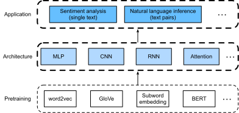

<!--
# Natural Language Processing: Applications
-->

# Xử lý Ngôn ngữ Tự nhiên: Ứng dụng
:label:`chap_nlp_app`

<!--
We have seen how to represent text tokens and train their representations in :numref:`chap_nlp_pretrain`.
Such pretrained text representations can be fed to various models for different downstream natural language processing tasks.
-->


Ở :numref:`chap_nlp_pretrain`, chúng ta đã nhìn thấy cách biểu diễn token văn bản và huấn luyện các biểu diễn của chúng.
Những biểu diễn văn bản được tiền huấn luyện như vậy có thể được truyền vào các mô hình cho các tác vụ xử lý ngôn ngữ tự nhiên xuôi dòng khác nhau.


<!--
This book does not intend to cover natural language processing applications in a comprehensive manner.
Our focus is on *how to apply (deep) representation learning of languages to addressing natural language processing problems*.
Nonetheless, we have already discussed several natural language processing applications without pretraining in earlier chapters, just for explaining deep learning architectures.
For instance, in :numref:`chap_rnn`, we have relied on RNNs to design language models to generate novella-like text.
In :numref:`chap_modern_rnn` and :numref:`chap_attention`, we have also designed models based on RNNs and attention mechanisms for machine translation.
Given pretrained text representations, in this chapter, we will consider two more downstream natural language processing tasks: sentiment analysis and natural language inference.
These are popular and representative natural language processing applications: the former analyzes single text and the latter analyzes relationships of text pairs.
-->

Cuốn sách này không có ý định trình bày các ứng dụng xử lý ngôn ngữ tự nhiên một cách toàn diện.
Trọng tâm của cuốn sách là *làm sao để áp dụng học biểu diễn (sâu) của ngôn ngữ nhằm giải quyết các bài toán xử lý ngôn ngữ tự nhiên*.
Tuy nhiên, chúng ta đã thảo luận về một số ứng dụng xử lý ngôn ngữ tự nhiên mà không cần tiền huấn luyện trong các chương trước, nhằm chỉ giải thích các kiến ​​trúc học sâu.
Như trong :numref:`chap_rnn`, chúng ta đã thiết kế các mô hình ngôn ngữ dựa trên RNN để sinh ra các văn bản có nội dung giống như tiểu thuyết.
Trong :numref:`chap_modern_rnn` và :numref:`chap_attention`, ta cũng đã thiết kế các mô hình ngôn ngữ dựa trên RNN và các cơ chế tập trung cho tác vụ dịch máy.
Trong chương này, với những biểu diễn văn bản được tiền huấn luyện thì ta sẽ xem xét hai tác vụ xử lý ngôn ngữ tự nhiên xuôi dòng khác đó là, 
phân tích cảm xúc (*sentiment analysis*) và suy luận ngôn ngữ tự nhiên (*natural language inference*).
Đây là những ứng dụng xử lý ngôn ngữ tự nhiên mang tính phổ biến và đại diện: ứng dụng trước phân tích văn bản đơn lẻ trong khi ứng dụng sau phân tích mối quan hệ của các cặp văn bản.


<!--

-->


:label:`fig_nlp-map-app`


<!--
As depicted in :numref:`fig_nlp-map-app`, this chapter focuses on describing the basic ideas of designing natural language processing models 
using different types of deep learning architectures, such as MLPs, CNNs, RNNs, and attention.
Though it is possible to combine any pretrained text representations with any architecture for 
either downstream natural language processing task in :numref:`fig_nlp-map-app`, we select a few representative combinations.
Specifically, we will explore popular architectures based on RNNs and CNNs for sentiment analysis.
For natural language inference, we choose attention and MLPs to demonstrate how to analyze text pairs.
In the end, we introduce how to fine-tune a pretrained BERT model for a wide range of natural language processing applications,
such as on a sequence level (single text classification and text pair classification) and a token level (text tagging and question answering).
As a concrete empirical case, we will fine-tune BERT for natural language processing.
-->


Như được mô tả trong :numref:`fig_nlp-map-app`, chương này sẽ tập trung vào việc mô tả các ý tưởng cơ bản trong thiết kế các mô hình xử lý ngôn ngữ tự nhiên
sử dụng các loại kiến ​​trúc học sâu khác nhau, chẳng hạn như MLP, CNN, RNN và cơ chế tập trung.
Mặc dù có thể kết hợp bất kỳ biểu diễn văn bản được tiền huấn luyện với bất kỳ kiến ​​trúc nào cho các tác vụ xử lý ngôn ngữ tự nhiên xuôi dòng trong :numref:`fig_nlp-map-app`, nhưng ta chỉ chọn một vài kết hợp đại diện mà thôi.
Cụ thể, chúng ta sẽ khám phá các kiến ​​trúc phổ biến dựa trên RNN và CNN để phân tích cảm xúc.
Đối với suy luận ngôn ngữ tự nhiên, ta sẽ chọn cơ chế tập trung và MLP để minh họa cách phân tích quan hệ giữa các cặp văn bản.
Cuối cùng, ta sẽ giới thiệu cách tinh chỉnh mô hình BERT được tiền huấn luyện cho một loạt các ứng dụng xử lý ngôn ngữ tự nhiên,
ví dụ như các tác vụ cấp chuỗi (phân loại đơn văn bản và phân loại cặp văn bản) và cấp token (gắn thẻ văn bản và trả lời câu hỏi).
Chúng ta sẽ tinh chỉnh BERT để xử lý ngôn ngữ tự nhiên như một thực nghiệm cụ thể.


<!--
As we have introduced in :numref:`sec_bert`, BERT requires minimal architecture changes for a wide range of natural language processing applications.
However, this benefit comes at the cost of fine-tuning a huge number of BERT parameters for the downstream applications.
When space or time is limited, those crafted models based on MLPs, CNNs, RNNs, and attention are more feasible.
In the following, we start by the sentiment analysis application and illustrate the model design based on RNNs and CNNs, respectively.
-->

Như đã giới thiệu trong :numref:`sec_bert`, BERT chỉ yêu cầu các thay đổi kiến trúc tối thiểu cho một loạt các ứng dụng xử lý ngôn ngữ tự nhiên.
Tuy nhiên, lợi ích này đi kèm với chi phí phải tinh chỉnh một số lượng lớn các tham số mô hình BERT cho các ứng dụng xuôi dòng.
Khi độ phức tạp về không gian hoặc thời gian bị giới hạn, những mô hình được thiết kế thủ công dựa trên MLP, CNN, RNN và cơ chế tập trung sẽ khả thi hơn.
Trong phần sau, ta sẽ bắt đầu bằng ứng dụng phân tích cảm xúc và minh họa thiết kế mô hình dựa trên kiến trúc RNN và CNN tương ứng.


```toc
:maxdepth: 2

sentiment-analysis-and-dataset_vn
sentiment-analysis-rnn_vn
sentiment-analysis-cnn_vn
natural-language-inference-and-dataset_vn
natural-language-inference-attention_vn
finetuning-bert_vn
natural-language-inference-bert_vn
```

## Những người thực hiện
Bản dịch trong trang này được thực hiện bởi:

* Đoàn Võ Duy Thanh
* Nguyễn Văn Quang
* Nguyễn Văn Cường

*Lần cập nhật gần nhất: 06/10/2020. (Cập nhật lần cuối từ nội dung gốc: 03/04/2020)*
