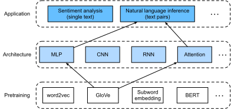

# Suy luận ngôn ngữ tự nhiên: Sử dụng sự chú ý
:label:`sec_natural-language-inference-attention`

Chúng tôi đã giới thiệu nhiệm vụ suy luận ngôn ngữ tự nhiên và tập dữ liệu SNLI trong :numref:`sec_natural-language-inference-and-dataset`. Theo quan điểm của nhiều mô hình dựa trên kiến trúc phức tạp và sâu sắc, Parikh et al. đề xuất giải quyết suy luận ngôn ngữ tự nhiên với các cơ chế chú ý và gọi nó là một “mô hình chú ý có thể phân hủy” :cite:`Parikh.Tackstrom.Das.ea.2016`. Điều này dẫn đến một mô hình không có lớp lặp lại hoặc phức tạp, đạt được kết quả tốt nhất tại thời điểm đó trên tập dữ liệu SNLI với ít tham số hơn nhiều. Trong phần này, chúng tôi sẽ mô tả và thực hiện phương pháp dựa trên sự chú ý này (với MLP s) cho suy luận ngôn ngữ tự nhiên, như được mô tả trong :numref:`fig_nlp-map-nli-attention`. 


:label:`fig_nlp-map-nli-attention`

## Mô hình

Đơn giản hơn là duy trì thứ tự của mã thông báo trong cơ sở và giả thuyết, chúng ta chỉ có thể sắp xếp các mã thông báo trong một chuỗi văn bản với mỗi mã thông báo khác, và ngược lại, sau đó so sánh và tổng hợp thông tin đó để dự đoán mối quan hệ logic giữa cơ sở và giả thuyết. Tương tự như liên kết các mã thông báo giữa các câu nguồn và câu đích trong dịch máy, sự liên kết của các mã thông báo giữa các cơ sở và giả thuyết có thể được thực hiện gọn gàng bởi các cơ chế chú ý. 


:label:`fig_nli_attention`

:numref:`fig_nli_attention` mô tả phương pháp suy luận ngôn ngữ tự nhiên sử dụng các cơ chế chú ý. Ở cấp độ cao, nó bao gồm ba bước được đào tạo chung: tham dự, so sánh và tổng hợp. Chúng tôi sẽ minh họa cho họ từng bước trong những điều sau đây.

```{.python .input}
from d2l import mxnet as d2l
from mxnet import gluon, init, np, npx
from mxnet.gluon import nn

npx.set_np()
```

```{.python .input}
#@tab pytorch
from d2l import torch as d2l
import torch
from torch import nn
from torch.nn import functional as F
```

### Tham dự

Bước đầu tiên là căn chỉnh mã thông báo trong một chuỗi văn bản với mỗi mã thông báo trong chuỗi khác. Giả sử rằng tiền đề là “tôi cần ngủ” và giả thuyết là “tôi mệt mỏi”. Do sự giống nhau về ngữ nghĩa, chúng ta có thể muốn căn chỉnh “i” trong giả thuyết với “i” trong tiền đề, và căn chỉnh “mệt mỏi” trong giả thuyết với “ngủ” trong tiền đề. Tương tự như vậy, chúng ta có thể muốn căn chỉnh “i” trong tiền đề với “i” trong giả thuyết, và căn chỉnh “cần” và “ngủ” trong tiền đề với “mệt mỏi” trong giả thuyết. Lưu ý rằng căn chỉnh như vậy là * mềm* sử dụng trung bình có trọng số, trong đó trọng lượng lớn lý tưởng được liên kết với các mã thông báo được căn chỉnh. Để dễ trình diễn, :numref:`fig_nli_attention` cho thấy sự liên kết như vậy theo cách * cứng*. 

Bây giờ chúng tôi mô tả sự liên kết mềm bằng cách sử dụng các cơ chế chú ý chi tiết hơn. Biểu thị bằng $\mathbf{A} = (\mathbf{a}_1, \ldots, \mathbf{a}_m)$ và $\mathbf{B} = (\mathbf{b}_1, \ldots, \mathbf{b}_n)$ tiền đề và giả thuyết, có số lượng mã thông báo là $m$ và $n$, tương ứng, trong đó $\mathbf{a}_i, \mathbf{b}_j \in \mathbb{R}^{d}$ ($i = 1, \ldots, m, j = 1, \ldots, n$) là một vector từ $d$ chiều. Để liên kết mềm, chúng tôi tính toán trọng lượng chú ý $e_{ij} \in \mathbb{R}$ như 

$$e_{ij} = f(\mathbf{a}_i)^\top f(\mathbf{b}_j),$$
:eqlabel:`eq_nli_e`

trong đó hàm $f$ là một MLP được định nghĩa trong hàm `mlp` sau. Kích thước đầu ra của $f$ được chỉ định bởi đối số `num_hiddens` của `mlp`.

```{.python .input}
def mlp(num_hiddens, flatten):
    net = nn.Sequential()
    net.add(nn.Dropout(0.2))
    net.add(nn.Dense(num_hiddens, activation='relu', flatten=flatten))
    net.add(nn.Dropout(0.2))
    net.add(nn.Dense(num_hiddens, activation='relu', flatten=flatten))
    return net
```

```{.python .input}
#@tab pytorch
def mlp(num_inputs, num_hiddens, flatten):
    net = []
    net.append(nn.Dropout(0.2))
    net.append(nn.Linear(num_inputs, num_hiddens))
    net.append(nn.ReLU())
    if flatten:
        net.append(nn.Flatten(start_dim=1))
    net.append(nn.Dropout(0.2))
    net.append(nn.Linear(num_hiddens, num_hiddens))
    net.append(nn.ReLU())
    if flatten:
        net.append(nn.Flatten(start_dim=1))
    return nn.Sequential(*net)
```

Cần nhấn mạnh rằng, trong :eqref:`eq_nli_e` $f$ mất đầu vào $\mathbf{a}_i$ và $\mathbf{b}_j$ riêng biệt hơn là lấy một cặp chúng lại với nhau làm đầu vào. Thủ thuật * decomposition* này dẫn đến chỉ $m + n$ ứng dụng (độ phức tạp tuyến tính) của $f$ chứ không phải là $mn$ ứng dụng (độ phức tạp bậc hai). 

Bình thường hóa trọng lượng chú ý trong :eqref:`eq_nli_e`, chúng tôi tính toán trung bình trọng số của tất cả các vectơ mã thông báo trong giả thuyết để có được đại diện của giả thuyết được liên kết nhẹ nhàng với mã thông báo được lập chỉ mục bởi $i$ trong tiền đề: 

$$
\boldsymbol{\beta}_i = \sum_{j=1}^{n}\frac{\exp(e_{ij})}{ \sum_{k=1}^{n} \exp(e_{ik})} \mathbf{b}_j.
$$

Tương tự như vậy, chúng tôi tính toán sự liên kết mềm của các token tiền đề cho mỗi token được lập chỉ mục bởi $j$ trong giả thuyết: 

$$
\boldsymbol{\alpha}_j = \sum_{i=1}^{m}\frac{\exp(e_{ij})}{ \sum_{k=1}^{m} \exp(e_{kj})} \mathbf{a}_i.
$$

Dưới đây chúng tôi xác định lớp `Attend` để tính toán sự liên kết mềm của các giả thuyết (`beta`) với cơ sở đầu vào `A` và căn chỉnh mềm của cơ sở (`alpha`) với giả thuyết đầu vào `B`.

```{.python .input}
class Attend(nn.Block):
    def __init__(self, num_hiddens, **kwargs):
        super(Attend, self).__init__(**kwargs)
        self.f = mlp(num_hiddens=num_hiddens, flatten=False)

    def forward(self, A, B):
        # Shape of `A`/`B`: (b`atch_size`, no. of tokens in sequence A/B,
        # `embed_size`)
        # Shape of `f_A`/`f_B`: (`batch_size`, no. of tokens in sequence A/B,
        # `num_hiddens`)
        f_A = self.f(A)
        f_B = self.f(B)
        # Shape of `e`: (`batch_size`, no. of tokens in sequence A,
        # no. of tokens in sequence B)
        e = npx.batch_dot(f_A, f_B, transpose_b=True)
        # Shape of `beta`: (`batch_size`, no. of tokens in sequence A,
        # `embed_size`), where sequence B is softly aligned with each token
        # (axis 1 of `beta`) in sequence A
        beta = npx.batch_dot(npx.softmax(e), B)
        # Shape of `alpha`: (`batch_size`, no. of tokens in sequence B,
        # `embed_size`), where sequence A is softly aligned with each token
        # (axis 1 of `alpha`) in sequence B
        alpha = npx.batch_dot(npx.softmax(e.transpose(0, 2, 1)), A)
        return beta, alpha
```

```{.python .input}
#@tab pytorch
class Attend(nn.Module):
    def __init__(self, num_inputs, num_hiddens, **kwargs):
        super(Attend, self).__init__(**kwargs)
        self.f = mlp(num_inputs, num_hiddens, flatten=False)

    def forward(self, A, B):
        # Shape of `A`/`B`: (`batch_size`, no. of tokens in sequence A/B,
        # `embed_size`)
        # Shape of `f_A`/`f_B`: (`batch_size`, no. of tokens in sequence A/B,
        # `num_hiddens`)
        f_A = self.f(A)
        f_B = self.f(B)
        # Shape of `e`: (`batch_size`, no. of tokens in sequence A,
        # no. of tokens in sequence B)
        e = torch.bmm(f_A, f_B.permute(0, 2, 1))
        # Shape of `beta`: (`batch_size`, no. of tokens in sequence A,
        # `embed_size`), where sequence B is softly aligned with each token
        # (axis 1 of `beta`) in sequence A
        beta = torch.bmm(F.softmax(e, dim=-1), B)
        # Shape of `alpha`: (`batch_size`, no. of tokens in sequence B,
        # `embed_size`), where sequence A is softly aligned with each token
        # (axis 1 of `alpha`) in sequence B
        alpha = torch.bmm(F.softmax(e.permute(0, 2, 1), dim=-1), A)
        return beta, alpha
```

### So sánh

Trong bước tiếp theo, chúng ta so sánh một token trong một chuỗi với chuỗi khác được liên kết nhẹ nhàng với mã thông báo đó. Lưu ý rằng trong liên kết mềm, tất cả các mã thông báo từ một chuỗi, mặc dù với trọng lượng chú ý có thể khác nhau, sẽ được so sánh với một mã thông báo trong chuỗi khác. Để dễ dàng trình diễn, :numref:`fig_nli_attention` cặp token với mã thông báo được liên kết theo cách * hard*. Ví dụ, giả sử rằng bước tham dự xác định rằng “nhu cầu” và “ngủ” trong tiền đề đều phù hợp với “mệt mỏi” trong giả thuyết, cặp “mệt mỏi — cần ngủ” sẽ được so sánh. 

Trong bước so sánh, chúng ta cho phép nối (toán tử $[\cdot, \cdot]$) của mã thông báo từ một chuỗi và liên kết các token từ chuỗi khác vào một hàm $g$ (một MLP): 

$$\mathbf{v}_{A,i} = g([\mathbf{a}_i, \boldsymbol{\beta}_i]), i = 1, \ldots, m\\ \mathbf{v}_{B,j} = g([\mathbf{b}_j, \boldsymbol{\alpha}_j]), j = 1, \ldots, n.$$

:eqlabel:`eq_nli_v_ab` 

Năm :eqref:`eq_nli_v_ab`, $\mathbf{v}_{A,i}$ là sự so sánh giữa token $i$ trong tiền đề và tất cả các token giả thuyết được liên kết nhẹ nhàng với mã thông báo $i$; trong khi $\mathbf{v}_{B,j}$ là so sánh giữa token $j$ trong giả thuyết và tất cả các token tiền đề được phù hợp nhẹ nhàng với token $j$. Lớp `Compare` sau đây định nghĩa như bước so sánh.

```{.python .input}
class Compare(nn.Block):
    def __init__(self, num_hiddens, **kwargs):
        super(Compare, self).__init__(**kwargs)
        self.g = mlp(num_hiddens=num_hiddens, flatten=False)

    def forward(self, A, B, beta, alpha):
        V_A = self.g(np.concatenate([A, beta], axis=2))
        V_B = self.g(np.concatenate([B, alpha], axis=2))
        return V_A, V_B
```

```{.python .input}
#@tab pytorch
class Compare(nn.Module):
    def __init__(self, num_inputs, num_hiddens, **kwargs):
        super(Compare, self).__init__(**kwargs)
        self.g = mlp(num_inputs, num_hiddens, flatten=False)

    def forward(self, A, B, beta, alpha):
        V_A = self.g(torch.cat([A, beta], dim=2))
        V_B = self.g(torch.cat([B, alpha], dim=2))
        return V_A, V_B
```

### Tổng hợp

Với hai bộ vectơ so sánh $\mathbf{v}_{A,i}$ ($i = 1, \ldots, m$) và $\mathbf{v}_{B,j}$ ($j = 1, \ldots, n$) trên tay, trong bước cuối cùng chúng ta sẽ tổng hợp thông tin đó để suy ra mối quan hệ logic. Chúng tôi bắt đầu bằng cách tổng hợp cả hai bộ: 

$$
\mathbf{v}_A = \sum_{i=1}^{m} \mathbf{v}_{A,i}, \quad \mathbf{v}_B = \sum_{j=1}^{n}\mathbf{v}_{B,j}.
$$

Tiếp theo chúng ta cung cấp kết nối của cả hai kết quả tóm tắt thành hàm $h$ (một MLP) để có được kết quả phân loại của mối quan hệ logic: 

$$
\hat{\mathbf{y}} = h([\mathbf{v}_A, \mathbf{v}_B]).
$$

Bước tổng hợp được xác định trong lớp `Aggregate` sau.

```{.python .input}
class Aggregate(nn.Block):
    def __init__(self, num_hiddens, num_outputs, **kwargs):
        super(Aggregate, self).__init__(**kwargs)
        self.h = mlp(num_hiddens=num_hiddens, flatten=True)
        self.h.add(nn.Dense(num_outputs))

    def forward(self, V_A, V_B):
        # Sum up both sets of comparison vectors
        V_A = V_A.sum(axis=1)
        V_B = V_B.sum(axis=1)
        # Feed the concatenation of both summarization results into an MLP
        Y_hat = self.h(np.concatenate([V_A, V_B], axis=1))
        return Y_hat
```

```{.python .input}
#@tab pytorch
class Aggregate(nn.Module):
    def __init__(self, num_inputs, num_hiddens, num_outputs, **kwargs):
        super(Aggregate, self).__init__(**kwargs)
        self.h = mlp(num_inputs, num_hiddens, flatten=True)
        self.linear = nn.Linear(num_hiddens, num_outputs)

    def forward(self, V_A, V_B):
        # Sum up both sets of comparison vectors
        V_A = V_A.sum(dim=1)
        V_B = V_B.sum(dim=1)
        # Feed the concatenation of both summarization results into an MLP
        Y_hat = self.linear(self.h(torch.cat([V_A, V_B], dim=1)))
        return Y_hat
```

### Đặt tất cả mọi thứ lại với nhau

Bằng cách đặt các bước tham dự, so sánh và tổng hợp lại với nhau, chúng tôi xác định mô hình chú ý có thể phân hủy để cùng đào tạo ba bước này.

```{.python .input}
class DecomposableAttention(nn.Block):
    def __init__(self, vocab, embed_size, num_hiddens, **kwargs):
        super(DecomposableAttention, self).__init__(**kwargs)
        self.embedding = nn.Embedding(len(vocab), embed_size)
        self.attend = Attend(num_hiddens)
        self.compare = Compare(num_hiddens)
        # There are 3 possible outputs: entailment, contradiction, and neutral
        self.aggregate = Aggregate(num_hiddens, 3)

    def forward(self, X):
        premises, hypotheses = X
        A = self.embedding(premises)
        B = self.embedding(hypotheses)
        beta, alpha = self.attend(A, B)
        V_A, V_B = self.compare(A, B, beta, alpha)
        Y_hat = self.aggregate(V_A, V_B)
        return Y_hat
```

```{.python .input}
#@tab pytorch
class DecomposableAttention(nn.Module):
    def __init__(self, vocab, embed_size, num_hiddens, num_inputs_attend=100,
                 num_inputs_compare=200, num_inputs_agg=400, **kwargs):
        super(DecomposableAttention, self).__init__(**kwargs)
        self.embedding = nn.Embedding(len(vocab), embed_size)
        self.attend = Attend(num_inputs_attend, num_hiddens)
        self.compare = Compare(num_inputs_compare, num_hiddens)
        # There are 3 possible outputs: entailment, contradiction, and neutral
        self.aggregate = Aggregate(num_inputs_agg, num_hiddens, num_outputs=3)

    def forward(self, X):
        premises, hypotheses = X
        A = self.embedding(premises)
        B = self.embedding(hypotheses)
        beta, alpha = self.attend(A, B)
        V_A, V_B = self.compare(A, B, beta, alpha)
        Y_hat = self.aggregate(V_A, V_B)
        return Y_hat
```

## Đào tạo và đánh giá mô hình

Bây giờ chúng ta sẽ đào tạo và đánh giá mô hình chú ý phân hủy được xác định trên bộ dữ liệu SNLI. Chúng tôi bắt đầu bằng cách đọc tập dữ liệu. 

### Đọc tập dữ liệu

Chúng tôi tải xuống và đọc tập dữ liệu SNLI bằng chức năng được xác định trong :numref:`sec_natural-language-inference-and-dataset`. Kích thước lô và chiều dài chuỗi được đặt thành $256$ và $50$, tương ứng.

```{.python .input}
#@tab all
batch_size, num_steps = 256, 50
train_iter, test_iter, vocab = d2l.load_data_snli(batch_size, num_steps)
```

### Tạo mô hình

Chúng tôi sử dụng nhúng Glove 100 chiều được đào tạo trước để đại diện cho các mã thông báo đầu vào. Do đó, chúng ta xác định trước kích thước của vectơ $\mathbf{a}_i$ và $\mathbf{b}_j$ trong :eqref:`eq_nli_e` là 100. Kích thước đầu ra của các chức năng $f$ trong :eqref:`eq_nli_e` và $g$ trong :eqref:`eq_nli_v_ab` được đặt thành 200. Sau đó, chúng ta tạo ra một ví dụ mô hình, khởi tạo các tham số của nó và tải Glove nhúng để khởi tạo vectơ của mã thông báo đầu vào.

```{.python .input}
embed_size, num_hiddens, devices = 100, 200, d2l.try_all_gpus()
net = DecomposableAttention(vocab, embed_size, num_hiddens)
net.initialize(init.Xavier(), ctx=devices)
glove_embedding = d2l.TokenEmbedding('glove.6b.100d')
embeds = glove_embedding[vocab.idx_to_token]
net.embedding.weight.set_data(embeds)
```

```{.python .input}
#@tab pytorch
embed_size, num_hiddens, devices = 100, 200, d2l.try_all_gpus()
net = DecomposableAttention(vocab, embed_size, num_hiddens)
glove_embedding = d2l.TokenEmbedding('glove.6b.100d')
embeds = glove_embedding[vocab.idx_to_token]
net.embedding.weight.data.copy_(embeds);
```

### Đào tạo và đánh giá mô hình

Trái ngược với hàm `split_batch` trong :numref:`sec_multi_gpu` lấy các đầu vào đơn như chuỗi văn bản (hoặc hình ảnh), chúng tôi định nghĩa một hàm `split_batch_multi_inputs` để lấy nhiều đầu vào như cơ sở và giả thuyết trong minibatches.

```{.python .input}
#@save
def split_batch_multi_inputs(X, y, devices):
    """Split multi-input `X` and `y` into multiple devices."""
    X = list(zip(*[gluon.utils.split_and_load(
        feature, devices, even_split=False) for feature in X]))
    return (X, gluon.utils.split_and_load(y, devices, even_split=False))
```

Bây giờ chúng ta có thể đào tạo và đánh giá mô hình trên tập dữ liệu SNLI.

```{.python .input}
lr, num_epochs = 0.001, 4
trainer = gluon.Trainer(net.collect_params(), 'adam', {'learning_rate': lr})
loss = gluon.loss.SoftmaxCrossEntropyLoss()
d2l.train_ch13(net, train_iter, test_iter, loss, trainer, num_epochs, devices,
               split_batch_multi_inputs)
```

```{.python .input}
#@tab pytorch
lr, num_epochs = 0.001, 4
trainer = torch.optim.Adam(net.parameters(), lr=lr)
loss = nn.CrossEntropyLoss(reduction="none")
d2l.train_ch13(net, train_iter, test_iter, loss, trainer, num_epochs, devices)
```

### Sử dụng mô hình

Cuối cùng, xác định hàm dự đoán để xuất ra mối quan hệ logic giữa một cặp tiền đề và giả thuyết.

```{.python .input}
#@save
def predict_snli(net, vocab, premise, hypothesis):
    """Predict the logical relationship between the premise and hypothesis."""
    premise = np.array(vocab[premise], ctx=d2l.try_gpu())
    hypothesis = np.array(vocab[hypothesis], ctx=d2l.try_gpu())
    label = np.argmax(net([premise.reshape((1, -1)),
                           hypothesis.reshape((1, -1))]), axis=1)
    return 'entailment' if label == 0 else 'contradiction' if label == 1 \
            else 'neutral'
```

```{.python .input}
#@tab pytorch
#@save
def predict_snli(net, vocab, premise, hypothesis):
    """Predict the logical relationship between the premise and hypothesis."""
    net.eval()
    premise = torch.tensor(vocab[premise], device=d2l.try_gpu())
    hypothesis = torch.tensor(vocab[hypothesis], device=d2l.try_gpu())
    label = torch.argmax(net([premise.reshape((1, -1)),
                           hypothesis.reshape((1, -1))]), dim=1)
    return 'entailment' if label == 0 else 'contradiction' if label == 1 \
            else 'neutral'
```

Chúng ta có thể sử dụng mô hình được đào tạo để có được kết quả suy luận ngôn ngữ tự nhiên cho một cặp câu mẫu.

```{.python .input}
#@tab all
predict_snli(net, vocab, ['he', 'is', 'good', '.'], ['he', 'is', 'bad', '.'])
```

## Tóm tắt

* Mô hình chú ý có thể phân hủy bao gồm ba bước để dự đoán mối quan hệ logic giữa cơ sở và giả thuyết: tham dự, so sánh và tổng hợp.
* Với các cơ chế chú ý, chúng ta có thể sắp xếp các mã thông báo theo một chuỗi văn bản với mỗi mã thông báo khác và ngược lại. Sự liên kết như vậy là mềm bằng cách sử dụng trung bình trọng số, trong đó trọng lượng lớn lý tưởng được liên kết với các mã thông báo được căn chỉnh.
* Thủ thuật phân hủy dẫn đến độ phức tạp tuyến tính mong muốn hơn so với độ phức tạp bậc hai khi tính toán trọng lượng chú ý.
* Chúng ta có thể sử dụng vectơ từ được đào tạo trước làm biểu diễn đầu vào cho nhiệm vụ xử lý ngôn ngữ tự nhiên hạ lưu như suy luận ngôn ngữ tự nhiên.

## Bài tập

1. Đào tạo mô hình với các kết hợp khác của các siêu tham số. Bạn có thể có được độ chính xác tốt hơn trên bộ thử nghiệm?
1. Những hạn chế lớn của mô hình chú ý phân hủy đối với suy luận ngôn ngữ tự nhiên là gì?
1. Giả sử rằng chúng ta muốn có được mức độ tương đồng ngữ nghĩa (ví dụ, một giá trị liên tục giữa 0 và 1) cho bất kỳ cặp câu nào. Làm thế nào chúng ta sẽ thu thập và gắn nhãn cho tập dữ liệu? Bạn có thể thiết kế một mô hình với các cơ chế chú ý?

:begin_tab:`mxnet`
[Discussions](https://discuss.d2l.ai/t/395)
:end_tab:

:begin_tab:`pytorch`
[Discussions](https://discuss.d2l.ai/t/1530)
:end_tab:
