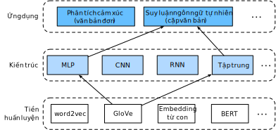
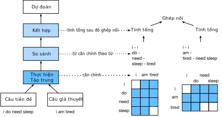

<!--
# Natural Language Inference: Using Attention
-->

# Suy luận Ngôn ngữ Tự nhiên: Sử dụng Cơ chế Tập trung
:label:`sec_natural-language-inference-attention`


<!--
We introduced the natural language inference task and the SNLI dataset in :numref:`sec_natural-language-inference-and-dataset`.
In view of many models that are based on complex and deep architectures, 
Parikh et al. proposed to address natural language inference with attention mechanisms and called it a "decomposable attention model" :cite:`Parikh.Tackstrom.Das.ea.2016`.
This results in a model without recurrent or convolutional layers, achieving the best result at the time on the SNLI dataset with much fewer parameters.
In this section, we will describe and implement this attention-based method (with MLPs) for natural language inference, as depicted in :numref:`fig_nlp-map-nli-attention`.
-->

Chúng tôi đã giới thiệu tác vụ suy luận ngôn ngữ tự nhiên và tập dữ liệu SNLI trong :numref:`sec_natural-language-inference-and-dataset`. 
Trong nhiều mô hình dựa trên các kiến trúc sâu và phức tạp,
Parikh và các cộng sự đề xuất hướng giải quyết bài toán suy luận ngôn ngữ tự nhiên bằng cơ chế tập trung và gọi nó là một "mô hình tập trung có thể phân tách" (*decomposable attention model*) :cite:`Parikh.Tackstrom.Das.ea.2016`. 
Điều này dẫn đến một mô hình không có các tầng truy hồi hay tích chập, nhưng đạt được kết quả tốt nhất vào thời điểm đó trên tập dữ liệu SNLI với lượng tham số ít hơn nhiều. 
Trong phần này, chúng tôi sẽ mô tả và lập trình phương pháp dựa trên cơ chế tập trung (cùng với MLP) để suy luận ngôn ngữ tự nhiên, như minh họa trong :numref:`fig_nlp-map-nli-attention`. 


<!--

-->


:label:`fig_nlp-map-nli-attention`


<!--
## The Model
-->

## Mô hình


<!--
Simpler than preserving the order of words in premises and hypotheses,
we can just align words in one text sequence to every word in the other, and vice versa,
then compare and aggregate such information to predict the logical relationships between premises and hypotheses.
Similar to alignment of words between source and target sentences in machine translation,
the alignment of words between premises and hypotheses can be neatly accomplished by attention mechanisms.
-->

Đơn giản hơn so với việc duy trì thứ tự của các từ trong các tiền đề và giả thuyết, 
ta có thể căn chỉnh các từ trong một chuỗi văn bản với mọi từ trong chuỗi khác và ngược lại, 
rồi so sánh và kết hợp các thông tin đó để dự đoán mối quan hệ logic giữa tiền đề và giả thuyết. 
Tương tự như việc căn chỉnh các từ giữa câu nguồn và đích trong dịch máy,
việc căn chỉnh các từ giữa tiền đề và giả thuyết có thể được thực hiện nhanh gọn nhờ cơ chế tập trung. 

<!--

-->


:label:`fig_nli_attention`


<!--
:numref:`fig_nli_attention` depicts the natural language inference method using attention mechanisms.
At a high level, it consists of three jointly trained steps: attending, comparing, and aggregating.
We will illustrate them step by step in the following.
-->

:numref:`fig_nli_attention` minh họa phương pháp suy luận ngôn ngữ tự nhiên sử dụng cơ chế tập trung.
Ở mức cao, nó bao gồm ba bước huấn luyện phối hợp: thực hiện tập trung, so sánh, và kết hợp.
Ta sẽ từng bước mô tả chúng trong phần tiếp theo.


```{.python .input  n=1}
from d2l import mxnet as d2l
import mxnet as mx
from mxnet import autograd, gluon, init, np, npx
from mxnet.gluon import nn

npx.set_np()
```


<!--
### Attending
-->

### Thực hiện Tập trung


<!--
The first step is to align words in one text sequence to each word in the other sequence.
Suppose that the premise is "i do need sleep" and the hypothesis is "i am tired".
Due to semantical similarity, we may wish to align "i" in the hypothesis with "i" in the premise,
and align "tired" in the hypothesis with "sleep" in the premise.
Likewise, we may wish to align "i" in the premise with "i" in the hypothesis,
and align "need" and "sleep" in the premise with "tired" in the hypothesis.
Note that such alignment is *soft* using weighted average,
where ideally large weights are associated with the words to be aligned.
For ease of demonstration, :numref:`fig_nli_attention` shows such alignment in a *hard* way.
-->

Bước đầu tiên là phải căn chỉnh các từ trong một chuỗi văn bản với một chuỗi khác. 
Giả sử câu tiền đề là "i do need sleep" và câu giả thuyết là "i am tired". 
Do sự tương đồng về ngữ nghĩa, ta mong muốn căn chỉnh "i" trong câu giả thuyết với "i" trong câu tiền đề, 
và căn chỉnh "tired" trong câu giả thuyết với "sleep" trong câu tiền đề.
Tương tự, ta muốn căn chỉnh "i" trong câu tiền đề với "i" trong câu giả thuyết, 
và căn chỉnh "need" và "sleep" trong câu tiền đề với "tired" trong câu giả thuyết. 
Lưu ý là sự căn chỉnh này là *mềm*, sử dụng trung bình có trọng số, 
trong đó các trọng số nên có độ lớn hợp lý ứng với các từ được căn chỉnh. 
Để dễ dàng cho việc minh họa, :numref:`fig_nli_attention` diễn tả sự căn chỉnh này theo cách *cứng*. 


<!--
Now we describe the soft alignment using attention mechanisms in more detail.
Denote by $\mathbf{A} = (\mathbf{a}_1, \ldots, \mathbf{a}_m)$
and $\mathbf{B} = (\mathbf{b}_1, \ldots, \mathbf{b}_n)$ the premise and hypothesis, 
whose number of words are $m$ and $n$, respectively,
where $\mathbf{a}_i, \mathbf{b}_j \in \mathbb{R}^{d}$ ($i = 1, \ldots, m, j = 1, \ldots, n$) is a $d$-dimensional word embedding vector.
For soft alignment, we compute the attention weights $e_{ij} \in \mathbb{R}$ as
-->

Bây giờ ta mô tả sự căn chỉnh mềm sử dụng cơ chế tập trung chi tiết hơn.
Ký hiệu $\mathbf{A} = (\mathbf{a}_1, \ldots, \mathbf{a}_m)$ 
và $\mathbf{B} = (\mathbf{b}_1, \ldots, \mathbf{b}_n)$ là câu tiền đề và câu giả thuyết, 
với số từ lần lượt là $m$ và $n$.
Ở đây $\mathbf{a}_i, \mathbf{b}_j \in \mathbb{R}^{d}$ ($i = 1, \ldots, m, j = 1, \ldots, n$) là một vector embedding từ $d$-chiều. 
Để căn chỉnh mềm, ta tính trọng số tập trung $e_{ij} \in \mathbb{R}$ như sau


$$e_{ij} = f(\mathbf{a}_i)^\top f(\mathbf{b}_j),$$
:eqlabel:`eq_nli_e`


<!--
where the function $f$ is an MLP defined in the following `mlp` function.
The output dimension of $f$ is specified by the `num_hiddens` argument of `mlp`.
-->

ở đây hàm $f$ là một MLP được định nghĩa theo hàm `mlp`.
Chiều đầu ra của $f$ được thiết lập bởi đối số `num_hiddens` của hàm `mlp`.


```{.python .input  n=2}
def mlp(num_hiddens, flatten):
    net = nn.Sequential()
    net.add(nn.Dropout(0.2))
    net.add(nn.Dense(num_hiddens, activation='relu', flatten=flatten))
    net.add(nn.Dropout(0.2))
    net.add(nn.Dense(num_hiddens, activation='relu', flatten=flatten))
    return net
```


<!--
It should be highlighted that, in :eqref:`eq_nli_e`
$f$ takes inputs $\mathbf{a}_i$ and $\mathbf{b}_j$ separately rather than takes a pair of them together as the input.
This *decomposition* trick leads to only $m + n$ applications (linear complexity) of $f$ rather than $mn$ applications
(quadratic complexity).
-->

Cũng nên chú ý rằng, trong :eqref:`eq_nli_e` 
$f$ nhận hai đầu vào $\mathbf{a}_i$ và $\mathbf{b}_j$ riêng biệt thay vì nhận cả cặp làm đầu vào. 
Thủ thuật *phân tách* này dẫn tới việc chỉ có $m + n$ lần tính (độ phức tạp tuyến tính) $f$ thay vì $mn$ (độ phức tạp bậc hai). 

<!--
Normalizing the attention weights in :eqref:`eq_nli_e`,
we compute the weighted average of all the word embeddings in the hypothesis
to obtain representation of the hypothesis that is softly aligned with the word indexed by $i$ in the premise:
-->

Thực hiện chuẩn hóa các trọng số tập trung trong :eqref:`eq_nli_e`, 
ta tính trung bình có trọng số của tất cả các embedding từ trong câu giả thuyết 
để thu được biểu diễn của câu giả thuyết được căn chỉnh mềm với từ được đánh chỉ số $i$ trong câu tiền đề: 


$$
\boldsymbol{\beta}_i = \sum_{j=1}^{n}\frac{\exp(e_{ij})}{ \sum_{k=1}^{n} \exp(e_{ik})} \mathbf{b}_j.
$$


<!--
Likewise, we compute soft alignment of premise words for each word indexed by $j$ in the hypothesis:
-->

Tương tự, ta tính sự căn chỉnh mềm của các từ trong câu tiền đề cho mỗi từ được đánh chỉ số $j$ trong câu giả thuyết: 


$$
\boldsymbol{\alpha}_j = \sum_{i=1}^{m}\frac{\exp(e_{ij})}{ \sum_{k=1}^{m} \exp(e_{kj})} \mathbf{a}_i.
$$


<!--
Below we define the `Attend` class to compute the soft alignment of hypotheses (`beta`) 
with input premises `A` and soft alignment of premises (`alpha`) with input hypotheses `B`.
-->

Dưới đây ta định nghĩa lớp `Attend` để tính sự căn chỉnh mềm của các câu giả thuyết (`beta`) 
với các câu tiền đề đầu vào `A` và sự căn chỉnh mềm của các câu tiền đề (`alpha`) với các câu giả thuyết `B`. 


```{.python .input  n=3}
class Attend(nn.Block):
    def __init__(self, num_hiddens, **kwargs):
        super(Attend, self).__init__(**kwargs)
        self.f = mlp(num_hiddens=num_hiddens, flatten=False)

    def forward(self, A, B):
        # Shape of `A`/`B`: (b`atch_size`, no. of words in sequence A/B,
        # `embed_size`)
        # Shape of `f_A`/`f_B`: (`batch_size`, no. of words in sequence A/B,
        # `num_hiddens`)
        f_A = self.f(A)
        f_B = self.f(B)
        # Shape of `e`: (`batch_size`, no. of words in sequence A,
        # no. of words in sequence B)
        e = npx.batch_dot(f_A, f_B, transpose_b=True)
        # Shape of `beta`: (`batch_size`, no. of words in sequence A,
        # `embed_size`), where sequence B is softly aligned with each word
        # (axis 1 of `beta`) in sequence A
        beta = npx.batch_dot(npx.softmax(e), B)
        # Shape of `alpha`: (`batch_size`, no. of words in sequence B,
        # `embed_size`), where sequence A is softly aligned with each word
        # (axis 1 of `alpha`) in sequence B
        alpha = npx.batch_dot(npx.softmax(e.transpose(0, 2, 1)), A)
        return beta, alpha
```


<!--
### Comparing
-->

### So sánh


<!--
In the next step, we compare a word in one sequence with the other sequence that is softly aligned with that word. 
Note that in soft alignment, all the words from one sequence, 
though with probably different attention weights, will be compared with a word in the other sequence.
For easy of demonstration, :numref:`fig_nli_attention` pairs words with aligned words in a *hard* way.
For example, suppose that the attending step determines that "need" and "sleep" in the premise are 
both aligned with "tired" in the hypothesis, the pair "tired--need sleep" will be compared.
-->

Bước tiếp theo, chúng ta so sánh một từ trong chuỗi với chuỗi khác được căn chỉnh mềm với từ đó.  
Lưu ý rằng trong "căn chỉnh mềm", tất cả từ đều đến từ một chuỗi, tuy nhiên do có những trọng số tập trung khác nhau, chúng sẽ được so sánh với một từ trong chuỗi khác. 
Để dễ minh hoạ, :numref:`fig_nli_attention` ghép đôi từ với các từ được căn chỉnh *cứng*. 
Ví dụ, giả sử bước tập trung xác định rằng "need" và "sleep" trong câu tiền đề đều được căn chỉnh với "tired" trong câu giả thuyết, thì cặp "tired--need sleep" sẽ được so sánh.  


<!--
In the comparing step, we feed the concatenation (operator $[\cdot, \cdot]$) of words from one sequence 
and aligned words from the other sequence into a function $g$ (an MLP):
-->

Tại bước so sánh, chúng ta đưa những từ đã được ghép nối (toán tử $[\cdot, \cdot]$) và những từ đã căn chỉnh của chuỗi còn lại vào hàm $g$ (một MLP): 


$$\mathbf{v}_{A,i} = g([\mathbf{a}_i, \boldsymbol{\beta}_i]), i = 1, \ldots, m\\ \mathbf{v}_{B,j} = g([\mathbf{b}_j, \boldsymbol{\alpha}_j]), j = 1, \ldots, n.$$
:eqlabel:`eq_nli_v_ab`


<!--
In :eqref:`eq_nli_v_ab`, $\mathbf{v}_{A,i}$ is the comparison between word $i$ in the premise and all the hypothesis words that are softly aligned with word $i$; 
while $\mathbf{v}_{B,j}$ is the comparison between word $j$ in the hypothesis and all the premise words that are softly aligned with word $j$.
The following `Compare` class defines such as comparing step.
-->

Trong :eqref:`eq_nli_v_ab`, $\mathbf{v}_{A,i}$ là phép so sánh giữa từ thứ $i$ của câu tiền đề và tất cả các từ trong câu giả thuyết được căn chỉnh mềm với từ thứ $i$; 
trong khi $\mathbf{v}_{B,j}$ lại là phép so sánh giữa từ thứ $j$ trong câu giả thuyết và tất cả từ trong câu tiền đề được căn chỉnh mềm với từ thứ $j$.
Lớp `Compare` sau định nghĩa bước so sánh này. 


```{.python .input  n=4}
class Compare(nn.Block):
    def __init__(self, num_hiddens, **kwargs):
        super(Compare, self).__init__(**kwargs)
        self.g = mlp(num_hiddens=num_hiddens, flatten=False)

    def forward(self, A, B, beta, alpha):
        V_A = self.g(np.concatenate([A, beta], axis=2))
        V_B = self.g(np.concatenate([B, alpha], axis=2))
        return V_A, V_B
```


<!--
### Aggregating
-->

### Tổng hợp


<!--
With two sets of comparison vectors $\mathbf{v}_{A,i}$ ($i = 1, \ldots, m$) and $\mathbf{v}_{B,j}$ ($j = 1, \ldots, n$) on hand,
in the last step we will aggregate such information to infer the logical relationship.
We begin by summing up both sets:
-->

Với hai tập vector so sánh $\mathbf{v}_{A,i}$ ($i = 1, \ldots, m$) và $\mathbf{v}_{B, j}$ ($j = 1 , \ldots, n$) trong tay, 
ta sẽ tổng hợp các thông tin đó để suy ra mối quan hệ logic tại bước cuối cùng. 
Chúng ta bắt đầu bằng cách lấy tổng trên cả hai tập: 


$$
\mathbf{v}_A = \sum_{i=1}^{m} \mathbf{v}_{A,i}, \quad \mathbf{v}_B = \sum_{j=1}^{n}\mathbf{v}_{B,j}.
$$


<!--
Next we feed the concatenation of both summarization results into function $h$ (an MLP) to obtain the classification result of the logical relationship:
-->
Tiếp theo, chúng ta ghép nối hai kết quả tổng rồi đưa vào hàm $h$ (một MLP) để thu được kết quả phân loại của mối quan hệ logic: 


$$
\hat{\mathbf{y}} = h([\mathbf{v}_A, \mathbf{v}_B]).
$$


<!--
The aggregation step is defined in the following `Aggregate` class.
-->

Bước tổng hợp được định nghĩa trong lớp `Aggregate` sau đây. 


```{.python .input  n=5}
class Aggregate(nn.Block):
    def __init__(self, num_hiddens, num_outputs, **kwargs):
        super(Aggregate, self).__init__(**kwargs)
        self.h = mlp(num_hiddens=num_hiddens, flatten=True)
        self.h.add(nn.Dense(num_outputs))

    def forward(self, V_A, V_B):
        # Sum up both sets of comparison vectors
        V_A = V_A.sum(axis=1)
        V_B = V_B.sum(axis=1)
        # Feed the concatenation of both summarization results into an MLP
        Y_hat = self.h(np.concatenate([V_A, V_B], axis=1))
        return Y_hat
```


<!--
### Putting All Things Together
-->

### Kết hợp tất cả lại


<!--
By putting the attending, comparing, and aggregating steps together,
we define the decomposable attention model to jointly train these three steps.
-->

Bằng cách gộp các bước thực hiện tập trung, so sánh và tổng hợp lại với nhau,
ta định nghĩa mô hình tập trung có thể phân tách để cùng huấn luyện cả ba bước này.


```{.python .input  n=6}
class DecomposableAttention(nn.Block):
    def __init__(self, vocab, embed_size, num_hiddens, **kwargs):
        super(DecomposableAttention, self).__init__(**kwargs)
        self.embedding = nn.Embedding(len(vocab), embed_size)
        self.attend = Attend(num_hiddens)
        self.compare = Compare(num_hiddens)
        # There are 3 possible outputs: entailment, contradiction, and neutral
        self.aggregate = Aggregate(num_hiddens, 3)

    def forward(self, X):
        premises, hypotheses = X
        A = self.embedding(premises)
        B = self.embedding(hypotheses)
        beta, alpha = self.attend(A, B)
        V_A, V_B = self.compare(A, B, beta, alpha)
        Y_hat = self.aggregate(V_A, V_B)
        return Y_hat
```


<!--
## Training and Evaluating the Model
-->

## Huấn luyện và Đánh giá Mô hình


<!--
Now we will train and evaluate the defined decomposable attention model on the SNLI dataset.
We begin by reading the dataset.
-->

Bây giờ ta sẽ huấn luyện và đánh giá mô hình tập trung có thế phân tách vừa được định nghĩa trên tập dữ liệu SNLI.
Ta bắt đầu bằng việc đọc tập dữ liệu. 

<!--
### Reading the dataset
-->

### Đọc tập dữ liệu


<!--
We download and read the SNLI dataset using the function defined in :numref:`sec_natural-language-inference-and-dataset`.
The batch size and sequence length are set to $256$ and $50$, respectively.
-->

Ta tải xuống và đọc tập dữ liệu SNLI bằng hàm định nghĩa trong :numref:`sec_natural-language-inference-and-dataset`. 
Kích thước batch và độ dài chuỗi được đặt là $256$ và $50$. 


```{.python .input  n=7}
batch_size, num_steps = 256, 50
train_iter, test_iter, vocab = d2l.load_data_snli(batch_size, num_steps)
```


<!--
### Creating the Model
-->

### Tạo mô hình


<!--
We use the pretrained $100$-dimensional GloVe embedding to represent the input tokens.
Thus, we predefine the dimension of vectors $\mathbf{a}_i$ and $\mathbf{b}_j$ in :eqref:`eq_nli_e` as $100$.
The output dimension of functions $f$ in :eqref:`eq_nli_e` and $g$ in :eqref:`eq_nli_v_ab` is set to $200$.
Then we create a model instance, initialize its parameters,
and load the GloVe embedding to initialize vectors of input tokens.
-->

Ta sử dụng embedding GloVe $100$-chiều đã tiền huấn luyện để biểu diễn các token đầu vào.
Do đó, ta định nghĩa trước chiều của các vector $\mathbf{a}_i$ và $\mathbf{b}_j$ trong :eqref:`eq_nli_e` là $100$.
Chiều đầu ra của hàm $f$ trong :eqref:`eq_nli_e` và $g$ trong :eqref:`eq_nli_v_ab` được đặt bằng $200$.
Sau đó ta tạo thực thể của mô hình, khởi tạo tham số,
và nạp embedding GloVe để khởi tạo các vector token đầu vào.


```{.python .input  n=8}
embed_size, num_hiddens, devices = 100, 200, d2l.try_all_gpus()
net = DecomposableAttention(vocab, embed_size, num_hiddens)
net.initialize(init.Xavier(), ctx=devices)
glove_embedding = d2l.TokenEmbedding('glove.6b.100d')
embeds = glove_embedding[vocab.idx_to_token]
net.embedding.weight.set_data(embeds)
```


<!--
### Training and Evaluating the Model
-->

### Huấn luyện và Đánh giá Mô hình


<!--
In contrast to the `split_batch` function in :numref:`sec_multi_gpu` that takes single inputs such as text sequences (or images),
we define a `split_batch_multi_inputs` function to take multiple inputs such as premises and hypotheses in minibatches.
-->

Trái ngược với hàm `split_batch` trong :numref:`sec_multi_gpu` nhận đầu vào đơn như một chuỗi văn bản (hoặc ảnh) chẳng hạn,
ta định nghĩa hàm `split_batch_multi_inputs` để nhận đa đầu vào, ví dụ như cặp tiền đề và giả thuyết ở trong các minibatch.


```{.python .input  n=10}
#@save
def split_batch_multi_inputs(X, y, devices):
    """Split multi-input `X` and `y` into multiple devices."""
    X = list(zip(*[gluon.utils.split_and_load(
        feature, devices, even_split=False) for feature in X]))
    return (X, gluon.utils.split_and_load(y, devices, even_split=False))
```


<!--
Now we can train and evaluate the model on the SNLI dataset.
-->

Giờ ta có thể huấn luyện và đánh giá mô hình trên tập dữ liệu SNLI. 


```{.python .input  n=11}
lr, num_epochs = 0.001, 4
trainer = gluon.Trainer(net.collect_params(), 'adam', {'learning_rate': lr})
loss = gluon.loss.SoftmaxCrossEntropyLoss()
d2l.train_ch13(net, train_iter, test_iter, loss, trainer, num_epochs, devices,
               split_batch_multi_inputs)
```


<!--
### Using the Model
-->

### Sử dụng Mô hình


<!--
Finally, define the prediction function to output the logical relationship between a pair of premise and hypothesis.
-->

Cuối cùng, ta định nghĩa hàm dự đoán để xuất ra mối quan hệ logic giữa cặp tiền đề và giả thuyết.


```{.python .input  n=14}
#@save
def predict_snli(net, vocab, premise, hypothesis):
    premise = np.array(vocab[premise], ctx=d2l.try_gpu())
    hypothesis = np.array(vocab[hypothesis], ctx=d2l.try_gpu())
    label = np.argmax(net([premise.reshape((1, -1)),
                           hypothesis.reshape((1, -1))]), axis=1)
    return 'entailment' if label == 0 else 'contradiction' if label == 1 \
            else 'neutral'
```


<!--
We can use the trained model to obtain the natural language inference result for a sample pair of sentences.
-->

Ta có thể sử dụng mô hình đã huấn luyện để thu được kết quả suy luận ngôn ngữ tự nhiên cho các cặp câu mẫu. 


```{.python .input  n=15}
predict_snli(net, vocab, ['he', 'is', 'good', '.'], ['he', 'is', 'bad', '.'])
```


## Tóm tắt

<!--
* The decomposable attention model consists of three steps for predicting the logical relationships between premises and hypotheses: attending, comparing, and aggregating.
* With attention mechanisms, we can align words in one text sequence to every word in the other, and vice versa.
Such alignment is soft using weighted average, where ideally large weights are associated with the words to be aligned.
* The decomposition trick leads to a more desirable linear complexity than quadratic complexity when computing attention weights.
* We can use pretrained word embedding as the input representation for downstream natural language processing task such as natural language inference.
-->

* Mô hình tập trung có thể phân tách bao gồm 3 bước để dự đoán mối quan hệ logic giữa cặp tiền đề và giả thuyết: thực hiện tập trung, so sánh và tổng hợp.
* Với cơ chế tập trung, ta có thể căn chỉnh các từ trong một chuỗi văn bản với tất cả các từ trong chuỗi văn bản còn lại, và ngược lại. 
Đây là kỹ thuật căn chỉnh mềm, sử dụng trung bình có trọng số, trong đó các trọng số có độ lớn hợp lý được gán với các từ sẽ được căn chỉnh.
* Thủ thuật phân tách tầng tập trung giúp giảm độ phức tạp thành tuyến tính thay vì là bậc hai khi tính toán trọng số tập trung. 
* Ta có thể sử dụng embedding từ đã tiền huấn luyện để biểu diễn đầu vào cho các tác vụ xử lý ngôn ngữ tự nhiên xuôi dòng, ví dụ như suy luận ngôn ngữ tự nhiên.


## Bài tập

<!--
1. Train the model with other combinations of hyperparameters. Can you get better accuracy on the test set?
2. What are major drawbacks of the decomposable attention model for natural language inference?
3. Suppose that we want to get the level of semantical similarity (e.g., a continuous value between $0$ and $1$) for any pair of sentences.
How shall we collect and label the dataset? Can you design a model with attention mechanisms?
-->

1. Huấn luyện mô hình với các tập siêu tham số khác nhau. Bạn có thể thu được độ chính xác cao hơn trên tập kiểm tra không? 
2. Những điểm hạn chế chính của mô hình tập trung kết hợp đối với suy luận ngôn ngữ tự nhiên là gì? 
3. Giả sử ta muốn tính độ tương tự ngữ nghĩa (một giá trị liên tục trong khoảng $0$ và $1$) cho một cặp câu bất kỳ. 
Ta sẽ thu thập và gán nhãn tập dữ liệu như thế nào? 
Bạn có thể thiết kế một mô hình với cơ chế tập trung không? 


## Thảo luận
* Tiếng Anh: [MXNet](https://discuss.d2l.ai/t/395)
* Tiếng Việt: [Diễn đàn Machine Learning Cơ Bản](https://forum.machinelearningcoban.com/c/d2l)


## Những người thực hiện
Bản dịch trong trang này được thực hiện bởi:

* Đoàn Võ Duy Thanh
* Nguyễn Mai Hoàng Long
* Phạm Đăng Khoa
* Lê Khắc Hồng Phúc
* Phạm Hồng Vinh
* Nguyễn Văn Cường
* Nguyễn Lê Quang Nhật
* Phạm Minh Đức

*Lần cập nhật gần nhất: 26/09/2020. (Cập nhật lần cuối từ nội dung gốc: 19/09/2020)*
