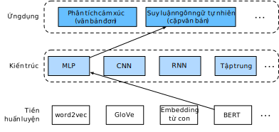

<!--
# Natural Language Inference: Fine-Tuning BERT
-->

# Suy luận Ngôn ngữ Tự nhiên: Tinh chỉnh BERT
:label:`sec_natural-language-inference-bert`


<!--
In earlier sections of this chapter, we have designed an attention-based architecture
(in :numref:`sec_natural-language-inference-attention`) for the natural language inference task
on the SNLI dataset (as described in :numref:`sec_natural-language-inference-and-dataset`).
Now we revisit this task by fine-tuning BERT.
As discussed in :numref:`sec_finetuning-bert`,
natural language inference is a sequence-level text pair classification problem,
and fine-tuning BERT only requires an additional MLP-based architecture, as illustrated in :numref:`fig_nlp-map-nli-bert`.
-->

Ở các phần đầu của chương này, ta đã thiết kế một kiến trúc dựa trên cơ chế tập trung
(trong :numref:`sec_natural-language-inference-attention`) cho tác vụ suy luận ngôn ngữ tự nhiên
trên tập dữ liệu SNLI (như được mô tả trong :numref:`sec_natural-language-inference-and-dataset`).
Bây giờ ta trở lại tác vụ này qua thực hiện tinh chỉnh BERT.
Như đã thảo luận trong :numref:`sec_finetuning-bert`,
suy luận ngôn ngữ tự nhiên là bài toán phân loại cặp văn bản ở cấp độ chuỗi, 
và việc tinh chỉnh BERT chỉ đòi hỏi thêm một kiến trúc bổ trợ dựa trên MLP, như minh họa trong :numref:`fig_nlp-map-nli-bert`. 


<!--

-->


:label:`fig_nlp-map-nli-bert`


<!--
In this section, we will download a pretrained small version of BERT,
then fine-tune it for natural language inference on the SNLI dataset.
-->

Trong phần này, chúng ta sẽ tải một phiên bản BERT đã tiền huấn luyện kích thước nhỏ, 
rồi tinh chỉnh nó để suy luận ngôn ngữ tự nhiên trên tập dữ liệu SNLI. 


```{.python .input  n=1}
from d2l import mxnet as d2l
import json
import multiprocessing
from mxnet import autograd, gluon, init, np, npx
from mxnet.gluon import nn
import os

npx.set_np()
```


<!--
## Loading Pretrained BERT
-->

## Nạp BERT đã Tiền huấn luyện


<!--
We have explained how to pretrain BERT on the WikiText-2 dataset in :numref:`sec_bert-dataset` and :numref:`sec_bert-pretraining`
(note that the original BERT model is pretrained on much bigger corpora).
As discussed in :numref:`sec_bert-pretraining`, the original BERT model has hundreds of millions of parameters.
In the following, we provide two versions of pretrained BERT:
"bert.base" is about as big as the original BERT base model that requires a lot of computational resources to fine-tune,
while "bert.small" is a small version to facilitate demonstration.
-->

Chúng ta đã giải thích cách tiền huấn luyện BERT trên tập dữ liệu WikiText-2 trong :numref:`sec_bert-dataset` và :numref:`sec_bert-pretraining`
(lưu ý rằng mô hình BERT ban đầu được tiền huấn luyện trên các kho ngữ liệu lớn hơn nhiều).
Ở thảo luận trong :numref:`sec_bert-pretraining`, mô hình BERT gốc có hàng trăm triệu tham số.
Trong phần sau đây, chúng tôi cung cấp hai phiên bản BERT tiền huấn luyện:
"bert.base" có kích thước xấp xỉ mô hình BERT cơ sở gốc, là mô hình đòi hỏi nhiều tài nguyên tính toán để tinh chỉnh,
trong khi "bert.small" là phiên bản nhỏ để thuận tiện cho việc minh họa.


```{.python .input  n=2}
d2l.DATA_HUB['bert.base'] = (d2l.DATA_URL + 'bert.base.zip',
                             '7b3820b35da691042e5d34c0971ac3edbd80d3f4')
d2l.DATA_HUB['bert.small'] = (d2l.DATA_URL + 'bert.small.zip',
                              'a4e718a47137ccd1809c9107ab4f5edd317bae2c')
```


<!--
Either pretrained BERT model contains a "vocab.json" file that defines the vocabulary set
and a "pretrained.params" file of the pretrained parameters.
We implement the following `load_pretrained_model` function to load pretrained BERT parameters.
-->

Cả hai mô hình BERT đã tiền huấn luyện đều chứa tập tin "vocab.json" định nghĩa tập từ vựng
và tập tin "pretrained.params" chứa các tham số tiền huấn luyện.
Ta thực hiện hàm `load_pretrained_model` sau đây để nạp các tham số đã tiền huấn luyện của BERT.


```{.python .input  n=3}
def load_pretrained_model(pretrained_model, num_hiddens, ffn_num_hiddens,
                          num_heads, num_layers, dropout, max_len, devices):
    data_dir = d2l.download_extract(pretrained_model)
    # Define an empty vocabulary to load the predefined vocabulary
    vocab = d2l.Vocab([])
    vocab.idx_to_token = json.load(open(os.path.join(data_dir, 'vocab.json')))
    vocab.token_to_idx = {token: idx for idx, token in enumerate(
        vocab.idx_to_token)}
    bert = d2l.BERTModel(len(vocab), num_hiddens, ffn_num_hiddens, num_heads, 
                         num_layers, dropout, max_len)
    # Load pretrained BERT parameters
    bert.load_parameters(os.path.join(data_dir, 'pretrained.params'),
                         ctx=devices)
    return bert, vocab
```


<!--
To facilitate demonstration on most of machines,
we will load and fine-tune the small version ("bert.small") of the pretrained BERT in this section.
In the exercise, we will show how to fine-tune the much larger "bert.base" to significantly improve the testing accuracy.
-->

Để thuận tiện biểu diễn trên hầu hết các phần cứng,
ta sẽ nạp và tinh chỉnh phiên bản nhỏ ("bert-small") của BERT đã tiền huấn luyện ở phần này. 
Phần bài tập sẽ hướng dẫn cách tinh chỉnh mô hình "bert-base" lớn hơn nhiều, để cải thiện đáng kể độ chính xác khi kiểm tra. 


```{.python .input  n=4}
devices = d2l.try_all_gpus()
bert, vocab = load_pretrained_model(
    'bert.small', num_hiddens=256, ffn_num_hiddens=512, num_heads=4,
    num_layers=2, dropout=0.1, max_len=512, devices=devices)
```


<!--
## The Dataset for Fine-Tuning BERT
-->

## Tập dữ liệu để Tinh chỉnh BERT


<!--
For the downstream task natural language inference on the SNLI dataset, we define a customized dataset class `SNLIBERTDataset`.
In each example, the premise and hypothesis form a pair of text sequence
and is packed into one BERT input sequence as depicted in :numref:`fig_bert-two-seqs`.
Recall :numref:`subsec_bert_input_rep` that segment IDs
are used to distinguish the premise and the hypothesis in a BERT input sequence.
With the predefined maximum length of a BERT input sequence (`max_len`),
the last token of the longer of the input text pair keeps getting removed until `max_len` is met.
To accelerate generation of the SNLI dataset for fine-tuning BERT,
we use 4 worker processes to generate training or testing examples in parallel.
-->

Đối với tác vụ xuôi dòng suy luận ngôn ngữ tự nhiên trên tập dữ liệu SNLI, ta định nghĩa một lớp `SNLIBERTDataset` là tập dữ liệu tuỳ biến. 
Trong mỗi mẫu, tiền đề và giả thuyết tạo thành một cặp chuỗi văn bản
và được đóng gói thành một chuỗi đầu vào BERT như được mô tả trong :numref:`fig_bert-two-seqs`. 
Nhắc lại :numref:`subsec_bert_input_rep`, ID của các đoạn đó
được sử dụng để phân biệt tiền đề và giả thuyết trong chuỗi đầu vào BERT.
Với độ dài tối đa đã định trước của chuỗi đầu vào BERT (`max_len`), 
token cuối cùng của đoạn dài hơn trong cặp văn bản đầu vào sẽ liên tục bị xóa cho đến khi độ dài của nó là `max_len`. 
Để tăng tốc quá trình tạo tập dữ liệu SNLI cho việc tinh chỉnh BERT,
ta sử dụng 4 tiến trình thợ để tạo ra các mẫu cho tập huấn luyện và tập kiểm tra một cách song song. 


```{.python .input  n=5}
class SNLIBERTDataset(gluon.data.Dataset):
    def __init__(self, dataset, max_len, vocab=None):
        all_premise_hypothesis_tokens = [[
            p_tokens, h_tokens] for p_tokens, h_tokens in zip(
            *[d2l.tokenize([s.lower() for s in sentences])
              for sentences in dataset[:2]])]
        
        self.labels = np.array(dataset[2])
        self.vocab = vocab
        self.max_len = max_len
        (self.all_token_ids, self.all_segments,
         self.valid_lens) = self._preprocess(all_premise_hypothesis_tokens)
        print('read ' + str(len(self.all_token_ids)) + ' examples')

    def _preprocess(self, all_premise_hypothesis_tokens):
        pool = multiprocessing.Pool(4)  # Use 4 worker processes
        out = pool.map(self._mp_worker, all_premise_hypothesis_tokens)
        all_token_ids = [
            token_ids for token_ids, segments, valid_len in out]
        all_segments = [segments for token_ids, segments, valid_len in out]
        valid_lens = [valid_len for token_ids, segments, valid_len in out]
        return (np.array(all_token_ids, dtype='int32'),
                np.array(all_segments, dtype='int32'), 
                np.array(valid_lens))

    def _mp_worker(self, premise_hypothesis_tokens):
        p_tokens, h_tokens = premise_hypothesis_tokens
        self._truncate_pair_of_tokens(p_tokens, h_tokens)
        tokens, segments = d2l.get_tokens_and_segments(p_tokens, h_tokens)
        token_ids = self.vocab[tokens] + [self.vocab['<pad>']] \
                             * (self.max_len - len(tokens))
        segments = segments + [0] * (self.max_len - len(segments))
        valid_len = len(tokens)
        return token_ids, segments, valid_len

    def _truncate_pair_of_tokens(self, p_tokens, h_tokens):
        # Reserve slots for '<CLS>', '<SEP>', and '<SEP>' tokens for the BERT
        # input
        while len(p_tokens) + len(h_tokens) > self.max_len - 3:
            if len(p_tokens) > len(h_tokens):
                p_tokens.pop()
            else:
                h_tokens.pop()

    def __getitem__(self, idx):
        return (self.all_token_ids[idx], self.all_segments[idx],
                self.valid_lens[idx]), self.labels[idx]

    def __len__(self):
        return len(self.all_token_ids)
```


<!--
After downloading the SNLI dataset, we generate training and testing examples
by instantiating the `SNLIBERTDataset` class.
Such examples will be read in minibatches during training and testing
of natural language inference.
-->

Sau khi tải xuống tập dữ liệu SNLI, ta tạo các mẫu huấn luyện và kiểm tra
bằng cách khởi tạo lớp `SNLIBERTDataset`.
Các mẫu đó sẽ được đọc từ các minibatch trong quá trình huấn luyện và kiểm tra
của suy luận ngôn ngữ tự nhiên.


```{.python .input  n=6}
# Reduce `batch_size` if there is an out of memory error. In the original BERT
# model, `max_len` = 512
batch_size, max_len, num_workers = 512, 128, d2l.get_dataloader_workers()
data_dir = d2l.download_extract('SNLI')
train_set = SNLIBERTDataset(d2l.read_snli(data_dir, True), max_len, vocab)
test_set = SNLIBERTDataset(d2l.read_snli(data_dir, False), max_len, vocab)
train_iter = gluon.data.DataLoader(train_set, batch_size, shuffle=True,
                                   num_workers=num_workers)
test_iter = gluon.data.DataLoader(test_set, batch_size,
                                  num_workers=num_workers)
```


<!--
## Fine-Tuning BERT
-->

## Tinh chỉnh BERT


<!--
As :numref:`fig_bert-two-seqs` indicates, fine-tuning BERT for natural language inference
requires only an extra MLP consisting of two fully-connected layers
(see `self.hidden` and `self.output` in the following `BERTClassifier` class).
This MLP transforms the BERT representation of the special “&lt;cls&gt;” token,
which encodes the information of both the premise and the hypothesis,
into three outputs of natural language inference:
entailment, contradiction, and neutral.
-->

Như :numref:`fig_bert-two-seqs` đã chỉ ra, tinh chỉnh BERT trong suy luận ngôn ngữ tự nhiên
chỉ yêu cầu thêm một perceptron đa tầng gồm hai tầng kết nối đầy đủ
(xem `self.hiised` và `self.output` trong lớp `BERTClassifier` bên dưới).
Perceptron đa tầng này biến đổi biểu diễn BERT của token đặc biệt “&lt;cls&gt;”,
là token mã hóa thông tin của cả tiền đề và giả thuyết,
thành ba đầu ra của suy luận ngôn ngữ tự nhiên: kéo theo, đối lập và trung tính.


```{.python .input  n=7}
class BERTClassifier(nn.Block):
    def __init__(self, bert):
        super(BERTClassifier, self).__init__()
        self.encoder = bert.encoder
        self.hidden = bert.hidden
        self.output = nn.Dense(3)

    def forward(self, inputs):
        tokens_X, segments_X, valid_lens_x = inputs
        encoded_X = self.encoder(tokens_X, segments_X, valid_lens_x)
        return self.output(self.hidden(encoded_X[:, 0, :]))
```


<!--
In the following, the pretrained BERT model `bert` is fed into the `BERTClassifier` instance `net` for the downstream application.
In common implementations of BERT fine-tuning, only the parameters of the output layer of the additional MLP (`net.output`) will be learned from scratch.
All the parameters of the pretrained BERT encoder (`net.encoder`) and the hidden layer of the additional MLP (`net.hidden`) will be fine-tuned.
-->

Sau đây, mô hình BERT đã tiền huấn luyện `bert` được đưa vào thực thể `net` của lớp `BERTClassifier` cho tác vụ xuôi dòng. 
Thông thường khi lập trình tinh chỉnh BERT, chỉ các tham số của tầng đầu ra của perception đa tầng bổ sung (`net.output`) mới được học từ đầu. 
Còn tất cả các tham số của bộ mã hóa BERT đã tiền huấn luyện (`net.encoder`) và tầng ẩn của perception đa tầng bổ sung (`net.hidden`) thì sẽ được tinh chỉnh. 


```{.python .input  n=8}
net = BERTClassifier(bert)
net.output.initialize(ctx=devices)
```


<!--
Recall that in :numref:`sec_bert` both the `MaskLM` class and the `NextSentencePred` class have parameters in their employed MLPs.
These parameters are part of those in the pretrained BERT model `bert`, and thus part of parameters in `net`.
However, such parameters are only for computing the masked language modeling loss and the next sentence prediction loss during pretraining.
These two loss functions are irrelevant to fine-tuning downstream applications, thus the parameters of the employed MLPs in 
`MaskLM` and `NextSentencePred` are not updated (staled) when BERT is fine-tuned.
-->

Nhớ lại rằng trong :numref:`sec_bert`, cả 2 lớp` MaskLM` và lớp `NextSentencePred` đều có các tham số của perceptron đa tầng mà chúng sử dụng.
Các tham số này là một phần của các tham số trong mô hình BERT đã tiền huấn luyện `bert`, và do đó là một phần của các tham số trong `net`.
Tuy nhiên, các tham số này chỉ được dùng để tính toán mất mát của mô hình ngôn ngữ có mặt nạ và mất mát khi dự đoán câu tiếp theo trong quá trình tiền huấn luyện.
Hai hàm mất mát này không liên quan đến việc tinh chỉnh trong các ứng dụng xuôi dòng, do đó các tham số của perceptron đa tầng dùng trong
`MaskLM` và `NextSentencePred` không được cập nhật khi tinh chỉnh BERT.


<!--
To allow parameters with stale gradients, the flag `ignore_stale_grad=True` is set in the `step` function of `d2l.train_batch_ch13`.
We use this function to train and evaluate the model `net` using the training set (`train_iter`) and the testing set (`test_iter`) of SNLI.
Due to the limited computational resources, the training and testing accuracy can be further improved: we leave its discussions in the exercises.
-->

Để cho phép sử dụng các tham số với gradient không cập nhật, ta đặt cờ `ignore_stale_grad = True` trong hàm `step` của `d2l.train_batch_ch13`.
Chúng ta sử dụng chức năng này để huấn luyện và đánh giá mô hình `net` bằng cách sử dụng tập huấn luyện (`train_iter`) và tập kiểm tra (`test_iter`) của SNLI.
Do hạn chế về tài nguyên tính toán, độ chính xác của việc huấn luyện và kiểm tra vẫn còn có thể được cải thiện hơn nữa: chúng sẽ thảo luận vấn đề này trong phần bài tập.


```{.python .input  n=46}
lr, num_epochs = 1e-4, 5
trainer = gluon.Trainer(net.collect_params(), 'adam', {'learning_rate': lr})
loss = gluon.loss.SoftmaxCrossEntropyLoss()
d2l.train_ch13(net, train_iter, test_iter, loss, trainer, num_epochs, devices,
               d2l.split_batch_multi_inputs)
```

## Tóm tắt

<!--
* We can fine-tune the pretrained BERT model for downstream applications, such as natural language inference on the SNLI dataset.
* During fine-tuning, the BERT model becomes part of the model for the downstream application.
Parameters that are only related to pretraining loss will not be updated during fine-tuning. 
-->

* Chúng ta có thể tinh chỉnh mô hình BERT đã tiền huấn luyện cho các ứng dụng xuôi dòng, chẳng hạn như suy luận ngôn ngữ tự nhiên trên tập dữ liệu SNLI.
* Trong quá trình tinh chỉnh, mô hình BERT trở thành một phần của mô hình ứng dụng xuôi dòng.
Các tham số chỉ liên quan đến phần mất mát trong tiền huấn luyện sẽ không được cập nhật trong quá trình tinh chỉnh.


## Bài tập

<!--
1. Fine-tune a much larger pretrained BERT model that is about as big as the original BERT base model if your computational resource allows. 
Set arguments in the `load_pretrained_model` function as: replacing 'bert.small' with 'bert.base', 
increasing values of `num_hiddens=256`, `ffn_num_hiddens=512`, `num_heads=4`, `num_layers=2` to `768`, `3072`, `12`, `12`, respectively. 
By increasing fine-tuning epochs (and possibly tuning other hyperparameters), can you get a testing accuracy higher than 0.86?
2. How to truncate a pair of sequences according to their ratio of length? 
Compare this pair truncation method and the one used in the `SNLIBERTDataset` class. What are their pros and cons?
-->

1. Hãy tinh chỉnh một mô hình BERT tiền huấn luyện lớn hơn, có kích thước tương đương với mô hình BERT cơ sở ban đầu, nếu tài nguyên tính toán của bạn cho phép.
Hãy thay đổi các đối số trong hàm `load_pretrained_model`: thay thế 'bert.small' bằng 'bert.base',
lần lượt tăng giá trị của `num_hiddens = 256`,` ffn_num_hiddens = 512`, `num_heads = 4`,` num_layers = 2` thành `768`,` 3072`, `12`,` 12`.
Bằng cách tăng số epoch khi tinh chỉnh (và có thể điều chỉnh các siêu tham số khác), có thể nhận được độ chính xác trên tập kiểm tra cao hơn 0,86 không?
2. Làm thế nào để cắt ngắn một cặp chuỗi theo tỉ lệ độ dài của chúng?
So sánh phương thức cắt ngắn cặp này và phương thức được sử dụng trong lớp `SNLIBERTDataset`. Ưu và nhược điểm của chúng là gì?


## Thảo luận
* Tiếng Anh: [MXNet](https://discuss.d2l.ai/t/397)
* Tiếng Việt: [Diễn đàn Machine Learning Cơ Bản](https://forum.machinelearningcoban.com/c/d2l)


## Những người thực hiện
Bản dịch trong trang này được thực hiện bởi:

* Đoàn Võ Duy Thanh
* Nguyễn Mai Hoàng Long
* Nguyễn Thái Bình
* Nguyễn Văn Cường
* Nguyễn Lê Quang Nhật
* Phạm Hồng Vinh

*Lần cập nhật gần nhất: 26/09/2020. (Cập nhật lần cuối từ nội dung gốc: 20/09/2020)*
