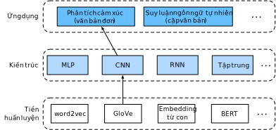
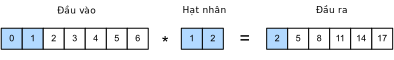
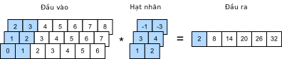
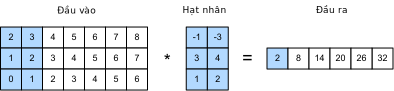
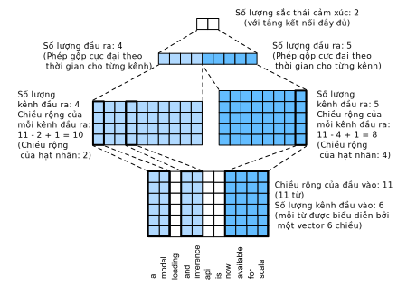

<!--
# Sentiment Analysis: Using Convolutional Neural Networks
-->

# Phân tích Cảm xúc: Sử dụng Mạng Nơ-ron Tích Chập
:label:`sec_sentiment_cnn`


<!--
In :numref:`chap_cnn`, we explored how to process two-dimensional image data with two-dimensional convolutional neural networks.
In the previous language models and text classification tasks, we treated text data as a time series with only one dimension, and naturally,
we used recurrent neural networks to process such data.
In fact, we can also treat text as a one-dimensional image, so that we can use one-dimensional
convolutional neural networks to capture associations between adjacent words. 
As described in :numref:`fig_nlp-map-sa-cnn` This section describes a groundbreaking approach to applying
convolutional neural networks to sentiment analysis: textCNN :cite:`Kim.2014`.
-->

Trong :numref:`chap_cnn`, chúng ta đã tìm hiểu cách xử lý dữ liệu ảnh hai chiều với mạng nơ-ron tích chập hai chiều.
Ở chương trước về các mô hình ngôn ngữ và các tác vụ phân loại văn bản, ta coi dữ liệu văn bản như là dữ liệu chuỗi thời gian với chỉ một chiều duy nhất, và vì vậy,
chúng sẽ được xử lí bằng mạng nơ-ron hồi tiếp.
Thực tế, ta cũng có thể coi văn bản như một bức ảnh một chiều, và sử dụng mạng nơ-ron tích chập một chiều để tìm ra mối liên kết giữa những từ liền kề nhau.
Như mô tả trong :numref:`fig_nlp-map-sa-cnn`, chương này sẽ miêu tả một hướng tiếp cận đột phá bằng cách áp dụng
mạng nơ-ron tích chập để phân tích cảm xúc: textCNN :cite:`Kim.2014`.


<!--

-->


:label:`fig_nlp-map-sa-cnn`


<!--
First, import the packages and modules required for the experiment.
-->

Đầu tiên, nhập những gói thư viện và mô-đun cần thiết cho thử nghiệm.


```{.python .input  n=1}
from d2l import mxnet as d2l
from mxnet import gluon, init, np, npx
from mxnet.gluon import nn
npx.set_np()

batch_size = 64
train_iter, test_iter, vocab = d2l.load_data_imdb(batch_size)
```


<!--
## One-Dimensional Convolutional Layer
-->

## Mạng Nơ-ron Tích chập Một chiều


<!--
Before introducing the model, let us explain how a one-dimensional convolutional layer works.
Like a two-dimensional convolutional layer, a one-dimensional convolutional layer uses a one-dimensional cross-correlation operation.
In the one-dimensional cross-correlation operation, the convolution window starts from 
the leftmost side of the input array and slides on the input array from left to right successively.
When the convolution window slides to a certain position, the input subarray in the window and kernel array 
are multiplied and summed by element to get the element at the corresponding location in the output array.
As shown in :numref:`fig_conv1d`, the input is a one-dimensional array with a width of 7 and the width of the kernel array is 2.
As we can see, the output width is $7-2+1=6$ and the first element is obtained by performing multiplication 
by element on the leftmost input subarray with a width of 2 and kernel array and then summing the results.
-->

Trước khi giới thiệu mô hình, chúng ta hãy xem mạng nơ-ron tích chập một chiều họat động như thế nào.
Tương tự như mạng nơ-ron tích chập hai chiều, mạng nơ-ron tích chập một chiều sử dụng phép tính tương quan chéo một chiều.
Trong phép tính tương quan chéo một chiều, cửa sổ tích chập bắt đầu từ phía ngoài cùng bên trái của mảng đầu vào và trượt lần lượt từ trái qua phải.
Xét trên một vị trí nhất định của cửa sổ tích chập khi trượt, ta nhân từng phần tử của mảng đầu vào con trong cửa sổ đó 
với mảng hạt nhân rồi cộng lại để lấy được phần tử ở vị trí tương ứng trong mảng đầu ra.
Như ví dụ ở :numref:`fig_conv1d`, đầu vào là một mảng một chiều với độ rộng là 7 và độ rộng của mảng hạt nhân là 2.
Ta có thể thấy rằng độ rộng của đầu ra là $7-2+1=6$ và phần tử đầu tiên được tính bằng cách nhân
theo từng phần tử mảng đầu vào con chứa 2 phần tử ngoài cùng bên trái với mảng hạt nhân, rồi cộng lại với nhau.


<!--

-->


:label:`fig_conv1d`


<!--
Next, we implement one-dimensional cross-correlation in the `corr1d` function.
It accepts the input array `X` and kernel array `K` and outputs the array `Y`.
-->

Tiếp theo, chúng ta sẽ lập trình phép tương quan chéo một chiều trong hàm `corr1d`. 
Hàm này nhận mảng đầu vào `X` và mảng hạt nhân `K` và cho ra đầu ra là mảng `Y`.


```{.python .input  n=2}
def corr1d(X, K):
    w = K.shape[0]
    Y = np.zeros((X.shape[0] - w + 1))
    for i in range(Y.shape[0]):
        Y[i] = (X[i: i + w] * K).sum()
    return Y
```


<!--
Now, we will reproduce the results of the one-dimensional cross-correlation operation in :numref:`fig_conv1d`.
-->

Bây giờ chúng ta sẽ tái tạo lại kết quả của phép tính tương quan chéo một chiều ở :numref:`fig_conv1d`. 


```{.python .input  n=3}
X, K = np.array([0, 1, 2, 3, 4, 5, 6]), np.array([1, 2])
corr1d(X, K)
```


<!--
The one-dimensional cross-correlation operation for multiple input channels is also similar to the two-dimensional cross-correlation operation for multiple input channels.
On each channel, it performs the one-dimensional cross-correlation operation on the kernel and its corresponding input and adds the results of the channels to get the output.
:numref:`fig_conv1d_channel` shows a one-dimensional cross-correlation operation with three input channels.
-->

Phép tính tương quan chéo một chiều cho nhiều kênh đầu vào cũng tương tự như phép tương quan chéo hai chiều cho nhiều kênh đầu vào.
Với mỗi kênh, toán tử này thực hiện phép tính tương quan chéo một chiều trên từng hạt nhân và đầu vào tương ứng, và cộng các kết quả trên từng kênh lại với nhau để thu được đầu ra.
:numref:`fig_conv1d_channel` minh họa phép tính tương quan chéo một chiều với ba kênh đầu vào.


<!--

-->


:label:`fig_conv1d_channel`


<!--
Now, we reproduce the results of the one-dimensional cross-correlation operation with multi-input channel in :numref:`fig_conv1d_channel`.
-->

Bây giờ, ta sẽ tái tạo lại kết quả của phép tính tương quan chéo một chiều với đa kênh đầu vào trong :numref:`fig_conv1d_channel`. 


```{.python .input  n=4}
def corr1d_multi_in(X, K):
    # First, we traverse along the 0th dimension (channel dimension) of `X`
    # and `K`. Then, we add them together by using * to turn the result list
    # into a positional argument of the `add_n` function
    return sum(corr1d(x, k) for x, k in zip(X, K))

X = np.array([[0, 1, 2, 3, 4, 5, 6],
              [1, 2, 3, 4, 5, 6, 7],
              [2, 3, 4, 5, 6, 7, 8]])
K = np.array([[1, 2], [3, 4], [-1, -3]])
corr1d_multi_in(X, K)
```


<!--
The definition of a two-dimensional cross-correlation operation tells us that a one-dimensional cross-correlation operation 
with multiple input channels can be regarded as a two-dimensional cross-correlation operation with a single input channel.
As shown in :numref:`fig_conv1d_2d`, we can also present the one-dimensional cross-correlation operation with 
multiple input channels in :numref:`fig_conv1d_channel` as the equivalent two-dimensional cross-correlation operation with a single input channel.
Here, the height of the kernel is equal to the height of the input.
-->

Định nghĩa phép tính tương quan chéo hai chiều cho ta thấy phép tính tương quan chéo một chiều với đa kênh đầu vào 
có thể được coi là phép tính tương quan chéo hai chiều với một kênh đầu vào. 
Như minh họa trong :numref:`fig_conv1d_2d`, ta có thể biểu diễn phép tính tương quan chéo một chiều 
với đa kênh đầu vào trong :numref:`fig_conv1d_channel` tương tự như phép tính tương quan chéo hai chiều với một kênh đầu vào. 
Ở đây, chiều cao của hạt nhân bằng với chiều cao của đầu vào. 


<!--

-->


:label:`fig_conv1d_2d`


<!--
Both the outputs in :numref:`fig_conv1d` and :numref:`fig_conv1d_channel` have only one channel.
We discussed how to specify multiple output channels in a two-dimensional convolutional layer in :numref:`sec_channels`.
Similarly, we can also specify multiple output channels in the one-dimensional
convolutional layer to extend the model parameters in the convolutional layer.
-->

Cả hai đầu ra trong :numref:`fig_conv1d` và :numref:`fig_conv1d_channel` chỉ có một kênh.
Ta đã thảo luận cách chỉ định đa kênh đầu ra trong tầng tích chập hai chiều tại :numref:`sec_channels`.
Tương tự, ta cũng có thể chỉ định đa kênh đầu ra trong tầng tích chập một chiều để mở rộng các tham số mô hình trong tầng tích chập đó.


<!--
## Max-Over-Time Pooling Layer
-->

## Tầng Gộp Cực đại Theo Thời gian

<!--
Similarly, we have a one-dimensional pooling layer.
The max-over-time pooling layer used in TextCNN actually corresponds to a one-dimensional global maximum pooling layer.
Assuming that the input contains multiple channels, and each channel consists of values on different time steps, 
the output of each channel will be the largest value of all time steps in the channel.
Therefore, the input of the max-over-time pooling layer can have different time steps on each channel.
-->

Tương tự, ta có tầng gộp một chiều. 
Tầng gộp cực đại theo thời gian được dùng trong TextCNN thực chất tương tự như tầng gộp cực đại toàn cục một chiều.
Giả sử đầu vào có nhiều kênh, mỗi kênh bao gồm các giá trị bước thời gian khác nhau, đầu ra của mỗi kênh sẽ là giá trị lớn nhất qua tất cả bước thời gian trong từng kênh.
Do đó, đầu vào của tầng gộp cực đại theo thời gian có thể có số lượng bước thời gian khác nhau tại mỗi kênh.

<!--
To improve computing performance, we often combine timing examples of different lengths into a minibatch 
and make the lengths of each timing example in the batch consistent by appending special characters (such as 0) to the end of shorter examples.
Naturally, the added special characters have no intrinsic meaning.
Because the main purpose of the max-over-time pooling layer is to capture the most important features of timing, 
it usually allows the model to be unaffected by the manually added characters.
-->

Để cải thiện chất lượng tính toán, ta thường kết hợp những mẫu thời gian có độ dài khác nhau vào một minibatch 
và làm cho chiều dài theo thời gian của từng mẫu đồng nhất bằng cách thêm các ký tự đặc biệt (ví dụ 0) vào cuối những mẫu ngắn hơn. 
Tất nhiên, các ký tự được thêm vào không làm thay đổi bản chất ngữ nghĩa.
Bởi vì, mục tiêu chính của tầng gộp cực đại theo thời gian là học được những đặc trưng quan trọng của thời gian, 
thông thường điều đó cho phép mô hình không bị ảnh hưởng bởi các ký tự được thêm vào thủ công. 


<!--
## The TextCNN Model
-->

## Mô hình TextCNN


<!--
TextCNN mainly uses a one-dimensional convolutional layer and max-over-time pooling layer.
Suppose the input text sequence consists of $n$ words, and each word is represented by a $d$-dimension word vector.
Then the input example has a width of $n$, a height of 1, and $d$ input channels.
The calculation of textCNN can be mainly divided into the following steps:
-->

TextCNN chủ yếu sử dụng tầng tích chập một chiều và tầng gộp cực đại theo thời gian. 
Giả sử chuỗi văn bản đầu vào gồm $n$ từ, mỗi từ được biểu diễn bởi một vector $d$ chiều. 
Lúc này mẫu đầu vào có chiều rộng là $n$, chiều cao là 1, và $d$ kênh đầu vào. 
Quá trình tính toán của textCNN chủ yếu được chia thành các bước sau: 

<!--
1. Define multiple one-dimensional convolution kernels and use them to perform convolution calculations on the inputs. 
Convolution kernels with different widths may capture the correlation of different numbers of adjacent words.
2. Perform max-over-time pooling on all output channels, and then concatenate the pooling output values of these channels in a vector.
3. The concatenated vector is transformed into the output for each category through the fully connected layer. 
A dropout layer can be used in this step to deal with overfitting.
-->

1. Định nghĩa nhiều hạt nhân tích chập một chiều để thực hiện các phép tính tích chập trên đầu vào.
Những hạt nhân tích chập với độ rộng khác nhau có thể học được sự tương quan của các cụm từ liền kề với số lượng khác nhau.
2. Thực hiện gộp cực đại theo thời gian trên tất cả các kênh đầu ra, sau đó nối các giá trị gộp được của các kênh này thành một vector.
3. Vector nối trên sẽ được biến đổi thành đầu ra cho từng hạng mục bằng thông qua tầng kết nối đầy đủ.
Tầng dropout có thể được sử dụng ở bước này để giải quyết tình trạng quá khớp.

<!--

-->


:label:`fig_conv1d_textcnn`


<!--
:numref:`fig_conv1d_textcnn` gives an example to illustrate the textCNN.
The input here is a sentence with 11 words, with each word represented by a 6-dimensional word vector.
Therefore, the input sequence has a width of 11 and 6 input channels
We assume there are two one-dimensional convolution kernels with widths of 2 and 4, and 4 and 5 output channels, respectively.
Therefore, after one-dimensional convolution calculation, the width of the four output channels is $11-2+1=10$, 
while the width of the other five channels is $11-4+1=8$.
Even though the width of each channel is different, we can still perform max-over-time pooling 
for each channel and concatenate the pooling outputs of the 9 channels into a 9-dimensional vector.
Finally, we use a fully connected layer to transform the 9-dimensional vector 
into a 2-dimensional output: positive sentiment and negative sentiment predictions.
-->

:numref:`fig_conv1d_textcnn` minh họa một ví dụ cho textCNN.
Đầu vào ở đây là một câu gồm 11 từ, với mỗi từ được biểu diễn bằng một vector từ 6 chiều.
Vì vậy, câu đầu vào có độ rộng là 11 và số kênh đầu vào là 6.
Chúng ta giả sử rằng 2 hạt nhân tích chập một chiều có độ rộng lần lượt là 2 và 4, tương ứng với số kênh đầu ra là 4 và 5.
Cho nên sau phép tính tích chập một chiều, đầu ra 4 kênh có chiều rộng là là $11-2+1=10$,
trong khi đó độ rộng của đầu ra 5 kênh còn lại là $11-4+1=8$.
Thậm chí độ rộng của mỗi kênh có khác nhau đi nữa, chúng ta vẫn có thể thực hiện gộp cực đại theo thời gian
cho mỗi kênh và nối đầu ra sau gộp của 9 kênh thành một vector 9 chiều.
Cuối cùng, chúng ta dùng một tầng kết nối đầy đủ để biến đổi vector 9 chiều đó
thành một đầu ra 2 chiều: dự đoán cảm xúc tích cực và cảm xúc tiêu cực.


<!--
Next, we will implement a textCNN model.
Compared with the previous section, in addition to replacing the recurrent neural network with a one-dimensional convolutional layer,
here we use two embedding layers, one with a fixed weight and another that participates in training.
-->

Tiếp theo chúng ta bắt đầu lập trình mô hình textCNN. 
So với phần trước, ngoài việc thay mạng nơ-ron hồi tiếp bằng một tầng tích chập một chiều,
ở đây chúng ta dùng 2 tầng embedding, một được giữ trọng số cố định và tầng còn lại tham gia quá trình huấn luyện. 


```{.python .input  n=5}
class TextCNN(nn.Block):
    def __init__(self, vocab_size, embed_size, kernel_sizes, num_channels,
                 **kwargs):
        super(TextCNN, self).__init__(**kwargs)
        self.embedding = nn.Embedding(vocab_size, embed_size)
        # The embedding layer does not participate in training
        self.constant_embedding = nn.Embedding(vocab_size, embed_size)
        self.dropout = nn.Dropout(0.5)
        self.decoder = nn.Dense(2)
        # The max-over-time pooling layer has no weight, so it can share an
        # instance
        self.pool = nn.GlobalMaxPool1D()
        # Create multiple one-dimensional convolutional layers
        self.convs = nn.Sequential()
        for c, k in zip(num_channels, kernel_sizes):
            self.convs.add(nn.Conv1D(c, k, activation='relu'))

    def forward(self, inputs):
        # Concatenate the output of two embedding layers with shape of
        # (batch size, no. of words, word vector dimension) by word vector
        embeddings = np.concatenate((
            self.embedding(inputs), self.constant_embedding(inputs)), axis=2)
        # According to the input format required by Conv1D, the word vector
        # dimension, that is, the channel dimension of the one-dimensional
        # convolutional layer, is transformed into the previous dimension
        embeddings = embeddings.transpose(0, 2, 1)
        # For each one-dimensional convolutional layer, after max-over-time
        # pooling, an ndarray with the shape of (batch size, channel size, 1)
        # can be obtained. Use the flatten function to remove the last
        # dimension and then concatenate on the channel dimension
        encoding = np.concatenate([
            np.squeeze(self.pool(conv(embeddings)), axis=-1)
            for conv in self.convs], axis=1)
        # After applying the dropout method, use a fully connected layer to
        # obtain the output
        outputs = self.decoder(self.dropout(encoding))
        return outputs
```


<!--
Create a TextCNN instance. It has 3 convolutional layers with kernel widths of 3, 4, and 5, all with 100 output channels.
-->

Tạo một thực thể TextCNN có 3 tầng tích chập với chiều rộng hạt nhân là 3, 4 và 5, tất cả đều có 100 kênh đầu ra. 


```{.python .input  n=6}
embed_size, kernel_sizes, nums_channels = 100, [3, 4, 5], [100, 100, 100]
devices = d2l.try_all_gpus()
net = TextCNN(len(vocab), embed_size, kernel_sizes, nums_channels)
net.initialize(init.Xavier(), ctx=devices)
```


<!--
### Load Pre-trained Word Vectors
-->

### Nạp Vector Từ đã được Tiền huấn luyện


<!--
As in the previous section, load pre-trained 100-dimensional GloVe word vectors and initialize the embedding layers `embedding` and `constant_embedding`.
Here, the former participates in training while the latter has a fixed weight.
-->

Tương tự phần trước, ta nạp GloVe 100 chiều đã được tiền huấn luyện và khởi tạo các tầng embedding `embedding` và `constant_embedding`.
Ở đây, `embedding` sẽ tham gia quá trình huấn luyện trong khi `constant_embedding` có trọng số cố định.


```{.python .input  n=7}
glove_embedding = d2l.TokenEmbedding('glove.6b.100d')
embeds = glove_embedding[vocab.idx_to_token]
net.embedding.weight.set_data(embeds)
net.constant_embedding.weight.set_data(embeds)
net.constant_embedding.collect_params().setattr('grad_req', 'null')
```


<!--
### Train and Evaluate the Model
-->

### Huấn luyện và Đánh giá Mô hình


<!--
Now we can train the model.
-->

Bây giờ ta có thể huấn luyện mô hình.


```{.python .input  n=8}
lr, num_epochs = 0.001, 5
trainer = gluon.Trainer(net.collect_params(), 'adam', {'learning_rate': lr})
loss = gluon.loss.SoftmaxCrossEntropyLoss()
d2l.train_ch13(net, train_iter, test_iter, loss, trainer, num_epochs, devices)
```


<!--
Below, we use the trained model to classify sentiments of two simple sentences.
-->

Dưới đây, ta sử dụng mô hình đã được huấn luyện để phân loại cảm xúc của hai câu đơn giản. 


```{.python .input  n=9}
d2l.predict_sentiment(net, vocab, 'this movie is so great')
```

```{.python .input  n=10}
d2l.predict_sentiment(net, vocab, 'this movie is so bad')
```

## Tóm tắt

<!--
* We can use one-dimensional convolution to process and analyze timing data.
* A one-dimensional cross-correlation operation with multiple input channels can be regarded as a two-dimensional cross-correlation operation with a single input channel.
* The input of the max-over-time pooling layer can have different numbers of time steps on each channel.
* TextCNN mainly uses a one-dimensional convolutional layer and max-over-time pooling layer.
-->

* Ta có thể dùng tích chập một chiều để xử lý và phân tích dữ liệu theo thời gian. 
* Phép tương quan chéo một chiều đa kênh đầu vào có thể xem như phép tương quan chéo hai chiều đơn kênh đầu vào. 
* Đầu vào của tầng gộp cực đại theo thời gian có thể có số bước thời gian trên mỗi kênh khác nhau. 
* TextCNN chủ yếu sử dụng một tầng chập một chiều và một tầng gộp cực đại theo thời gian.


## Bài tập

<!--
1. Tune the hyperparameters and compare the two sentiment analysis methods, using recurrent neural networks 
and using convolutional neural networks, as regards accuracy and operational efficiency.
2. Can you further improve the accuracy of the model on the test set by using the three methods introduced in the previous section: 
tuning hyperparameters, using larger pre-trained word vectors, and using the spaCy word tokenization tool?
3. What other natural language processing tasks can you use textCNN for?
-->

1. Điều chỉnh các tham số mô hình và so sánh hai phương pháp phân tích cảm xúc giữa mạng nơ-ron truy hồi và mạng nơ-ron tích chập, xét trên khía cạnh độ chính xác và hiệu suất tính toán.
2. Bạn có thể cải thiện thêm độ chính xác của mô hình trên tập kiểm tra thông qua việc sử dụng ba phương pháp đã được giới thiệu ở phần trước:
điều chỉnh các tham số mô hình, sử dụng các vector từ tiền huấn luyện lớn hơn, và sử dụng công cụ token hóa từ spaCy.
3. Bạn còn có thể sử dụng TextCNN cho những tác vụ xử lý ngôn ngữ tự nhiên nào khác?


## Thảo luận
* Tiếng Anh: [MXNet](https://discuss.d2l.ai/t/393)
* Tiếng Việt: [Diễn đàn Machine Learning Cơ Bản](https://forum.machinelearningcoban.com/c/d2l)


## Những người thực hiện
Bản dịch trong trang này được thực hiện bởi:

* Đoàn Võ Duy Thanh
* Trương Lộc Phát
* Nguyễn Văn Quang
* Lý Phi Long
* Nguyễn Mai Hoàng Long
* Nguyễn Lê Quang Nhật
* Phạm Hồng Vinh
* Lê Khắc Hồng Phúc
* Nguyễn Văn Cường

*Lần cập nhật gần nhất: 26/09/2020. (Cập nhật lần cuối từ nội dung gốc: 20/09/2020)*
