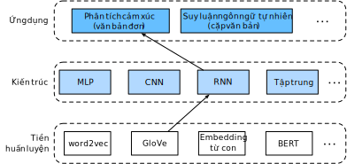

<!-- ===================== Bắt đầu dịch Phần 1 ==================== -->
<!-- ========================================= REVISE - BẮT ĐẦU =================================== -->

<!--
# Sentiment Analysis: Using Recurrent Neural Networks
-->

# Phân tích Cảm xúc: Sử dụng Mạng Nơ-ron Hồi tiếp
:label:`sec_sentiment_rnn`


<!--
Similar to search synonyms and analogies, text classification is also a
downstream application of word embedding.
In this section, we will apply pre-trained word vectors (GloVe) and bidirectional recurrent neural networks with
multiple hidden layers :cite:`Maas.Daly.Pham.ea.2011`, as shown in :numref:`fig_nlp-map-sa-rnn`.
We will use the model to determine whether a text sequence of indefinite length contains positive or negative emotion.
-->


Tương tự như tìm kiếm các từ đồng nghĩa và loại suy, phân loại văn bản cũng là một
ứng dụng xuôi dòng của embedding từ.
Trong phần này, ta sẽ áp dụng các vector từ đã được tiền huấn luyện (GloVe) và mạng nơ-ron truy hồi hai chiều với
nhiều lớp ẩn :cite:`Maas.Daly.Pham.ea.2011`, như được minh hoạ trong :numref:` fig_nlp-map-sa-rnn`.
Ta sẽ sử dụng mô hình để xác định xem một chuỗi văn bản có độ dài không xác định chứa cảm xúc tích cực hay tiêu cực.


<!--

-->


:label:`fig_nlp-map-sa-rnn`


```{.python .input  n=1}
from d2l import mxnet as d2l
from mxnet import gluon, init, np, npx
from mxnet.gluon import nn, rnn
npx.set_np()

batch_size = 64
train_iter, test_iter, vocab = d2l.load_data_imdb(batch_size)
```


<!--
## Using a Recurrent Neural Network Model
-->

## Sử dụng Mạng Nơ-ron Hồi tiếp


<!--
In this model, each word first obtains a feature vector from the embedding layer.
Then, we further encode the feature sequence using a bidirectional recurrent neural network to obtain sequence information.
Finally, we transform the encoded sequence information to output through the fully connected layer.
Specifically, we can concatenate hidden states of bidirectional long-short term memory in the initial timestep and final timestep and pass it
to the output layer classification as encoded feature sequence information.
In the `BiRNN` class implemented below, the `Embedding` instance is the embedding layer,
the `LSTM` instance is the hidden layer for sequence encoding, and the `Dense` instance is the output layer for generated classification results.
-->


Trong mô hình này, đầu tiên mỗi từ nhận được một vector đặc trưng tương ứng từ tầng embedding.
Sau đó, ta mã hóa thêm chuỗi đặc trưng bằng cách sử dụng mạng nơ-ron hồi tiếp hai chiều để thu được thông tin chuỗi.
Cuối cùng, ta chuyển đổi thông tin chuỗi được mã hóa thành đầu ra thông qua tầng kết nối đầy đủ.
Cụ thể, ta có thể ghép nối các trạng thái ẩn của bộ nhớ ngắn hạn dài hai chiều trong bước thời gian ban đầu và bước thời gian cuối cùng và truyền nó
tới tầng phân loại đầu ra như là thông tin chuỗi đặc trưng được mã hoá.
Trong lớp `BiRNN` được lập trình dưới, thực thể `Embedding` là tầng embedding,
thực thể `LSTM` là tầng ẩn để mã hóa chuỗi, và thực thể `Dense` là tầng đầu ra sinh kết quả phân loại.


```{.python .input  n=46}
class BiRNN(nn.Block):
    def __init__(self, vocab_size, embed_size, num_hiddens,
                 num_layers, **kwargs):
        super(BiRNN, self).__init__(**kwargs)
        self.embedding = nn.Embedding(vocab_size, embed_size)
        # Set `bidirectional` to True to get a bidirectional recurrent neural
        # network
        self.encoder = rnn.LSTM(num_hiddens, num_layers=num_layers,
                                bidirectional=True, input_size=embed_size)
        self.decoder = nn.Dense(2)

    def forward(self, inputs):
        # The shape of `inputs` is (batch size, no. of words). Because LSTM
        # needs to use sequence as the first dimension, the input is
        # transformed and the word feature is then extracted. The output shape
        # is (no. of words, batch size, word vector dimension).
        embeddings = self.embedding(inputs.T)
        # Since the input (embeddings) is the only argument passed into
        # rnn.LSTM, it only returns the hidden states of the last hidden layer
        # at different timestep (outputs). The shape of `outputs` is
        # (no. of words, batch size, 2 * no. of hidden units).
        outputs = self.encoder(embeddings)
        # Concatenate the hidden states of the initial timestep and final
        # timestep to use as the input of the fully connected layer. Its
        # shape is (batch size, 4 * no. of hidden units)
        encoding = np.concatenate((outputs[0], outputs[-1]), axis=1)
        outs = self.decoder(encoding)
        return outs
```


<!--
Create a bidirectional recurrent neural network with two hidden layers.
-->

Ta sẽ tạo một mạng nơ-ron hồi tiếp hai chiều với hai tầng ẩn như sau.


```{.python .input}
embed_size, num_hiddens, num_layers, devices = 100, 100, 2, d2l.try_all_gpus()
net = BiRNN(len(vocab), embed_size, num_hiddens, num_layers)
net.initialize(init.Xavier(), ctx=devices)
```

<!-- ===================== Kết thúc dịch Phần 1 ===================== -->

<!-- ===================== Bắt đầu dịch Phần 2 ===================== -->

<!--
### Loading Pre-trained Word Vectors
-->

### *dịch tiêu đề trên*


<!--
Because the training dataset for sentiment classification is not very large, in order to deal with overfitting, 
we will directly use word vectors pre-trained on a larger corpus as the feature vectors of all words. 
Here, we load a 100-dimensional GloVe word vector for each word in the dictionary `vocab`.
-->

*dịch đoạn phía trên*


```{.python .input}
glove_embedding = d2l.TokenEmbedding('glove.6b.100d')
```


<!--
Query the word vectors that in our vocabulary.
-->

*dịch đoạn phía trên*


```{.python .input}
embeds = glove_embedding[vocab.idx_to_token]
embeds.shape
```


<!--
Then, we will use these word vectors as feature vectors for each word in the reviews. 
Note that the dimensions of the pre-trained word vectors need to be consistent with the embedding layer output size `embed_size` in the created model. 
In addition, we no longer update these word vectors during training.
-->

*dịch đoạn phía trên*


```{.python .input  n=47}
net.embedding.weight.set_data(embeds)
net.embedding.collect_params().setattr('grad_req', 'null')
```


<!--
### Training and Evaluating the Model
-->

### *dịch tiêu đề trên*


<!--
Now, we can start training.
-->

*dịch đoạn phía trên*


```{.python .input  n=48}
lr, num_epochs = 0.01, 5
trainer = gluon.Trainer(net.collect_params(), 'adam', {'learning_rate': lr})
loss = gluon.loss.SoftmaxCrossEntropyLoss()
d2l.train_ch13(net, train_iter, test_iter, loss, trainer, num_epochs, devices)
```


<!--
Finally, define the prediction function.
-->

*dịch đoạn phía trên*


```{.python .input  n=49}
#@save
def predict_sentiment(net, vocab, sentence):
    sentence = np.array(vocab[sentence.split()], ctx=d2l.try_gpu())
    label = np.argmax(net(sentence.reshape(1, -1)), axis=1)
    return 'positive' if label == 1 else 'negative'
```


<!--
Then, use the trained model to classify the sentiments of two simple sentences.
-->

*dịch đoạn phía trên*


```{.python .input  n=50}
predict_sentiment(net, vocab, 'this movie is so great')
```

```{.python .input}
predict_sentiment(net, vocab, 'this movie is so bad')
```

<!-- ===================== Kết thúc dịch Phần 2 ===================== -->

<!-- ===================== Bắt đầu dịch Phần 3 ===================== -->

## Tóm tắt

<!--
* Text classification transforms a sequence of text of indefinite length into a category of text. This is a downstream application of word embedding.
* We can apply pre-trained word vectors and recurrent neural networks to classify the emotions in a text.
-->

*dịch đoạn phía trên*


## Bài tập

<!--
1. Increase the number of epochs. What accuracy rate can you achieve on the training and testing datasets? 
What about trying to re-tune other hyperparameters?
2. Will using larger pre-trained word vectors, such as 300-dimensional GloVe word vectors, improve classification accuracy?
3. Can we improve the classification accuracy by using the spaCy word tokenization tool? 
You need to install spaCy: `pip install spacy` and install the English package: `python -m spacy download en`. 
In the code, first import spacy: `import spacy`. Then, load the spacy English package: `spacy_en = spacy.load('en')`. 
Finally, define the function `def tokenizer(text): return [tok.text for tok in spacy_en.tokenizer(text)]` and replace the original `tokenizer` function. 
It should be noted that GloVe's word vector uses "-" to connect each word when storing noun phrases. 
For example, the phrase "new york" is represented as "new-york" in GloVe. After using spaCy tokenization, "new york" may be stored as "new york".
-->

*dịch đoạn phía trên*


<!-- ===================== Kết thúc dịch Phần 3 ===================== -->
<!-- ========================================= REVISE - KẾT THÚC ===================================-->


## Thảo luận
* [Tiếng Anh - MXNet](https://discuss.d2l.ai/t/392)
* [Tiếng Việt](https://forum.machinelearningcoban.com/c/d2l)


## Những người thực hiện
Bản dịch trong trang này được thực hiện bởi:
<!--
Tác giả của mỗi Pull Request điền tên mình và tên những người review mà bạn thấy
hữu ích vào từng phần tương ứng. Mỗi dòng một tên, bắt đầu bằng dấu `*`.
Tên đầy đủ của các reviewer có thể được tìm thấy tại https://github.com/aivivn/d2l-vn/blob/master/docs/contributors_info.md
-->

* Đoàn Võ Duy Thanh
<!-- Phần 1 -->
* Nguyễn Văn Quang

<!-- Phần 2 -->
* 

<!-- Phần 3 -->
* 
