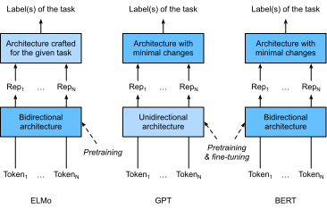
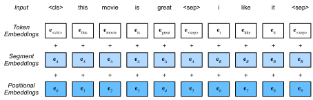

<!--
# Bidirectional Encoder Representations from Transformers (BERT)
-->

# Biểu diễn Mã hóa hai chiều từ Transformer (BERT)
:label:`sec_bert`


<!--
We have introduced several word embedding models for natural language understanding.
After pretraining, the output can be thought of as a matrix where each row is a vector that represents a word of a predefined vocabulary.
In fact, these word embedding models are all *context-independent*.
Let us begin by illustrating this property.
-->

Chúng tôi đã giới thiệu một vài mô hình embedding từ cho bài toán hiểu ngôn ngữ tự nhiên.
Sau khi tiền huấn luyện, đầu ra của các mô hình này có thể xem là một ma trận trong đó mỗi hàng là một vector biểu diễn một từ trong bộ từ vựng được định nghĩa trước.
Trong thực tế, tất cả các mô hình embedding từ này đều *độc lập ngữ cảnh* (*context-independent*).
Hãy bắt đầu bằng việc minh họa tính chất này.

<!--
## From Context-Independent to Context-Sensitive
-->

## Từ Độc lập Ngữ cảnh đến Nhạy Ngữ cảnh


<!--
Recall the experiments in :numref:`sec_word2vec_pretraining` and :numref:`sec_synonyms`.
For instance, word2vec and GloVe both assign the same pretrained vector to the same word regardless of the context of the word (if any).
Formally, a context-independent representation of any token $x$ is a function $f(x)$ that only takes $x$ as its input.
Given the abundance of polysemy and complex semantics in natural languages, context-independent representations have obvious limitations.
For instance, the word "crane" in contexts "a crane is flying" and "a crane driver came" has completely different meanings;
thus, the same word may be assigned different representations depending on contexts.
-->

Hãy nhớ lại các thí nghiệm trong :numref:`sec_word2vec_pretraining` và :numref:`sec_synonyms`.
Cả word2vec và GloVe đều gán cùng một vector được tiền huấn luyện cho cùng một từ bất kể ngữ cảnh (nếu có) của nó như thế nào.
Về mặt hình thức, biểu diễn độc lập ngữ cảnh của một token bất kỳ $x$ là một hàm $f(x)$ chỉ nhận $x$ làm đầu vào.
Do hiện tượng đa nghĩa cũng như sự phức tạp ngữ nghĩa xuất hiện khá phổ biến trong ngôn ngữ tự nhiên, biểu diễn độc lập ngữ cảnh có những hạn chế rõ ràng.
Ví dụ, từ "crane" trong ngữ cảnh "a crane is flying (một con sếu đang bay)" và ngữ cảnh "a crane driver came (tài xế xe cần cẩu đã tới)" có nghĩa hoàn toàn khác nhau;
do đó, cùng một từ nên được gán các biểu diễn khác nhau tùy ngữ cảnh.


<!--
This motivates the development of *context-sensitive* word representations, where representations of words depend on their contexts.
Hence, a context-sensitive representation of token $x$ is a function $f(x, c(x))$ depending on both $x$ and its context $c(x)$.
Popular context-sensitive representations include TagLM (language-model-augmented sequence tagger) :cite:`Peters.Ammar.Bhagavatula.ea.2017`,
CoVe (Context Vectors) :cite:`McCann.Bradbury.Xiong.ea.2017`, and ELMo (Embeddings from Language Models) :cite:`Peters.Neumann.Iyyer.ea.2018`.
-->

Điều này thúc đẩy sự phát triển của các biểu diễn từ *nhạy ngữ cảnh* (*context-sensitive*), trong đó biểu diễn của từ phụ thuộc vào ngữ cảnh của từ đó.
Do đó, biểu diễn nhạy ngữ cảnh của một token bất kỳ $x$ là hàm $f(x, c(x))$ phụ thuộc vào cả từ $x$ lẫn ngữ cảnh của từ $c(x)$. 
Các biểu diễn nhạy ngữ cảnh phổ biến bao gồm TagLM (Bộ Tag chuỗi được tăng cường với mô hình ngôn ngữ (*language-model-augmented sequence tagger*)) :cite:`Peters.Ammar.Bhagavatula.ea.2017`,
CoVe (vector ngữ cảnh (*Context Vectors*)) :cite:`McCann.Bradbury.Xiong.ea.2017`, và ELMo (embedding từ các mô hình ngôn ngữ (*Embeddings from Language Models*)) :cite:`Peters.Neumann.Iyyer.ea.2018`.


<!--
For example, by taking the entire sequence as the input, ELMo is a function that assigns a representation to each word from the input sequence.
Specifically, ELMo combines all the intermediate layer representations from pretrained bidirectional LSTM as the output representation.
Then the ELMo representation will be added to a downstream task's existing supervised model
as additional features, such as by concatenating ELMo representation and the original representation (e.g., GloVe) of tokens in the existing model.
On one hand, all the weights in the pretrained bidirectional LSTM model are frozen after ELMo representations are added.
On the other hand, the existing supervised model is specifically customized for a given task.
Leveraging different best models for different tasks at that time, adding ELMo improved the state of the art across six natural language processing tasks:
sentiment analysis, natural language inference, semantic role labeling, coreference resolution, named entity recognition, and question answering.
-->

Ví dụ, bằng cách lấy toàn bộ chuỗi làm đầu vào, ELMo gán một biểu diễn cho mỗi từ trong chuỗi đầu vào.
Cụ thể, ELMo kết hợp tất cả các biểu diễn tầng trung gian từ LSTM hai chiều đã được tiền huấn luyện làm biểu diễn đầu ra.
Sau đó, biểu diễn ELMo sẽ được đưa vào một mô hình học có giám sát cho các tác vụ xuôi dòng như một đặc trưng bổ sung, 
chẳng hạn bằng cách nối biểu diễn ELMo và biểu diễn gốc (ví dụ như GloVe) của token trong mô hình hiện tại.
Một mặt, tất cả các trọng số trong mô hình LSTM hai chiều được tiền huấn luyện đều bị đóng băng sau khi các biểu diễn ELMo được thêm vào.
Mặt khác, mô hình học có giám sát được tùy biến cụ thể cho một tác vụ nhất định.
Tại thời điểm được công bố, thêm ELMo vào các mô hình tân tiến nhất giúp cải thiện chất lượng các mô hình này trên sáu tác vụ xử lý ngôn ngữ tự nhiên:
phân tích cảm xúc (*sentiment analysis*), suy luận ngôn ngữ tự nhiên (*natural language inference*), gán nhãn vai trò ngữ nghĩa (*semantic role labeling*), 
phân giải đồng tham chiếu (*coreference resolution*), nhận dạng thực thể có tên (*named entity recognition*) và trả lời câu hỏi (*question answering*).


<!--
## From Task-Specific to Task-Agnostic
-->

## Từ Đặc thù Tác vụ đến Không phân biệt Tác vụ


<!--
Although ELMo has significantly improved solutions to a diverse set of natural language processing tasks,
each solution still hinges on a *task-specific* architecture.
However, it is practically non-trivial to craft a specific architecture for every natural language processing task.
The GPT (Generative Pre-Training) model represents an effort in designing 
a general *task-agnostic* model for context-sensitive representations :cite:`Radford.Narasimhan.Salimans.ea.2018`.
Built on a Transformer decoder, GPT pretrains a language model that will be used to represent text sequences.
When applying GPT to a downstream task, the output of the language model will be fed into an added linear output layer
to predict the label of the task.
In sharp contrast to ELMo that freezes parameters of the pretrained model,
GPT fine-tunes *all* the parameters in the pretrained Transformer decoder during supervised learning of the downstream task.
GPT was evaluated on twelve tasks of natural language inference, question answering, sentence similarity, and classification,
and improved the state of the art in nine of them with minimal changes to the model architecture.
-->

Mặc dù ELMo đã cải thiện đáng kể giải pháp cho một loạt các tác vụ xử lý ngôn ngữ tự nhiên,
mỗi giải pháp vẫn dựa trên một kiến ​​trúc *đặc thù cho tác vụ* (*task-specific*).
Tuy nhiên trong thực tế, xây dựng một kiến ​​trúc đặc thù cho mỗi tác vụ xử lý ngôn ngữ tự nhiên là điều không đơn giản.
Phương pháp GPT (Generative Pre-Training) thể hiện nỗ lực thiết kế một mô hình *không phân biệt tác vụ* (*task-agnostic*) chung cho các biểu diễn nhạy ngữ cảnh :cite:`Radford.Narasimhan.Salimans.ea.2018`.
Được xây dựng dựa trên bộ giải mã Transformer, GPT tiền huấn luyện mô hình ngôn ngữ được sử dụng để biểu diễn chuỗi văn bản.
Khi áp dụng GPT cho một tác vụ xuôi dòng, đầu ra của mô hình ngôn ngữ sẽ được truyền tới một tầng đầu ra tuyến tính được bổ sung để dự đoán nhãn cho tác vụ đó.
Trái ngược hoàn toàn với cách ELMo đóng băng các tham số của mô hình tiền huấn luyện,
GPT tinh chỉnh *tất cả* các tham số trong bộ giải mã Transformer tiền huấn luyện trong suốt quá trình học có giám sát trên tác vụ xuôi dòng.
GPT được đánh giá trên mười hai tác vụ về suy luận ngôn ngữ tự nhiên, trả lời câu hỏi, độ tương tự của câu, và bài toán phân loại, 
và cải thiện kết quả tân tiến nhất của chín tác vụ với vài thay đổi tối thiểu trong kiến ​​trúc mô hình.


<!--
However, due to the autoregressive nature of language models, GPT only looks forward (left-to-right).
In contexts "i went to the bank to deposit cash" and "i went to the bank to sit down", as "bank" is sensitive to the context to its left,
GPT will return the same representation for "bank", though it has different meanings.
-->

Tuy nhiên, do tính chất tự hồi quy của các mô hình ngôn ngữ, GPT chỉ nhìn theo chiều xuôi (từ trái sang phải).
Trong các ngữ cảnh "I went to the bank to deposit cash" ("tôi đến ngân hàng để gửi tiền") và "I went to the bank to sit down"("tôi ra bờ hồ ngồi"), do từ "bank" nhạy với ngữ cảnh bên trái,
GPT sẽ trả về cùng một biểu diễn cho từ "bank", mặc dù nó có nghĩa khác nhau.


<!--
## BERT: Combining the Best of Both Worlds
-->

## BERT: Kết hợp những Điều Tốt nhất của Hai Phương pháp


<!--
As we have seen, ELMo encodes context bidirectionally but uses task-specific architectures; while GPT is task-agnostic but encodes context left-to-right.
Combining the best of both worlds, BERT (Bidirectional Encoder Representations from Transformers)
encodes context bidirectionally and requires minimal architecture changes for a wide range of natural language processing tasks :cite:`Devlin.Chang.Lee.ea.2018`.
Using a pretrained Transformer encoder, BERT is able to represent any token based on its bidirectional context.
During supervised learning of downstream tasks, BERT is similar to GPT in two aspects.
First, BERT representations will be fed into an added output layer, with minimal changes to the model architecture depending on nature of tasks,
such as predicting for every token vs. predicting for the entire sequence.
Second, all the parameters of the pretrained Transformer encoder are fine-tuned, while the additional output layer will be trained from scratch.
:numref:`fig_elmo-gpt-bert` depicts the differences among ELMo, GPT, and BERT.
-->


Như ta đã thấy, ELMo mã hóa ngữ cảnh hai chiều nhưng sử dụng các kiến ​​trúc đặc thù cho từng tác vụ; trong khi đó GPT có kiến trúc không phân biệt tác vụ nhưng mã hóa ngữ cảnh từ trái sang phải.
Kết hợp những điều tốt nhất của hai phương pháp trên, BERT (biểu diễn mã hóa hai chiều từ Transformer - *Bidirectional Encoder Representations from Transformers*)
mã hóa ngữ cảnh theo hai chiều và chỉ yêu cầu vài thay đổi kiến ​​trúc tối thiểu cho một loạt các tác vụ xử lý ngôn ngữ tự nhiên :cite:`Devlin.Chang.Lee.ea.2018`.
Sử dụng bộ mã hóa Transformer được tiền huấn luyện, BERT có thể biểu diễn bất kỳ token nào dựa trên ngữ cảnh hai chiều của nó.
Trong quá trình học có giám sát trên các tác vụ xuôi dòng, BERT tương tự như GPT ở hai khía cạnh.
Đầu tiên, các biểu diễn BERT sẽ được truyền vào một tầng đầu ra được bổ sung, với những thay đổi tối thiểu tới kiến ​​trúc mô hình tùy thuộc vào bản chất của tác vụ,
chẳng hạn như dự đoán cho mỗi token hay dự đoán cho toàn bộ chuỗi.
Thứ hai, tất cả các tham số của bộ mã hóa Transformer đã tiền huấn luyện đều được tinh chỉnh, trong khi tầng đầu ra bổ sung sẽ được huấn luyện từ đầu.
:numref:`fig_elmo-gpt-bert` mô tả những điểm khác biệt giữa ELMo, GPT, và BERT.


<!--

-->


:label:`fig_elmo-gpt-bert`


<!--
BERT further improved the state of the art on eleven natural language processing tasks
under broad categories of i) single text classification (e.g., sentiment analysis), ii) text pair classification (e.g., natural language inference),
iii) question answering, iv) text tagging (e.g., named entity recognition).
All proposed in 2018, from context-sensitive ELMo to task-agnostic GPT and BERT,
conceptually simple yet empirically powerful pretraining of deep representations for natural languages have revolutionized solutions to various natural language processing tasks.
-->

BERT cải thiện kết quả tân tiến nhất đối với mười một tác vụ xử lý ngôn ngữ tự nhiên trải khắp các hạng mục gồm: i) phân loại văn bản đơn (như phân tích cảm xúc), ii) phân loại cặp văn bản (như suy luận ngôn ngữ tự nhiên), iii) trả lời câu hỏi, và iv) gán thẻ văn bản (như nhận dạng thực thể có tên).
Tất cả các kỹ thuật được đề xuất trong năm 2018, từ ELMo nhạy ngữ cảnh cho tới GPT không phân biệt tác vụ và BERT, tuy về ý tưởng đều đơn giản nhưng trên thực nghiệm là những phương pháp tiền huấn luyện hiệu quả cho các biểu diễn sâu của ngôn ngữ tự nhiên, và đã mang đến những giải pháp mang tính cách mạng cho nhiều tác vụ xử lý ngôn ngữ tự nhiên.

<!--
In the rest of this chapter, we will dive into the pretraining of BERT.
When natural language processing applications are explained in :numref:`chap_nlp_app`,
we will illustrate fine-tuning of BERT for downstream applications.
-->

Ở phần còn lại của chương này, ta sẽ đi sâu vào tiền huấn luyện BERT.
Sau khi những ứng dụng xử lý ngôn ngữ tự nhiên đã được giải thích trong :numref:`chap_nlp_app`,
ta sẽ minh họa việc tinh chỉnh BERT cho các ứng dụng xuôi dòng.


```{.python .input  n=1}
from d2l import mxnet as d2l
from mxnet import gluon, np, npx
from mxnet.gluon import nn

npx.set_np()
```


<!--
## Input Representation
-->

## Biểu diễn Đầu vào
:label:`subsec_bert_input_rep`


<!--
In natural language processing, some tasks (e.g., sentiment analysis) take single text as the input,
while in some other tasks (e.g., natural language inference), the input is a pair of text sequences.
The BERT input sequence unambiguously represents both single text and text pairs.
In the former, the BERT input sequence is the concatenation of the special classification token “&lt;cls&gt;”,
tokens of a text sequence, and the special separation token “&lt;sep&gt;”.
In the latter, the BERT input sequence is the concatenation of “&lt;cls&gt;”, tokens of the first text sequence,
“&lt;sep&gt;”, tokens of the second text sequence, and “&lt;sep&gt;”.
We will consistently distinguish the terminology "BERT input sequence" from other types of "sequences".
For instance, one *BERT input sequence* may include either one *text sequence* or two *text sequences*.
-->

Trong xử lý ngôn ngữ tự nhiên, một số nhiệm vụ (như phân tích cảm xúc) lấy một câu văn làm đầu vào, 
trong khi một số tác vụ khác (như suy diễn ngôn ngữ tự nhiên), đầu vào là một cặp chuỗi văn bản.
Chuỗi đầu vào BERT biểu diễn một cách tường minh cả văn bản đơn và cặp văn bản.
Với văn bản đơn, chuỗi đầu vào BERT là sự ghép nối của token phân loại đặc biệt “&lt;cls&gt;”, token của chuỗi văn bản, và token phân tách đặc biệt “&lt;sep&gt;”.
Với cặp văn bản, chuỗi đầu vào BERT là sự ghép nối của “&lt;cls&gt;”, token của chuỗi văn bản đầu, “&lt;sep&gt;”, token của chuỗi văn bản thứ hai, và “&lt;sep&gt;”.
Ta sẽ phân biệt nhất quán thuật ngữ "chuỗi đầu vào BERT" với các kiểu "chuỗi" khác.
Chẳng hạn, một *chuỗi đầu vào BERT* có thể bao gồm cả *một chuỗi văn bản* hoặc *hai chuỗi văn bản*.


<!--
To distinguish text pairs, the learned segment embeddings $\mathbf{e}_A$ and $\mathbf{e}_B$
are added to the token embeddings of the first sequence and the second sequence, respectively.
For single text inputs, only $\mathbf{e}_A$ is used.
-->

Để phân biệt cặp văn bản, các embedding đoạn đã học $\mathbf{e}_A$ và $\mathbf{e}_B$ được cộng tương ứng vào các embedding token của chuỗi thứ nhất và chuỗi thứ hai.
Đối với đầu vào là văn bản đơn, ta chỉ sử dụng $\mathbf{e}_A$.

<!--
The following `get_tokens_and_segments` takes either one sentence or two sentences as the input, 
then returns tokens of the BERT input sequence and their corresponding segment IDs.
-->

Hàm `get_tokens_and_segments` sau đây có thể lấy một hoặc hai câu làm đầu vào,
rồi trả về các token của chuỗi đầu vào BERT và các ID đoạn tương ứng của chúng.


```{.python .input}
#@save
def get_tokens_and_segments(tokens_a, tokens_b=None):
    tokens = ['<cls>'] + tokens_a + ['<sep>']
    # 0 and 1 are marking segment A and B, respectively
    segments = [0] * (len(tokens_a) + 2)
    if tokens_b is not None:
        tokens += tokens_b + ['<sep>']
        segments += [1] * (len(tokens_b) + 1)
    return tokens, segments
```


<!--
BERT chooses the Transformer encoder as its bidirectional architecture.
Common in the Transformer encoder, positional embeddings are added at every position of the BERT input sequence.
However, different from the original Transformer encoder, BERT uses *learnable* positional embeddings.
To sum up, :numref:`fig_bert-input` shows that the embeddings of the BERT input sequence are the sum of the token embeddings, segment embeddings, and positional embeddings.
-->

Kiến trúc hai chiều của BERT là bộ mã hóa Transformer.
Thông thường trong bộ mã hóa Transformer, các embedding vị trí được cộng vào mỗi vị trí của chuỗi đầu vào BERT.
Tuy nhiên, khác với bộ mã hóa Transformer nguyên bản, BERT sử dụng các embedding vị trí *có thể học được*.
:numref:`fig_bert-input` cho thấy các embedding của chuỗi đầu vào BERT là tổng các embedding của token, embedding đoạn và embedding vị trí. 

<!--

-->


:label:`fig_bert-input`


<!--
The following `BERTEncoder` class is similar to the `TransformerEncoder` class as implemented in :numref:`sec_transformer`.
Different from `TransformerEncoder`, `BERTEncoder` uses segment embeddings and learnable positional embeddings.
-->

Lớp `BERTEncoder` dưới đây tương tự như lớp `TransformerEncoder` trong :numref:`sec_transformer`.
Khác với `TransformerEncoder`, `BERTEncoder` sử dụng các embedding đoạn và các embedding vị trí có thể học được.


```{.python .input  n=2}
#@save
class BERTEncoder(nn.Block):
    def __init__(self, vocab_size, num_hiddens, ffn_num_hiddens, num_heads,
                 num_layers, dropout, max_len=1000, **kwargs):
        super(BERTEncoder, self).__init__(**kwargs)
        self.token_embedding = nn.Embedding(vocab_size, num_hiddens)
        self.segment_embedding = nn.Embedding(2, num_hiddens)
        self.blks = nn.Sequential()
        for _ in range(num_layers):
            self.blks.add(d2l.EncoderBlock(
                num_hiddens, ffn_num_hiddens, num_heads, dropout, True))
        # In BERT, positional embeddings are learnable, thus we create a
        # parameter of positional embeddings that are long enough
        self.pos_embedding = self.params.get('pos_embedding',
                                             shape=(1, max_len, num_hiddens))

    def forward(self, tokens, segments, valid_lens):
        # Shape of `X` remains unchanged in the following code snippet:
        # (batch size, max sequence length, `num_hiddens`)
        X = self.token_embedding(tokens) + self.segment_embedding(segments)
        X = X + self.pos_embedding.data(ctx=X.ctx)[:, :X.shape[1], :]
        for blk in self.blks:
            X = blk(X, valid_lens)
        return X
```


<!--
Suppose that the vocabulary size is 10,000.
To demonstrate forward inference of `BERTEncoder`,
let us create an instance of it and initialize its parameters.
-->

Giả sử kích thước bộ từ vựng là 10,000.
Để minh họa suy luận xuôi của `BERTEncoder`,
hãy tạo ra một thực thể của nó và khởi tạo các thông số.


```{.python .input  n=3}
vocab_size, num_hiddens, ffn_num_hiddens, num_heads = 10000, 768, 1024, 4
num_layers, dropout = 2, 0.2
encoder = BERTEncoder(vocab_size, num_hiddens, ffn_num_hiddens, num_heads,
                      num_layers, dropout)
encoder.initialize()
```


<!--
We define `tokens` to be 2 BERT input sequences of length 8, where each token is an index of the vocabulary.
The forward inference of `BERTEncoder` with the input `tokens` returns the encoded result 
where each token is represented by a vector whose length is predefined by the hyperparameter `num_hiddens`.
This hyperparameter is usually referred to as the *hidden size* (number of hidden units) of the Transformer encoder.
-->

Ta định nghĩa `tokens` là hai chuỗi đầu vào BERT có độ dài là 8, mỗi token là một chỉ mục của bộ từ vựng.
Lượt suy luận xuôi của `BERTEncoder` với đầu vào `tokens` trả về kết quả được mã hóa, 
với mỗi token được biểu diễn bởi một vector có chiều dài được định nghĩa trước bởi siêu tham số `num_hiddens`,
là *kích thước ẩn* (số lượng nút ẩn) của bộ mã hóa Transformer.


```{.python .input}
tokens = np.random.randint(0, vocab_size, (2, 8))
segments = np.array([[0, 0, 0, 0, 1, 1, 1, 1], [0, 0, 0, 1, 1, 1, 1, 1]])
encoded_X = encoder(tokens, segments, None)
encoded_X.shape
```


<!--
## Pretraining Tasks
-->

## Những tác vụ Tiền huấn luyện
:label:`subsec_bert_pretraining_tasks`


<!--
The forward inference of `BERTEncoder` gives the BERT representation of each token of the input text and the inserted special tokens “&lt;cls&gt;” and “&lt;seq&gt;”.
Next, we will use these representations to compute the loss function for pretraining BERT.
The pretraining is composed of the following two tasks: masked language modeling and next sentence prediction.
-->

Suy luận xuôi của `BERTEncoder` cho ra biểu diễn BERT của mỗi token của văn bản đầu vào và các token đặc biệt được thêm vào “&lt;cls&gt;” và “&lt;seq&gt;”.
Kế tiếp, ta sẽ sử dụng các biểu diễn này để tính toán hàm mất mát khi tiền huấn luyện BERT.
Tiền huấn luyện gồm hai tác vụ: mô hình ngôn ngữ có mặt nạ (*masked language modeling*) và dự đoán câu tiếp theo.


<!--
### Masked Language Modeling
-->

### Mô hình Ngôn ngữ có Mặt nạ
:label:`subsec_mlm`


<!--
As illustrated in :numref:`sec_language_model`, a language model predicts a token using the context on its left.
To encode context bidirectionally for representing each token, BERT randomly masks tokens and uses tokens from the bidirectional context to predict the masked tokens.
This task is referred to as a *masked language model*.
-->

Như mô tả trong :numref:`sec_language_model`, một mô hình ngôn ngữ dự đoán một token bằng cách sử dụng ngữ cảnh phía bên trái của nó.
Để mã hóa ngữ cảnh hai chiều khi biểu diễn mỗi token, BERT ngẫu nhiên che mặt nạ các token và sử dụng các token lấy từ ngữ cảnh hai chiều để dự đoán các token mặt nạ đó.
Tác vụ này được gọi là *mô hình hóa ngôn ngữ có mặt nạ*.

<!--
In this pretraining task, 15% of tokens will be selected at random as the masked tokens for prediction.
To predict a masked token without cheating by using the label, one straightforward approach is to always replace it with a special “&lt;mask&gt;” token in the BERT input sequence.
However, the artificial special token “&lt;mask&gt;” will never appear in fine-tuning.
To avoid such a mismatch between pretraining and fine-tuning, if a token is masked for prediction 
(e.g., "great" is selected to be masked and predicted in "this movie is great"), in the input it will be replaced with:
-->

Trong tác vụ tiền huấn luyện này, 15% số token sẽ được lựa chọn ngẫu nhiên để làm các token mặt nạ cho việc dự đoán.
Để dự đoán một token mặt nạ mà không sử dụng nhãn, một hướng tiếp cận đơn giản là luôn luôn thay thế nó bằng token đặc biệt “&lt;mask&gt;” trong chuỗi đầu vào BERT.
Tuy nhiên, token “&lt;mask&gt;” sẽ không bao giờ xuất hiện khi tinh chỉnh. 
Để tránh sự không đồng nhất giữa tiền huấn luyện và tinh chỉnh, nếu một token được che mặt nạ để dự đoán 
(ví dụ, từ "great" được chọn để che mặt nạ và dự đoán trong câu "this movie is great"), trong đầu vào nó sẽ được thay thế bởi:


<!--
* a special “&lt;mask&gt;” token for 80% of the time (e.g., "this movie is great" becomes "this movie is &lt;mask&gt;");
* a random token for 10% of the time (e.g., "this movie is great" becomes "this movie is drink");
* the unchanged label token for 10% of the time (e.g., "this movie is great" becomes "this movie is great").
-->

* token đặc biệt “&lt;mask&gt;”, 80% số lần (ví dụ, "this movie is great" trở thành "this movie is &lt;mask&gt;”);
* token ngẫu nhiên, 10% số lần (ví dụ, "this movie is great" trở thành "this movie is drink");
* chính token đó, 10% số lần (ví dụ, "this movie is great" trở thành "this movie is great").


<!--
Note that for 10% of 15% time a random token is inserted.
This occasional noise encourages BERT to be less biased towards the masked token (especially when the label token remains unchanged) in its bidirectional context encoding.
-->

Lưu ý rằng trong 15% token được chọn để che mặt nạ, 10% số token đó sẽ được thay thế bằng một token ngẫu nhiên.
Việc thi thoảng thêm nhiễu sẽ giúp BERT giảm thiên kiến về phía token có mặt nạ (đặc biệt khi token nhãn không đổi) khi mã hóa ngữ cảnh hai chiều.


<!--
We implement the following `MaskLM` class to predict masked tokens in the masked language model task of BERT pretraining.
The prediction uses a one-hidden-layer MLP (`self.mlp`).
In forward inference, it takes two inputs: the encoded result of `BERTEncoder` and the token positions for prediction.
The output is the prediction results at these positions.
-->

Ta lập trình lớp `MaskLM` sau để dự đoán token có mặt nạ trong tác vụ mô hình hóa ngôn ngữ có mặt nạ khi tiền huấn luyện BERT.
MLP một-tầng-ẩn (`self.mlp`) được dùng cho việc dự đoán.
Lượt suy luận xuôi nhận hai đầu vào: kết quả mã hóa của `BERTEncoder` và vị trí token để dự đoán.
Đầu ra là kết quả dự đoán tại các vị trí này.


```{.python .input  n=4}
#@save
class MaskLM(nn.Block):
    def __init__(self, vocab_size, num_hiddens, **kwargs):
        super(MaskLM, self).__init__(**kwargs)
        self.mlp = nn.Sequential()
        self.mlp.add(
            nn.Dense(num_hiddens, flatten=False, activation='relu'))
        self.mlp.add(nn.LayerNorm())
        self.mlp.add(nn.Dense(vocab_size, flatten=False))

    def forward(self, X, pred_positions):
        num_pred_positions = pred_positions.shape[1]
        pred_positions = pred_positions.reshape(-1)
        batch_size = X.shape[0]
        batch_idx = np.arange(0, batch_size)
        # Suppose that `batch_size` = 2, `num_pred_positions` = 3, then
        # `batch_idx` is `np.array([0, 0, 0, 1, 1, 1])`
        batch_idx = np.repeat(batch_idx, num_pred_positions)
        masked_X = X[batch_idx, pred_positions]
        masked_X = masked_X.reshape((batch_size, num_pred_positions, -1))
        mlm_Y_hat = self.mlp(masked_X)
        return mlm_Y_hat
```


<!--
To demonstrate the forward inference of `MaskLM`, we create its instance `mlm` and initialize it.
Recall that `encoded_X` from the forward inference of `BERTEncoder` represents 2 BERT input sequences.
We define `mlm_positions` as the 3 indices to predict in either BERT input sequence of `encoded_X`.
The forward inference of `mlm` returns prediction results `mlm_Y_hat` at all the masked positions `mlm_positions` of `encoded_X`.
For each prediction, the size of the result is equal to the vocabulary size.
-->

Để minh họa lượt suy luận xuôi của `MaskLM`, ta sẽ khởi tạo một thực thể `mlm`.
Hãy nhớ lại rằng `encoded_X` từ lượt suy luận xuôi của `BERTEncoder` biểu diễn 2 chuỗi đầu vào BERT.
Ta định nghĩa `mlm_positions` là 3 chỉ số để dự đoán ở một trong hai chuỗi đầu vào BERT của `encoded_X`.
Lượt suy luận xuôi của `mlm` trả về kết quả dự đoán `mlm_Y_hat` tại tất cả các vị trí mặt nạ `mlm_positions` của `encoded_X`.
Với mỗi dự đoán, kích thước của kết quả bằng với kích thước bộ từ vựng.


```{.python .input  n=5}
mlm = MaskLM(vocab_size, num_hiddens)
mlm.initialize()
mlm_positions = np.array([[1, 5, 2], [6, 1, 5]])
mlm_Y_hat = mlm(encoded_X, mlm_positions)
mlm_Y_hat.shape
```


<!--
With the ground truth labels `mlm_Y` of the predicted tokens `mlm_Y_hat` under masks,
we can calculate the cross entropy loss of the masked language model task in BERT pretraining.
-->

Với nhãn gốc `mlm_Y` của token có mặt nạ được dự đoán `mlm_Y_hat`,
ta có thể tính mất mát entropy chéo của tác vụ mô hình hóa ngôn ngữ có mặt nạ trong quá trình tiền huấn luyện BERT.


```{.python .input  n=6}
mlm_Y = np.array([[7, 8, 9], [10, 20, 30]])
loss = gluon.loss.SoftmaxCrossEntropyLoss()
mlm_l = loss(mlm_Y_hat.reshape((-1, vocab_size)), mlm_Y.reshape(-1))
mlm_l.shape
```


<!--
### Next Sentence Prediction
-->

### Dự đoán Câu tiếp theo
:label:`subsec_nsp`


<!--
Although masked language modeling is able to encode bidirectional context for representing words, it does not explicitly model the logical relationship between text pairs.
To help understand the relationship between two text sequences, BERT considers a binary classification task, *next sentence prediction*, in its pretraining.
When generating sentence pairs for pretraining, for half of the time they are indeed consecutive sentences with the label "True";
while for the other half of the time the second sentence is randomly sampled from the corpus with the label "False".
-->

Mặc dù mô hình hóa ngôn ngữ có mặt nạ có thể mã hóa ngữ cảnh hai chiều để biểu diễn từ ngữ, nó không thể mô hình hóa các mối quan hệ logic giữa các cặp văn bản một cách tường minh.
Để hiểu hơn về mối quan hệ giữa hai chuỗi văn bản, BERT sử dụng tác vụ phân loại nhị phân, *dự đoán câu tiếp theo* (*next sentence prediction*) trong quá trình tiền huấn luyện.
Khi sinh các cặp câu cho quá trình tiền huấn luyện, một nửa trong số đó là các cặp câu liên tiếp nhau trong thực tế và được gán nhãn "Đúng" (*True*); 
và trong nửa còn lại, câu thứ hai được lấy mẫu ngẫu nhiên từ kho ngữ liệu và cặp này được gán nhãn "Sai" (*False*).


<!--
The following `NextSentencePred` class uses a one-hidden-layer MLP to predict whether the second sentence is the next sentence of the first in the BERT input sequence.
Due to self-attention in the Transformer encoder, the BERT representation of the special token “&lt;cls&gt;” encodes both the two sentences from the input.
Hence, the output layer (`self.output`) of the MLP classifier takes `X` as the input, where `X` is the output of the MLP hidden layer whose input is the encoded “&lt;cls&gt;” token.
-->

Lớp `NextSentencePred` dưới đây sử dụng MLP một tầng ẩn để dự đoán câu thứ hai có phải là câu kế tiếp của câu thứ nhất trong chuỗi đầu vào BERT hay không.
Do cơ chế tự tập trung trong bộ mã hóa Transformer, biểu diễn BERT của token đặc biệt “&lt;cls&gt;” mã hóa cả hai câu đầu vào.
Vì vậy, tầng đầu ra (`self.output`) của bộ phân loại MLP nhận đầu vào `X` là đầu ra của tầng ẩn MLP có đầu vào là token được mã hóa “&lt;cls&gt;”.


```{.python .input  n=7}
#@save
class NextSentencePred(nn.Block):
    def __init__(self, **kwargs):
        super(NextSentencePred, self).__init__(**kwargs)
        self.output = nn.Dense(2)

    def forward(self, X):
        # `X` shape: (batch size, `num_hiddens`)
        return self.output(X)
```


<!--
We can see that the forward inference of an `NextSentencePred` instance
returns binary predictions for each BERT input sequence.
-->

Ta có thể thấy lượt suy luận xuôi của thực thể `NextSentencePred`
trả về dự đoán nhị phân cho mỗi chuỗi đầu vào BERT.


```{.python .input  n=8}
nsp = NextSentencePred()
nsp.initialize()
nsp_Y_hat = nsp(encoded_X)
nsp_Y_hat.shape
```


<!--
The cross-entropy loss of the 2 binary classifications can also be computed.
-->

Mất mát entropy chéo của 2 tác vụ phân loại nhị phân có thể được tính như sau.


```{.python .input  n=9}
nsp_y = np.array([0, 1])
nsp_l = loss(nsp_Y_hat, nsp_y)
nsp_l.shape
```


<!--
It is noteworthy that all the labels in both the aforementioned pretraining tasks can be trivially obtained from the pretraining corpus without manual labeling effort.
The original BERT has been pretrained on the concatenation of BookCorpus :cite:`Zhu.Kiros.Zemel.ea.2015` and English Wikipedia.
These two text corpora are huge: they have 800 million words and 2.5 billion words, respectively.
-->

Đáng chú ý là tất cả nhãn trong hai tác vụ tiền huấn luyện nói trên đều có thể thu được từ kho ngữ liệu tiền huấn luyện mà không cần công sức gán nhãn thủ công.
Phiên bản gốc của BERT được tiền huấn luyện trên cả hai kho ngữ liệu BookCorpus :cite:`Zhu.Kiros.Zemel.ea.2015` và Wikipedia tiếng Anh.
Hai kho ngữ liệu văn bản này cực kỳ lớn, chứa lần lượt khoảng 800 triệu từ và 2.5 tỉ từ.


<!--
## Putting All Things Together
-->

## Kết hợp Tất cả lại


<!--
When pretraining BERT, the final loss function is a linear combination of both the loss functions for masked language modeling and next sentence prediction.
Now we can define the `BERTModel` class by instantiating the three classes `BERTEncoder`, `MaskLM`, and `NextSentencePred`.
The forward inference returns the encoded BERT representations `encoded_X`, predictions of masked language modeling `mlm_Y_hat`, and next sentence predictions `nsp_Y_hat`.
-->

Khi tiền huấn luyện BERT, hàm mất mát cuối cùng là tổ hợp tuyến tính của cả hai hàm mất mát trong tác vụ mô hình hóa ngôn ngữ có mặt nạ và dự đoán câu tiếp theo.
Bây giờ ta có thể định nghĩa lớp `BERTModel` bằng cách khởi tạo ba lớp `BERTEncoder`, `MaskLM`, và `NextSentencePred`.
Lượt suy luận xuôi trả về biểu diễn BERT được mã hóa `encoded_X`, các dự đoán `mlm_Y_hat` của tác vụ mô hình hóa ngôn ngữ có mặt nạ, và `nsp_Y_hat` của tác vụ dự đoán câu tiếp theo.


```{.python .input  n=10}
#@save
class BERTModel(nn.Block):
    def __init__(self, vocab_size, num_hiddens, ffn_num_hiddens, num_heads,
                 num_layers, dropout, max_len=1000):
        super(BERTModel, self).__init__()
        self.encoder = BERTEncoder(vocab_size, num_hiddens, ffn_num_hiddens,
                                   num_heads, num_layers, dropout, max_len)
        self.hidden = nn.Dense(num_hiddens, activation='tanh')
        self.mlm = MaskLM(vocab_size, num_hiddens)
        self.nsp = NextSentencePred()

    def forward(self, tokens, segments, valid_lens=None, pred_positions=None):
        encoded_X = self.encoder(tokens, segments, valid_lens)
        if pred_positions is not None:
            mlm_Y_hat = self.mlm(encoded_X, pred_positions)
        else:
            mlm_Y_hat = None
        # The hidden layer of the MLP classifier for next sentence prediction.
        # 0 is the index of the '<cls>' token
        nsp_Y_hat = self.nsp(self.hidden(encoded_X[:, 0, :]))
        return encoded_X, mlm_Y_hat, nsp_Y_hat
```


## Tóm tắt

<!--
* Word embedding models such as word2vec and GloVe are context-independent. 
They assign the same pretrained vector to the same word regardless of the context of the word (if any). 
It is hard for them to handle well polysemy or complex semantics in natural languages.
* For context-sensitive word representations such as ELMo and GPT, representations of words depend on their contexts.
* ELMo encodes context bidirectionally but uses task-specific architectures 
(however, it is practically non-trivial to craft a specific architecture for every natural language processing task); 
while GPT is task-agnostic but encodes context left-to-right.
* BERT combines the best of both worlds: it encodes context bidirectionally and requires minimal architecture changes for a wide range of natural language processing tasks.
* The embeddings of the BERT input sequence are the sum of the token embeddings, segment embeddings, and positional embeddings.
* Pretraining BERT is composed of two tasks: masked language modeling and next sentence prediction. 
The former is able to encode bidirectional context for representing words, while the later explicitly models the logical relationship between text pairs.
-->


* Các mô hình embedding từ như word2vec và GloVe có tính chất độc lập với ngữ cảnh.
Hai mô hình này gán cùng một vector được tiền huấn luyện cho cùng một từ bất kể ngữ cảnh xung quanh của từ đó là gì (nếu có).
Do đó, rất khó để các mô hình này xử lý tốt các trường hợp phức tạp về ngữ nghĩa hay đa nghĩa trong các ngôn ngữ tự nhiên.
* Đối với các biểu diễn từ nhạy ngữ cảnh như ELMo và GPT, biểu diễn của từ phụ thuộc vào ngữ cảnh của từ đó.
* ELMo mã hóa ngữ cảnh theo hai chiều nhưng sử dụng kiến ​​trúc đặc thù cho tác vụ
(tuy nhiên, trên thực tế không dễ để tạo ra một kiến ​​trúc đặc thù cho mọi tác vụ xử lý ngôn ngữ tự nhiên);
trong khi đó GPT không phân biệt tác vụ nhưng chỉ mã hóa ngữ cảnh theo chiều từ trái sang phải.
* BERT kết hợp những gì tốt nhất của cả hai mô hình trên: mã hóa ngữ cảnh theo hai chiều và chỉ yêu cầu những thay đổi kiến ​​trúc tối thiểu cho một loạt các tác vụ xử lý ngôn ngữ tự nhiên.
* Các embedding của chuỗi đầu vào BERT là tổng các embedding cho token, embedding đoạn và embedding vị trí.
* Quá trình tiền huấn luyện BERT gồm có hai tác vụ: tác vụ mô hình hóa ngôn ngữ có mặt nạ và tác vụ dự đoán câu tiếp theo.
Tác vụ đầu có thể mã hóa ngữ cảnh hai chiều để biểu diễn từ, trong khi tác vụ sau mô hình hóa mối quan hệ logic giữa các cặp văn bản một cách tường minh.


## Bài tập

<!--
1. Why does BERT succeed?
2. All other things being equal, will a masked language model require more or fewer pretraining steps to converge than a left-to-right language model? Why?
3. In the original implementation of BERT, the position-wise feed-forward network in `BERTEncoder` (via `d2l.EncoderBlock`) 
and the fully-connected layer in `MaskLM` both use the Gaussian error linear unit (GELU) :cite:`Hendrycks.Gimpel.2016` as the activation function.
Research into the difference between GELU and ReLU.
-->

1. Tại sao BERT lại gặt hái được thành công?
2. Giữ nguyên các yếu tố khác, liệu một mô hình ngôn ngữ có mặt nạ sẽ đòi hỏi số bước tiền huấn luyện nhiều hơn hay ít hơn để hội tụ so với mô hình ngôn ngữ từ trái sang phải. Tại sao?
3. Trong mã nguồn gốc của BERT, mạng truyền xuôi theo vị trí (*position-wise feed-forward network*) trong `BERTEncoder` (thông qua `d2l.EncoderBlock`)
và tầng kết nối đầy đủ trong `MaskLM` đều sử dụng Đơn vị lỗi tuyến tính Gauss (*Gaussian error linear unit* (GELU)) :cite:`Hendrycks.Gimpel.2016` làm hàm kích họat.
Hãy nghiên cứu sự khác biệt giữa GELU và ReLU.


## Thảo luận
* Tiếng Anh: [MXNet](https://discuss.d2l.ai/t/388)
* Tiếng Việt: [Diễn đàn Machine Learning Cơ Bản](https://forum.machinelearningcoban.com/c/d2l)

## Những người thực hiện
Bản dịch trong trang này được thực hiện bởi:

* Đoàn Võ Duy Thanh
* Nguyễn Văn Quang
* Nguyễn Mai Hoàng Long
* Trần Yến Thy
* Lê Khắc Hồng Phúc
* Phạm Hồng Vinh
* Phạm Minh Đức
* Nguyễn Văn Cường

*Lần cập nhật gần nhất: 12/09/2020. (Cập nhật lần cuối từ nội dung gốc: 01/07/2020)*
