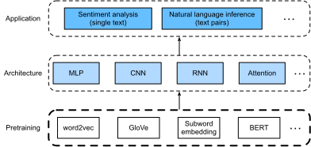

# Chế biến ngôn ngữ tự nhiên: Pretraining
:label:`chap_nlp_pretrain`

Con người cần giao tiếp. Trong nhu cầu cơ bản này của tình trạng con người, một lượng lớn văn bản bằng văn bản đã được tạo ra trên cơ sở hàng ngày. Với văn bản phong phú trên phương tiện truyền thông xã hội, ứng dụng trò chuyện, email, đánh giá sản phẩm, bài báo tin tức, bài báo nghiên cứu và sách, điều quan trọng là cho phép máy tính hiểu chúng để cung cấp hỗ trợ hoặc đưa ra quyết định dựa trên ngôn ngữ của con người. 

*Xử lý ngôn ngữ tự nhiên* nghiên cứu tương tác giữa máy tính và con người sử dụng ngôn ngữ tự nhiên.
Trong thực tế, rất phổ biến khi sử dụng các kỹ thuật xử lý ngôn ngữ tự nhiên để xử lý và phân tích dữ liệu văn bản (ngôn ngữ tự nhiên của con người), chẳng hạn như các mô hình ngôn ngữ trong :numref:`sec_language_model` và các mô hình dịch máy trong :numref:`sec_machine_translation`. 

Để hiểu văn bản, chúng ta có thể bắt đầu bằng cách học các đại diện của nó. Tận dụng các chuỗi văn bản hiện có từ corpora lớn,
*tự giám sát*
đã được sử dụng rộng rãi để chuẩn bị các biểu diễn văn bản, chẳng hạn như bằng cách dự đoán một số phần ẩn của văn bản bằng cách sử dụng một số phần khác của văn bản xung quanh của chúng. Bằng cách này, các mô hình học thông qua giám sát từ dữ liệu văn bản * massive* mà không có nỗ lực ghi nhãn * chi phí*! 

Như chúng ta sẽ thấy trong chương này, khi coi từng từ hoặc từ con như một mã thông báo riêng lẻ, biểu diễn của mỗi mã thông báo có thể được đào tạo trước bằng cách sử dụng các mô hình nhúng word2vec, Glove hoặc từ con trên corpora lớn. Sau khi đào tạo trước, biểu diễn của mỗi mã thông báo có thể là một vectơ, tuy nhiên, nó vẫn giữ nguyên bất kể bối cảnh là gì. Ví dụ, đại diện vector của “ngân hàng” là như nhau trong cả hai “đi đến ngân hàng để gửi một số tiền” và “đi đến ngân hàng để ngồi xuống”. Do đó, nhiều mô hình pretraining gần đây hơn thích ứng đại diện của cùng một mã thông báo với các bối cảnh khác nhau. Trong số đó có BERT, một mô hình tự giám sát sâu hơn nhiều dựa trên bộ mã hóa biến áp. Trong chương này, chúng tôi sẽ tập trung vào cách chuẩn bị các đại diện như vậy cho văn bản, như được tô sáng trong :numref:`fig_nlp-map-pretrain`. 


:label:`fig_nlp-map-pretrain`

Để nhìn thấy bức tranh lớn, :numref:`fig_nlp-map-pretrain` cho thấy rằng các đại diện văn bản được đào tạo sẵn có thể được cung cấp cho một loạt các kiến trúc học sâu cho các ứng dụng xử lý ngôn ngữ tự nhiên hạ nguồn khác nhau. Chúng tôi sẽ bao gồm chúng trong :numref:`chap_nlp_app`.

```toc
:maxdepth: 2

word2vec
approx-training
word-embedding-dataset
word2vec-pretraining
glove
subword-embedding
similarity-analogy
bert
bert-dataset
bert-pretraining
```
