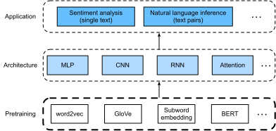

<!--
# Natural Language Processing: Pretraining
-->

# Xử lý Ngôn ngữ Tự nhiên: Tiền Huấn luyện
:label:`chap_nlp_pretrain`


<!--
Humans need to communicate.
Out of this basic need of the human condition, a vast amount of written text has been generated on an everyday basis.
Given rich text in social media, chat apps, emails, product reviews, news articles, research papers, and books, 
it becomes vital to enable computers to understand them to offer assistance or make decisions based on human languages.
-->

Con người luôn có nhu cầu được giao tiếp.
Chính từ nhu cầu cơ bản này mà một lượng lớn dữ liệu văn bản được tạo ra mỗi ngày.
Với lượng dữ liệu văn bản đa dạng từ mạng xã hội, ứng dụng trò chuyện, email, đánh giá sản phẩm, tài liệu nghiên cứu và sách báo,
việc giúp máy tính hiểu được những dữ liệu này trở nên quan trọng, nhằm đưa ra cách thức hỗ trợ hoặc quyết định dựa trên ngôn ngữ của con người.


<!--
Natural language processing studies interactions between computers and humans using natural languages.
In practice, it is very common to use natural language processing techniques to process and analyze text (human natural language) data, 
such as language models in :numref:`sec_language_model` and machine translation models in :numref:`sec_machine_translation`.
-->

Xử lý ngôn ngữ tự nhiên nghiên cứu sự tương tác bằng ngôn ngữ tự nhiên giữa máy tính và con người.
Trong thực tế, việc sử dụng các kỹ thuật xử lý ngôn ngữ tự nhiên để xử lý và phân tích dữ liệu văn bản (ngôn ngữ tự nhiên của con người) rất phổ biến,
chẳng hạn như các mô hình ngôn ngữ trong :numref:`sec_language_model` hay các mô hình dịch máy trong :numref:`sec_machine_translation`.


<!--
To understand text, we can begin with its representation, such as treating each word or subword as an individual text token.
As we will see in this chapter, the representation of each token can be pretrained on a large corpus, using word2vec, GloVe, or subword embedding models.
After pretraining, representation of each token can be a vector, however, it remains the same no matter what the context is.
For instance, the vector representation of "bank" is the same in both "go to the bank to deposit some money" and "go to the bank to sit down".
Thus, many more recent pretraining models adapt representation of the same token to different contexts.
Among them is BERT, a much deeper model based on the Transformer encoder.
In this chapter, we will focus on how to pretrain such representations for text, as highlighted in :numref:`fig_nlp-map-pretrain`.
-->


Để hiểu dữ liệu văn bản, ta có thể bắt đầu với cách biểu diễn loại dữ liệu này, chẳng hạn xem mỗi từ hay từ con như một token riêng lẻ.
Trong chương này, biểu diễn của mỗi token có thể được tiền huấn luyện trên một kho ngữ liệu lớn, sử dụng các mô hình word2vec, GloVe, hay embedding cho từ con.
Sau khi tiền huấn luyện, biểu diễn của mỗi token có thể là một vector.
Tuy nhiên, biểu diễn này vẫn không đổi dù ngữ cảnh xung quanh bất kể là gì.
Ví dụ, biểu diễn vector của từ "bank" là giống nhau trong câu "go to the bank to deposit some money" (ra *ngân hàng* để gửi tiền) và "go to the bank to sit down" (ra *bờ hồ* ngồi hóng mát).
Do đó, nhiều mô hình tiền huấn luyện gần đây điều chỉnh biểu diễn của cùng một token với các ngữ cảnh khác nhau.
Trong số đó có BERT, một mô hình sâu hơn rất nhiều dựa trên bộ mã hóa Transformer.
Trong chương này, ta sẽ tập trung vào cách tiền huấn luyện các biểu diễn như vậy cho văn bản, như được mô tả trong :numref:`fig_nlp-map-pretrain`.


<!--

-->


:label:`fig_nlp-map-pretrain`


<!--
As shown in :numref:`fig_nlp-map-pretrain`, the pretrained text representations can be fed to
a variety of deep learning architectures for different downstream natural language processing applications.
We will cover them in :numref:`chap_nlp_app`.
-->

Như mô tả trong :numref:`fig_nlp-map-pretrain`, các biểu diễn văn bản được tiền huấn luyện có thể được truyền vào
những kiến trúc học sâu cho các ứng dụng xử lý ngôn ngữ tự nhiên xuôi dòng khác nhau.
Chúng tôi sẽ trình bày các phần này trong :numref:`chap_nlp_app`.


```toc
:maxdepth: 2

word2vec_vn
approx-training_vn
word-embedding-dataset_vn
word2vec-pretraining_vn
glove_vn
subword-embedding_vn
similarity-analogy_vn
bert_vn
bert-dataset_vn
bert-pretraining_vn
```

## Những người thực hiện
Bản dịch trong trang này được thực hiện bởi:

* Đoàn Võ Duy Thanh
* Nguyễn Văn Quang
* Phạm Hồng Vinh
* Nguyễn Văn Cường

*Lần cập nhật gần nhất: 12/09/2020. (Cập nhật lần cuối từ nội dung gốc: 02/04/2020)*
