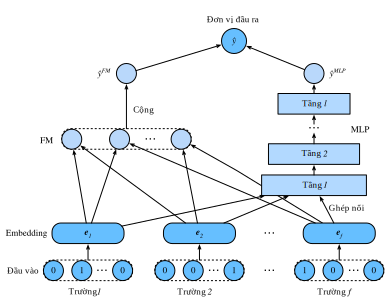

<!--
# Deep Factorization Machines
-->

# Máy Phân rã Ma trận Sâu


<!--
Learning effective feature combinations is critical to the success of click-through rate prediction task.
Factorization machines model feature interactions in a linear paradigm (e.g., bilinear interactions).
This is often insufficient for real-world data where inherent feature crossing structures are usually very complex and nonlinear.
What's worse, second-order feature interactions are generally used in factorization machines in practice.
Modeling higher degrees of feature combinations with factorization machines is possible theoretically 
but it is usually not adopted due to numerical instability and high computational complexity.
-->

Việc học những tổ hợp đặc trưng hiệu quả rất quan trọng đối với sự thành công của tác vụ dự đoán tỷ lệ nhấp chuột.
Máy phân rã ma trận mô hình hóa các tương tác đặc trưng dưới dạng tuyến tính (ví dụ như tương tác song tuyến tính).
Điều này thường không đủ đối với dữ liệu thực tế khi bản thân việc kết hợp chéo các đặc trưng thường có cấu trúc rất phức tạp và có dạng phi tuyến.
Tệ hơn, máy phân rã ma trận trong thực tế thường sử dụng các tương tác đặc trưng bậc hai.
Mô hình hóa tổ hợp tương tác với bậc cao hơn tuy khả thi về lý thuyết
nhưng thường không được sử dụng do tính bất ổn số học và độ phức tạp tính toán cao.


<!--
One effective solution is using deep neural networks.
Deep neural networks are powerful in feature representation learning and have the potential to learn sophisticated feature interactions.
As such, it is natural to integrate deep neural networks to factorization machines.
Adding nonlinear transformation layers to factorization machines gives it the capability to model both low-order feature combinations and high-order feature combinations.
Moreover, non-linear inherent structures from inputs can also be captured with deep neural networks.
In this section, we will introduce a representative model named deep factorization machines (DeepFM) :cite:`Guo.Tang.Ye.ea.2017` which combine FM and deep neural networks. 
-->

Một giải pháp hiệu quả hơn là sử dụng mạng nơ-ron sâu.
Mạng nơ-ron sâu rất hiệu quả khi học biểu diễn đặc trưng và có thể học được những tương tác đặc trưng tinh xảo.
Do đó, việc tích hợp chúng vào máy phân rã ma trận cũng dễ hiểu.
Việc thêm các tầng biến đổi phi tuyến vào máy phân rã ma trận giúp mô hình hóa cả những tổ hợp đặc trưng bậc thấp và bậc cao.
Hơn nữa, bản thân cấu trúc phi tuyến của đầu vào cũng có thể được nắm bắt thông qua mạng nơ-ron sâu.
Trong phần này, chúng tôi sẽ giới thiệu một mô hình biểu diễn được gọi là máy phân rã ma trận sâu (*deep factorization machines - DeepFM*) :cite:`Guo.Tang.Ye.ea.2017` kết hợp giữa FM và mạng nơ-ron sâu.


<!--
## Model Architectures 
-->

## Kiến trúc Mô hình


<!--
DeepFM consists of an FM component and a deep component which are integrated in a parallel structure.
The FM component is the same as the 2-way factorization machines which is used to model the low-order feature interactions.
The deep component is a multi-layered perceptron that is used to capture high-order feature interactions and nonlinearities.
These two components share the same inputs/embeddings and their outputs are summed up as the final prediction.
It is worth pointing out that the spirit of DeepFM resembles that of the Wide \& Deep architecture which can capture both memorization and generalization.
The advantages of DeepFM over the Wide \& Deep model is that it reduces the effort of hand-crafted feature engineering by identifying feature combinations automatically. 
-->

DeepFM bao gồm một thành phần FM và một mạng sâu được tích hợp theo cấu trúc song song.
FM là máy phân rã ma trận 2 chiều dùng để mô hình hóa tương tác đặc trưng bậc thấp.
Mạng sâu là một perceptron đa tầng dùng để nắm bắt tương tác đặc trưng bậc cao và tính phi tuyến.
Hai thành phần này có chung đầu vào/embedding và tổng đầu ra của chúng được lấy làm dự đoán cuối cùng.
Điều đáng nói là ý tưởng của DeepFM tương tự với kiến trúc Rộng \& Sâu, là kiến trúc có thể nắm bắt được cả sự ghi nhớ và tính khái quát.
DeepFM lợi thế hơn mô hình Rộng \& Sâu ở chỗ nó giảm tải việc thiết kế đặc trưng một cách thủ công bằng cách tự động nhận biết tổ hợp đặc trưng.


<!--
We omit the description of the FM component for brevity and denote the output as $\hat{y}^{(FM)}$.
Readers are referred to the last section for more details.
Let $\mathbf{e}_i \in \mathbb{R}^{k}$ denote the latent feature vector of the $i^\mathrm{th}$ field.
The input of the deep component is the concatenation of the dense embeddings of all fields 
that are looked up with the sparse categorical feature input, denoted as:
-->

Để ngắn gọn, ta bỏ qua phần mô tả FM và ký hiệu đầu ra của thành phần này là $\hat{y}^{(FM)}$.
Độc giả có thể tham khảo phần trước để biết thêm chi tiết.
Gọi $\mathbf{e}_i \in \mathbb{R}^{k}$ là vector đặc trưng tiềm ẩn của trường thứ $i$.
Đầu vào của mạng sâu là tổ hợp của embedding dày đặc của tất cả các trường
có thể được truy xuất với đầu vào đặc trưng danh mục thưa, ký hiệu là:


$$
\mathbf{z}^{(0)}  = [\mathbf{e}_1, \mathbf{e}_2, ..., \mathbf{e}_f],
$$


<!--
where $f$ is the number of fields.  It is then fed into the following neural network:
-->

trong đó $f$ là số trường. Sau đó nó được đưa vào mạng nơ-ron sau:


$$
\mathbf{z}^{(l)}  = \alpha(\mathbf{W}^{(l)}\mathbf{z}^{(l-1)} + \mathbf{b}^{(l)}),
$$


<!--
where $\alpha$ is the activation function.
$\mathbf{W}_{l}$ and $\mathbf{b}_{l}$ are the weight and bias at the $l^\mathrm{th}$ layer.
Let $y_{DNN}$ denote the output of the prediction.
The ultimate prediction of DeepFM is the summation of the outputs from both FM and DNN. So we have: 
-->

trong đó $\alpha$ là hàm kích hoạt.
$\mathbf{W}_{l}$ và $\mathbf{b}_{l}$ là trọng số và hệ số điều chỉnh tại tầng thứ $l$.
Gọi $y_{DNN}$ là đầu ra của dự đoán.
Dự đoán cuối cùng của DeepFM là tổng đầu ra từ cả FM và DNN:


$$
\hat{y} = \sigma(\hat{y}^{(FM)} + \hat{y}^{(DNN)}),
$$


<!--
where $\sigma$ is the sigmoid function.
The architecture of DeepFM is illustrated below.
-->

Trong đó $\sigma$ là hàm sigmoid.
Kiến trúc của DeepFM được minh họa như hình dưới.


<!--

-->


<!--
It is worth noting that DeepFM is not the only way to combine deep neural networks with FM.
We can also add nonlinear layers over the feature interactions :cite:`He.Chua.2017`.
-->

Đáng chú ý rằng DeepFM không phải là cách duy nhất để kết hợp mạng nơ-ron sâu với FM.
Ta cũng có thể thêm các tầng phi tuyến vào giữa các tương tác đặc trưng :cite:`He.Chua.2017`.


```{.python .input  n=2}
from d2l import mxnet as d2l
from mxnet import init, gluon, np, npx
from mxnet.gluon import nn
import os
import sys
npx.set_np()
```


<!--
## Implemenation of DeepFM
-->

## Lập trình DeepFM


<!--
The implementation of DeepFM is similar to that of FM.
We keep the FM part unchanged and use an MLP block with `relu` as the activation function.
Dropout is also used to regularize the model.
The number of neurons of the MLP can be adjusted with the `mlp_dims` hyperparameter.
-->

Cách lập trình cho DeepFM tương tự như FM.
Ta giữ nguyên FM và sử dụng khối MLP với hàm kích hoạt `relu`.
Dropout cũng được sử dụng để điều chuẩn mô hình.
Số nơ-ron của MLP có thể được điều chỉnh thông qua siêu tham số `mlp_dims`.


```{.python .input  n=2}
class DeepFM(nn.Block):
    def __init__(self, field_dims, num_factors, mlp_dims, drop_rate=0.1):
        super(DeepFM, self).__init__()
        num_inputs = int(sum(field_dims))
        self.embedding = nn.Embedding(num_inputs, num_factors)
        self.fc = nn.Embedding(num_inputs, 1)
        self.linear_layer = nn.Dense(1, use_bias=True)
        input_dim = self.embed_output_dim = len(field_dims) * num_factors
        self.mlp = nn.Sequential()
        for dim in mlp_dims:
            self.mlp.add(nn.Dense(dim, 'relu', True, in_units=input_dim))
            self.mlp.add(nn.Dropout(rate=drop_rate))
            input_dim = dim
        self.mlp.add(nn.Dense(in_units=input_dim, units=1))
        
    def forward(self, x):
        embed_x = self.embedding(x)
        square_of_sum = np.sum(embed_x, axis=1) ** 2
        sum_of_square = np.sum(embed_x ** 2, axis=1)
        inputs = np.reshape(embed_x, (-1, self.embed_output_dim))
        x = self.linear_layer(self.fc(x).sum(1)) \
            + 0.5 * (square_of_sum - sum_of_square).sum(1, keepdims=True) \
            + self.mlp(inputs)
        x = npx.sigmoid(x)
        return x
```


<!--
## Training and Evaluating the Model
-->

## Huấn luyện và Đánh giá Mô hình


<!--
The data loading process is the same as that of FM.
We set the MLP component of DeepFM to a three-layered dense network with the a pyramid structure (30-20-10).
All other hyperparameters remain the same as FM.
-->

Quá trình nạp dữ liệu giống với FM.
Ta đặt thành phần MLP của DeepFM là một mạng có ba tầng kết nối đầy đủ với cấu trúc kim tự tháp (30-20-10).
Tất cả các siêu tham số khác được giữ nguyên so với FM.


```{.python .input  n=4}
batch_size = 2048
data_dir = d2l.download_extract('ctr')
train_data = d2l.CTRDataset(os.path.join(data_dir, 'train.csv'))
test_data = d2l.CTRDataset(os.path.join(data_dir, 'test.csv'),
                           feat_mapper=train_data.feat_mapper,
                           defaults=train_data.defaults)
field_dims = train_data.field_dims
train_iter = gluon.data.DataLoader(
    train_data, shuffle=True, last_batch='rollover', batch_size=batch_size,
    num_workers=d2l.get_dataloader_workers())
test_iter = gluon.data.DataLoader(
    test_data, shuffle=False, last_batch='rollover', batch_size=batch_size,
    num_workers=d2l.get_dataloader_workers())
devices = d2l.try_all_gpus()
net = DeepFM(field_dims, num_factors=10, mlp_dims=[30, 20, 10])
net.initialize(init.Xavier(), ctx=devices)
lr, num_epochs, optimizer = 0.01, 30, 'adam'
trainer = gluon.Trainer(net.collect_params(), optimizer,
                        {'learning_rate': lr})
loss = gluon.loss.SigmoidBinaryCrossEntropyLoss()
d2l.train_ch13(net, train_iter, test_iter, loss, trainer, num_epochs, devices)
```


<!--
Compared with FM, DeepFM converges faster and achieves better performance.
-->

So với FM, DeepFM hội tụ nhanh hơn và đạt được hiệu năng tốt hơn.


## Tóm tắt

<!--
* Integrating neural networks to FM enables it to model complex and high-order interactions. 
* DeepFM outperforms the original FM on the advertising dataset.
-->

* Việc tích hợp mạng nơ-ron vào FM cho phép mô hình hóa các tương tác phức tạp và có bậc cao.
* DeepFM vượt trội so với FM nguyên bản trên tập dữ liệu quảng cáo.


## Bài tập

<!--
* Vary the structure of the MLP to check its impact on model performance.
* Change the dataset to Criteo and compare it with the original FM model.
-->

* Thay đổi cấu trúc của MLP để kiểm tra ảnh hưởng của nó lên hiệu năng mô hình.
* Sử dụng tập dữ liệu Criteo và so sánh DeepFM với mô hình FM gốc.


## Thảo luận
* Tiếng Anh: [MXNet](https://discuss.d2l.ai/t/407)
* Tiếng Việt: [Diễn đàn Machine Learning Cơ Bản](https://forum.machinelearningcoban.com/c/d2l)


## Những người thực hiện
Bản dịch trong trang này được thực hiện bởi:

* Đoàn Võ Duy Thanh
* Đỗ Trường Giang
* Phạm Hồng Vinh
* Nguyễn Lê Quang Nhật
* Nguyễn Văn Cường

*Cập nhật lần cuối: 05/10/2020. (Cập nhật lần cuối từ nội dung gốc: 21/07/2020)*
