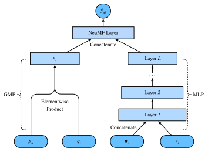

# Lọc hợp tác thần kinh để xếp hạng cá nhân hóa

Phần này vượt ra ngoài phản hồi rõ ràng, giới thiệu khung lọc hợp tác thần kinh (NCF) để đề xuất với phản hồi ngầm. Phản hồi ngầm là phổ biến trong các hệ thống recommender. Các hành động như Nhấp chuột, mua và đồng hồ là phản hồi tiềm ẩn phổ biến dễ thu thập và chỉ ra sở thích của người dùng. Mô hình chúng tôi sẽ giới thiệu, có tựa đề NeuMF :cite:`He.Liao.Zhang.ea.2017`, viết tắt của factorization ma trận thần kinh, nhằm mục đích giải quyết nhiệm vụ xếp hạng được cá nhân hóa với phản hồi ngầm. Mô hình này thúc đẩy tính linh hoạt và phi tuyến tính của các mạng thần kinh để thay thế các sản phẩm chấm của factorization ma trận, nhằm tăng cường tính biểu cảm của mô hình. Cụ thể, mô hình này được cấu trúc với hai mạng con bao gồm tính toán ma trận tổng quát (GMF) và MLP và mô hình các tương tác từ hai con đường thay vì các sản phẩm chấm đơn giản. Kết quả đầu ra của hai mạng này được nối để tính toán điểm dự đoán cuối cùng. Không giống như nhiệm vụ dự đoán xếp hạng trong AutoRec, mô hình này tạo danh sách đề xuất được xếp hạng cho mỗi người dùng dựa trên phản hồi ngầm. Chúng tôi sẽ sử dụng tổn thất xếp hạng được cá nhân hóa được giới thiệu trong phần cuối để đào tạo mô hình này. 

## Mô hình NeuMF

Như đã nói ở trên, NeuMF hợp nhất hai mạng con. GMF là một phiên bản mạng thần kinh chung của factorization ma trận trong đó đầu vào là sản phẩm elementwise của người dùng và các yếu tố tiềm ẩn mục. Nó bao gồm hai lớp thần kinh: 

$$
\mathbf{x} = \mathbf{p}_u \odot \mathbf{q}_i \\
\hat{y}_{ui} = \alpha(\mathbf{h}^\top \mathbf{x}),
$$

trong đó $\odot$ biểu thị sản phẩm Hadamard của vectơ. $\mathbf{P} \in \mathbb{R}^{m \times k}$ và $\mathbf{Q} \in \mathbb{R}^{n \times k}$ hợp tác với ma trận tiềm ẩn của người dùng và mục tương ứng. $\mathbf{p}_u \in \mathbb{R}^{ k}$ là hàng $u^\mathrm{th}$ $P$ và $\mathbf{q}_i \in \mathbb{R}^{ k}$ là hàng $i^\mathrm{th}$ của $Q$. $\alpha$ và $h$ biểu thị chức năng kích hoạt và trọng lượng của lớp đầu ra . $\hat{y}_{ui}$ là điểm dự đoán của người dùng $u$ có thể cung cấp cho mục $i$. 

Một thành phần khác của mô hình này là MLP. Để làm phong phú tính linh hoạt của mô hình, mạng con MLP không chia sẻ nhúng người dùng và mục với GMF. Nó sử dụng việc nối các nhúng người dùng và mục làm đầu vào. Với các kết nối phức tạp và biến đổi phi tuyến, nó có khả năng ước tính các tương tác phức tạp giữa người dùng và các mặt hàng. Chính xác hơn, mạng con MLP được định nghĩa là: 

$$
\begin{aligned}
z^{(1)} &= \phi_1(\mathbf{U}_u, \mathbf{V}_i) = \left[ \mathbf{U}_u, \mathbf{V}_i \right] \\
\phi^{(2)}(z^{(1)})  &= \alpha^1(\mathbf{W}^{(2)} z^{(1)} + b^{(2)}) \\
&... \\
\phi^{(L)}(z^{(L-1)}) &= \alpha^L(\mathbf{W}^{(L)} z^{(L-1)} + b^{(L)})) \\
\hat{y}_{ui} &= \alpha(\mathbf{h}^\top\phi^L(z^{(L-1)}))
\end{aligned}
$$

trong đó $\mathbf{W}^*, \mathbf{b}^*$ và $\alpha^*$ biểu thị ma trận trọng lượng, vector thiên vị và chức năng kích hoạt. $\phi^*$ biểu thị hàm của lớp tương ứng. $\mathbf{z}^*$ biểu thị đầu ra của lớp tương ứng. 

Để hợp nhất kết quả của GMF và MLP, thay vì bổ sung đơn giản, NeuMF nối các lớp cuối cùng thứ hai của hai mạng con để tạo ra một vectơ tính năng có thể được truyền đến các lớp tiếp theo. Sau đó, các đầu ra được chiếu với ma trận $\mathbf{h}$ và chức năng kích hoạt sigmoid. Lớp dự đoán được xây dựng là: $$\ hat {y} _ {ui} =\ sigma (\ mathbf {h} ^\ top [\ mathbf {x},\ phi^L (z^ {(L-1)})]) . $$ 

Hình dưới đây minh họa kiến trúc mô hình của NeuMF. 



```{.python .input  n=1}
from d2l import mxnet as d2l
from mxnet import autograd, gluon, np, npx
from mxnet.gluon import nn
import mxnet as mx
import random

npx.set_np()
```

## Mô hình triển khai Mã sau đây thực hiện mô hình NeuMF. Nó bao gồm một mô hình factorization ma trận tổng quát và một MLP với các vectơ nhúng người dùng và mục khác nhau. Cấu trúc của MLP được điều khiển với tham số `nums_hiddens`. ReLU được sử dụng làm chức năng kích hoạt mặc định.

```{.python .input  n=2}
class NeuMF(nn.Block):
    def __init__(self, num_factors, num_users, num_items, nums_hiddens,
                 **kwargs):
        super(NeuMF, self).__init__(**kwargs)
        self.P = nn.Embedding(num_users, num_factors)
        self.Q = nn.Embedding(num_items, num_factors)
        self.U = nn.Embedding(num_users, num_factors)
        self.V = nn.Embedding(num_items, num_factors)
        self.mlp = nn.Sequential()
        for num_hiddens in nums_hiddens:
            self.mlp.add(nn.Dense(num_hiddens, activation='relu',
                                  use_bias=True))
        self.prediction_layer = nn.Dense(1, activation='sigmoid', use_bias=False)

    def forward(self, user_id, item_id):
        p_mf = self.P(user_id)
        q_mf = self.Q(item_id)
        gmf = p_mf * q_mf
        p_mlp = self.U(user_id)
        q_mlp = self.V(item_id)
        mlp = self.mlp(np.concatenate([p_mlp, q_mlp], axis=1))
        con_res = np.concatenate([gmf, mlp], axis=1)
        return self.prediction_layer(con_res)
```

## Bộ dữ liệu tùy chỉnh với lấy mẫu tiêu cực

Đối với thua bảng xếp hạng cặp, một bước quan trọng là lấy mẫu tiêu cực. Đối với mỗi người dùng, các mục mà người dùng chưa tương tác là các mục ứng cử viên (mục không quan sát). Chức năng sau lấy danh tính người dùng và các mục ứng cử viên làm đầu vào, và lấy mẫu các mục tiêu cực ngẫu nhiên cho mỗi người dùng từ bộ ứng viên của người dùng đó. Trong giai đoạn đào tạo, mô hình đảm bảo rằng các mục mà người dùng thích được xếp hạng cao hơn các mặt hàng mà anh ta không thích hoặc chưa tương tác.

```{.python .input  n=3}
class PRDataset(gluon.data.Dataset):
    def __init__(self, users, items, candidates, num_items):
        self.users = users
        self.items = items
        self.cand = candidates
        self.all = set([i for i in range(num_items)])

    def __len__(self):
        return len(self.users)

    def __getitem__(self, idx):
        neg_items = list(self.all - set(self.cand[int(self.users[idx])]))
        indices = random.randint(0, len(neg_items) - 1)
        return self.users[idx], self.items[idx], neg_items[indices]
```

## Người đánh giá Trong phần này, chúng tôi áp dụng việc tách theo chiến lược thời gian để xây dựng các bộ đào tạo và kiểm tra. Hai biện pháp đánh giá bao gồm tỷ lệ hit ở mức cắt giảm $\ell$ ($\ text {Hit} @\ ell$) and area under the ROC curve (AUC) are used to assess the model effectiveness.  Hit rate at given position $\ ell$ cho mỗi người dùng chỉ ra rằng liệu mục được đề xuất có nằm trong danh sách xếp hạng $\ell$ hàng đầu hay không. Định nghĩa chính thức như sau: 

$$
\text{Hit}@\ell = \frac{1}{m} \sum_{u \in \mathcal{U}} \textbf{1}(rank_{u, g_u} <= \ell),
$$

trong đó $\textbf{1}$ biểu thị một hàm chỉ số bằng một nếu mục chân lý mặt đất được xếp hạng trong danh sách $\ell$ hàng đầu, nếu không nó bằng 0. $rank_{u, g_u}$ biểu thị xếp hạng của mục chân lý mặt đất $g_u$ của người dùng $u$ trong danh sách đề xuất (Xếp hạng lý tưởng là 1). $m$ là số lượng người dùng. $\mathcal{U}$ là bộ người dùng. 

Định nghĩa của AUC như sau: 

$$
\text{AUC} = \frac{1}{m} \sum_{u \in \mathcal{U}} \frac{1}{|\mathcal{I} \backslash S_u|} \sum_{j \in I \backslash S_u} \textbf{1}(rank_{u, g_u} < rank_{u, j}),
$$

trong đó $\mathcal{I}$ là bộ mục. $S_u$ là mục ứng cử viên của người dùng $u$. Lưu ý rằng nhiều giao thức đánh giá khác như độ chính xác, thu hồi và mức tăng tích lũy chiết khấu chuẩn hóa (NDCG) cũng có thể được sử dụng. 

Hàm sau tính toán số lượt truy cập và AUC cho mỗi người dùng.

```{.python .input  n=4}
#@save
def hit_and_auc(rankedlist, test_matrix, k):
    hits_k = [(idx, val) for idx, val in enumerate(rankedlist[:k])
              if val in set(test_matrix)]
    hits_all = [(idx, val) for idx, val in enumerate(rankedlist)
                if val in set(test_matrix)]
    max = len(rankedlist) - 1
    auc = 1.0 * (max - hits_all[0][0]) / max if len(hits_all) > 0 else 0
    return len(hits_k), auc
```

Sau đó, tỷ lệ Hit tổng thể và AUC được tính như sau.

```{.python .input  n=5}
#@save
def evaluate_ranking(net, test_input, seq, candidates, num_users, num_items,
                     devices):
    ranked_list, ranked_items, hit_rate, auc = {}, {}, [], []
    all_items = set([i for i in range(num_users)])
    for u in range(num_users):
        neg_items = list(all_items - set(candidates[int(u)]))
        user_ids, item_ids, x, scores = [], [], [], []
        [item_ids.append(i) for i in neg_items]
        [user_ids.append(u) for _ in neg_items]
        x.extend([np.array(user_ids)])
        if seq is not None:
            x.append(seq[user_ids, :])
        x.extend([np.array(item_ids)])
        test_data_iter = gluon.data.DataLoader(
            gluon.data.ArrayDataset(*x), shuffle=False, last_batch="keep",
            batch_size=1024)
        for index, values in enumerate(test_data_iter):
            x = [gluon.utils.split_and_load(v, devices, even_split=False)
                 for v in values]
            scores.extend([list(net(*t).asnumpy()) for t in zip(*x)])
        scores = [item for sublist in scores for item in sublist]
        item_scores = list(zip(item_ids, scores))
        ranked_list[u] = sorted(item_scores, key=lambda t: t[1], reverse=True)
        ranked_items[u] = [r[0] for r in ranked_list[u]]
        temp = hit_and_auc(ranked_items[u], test_input[u], 50)
        hit_rate.append(temp[0])
        auc.append(temp[1])
    return np.mean(np.array(hit_rate)), np.mean(np.array(auc))
```

## Đào tạo và đánh giá mô hình

Chức năng đào tạo được định nghĩa dưới đây. Chúng tôi đào tạo mô hình theo cách cặp.

```{.python .input  n=6}
#@save
def train_ranking(net, train_iter, test_iter, loss, trainer, test_seq_iter,
                  num_users, num_items, num_epochs, devices, evaluator,
                  candidates, eval_step=1):
    timer, hit_rate, auc = d2l.Timer(), 0, 0
    animator = d2l.Animator(xlabel='epoch', xlim=[1, num_epochs], ylim=[0, 1],
                            legend=['test hit rate', 'test AUC'])
    for epoch in range(num_epochs):
        metric, l = d2l.Accumulator(3), 0.
        for i, values in enumerate(train_iter):
            input_data = []
            for v in values:
                input_data.append(gluon.utils.split_and_load(v, devices))
            with autograd.record():
                p_pos = [net(*t) for t in zip(*input_data[0:-1])]
                p_neg = [net(*t) for t in zip(*input_data[0:-2],
                                              input_data[-1])]
                ls = [loss(p, n) for p, n in zip(p_pos, p_neg)]
            [l.backward(retain_graph=False) for l in ls]
            l += sum([l.asnumpy() for l in ls]).mean()/len(devices)
            trainer.step(values[0].shape[0])
            metric.add(l, values[0].shape[0], values[0].size)
            timer.stop()
        with autograd.predict_mode():
            if (epoch + 1) % eval_step == 0:
                hit_rate, auc = evaluator(net, test_iter, test_seq_iter,
                                          candidates, num_users, num_items,
                                          devices)
                animator.add(epoch + 1, (hit_rate, auc))
    print(f'train loss {metric[0] / metric[1]:.3f}, '
          f'test hit rate {float(hit_rate):.3f}, test AUC {float(auc):.3f}')
    print(f'{metric[2] * num_epochs / timer.sum():.1f} examples/sec '
          f'on {str(devices)}')
```

Bây giờ, chúng ta có thể tải bộ dữ liệu MovieLens 100k và đào tạo mô hình. Vì chỉ có xếp hạng trong tập dữ liệu MovieLens, với một số tổn thất về độ chính xác, chúng tôi nhị phân hóa các xếp hạng này thành số không và những thứ hạng. Nếu người dùng đánh giá một mục, chúng tôi coi phản hồi ngầm là một, nếu không là không. Hành động đánh giá một mặt hàng có thể được coi là một hình thức cung cấp phản hồi ngầm. Ở đây, chúng tôi chia tập dữ liệu ở chế độ `seq-aware` nơi các mục tương tác mới nhất của người dùng bị bỏ lại để thử nghiệm.

```{.python .input  n=11}
batch_size = 1024
df, num_users, num_items = d2l.read_data_ml100k()
train_data, test_data = d2l.split_data_ml100k(df, num_users, num_items,
                                              'seq-aware')
users_train, items_train, ratings_train, candidates = d2l.load_data_ml100k(
    train_data, num_users, num_items, feedback="implicit")
users_test, items_test, ratings_test, test_iter = d2l.load_data_ml100k(
    test_data, num_users, num_items, feedback="implicit")
train_iter = gluon.data.DataLoader(
    PRDataset(users_train, items_train, candidates, num_items ), batch_size,
    True, last_batch="rollover", num_workers=d2l.get_dataloader_workers())
```

Sau đó chúng tôi tạo và khởi tạo mô hình. chúng tôi sử dụng MLP ba lớp với kích thước ẩn liên tục 10.

```{.python .input  n=8}
devices = d2l.try_all_gpus()
net = NeuMF(10, num_users, num_items, nums_hiddens=[10, 10, 10])
net.initialize(ctx=devices, force_reinit=True, init=mx.init.Normal(0.01))
```

Mã sau đây đào tạo mô hình.

```{.python .input  n=12}
lr, num_epochs, wd, optimizer = 0.01, 10, 1e-5, 'adam'
loss = d2l.BPRLoss()
trainer = gluon.Trainer(net.collect_params(), optimizer,
                        {"learning_rate": lr, 'wd': wd})
train_ranking(net, train_iter, test_iter, loss, trainer, None, num_users,
              num_items, num_epochs, devices, evaluate_ranking, candidates)
```

## Tóm tắt

* Thêm phi tuyến tính vào mô hình factorization ma trận có lợi cho việc cải thiện khả năng và hiệu quả của mô hình.
* NeuMF là sự kết hợp giữa factorization ma trận và perceptron đa lớp. Các perceptron đa lớp lấy sự nối của người dùng và mục nhúng làm đầu vào.

## Bài tập

* Thay đổi kích thước của các yếu tố tiềm ẩn. Kích thước của các yếu tố tiềm ẩn ảnh hưởng đến hiệu suất mô hình như thế nào?
* Thay đổi các kiến trúc (ví dụ: số lớp, số lượng tế bào thần kinh của mỗi lớp) của MLP để kiểm tra tác động của nó đối với hiệu suất.
* Hãy thử các trình tối ưu hóa khác nhau, tốc độ học tập và tỷ lệ phân rã cân nặng.
* Cố gắng sử dụng bản lề mất được xác định trong phần cuối cùng để tối ưu hóa mô hình này.

:begin_tab:`mxnet`
[Discussions](https://discuss.d2l.ai/t/403)
:end_tab:
