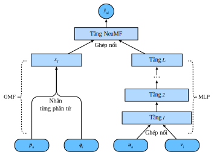

<!--
# Neural Collaborative Filtering for Personalized Ranking
-->

# Lọc Cộng tác Nơ-ron cho Cá nhân hóa Xếp hạng 


<!--
This section moves beyond explicit feedback, introducing the neural collaborative filtering (NCF) framework for recommendation with implicit feedback.
Implicit feedback is pervasive in recommender systems.
Actions such as Clicks, buys, and watches are common implicit feedback which are easy to collect and indicative of users' preferences.
The model we will introduce, titled NeuMF :cite:`He.Liao.Zhang.ea.2017`, short for neural matrix factorization, aims to address the personalized ranking task with implicit feedback.
This model leverages the flexibility and non-linearity of neural networks to replace dot products of matrix factorization, aiming at enhancing the model expressiveness.
In specific, this model is structured with two subnetworks including generalized matrix factorization (GMF) and MLP and models the interactions from two pathways instead of simple inner products.
The outputs of these two networks are concatenated for the final prediction scores calculation.
Unlike the rating prediction task in AutoRec, this model generates a ranked recommendation list to each user based on the implicit feedback.
We will use the personalized ranking loss introduced in the last section to train this model.
-->

Vượt ra khỏi phản hồi trực tiếp, phần này sẽ giới thiệu một framework nơ-ron lọc cộng tác (*neural collaborative filtering framework* - NCF) cho bài toán đề xuất sử dụng phản hồi gián tiếp.
Phản hồi gián tiếp có mặt khắp mọi nơi trong các hệ thống đề xuất.
Các hành động như nhấn chọn, mua và xem là những phản hồi gián tiếp phổ biến có thể dễ dàng thu thập và thể hiện được sở thích của người dùng.
Mô hình được giới thiệu là phân rã ma trận nơ-ron (*neural matrix factorization*) viết tắt là NeuMF :cite:`He.Liao.Zhang.ea.2017`, 
hướng tới việc giải quyết tác vụ xếp hạng cá nhân hóa sử dụng phản hồi gián tiếp.
Mô hình này tận dụng tính linh hoạt và tính phi tuyến của mạng nơ-ron để thay thế tích vô hướng trong phân rã ma trận, nhằm nâng cao tính biểu diễn của mô hình.
Cụ thể, mô hình này gồm hai mạng con là phân rã ma trận tổng quát (*Generalized Matrix Factorization* - GMF) và MLP, 
và mô hình hóa các tương tác theo hai mạng này thay vì các tích vô hướng đơn giản.
Kết quả đầu ra của hai mạng này được ghép nối với nhau để tính điểm dự đoán cuối cùng.
Không giống như tác vụ dự đoán đánh giá trong AutoRec, mô hình này sinh ra danh sách đề xuất đã được xếp hạng cho từng người dùng dựa trên phản hồi gián tiếp.
Chúng ta sẽ sử dụng mất mát xếp hạng cá nhân hóa đã được giới thiệu trong phần trước để huấn luyện mô hình này.


<!--
## The NeuMF model
-->

## Mô hình NeuMF


<!--
As aforementioned, NeuMF fuses two subnetworks.
The GMF is a generic neural network version of matrix factorization where the input is the elementwise product of user and item latent factors.
It consists of two neural layers:
-->

Như đã đề cập, NeuMF kết hợp hai mạng con với nhau.
GMF là một phiên bản mạng nơ-ron tổng quát của phép phân rã ma trận, có đầu vào là tích theo từng phần tử giữa các đặc trưng ẩn của người dùng và sản phẩm.
Nó bao gồm hai tầng nơ-ron sau:


$$
\mathbf{x} = \mathbf{p}_u \odot \mathbf{q}_i \\
\hat{y}_{ui} = \alpha(\mathbf{h}^\top \mathbf{x}),
$$


<!--
where $\odot$ denotes the Hadamard product of vectors.
$\mathbf{P} \in \mathbb{R}^{m \times k}$  and $\mathbf{Q} \in \mathbb{R}^{n \times k}$ corespond to user and item latent matrix respectively.
$\mathbf{p}_u \in \mathbb{R}^{ k}$ is the $u^\mathrm{th}$ row of $P$ and $\mathbf{q}_i \in \mathbb{R}^{ k}$ is the $i^\mathrm{th}$ row of $Q$. 
$\alpha$ and $h$ denote the activation function and weight of the output layer.
$\hat{y}_{ui}$ is the prediction score of the user $u$ might give to the item $i$.
-->

trong đó $\odot$ là phép nhân Hadamard của hai vector.
$\mathbf{P} \in \mathbb{R}^{m \times k}$ và $\mathbf{Q} \in \mathbb{R}^{n \times k}$ lần lượt là ma trận đặc trưng tiềm ẩn của người dùng và sản phẩm.
$\mathbf{p}_u \in \mathbb{R}^{ k}$ là hàng thứ $u$ của ma trận $P$ và $\mathbf{q}_i \in \mathbb{R}^{ k}$ hàng thứ $i$ của ma trận $Q$.
$\alpha$ và $h$ ký hiệu hàm kích hoạt và trọng số của tầng đầu ra.
$\hat{y}_{ui}$ là điểm dự đoán mà người dùng $u$ có thể đưa ra cho sản phẩm $i$.


<!--
Another component of this model is MLP.
To enrich model flexibility, the MLP subnetwork does not share user and item embeddings with GMF.
It uses the concatenation of user and item embeddings as input.
With the complicated connections and nonlinear transformations, it is capable of estimating the intricate interactions between users and items.
More precisely, the MLP subnetwork is defined as:
-->

Thành phần còn lại của mô hình này là MLP.
Để tăng tính linh hoạt của mô hình, MLP không dùng chung các embedding người dùng và sản phẩm với GMF,
mà có đầu vào là vector ghép nối của hai embedding người dùng và sản phẩm.
Với các kết nối phức tạp và các phép biến đổi phi tuyến, nó có thể ước lượng các tương tác phức tạp giữa người dùng và sản phẩm.
Chính xác hơn, MLP được định nghĩa như sau:


$$
\begin{aligned}
z^{(1)} &= \phi_1(\mathbf{U}_u, \mathbf{V}_i) = \left[ \mathbf{U}_u, \mathbf{V}_i \right] \\
\phi^{(2)}(z^{(1)})  &= \alpha^1(\mathbf{W}^{(2)} z^{(1)} + b^{(2)}) \\
&... \\
\phi^{(L)}(z^{(L-1)}) &= \alpha^L(\mathbf{W}^{(L)} z^{(L-1)} + b^{(L)})) \\
\hat{y}_{ui} &= \alpha(\mathbf{h}^\top\phi^L(z^{(L-1)}))
\end{aligned}
$$


<!--
where $\mathbf{W}^*, \mathbf{b}^*$ and $\alpha^*$ denote the weight matrix, bias vector, and activation function.
$\phi^*$ denotes the function of the corresponding layer.
$\mathbf{z}^*$ denotes the output of corresponding layer.
-->

trong đó $\mathbf{W}^*, \mathbf{b}^*$ và $\alpha^*$ là ma trận trọng số, vector hệ số điều chỉnh, và hàm kích hoạt.
Hàm của tầng tương ứng được ký hiệu là $\phi^*$.
Đầu ra của tầng tương ứng được ký hiệu là $\mathbf{z}^*$.


<!--
To fuse the results of GMF and MLP, instead of simple addition, 
NeuMF concatenates the second last layers of two subnetworks to create a feature vector which can be passed to the further layers.
Afterwards, the ouputs are projected with matrix $\mathbf{h}$ and a sigmoid activation function.
The prediction layer is formulated as:
-->

Để kết hợp các đầu ra của GMF và MLP, thay vì phép cộng đơn giản,
NeuMF ghép nối các tầng áp chót của hai mạng con để tạo thành một vector đặc trưng có thể được truyền vào các tầng tiếp theo.
Sau đó, các đầu ra sẽ được chiếu bởi ma trận $\mathbf{h}$ và hàm kích hoạt sigmoid.
Tầng dự đoán có công thức như sau:


$$
\hat{y}_{ui} = \sigma(\mathbf{h}^\top[\mathbf{x}, \phi^L(z^{(L-1)})]).
$$


<!--
The following figure illustrates the model architecture of NeuMF.
-->

Hình dưới đây minh họa kiến trúc mô hình NeuMF.


<!--  -->


```{.python .input  n=1}
from d2l import mxnet as d2l
from mxnet import autograd, gluon, np, npx
from mxnet.gluon import nn
import mxnet as mx
import random
import sys
npx.set_np()
```


<!--
## Model Implementation
-->

## Lập trình Mô hình


<!--
The following code implements the NeuMF model.
It consists of a generalized matrix factorization model and a multi-layered perceptron with different user and item embedding vectors.
The structure of the MLP is controlled with the parameter `nums_hiddens`.
ReLU is used as the default activation function.
-->

Đoạn mã dưới đây lập trình mô hình NeuMF,
bao gồm GMF và MLP với các vector embedding người dùng và sản phẩm khác nhau.
Kiến trúc của MLP được quy định qua tham số `nums_hiddens`.
Hàm kích hoạt mặc định là ReLU.


```{.python .input  n=2}
class NeuMF(nn.Block):
    def __init__(self, num_factors, num_users, num_items, nums_hiddens,
                 **kwargs):
        super(NeuMF, self).__init__(**kwargs)
        self.P = nn.Embedding(num_users, num_factors)
        self.Q = nn.Embedding(num_items, num_factors)
        self.U = nn.Embedding(num_users, num_factors)
        self.V = nn.Embedding(num_items, num_factors)
        self.mlp = nn.Sequential()
        for num_hiddens in nums_hiddens:
            self.mlp.add(nn.Dense(num_hiddens, activation='relu',
                                  use_bias=True))
        self.prediction_layer = nn.Dense(1, activation='sigmoid', use_bias=False)

    def forward(self, user_id, item_id):
        p_mf = self.P(user_id)
        q_mf = self.Q(item_id)
        gmf = p_mf * q_mf
        p_mlp = self.U(user_id)
        q_mlp = self.V(item_id)
        mlp = self.mlp(np.concatenate([p_mlp, q_mlp], axis=1))
        con_res = np.concatenate([gmf, mlp], axis=1)
        return self.prediction_layer(con_res)
```


<!--
## Customized Dataset with Negative Sampling
-->

## Tập Dữ liệu Tùy chỉnh với phép Lấy mẫu Âm


<!--
For pairwise ranking loss, an important step is negative sampling.
For each user, the items that a user has not interacted with are candidate items (unobserved entries).
The following function takes users identity and candidate items as input, and samples negative items randomly for each user from the candidate set of that user.
During the training stage, the model ensures that the items that a user likes to be ranked higher than items he dislikes or has not interacted with.
-->

Một bước quan trọng trong mất mát xếp hạng theo cặp là lấy mẫu âm.
Với mỗi người dùng, các sản phẩm mà người đó chưa tương tác là các sản phẩm tiềm năng (các mục chưa được quan sát).
Hàm dưới đây có đầu vào là danh tính người dùng và các sản phẩm tiềm năng, và lấy mẫu âm các sản phẩm ngẫu nhiên cho từng người dùng từ tập tiềm năng của người dùng đó.
Trong quá trình huấn luyện, mô hình đảm bảo rằng các sản phẩm mà một người dùng thích sẽ được xếp hạng cao hơn các sản phẩm mà người này không thích hoặc chưa từng tương tác.


```{.python .input  n=3}
class PRDataset(gluon.data.Dataset):
    def __init__(self, users, items, candidates, num_items):
        self.users = users
        self.items = items
        self.cand = candidates
        self.all = set([i for i in range(num_items)])

    def __len__(self):
        return len(self.users)

    def __getitem__(self, idx):
        neg_items = list(self.all - set(self.cand[int(self.users[idx])]))
        indices = random.randint(0, len(neg_items) - 1)
        return self.users[idx], self.items[idx], neg_items[indices]
```


<!--
## Evaluator
-->

## Đánh giá


<!--
In this section, we adopt the splitting by time strategy to construct the training and test sets.
Two evaluation measures including hit rate at given cutting off $\ell$ ($\text{Hit}@\ell$) and area under the ROC curve (AUC) are used to assess the model effectiveness.
Hit rate at given position $\ell$ for each user indicates that whether the recommended item is included in the top $\ell$ ranked list.
The formal definition is as follows:
-->

Trong phần này, ta sẽ áp dụng chiến lược chia tách theo thời gian để xây dựng tập huấn luyện và tập kiểm tra.
Hai phép đánh giá bao gồm tỷ lệ chọn đúng (*hit rate*) theo ngưỡng $\ell$ ($\text{Hit}@\ell$) cho trước và diện tích dưới đường cong ROC (AUC) được sử dụng để đánh giá hiệu quả của mô hình.
Tỷ lệ chọn đúng tại ngưỡng $\ell$ cho trước với mỗi người dùng cho thấy rằng liệu sản phẩm được đề xuất có được đưa vào danh sách $\ell$ sản phẩm xếp hạng hàng đầu hay không.
Định nghĩa toán học như sau:


$$
\text{Hit}@\ell = \frac{1}{m} \sum_{u \in \mathcal{U}} \textbf{1}(rank_{u, g_u} <= \ell),
$$


<!--
where $\textbf{1}$ denotes an indicator function that is equal to one if the ground truth item is ranked in the top $\ell$ list, otherwise it is equal to zero.
$rank_{u, g_u}$ denotes the ranking of the ground truth item $g_u$ of the user $u$ in the recommendation list (The ideal ranking is 1).
$m$ is the number of users. $\mathcal{U}$ is the user set.
-->

trong đó $\textbf{1}$ là hàm biểu thị, hàm này bằng 1 nếu sản phẩm nhãn gốc được xếp hạng trong danh sách $\ell$ sản phẩm hàng đầu, ngược lại hàm trả về 0.
$rank_{u, g_u}$ ký hiệu xếp hạng của sản phẩm nhãn gốc $g_u$ của người dùng $u$ trong danh sách đề xuất (xếp hạng lý tưởng là 1).
$m$ là số lượng người dùng. $\mathcal{U}$ là tập người dùng.

<!--
The definition of AUC is as follows:
-->

Định nghĩa AUC được mô tả dưới đây:


$$
\text{AUC} = \frac{1}{m} \sum_{u \in \mathcal{U}} \frac{1}{|\mathcal{I} \backslash S_u|} \sum_{j \in I \backslash S_u} \textbf{1}(rank_{u, g_u} < rank_{u, j}),
$$


<!--
where $\mathcal{I}$ is the item set. $S_u$ is the candidate items of user $u$.
Note that many other evaluation protocols such as precision, 
recall and normalized discounted cumulative gain (NDCG) can also be used.
-->

trong đó $\mathcal{I}$ là tập các sản phẩm. $S_u$ là các sản phẩm tiềm năng của người dùng $u$.
Chú ý rằng có rất nhiều phép đánh giá khác như precision, recall, hay NDCG (*Normalized Discounted Cumulative Gain*) cũng có thể được sử dụng.


<!--
The following function calculates the hit counts and AUC for each user.
-->

Hàm sau đây tính toán số lần chọn đúng và AUC cho mỗi người dùng.


```{.python .input  n=4}
#@save
def hit_and_auc(rankedlist, test_matrix, k):
    hits_k = [(idx, val) for idx, val in enumerate(rankedlist[:k])
              if val in set(test_matrix)]
    hits_all = [(idx, val) for idx, val in enumerate(rankedlist)
                if val in set(test_matrix)]
    max = len(rankedlist) - 1
    auc = 1.0 * (max - hits_all[0][0]) / max if len(hits_all) > 0 else 0
    return len(hits_k), auc
```


<!--
Then, the overall Hit rate and AUC are calculated as follows.
-->

Sau đó, tỷ lệ chọn đúng và AUC tổng thể được tính như sau.


```{.python .input  n=5}
#@save
def evaluate_ranking(net, test_input, seq, candidates, num_users, num_items,
                     devices):
    ranked_list, ranked_items, hit_rate, auc = {}, {}, [], []
    all_items = set([i for i in range(num_users)])
    for u in range(num_users):
        neg_items = list(all_items - set(candidates[int(u)]))
        user_ids, item_ids, x, scores = [], [], [], []
        [item_ids.append(i) for i in neg_items]
        [user_ids.append(u) for _ in neg_items]
        x.extend([np.array(user_ids)])
        if seq is not None:
            x.append(seq[user_ids, :])
        x.extend([np.array(item_ids)])
        test_data_iter = gluon.data.DataLoader(
            gluon.data.ArrayDataset(*x), shuffle=False, last_batch="keep",
            batch_size=1024)
        for index, values in enumerate(test_data_iter):
            x = [gluon.utils.split_and_load(v, devices, even_split=False)
                 for v in values]
            scores.extend([list(net(*t).asnumpy()) for t in zip(*x)])
        scores = [item for sublist in scores for item in sublist]
        item_scores = list(zip(item_ids, scores))
        ranked_list[u] = sorted(item_scores, key=lambda t: t[1], reverse=True)
        ranked_items[u] = [r[0] for r in ranked_list[u]]
        temp = hit_and_auc(ranked_items[u], test_input[u], 50)
        hit_rate.append(temp[0])
        auc.append(temp[1])
    return np.mean(np.array(hit_rate)), np.mean(np.array(auc))
```


<!--
## Training and Evaluating the Model
-->

## Huấn luyện và Đánh giá Mô hình


<!--
The training function is defined below. We train the model in the pairwise manner.
-->

Hàm huấn luyện được định nghĩa như sau. Ta huấn luyện mô hình theo từng cặp.


```{.python .input  n=6}
#@save
def train_ranking(net, train_iter, test_iter, loss, trainer, test_seq_iter,
                  num_users, num_items, num_epochs, devices, evaluator,
                  candidates, eval_step=1):
    timer, hit_rate, auc = d2l.Timer(), 0, 0
    animator = d2l.Animator(xlabel='epoch', xlim=[1, num_epochs], ylim=[0, 1],
                            legend=['test hit rate', 'test AUC'])
    for epoch in range(num_epochs):
        metric, l = d2l.Accumulator(3), 0.
        for i, values in enumerate(train_iter):
            input_data = []
            for v in values:
                input_data.append(gluon.utils.split_and_load(v, devices))
            with autograd.record():
                p_pos = [net(*t) for t in zip(*input_data[0:-1])]
                p_neg = [net(*t) for t in zip(*input_data[0:-2],
                                              input_data[-1])]
                ls = [loss(p, n) for p, n in zip(p_pos, p_neg)]
            [l.backward(retain_graph=False) for l in ls]
            l += sum([l.asnumpy() for l in ls]).mean()/len(devices)
            trainer.step(values[0].shape[0])
            metric.add(l, values[0].shape[0], values[0].size)
            timer.stop()
        with autograd.predict_mode():
            if (epoch + 1) % eval_step == 0:
                hit_rate, auc = evaluator(net, test_iter, test_seq_iter,
                                          candidates, num_users, num_items,
                                          devices)
                animator.add(epoch + 1, (hit_rate, auc))
    print(f'train loss {metric[0] / metric[1]:.3f}, '
          f'test hit rate {float(hit_rate):.3f}, test AUC {float(auc):.3f}')
    print(f'{metric[2] * num_epochs / timer.sum():.1f} examples/sec '
          f'on {str(devices)}')
```


<!--
Now, we can load the MovieLens 100k dataset and train the model.
Since there are only ratings in the MovieLens dataset, with some losses of accuracy, we binarize these ratings to zeros and ones.
If a user rated an item, we consider the implicit feedback as one, otherwise as zero.
The action of rating an item can be treated as a form of providing implicit feedback.
Here, we split the dataset in the `seq-aware` mode where users' latest interacted items are left out for test.
-->

Lúc này ta có thể nạp tập dữ liệu MovieLens 100k và huấn luyện mô hình.
Vì tập dữ liệu MovieLens chỉ chứa các đánh giá xếp hạng, ta sẽ nhị phân hóa các đánh giá xếp hạng này thành 0 và 1 với một vài mất mát về độ chính xác.
Nếu một người dùng đã đánh giá một sản phẩm, ta xem phản hồi gián tiếp bằng 1, bằng 0 nếu ngược lại.
Hành động đánh giá một sản phẩm có thể được xem như là một hình thức cung cấp phản hồi gián tiếp.
Ở đây, ta phân tách tập dữ liệu ở chế độ `seq-aware`, trong đó các sản phẩm được tương tác gần đây nhất sẽ được tách ra để kiểm tra.


```{.python .input  n=11}
batch_size = 1024
df, num_users, num_items = d2l.read_data_ml100k()
train_data, test_data = d2l.split_data_ml100k(df, num_users, num_items,
                                              'seq-aware')
users_train, items_train, ratings_train, candidates = d2l.load_data_ml100k(
    train_data, num_users, num_items, feedback="implicit")
users_test, items_test, ratings_test, test_iter = d2l.load_data_ml100k(
    test_data, num_users, num_items, feedback="implicit")
train_iter = gluon.data.DataLoader(
    PRDataset(users_train, items_train, candidates, num_items ), batch_size,
    True, last_batch="rollover", num_workers=d2l.get_dataloader_workers())
```


<!--
We then create and initialize the model. We use a three-layer MLP with constant hidden size 10.
-->

Sau đó, ta tạo một mô hình và khởi tạo nó. Ta sử dụng mạng MLP 3 tầng với kích thước ẩn không đổi bằng 10.


```{.python .input  n=8}
devices = d2l.try_all_gpus()
net = NeuMF(10, num_users, num_items, nums_hiddens=[10, 10, 10])
net.initialize(ctx=devices, force_reinit=True, init=mx.init.Normal(0.01))
```


<!--
The following code trains the model.
-->

Đoạn mã nguồn dưới đây được sử dụng để huấn luyện mô hình.


```{.python .input  n=12}
lr, num_epochs, wd, optimizer = 0.01, 10, 1e-5, 'adam'
loss = d2l.BPRLoss()
trainer = gluon.Trainer(net.collect_params(), optimizer,
                        {"learning_rate": lr, 'wd': wd})
train_ranking(net, train_iter, test_iter, loss, trainer, None, num_users,
              num_items, num_epochs, devices, evaluate_ranking, candidates)
```


## Tóm tắt

<!--
* Adding nonlinearity to matrix factorization model is beneficial for improving the model capability and effectiveness.
* NeuMF is a combination of matrix factorization and multilayer perceptron. The multilayer perceptron takes the concatenation of user and item embeddings as the input.
-->

* Bổ sung thêm tính phi tuyến vào mô hình phân rã ma trận giúp cải thiện khả năng và tính hiệu quả của mô hình.
* NeuMF là sự kết hợp giữa mô hình phân rã ma trận và perceptron đa tầng. Perceptron đa tầng có đầu vào là vector được ghép nối bởi embedding người dùng và embedding sản phẩm.


## Bài tập

<!--
* Vary the size of latent factors. How the size of latent factors impact the model performance?
* Vary the architectures (e.g., number of layers, number of neurons of each layer) of the MLP to check the its impact on the performance.
* Try different optimizers, learning rate and weight decay rate.
* Try to use hinge loss defined in the last section to optimize this model.
-->


* Thay đổi kích thước của các nhân tố tiềm ẩn. Kích thước này tác động như thế nào đến chất lượng mô hình?
* Thay đổi kiến trúc của MLP (ví dụ: số lượng tầng, số lượng nơ-ron của mỗi tầng) và cho biết tác động đến chất lượng của mô hình.
* Hãy thử các bộ tối ưu, tốc độ học và tốc độ suy giảm trọng số khác nhau.
* Hãy thử sử dụng mất mát hinge được định nghĩa ở phần trước để tối ưu mô hình này.


## Thảo luận
* [Tiếng Anh - MXNet](https://discuss.d2l.ai/t/403)
* [Tiếng Việt](https://forum.machinelearningcoban.com/c/d2l)


## Những người thực hiện
Bản dịch trong trang này được thực hiện bởi:

* Đoàn Võ Duy Thanh
* Nguyễn Văn Quang
* Đỗ Trường Giang
* Nguyễn Văn Cường

*Cập nhật lần cuối: 06/10/2020. (Cập nhật lần cuối từ nội dung gốc: 20/09/2020)*
