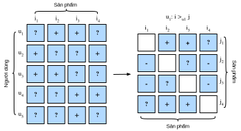

<!--
# Personalized Ranking for Recommender Systems
-->

# Cá nhân hóa Xếp hạng trong Hệ thống Đề xuất


<!--
In the former sections, only explicit feedback was considered and models were trained and tested on observed ratings.
There are two demerits of such methods: First, most feedback is not explicit but implicit in real-world scenarios, 
and explicit feedback can be more expensive to collect.
Second, non-observed user-item pairs which may be predictive for users' interests are totally ignored, 
making these methods unsuitable for cases where ratings are not missing at random but because of users' preferences.
Non-observed user-item pairs are a mixture of real negative feedback (users are not interested in the items) 
and missing values (the user might interact with the items in the future).
We simply ignore the non-observed pairs in matrix factorization and AutoRec.
Clearly, these models are incapable of distinguishing between observed and non-observed pairs 
and are usually not suitable for personalized ranking tasks.
-->

Trong những phần trước, mô hình được huấn luyện và kiểm tra trên các đánh giá đã biết và chỉ các phản hồi trực tiếp là được xét đến.
Phương pháp này có hai khuyết điểm: Thứ nhất, đa phần các phản hồi trong thực tế không dưới dạng trực tiếp mà là gián tiếp,
và phản hồi trực tiếp thường khó thu thập hơn.
Thứ hai, những cặp người dùng - sản phẩm chưa biết lại hoàn toàn bị bỏ qua, dù chúng có thể được sử dụng để dự đoán sở thích người dùng.
Điều này khiến cho các phương pháp trên không phù hợp khi mà những đánh giá không phải là thiếu do ngẫu nhiên mà đến từ thị hiếu của người dùng.
Những cặp người dùng - sản phẩm chưa biết là sự pha trộn giữa các phản ánh tiêu cực (người dùng không hứng thú với sản phẩm)
và các giá trị còn thiếu (có lẽ sau này người dùng sẽ tương tác với sản phẩm).
Ta đơn thuần bỏ qua những cặp chưa biết này trong phương pháp phân rã ma trận và AutoRec.
Rõ ràng là những mô hình này không có khả năng phân biệt giữa những cặp đã biết và cặp chưa biết
và thường không phù hợp với tác vụ cá nhân hóa xếp hạng (*personalized ranking*).


<!--
To this end, a class of recommendation models targeting at generating ranked recommendation lists from implicit feedback have gained popularity.
In general, personalized ranking models can be optimized with pointwise, pairwise or listwise approaches.
Pointwise approaches considers a single interaction at a time and train a classifier or a regressor to predict individual preferences.
Matrix factorization and AutoRec are optimized with pointwise objectives.
Pairwise approaches consider a pair of items for each user and aim to approximate the optimal ordering for that pair.
Usually, pairwise approaches are more suitable for the ranking task because predicting relative order is reminiscent to the nature of ranking.
Listwise approaches approximate the ordering of the entire list of items, for example, 
direct optimizing the ranking measures such as Normalized Discounted Cumulative Gain ([NDCG](https://en.wikipedia.org/wiki/Discounted_cumulative_gain)).
However, listwise approaches are more complex and compute-intensive than pointwise or pairwise approaches.
In this section, we will introduce two pairwise objectives/losses, Bayesian Personalized Ranking loss and Hinge loss, and their respective implementations.
-->

Từ đó, một nhóm mô hình đề xuất hướng tới việc tạo ra danh sách xếp hạng đề xuất từ phản hồi gián tiếp dần trở nên phổ biến.
Thông thường, những mô hình cá nhân hóa xếp hạng có thể được tối ưu bằng các phương thức tiếp cận theo từng điểm, theo từng cặp hoặc theo danh sách.
Cách tiếp cận từng điểm xét từng tương tác một và huấn luyện một bộ phân loại hoặc một bộ hồi quy để dự đoán sở thích cá nhân.
Phân rã ma trận và AutoRec được tối ưu với các mục tiêu theo từng điểm.
Cách tiếp cận theo từng cặp xét một cặp sản phẩm với mỗi người dùng và nhắm tới việc xấp xỉ thứ bậc tối ưu của cặp sản phẩm đó.
Thường thì cách tiếp cận theo từng cặp phù hợp với tác vụ xếp hạng hơn do việc dự đoán thứ bậc tương đối gần với bản chất của việc xếp hạng.
Cách tiếp cận theo danh sách ước chừng thứ bậc của toàn bộ danh sách các sản phẩm, ví dụ như
trực tiếp tối ưu hệ số Độ lợi Chiết khấu Tích luỹ Chuẩn (*[Normalized Discounted Cumulative Gain - NDCG](https://en.wikipedia.org/wiki/Discounted_cumulative_gain)*).
Tuy nhiên, cách tiếp cận theo danh sách phức tạp hơn và đòi hỏi tài nguyên tính toán cao hơn so với cách tiếp cận theo từng điểm và theo từng cặp.
Trong phần này, chúng tôi sẽ giới thiệu hai loại mất mát/mục tiêu của cách tiếp cận theo từng cặp, 
mất mát Cá nhân hóa Xếp hạng Bayes (*Bayesian Personalized Ranking*) và mất mát Hinge, cùng với cách lập trình từng loại mất mát tương ứng.


<!--
## Bayesian Personalized Ranking Loss and its Implementation
-->

## Mất mát Cá nhân hóa Xếp hạng Bayes và Cách lập trình


<!--
Bayesian personalized ranking (BPR) :cite:`Rendle.Freudenthaler.Gantner.ea.2009` is a pairwise personalized ranking loss that is derived from the maximum posterior estimator.
It has been widely used in many existing recommendation models.
The training data of BPR consists of both positive and negative pairs (missing values).
It assumes that the user prefers the positive item over all other non-observed items.
-->

Cá nhân hóa Xếp hạng Bayes (BPR) :cite:`Rendle.Freudenthaler.Gantner.ea.2009` là một hàm mất mát cá nhân hóa xếp hạng theo cặp, 
có xuất phát từ bộ ước lượng hậu nghiệm cực đại (*maximum posterior estimator*).
Nó được sử dụng rộng rãi trong nhiều mô hình đề xuất hiện nay.
Dữ liệu huấn luyện cho BPR bao gồm cả các cặp tích cực lẫn tiêu cực (các giá trị còn thiếu).
Nó giả sử rằng người dùng ưa thích sản phẩm tích cực hơn tất cả các sản phẩm chưa biết.


<!--
In formal, the training data is constructed by tuples in the form of $(u, i, j)$, which represents that the user $u$ prefers the item $i$ over the item $j$.
The Bayesian formulation of BPR which aims to maximize the posterior probability is given below:
-->

Trong công thức, dữ liệu huấn luyện được xây dựng bằng tuple dưới dạng $(u, i, j)$, tức biểu diễn rằng người dùng $u$ ưa thích sản phẩm $i$ hơn sản phẩm $j$.
Công thức Bayes trong BPR được cho dưới đây nhắm tới việc cực đại hóa xác suất hậu nghiệm:


$$
p(\Theta \mid >_u )  \propto  p(>_u \mid \Theta) p(\Theta)
$$


<!-- ===================== Kết thúc dịch Phần 1 ===================== -->

<!-- ===================== Bắt đầu dịch Phần 2 ===================== -->


<!--
Where $\Theta$ represents the parameters of an arbitrary recommendation model, $>_u$ represents the desired personalized total ranking of all items for user $u$.
We can formulate the maximum posterior estimator to derive the generic optimization criterion for the personalized ranking task.
-->

trong đó $\Theta$ biểu diễn các tham số của một mô hình đề xuất bất kỳ, $>_u$ biểu diễn tổng xếp hạng mong muốn cá nhân hóa của tất cả sản phẩm cho người dùng $u$.
Ta có thể xây dựng công thức của bộ ước lượng hậu nghiệm cực đại để rút ra tiêu chuẩn tối ưu khái quát của tác vụ cá nhân hóa xếp hạng.


$$
\begin{aligned}
\text{BPR-OPT} : &= \ln p(\Theta \mid >_u) \\
         & \propto \ln p(>_u \mid \Theta) p(\Theta) \\
         &= \ln \prod_{(u, i, j \in D)} \sigma(\hat{y}_{ui} - \hat{y}_{uj}) p(\Theta) \\
         &= \sum_{(u, i, j \in D)} \ln \sigma(\hat{y}_{ui} - \hat{y}_{uj}) + \ln p(\Theta) \\
         &= \sum_{(u, i, j \in D)} \ln \sigma(\hat{y}_{ui} - \hat{y}_{uj}) - \lambda_\Theta \|\Theta \|^2
\end{aligned}
$$


<!--
where $D := \{(u, i, j) \mid i \in I^+_u \wedge j \in I \backslash I^+_u \}$ is the training set, 
with $I^+_u$ denoting the items the user $u$ liked, $I$ denoting all items, and $I \backslash I^+_u$ indicating all other items excluding items the user liked.
$\hat{y}_{ui}$ and $\hat{y}_{uj}$ are the predicted scores of the user $u$ to item $i$ and $j$, respectively.
The prior $p(\Theta)$ is a normal distribution with zero mean and variance-covariance matrix $\Sigma_\Theta$.
Here, we let $\Sigma_\Theta = \lambda_\Theta I$.
-->

trong đó $D := \{(u, i, j) \mid i \in I^+_u \wedge j \in I \backslash I^+_u \}$ là tập huấn luyện, 
với $I^+_u$ ký hiệu cho sản phẩm mà người dùng $u$ thích, $I$ ký hiệu cho toàn bộ sản phẩm, và $I \backslash I^+_u$ là toàn bộ sản phẩm khác ngoại trừ các sản phẩm mà người dùng đó ưa thích.
$\hat{y}_{ui}$ và $\hat{y}_{uj}$ lần lượt là điểm số dự đoán của người dùng $u$ đối với sản phẩm $i$ và $j$.
Tiên nghiệm $p(\Theta)$ là một phân phối chuẩn với kỳ vọng bằng không và ma trận phương sai - hiệp phương sai $\Sigma_\Theta$.
Ở đây ta coi $\Sigma_\Theta = \lambda_\Theta I$.


<!--

-->


<!--
We will implement the base class `mxnet.gluon.loss.Loss` and override the `forward` method to construct the Bayesian personalized ranking loss.
We begin by importing the Loss class and the np module.
-->

Ta sẽ lập trình lớp cơ sở `mxnet.gluon.loss.Loss` và ghi đè phương thức `forward` để xây dựng hàm mất mát cá nhân hóa xếp hạng Bayes.
Ta bắt đầu bằng việc nhập lớp `Loss` và mô-đun `np`.


```{.python .input  n=5}
from mxnet import gluon, np, npx
npx.set_np()
```


<!--
The implementation of BPR loss is as follows.
-->

Lập trình cho mất mát BPR như sau.


```{.python .input  n=2}
#@save
class BPRLoss(gluon.loss.Loss):
    def __init__(self, weight=None, batch_axis=0, **kwargs):
        super(BPRLoss, self).__init__(weight=None, batch_axis=0, **kwargs)

    def forward(self, positive, negative):
        distances = positive - negative
        loss = - np.sum(np.log(npx.sigmoid(distances)), 0, keepdims=True)
        return loss
```


<!--
## Hinge Loss and its Implementation
-->

## Mất mát Hinge và Cách lập trình


<!--
The Hinge loss for ranking has different form to the [hinge loss](https://mxnet.incubator.apache.org/api/python/gluon/loss.html#mxnet.gluon.loss.HingeLoss) 
provided within the gluon library that is often used in classifiers such as SVMs.
The loss used for ranking in recommender systems has the following form.
-->

Mất mát Hinge trong tác vụ xếp hạng có sự khác biệt so với [mất mát Hinge](https://mxnet.incubator.apache.org/api/python/gluon/loss.html#mxnet.gluon.loss.HingeLoss) 
được cung cấp trong thư viện gluon thường sử dụng trong các bộ phân loại như SVM.
Mất mát được sử dụng cho tác vụ xếp hạng trong hệ thống đề xuất có dạng như sau.


$$
 \sum_{(u, i, j \in D)} \max( m - \hat{y}_{ui} + \hat{y}_{uj}, 0)
$$


<!--
where $m$ is the safety margin size.
It aims to push negative items away from positive items.
Similar to BPR, it aims to optimize for relevant distance between positive and 
negative samples instead of absolute outputs, making it well suited to recommender systems.
-->

trong đó $m$ là khoảng cách biên an toàn.
Mất mát này nhằm mục đích đẩy các sản phẩm tiêu cực ra xa khỏi các sản phẩm tích cực.
Giống như BPR, nó nhằm tối ưu hóa khoảng cách thích đáng giữa mẫu dương và
mẫu âm thay vì đầu ra tuyệt đối, khiến cho nó phù hợp với hệ thống đề xuất.


```{.python .input  n=3}
#@save
class HingeLossbRec(gluon.loss.Loss):
    def __init__(self, weight=None, batch_axis=0, **kwargs):
        super(HingeLossbRec, self).__init__(weight=None, batch_axis=0,
                                            **kwargs)

    def forward(self, positive, negative, margin=1):
        distances = positive - negative
        loss = np.sum(np.maximum(- distances + margin, 0))
        return loss
```


<!--
These two losses are interchangeable for personalized ranking in recommendation.
-->

Hai loại mất mát này có thể thay thế lẫn nhau cho tác vụ cá nhân hóa xếp hạng trong hệ thống đề xuất.


## Tóm tắt

<!--
* There are three types of ranking losses available for the personalized ranking task in recommender systems, namely, pointwise, pairwise and listwise methods.
* The two pairwise loses, Bayesian personalized ranking loss and hinge loss, can be used interchangeably.
-->

* Có ba loại mất mát xếp hạng hiện có trong tác vụ cá nhân hóa xếp hạng trong hệ thống đề xuất, bao gồm các phương pháp theo từng điểm, theo từng cặp và theo danh sách.
* Hai loại mất mát theo cặp: mất mát cá nhân hóa xếp hạng Bayes và mất mát Hinge, có thể được sử dụng thay thế lẫn nhau.


## Bài tập

<!--
* Are there any variants of BPR and hinge loss available?
* Can you find any recommendation models that use BPR or hinge loss?
-->

* Liệu có biến thể nào khác của mất mát BPR và mất mát Hinge không?
* Bạn có thể tìm mô hình đề xuất nào khác sử dụng mất mát BPR hoặc mất mát Hinge không? 


## Thảo luận
* Tiếng Anh: [MXNet](https://discuss.d2l.ai/t/402)
* Tiếng Việt: [Diễn đàn Machine Learning Cơ Bản](https://forum.machinelearningcoban.com/c/d2l)


## Những người thực hiện
Bản dịch trong trang này được thực hiện bởi:

* Đoàn Võ Duy Thanh
* Đỗ Trường Giang
* Phạm Hồng Vinh
* Phạm Minh Đức
* Nguyễn Lê Quang Nhật
* Lê Khắc Hồng Phúc

*Cập nhật lần cuối: 06/10/2020. (Cập nhật lần cuối từ nội dung gốc: 30/06/2020)*
