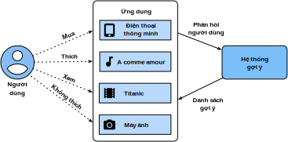

<!--
# Overview of Recommender Systems
-->

# Tổng quan về Hệ thống Đề xuất

<!--
In the last decade, the Internet has evolved into a platform for large-scale online services, 
which profoundly changed the way we communicate, read news, buy products, and watch movies.
In the meanwhile, the unprecedented number of items (we use the term *item* to refer to movies, news, books, and products.) 
offered online requires a system that can help us discover items that we preferred. 
Recommender systems are therefore powerful information filtering tools 
that can facilitate personalized services and provide tailored experience to individual users. 
In short, recommender systems play a pivotal role in utilizing the wealth of data available to make choices manageable.
Nowadays, recommender systems are at the core of a number of online services providers such as Amazon, Netflix, and YouTube. 
Recall the example of Deep learning books recommended by Amazon in :numref:`subsec_recommender_systems`. 
The benefits of employing recommender systems are two-folds: 
On the one hand, it can largely reduce users' effort in finding items and alleviate the issue of information overload. 
On the other hand, it can add business value to  online service providers and is an important source of revenue.
This chapter will introduce the fundamental concepts, classic models and recent advances 
with deep learning in the field of recommender systems, together with implemented examples.
-->

Trong thập kỷ vừa qua, mạng Internet đã phát triển thành một nền tảng cho các dịch vụ trực tuyến quy mô lớn,
đồng thời thay đổi sâu sắc cách ta giao tiếp, đọc tin tức, mua sắm và xem phim.
Trong khi đó, một lượng lớn chưa từng có các sản phẩm (chúng tôi sử dụng từ *sản phẩm (item)* cho phim ảnh, tin tức, sách và hàng hóa)
được bày bán trực tuyến yêu cầu một hệ thống có thể giúp ta tìm những sản phẩm ưa thích hơn.
Do đó, hệ thống đề xuất là công cụ lọc thông tin mạnh mẽ
có thể thúc đẩy các dịch vụ cá nhân hóa và cung cấp trải nghiệm riêng biệt cho từng người dùng.
Nói ngắn gọn, hệ thống đề xuất đóng vai trò nòng cốt trong việc tận dụng nguồn dữ liệu dồi dào hiện có để giúp việc đưa ra lựa chọn dễ dàng hơn.
Ngày nay, hệ thống đề xuất là thành phần trung tâm của nhiều nhà cung cấp dịch vụ trực tuyến như Amazon, Netflix, và YouTube.
Nhớ lại ví dụ Amazon đưa ra đề xuất các sách Học sâu trong :numref:`subsec_recommender_systems`.
Có hai lợi ích của việc sử dụng hệ thống đề xuất:
Một mặt, nó có thể giảm lượng lớn công sức tìm kiếm sản phẩm của người dùng và giảm thiểu vấn đề quá tải thông tin.
Mặt khác, nó có thể tăng giá trị kinh doanh cho các nhà cung cấp dịch vụ trực tuyến và trở thành nguồn doanh thu quan trọng.
Chương này sẽ giới thiệu những khái niệm cơ bản, các mô hình cổ điển và những bước tiến gần đây
của học sâu trong lĩnh vực hệ thống đề xuất, cùng với các ví dụ lập trình.

<!--

-->

<!--
## Collaborative Filtering
-->

## Lọc Cộng tác

<!--
We start the journey with the important concept in recommender systems---collaborative filtering (CF), 
which was first coined by the Tapestry system :cite:`Goldberg.Nichols.Oki.ea.1992`, 
referring to "people collaborate to help one another perform the filtering process 
in order to handle the large amounts of email and messages posted to newsgroups".
This term has been enriched with more senses. In a broad sense, it is the process of
filtering for information or patterns using techniques involving collaboration among multiple users, agents, and data sources. 
CF has many forms and numerous CF methods proposed since its advent.
-->

Ta bắt đầu chương này với một khái niệm quan trọng trong hệ thống đề xuất --- lọc cộng tác (*Collaborative Filtering - CF*),
được tạo ra lần đầu trong hệ thống Tapestry :cite:`Goldberg.Nichols.Oki.ea.1992`,
ám chỉ "mọi người cộng tác giúp đỡ lẫn nhau để thực hiện quá trình lọc
nhằm xử lý lượng lớn email và tin nhắn đăng trong nhóm thảo luận".
Định nghĩa này được làm phong phú thêm bởi nhiều nghĩa. Hiểu theo nghĩa rộng, đây là quá trình
lọc lấy thông tin hoặc khuôn mẫu sử dụng các kĩ thuật yêu cầu sự cộng tác của nhiều người dùng, tác nhân, và nguồn dữ liệu.
CF có nhiều dạng khác nhau, rất nhiều phương pháp CF khác đã được đề xuất kể từ khi phát minh.

<!--
Overall, CF techniques can be categorized into: memory-based CF, model-based CF, and their hybrid :cite:`Su.Khoshgoftaar.2009`.
Representative memory-based CF techniques are nearest neighbor-based CF such as user-based CF and item-based CF :cite:`Sarwar.Karypis.Konstan.ea.2001`.
Latent factor models such as matrix factorization are examples of model-based CF.
Memory-based CF has limitations in dealing with sparse and large-scale data since it computes the similarity values based on common items.
Model-based methods become more popular with its better capability in dealing with sparsity and scalability.
Many model-based CF approaches can be extended with neural networks, 
leading to more flexible and scalable models with the computation acceleration in deep learning :cite:`Zhang.Yao.Sun.ea.2019`.
In general, CF only uses the user-item interaction data to make predictions and recommendations.
Besides CF, content-based and context-based recommender systems are also useful in incorporating 
the content descriptions of items/users and contextual signals such as timestamps and locations.
Obviously, we may need to adjust the model types/structures when different input data is available.
-->

Nhìn chung, các kỹ thuật CF có thể được phân loại thành: CF dựa trên ghi nhớ (*memory-based CF*), CF dựa trên mô hình (*model-based CF*), và lai giữa hai lớp này :cite:`Su.Khoshgoftaar.2009`.
Đại diện của CF dựa trên ghi nhớ chính là CF dựa trên các điểm lân cận (*nearest neighbor-based CF*) ví dụ như CF dựa trên người dùng (*user-based CF*) hay CF dựa trên sản phẩm (*item-based CF*) :cite:`Sarwar.Karypis.Konstan.ea.2001`.
Các mô hình nhân tố tiềm ẩn (*latent factor model*) như phân rã ma trận (*matrix factorization*) là một ví dụ của CF dựa trên mô hình.
CF dựa trên ghi nhớ có nhiều hạn chế trong việc xử lý dữ liệu thưa và quy mô lớn do việc tính toán độ tương đồng dựa trên những sản phẩm thường gặp.
CF dựa trên mô hình ngày càng trở nên phổ biến do khả năng xử lý dữ liệu thưa và tính mở rộng tốt hơn.
Nhiều cách tiếp cận với CF dựa trên mô hình có thể được mở rộng với mạng nơ-ron,
dẫn đến nhiều mô hình linh hoạt và tính mở rộng cao nhờ sự phát triển của học sâu :cite:`Zhang.Yao.Sun.ea.2019`.
Nhìn chung, CF chỉ sử dụng dữ liệu tương tác giữa người dùng - sản phẩm nhằm đưa ra dự đoán và đề xuất.
Ngoài CF, hệ thống đề xuất dựa trên nội dung (*content-based*) và dựa trên ngữ cảnh (*context-based*) cũng hữu dụng trong việc kết hợp
nội dung mô tả của sản phẩm/người dùng và các dấu hiệu ngữ cảnh như mốc thời gian và địa điểm.
Đương nhiên, ta cần phải điều chỉnh cấu trúc/loại mô hình khi dữ liệu đầu vào khả dụng khác nhau.

<!--
## Explicit Feedback and Implicit Feedback
-->

## Phản hồi Trực tiếp và Phản hồi Gián tiếp

<!--
To learn the preference of users, the system shall collect feedback from them.
The feedback can be either explicit or implicit :cite:`Hu.Koren.Volinsky.2008`.
For example, [IMDB](https://www.imdb.com/) collects star ratings ranging from one to ten stars for movies.
YouTube provides the thumbs-up and thumbs-down buttons for users to show their preferences.
It is apparent that gathering explicit feedback requires users to indicate their interests proactively.
Nonetheless, explicit feedback is not always readily available as many users may be reluctant to rate products.
Relatively speaking, implicit feedback is often readily available since it is mainly concerned with modeling implicit behavior such as user clicks.
As such, many recommender systems are centered on implicit feedback which indirectly reflects user's opinion through observing user behavior.
There are diverse forms of implicit feedback including purchase history, browsing history, watches and even mouse movements.
For example, a user that purchased many books by the same author probably likes that author.
Note that implicit feedback is inherently noisy. 
We can only *guess* their preferences and true motives.
A user watched a movie does not necessarily indicate a positive view of that movie.
-->

Để học được sở thích của người dùng, hệ thống cần phải thu thập phản hồi của họ.
Phản hồi này có thể là trực tiếp (*explicit*) hoặc gián tiếp (*implicit*) :cite:`Hu.Koren.Volinsky.2008`.
Ví dụ, [IMDB](https://www.imdb.com/) thu thập đánh giá số lượng ngôi sao cho các bộ phim với các mức từ một đến mười sao.
Youtube đưa ra nút thích (*thumps-up*) và không thích (*thumps-down*) cho người dùng để bảy tỏ sở thích.
Rõ ràng là việc thu thập phản hồi trực tiếp yêu cầu người dùng phải chủ động chỉ rõ sự quan tâm.
Tuy nhiên, không phải lúc nào cũng dễ dàng thu thập phản hồi trực tiếp do nhiều người dùng thường không hay đánh giá sản phẩm.
Xét một cách tương đối, phản hồi gián tiếp thường dễ thu thập hơn do chủ yếu liên quan đến việc mô hình hóa hành vi gián tiếp như số lần nhấp chuột của người dùng.
Do đó, nhiều hệ thống đề xuất xoay quanh phản hồi gián tiếp, phản ánh ý kiến người dùng thông qua việc quan sát hành vi của họ.
Có nhiều dạng phản hồi gián tiếp bao gồm lịch sử mua hàng, lịch sử duyệt web, lượt xem và thậm chí là thao tác chuột.
Ví dụ, một người dùng mua nhiều sách của cùng tác giả thì khả năng cao là thích tác giả đó.
Chú ý rằng phản hồi gián tiếp tự thân là có nhiễu.
Ta chỉ có thể *đoán* sở thích và động cơ thực của họ.
Một người dùng xem một bộ phim không nhất thiết là phải thích bộ phim đó.

<!--
## Recommendation Tasks
-->

## Các tác vụ Đề xuất

<!--
A number of recommendation tasks have been investigated in the past decades.
Based on the domain of applications, there are movies recommendation, news recommendations, point-of-interest recommendation :cite:`Ye.Yin.Lee.ea.2011` and so forth.
It is also possible to differentiate the tasks based on the types of feedback and input data, for example, the rating prediction task aims to predict the explicit ratings.
Top-$n$ recommendation (item ranking) ranks all items for each user personally based on the implicit feedback.
If time-stamp information is also included, we can build sequence-aware recommendation :cite:`Quadrana.Cremonesi.Jannach.2018`.
Another popular task is called click-through rate prediction, which is also based on implicit feedback, but various categorical features can be utilized.
Recommending for new users and recommending new items to existing users are called cold-start recommendation :cite:`Schein.Popescul.Ungar.ea.2002`.
-->

Có nhiều tác vụ đề xuất được nghiên cứu trong thập kỷ vừa qua.
Dựa trên phạm vi ứng dụng, các tác vụ này bao gồm đề xuất phim ảnh, đề xuất tin tức, đề xuất địa điểm ưa thích (*point-of-interest*) :cite:`Ye.Yin.Lee.ea.2011`, v.v.
Ta cũng có thể phân biệt các tác vụ này dựa trên loại phản hồi và dữ liệu đầu vào, ví dụ như tác vụ trực tiếp dự đoán đánh giá.
Đề xuất $n$ sản phẩm hàng đầu (*top-$n$ recommendation*) (theo thứ tự sản phẩm) xếp loại tất cả các sản phẩm cho mỗi người dùng dựa trên phản hồi gián tiếp.
Nếu có cả thông tin mốc thời gian, ta có thể xây dựng hệ thống đề xuất có nhận thức về chuỗi (*sequence-aware*) :cite:`Quadrana.Cremonesi.Jannach.2018`.
Một tác vụ phổ biến khác là dự đoán tỷ lệ nhấp chuột, cũng dựa trên phản hồi gián tiếp, tuy nhiên rất nhiều đặc trưng rời rạc cũng có thể được tận dụng.
Đưa ra đề xuất cho người dùng mới và đề xuất sản phẩm mới cho người dùng hiện còn được gọi là đề xuất khởi động nguội (*cold-start recommendation*) :cite:`Schein.Popescul.Ungar.ea.2002`.

## Tóm tắt

<!--
* Recommender systems are important for individual users and industries. Collaborative filtering is a key concept in recommendation.
* There are two types of feedbacks: implicit feedback and explicit feedback.  A number of recommendation tasks have been explored during the last decade.
-->

* Hệ thống đề xuất rất quan trọng đối với người dùng cá nhân và nhiều ngành công nghiệp. Lọc cộng tác là một khái niệm then chốt trong hệ thống đề xuất.
* Có hai loại phản hồi: gián tiếp và trực tiếp. Có nhiều ứng dụng đề xuất đã được nghiên cứu trong thập kỷ qua.

## Bài tập

<!--
1. Can you explain how recommender systems influence your daily life?
2. What interesting recommendation tasks do you think can be investigated?
-->

1. Hệ thống đề xuất ảnh hưởng đến cuộc sống hằng ngày của bạn như thế nào?
2. Có ứng dụng đề xuất nào đáng chú ý mà bạn nghĩ đáng được nghiên cứu?

## Thảo luận
* Tiếng Anh: [Main Forum](https://discuss.d2l.ai/t/398)
* Tiếng Việt: [Diễn đàn Machine Learning Cơ Bản](https://forum.machinelearningcoban.com/c/d2l)

## Những người thực hiện
Bản dịch trong trang này được thực hiện bởi:

* Đoàn Võ Duy Thanh
* Đỗ Trường Giang
* Lê Khắc Hồng Phúc
* Nguyễn Văn Cường

*Cập nhật lần cuối: 06/10/2020. (Cập nhật lần cuối từ nội dung gốc: 12/09/2020)*
