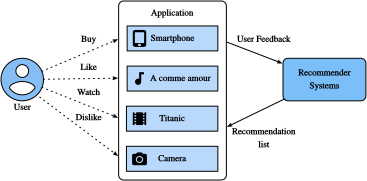

<!-- ===================== Bắt đầu dịch Phần 1 ==================== -->

<!--
# Overview of Recommender Systems
-->

# Sơ lược về Hệ thống Gợi ý

<!--
In the last decade, the Internet has evolved into a platform for large-scale online services, 
which profoundly changed the way we communicate, read news, buy products, and watch movies.
In the meanwhile, the unprecedented number of items (we use the term *item* to refer to movies, news, books, and products.) 
offered online requires a system that can help us discover items that we preferred. 
Recommender systems are therefore powerful information filtering tools 
that can facilitate personalized services and provide tailored experience to individual users. 
In short, recommender systems play a pivotal role in utilizing the wealth of data available to make choices manageable.
Nowadays, recommender systems are at the core of a number of online services providers such as Amazon, Netflix, and YouTube. 
Recall the example of Deep learning books recommended by Amazon in :numref:`subsec_recommender_systems`. 
The benefits of employing recommender systems are two-folds: 
On the one hand, it can largely reduce users' effort in finding items and alleviate the issue of information overload. 
On the other hand, it can add business value to  online service providers and is an important source of revenue.
This chapter will introduce the fundamental concepts, classic models and recent advances 
with deep learning in the field of recommender systems, together with implemented examples.
-->

Trong thập kỷ vừa qua, mạng Internet đã phát triển trở thành một nền tảng cho các dịch vụ trực tuyến quy mô lớn,
đồng thời thay đổi một cách sâu sắc cách ta giao tiếp, đọc tin tức, mua hàng và xem phim.
Trong khi đó, một lượng lớn sản phẩm chưa từng có trong tiền lệ (chúng tôi sử dụng từ *sản phẩm* nhằm nói đến phim ảnh, tin tức, sách và hàng hoá)
được bày bán trực tuyến yêu cầu một hệ thống có thể giúp ta tìm ra những sản phẩm mà ta quan tâm đến.
Do đó hệ thống gợi ý là công cụ lọc thông tin mạnh mẽ
mà có thể đơn giản hoá dịch vụ cá nhân hoá và cung cấp trải nghiệm mượt mà cho từng người dùng.
Nói ngắn gọn, hệ thống gợi ý đóng vai trò nòng cốt trong việc tận dụng nguồn dữ liệu dồi dào có sẵn nhằm khiến việc đưa ra lựa chọn dễ dàng hơn.
Ngày nay, hệ thống gợi ý là là thành phần cơ bản của nhiều nhà cung cấp dịch vụ trực tuyến như Amazon, Netflix, và YouTube.
Nhớ lại ví dụ mà Amazon đưa ra gợi ý các sách Học sâu trong :numref:`subsec_recommender_systems`.
Lợi ích của việc sử dụng hệ thống gợi ý gồm hai ý:
Một mặt, nó có thể giảm phần lớn công sức của người dùng trong tìm kiếm sản phẩm và giảm nhẹ vấn đề quá tải thông tin.
Mặt khác, nó có thể tăng giá trị kinh doanh cho các nhà cung cấp dịch vụ trực tuyến và trở thành nguồn doanh thu quan trọng.
Chương này sẽ giới thiệu những khái niệm cơ bản, các mô hình cổ điển và những bước tiền gần đây
của học sâu trong lĩnh vực hệ thống gợi ý, cùng với các ví dụ lập trình.

<!--

-->

<!--
## Collaborative Filtering
-->

## Lọc Cộng tác

<!--
We start the journey with the important concept in recommender systems---collaborative filtering (CF), 
which was first coined by the Tapestry system :cite:`Goldberg.Nichols.Oki.ea.1992`, 
referring to "people collaborate to help one another perform the filtering process 
in order to handle the large amounts of email and messages posted to newsgroups".
This term has been enriched with more senses. In a broad sense, it is the process of
filtering for information or patterns using techniques involving collaboration among multiple users, agents, and data sources. 
CF has many forms and numerous CF methods proposed since its advent.
-->

Ta mở đầu chương này với một khái niệm quan trọng trong hệ thống gợi ý --- lọc cộng tác (*Collaborative Filtering - CF*),
được tạo ra đầu tiên trong hệ thống Tapestry :cite:`Goldberg.Nichols.Oki.ea.1992`,
ám chỉ đến "mọi người cộng tác giúp đỡ lẫn nhau để thực hiện quá trình lọc
nhằm xử lý lượng lớn email và tin nhắn đăng trong nhóm thảo luận".
Định nghĩa này được làm phong phú với nhiều nghĩa. Hiểu theo nghĩa rộng, đây là quá trình
lọc lấy thông tin hoặc mô hình sử dụng các kĩ thuật yêu cầu sự cộng tác của nhiều người dùng, tác nhân, và nguồn dữ liệu.
CF có nhiều hình thức khác nhau và rất nhiều phương pháp CF khác đã được đề xuất từ khi nó được tạo ra.

<!--
Overall, CF techniques can be categorized into: memory-based CF, model-based CF, and their hybrid :cite:`Su.Khoshgoftaar.2009`.
Representative memory-based CF techniques are nearest neighbor-based CF such as user-based CF and item-based CF :cite:`Sarwar.Karypis.Konstan.ea.2001`.
Latent factor models such as matrix factorization are examples of model-based CF.
Memory-based CF has limitations in dealing with sparse and large-scale data since it computes the similarity values based on common items.
Model-based methods become more popular with its better capability in dealing with sparsity and scalability.
Many model-based CF approaches can be extended with neural networks, 
leading to more flexible and scalable models with the computation acceleration in deep learning :cite:`Zhang.Yao.Sun.ea.2019`.
In general, CF only uses the user-item interaction data to make predictions and recommendations.
Besides CF, content-based and context-based recommender systems are also useful in incorporating 
the content descriptions of items/users and contextual signals such as timestamps and locations.
Obviously, we may need to adjust the model types/structures when different input data is available.
-->

Nói chung, các kỹ thuật CF có thể được phân ra thành các lớp: CF dựa vào ghi nhớ (*memory-based CF*), CF dựa vào mô hình (*model-based CF*), và lai giữa hai lớp này :cite:`Su.Khoshgoftaar.2009`.
Đại diện của các kỹ thuật CF dựa vào ghi nhớ chính là CF dựa vào các điểm dữ liệu lân cận (*nearest neighbor-based CF*) ví dụ như CF dựa vào người dùng (*user-based CF*) hay CF dựa vào sản phẩm (*item-based CF *) :cite:`Sarwar.Karypis.Konstan.ea.2001`.
Các mô hình nhân tố ẩn (*latent factor model*) ví dụ như phân rã ma trận (*matrix factorization*) là một ví dụ của CF dựa vào mô hình.
CF dựa vào ghi nhớ có nhiều hạn chế trong việc xử lý dữ liệu thưa và quy mô lớn do nó tính toán độ tương đồng dựa trên những sản phẩm phổ biến.
Phương pháp dựa vào mô hình ngày càng trở nên phổ biến hơn do khả năng xử lý dữ liệu thưa thớt tốt hơn và tính mở rộng tốt hơn.
Nhiều cách tiếp cận với CF dựa vào mô hình có thể được mở rộng với mạng nơ-ron,
dẫn đến nhiều mô hình linh hoạt và tính mở rộng cao nhờ sự thúc đẩy tính toán trong học sâu :cite:`Zhang.Yao.Sun.ea.2019`.
Nhìn chung, CF chỉ sử dụng dữ liệu tương tác giữa người dùng - sản phẩm nhằm đưa ra dự đoán và gợi ý.
Ngoài CF, hệ thống gợi ý dựa vào nội dung (*content-based*) và dựa vào ngữ cảnh (*context-based*) cũng hữu dụng trong việc kết hợp
nội dung mô tả của sản phẩm/người dùng và các dấu hiệu ngữ cảnh ví dụ như mốc thời gian và địa điểm.
Đương nhiên, ta có lẽ sẽ cần phải điều chỉnh cấu trúc/loại mô hình với dữ liệu đầu vào khả dụng khác nhau.

<!-- ===================== Kết thúc dịch Phần 1 ===================== -->

<!-- ===================== Bắt đầu dịch Phần 2 ===================== -->

<!--
## Explicit Feedback and Implicit Feedback
-->

## *dịch tiêu đề trên*

<!--
To learn the preference of users, the system shall collect feedback from them.
The feedback can be either explicit or implicit :cite:`Hu.Koren.Volinsky.2008`.
For example, [IMDB](https://www.imdb.com/) collects star ratings ranging from one to ten stars for movies.
YouTube provides the thumbs-up and thumbs-down buttons for users to show their preferences.
It is apparent that gathering explicit feedback requires users to indicate their interests proactively.
Nonetheless, explicit feedback is not always readily available as many users may be reluctant to rate products.
Relatively speaking, implicit feedback is often readily available since it is mainly concerned with modeling implicit behavior such user clicks.
As such, many recommender systems are centered on implicit feedback which indirectly reflects user's opinion through observing user behavior.
There are diverse forms of implicit feedback including purchase history, browsing history, watches and even mouse movements.
For example, a user that purchased many books by the same author probably likes that author.
Note that implicit feedback is inherently noisy. 
We can only *guess* their preferences and true motives.
A user watched a movie does not necessarily indicate a positive view of that movie.
-->

*dịch đoạn phía trên*

<!--
## Recommendation Tasks
-->

## *dịch tiêu đề trên*

<!--
A number of recommendation tasks have been investigated in the past decades.
Based on the domain of applications, there are movies recommendation, news recommendations, point-of-interest recommendation :cite:`Ye.Yin.Lee.ea.2011` and so forth.
It is also possible to differentiate the tasks based on the types of feedback and input data, for example, the rating prediction task aims to predict the explicit ratings.
Top-$n$ recommendation (item ranking) ranks all items for each user personally based on the implicit feedback.
If time-stamp information is also included, we can build sequence-aware recommendation :cite:`Quadrana.Cremonesi.Jannach.2018`.
Another popular task is called click-through rate prediction, which is also based on implicit feedback, but various categorical features can be utilized.
Recommending for new users and recommending new items to existing users are called cold-start recommendation :cite:`Schein.Popescul.Ungar.ea.2002`.
-->

*dịch đoạn phía trên*

## Tóm tắt

<!--
* Recommender systems are important for individual users and industries. Collaborative filtering is a key concept in recommendation.
* There are two types of feedbacks: implicit feedback and explicit feedback.  A number of recommendation tasks have been explored during the last decade.
-->

*dịch đoạn phía trên*

## Bài tập

<!--
1. Can you explain how recommender systems influence your daily life?
2. What interesting recommendation tasks do you think can be investigated?
-->

*dịch đoạn phía trên*

<!-- ===================== Kết thúc dịch Phần 2 ===================== -->

## Thảo luận
* [Tiếng Anh](https://discuss.d2l.ai/t/398)
* [Tiếng Việt](https://forum.machinelearningcoban.com/c/d2l)

## Những người thực hiện
Bản dịch trong trang này được thực hiện bởi:
<!--
Tác giả của mỗi Pull Request điền tên mình và tên những người review mà bạn thấy
hữu ích vào từng phần tương ứng. Mỗi dòng một tên, bắt đầu bằng dấu `*`.

Tên đầy đủ của các reviewer có thể được tìm thấy tại https://github.com/aivivn/d2l-vn/blob/master/docs/contributors_info.md
-->

* Đoàn Võ Duy Thanh
<!-- Phần 1 -->
* Đỗ Trường Giang

<!-- Phần 2 -->
* 

*Cập nhật lần cuối: 03/09/2020. (Cập nhật lần cuối từ nội dung gốc: 30/06/2020)*
