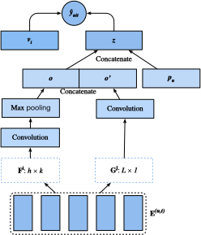

<!--
# Sequence-Aware Recommender Systems
-->

# Hệ thống Đề xuất có Nhận thức về Chuỗi


<!--
In previous sections, we abstract the recommendation task as a matrix completion problem without considering users' short-term behaviors.
In this section, we will introduce a recommendation model that takes the sequentially-ordered user interaction logs into account.
It is a sequence-aware recommender :cite:`Quadrana.Cremonesi.Jannach.2018` where the input is an ordered and often timestamped list of past user actions.
A number of recent literatures have demonstrated the usefulness of incorporating such information in modeling users' temporal behavioral patterns and discovering their interest drift.
-->

Trong phần trước, ta trừu tượng hóa tác vụ đề xuất dưới dạng một bài toán hoàn thiện ma trận mà không xét đến hành vi ngắn hạn của người dùng.
Trong phần này, chúng tôi sẽ giới thiệu một mô hình đề xuất cân nhắc đến nhật ký tương tác được sắp xếp theo trình tự thời gian của người dùng.
Đây là một hệ thống đề xuất có nhận thức về chuỗi (*sequence-aware recommender*) :cite:`Quadrana.Cremonesi.Jannach.2018` 
với đầu vào là danh sách lịch sử thao tác của người dùng đã được sắp xếp và thường đi kèm với mốc thời gian diễn ra.
Nhiều bài báo gần đây đã chứng minh được lợi ích của việc tích hợp những thông tin này vào việc 
mô hình hóa khuôn mẫu hành vi theo thời gian của người dùng và tìm ra được khuynh hướng sở thích của họ.


<!--
The model we will introduce, Caser :cite:`Tang.Wang.2018`, short for convolutional sequence embedding recommendation model, 
adopts convolutional neural networks capture the dynamic pattern influences of users' recent activities.
The main component of Caser consists of a horizontal convolutional network and a vertical convolutional network, 
aiming to uncover the union-level and point-level sequence patterns, respectively.
Point-level pattern indicates the impact of single item in the historical sequence on the target item, 
while union level pattern implies the influences of several previous actions on the subsequent target.
For example, buying both milk and butter together leads to higher probability of buying flour than just buying one of them.
Moreover, users' general interests, or long term preferences are also modeled in the last fully-connected layers, 
resulting in a more comprehensive modeling of user interests.
Details of the model are described as follows.
-->

Mô hình mà chúng tôi sẽ giới thiệu, Caser :cite:`Tang.Wang.2018`, viết tắt của mô hình đề xuất embedding chuỗi tích chập (*convolutional sequence embedding recommendation model*),
kế thừa mạng nơ-ron tích chập nhằm nắm bắt khuôn mẫu động có ảnh hưởng đến những hoạt động gần đây của người dùng.
Thành phần chính của Caser bao gồm một mạng tích chập ngang và một mạng tích chập dọc,
nhằm lần lượt khám phá khuôn mẫu cấp liên kết (*union-level*) và cấp điểm (*point-level*) của chuỗi.
Khuôn mẫu cấp điểm ám chỉ tác động của một sản phẩm riêng lẻ trong lịch sử của chuỗi lên sản phẩm mục tiêu,
trong khi khuôn mẫu cấp liên kết ám chỉ ảnh hưởng của nhiều thao tác trước đó lên các mục tiêu kế tiếp.
Ví dụ, việc mua sữa cùng với bơ dẫn tới xác suất mua thêm cả bột mì cao hơn so với việc chỉ mua một trong hai.
Hơn nữa, sở thích chung của người dùng, hay sở thích dài hạn cũng được mô hình hóa trong những tầng kết nối đầy đủ cuối cùng,
dẫn đến sở thích của người dùng được mô hình hóa một cách toàn diện hơn.
Chi tiết về mô hình này sẽ được mô tả tiếp theo.


<!--
## Model Architectures
-->

## Kiến trúc Mô hình


<!--
In sequence-aware recommendation system, each user is associated with a sequence of some items from the item set.
Let $S^u = (S_1^u, ... S_{|S_u|}^u)$ denotes the ordered sequence.
The goal of Caser is to recommend item by considering user general tastes as well as short-term intention.
Suppose we take the previous $L$ items into consideration, an embedding matrix that represents the former interactions for time step $t$ can be constructed:
-->

Trong hệ thống đề xuất có nhận thức về chuỗi, mỗi người dùng tương tác với một chuỗi các sản phẩm từ tập sản phẩm.
$S^u = (S_1^u, ... S_{|S_u|}^u)$ ký hiệu chuỗi có trình tự.
Mục tiêu của Caser là đề xuất sản phẩm bằng cách xét thị hiếu chung của người dùng cũng như dự định ngắn hạn.
Giả sử ta xét $L$ sản phẩm trước, ma trận embedding biểu diễn những tương tác xảy ra trước bước thời gian $t$ có thể được xây dựng như sau:


$$
\mathbf{E}^{(u, t)} = [ \mathbf{q}_{S_{t-L}^u} , ..., \mathbf{q}_{S_{t-2}^u}, \mathbf{q}_{S_{t-1}^u} ]^\top,
$$


<!--
where $\mathbf{Q} \in \mathbb{R}^{n \times k}$ represents item embeddings and $\mathbf{q}_i$ denotes the $i^\mathrm{th}$ row.
$\mathbf{E}^{(u, t)} \in \mathbb{R}^{L \times k}$ can be used to infer the transient interest of user $u$ at time-step $t$.
We can view the input matrix $\mathbf{E}^{(u, t)}$ as an image which is the input of the subsequent two convolutional components.
-->

trong đó $\mathbf{Q} \in \mathbb{R}^{n \times k}$ biểu diễn embedding sản phẩm và $\mathbf{q}_i$ ký hiệu hàng thứ $i$.
$\mathbf{E}^{(u, t)} \in \mathbb{R}^{L \times k}$ có thể được sử dụng để suy ra sở thích nhất thời của người dùng $u$ tại bước thời gian $t$.
Ta có thể coi ma trận đầu vào $\mathbf{E}^{(u, t)}$ như một ảnh đầu vào của hai tầng tích chập kế tiếp.


<!--
The horizontal convolutional layer has $d$ horizontal filters $\mathbf{F}^j \in \mathbb{R}^{h \times k}, 1 \leq j \leq d, h = \{1, ..., L\}$, 
and the vertical convolutional layer has $d'$ vertical filters $\mathbf{G}^j \in \mathbb{R}^{ L \times 1}, 1 \leq j \leq d'$.
After a series of convolutional and pool operations, we get the two outputs:
-->

Tầng tích chập ngang có $d$ bộ lọc ngang $\mathbf{F}^j \in \mathbb{R}^{h \times k}, 1 \leq j \leq d, h = \{1, ..., L\}$,
và tầng tích chập dọc có $d'$ bộ lọc dọc $\mathbf{G}^j \in \mathbb{R}^{ L \times 1}, 1 \leq j \leq d'$.
Sau một chuỗi những thao tác tích chập và gộp, ta thu được hai đầu ra:


$$
\mathbf{o} = \text{HConv}(\mathbf{E}^{(u, t)}, \mathbf{F}) \\
\mathbf{o}'= \text{VConv}(\mathbf{E}^{(u, t)}, \mathbf{G}) ,
$$


<!--
where $\mathbf{o} \in \mathbb{R}^d$ is the output of horizontal convolutional network 
and $\mathbf{o}' \in \mathbb{R}^{kd'}$ is the output of vertical convolutional network.
For simplicity, we omit the details of convolution and pool operations.
They are concatenated and fed into a fully-connected neural network layer to get more high-level representations.
-->

trong đó $\mathbf{o} \in \mathbb{R}^d$ là đầu ra của mạng tích chập ngang
và $\mathbf{o}' \in \mathbb{R}^{kd'}$ là đầu ra của mạng tích chập dọc.
Để đơn giản, ta bỏ qua chi tiết của các thao tác tích chập và thao tác gộp.
Chúng được nối với nhau và đưa vào một tầng nơ-ron kết nối đầy đủ để thu được dạng biểu diễn cấp cao hơn.


$$
\mathbf{z} = \phi(\mathbf{W}[\mathbf{o}, \mathbf{o}']^\top + \mathbf{b}),
$$


<!--
where $\mathbf{W} \in \mathbb{R}^{k \times (d + kd')}$ is the weight matrix and $\mathbf{b} \in \mathbb{R}^k$ is the bias.
The learned vector $\mathbf{z} \in \mathbb{R}^k$ is the representation of user's short-term intent.
-->

trong đó $\mathbf{W} \in \mathbb{R}^{k \times (d + kd')}$ là ma trận trọng số và $\mathbf{b} \in \mathbb{R}^k$ là hệ số điều chỉnh.
Vector học được $\mathbf{z} \in \mathbb{R}^k$ chính là dạng biểu diễn cho sở thích ngắn hạn của người dùng.


<!--
At last, the prediction function combines users' short-term and general taste together, which is defined as:
-->

Cuối cùng, hàm dự đoán kết hợp thị hiếu ngắn hạn và thị hiếu chung của người dùng với nhau, hàm này được định nghĩa:


$$
\hat{y}_{uit} = \mathbf{v}_i \cdot [\mathbf{z}, \mathbf{p}_u]^\top + \mathbf{b}'_i,
$$


<!--
where $\mathbf{V} \in \mathbb{R}^{n \times 2k}$ is another item embedding matrix.
$\mathbf{b}' \in \mathbb{R}^n$ is the item specific bias.
$\mathbf{P} \in \mathbb{R}^{m \times k}$ is the user embedding matrix for users' general tastes.
$\mathbf{p}_u \in \mathbb{R}^{ k}$ is the $u^\mathrm{th}$ row of $P$ and $\mathbf{v}_i \in \mathbb{R}^{2k}$ is the $i^\mathrm{th}$ row of $\mathbf{V}$.
-->

trong đó $\mathbf{V} \in \mathbb{R}^{n \times 2k}$ là một ma trận embedding sản phẩm khác.
$\mathbf{b}' \in \mathbb{R}^n$ là độ chệch đặc thù của sản phẩm.
$\mathbf{P} \in \mathbb{R}^{m \times k}$ là ma trận embedding thị hiếu chung của người dùng. 
$\mathbf{p}_u \in \mathbb{R}^{ k}$ là hàng thứ $u$ của $P$ và $\mathbf{v}_i \in \mathbb{R}^{2k}$ là hàng thứ $i$ của $\mathbf{V}$.


<!--
The model can be learned with BPR or Hinge loss. The architecture of Caser is shown below:
-->

Mô hình này có thể được học với mất mát BPR hoặc mất mát Hinge. Kiến trúc của Caser được mô tả như dưới đây.

<!--

-->


<!--
We first import the required libraries.
-->

Đầu tiên ta nhập vào những thư viện cần thiết.


```{.python .input  n=3}
from d2l import mxnet as d2l
from mxnet import gluon, np, npx
from mxnet.gluon import nn
import mxnet as mx
import random
import sys
npx.set_np()
```


<!--
## Model Implementation
-->

## Lập trình Mô hình


<!--
The following code implements the Caser model.
It consists of a vertical convolutional layer, a horizontal convolutional layer, and a full-connected layer.
-->

Đoạn mã dưới đây lập trình cho mô hình Caser.
Nó bao gồm một tầng tích chập ngang, một tầng tích chập dọc, và một tầng kết nối đầy đủ.


```{.python .input  n=4}
class Caser(nn.Block):
    def __init__(self, num_factors, num_users, num_items, L=5, d=16,
                 d_prime=4, drop_ratio=0.05, **kwargs):
        super(Caser, self).__init__(**kwargs)
        self.P = nn.Embedding(num_users, num_factors)
        self.Q = nn.Embedding(num_items, num_factors)
        self.d_prime, self.d = d_prime, d
        # Vertical convolution layer
        self.conv_v = nn.Conv2D(d_prime, (L, 1), in_channels=1)
        # Horizontal convolution layer
        h = [i + 1 for i in range(L)]
        self.conv_h, self.max_pool = nn.Sequential(), nn.Sequential()
        for i in h:
            self.conv_h.add(nn.Conv2D(d, (i, num_factors), in_channels=1))
            self.max_pool.add(nn.MaxPool1D(L - i + 1))
        # Fully-connected layer
        self.fc1_dim_v, self.fc1_dim_h = d_prime * num_factors, d * len(h)
        self.fc = nn.Dense(in_units=d_prime * num_factors + d * L,
                           activation='relu', units=num_factors)
        self.Q_prime = nn.Embedding(num_items, num_factors * 2)
        self.b = nn.Embedding(num_items, 1)
        self.dropout = nn.Dropout(drop_ratio)

    def forward(self, user_id, seq, item_id):
        item_embs = np.expand_dims(self.Q(seq), 1)
        user_emb = self.P(user_id)
        out, out_h, out_v, out_hs = None, None, None, []
        if self.d_prime:
            out_v = self.conv_v(item_embs)
            out_v = out_v.reshape(out_v.shape[0], self.fc1_dim_v)
        if self.d:
            for conv, maxp in zip(self.conv_h, self.max_pool):
                conv_out = np.squeeze(npx.relu(conv(item_embs)), axis=3)
                t = maxp(conv_out)
                pool_out = np.squeeze(t, axis=2)
                out_hs.append(pool_out)
            out_h = np.concatenate(out_hs, axis=1)
        out = np.concatenate([out_v, out_h], axis=1)
        z = self.fc(self.dropout(out))
        x = np.concatenate([z, user_emb], axis=1)
        q_prime_i = np.squeeze(self.Q_prime(item_id))
        b = np.squeeze(self.b(item_id))
        res = (x * q_prime_i).sum(1) + b
        return res
```


<!--
## Sequential Dataset with Negative Sampling
-->

## Tập dữ liệu Tuần tự với phép Lấy mẫu Âm


<!--
To process the sequential interaction data, we need to reimplement the Dataset class.
The following code creates a new dataset class named `SeqDataset`.
In each sample, it outputs the user identity, his previous $L$ interacted items as a sequence and the next item he interacts as the target.
The following figure demonstrates the data loading process for one user.
Suppose that this user liked 9 movies, we organize these nine movies in chronological order.
The latest movie is left out as the test item.
For the remaining eight movies, we can get three training samples, with each sample containing a sequence of five ($L=5$) movies and its subsequent item as the target item.
Negative samples are also included in the Customized dataset.
-->

Để xử lý dữ liệu tương tác tuần tự, ta cần lập trình lại lớp Dataset.
Đoạn mã sau đây tạo một lớp dataset mới có tên là `SeqDataset`.
Với mỗi mẫu, lớp này trả về id của người dùng, một chuỗi $L$ sản phẩm mà người này đã tương tác trước đó và sản phẩm tiếp theo mà người này sẽ tương tác làm mục tiêu.
Hình dưới đây mô tả quá trình nạp dữ liệu với một người dùng.
Giả sử người dùng này thích 9 bộ phim, ta sắp xếp 9 bộ phim này theo thứ tự thời gian.
Bộ phim cuối cùng được bỏ ra ngoài để làm sản phẩm kiểm tra.
Với 8 bộ phim còn lại, ta có thể tạo ba mẫu huấn luyện, với mỗi mẫu bao gồm một chuỗi gồm năm ($L=5$) bộ phim và bộ phim kế tiếp làm mục tiêu.
Các mẫu âm cũng có thể được đưa vào trong tập dữ liệu tuỳ chỉnh.

<!--

-->


```{.python .input  n=5}
class SeqDataset(gluon.data.Dataset):
    def __init__(self, user_ids, item_ids, L, num_users, num_items,
                 candidates):
        user_ids, item_ids = np.array(user_ids), np.array(item_ids)
        sort_idx = np.array(sorted(range(len(user_ids)),
                                   key=lambda k: user_ids[k]))
        u_ids, i_ids = user_ids[sort_idx], item_ids[sort_idx]
        temp, u_ids, self.cand = {}, u_ids.asnumpy(), candidates
        self.all_items = set([i for i in range(num_items)])
        [temp.setdefault(u_ids[i], []).append(i) for i, _ in enumerate(u_ids)]
        temp = sorted(temp.items(), key=lambda x: x[0])
        u_ids = np.array([i[0] for i in temp])
        idx = np.array([i[1][0] for i in temp])
        self.ns = ns = int(sum([c - L if c >= L + 1 else 1 for c
                                in np.array([len(i[1]) for i in temp])]))
        self.seq_items = np.zeros((ns, L))
        self.seq_users = np.zeros(ns, dtype='int32')
        self.seq_tgt = np.zeros((ns, 1))
        self.test_seq = np.zeros((num_users, L))
        test_users, _uid = np.empty(num_users), None
        for i, (uid, i_seq) in enumerate(self._seq(u_ids, i_ids, idx, L + 1)):
            if uid != _uid:
                self.test_seq[uid][:] = i_seq[-L:]
                test_users[uid], _uid = uid, uid
            self.seq_tgt[i][:] = i_seq[-1:]
            self.seq_items[i][:], self.seq_users[i] = i_seq[:L], uid

    def _win(self, tensor, window_size, step_size=1):
        if len(tensor) - window_size >= 0:
            for i in range(len(tensor), 0, - step_size):
                if i - window_size >= 0:
                    yield tensor[i - window_size:i]
                else:
                    break
        else:
            yield tensor

    def _seq(self, u_ids, i_ids, idx, max_len):
        for i in range(len(idx)):
            stop_idx = None if i >= len(idx) - 1 else int(idx[i + 1])
            for s in self._win(i_ids[int(idx[i]):stop_idx], max_len):
                yield (int(u_ids[i]), s)

    def __len__(self):
        return self.ns

    def __getitem__(self, idx):
        neg = list(self.all_items - set(self.cand[int(self.seq_users[idx])]))
        i = random.randint(0, len(neg) - 1)
        return (self.seq_users[idx], self.seq_items[idx], self.seq_tgt[idx],
                neg[i])
```


<!--
## Load the MovieLens 100K dataset
-->

## Nạp Tập dữ liệu MovieLens 100K


<!--
Afterwards, we read and split the MovieLens 100K dataset in sequence-aware mode and load the training data with sequential dataloader implemented above.
-->

Kế tiếp, ta đọc và chia nhỏ tập dữ liệu MovieLens 100K ở chế độ nhận thức về chuỗi và nạp tập huấn luyện với bộ nạp dữ liệu tuần tự đã lập trình phía trên.


```{.python .input  n=6}
TARGET_NUM, L, batch_size = 1, 5, 4096
df, num_users, num_items = d2l.read_data_ml100k()
train_data, test_data = d2l.split_data_ml100k(df, num_users, num_items,
                                              'seq-aware')
users_train, items_train, ratings_train, candidates = d2l.load_data_ml100k(
    train_data, num_users, num_items, feedback="implicit")
users_test, items_test, ratings_test, test_iter = d2l.load_data_ml100k(
    test_data, num_users, num_items, feedback="implicit")
train_seq_data = SeqDataset(users_train, items_train, L, num_users,
                            num_items, candidates)
train_iter = gluon.data.DataLoader(train_seq_data, batch_size, True,
                                   last_batch="rollover",
                                   num_workers=d2l.get_dataloader_workers())
test_seq_iter = train_seq_data.test_seq
train_seq_data[0]
```


<!--
The training data structure is shown above. 
The first element is the user identity, the next list indicates the last five items this user liked, 
and the last element is the item this user liked after the five items.
-->

Cấu trúc dữ liệu huấn luyện được chỉ ra như trên.
Phần tử đầu tiên là id người dùng, kế tiếp là danh sách ba sản phẩm đầu tiên mà người dùng này thích ($L=3$),
và phần tử cuối cùng là sản phẩm người dùng này thích sau ba sản phẩm trước.

<!--
## Train the Model
-->

## Huấn luyện Mô hình


<!--
Now, let us train the model. We use the same setting as NeuMF, including learning rate, optimizer, 
and $k$, in the last section so that the results are comparable.
-->

Giờ hãy cùng huấn luyện mô hình. Ta sử dụng thiết lập giống với NeuMF trong phần trước, bao gồm tốc độ học, bộ tối ưu,
và $k$, để có thể so sánh kết quả.


```{.python .input  n=7}
devices = d2l.try_all_gpus()
net = Caser(10, num_users, num_items, L)
net.initialize(ctx=devices, force_reinit=True, init=mx.init.Normal(0.01))
lr, num_epochs, wd, optimizer = 0.04, 8, 1e-5, 'adam'
loss = d2l.BPRLoss()
trainer = gluon.Trainer(net.collect_params(), optimizer,
                        {"learning_rate": lr, 'wd': wd})

d2l.train_ranking(net, train_iter, test_iter, loss, trainer, test_seq_iter,
                  num_users, num_items, num_epochs, devices,
                  d2l.evaluate_ranking, candidates, eval_step=1)
```


## Tóm tắt

<!--
* Inferring a user's short-term and long-term interests can make prediction of the next item that he preferred more effectively.
* Convolutional neural networks can be utilized to capture users' short-term interests from sequential interactions.
-->

* Suy luận về sở thích ngắn hạn và dài hạn của một người dùng có thể giúp việc dự đoán sản phẩm tiếp theo người này thích trở nên hiệu quả hơn.
* Mạng nơ-ron tích chập có thể được tận dụng để nắm bắt được sở thích ngắn hạn của người dùng từ chuỗi các tương tác.


## Bài tập

<!--
* Conduct an ablation study by removing one of the horizontal and vertical convolutional networks, which component is the more important ?
* Vary the hyperparameter $L$. Does longer historical interactions bring higher accuracy?
* Apart from the sequence-aware recommendation task we introduced above, 
there is another type of sequence-aware recommendation task called session-based recommendation :cite:`Hidasi.Karatzoglou.Baltrunas.ea.2015`. 
Can you explain the differences between these two tasks?
-->

* Thực hiện một nghiên cứu loại bỏ (*ablation study*) bằng cách bỏ một trong hai mạng tích chập ngang hoặc dọc, thành phần nào quan trọng hơn?
* Thay đổi siêu tham số $L$. Liệu lịch sử tương tác dài hơn có giúp tăng độ chính xác?
* Ngoài tác vụ đề xuất nhận thức về chuỗi như chúng tôi giới thiệu ở trên,
có một loại tác vụ đề xuất nhận thức về chuỗi khác được gọi là đề xuất dựa theo phiên (*session-based recommendation*) :cite:`Hidasi.Karatzoglou.Baltrunas.ea.2015`.
Bạn có thể giải thích sự khác nhau giữa hai tác vụ này không?


## Thảo luận
* Tiếng Anh: [MXNet](https://discuss.d2l.ai/t/404)
* Tiếng Việt: [Diễn đàn Machine Learning Cơ Bản](https://forum.machinelearningcoban.com/c/d2l)


## Những người thực hiện
Bản dịch trong trang này được thực hiện bởi:

* Đoàn Võ Duy Thanh
* Đỗ Trường Giang
* Nguyễn Văn Cường
* Phạm Hồng Vinh
* Phạm Minh Đức
* Nguyễn Lê Quang Nhật

*Cập nhật lần cuối: 06/10/2020. (Cập nhật lần cuối từ nội dung gốc: 01/10/2020)*
