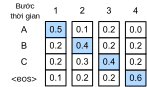
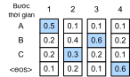
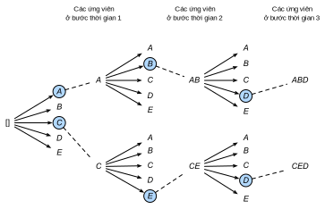

<!-- ===================== Bắt đầu dịch Phần 1 ==================== -->
<!-- ========================================= REVISE PHẦN 1 - BẮT ĐẦU =================================== -->

<!--
# Beam Search
-->

# *dịch tiêu đề phía trên*

<!--
In :numref:`sec_seq2seq`, we discussed how to train an encoder-decoder with input and output sequences that are both of variable length.
In this section, we are going to introduce how to use the encoder-decoder to predict sequences of variable length.
-->

*dịch đoạn phía trên*

<!--
As in :numref:`sec_machine_translation`, when preparing to train the dataset, we normally attach a special symbol "&lt;eos&gt;" after each sentence to indicate the termination of the sequence.
We will continue to use this mathematical symbol in the discussion below. For ease of discussion, we assume that the output of the decoder is a sequence of text.
Let the size of output text dictionary $\mathcal{Y}$ (contains special symbol "&lt;eos&gt;") be $\left|\mathcal{Y}\right|$, and the maximum length of the output sequence be $T'$.
There are a total $\mathcal{O}(\left|\mathcal{Y}\right|^{T'})$ types of possible output sequences.
All the subsequences after the special symbol "&lt;eos&gt;" in these output sequences will be discarded.
Besides, we still denote the context vector as $\mathbf{c}$, which encodes information of all the hidden states from the input.
-->

*dịch đoạn phía trên*

<!--
## Greedy Search
-->

## *dịch tiêu đề phía trên*

<!--
First, we will take a look at a simple solution: greedy search.
For any timestep $t'$ of the output sequence, we are going to search for the word with the highest conditional probability from $|\mathcal{Y}|$ numbers of words, with
-->

*dịch đoạn phía trên*

$$y_{t'} = \operatorname*{argmax}_{y \in \mathcal{Y}} P(y \mid y_1, \ldots, y_{t'-1}, \mathbf{c})$$

<!--
as the output.  Once the "&lt;eos&gt;" symbol is detected, or the output sequence has reached its maximum length $T'$, the output is completed.
-->

*dịch đoạn phía trên*

<!--
As we mentioned in our discussion of the decoder, the conditional probability of generating an output sequence based on the input sequence is 
$\prod_{t'=1}^{T'} P(y_{t'} \mid y_1, \ldots, y_{t'-1}, \mathbf{c})$.
We will take the output sequence with the highest conditional probability as the optimal sequence.
The main problem with greedy search is that there is no guarantee that the optimal sequence will be obtained.
-->

*dịch đoạn phía trên*

<!--
Take a look at the example below.
We assume that there are four words "A", "B", "C", and "&lt;eos&gt;" in the output dictionary.
The four numbers under each timestep in :numref:`fig_s2s-prob1` represent the conditional probabilities of generating "A", "B", "C", and "&lt;eos&gt;" at that timestep, respectively.
At each timestep, greedy search selects the word with the highest conditional probability.
Therefore, the output sequence "A", "B", "C", and "&lt;eos&gt;" will be generated in :numref:`fig_s2s-prob1`.
The conditional probability of this output sequence is $0.5\times0.4\times0.4\times0.6 = 0.048$.
-->

*dịch đoạn phía trên*

<!-- ===================== Kết thúc dịch Phần 1 ===================== -->

<!-- ===================== Bắt đầu dịch Phần 2 ===================== -->

<!--

-->

:label:`fig_s2s-prob1`

<!--
Now, we will look at another example shown in :numref:`fig_s2s-prob2`.
Unlike in :numref:`fig_s2s-prob1`, the following figure :numref:`fig_s2s-prob2` selects the word "C", which has the second highest conditional probability at timestep 2.
Since the output subsequences of timesteps 1 and 2, on which timestep 3 is based, are changed from "A" and "B" in :numref:`fig_s2s-prob1` to "A" and "C" in :numref:`fig_s2s-prob2`, 
the conditional probability of each word generated at timestep 3 has also changed in :numref:`fig_s2s-prob2`.
We choose the word "B", which has the highest conditional probability.
Now, the output subsequences of timestep 4 based on the first three timesteps are "A", "C", and "B", which are different from "A", "B", and "C" in :numref:`fig_s2s-prob1`.
Therefore, the conditional probability of generating each word in timestep 4 in :numref:`fig_s2s-prob2` is also different from that in :numref:`fig_s2s-prob1`.
We find that the conditional probability of the output sequence "A", "C", "B", and "&lt;eos&gt;" at the current timestep is $0.5\times0.3 \times0.6\times0.6=0.054$, 
which is higher than the conditional probability of the output sequence obtained by greedy search.
Therefore, the output sequence "A", "B", "C", and "&lt;eos&gt;" obtained by the greedy search is not an optimal sequence.
-->

*dịch đoạn phía trên*

<!--

-->

:label:`fig_s2s-prob2`

<!--
## Exhaustive Search
-->

## *dịch tiêu đề phía trên*

<!--
If the goal is to obtain the optimal sequence, we may consider using exhaustive search: 
an exhaustive examination of all possible output sequences, which outputs the sequence with the highest conditional probability.
-->

*dịch đoạn phía trên*

<!--
Although we can use an exhaustive search to obtain the optimal sequence, its computational overhead $\mathcal{O}(\left|\mathcal{Y}\right|^{T'})$ is likely to be excessively high.
For example, when $|\mathcal{Y}|=10000$ and $T'=10$, we will need to evaluate $10000^{10} = 10^{40}$ sequences.
This is next to impossible to complete.
The computational overhead of greedy search is $\mathcal{O}(\left|\mathcal{Y}\right|T')$, which is usually significantly less than the computational overhead of an exhaustive search.
For example, when $|\mathcal{Y}|=10000$ and $T'=10$, we only need to evaluate $10000\times10=1\times10^5$ sequences.
-->

*dịch đoạn phía trên*

<!-- ===================== Kết thúc dịch Phần 2 ===================== -->

<!-- ===================== Bắt đầu dịch Phần 3 ===================== -->

<!-- ========================================= REVISE PHẦN 1 - KẾT THÚC ===================================-->

<!-- ========================================= REVISE PHẦN 2 - BẮT ĐẦU ===================================-->

<!--
## Beam Search
-->

## *dịch tiêu đề phía trên*

<!--
*Beam search* is an improved algorithm based on greedy search.
It has a hyper-parameter named *beam size*, $k$.
At timestep 1, we select $k$ words with the highest conditional probability to be the first word of the $k$ candidate output sequences.
For each subsequent timestep, we are going to select the $k$ output sequences with the highest conditional probability from 
the total of $k\left|\mathcal{Y}\right|$ possible output sequences based on the $k$ candidate output sequences from the previous timestep.
These will be the candidate output sequences for that timestep.
Finally, we will filter out the sequences containing the special symbol "&lt;eos&gt;" from the candidate output sequences of each timestep 
and discard all the subsequences after it to obtain a set of final candidate output sequences.
-->

*dịch đoạn phía trên*

<!--

-->

:label:`fig_beam-search`

<!--
:numref:`fig_beam-search` demonstrates the process of beam search with an example.
Suppose that the vocabulary of the output sequence contains only five elements: $\mathcal{Y} = \{A, B, C, D, E\}$ where one of them is a special symbol “&lt;eos&gt;”.
Set beam size to 2, the maximum length of the output sequence to 3.
At timestep 1 of the output sequence, suppose the words with the highest conditional probability $P(y_1 \mid \mathbf{c})$ are $A$ and $C$.
At timestep 2, for all $y_2 \in \mathcal{Y},$ we compute
-->

*dịch đoạn phía trên*

$$P(A, y_2 \mid \mathbf{c}) = P(A \mid \mathbf{c})P(y_2 \mid A, \mathbf{c})$$

<!--
and
-->

và

$$P(C, y_2 \mid \mathbf{c}) = P(C \mid \mathbf{c})P(y_2 \mid C, \mathbf{c}),$$

<!--
and pick the largest two among these 10 values, say
-->

*dịch đoạn phía trên*

$$P(A, B \mid \mathbf{c}) \text{  and  } P(C, E \mid \mathbf{c}).$$

<!--
Then at timestep 3, for all $y_3 \in \mathcal{Y}$, we compute
-->

*dịch đoạn phía trên*

$$P(A, B, y_3 \mid \mathbf{c}) = P(A, B \mid \mathbf{c})P(y_3 \mid A, B, \mathbf{c})$$

<!--
and
-->

*dịch đoạn phía trên*

$$P(C, E, y_3 \mid \mathbf{c}) = P(C, E \mid \mathbf{c})P(y_3 \mid C, E, \mathbf{c}),$$

<!--
and pick the largest two among these 10 values, say
-->

*dịch đoạn phía trên*

$$P(A, B, D \mid \mathbf{c}) \text{  and  } P(C, E, D \mid  \mathbf{c}).$$

<!--
As a result, we obtain 6 candidates output sequences: (1) $A$; (2) $C$; (3) $A$, $B$; (4) $C$, $E$; (5) $A$, $B$, $D$; and (6) $C$, $E$, $D$.
In the end, we will get the set of final candidate output sequences based on these 6 sequences.
-->

*dịch đoạn phía trên*

<!--
In the set of final candidate output sequences, we will take the sequence with the highest score as the output sequence from those below:
-->

*dịch đoạn phía trên*

$$ \frac{1}{L^\alpha} \log P(y_1, \ldots, y_{L}) = \frac{1}{L^\alpha} \sum_{t'=1}^L \log P(y_{t'} \mid y_1, \ldots, y_{t'-1}, \mathbf{c}),$$

<!-- ===================== Kết thúc dịch Phần 3 ===================== -->

<!-- ===================== Bắt đầu dịch Phần 4 ===================== -->

<!--
Here, $L$ is the length of the final candidate sequence and the selection for $\alpha$ is generally 0.75.
The $L^\alpha$ on the denominator is a penalty on the logarithmic addition scores for the longer sequences above.
The computational overhead $\mathcal{O}(k\left|\mathcal{Y}\right|T')$ of the beam search can be obtained through analysis.
The result is between the computational overhead of greedy search and exhaustive search.
In addition, greedy search can be treated as a beam search with a beam size of 1.
Beam search strikes a balance between computational overhead and search quality using a flexible beam size of $k$.
-->

Ở đây, $L$ là độ dài của chuỗi ứng viên cuối cùng và $\alpha$ thường được đặt bằng 0.75.
$L^\alpha$ trong mẫu số là hình phạt lên điểm cộng logarit cho các chuỗi dài hơn ở trên.
Chi phí tính toán $\mathcal{O}(k\left|\mathcal{Y}\right|T')$ của tìm kiếm chùm có thể được ước lượng thông qua phân tích.
Nó nằm trong khoảng giữa chi phí tính toán của tìm kiếm tham lam và tìm kiếm vét cạn.
Ngoài ra, tìm kiếm tham lam có thể được coi là tìm kiếm chùm với kích thước chùm bằng 1.
Tìm kiếm chùm tạo ra sự cân bằng giữa chi phí tính toán và chất lượng tìm kiếm bằng cách sử dụng kích thước chùm $k$ linh hoạt.

<!--
## Summary
-->

## Tóm tắt

<!--
* Methods for predicting variable-length sequences include greedy search, exhaustive search, and beam search.
* Beam search strikes a balance between computational overhead and search quality using a flexible beam size.
-->

* Các phương pháp dự đoán chuỗi có độ dài thay đổi bao gồm tìm kiếm tham lam, tìm kiếm vét cạn và tìm kiếm chùm.
* Tìm kiếm chùm tạo ra sự cân bằng giữa chi phí tính toán và chất lượng tìm kiếm bằng cách sử dụng kích thước chùm linh hoạt.

<!--
## Exercises
-->

## Bài tập

<!--
1. Can we treat an exhaustive search as a beam search with a special beam size? Why?
2. We used language models to generate sentences in :numref:`sec_rnn_scratch`. Which kind of search does this output use? Can you improve it?
-->

1. Ta có thể coi tìm kiếm vét cạn là tìm kiếm chùm với kích thước chùm đặc biệt không? Tại sao?
2. Ta đã sử dụng các mô hình ngôn ngữ để tạo các câu trong :numref:`sec_rnn_scratch`. Các mô hình này đã sử dụng phương pháp tìm kiếm đầu ra nào? Hãy cải thiện các phương pháp đó.

<!-- ===================== Kết thúc dịch Phần 4 ===================== -->
<!-- ========================================= REVISE PHẦN 2 - KẾT THÚC ===================================-->

## Thảo luận
* [Tiếng Anh](https://discuss.mxnet.io/t/2394)
* [Tiếng Việt](https://forum.machinelearningcoban.com/c/d2l)

## Những người thực hiện
Bản dịch trong trang này được thực hiện bởi:
<!--
Tác giả của mỗi Pull Request điền tên mình và tên những người review mà bạn thấy
hữu ích vào từng phần tương ứng. Mỗi dòng một tên, bắt đầu bằng dấu `*`.

Lưu ý:
* Nếu reviewer không cung cấp tên, bạn có thể dùng tên tài khoản GitHub của họ
với dấu `@` ở đầu. Ví dụ: @aivivn.

* Tên đầy đủ của các reviewer có thể được tìm thấy tại https://github.com/aivivn/d2l-vn/blob/master/docs/contributors_info.md
-->

* Đoàn Võ Duy Thanh
<!-- Phần 1 -->
*

<!-- Phần 2 -->
*

<!-- Phần 3 -->
*

<!-- Phần 4 -->
* Nguyễn Duy Du
