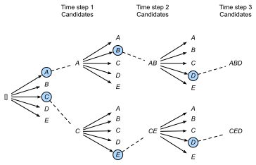

<!-- ===================== Bắt đầu dịch Phần 1 ==================== -->
<!-- ========================================= REVISE PHẦN 1 - BẮT ĐẦU =================================== -->

<!--
# Beam Search
-->

# Tìm kiếm Chùm

<!--
In :numref:`sec_seq2seq`, we discussed how to train an encoder-decoder with input and output sequences that are both of variable length.
In this section, we are going to introduce how to use the encoder-decoder to predict sequences of variable length.
-->

Trong :numref:`sec_seq2seq`, chúng ta đã thảo luận cách huấn luyện mô hình mã hóa - giải mã với đầu vào và đầu ra có độ dài thay đổi.
Phần này giới thiệu cách sử dụng mô hình để dự đoán đầu ra là chuỗi có độ dài thay đổi.

<!--
As in :numref:`sec_machine_translation`, when preparing to train the dataset, we normally attach a special symbol "&lt;eos&gt;" after each sentence to indicate the termination of the sequence.
We will continue to use this mathematical symbol in the discussion below. For ease of discussion, we assume that the output of the decoder is a sequence of text.
Let the size of output text dictionary $\mathcal{Y}$ (contains special symbol "&lt;eos&gt;") be $\left|\mathcal{Y}\right|$, and the maximum length of the output sequence be $T'$.
There are a total $\mathcal{O}(\left|\mathcal{Y}\right|^{T'})$ types of possible output sequences.
All the subsequences after the special symbol "&lt;eos&gt;" in these output sequences will be discarded.
Besides, we still denote the context vector as $\mathbf{c}$, which encodes information of all the hidden states from the input.
-->

Trong :numref:`sec_machine_translation`, khi chuẩn bị dữ liệu huấn luyện, ta thường thêm ký hiệu kết thúc câu "&lt;eos&gt;" vào sau mỗi câu.
Ta sẽ tiếp tục sử dụng ký hiệu trên trong phần này.
Để thuận tiện, giả sử rằng đầu ra của bộ giải mã là một chuỗi văn bản.
Gọi kích thước của bộ từ điển đầu ra $\mathcal{Y}$ (chứa tất cả các từ có thể xuất hiện ở chuỗi đầu ra, bao gồm cả "&lt;eos&gt;") là $\left|\mathcal{Y}\right|$, và chiều dài tối đa của chuỗi đầu ra là $T'$.
Như vậy có tổng cộng $\mathcal{O}(\left|\mathcal{Y}\right|^{T'})$ chuỗi đầu ra có thể được sinh ra.
Tất cả những chuỗi con nằm phía sau "&lt;eos&gt;" trong chuỗi đầu ra sẽ bị lược bỏ.
Bên cạnh đó, ta ký hiệu $\mathbf{c}$ là vector ngữ cảnh mã hóa thông tin của tất cả trạng thái ẩn từ đầu vào.

<!--
## Greedy Search
-->

## Tìm kiếm Tham lam

<!--
First, we will take a look at a simple solution: greedy search.
For any timestep $t'$ of the output sequence, we are going to search for the word with the highest conditional probability from $|\mathcal{Y}|$ numbers of words, with
-->

Đầu tiên, hãy xem xét một phương pháp đơn giản: tìm kiếm tham lam.
Tại mỗi bước thời gian $t'$ của chuỗi đầu ra, ta chọn từ có xác suất có điều kiện cao nhất trong $|\mathcal{Y}|$ từ làm đầu ra như sau:

$$y_{t'} = \operatorname*{argmax}_{y \in \mathcal{Y}} P(y \mid y_1, \ldots, y_{t'-1}, \mathbf{c})$$

<!--
as the output.  Once the "&lt;eos&gt;" symbol is detected, or the output sequence has reached its maximum length $T'$, the output is completed.
-->

Khi gặp "&lt;eos&gt;" hoặc khi chuỗi đầu ra đạt chiều dài tối đa $T'$, ta kết thúc việc dự đoán.

<!--
As we mentioned in our discussion of the decoder, the conditional probability of generating an output sequence based on the input sequence is 
$\prod_{t'=1}^{T'} P(y_{t'} \mid y_1, \ldots, y_{t'-1}, \mathbf{c})$.
We will take the output sequence with the highest conditional probability as the optimal sequence.
The main problem with greedy search is that there is no guarantee that the optimal sequence will be obtained.
-->

Như đã đề cập khi thảo luận về bộ giải mã, xác suất có điều kiện của một chuỗi đầu ra được sinh từ chuỗi đầu vào là 
$\prod_{t'=1}^{T'} P(y_{t'} \mid y_1, \ldots, y_{t'-1}, \mathbf{c})$.
Chuỗi đầu ra tối ưu là chuỗi có xác suất có điều kiện cao nhất.
Vấn đề lớn nhất của tìm kiếm tham lam là không đảm bảo chuỗi tìm được là chuỗi tối ưu.

<!--
Take a look at the example below.
We assume that there are four words "A", "B", "C", and "&lt;eos&gt;" in the output dictionary.
The four numbers under each timestep in :numref:`fig_s2s-prob1` represent the conditional probabilities of generating "A", "B", "C", and "&lt;eos&gt;" at that timestep, respectively.
At each timestep, greedy search selects the word with the highest conditional probability.
Therefore, the output sequence "A", "B", "C", and "&lt;eos&gt;" will be generated in :numref:`fig_s2s-prob1`.
The conditional probability of this output sequence is $0.5\times0.4\times0.4\times0.6 = 0.048$.
-->

Xét ví dụ dưới đây.
Giả sử ta có bốn từ "A", "B", "C", và "&lt;eos&gt;" trong từ điển đầu ra.
Bốn giá trị dưới mỗi bước thời gian trong :numref:`fig_s2s-prob1` là xác suất có điều kiện của "A", "B", "C", và "&lt;eos&gt;" tại bước thời gian đó.
Tại mỗi bước thời gian, tìm kiếm tham lam chọn từ có xác suất có điều kiện cao nhất.
Vì vậy, chuỗi đầu ra "A", "B", "C", và "&lt;eos&gt;" được tạo ra như trong :numref:`fig_s2s-prob1`.
Xác suất có điều kiện của cả chuỗi đầu ra này là $0.5\times0.4\times0.4\times0.6 = 0.048$.

<!-- ===================== Kết thúc dịch Phần 1 ===================== -->

<!-- ===================== Bắt đầu dịch Phần 2 ===================== -->

<!--

-->

:label:`fig_s2s-prob1`

<!--
Now, we will look at another example shown in :numref:`fig_s2s-prob2`.
Unlike in :numref:`fig_s2s-prob1`, the following figure :numref:`fig_s2s-prob2` selects the word "C", which has the second highest conditional probability at timestep 2.
Since the output subsequences of timesteps 1 and 2, on which timestep 3 is based, are changed from "A" and "B" in :numref:`fig_s2s-prob1` to "A" and "C" in :numref:`fig_s2s-prob2`, 
the conditional probability of each word generated at timestep 3 has also changed in :numref:`fig_s2s-prob2`.
We choose the word "B", which has the highest conditional probability.
Now, the output subsequences of timestep 4 based on the first three timesteps are "A", "C", and "B", which are different from "A", "B", and "C" in :numref:`fig_s2s-prob1`.
Therefore, the conditional probability of generating each word in timestep 4 in :numref:`fig_s2s-prob2` is also different from that in :numref:`fig_s2s-prob1`.
We find that the conditional probability of the output sequence "A", "C", "B", and "&lt;eos&gt;" at the current timestep is $0.5\times0.3 \times0.6\times0.6=0.054$, 
which is higher than the conditional probability of the output sequence obtained by greedy search.
Therefore, the output sequence "A", "B", "C", and "&lt;eos&gt;" obtained by the greedy search is not an optimal sequence.
-->

Bây giờ, hãy xét một ví dụ khác trong :numref:`fig_s2s-prob2`.
Khác với :numref:`fig_s2s-prob1`, tại bước thời gian 2 ta chọn "C", từ có xác suất có điều kiện cao thứ hai.
Vì bước thời gian 3 phụ thuộc vào bước thời gian 1 và 2, mà chuỗi con đầu ra tại hai bước thời gian này thay đổi từ "A" và "B" trong :numref:`fig_s2s-prob1` thành "A" và "C" trong :numref:`fig_s2s-prob2`, nên xác suất có điều kiện của các từ tại bước thời gian 3 cũng thay đổi.
Chúng ta chọn "B", từ có xác suất có điều kiện cao nhất.
Bây giờ, chuỗi con đầu ra trước bước thời gian 4 là "A", "C", và "B", khác với "A", "B", và "C" trong :numref:`fig_s2s-prob1`.
Do đó xác suất có điều kiện của các từ tại bước thời gian 4 cũng thay đổi.
Vẫn chọn từ có xác suất cao nhất tại bước thời gian này là "&lt;eos&gt;", ta có xác suất có điều kiện của cả chuỗi đầu ra "A", "C", "B", và "&lt;eos&gt;" là $0.5\times0.3\times0.6\times0.6=0.054$, cao hơn xác suất của chuỗi được sinh ra dựa trên phương pháp tìm kiếm tham lam.
Vì vậy, chuỗi đầu ra "A", "B", "C", và "&lt;eos&gt;" có được từ phương pháp tìm kiếm tham lam không phải chuỗi tối ưu.

<!--

-->

:label:`fig_s2s-prob2`

<!--
## Exhaustive Search
-->

## Tìm kiếm Vét cạn

<!--
If the goal is to obtain the optimal sequence, we may consider using exhaustive search: 
an exhaustive examination of all possible output sequences, which outputs the sequence with the highest conditional probability.
-->

Nếu mục tiêu là tìm được chuỗi tối ưu, ta có thể xem xét giải thuật vét cạn: kiểm tra tất cả những chuỗi đầu ra có thể, trả kết quả là chuỗi có xác suất có điều kiện cao nhất.

<!--
Although we can use an exhaustive search to obtain the optimal sequence, its computational overhead $\mathcal{O}(\left|\mathcal{Y}\right|^{T'})$ is likely to be excessively high.
For example, when $|\mathcal{Y}|=10000$ and $T'=10$, we will need to evaluate $10000^{10} = 10^{40}$ sequences.
This is next to impossible to complete.
The computational overhead of greedy search is $\mathcal{O}(\left|\mathcal{Y}\right|T')$, which is usually significantly less than the computational overhead of an exhaustive search.
For example, when $|\mathcal{Y}|=10000$ and $T'=10$, we only need to evaluate $10000\times10=1\times10^5$ sequences.
-->

Mặc dù chúng ta có thể sử dụng thuật toán tìm kiếm vét cạn để tìm chuỗi tối ưu, nhưng chi phí tính toán của nó $\mathcal{O}(\left|\mathcal{Y}\right|^{T'})$ là quá cao.
Ví dụ, khi $|\mathcal{Y}|=10000$ và $T'=10$, chúng ta cần kiểm tra $10000^{10} = 10^{40}$ chuỗi.
Điều này gần như là bất khả thi.
Chi phí tính toán của tìm kiếm tham lam là $\mathcal{O}(\left|\mathcal{Y}\right|T')$, ít hơn nhiều so với vét cạn.
Ví dụ, khi $|\mathcal{Y}|=10000$ và $T'=10$, chúng ta chỉ cần kiểm tra $10000\times10=1\times10^5$ chuỗi.

<!-- ===================== Kết thúc dịch Phần 2 ===================== -->

<!-- ===================== Bắt đầu dịch Phần 3 ===================== -->

<!-- ========================================= REVISE PHẦN 1 - KẾT THÚC ===================================-->

<!-- ========================================= REVISE PHẦN 2 - BẮT ĐẦU ===================================-->

<!--
## Beam Search
-->

## Tìm kiếm Chùm

<!--
*Beam search* is an improved algorithm based on greedy search.
It has a hyper-parameter named *beam size*, $k$.
At timestep 1, we select $k$ words with the highest conditional probability to be the first word of the $k$ candidate output sequences.
For each subsequent timestep, we are going to select the $k$ output sequences with the highest conditional probability from 
the total of $k\left|\mathcal{Y}\right|$ possible output sequences based on the $k$ candidate output sequences from the previous timestep.
These will be the candidate output sequences for that timestep.
Finally, we will filter out the sequences containing the special symbol "&lt;eos&gt;" from the candidate output sequences of each timestep 
and discard all the subsequences after it to obtain a set of final candidate output sequences.
-->

*Tìm kiếm chùm* (_beam search_) là một thuật toán cải tiến dựa trên tìm kiếm tham lam.
Nó có một siêu tham số $k$ gọi là *kích thước chùm* (_beam size_).
Tại bước thời gian 1, ta chọn $k$ từ có xác suất có điều kiện cao nhất để bắt đầu $k$ chuỗi đầu ra ứng viên.
Tại các bước thời gian tiếp theo, dựa trên $k$ chuỗi đầu ra ứng viên từ bước thời gian trước đó, ta tính và chọn $k$ chuỗi có xác suất có điều kiện cao nhất trong tổng số $k\left|\mathcal{Y}\right|$ khả năng.
Đây sẽ là các chuỗi đầu ra ứng viên cho bước thời gian đó.
Cuối cùng, ta lọc ra các chuỗi có chứa "&lt;eos&gt;" từ các chuỗi đầu ra ứng viên tại mỗi bước thời gian
và loại bỏ tất cả các chuỗi sau ký tự đó để thu được tập các chuỗi đầu ra ứng viên cuối cùng.

<!--

-->

:label:`fig_beam-search`

<!--
:numref:`fig_beam-search` demonstrates the process of beam search with an example.
Suppose that the vocabulary of the output sequence contains only five elements: $\mathcal{Y} = \{A, B, C, D, E\}$ where one of them is a special symbol “&lt;eos&gt;”.
Set beam size to 2, the maximum length of the output sequence to 3.
At timestep 1 of the output sequence, suppose the words with the highest conditional probability $P(y_1 \mid \mathbf{c})$ are $A$ and $C$.
At timestep 2, for all $y_2 \in \mathcal{Y},$ we compute
-->

:numref:`fig_beam-search` minh họa một ví dụ cho quá trình tìm kiếm chùm.
Giả sử bộ từ vựng của chuỗi đầu ra chỉ chứa năm từ: $\mathcal{Y} = \{A, B, C, D, E\}$ và một trong số chúng là ký hiệu đặc biệt “&lt;eos&gt;”.
Đặt kích thước chùm bằng 2 và độ dài tối đa của chuỗi đầu ra bằng 3.
Tại bước thời gian 1 của chuỗi đầu ra, giả sử các từ có xác suất có điều kiện $P(y_1 \mid \mathbf{c})$ cao nhất là $A$ và $C$.
Tại bước thời gian 2, với mọi $y_2 \in \mathcal{Y},$ ta tính

$$P(A, y_2 \mid \mathbf{c}) = P(A \mid \mathbf{c})P(y_2 \mid A, \mathbf{c})$$

<!--
and
-->

và

$$P(C, y_2 \mid \mathbf{c}) = P(C \mid \mathbf{c})P(y_2 \mid C, \mathbf{c}),$$

<!--
and pick the largest two among these 10 values, say
-->

và chọn hai giá trị cao nhất trong 10 giá trị này, giả sử đó là

<!--
$$P(A, B \mid \mathbf{c}) \text{  and  } P(C, E \mid \mathbf{c}).$$
-->

$$P(A, B \mid \mathbf{c}) \text{  và  } P(C, E \mid \mathbf{c}).$$

<!--
Then at timestep 3, for all $y_3 \in \mathcal{Y}$, we compute
-->

Sau đó, tại bước thời gian 3, với mọi $y_3 \in \mathcal{Y}$, ta tính

$$P(A, B, y_3 \mid \mathbf{c}) = P(A, B \mid \mathbf{c})P(y_3 \mid A, B, \mathbf{c})$$

<!--
and
-->

và

$$P(C, E, y_3 \mid \mathbf{c}) = P(C, E \mid \mathbf{c})P(y_3 \mid C, E, \mathbf{c}),$$

<!--
and pick the largest two among these 10 values, say
-->

và chọn hai giá trị cao nhất trong số 10 giá trị này, giả sử đó là

<!--
$$P(A, B, D \mid \mathbf{c}) \text{  and  } P(C, E, D \mid  \mathbf{c}).$$
-->

$$P(A, B, D \mid \mathbf{c}) \text{  và  } P(C, E, D \mid  \mathbf{c}).$$

<!--
As a result, we obtain 6 candidates output sequences: (1) $A$; (2) $C$; (3) $A$, $B$; (4) $C$, $E$; (5) $A$, $B$, $D$; and (6) $C$, $E$, $D$.
In the end, we will get the set of final candidate output sequences based on these 6 sequences.
-->

Kết quả là, ta thu được 6 chuỗi đầu ra ứng viên: (1) $A$; (2) $C$; (3) $A$, $B$; (4) $C$, $E$; (5) $A$, $B$, $D$; và (6) $C$, $E$, $D$.
Cuối cùng, ta sẽ có một tập chuỗi đầu ra ứng viên cuối cùng dựa trên 6 chuỗi này.

<!--
In the set of final candidate output sequences, we will take the sequence with the highest score as the output sequence from those below:
-->

Trong tập các chuỗi đầu ra ứng viên cuối cùng, ta sẽ lấy chuỗi có điểm số cao nhất làm chuỗi đầu ra.
Điểm số cho mỗi chuỗi được tính như sau:

$$ \frac{1}{L^\alpha} \log P(y_1, \ldots, y_{L}) = \frac{1}{L^\alpha} \sum_{t'=1}^L \log P(y_{t'} \mid y_1, \ldots, y_{t'-1}, \mathbf{c}),$$

<!-- ===================== Kết thúc dịch Phần 3 ===================== -->

<!-- ===================== Bắt đầu dịch Phần 4 ===================== -->

<!--
Here, $L$ is the length of the final candidate sequence and the selection for $\alpha$ is generally 0.75.
The $L^\alpha$ on the denominator is a penalty on the logarithmic addition scores for the longer sequences above.
The computational overhead $\mathcal{O}(k\left|\mathcal{Y}\right|T')$ of the beam search can be obtained through analysis.
The result is between the computational overhead of greedy search and exhaustive search.
In addition, greedy search can be treated as a beam search with a beam size of 1.
Beam search strikes a balance between computational overhead and search quality using a flexible beam size of $k$.
-->

Ở đây, $L$ là độ dài của chuỗi ứng viên cuối cùng và $\alpha$ thường được đặt bằng 0.75.
$L^\alpha$ trong mẫu số là lượng phạt lên tổng logarit cho các chuỗi dài.
Có thể ước tính rằng chi phí tính toán của tìm kiếm chùm là $\mathcal{O}(k\left|\mathcal{Y}\right|T')$.
Nó nằm trong khoảng giữa chi phí tính toán của tìm kiếm tham lam và tìm kiếm vét cạn.
Ngoài ra, tìm kiếm tham lam có thể được coi là tìm kiếm chùm với kích thước chùm bằng 1.
Tìm kiếm chùm tạo ra sự cân bằng giữa chi phí tính toán và chất lượng tìm kiếm bằng cách sử dụng linh hoạt kích thước chùm $k$.

<!--
## Summary
-->

## Tóm tắt

<!--
* Methods for predicting variable-length sequences include greedy search, exhaustive search, and beam search.
* Beam search strikes a balance between computational overhead and search quality using a flexible beam size.
-->

* Các phương pháp dự đoán chuỗi có độ dài thay đổi bao gồm tìm kiếm tham lam, tìm kiếm vét cạn và tìm kiếm chùm.
* Tìm kiếm chùm tạo ra sự cân bằng giữa chi phí tính toán và chất lượng tìm kiếm bằng cách sử dụng linh hoạt kích thước chùm.

<!--
## Exercises
-->

## Bài tập

<!--
1. Can we treat an exhaustive search as a beam search with a special beam size? Why?
2. We used language models to generate sentences in :numref:`sec_rnn_scratch`. Which kind of search does this output use? Can you improve it?
-->

1. Ta có thể coi tìm kiếm vét cạn là tìm kiếm chùm với kích thước chùm đặc biệt không? Tại sao?
2. Ta đã sử dụng các mô hình ngôn ngữ để tạo các câu trong :numref:`sec_rnn_scratch`. Các mô hình này sử dụng phương pháp tìm kiếm đầu ra nào? Hãy cải thiện các phương pháp đó.

<!-- ===================== Kết thúc dịch Phần 4 ===================== -->
<!-- ========================================= REVISE PHẦN 2 - KẾT THÚC ===================================-->

## Thảo luận
* [Tiếng Anh](https://discuss.mxnet.io/t/2394)
* [Tiếng Việt](https://forum.machinelearningcoban.com/c/d2l)

## Những người thực hiện
Bản dịch trong trang này được thực hiện bởi:

* Đoàn Võ Duy Thanh
* Nguyễn Đình Nam
* Nguyễn Duy Du
* Nguyễn Văn Quang
* Lê Khắc Hồng Phúc
* Phạm Hồng Vinh
* Nguyễn Văn Cường
