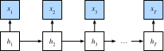

<!-- ===================== Bắt đầu dịch Phần 1 ==================== -->
<!-- ========================================= REVISE PHẦN 1 - BẮT ĐẦU =================================== -->

<!--
# Bidirectional Recurrent Neural Networks
-->

# Mạng Nơ-ron Hồi tiếp Hai chiều

:label:`sec_bi_rnn`


<!--
So far we assumed that our goal is to model the next word given what we have seen so far, e.g., in the context of a time series or in the context of a language model.
While this is a typical scenario, it is not the only one we might encounter.
To illustrate the issue, consider the following three tasks of filling in the blanks in a text:
-->

Cho đến nay ta giả định mục tiêu là để mô hình hóa bước thời gian kế tiếp dựa trên những thông tin trước đó, điển hình như chuỗi thời gian hay một mô hình ngôn ngữ. 
Tuy nhiên, đây không phải là trường hợp duy nhất chúng ta có thể gặp. 
Để minh họa cho vấn đề này, hãy xem xét ba tác vụ điền vào chỗ trống dưới đây: 


<!--
1. `I am _____`
2. `I am _____ very hungry.`
3. `I am _____ very hungry, I could eat half a pig.`
-->

1. `Tôi _____`
2. `Tôi _____ đói lắm.`
3. `Tôi _____ đói lắm, tôi có thể ăn một nửa con lợn.`


<!--
Depending on the amount of information available, we might fill the blanks with very different words such as "happy", "not", and "very".
Clearly the end of the phrase (if available) conveys significant information about which word to pick.
A sequence model that is incapable of taking advantage of this will perform poorly on related tasks.
For instance, to do well in named entity recognition (e.g., to recognize whether "Green" refers to "Mr. Green" or to the color) longer-range context is equally vital.
To get some inspiration for addressing the problem let us take a detour to graphical models.
-->

Tuỳ thuộc vào số lượng thông tin có sẵn, chúng ta có thể điền vào chỗ trống với các từ khác nhau như "hạnh phúc", "không", và "đang".
Rõ ràng phần kết (nếu có) của câu mang thông tin quan trọng ảnh hưởng lớn đến việc chọn từ. 
Một mô hình chuỗi sẽ thực hiện các tác vụ liên quan kém hiệu quả nếu nó không khai thác tốt được đặc điểm này. 
Chẳng hạn, để nhận dạng thực thể có tên (ví dụ: phân biệt từ "Bảy" đề cập đến "ông Bảy" hay là số bảy) một cách hiệu quả, ngữ cảnh khoảng dài cũng không kém phần quan trọng.
Chúng ta sẽ dành một chút thời gian tìm hiểu các mô hình đồ thị để tìm nguồn cảm hứng giải quyết bài toán trên. 


<!-- ===================== Kết thúc dịch Phần 1 ===================== -->

<!-- ===================== Bắt đầu dịch Phần 2 ===================== -->

<!--
## Dynamic Programming
-->

## Quy hoạch Động


<!--
This section serves to illustrate the dynamic programming problem.
The specific technical details do not matter for understanding the deep learning counterpart but they help in motivating why one might use deep learning and why one might pick specific architectures.
-->

Trong phần này, chúng ta sẽ tìm hiểu bài toán quy hoạch động. 
Không cần thiết phải hiểu chi tiết về quy hoạch động để hiểu kỹ thuật tương ứng trong học sâu nhưng chúng góp phần giải thích lý do tại sao học sâu được sử dụng và tại sao một vài kiến trúc mạng nhất định lại được lựa chọn. 


<!--
If we want to solve the problem using graphical models we could for instance design a latent variable model as follows.
We assume that there exists some latent variable $h_t$ which governs the emissions $x_t$ that we observe via $p(x_t \mid h_t)$.
Moreover, the transitions $h_t \to h_{t+1}$ are given by some state transition probability $p(h_t+1 \mid h_{t})$.
The graphical model is then a Hidden Markov Model (HMM) as in :numref:`fig_hmm`.
-->

Nếu muốn giải quyết bài toán bằng mô hình đồ thị thì chúng ta có thể thiết kế một mô hình biến tiềm ẩn như ví dụ sau đây. 
Giả sử tồn tại biến tiềm ẩn $h_t$ quyết định giá trị quan sát $x_t$ qua xác suất $p(x_t \mid h_t)$. 
Hơn nữa, quá trình chuyển đổi $h_t \to h_{t+1}$ được cho bởi xác suất chuyển trạng thái $p(h_t+1 \mid h_{t})$. 
Mô hình đồ thị khi đó là mô hình Markov ẩn (_Hidden Markov Model_ - HMM) như trong :numref:`fig_hmm`. 


<!--

-->


:label:`fig_hmm`

<!--
Thus, for a sequence of $T$ observations we have the following joint probability distribution over observed and hidden states:
-->

Như vậy, với chuỗi có $T$ quan sát, chúng ta có phân phối xác suất kết hợp của các trạng thái ẩn và các quan sát như sau: 


$$p(x, h) = p(h_1) p(x_1 \mid h_1) \prod_{t=2}^T p(h_t \mid h_{t-1}) p(x_t \mid h_t).$$

<!--
Now assume that we observe all $x_i$ with the exception of some $x_j$ and it is our goal to compute $p(x_j \mid x^{-j})$, where $x^{-j} = (x_1, x_2, \ldots, x_{j-1})$.
To accomplish this we need to sum over all possible choices of $h = (h_1, \ldots, h_T)$.
In case $h_i$ can take on $k$ distinct values, this means that we need to sum over $k^T$ terms---mission impossible!
Fortunately there is an elegant solution for this: dynamic programming.
To see how it works, consider summing over the first two hidden variable $h_1$ and $h_2$.
This yields:
-->

Bây giờ giả sử chúng ta đã có tất cả các quan sát $x_i$ ngoại trừ một vài quan sát $x_j$, mục tiêu là tính xác suất $p(x_j \mid x^{-j})$, trong đó $x^{-j} = (x_1, x_2, \ldots, x_{j-1})$.
Để thực hiện điều này, chúng ta cần tính tổng xác suất trên tất cả các khả năng có thể của $h = (h_1, \ldots, h_T)$. 
Trong trường hợp $h_i$ nhận $k$ giá trị khác nhau, chúng ta cần tính tổng của $k^T$ số hạng - đây là một nhiệm vụ bất khả thi. 
May mắn thay có một phương pháp rất hiệu quả cho bài toán trên, đó là quy hoạch động.  
Để hiểu hơn về phương pháp này, hãy xem xét tổng của hai biến ẩn đầu tiên $h_1$ và $h_2$.
Ta có:

$$\begin{aligned}
    p(x) & = \sum_{h_1, \ldots, h_T} p(x_1, \ldots, x_T; h_1, \ldots, h_T) \\
    & = \sum_{h_1, \ldots, h_T} p(h_1) p(x_1 \mid h_1) \prod_{t=2}^T p(h_t \mid h_{t-1}) p(x_t \mid h_t) \\
    & = \sum_{h_2, \ldots, h_T} \underbrace{\left[\sum_{h_1} p(h_1) p(x_1 \mid h_1) p(h_2 \mid h_1)\right]}_{=: \pi_2(h_2)}
    p(x_2 \mid h_2) \prod_{t=3}^T p(h_t \mid h_{t-1}) p(x_t \mid h_t) \\
    & = \sum_{h_3, \ldots, h_T} \underbrace{\left[\sum_{h_2} \pi_2(h_2) p(x_2 \mid h_2) p(h_3 \mid h_2)\right]}_{=: \pi_3(h_3)}
    p(x_3 \mid h_3) \prod_{t=4}^T p(h_t \mid h_{t-1}) p(x_t \mid h_t)\\
    & = \dots \\
    & = \sum_{h_T} \pi_T(h_T) p(x_T \mid h_T).
\end{aligned}$$


<!--
In general we have the *forward recursion* as
-->

Cơ bản, chúng ta có công thức *đệ quy xuôi* như sau:


$$\pi_{t+1}(h_{t+1}) = \sum_{h_t} \pi_t(h_t) p(x_t \mid h_t) p(h_{t+1} \mid h_t).$$


<!--
The recursion is initialized as $\pi_1(h_1) = p(h_1)$.
In abstract terms this can be written as $\pi_{t+1} = f(\pi_t, x_t)$, where $f$ is some learnable function.
This looks very much like the update equation in the hidden variable models we discussed so far in the context of RNNs.
Entirely analogously to the forward recursion, we can also start a backward recursion.
This yields:
-->

Phép đệ quy được khởi tạo với $\pi_1(h_1) = p(h_1)$. 
Nói chung, công thức đệ quy có thể được viết lại là $\pi_{t+1} = f(\pi_t, x_t)$, trong đó $f$ là một hàm được học. 
Trông rất giống với phương trình cập nhật trong các mô hình biến ẩn mà chúng ta đã thảo luận trong phần RNN. 
Tương tự, chúng ta có thể tính *đệ quy ngược* như sau: 


$$\begin{aligned}
    p(x) & = \sum_{h_1, \ldots, h_T} p(x_1, \ldots, x_T; h_1, \ldots, h_T) \\
    & = \sum_{h_1, \ldots, h_T} \prod_{t=1}^{T-1} p(h_t \mid h_{t-1}) p(x_t \mid h_t) \cdot p(h_T \mid h_{T-1}) p(x_T \mid h_T) \\
    & = \sum_{h_1, \ldots, h_{T-1}} \prod_{t=1}^{T-1} p(h_t \mid h_{t-1}) p(x_t \mid h_t) \cdot
    \underbrace{\left[\sum_{h_T} p(h_T \mid h_{T-1}) p(x_T \mid h_T)\right]}_{=: \rho_{T-1}(h_{T-1})} \\
    & = \sum_{h_1, \ldots, h_{T-2}} \prod_{t=1}^{T-2} p(h_t \mid h_{t-1}) p(x_t \mid h_t) \cdot
    \underbrace{\left[\sum_{h_{T-1}} p(h_{T-1} \mid h_{T-2}) p(x_{T-1} \mid h_{T-1}) \rho_{T-1}(h_{T-1}) \right]}_{=: \rho_{T-2}(h_{T-2})} \\
    & = \ldots, \\
    & = \sum_{h_1} p(h_1) p(x_1 \mid h_1)\rho_{1}(h_{1}).
\end{aligned}$$


<!--
We can thus write the *backward recursion* as
-->

Từ đó, chúng ta có thể viết *đệ quy ngược* như sau: 


$$\rho_{t-1}(h_{t-1})= \sum_{h_{t}} p(h_{t} \mid h_{t-1}) p(x_{t} \mid h_{t}) \rho_{t}(h_{t}),$$

<!-- ===================== Kết thúc dịch Phần 2 ===================== -->

<!-- ===================== Bắt đầu dịch Phần 3 ===================== -->

<!--
with initialization $\rho_T(h_T) = 1$.
These two recursions allow us to sum over $T$ variables in $\mathcal{O}(kT)$ (linear) time over all values of $(h_1, \ldots, h_T)$ rather than in exponential time.
This is one of the great benefits of the probabilistic inference with graphical models.
It is a very special instance of the :cite:`Aji.McEliece.2000` proposed in 2000 by Aji and McEliece.
Combining both forward and backward pass, we are able to compute
-->

khi khởi tạo $\rho_T(h_T) = 1$. 
Hai biểu thức đệ quy này cho phép ta tính tổng trên tất cả $T$ biến trong khoảng $(h_1, \ldots, h_T)$ với thời gian $\mathcal{O}(kT)$ tăng tuyến tính thay vì luỹ thừa. 
Đây là một trong những điểm mạnh của kỹ thuật suy luận xác suất với các mô hình đồ thị. 
Đây là một trường hợp đặc biệt của kỹ thuật được trình bày trong :cite:`Aji.McEliece.2000` bởi Aji và McEliece vào năm 2000.  
Kết hợp cả biểu thức xuôi và ngược ta có thể tính được: 


$$p(x_j \mid x_{-j}) \propto \sum_{h_j} \pi_j(h_j) \rho_j(h_j) p(x_j \mid h_j).$$


<!--
Note that in abstract terms the backward recursion can be written as $\rho_{t-1} = g(\rho_t, x_t)$, where $g$ is a learnable function.
Again, this looks very much like an update equation, just running backwards unlike what we have seen so far in RNNs.
Indeed, HMMs benefit from knowing future data when it is available.
Signal processing scientists distinguish between the two cases of knowing and not knowing future observations as interpolation v.s. extrapolation.
See the introductory chapter of the book by :cite:`Doucet.De-Freitas.Gordon.2001` on sequential Monte Carlo algorithms for more details.
-->

Cần phải chú ý rằng khi suy rộng ra, biểu thức đệ quy ngược có thể được viết dưới dạng $\rho_{t-1} = g(\rho_t, x_t)$, trong đó $g$ là một hàm số được học. 
Một lần nữa, nó trông giống như một phương trình cập nhật chỉ chạy ngược lại, không giống như những gì chúng ta thấy ở RNN.  
Thật vậy, HMM sẽ có lợi từ việc học các dữ liệu trong tương lai (nếu có thể).
Các nhà khoa học chuyên về xử lí tín hiệu sẽ tách biệt 2 trường hợp biết trước và không biết trước các kết quả trong tương lai thành nội suy và ngoại suy. 
Ta có thể tham khảo chương giới thiệu của cuốn :cite:`Doucet.De-Freitas.Gordon.2001` về các thuật toán Monte Carlo tuần tự để biết thêm chi tiết. 

<!-- ========================================= REVISE PHẦN 1 - KẾT THÚC ===================================-->

<!-- ========================================= REVISE PHẦN 2 - BẮT ĐẦU ===================================-->

<!--
## Bidirectional Model
-->

## Mô hình Hai chiều

<!--
If we want to have a mechanism in RNNs that offers comparable look-ahead ability as in HMMs, we need to modify the recurrent net design that we have seen so far.
Fortunately, this is easy conceptually.
Instead of running an RNN only in the forward mode starting from the first symbol, we start another one from the last symbol running from back to front.
*Bidirectional recurrent neural networks* add a hidden layer that passes information in a backward direction to more flexibly process such information.
:numref:`fig_birnn` illustrates the architecture of a bidirectional recurrent neural network with a single hidden layer.
-->

Nếu chúng ta muốn mạng RNN có một cơ chế nhìn trước giống như HMM thì ta cần phải chỉnh sửa một chút thiết kế của các mạng hồi tiếp truyền thống. 
May mắn là, điều này khá đơn giản về mặt khái niệm. 
Thay vì chỉ vận hành một RNN chạy từ kí tự đầu đến cuối, ta sẽ khởi tạo một RNN nữa chạy từ kí tự cuối lên đầu. 
*Mạng nơ ron hồi tiếp hai chiều* (*Bidirectional recurrent neural network*) sẽ thêm một tầng ẩn cho phép xử lý dữ liệu theo chiều ngược lại một cách linh hoạt hơn so với RNN truyền thống. 
:numref:`fig_birnn` mô tả cấu trúc của mạng nơ-ron hồi tiếp hai chiều với một tầng ẩn.  

<!--

--> 


:label:`fig_birnn`

<!--
In fact, this is not too dissimilar to the forward and backward recursion we encountered above.
The main distinction is that in the previous case these equations had a specific statistical meaning.
Now they are devoid of such easily accessible interpretation and we can just treat them as generic functions.
This transition epitomizes many of the principles guiding the design of modern deep networks: 
first, use the type of functional dependencies of classical statistical models, and then use the models in a generic form.
-->

Trên thực tế, điều này không quá khác biệt với phép đệ quy xuôi và ngược mà ta đã đề cập ở phần trước.
Điểm khác biệt chính là trước đây các phương trình này có một ý nghĩa thống kê nhất định. 
Còn bây giờ thì chúng không còn mang một ý nghĩa dễ hiểu nào nhất định, thay vào đó ta sẽ chỉ xét chúng như những hàm tổng quát.
Quá trình chuyển đổi này là điển hình cho nhiều nguyên tắc thiết kế các mạng học sâu hiện đại:
đầu tiên, sử dụng các dạng quan hệ phụ thuộc hàm của các mô hình thống kê cổ điển, sau đó sử dụng các mô hình này dưới dạng tổng quát.

<!-- ===================== Kết thúc dịch Phần 3 ===================== -->

<!-- ===================== Bắt đầu dịch Phần 4 ===================== -->

<!--
### Definition
-->

### Định nghĩa

<!--
Bidirectional RNNs were introduced by :cite:`Schuster.Paliwal.1997`.
For a detailed discussion of the various architectures see also the paper by :cite:`Graves.Schmidhuber.2005`.
Let us look at the specifics of such a network.
-->

Các mạng nơ-ron hồi tiếp hai chiều đã được giới thiệu bởi :cite:`Schuster.Paliwal.1997`.
Ta có thể xem thêm :cite:`Graves.Schmidhuber.2005` về những thảo luận chi tiết của các kiến trúc khác nhau. 
Còn giờ ta hãy đi vào chi tiết của một mạng như vậy. 

<!--
For a given timestep $t$, the minibatch input is $\mathbf{X}_t \in \mathbb{R}^{n \times d}$ (number of examples: $n$, number of inputs: $d$) and the ßßhidden layer activation function is $\phi$.
In the bidirectional architecture, we assume that the forward and backward hidden states for this timestep are 
$\overrightarrow{\mathbf{H}}_t  \in \mathbb{R}^{n \times h}$ and $\overleftarrow{\mathbf{H}}_t  \in \mathbb{R}^{n \times h}$ respectively.
Here $h$ indicates the number of hidden units.
We compute the forward and backward hidden state updates as follows:
-->

Cho một bước thời gian $t$, đầu vào minibatch là $\mathbf{X}_t \in \mathbb{R}^{n \times d}$ ($n$ là số lượng mẫu, $d$ là số lượng đầu vào) và hàm kích hoạt của tầng ẩn là $\phi$.
Trong kiến thúc hai chiều, ta giả định rằng trạng thái ẩn xuôi và ngược của bước thời gian này lần lượt là $\overrightarrow{\mathbf{H}}_t  \in \mathbb{R}^{n \times h}$ và $\overleftarrow{\mathbf{H}}_t  \in \mathbb{R}^{n \times h}$. 
$h$ ở đây chỉ số lượng nút ẩn. 
Chúng ta tính toán việc cập nhật xuôi và ngược của trạng thái ẩn như sau: 

$$
\begin{aligned}
\overrightarrow{\mathbf{H}}_t &= \phi(\mathbf{X}_t \mathbf{W}_{xh}^{(f)} + \overrightarrow{\mathbf{H}}_{t-1} \mathbf{W}_{hh}^{(f)}  + \mathbf{b}_h^{(f)}),\\
\overleftarrow{\mathbf{H}}_t &= \phi(\mathbf{X}_t \mathbf{W}_{xh}^{(b)} + \overleftarrow{\mathbf{H}}_{t+1} \mathbf{W}_{hh}^{(b)}  + \mathbf{b}_h^{(b)}).
\end{aligned}
$$


<!--
Here, the weight parameters 
$\mathbf{W}_{xh}^{(f)} \in \mathbb{R}^{d \times h}, \mathbf{W}_{hh}^{(f)} \in \mathbb{R}^{h \times h}, \mathbf{W}_{xh}^{(b)} \in \mathbb{R}^{d \times h}, \text{ and } \mathbf{W}_{hh}^{(b)} \in \mathbb{R}^{h \times h}$, and bias parameters $\mathbf{b}_h^{(f)} \in \mathbb{R}^{1 \times h} \text{ and } \mathbf{b}_h^{(b)} \in \mathbb{R}^{1 \times h}$ 
are all model parameters.
-->

Ở đây, các trọng số $\mathbf{W}_{xh}^{(f)} \in \mathbb{R}^{d \times h}, \mathbf{W}_{hh}^{(f)} \in \mathbb{R}^{h \times h}, \mathbf{W}_{xh}^{(b)} \in \mathbb{R}^{d \times h}, \text{ và } \mathbf{W}_{hh}^{(b)} \in \mathbb{R}^{h \times h}$ và các độ chệch $\mathbf{b}_h^{(f)} \in \mathbb{R}^{1 \times h} \text{ và } \mathbf{b}_h^{(b)} \in \mathbb{R}^{1 \times h}$ đều là tham số mô hình. 

<!--
Then we concatenate the forward and backward hidden states $\overrightarrow{\mathbf{H}}_t$ and $\overleftarrow{\mathbf{H}}_t$ 
to obtain the hidden state $\mathbf{H}_t \in \mathbb{R}^{n \times 2h}$ and feed it to the output layer.
In deep bidirectional RNNs, the information is passed on as *input* to the next bidirectional layer.
Last, the output layer computes the output $\mathbf{O}_t \in \mathbb{R}^{n \times q}$ (number of outputs: $q$):
-->

Sau đó, chúng ta nối các trạng thái ẩn xuôi và ngược ($\overrightarrow{\mathbf{H}}_t$, $\overleftarrow{\mathbf{H}}_t$) để thu được trạng thái ẩn $\mathbf{H}_t \in \mathbb{R}^{n \times 2h}$ và truyền nó đến tầng đầu ra. 
Trong các mạng nơ-ron hồi tiếp hai chiều sâu, thông tin được truyền đi như là *đầu vào* cho tầng hai chiều (_bidirectional layer_) tiếp theo. 
Cuối cùng, tầng đầu ra sẽ tính toán đầu ra $\mathbf{O}_t \in \mathbb{R}^{n \times q}$ ($q$ là số lượng đầu ra) như sau: 


$$\mathbf{O}_t = \mathbf{H}_t \mathbf{W}_{hq} + \mathbf{b}_q.$$


<!--
Here, the weight parameter $\mathbf{W}_{hq} \in \mathbb{R}^{2h \times q}$ and the bias parameter $\mathbf{b}_q \in \mathbb{R}^{1 \times q}$ are the model parameters of the output layer.
The two directions can have different numbers of hidden units.
-->

Ở đây, trọng số $\mathbf{W}_{hq} \in \mathbb{R}^{2h \times q}$ và độ chệch $\mathbf{b}_q \in \mathbb{R}^{1 \times q}$ là các tham số mô hình của tầng đầu ra. 
Hai chiều ngược và xuôi có thể có số nút ẩn khác nhau. 


<!-- ===================== Kết thúc dịch Phần 4 ===================== -->

<!-- ===================== Bắt đầu dịch Phần 5 ===================== -->

<!--
### Computational Cost and Applications
-->

### Chi phí Tính toán và Ứng dụng

<!--
One of the key features of a bidirectional RNN is that information from both ends of the sequence is used to estimate the output.
That is, we use information from both future and past observations to predict the current one (a smoothing scenario).
In the case of language models this is not quite what we want.
After all, we do not have the luxury of knowing the next to next symbol when predicting the next one.
Hence, if we were to use a bidirectional RNN naively we would not get a very good accuracy: during training we have past and future data to estimate the present.
During test time we only have past data and thus poor accuracy (we will illustrate this in an experiment below).
-->

Một trong những tính năng chính của RNN hai chiều là thông tin từ cả hai đầu của chuỗi được sử dụng để ước lượng kết quả đầu ra.
Chúng ta sử dụng thông tin từ các quan sát trong tương lai và quá khứ để dự đoán hiện tại (như để làm mượt). 
Trong trường hợp mô hình ngôn ngữ, đây không hẳn là điều chúng ta muốn.
Rốt cuộc, chúng ta không thể biết biểu tượng tiếp sau biểu tượng đang cần dự đoán. 
Do đó, nếu chúng ta sử dụng RNN hai chiều một cách ngây thơ, chúng ta sẽ không có được độ chính xác đủ tốt: trong quá trình huấn luyện, chúng ta có cả dữ liệu quá khứ và tương lai để ước tính hiện tại. 
Trong quá trình dự đoán, chúng ta chỉ có dữ liệu trong quá khứ và do đó kết quả dự đoán có độ chính xác kém (điều này được minh họa trong thí nghiệm bên dưới). 

<!--
To add insult to injury, bidirectional RNNs are also exceedingly slow.
The main reasons for this are that they require both a forward and a backward pass and that the backward pass is dependent on the outcomes of the forward pass.
Hence, gradients will have a very long dependency chain.
-->

Tệ hơn, RNN hai chiều cũng cực kỳ chậm.
Những lý do chính cho điều này là vì chúng cần cả lượt truyền xuôi và lượt truyền ngược, và lượt truyền ngược thì phụ thuộc vào kết quả của lượt truyền xuôi. 
Do đó, gradient sẽ có một chuỗi phụ thuộc rất dài. 


<!--
In practice bidirectional layers are used very sparingly and only for a narrow set of applications, such as filling in missing words, annotating tokens 
(e.g., for named entity recognition), or encoding sequences wholesale as a step in a sequence processing pipeline (e.g., for machine translation).
In short, handle with care!
-->

Trong thực tế, các tầng hai chiều được sử dụng rất ít và chỉ dành cho một số ít ứng dụng, chẳng hạn như điền từ còn thiếu, 
chú thích token (ví dụ cho nhận dạng thực thể có tên) hoặc mã hóa nguyên chuỗi tại một bước trong pipeline xử lý chuỗi (ví dụ trong dịch máy). 
Tóm lại, hãy sử dụng nó một cách cẩn thận!

<!-- ===================== Kết thúc dịch Phần 5 ===================== -->

<!-- ===================== Bắt đầu dịch Phần 6 ===================== -->

<!-- ========================================= REVISE PHẦN 2 - KẾT THÚC ===================================-->

<!-- ========================================= REVISE PHẦN 3 - BẮT ĐẦU ===================================-->

<!--
### Training a Bidirectional RNN for the Wrong Application
-->

### Huấn luyện Mạng RNN Hai chiều cho Ứng dụng không Phù hợp

<!--
If we were to ignore all advice regarding the fact that bidirectional LSTMs use past and future data and simply apply it to language models, we will get estimates with acceptable perplexity.
Nonetheless, the ability of the model to predict future symbols is severely compromised as the example below illustrates.
Despite reasonable perplexity, it only generates gibberish even after many iterations.
We include the code below as a cautionary example against using them in the wrong context.
-->

Nếu chúng ta bỏ qua tất cả các lời khuyên về việc LSTM hai chiều sử dụng cả dữ liệu trong quá khứ và tương lai, và cứ áp dụng nó cho các mô hình ngôn ngữ, chúng ta sẽ có được các ước lượng với perplexity chấp nhận được.
Tuy nhiên, khả năng dự đoán các ký tự trong tương lai của mô hình bị tổn hại nghiêm trọng như minh họa trong ví dụ dưới đây. 
Mặc dù đạt được mức perplexity hợp lý, nó chỉ sinh ra các chuỗi vô nghĩa ngay cả sau nhiều vòng lặp. 
Chúng tôi sử dụng đoạn mã dưới đây như một ví dụ cảnh báo về việc sử dụng chúng ở sai bối cảnh. 


```{.python .input}
from d2l import mxnet as d2l
from mxnet import npx
from mxnet.gluon import rnn
npx.set_np()

# Load data
batch_size, num_steps = 32, 35
train_iter, vocab = d2l.load_data_time_machine(batch_size, num_steps)
# Define the model
vocab_size, num_hiddens, num_layers, ctx = len(vocab), 256, 2, d2l.try_gpu()
lstm_layer = rnn.LSTM(num_hiddens, num_layers, bidirectional=True)
model = d2l.RNNModel(lstm_layer, len(vocab))
# Train the model
num_epochs, lr = 500, 1
d2l.train_ch8(model, train_iter, vocab, lr, num_epochs, ctx)
```


<!--
The output is clearly unsatisfactory for the reasons described above.
For a discussion of more effective uses of bidirectional models, please see the sentiment classification in :numref:`sec_sentiment_rnn`.
-->

Đầu ra rõ ràng không hề tốt vì những lý do trên. 
Để thảo luận về việc sử dụng hiệu quả hơn các mô hình hai chiều, vui lòng xem bài toán phân loại cảm xúc trong :numref:`sec_sentiment_rnn`. 

<!--
## Summary
-->

## Tóm tắt

<!--
* In bidirectional recurrent neural networks, the hidden state for each timestep is simultaneously determined by the data prior to and after the current timestep.
* Bidirectional RNNs bear a striking resemblance with the forward-backward algorithm in graphical models.
* Bidirectional RNNs are mostly useful for sequence embedding and the estimation of observations given bidirectional context.
* Bidirectional RNNs are very costly to train due to long gradient chains.
-->

* Trong các mạng nơ-ron hồi tiếp hai chiều, trạng thái ẩn tại mỗi bước thời gian được xác định đồng thời bởi dữ liệu ở trước và sau bước thời gian đó. 
* Các RNN hai chiều có sự tương đồng đáng kinh ngạc với thuật toán xuôi–ngược trong các mô hình đồ thị. 
* RNN hai chiều chủ yếu hữu ích cho việc tạo embedding chuỗi và việc ước lượng dữ liệu quan sát được khi biết bối cảnh hai chiều. 
* Việc huấn luyện RNN hai chiều rất tốn kém do các chuỗi gradient dài. 

<!--
## Exercises
-->

## Bài tập

<!--
1. If the different directions use a different number of hidden units, how will the shape of $\mathbf{H}_t$ change?
2. Design a bidirectional recurrent neural network with multiple hidden layers.
3. Implement a sequence classification algorithm using bidirectional RNNs. 
Hint: use the RNN to embed each word and then aggregate (average) all embedded outputs before sending the output into an MLP for classification. 
For instance, if we have $(\mathbf{o}_1, \mathbf{o}_2, \mathbf{o}_3)$, we compute $\bar{\mathbf{o}} = \frac{1}{3} \sum_i \mathbf{o}_i$ first and then use the latter for sentiment classification.
-->


1. Nếu các hướng khác nhau sử dụng số nút ẩn khác nhau, kích thước của $\mathbf{H}_t$ sẽ thay đổi như thế nào?
2. Thiết kế một mạng nơ-ron hồi tiếp hai chiều với nhiều tầng ẩn. 
3. Lập trình thuật toán phân loại chuỗi bằng cách sử dụng các RNN hai chiều. 
**Gợi ý:** sử dụng RNN để tạo embedding cho từng từ và sau đó tổng hợp (lấy trung bình) tất cả các embedding đầu ra trước khi đưa chúng vào mô hình MLP để phân loại.
Chẳng hạn, nếu chúng ta có $(\mathbf{o}_1, \mathbf{o}_2, \mathbf{o}_3)$, ta sẽ tính $\bar{\mathbf{o}} = \frac{1}{3} \sum_i \mathbf{o}_i$ trước rồi sử dụng nó để phân loại cảm xúc.


<!-- ===================== Kết thúc dịch Phần 6 ===================== -->
<!-- ========================================= REVISE PHẦN 3 - KẾT THÚC ===================================-->

## Thảo luận
* [Tiếng Anh](https://discuss.mxnet.io/t/2370)
* [Tiếng Việt](https://forum.machinelearningcoban.com/c/d2l)

## Những người thực hiện
Bản dịch trong trang này được thực hiện bởi:

* Đoàn Võ Duy Thanh
* Nguyễn Văn Quang
* Nguyễn Văn Cường
* Lê Khắc Hồng Phúc
* Nguyễn Lê Quang Nhật
* Đinh Phước Lộc
* Võ Tấn Phát
* Nguyễn Thanh Hòa
* Trần Yến Thy
* Phạm Hồng Vinh
