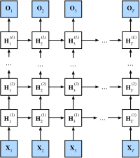

<!-- ===================== Bắt đầu dịch Phần 1 ==================== -->
<!-- ========================================= REVISE PHẦN 1 - BẮT ĐẦU =================================== -->

<!--
# Deep Recurrent Neural Networks
-->

# *dịch tiêu đề phía trên*

:label:`sec_deep_rnn`

<!--
Up to now, we only discussed recurrent neural networks with a single unidirectional hidden layer.
In it the specific functional form of how latent variables and observations interact was rather arbitrary.
This is not a big problem as long as we have enough flexibility to model different types of interactions.
With a single layer, however, this can be quite challenging.
In the case of the perceptron, we fixed this problem by adding more layers.
Within RNNs this is a bit trickier, since we first need to decide how and where to add extra nonlinearity.
Our discussion below focuses primarily on LSTMs, but it applies to other sequence models, too.
-->

*dịch đoạn phía trên*

<!--
* We could add extra nonlinearity to the gating mechanisms. 
That is, instead of using a single perceptron we could use multiple layers. 
This leaves the *mechanism* of the LSTM unchanged. 
Instead it makes it more sophisticated. 
This would make sense if we were led to believe that the LSTM mechanism describes some form of universal truth of how latent variable autoregressive models work.
* We could stack multiple layers of LSTMs on top of each other.
This results in a mechanism that is more flexible, due to the combination of several simple layers.
In particular, data might be relevant at different levels of the stack.
For instance, we might want to keep high-level data about financial market conditions (bear or bull market) available, whereas at a lower level we only record shorter-term temporal dynamics.
-->

*dịch đoạn phía trên*

<!--
Beyond all this abstract discussion it is probably easiest to understand the family of models we are interested in by reviewing :numref:`fig_deep_rnn`.
It describes a deep recurrent neural network with $L$ hidden layers.
Each hidden state is continuously passed to both the next timestep of the current layer and the current timestep of the next layer.
-->

*dịch đoạn phía trên*

<!--

-->


:label:`fig_deep_rnn`

<!-- ===================== Kết thúc dịch Phần 1 ===================== -->

<!-- ===================== Bắt đầu dịch Phần 2 ===================== -->

<!--
## Functional Dependencies
-->

## Các Phụ thuộc Hàm


<!--
At timestep $t$ we assume that we have a minibatch $\mathbf{X}_t \in \mathbb{R}^{n \times d}$ (number of examples: $n$, number of inputs: $d$).
The hidden state of hidden layer $\ell$ ($\ell=1,\ldots, T$) is $\mathbf{H}_t^{(\ell)}  \in \mathbb{R}^{n \times h}$ (number of hidden units: $h$), 
the output layer variable is $\mathbf{O}_t \in \mathbb{R}^{n \times q}$ (number of outputs: $q$) and a hidden layer activation function $f_l$ for layer $l$.
We compute the hidden state of layer $1$ as before, using $\mathbf{X}_t$ as input.
For all subsequent layers, the hidden state of the previous layer is used in its place.
-->

Tại bước thời gian $t$, giả sử rằng chúng ta có một minibatch $\mathbf{X}_t \in \mathbb{R}^{n \times d}$ (số lượng mẫu: $n$, số lượng đầu vào: $d$ ).
Trạng thái ẩn của tầng ẩn $\ell$ ($\ell=1,\ldots, T$) là $\mathbf{H}_t^{(\ell)}  \in \mathbb{R}^{n \times h}$ (số đơn vị ẩn: $h$),
biến tầng ra là $\mathbf{O}_t \in \mathbb{R}^{n \times q}$ (số lượng đầu ra: $q$) và một hàm kích hoạt tầng ẩn $f_l$ cho tầng $l$ .
Chúng ta tính toán trạng thái ẩn của tầng đầu tiên như trước đây, sử dụng đầu vào là $\mathbf{X}_t$.
Đối với tất cả các tầng tiếp theo, trạng thái ẩn của tầng trước được sử dụng tại vị trí đó.

$$\begin{aligned}
\mathbf{H}_t^{(1)} & = f_1\left(\mathbf{X}_t, \mathbf{H}_{t-1}^{(1)}\right), \\
\mathbf{H}_t^{(l)} & = f_l\left(\mathbf{H}_t^{(l-1)}, \mathbf{H}_{t-1}^{(l)}\right).
\end{aligned}$$


<!--
Finally, the output layer is only based on the hidden state of hidden layer $L$.
We use the output function $g$ to address this:
-->

Cuối cùng, tầng đầu ra chỉ dựa trên trạng thái ẩn của tầng ẩn $L$.
Chúng ta sử dụng một hàm đầu ra $g$ để xử lý trạng thái này:

$$\mathbf{O}_t = g \left(\mathbf{H}_t^{(L)}\right).$$


<!--
Just as with multilayer perceptrons, the number of hidden layers $L$ and number of hidden units $h$ are hyper parameters.
In particular, we can pick a regular RNN, a GRU, or an LSTM to implement the model.
-->

Giống như perceptron đa tầng, số tầng ẩn $L$ và số đơn vị ẩn $h$ được coi là các siêu tham số.
Đặc biệt, chúng ta có thể chọn một kiến trúc RNN cơ bản, GRU, hoặc LSTM để lập trình mô hình.

<!-- ========================================= REVISE PHẦN 1 - KẾT THÚC ===================================-->

<!-- ========================================= REVISE PHẦN 2 - BẮT ĐẦU ===================================-->

<!--
## Concise Implementation
-->

## Lập trình Ngắn gọn


<!--
Fortunately many of the logistical details required to implement multiple layers of an RNN are readily available in Gluon.
To keep things simple we only illustrate the implementation using such built-in functionality.
The code is very similar to the one we used previously for LSTMs.
In fact, the only difference is that we specify the number of layers explicitly rather than picking the default of a single layer.
Let us begin by importing the appropriate modules and loading data.
-->

May mắn thay nhiều chi tiết phía sau cần thiết để lập trình một kiến trúc RNN nhiều tầng đã có sẵn trong Gluon.
Để đơn giản, chúng tôi chỉ minh họa việc lập trình bằng cách sử dụng những mã nguồn tích hợp sẵn.
Mã nguồn dưới đây rất giống những gì chúng ta sử dụng trước đây cho mạng LSTM.
Trong thực tế, sự khác biệt duy nhất là chúng ta xác định số lượng các tầng một cách rõ ràng thay vì chọn mặc định là một tầng duy nhất.
Chúng ta hãy bắt đầu bằng cách nhập các mô-đun thích hợp và đọc dữ liệu.


```{.python .input  n=17}
import d2l
from mxnet import npx
from mxnet.gluon import rnn
npx.set_np()

batch_size, num_steps = 32, 35
train_iter, vocab = d2l.load_data_time_machine(batch_size, num_steps)
```


<!--
The architectural decisions (such as choosing parameters) are very similar to those of previous sections.
We pick the same number of inputs and outputs as we have distinct tokens, i.e., `vocab_size`.
The number of hidden units is still 256.
The only difference is that we now select a nontrivial number of layers `num_layers = 2`.
-->

Các quyết định liên quan tới kiến ​​trúc mạng (ví dụ như lựa chọn các tham số) rất giống với những phần trước.
Chúng ta sử dụng cùng số lượng đầu vào và đầu ra với các token riêng biệt, cụ thể là, `vocab_size`.
Số lượng đơn vị ẩn vẫn là 256.
Sự khác biệt duy nhất là bây giờ chúng ta sẽ chọn một giá trị lớn hơn 1 cho số tầng `num_layers = 2`.


```{.python .input  n=22}
vocab_size, num_hiddens, num_layers, ctx = len(vocab), 256, 2, d2l.try_gpu()
lstm_layer = rnn.LSTM(num_hiddens, num_layers)
model = d2l.RNNModel(lstm_layer, len(vocab))
```

<!-- ===================== Kết thúc dịch Phần 2 ===================== -->

<!-- ===================== Bắt đầu dịch Phần 3 ===================== -->

<!--
## Training
-->

## *dịch tiêu đề phía trên*

<!--
The actual invocation logic is identical to before.
The only difference is that we now instantiate two layers with LSTMs.
This rather more complex architecture and the large number of epochs slow down training considerably.
-->

*dịch đoạn phía trên*


```{.python .input  n=8}
num_epochs, lr = 500, 2
d2l.train_ch8(model, train_iter, vocab, lr, num_epochs, ctx)
```

<!--
## Summary
-->

## Tóm tắt

<!--
* In deep recurrent neural networks, hidden state information is passed to the next timestep of the current layer and the current timestep of the next layer.
* There exist many different flavors of deep RNNs, such as LSTMs, GRUs, or regular RNNs. Conveniently these models are all available as parts of the `rnn` module in Gluon.
* Initialization of the models requires care. Overall, deep RNNs require considerable amount of work (such as learning rate and clipping) to ensure proper convergence.
-->

*dịch đoạn phía trên*

<!--
## Exercises
-->

## Bài tập

<!--
1. Try to implement a two-layer RNN from scratch using the single layer implementation we discussed in :numref:`sec_rnn_scratch`.
2. Replace the LSTM by a GRU and compare the accuracy.
3. Increase the training data to include multiple books. How low can you go on the perplexity scale?
4. Would you want to combine sources of different authors when modeling text? Why is this a good idea? What could go wrong?
-->

*dịch đoạn phía trên*

<!-- ===================== Kết thúc dịch Phần 3 ===================== -->
<!-- ========================================= REVISE PHẦN 2 - KẾT THÚC ===================================-->


## Thảo luận
* [Tiếng Anh](https://discuss.mxnet.io/t/2369)
* [Tiếng Việt](https://forum.machinelearningcoban.com/c/d2l)

## Những người thực hiện
Bản dịch trong trang này được thực hiện bởi:
<!--
Tác giả của mỗi Pull Request điền tên mình và tên những người review mà bạn thấy
hữu ích vào từng phần tương ứng. Mỗi dòng một tên, bắt đầu bằng dấu `*`.

Lưu ý:
* Nếu reviewer không cung cấp tên, bạn có thể dùng tên tài khoản GitHub của họ
với dấu `@` ở đầu. Ví dụ: @aivivn.

* Tên đầy đủ của các reviewer có thể được tìm thấy tại https://github.com/aivivn/d2l-vn/blob/master/docs/contributors_info.md
-->

* Đoàn Võ Duy Thanh
<!-- Phần 1 -->
*

<!-- Phần 2 -->
* Nguyễn Văn Quang

<!-- Phần 3 -->
*
