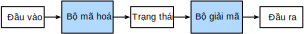

<!-- ===================== Bắt đầu dịch Phần 1 ==================== -->
<!-- ========================================= REVISE - BẮT ĐẦU =================================== -->

<!--
# Encoder-Decoder Architecture
-->

# Kiến trúc Mã hoá - Giải mã

<!--
The *encoder-decoder architecture* is a neural network design pattern.
As shown in :numref:`fig_encoder_decoder`, the architecture is partitioned into two parts, the encoder and the decoder.
The encoder's role is to encode the inputs into state, which often contains several tensors.
Then the state is passed into the decoder to generate the outputs.
In machine translation, the encoder transforms a source sentence, e.g., "Hello world.", into state, e.g., a vector, that captures its semantic information.
The decoder then uses this state to generate the translated target sentence, e.g., "Bonjour le monde.".
-->

*Kiến trúc mã hoá - giải mã* (*encoder-decoder architecture*) là một khuôn mẫu thiết kế mạng nơ-ron.
Kiến trúc này có 2 phần: bộ mã hoá và bộ giải mã, có thể thấy trong :numref:`fig_encoder_decoder`
Bộ mã hoá đóng vai trò mã hoá đầu vào thành trạng thái chứa vài tensor.
Tiếp đó, trạng thái được truyền vào bộ giải mã để sinh đầu ra.
Trong dịch máy, bộ mã hoá biến đổi một câu nguồn, ví dụ như "Hello world.", thành trạng thái, chẳng hạn là một vector chứa thông tin ngữ nghĩa của câu đó.
Sau đó bộ giải mã sử dụng trạng thái này để dịch câu sang ngôn ngữ đích, ví dụ sang tiếng Pháp "Bonjour le monde.".

<!--

-->


:label:`fig_encoder_decoder`

<!--
In this section, we will show an interface to implement this encoder-decoder architecture.
-->

Phần này trình bày một giao diện (*interface*) để lập trình kiến trúc mã hoá - giải mã.


<!--
## Encoder
-->

## Bộ mã hoá

<!--
The encoder is a normal neural network that takes inputs, e.g., a source sentence, to return outputs.
-->

Bộ mã hoá là một mạng nơ-ron thông thường, nhận đầu vào, ví dụ như một câu nguồn, và trả về đầu ra.


```{.python .input  n=2}
from mxnet.gluon import nn

# Saved in the d2l package for later use
class Encoder(nn.Block):
    """The base encoder interface for the encoder-decoder architecture."""
    def __init__(self, **kwargs):
        super(Encoder, self).__init__(**kwargs)

    def forward(self, X, *args):
        raise NotImplementedError
```

<!--
## Decoder
-->

## Bộ giải mã

<!--
The decoder has an additional method `init_state` to parse the outputs of the encoder with possible additional information,
e.g., the valid lengths of inputs, to return the state it needs.
In the forward method, the decoder takes both inputs, e.g., a target sentence and the state.
It returns outputs, with potentially modified state if the encoder contains RNN layers.
-->

Bộ giải mã có thêm phương thức `init_state` nhằm phân tích đầu ra của bộ mã hoá với những thông tin bổ sung (nếu có), như độ dài hợp lệ của đầu vào, để đưa ra trạng thái cần thiết.
Trong lan truyền xuôi, bộ giải mã nhận hai đầu vào, ví dụ như một câu đích và trạng thái.
Nó trả về đầu ra với trạng thái nhiều khả năng đã thay đổi nếu bộ mã hoá chứa các tầng RNN.


```{.python .input  n=3}
# Saved in the d2l package for later use
class Decoder(nn.Block):
    """The base decoder interface for the encoder-decoder architecture."""
    def __init__(self, **kwargs):
        super(Decoder, self).__init__(**kwargs)

    def init_state(self, enc_outputs, *args):
        raise NotImplementedError

    def forward(self, X, state):
        raise NotImplementedError
```

<!-- ===================== Kết thúc dịch Phần 1 ===================== -->

<!-- ===================== Bắt đầu dịch Phần 2 ===================== -->

<!--
## Model
-->

## Mô hình

<!--
The encoder-decoder model contains both an encoder and a decoder.
We implement its forward method for training.
It takes both encoder inputs and decoder inputs, with optional additional arguments.
During computation, it first computes encoder outputs to initialize the decoder state, and then returns the decoder outputs.
-->

Mô hình mã hoá - giải mã bao gồm một bộ mã hoá và một bộ giải mã.
Chúng ta lập trình phương thức truyền xuôi cho quá trình huấn luyện.
Phương thức này nhận cả đầu vào bộ mã hoá và đầu vào bộ giải mã cùng các đối số bổ sung không bắt buộc.
Mô hình tính đầu ra của bộ mã hoá để khởi tạo trạng thái bộ giải mã, sau đó trả về đầu ra của bộ giải mã.


```{.python .input  n=4}
# Saved in the d2l package for later use
class EncoderDecoder(nn.Block):
    """The base class for the encoder-decoder architecture."""
    def __init__(self, encoder, decoder, **kwargs):
        super(EncoderDecoder, self).__init__(**kwargs)
        self.encoder = encoder
        self.decoder = decoder

    def forward(self, enc_X, dec_X, *args):
        enc_outputs = self.encoder(enc_X, *args)
        dec_state = self.decoder.init_state(enc_outputs, *args)
        return self.decoder(dec_X, dec_state)
```

<!--
## Summary
-->

## Tóm tắt

<!--
* An encoder-decoder architecture is a neural network design pattern mainly in natural language processing.
* An encoder is a network (FC, CNN, RNN, etc.) that takes the input, and outputs a feature map, a vector or a tensor.
* An decoder is a network (usually the same network structure as encoder) that takes the feature vector from the encoder, and gives the best closest match to the actual input or intended output.
-->

* Kiến trúc mã hoá - giải mã là một khuôn mẫu thiết kế mạng nơ-ron chủ yếu được sử dụng trong xử lý ngôn ngữ tự nhiên.
* Bộ mã hoá là một mạng (kết nối đầy đủ - FC, nơ-ron tích chập - CNN, nơ-ron hồi tiếp - RNN, ...) nhận đầu vào và trả về một ánh xạ đặc trưng là một vector hay một tensor.
* Bộ giải mã là một mạng (thường giống kiến trúc mạng của bộ mã hoá) nhận vector đặc trưng từ bộ mã hoá và đưa ra kết quả gần khớp nhất với đầu vào thực tế hoặc đầu ra mong muốn.


<!--
## Exercises
-->

## Bài tập

<!--
1. Besides machine translation, can you think of another application scenarios where an encoder-decoder architecture can fit?
2. Can you design a deep encoder-decoder architecture?
-->

1. Ngoài dịch máy, bạn còn biết thêm những ứng dụng nào khác của kiến trúc mã hoá - giải mã không?
2. Bạn có thể thiết kế một kiến trúc mã hoá - giải mã sâu không?


<!-- ===================== Kết thúc dịch Phần 2 ===================== -->
<!-- ========================================= REVISE - KẾT THÚC ===================================-->


## Thảo luận
* [Tiếng Anh](https://discuss.mxnet.io/t/2393)
* [Tiếng Việt](https://forum.machinelearningcoban.com/c/d2l)

## Những người thực hiện
Bản dịch trong trang này được thực hiện bởi:

* Đoàn Võ Duy Thanh
* Nguyễn Thanh Hòa
* Lê Khắc Hồng Phúc
* Nguyễn Văn Cường
* Phạm Hồng Vinh
