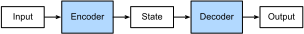

<!-- ===================== Bắt đầu dịch Phần 1 ==================== -->
<!-- ========================================= REVISE - BẮT ĐẦU =================================== -->

<!--
# Encoder-Decoder Architecture
-->

# Kiến trúc Mã hoá - Giải mã

<!--
The *encoder-decoder architecture* is a neural network design pattern.
As shown in :numref:`fig_encoder_decoder`, the architecture is partitioned into two parts, the encoder and the decoder.
The encoder's role is to encode the inputs into state, which often contains several tensors.
Then the state is passed into the decoder to generate the outputs.
In machine translation, the encoder transforms a source sentence, e.g., "Hello world.", into state, e.g., a vector, that captures its semantic information.
The decoder then uses this state to generate the translated target sentence, e.g., "Bonjour le monde.".
-->

*Kiến trúc mã hoá - giải mã* là một khuôn mẫu thiết kế mạng nơ-ron.
Như trình bày trong :numref:`fig_encoder_decoder`, kiến trúc này có 2 phần: bộ mã hoá và bộ giải mã.
Bộ mã hoá đóng vai trò mã hoá đầu vào thành trạng thái, trạng thái thường chứa vài tensor.
Tiếp đó, trạng thái được truyền vào bộ giải mã để sinh đầu ra.
Trong dịch máy, bộ mã hoá biến đổi một câu nguồn, ví dụ như "Hello world.", thành trạng thái, chẳng hạn là một vector, mà có thể nắm bắt được thông tin ngữ nghĩa của câu đó.
Sau đó bộ giải mã sử dụng trạng thái này để dịch câu sang ngôn ngữ đích, ví dụ sang tiếng Pháp "Bonjour le monde.".
<!--

-->


:label:`fig_encoder_decoder`

<!--
In this section, we will show an interface to implement this encoder-decoder architecture.
-->

Trong phần này, chúng tô sẽ trình bày cách để thực hiện kiến trúc mã hoá - giải mã.


<!--
## Encoder
-->

## Bộ mã hoá

<!--
The encoder is a normal neural network that takes inputs, e.g., a source sentence, to return outputs.
-->

Bộ mã hoá là một mạng nơ-ron thông thường nhận đầu vào, ví dụ như một câu nguồn, để trả về đầu ra.

```{.python .input  n=2}
from mxnet.gluon import nn

# Saved in the d2l package for later use
class Encoder(nn.Block):
    """The base encoder interface for the encoder-decoder architecture."""
    def __init__(self, **kwargs):
        super(Encoder, self).__init__(**kwargs)

    def forward(self, X, *args):
        raise NotImplementedError
```

<!--
## Decoder
-->

## Bộ giải mã

<!--
The decoder has an additional method `init_state` to parse the outputs of the encoder with possible additional information,
e.g., the valid lengths of inputs, to return the state it needs.
In the forward method, the decoder takes both inputs, e.g., a target sentence and the state.
It returns outputs, with potentially modified state if the encoder contains RNN layers.
-->

Bộ giải mã có một phương thức bổ sung gọi là `init_state` nhằm phân tích đầu ra của bộ mã hoá với những thông tin có thể được bổ sung, ví dụ như độ dài cho phép của đầu vào, để đưa ra trạng thái mà nó cần.
Trong lan truyền xuôi, bộ giải mã nhận hai đầu vào, ví dụ như một câu đích và trạng thái.
Nó trả về đầu ra với trạng thái có khả năng đã được thay đổi nếu bộ mã hoá chứa các tầng nơ-ron truy hồi (*RNN*).


```{.python .input  n=3}
# Saved in the d2l package for later use
class Decoder(nn.Block):
    """The base decoder interface for the encoder-decoder architecture."""
    def __init__(self, **kwargs):
        super(Decoder, self).__init__(**kwargs)

    def init_state(self, enc_outputs, *args):
        raise NotImplementedError

    def forward(self, X, state):
        raise NotImplementedError
```

<!-- ===================== Kết thúc dịch Phần 1 ===================== -->

<!-- ===================== Bắt đầu dịch Phần 2 ===================== -->

<!--
## Model
-->

## *dịch tiêu đề phía trên*

<!--
The encoder-decoder model contains both an encoder and a decoder.
We implement its forward method for training.
It takes both encoder inputs and decoder inputs, with optional additional arguments.
During computation, it first computes encoder outputs to initialize the decoder state, and then returns the decoder outputs.
-->

*dịch đoạn phía trên*


```{.python .input  n=4}
# Saved in the d2l package for later use
class EncoderDecoder(nn.Block):
    """The base class for the encoder-decoder architecture."""
    def __init__(self, encoder, decoder, **kwargs):
        super(EncoderDecoder, self).__init__(**kwargs)
        self.encoder = encoder
        self.decoder = decoder

    def forward(self, enc_X, dec_X, *args):
        enc_outputs = self.encoder(enc_X, *args)
        dec_state = self.decoder.init_state(enc_outputs, *args)
        return self.decoder(dec_X, dec_state)
```

<!--
## Summary
-->

## *dịch tiêu đề phía trên*

<!--
* An encoder-decoder architecture is a neural network design pattern mainly in natural language processing.
* An encoder is a network (FC, CNN, RNN, etc.) that takes the input, and outputs a feature map, a vector or a tensor.
* An decoder is a network (usually the same network structure as encoder) that takes the feature vector from the encoder, and gives the best closest match to the actual input or intended output.
-->

*dịch đoạn phía trên*


<!--
## Exercises
-->

## *dịch tiêu đề phía trên*

<!--
1. Besides machine translation, can you think of another application scenarios where an encoder-decoder architecture can fit?
2. Can you design a deep encoder-decoder architecture?
-->

*dịch đoạn phía trên*

<!-- ===================== Kết thúc dịch Phần 2 ===================== -->
<!-- ========================================= REVISE - KẾT THÚC ===================================-->


## Thảo luận
* [Tiếng Anh](https://discuss.mxnet.io/t/2393)
* [Tiếng Việt](https://forum.machinelearningcoban.com/c/d2l)

## Những người thực hiện
Bản dịch trong trang này được thực hiện bởi:
<!--
Tác giả của mỗi Pull Request điền tên mình và tên những người review mà bạn thấy
hữu ích vào từng phần tương ứng. Mỗi dòng một tên, bắt đầu bằng dấu `*`.

Lưu ý:
* Nếu reviewer không cung cấp tên, bạn có thể dùng tên tài khoản GitHub của họ
với dấu `@` ở đầu. Ví dụ: @aivivn.

* Tên đầy đủ của các reviewer có thể được tìm thấy tại https://github.com/aivivn/d2l-vn/blob/master/docs/contributors_info.md
-->

* Đoàn Võ Duy Thanh
<!-- Phần 1 -->
* Nguyễn Thanh Hoà

<!-- Phần 2 -->
*
