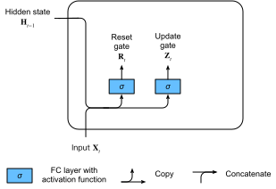

# Các đơn vị định kỳ cổng (GRU)
:label:`sec_gru`

Trong :numref:`sec_bptt`, chúng tôi đã thảo luận về cách tính độ dốc trong RNNs. Đặc biệt, chúng tôi thấy rằng các sản phẩm dài của ma trận có thể dẫn đến biến mất hoặc bùng nổ gradient. Chúng ta hãy suy nghĩ ngắn gọn về những bất thường gradient như vậy có nghĩa là gì trong thực tế: 

* Chúng ta có thể gặp phải một tình huống mà một quan sát sớm là rất quan trọng để dự đoán tất cả các quan sát trong tương lai. Hãy xem xét trường hợp hơi contrived trong đó quan sát đầu tiên chứa một tổng kiểm tra và mục tiêu là để phân biệt xem tổng kiểm tra có đúng ở cuối chuỗi hay không. Trong trường hợp này, ảnh hưởng của mã thông báo đầu tiên là rất quan trọng. Chúng tôi muốn có một số cơ chế để lưu trữ thông tin ban đầu quan trọng trong một tế bào bộ nhớ*. Không có cơ chế như vậy, chúng ta sẽ phải gán một gradient rất lớn cho quan sát này, vì nó ảnh hưởng đến tất cả các quan sát tiếp theo.
* Chúng ta có thể gặp phải những tình huống mà một số token không có quan sát thích hợp. Ví dụ, khi phân tích một trang web có thể có mã HTML phụ trợ không liên quan với mục đích đánh giá tình cảm được truyền tải trên trang. Chúng tôi muốn có một số cơ chế để * bỏ qua* token như vậy trong đại diện trạng thái tiềm ẩn.
* Chúng ta có thể gặp phải các tình huống trong đó có một sự phá vỡ logic giữa các phần của một chuỗi. Ví dụ, có thể có sự chuyển đổi giữa các chương trong một cuốn sách hoặc chuyển đổi giữa một con gấu và thị trường tăng giá cho chứng khoán. Trong trường hợp này, thật tuyệt khi có một phương tiện * đặt lại* đại diện trạng thái nội bộ của chúng tôi.

Một số phương pháp đã được đề xuất để giải quyết vấn đề này. Một trong những sớm nhất là bộ nhớ ngắn hạn dài :cite:`Hochreiter.Schmidhuber.1997` mà chúng ta sẽ thảo luận trong :numref:`sec_lstm`. Đơn vị định kỳ gated (GRU) :cite:`Cho.Van-Merrienboer.Bahdanau.ea.2014` là một biến thể sắp xếp hợp lý hơn một chút thường cung cấp hiệu suất tương đương và nhanh hơn đáng kể để tính toán :cite:`Chung.Gulcehre.Cho.ea.2014`. Do sự đơn giản của nó, chúng ta hãy bắt đầu với GRU. 

## Nhà nước ẩn Gated

Sự khác biệt chính giữa vanilla RNNs và Grus là hỗ trợ sau này gating của trạng thái ẩn. Điều này có nghĩa là chúng ta có các cơ chế dành riêng cho khi một trạng thái ẩn nên được * cập nhật* và cả khi nó nên được * reset*. Những cơ chế này được học và chúng giải quyết các mối quan tâm được liệt kê ở trên. Ví dụ, nếu token đầu tiên có tầm quan trọng lớn, chúng ta sẽ học cách không cập nhật trạng thái ẩn sau lần quan sát đầu tiên. Tương tự như vậy, chúng ta sẽ học cách bỏ qua các quan sát tạm thời không liên quan. Cuối cùng, chúng ta sẽ học cách đặt lại trạng thái tiềm ẩn bất cứ khi nào cần thiết. Chúng tôi thảo luận chi tiết về điều này dưới đây. 

### Cổng đặt lại và cổng cập nhật

Điều đầu tiên chúng ta cần giới thiệu là cổng *reset * và cổng cập nhật*. Chúng tôi kỹ sư chúng trở thành vectơ với các mục trong $(0, 1)$ sao cho chúng tôi có thể thực hiện các kết hợp lồi. Ví dụ, một cổng đặt lại sẽ cho phép chúng ta kiểm soát số lượng trạng thái trước đó mà chúng ta vẫn có thể muốn nhớ. Tương tự như vậy, một cổng cập nhật sẽ cho phép chúng ta kiểm soát bao nhiêu trạng thái mới chỉ là một bản sao của trạng thái cũ. 

Chúng tôi bắt đầu bằng kỹ thuật các cổng này. :numref:`fig_gru_1` minh họa các đầu vào cho cả cổng đặt lại và cập nhật trong GRU, với đầu vào của bước thời gian hiện tại và trạng thái ẩn của bước thời gian trước đó. Các đầu ra của hai cổng được đưa ra bởi hai lớp được kết nối hoàn toàn với chức năng kích hoạt sigmoid. 


:label:`fig_gru_1`

Về mặt toán học, cho một bước thời gian nhất định $t$, giả sử rằng đầu vào là một minibatch $\mathbf{X}_t \in \mathbb{R}^{n \times d}$ (số ví dụ: $n$, số lượng đầu vào: $d$) và trạng thái ẩn của bước thời gian trước đó là $\mathbf{H}_{t-1} \in \mathbb{R}^{n \times h}$ (số đơn vị ẩn: $h$). Sau đó, cổng đặt lại $\mathbf{R}_t \in \mathbb{R}^{n \times h}$ và cổng cập nhật $\mathbf{Z}_t \in \mathbb{R}^{n \times h}$ được tính như sau: 

$$
\begin{aligned}
\mathbf{R}_t = \sigma(\mathbf{X}_t \mathbf{W}_{xr} + \mathbf{H}_{t-1} \mathbf{W}_{hr} + \mathbf{b}_r),\\
\mathbf{Z}_t = \sigma(\mathbf{X}_t \mathbf{W}_{xz} + \mathbf{H}_{t-1} \mathbf{W}_{hz} + \mathbf{b}_z),
\end{aligned}
$$

trong đó $\mathbf{W}_{xr}, \mathbf{W}_{xz} \in \mathbb{R}^{d \times h}$ và $\mathbf{W}_{hr}, \mathbf{W}_{hz} \in \mathbb{R}^{h \times h}$ là các thông số trọng lượng và $\mathbf{b}_r, \mathbf{b}_z \in \mathbb{R}^{1 \times h}$ là thiên vị. Lưu ý rằng phát sóng (xem :numref:`subsec_broadcasting`) được kích hoạt trong quá trình tổng kết. Chúng tôi sử dụng các hàm sigmoid (như được giới thiệu trong :numref:`sec_mlp`) để chuyển đổi các giá trị đầu vào thành khoảng $(0, 1)$. 

### Ứng viên Hidden State

Tiếp theo, chúng ta hãy tích hợp cổng đặt lại $\mathbf{R}_t$ với cơ chế cập nhật trạng thái tiềm ẩn thông thường trong :eqref:`rnn_h_with_state`. Nó dẫn đến những điều sau đây
*trạng thái ẩn ứng cử viên *
$\tilde{\mathbf{H}}_t \in \mathbb{R}^{n \times h}$ tại bước thời gian $t$: 

$$\tilde{\mathbf{H}}_t = \tanh(\mathbf{X}_t \mathbf{W}_{xh} + \left(\mathbf{R}_t \odot \mathbf{H}_{t-1}\right) \mathbf{W}_{hh} + \mathbf{b}_h),$$
:eqlabel:`gru_tilde_H`

trong đó $\mathbf{W}_{xh} \in \mathbb{R}^{d \times h}$ và $\mathbf{W}_{hh} \in \mathbb{R}^{h \times h}$ là các thông số trọng lượng, $\mathbf{b}_h \in \mathbb{R}^{1 \times h}$ là thiên vị và ký hiệu $\odot$ là nhà điều hành sản phẩm Hadamard (elementwise). Ở đây chúng ta sử dụng một phi tuyến dưới dạng tanh để đảm bảo rằng các giá trị trong trạng thái ẩn ứng viên vẫn còn trong khoảng $(-1, 1)$. 

Kết quả là *ứng cử viên* vì chúng ta vẫn cần kết hợp hành động của cổng cập nhật. So sánh với :eqref:`rnn_h_with_state`, bây giờ ảnh hưởng của các trạng thái trước đó có thể được giảm với phép nhân elementwise $\mathbf{R}_t$ và $\mathbf{H}_{t-1}$ trong :eqref:`gru_tilde_H`. Bất cứ khi nào các mục trong cổng đặt lại $\mathbf{R}_t$ gần 1, chúng tôi phục hồi một RNN vani như trong :eqref:`rnn_h_with_state`. Đối với tất cả các mục của cổng đặt lại $\mathbf{R}_t$ gần 0, trạng thái ẩn ứng cử viên là kết quả của MLP với $\mathbf{X}_t$ làm đầu vào. Do đó, bất kỳ trạng thái ẩn đã tồn tại trước nào là * đặt lại* thành mặc định. 

:numref:`fig_gru_2` minh họa dòng tính toán sau khi áp dụng cổng đặt lại. 


:label:`fig_gru_2`

### Nhà nước ẩn

Cuối cùng, chúng ta cần kết hợp hiệu ứng của cổng cập nhật $\mathbf{Z}_t$. Điều này xác định mức độ mà trạng thái ẩn mới $\mathbf{H}_t \in \mathbb{R}^{n \times h}$ chỉ là trạng thái cũ $\mathbf{H}_{t-1}$ và bằng cách sử dụng nhà nước ứng cử viên mới $\tilde{\mathbf{H}}_t$. Cổng cập nhật $\mathbf{Z}_t$ có thể được sử dụng cho mục đích này, đơn giản bằng cách dùng kết hợp lồi elementwise giữa cả $\mathbf{H}_{t-1}$ và $\tilde{\mathbf{H}}_t$. Điều này dẫn đến phương trình cập nhật cuối cùng cho GRU: 

$$\mathbf{H}_t = \mathbf{Z}_t \odot \mathbf{H}_{t-1}  + (1 - \mathbf{Z}_t) \odot \tilde{\mathbf{H}}_t.$$

Bất cứ khi nào cổng cập nhật $\mathbf{Z}_t$ gần 1, chúng tôi chỉ đơn giản là giữ lại trạng thái cũ. Trong trường hợp này, thông tin từ $\mathbf{X}_t$ về cơ bản bị bỏ qua, có hiệu quả bỏ qua bước thời gian $t$ trong chuỗi phụ thuộc. Ngược lại, bất cứ khi nào $\mathbf{Z}_t$ gần 0, trạng thái tiềm ẩn mới $\mathbf{H}_t$ tiếp cận trạng thái tiềm ẩn ứng cử viên $\tilde{\mathbf{H}}_t$. Những thiết kế này có thể giúp chúng ta đối phó với vấn đề gradient biến mất trong RNNs và nắm bắt các phụ thuộc tốt hơn cho các chuỗi với khoảng cách bước thời gian lớn. Ví dụ, nếu cổng cập nhật đã gần 1 cho tất cả các bước thời gian của toàn bộ dãy con, trạng thái ẩn cũ tại bước thời gian bắt đầu của nó sẽ dễ dàng được giữ lại và truyền đến cuối của nó, bất kể độ dài của dãy con. 

:numref:`fig_gru_3` minh họa luồng tính toán sau khi cổng cập nhật đang hoạt động. 


:label:`fig_gru_3`

Tóm lại, Grus có hai đặc điểm phân biệt sau: 

* Đặt lại cổng giúp nắm bắt các phụ thuộc ngắn hạn trong chuỗi.
* Cập nhật cổng giúp nắm bắt các phụ thuộc dài hạn trong chuỗi.

## Thực hiện từ đầu

Để hiểu rõ hơn về mô hình GRU, chúng ta hãy thực hiện nó từ đầu. Chúng tôi bắt đầu bằng cách đọc tập dữ liệu máy thời gian mà chúng tôi đã sử dụng trong :numref:`sec_rnn_scratch`. Mã để đọc tập dữ liệu được đưa ra dưới đây.

```{.python .input}
from d2l import mxnet as d2l
from mxnet import np, npx
from mxnet.gluon import rnn
npx.set_np()

batch_size, num_steps = 32, 35
train_iter, vocab = d2l.load_data_time_machine(batch_size, num_steps)
```

```{.python .input}
#@tab pytorch
from d2l import torch as d2l
import torch
from torch import nn

batch_size, num_steps = 32, 35
train_iter, vocab = d2l.load_data_time_machine(batch_size, num_steps)
```

```{.python .input}
#@tab tensorflow
from d2l import tensorflow as d2l
import tensorflow as tf

batch_size, num_steps = 32, 35
train_iter, vocab = d2l.load_data_time_machine(batch_size, num_steps)
```

### (** Initializing Model Parameters**)

Bước tiếp theo là khởi tạo các tham số mô hình. Chúng tôi vẽ các trọng lượng từ phân phối Gaussian với độ lệch chuẩn là 0,01 và đặt thiên vị thành 0. Siêu tham số `num_hiddens` xác định số đơn vị ẩn. Chúng tôi khởi tạo tất cả các trọng lượng và thành kiến liên quan đến cổng cập nhật, cổng đặt lại, trạng thái ẩn ứng cử viên và lớp đầu ra.

```{.python .input}
def get_params(vocab_size, num_hiddens, device):
    num_inputs = num_outputs = vocab_size

    def normal(shape):
        return np.random.normal(scale=0.01, size=shape, ctx=device)

    def three():
        return (normal((num_inputs, num_hiddens)),
                normal((num_hiddens, num_hiddens)),
                np.zeros(num_hiddens, ctx=device))

    W_xz, W_hz, b_z = three()  # Update gate parameters
    W_xr, W_hr, b_r = three()  # Reset gate parameters
    W_xh, W_hh, b_h = three()  # Candidate hidden state parameters
    # Output layer parameters
    W_hq = normal((num_hiddens, num_outputs))
    b_q = np.zeros(num_outputs, ctx=device)
    # Attach gradients
    params = [W_xz, W_hz, b_z, W_xr, W_hr, b_r, W_xh, W_hh, b_h, W_hq, b_q]
    for param in params:
        param.attach_grad()
    return params
```

```{.python .input}
#@tab pytorch
def get_params(vocab_size, num_hiddens, device):
    num_inputs = num_outputs = vocab_size

    def normal(shape):
        return torch.randn(size=shape, device=device)*0.01

    def three():
        return (normal((num_inputs, num_hiddens)),
                normal((num_hiddens, num_hiddens)),
                d2l.zeros(num_hiddens, device=device))

    W_xz, W_hz, b_z = three()  # Update gate parameters
    W_xr, W_hr, b_r = three()  # Reset gate parameters
    W_xh, W_hh, b_h = three()  # Candidate hidden state parameters
    # Output layer parameters
    W_hq = normal((num_hiddens, num_outputs))
    b_q = d2l.zeros(num_outputs, device=device)
    # Attach gradients
    params = [W_xz, W_hz, b_z, W_xr, W_hr, b_r, W_xh, W_hh, b_h, W_hq, b_q]
    for param in params:
        param.requires_grad_(True)
    return params
```

```{.python .input}
#@tab tensorflow
def get_params(vocab_size, num_hiddens):
    num_inputs = num_outputs = vocab_size

    def normal(shape):
        return d2l.normal(shape=shape,stddev=0.01,mean=0,dtype=tf.float32)

    def three():
        return (tf.Variable(normal((num_inputs, num_hiddens)), dtype=tf.float32),
                tf.Variable(normal((num_hiddens, num_hiddens)), dtype=tf.float32),
                tf.Variable(d2l.zeros(num_hiddens), dtype=tf.float32))

    W_xz, W_hz, b_z = three()  # Update gate parameters
    W_xr, W_hr, b_r = three()  # Reset gate parameters
    W_xh, W_hh, b_h = three()  # Candidate hidden state parameters
    # Output layer parameters
    W_hq = tf.Variable(normal((num_hiddens, num_outputs)), dtype=tf.float32)
    b_q = tf.Variable(d2l.zeros(num_outputs), dtype=tf.float32)
    params = [W_xz, W_hz, b_z, W_xr, W_hr, b_r, W_xh, W_hh, b_h, W_hq, b_q]
    return params
```

### Xác định mô hình

Bây giờ chúng ta sẽ định nghĩa [**chức năng khởi tạo trạng thái ẩn **] `init_gru_state`. Cũng giống như hàm `init_rnn_state` được định nghĩa trong :numref:`sec_rnn_scratch`, hàm này trả về một tensor với một hình dạng (kích thước lô, số đơn vị ẩn) có giá trị là tất cả các số không.

```{.python .input}
def init_gru_state(batch_size, num_hiddens, device):
    return (np.zeros(shape=(batch_size, num_hiddens), ctx=device), )
```

```{.python .input}
#@tab pytorch
def init_gru_state(batch_size, num_hiddens, device):
    return (torch.zeros((batch_size, num_hiddens), device=device), )
```

```{.python .input}
#@tab tensorflow
def init_gru_state(batch_size, num_hiddens):
    return (d2l.zeros((batch_size, num_hiddens)), )
```

Bây giờ chúng tôi đã sẵn sàng để [** xác định mô hình GRU**]. Cấu trúc của nó giống như của ô RNN cơ bản, ngoại trừ các phương trình cập nhật phức tạp hơn.

```{.python .input}
def gru(inputs, state, params):
    W_xz, W_hz, b_z, W_xr, W_hr, b_r, W_xh, W_hh, b_h, W_hq, b_q = params
    H, = state
    outputs = []
    for X in inputs:
        Z = npx.sigmoid(np.dot(X, W_xz) + np.dot(H, W_hz) + b_z)
        R = npx.sigmoid(np.dot(X, W_xr) + np.dot(H, W_hr) + b_r)
        H_tilda = np.tanh(np.dot(X, W_xh) + np.dot(R * H, W_hh) + b_h)
        H = Z * H + (1 - Z) * H_tilda
        Y = np.dot(H, W_hq) + b_q
        outputs.append(Y)
    return np.concatenate(outputs, axis=0), (H,)
```

```{.python .input}
#@tab pytorch
def gru(inputs, state, params):
    W_xz, W_hz, b_z, W_xr, W_hr, b_r, W_xh, W_hh, b_h, W_hq, b_q = params
    H, = state
    outputs = []
    for X in inputs:
        Z = torch.sigmoid((X @ W_xz) + (H @ W_hz) + b_z)
        R = torch.sigmoid((X @ W_xr) + (H @ W_hr) + b_r)
        H_tilda = torch.tanh((X @ W_xh) + ((R * H) @ W_hh) + b_h)
        H = Z * H + (1 - Z) * H_tilda
        Y = H @ W_hq + b_q
        outputs.append(Y)
    return torch.cat(outputs, dim=0), (H,)
```

```{.python .input}
#@tab tensorflow
def gru(inputs, state, params):
    W_xz, W_hz, b_z, W_xr, W_hr, b_r, W_xh, W_hh, b_h, W_hq, b_q = params
    H, = state
    outputs = []
    for X in inputs:
        X = tf.reshape(X,[-1,W_xh.shape[0]])
        Z = tf.sigmoid(tf.matmul(X, W_xz) + tf.matmul(H, W_hz) + b_z)
        R = tf.sigmoid(tf.matmul(X, W_xr) + tf.matmul(H, W_hr) + b_r)
        H_tilda = tf.tanh(tf.matmul(X, W_xh) + tf.matmul(R * H, W_hh) + b_h)
        H = Z * H + (1 - Z) * H_tilda
        Y = tf.matmul(H, W_hq) + b_q
        outputs.append(Y)
    return tf.concat(outputs, axis=0), (H,)
```

### Đào tạo và dự đoán

[**Đào tạo**] và dự đoán hoạt động theo cách chính xác giống như trong :numref:`sec_rnn_scratch`. Sau khi đào tạo, chúng tôi in ra sự bối rối trên bộ đào tạo và trình tự dự đoán theo các tiền tố được cung cấp “khách du lịch thời gian” và “khách du lịch”, tương ứng.

```{.python .input}
#@tab mxnet, pytorch
vocab_size, num_hiddens, device = len(vocab), 256, d2l.try_gpu()
num_epochs, lr = 500, 1
model = d2l.RNNModelScratch(len(vocab), num_hiddens, device, get_params,
                            init_gru_state, gru)
d2l.train_ch8(model, train_iter, vocab, lr, num_epochs, device)
```

```{.python .input}
#@tab tensorflow
vocab_size, num_hiddens, device_name = len(vocab), 256, d2l.try_gpu()._device_name
# defining tensorflow training strategy
strategy = tf.distribute.OneDeviceStrategy(device_name)
num_epochs, lr = 500, 1
with strategy.scope():
    model = d2l.RNNModelScratch(len(vocab), num_hiddens, init_gru_state, gru, get_params)

d2l.train_ch8(model, train_iter, vocab, lr, num_epochs, strategy)
```

## [**Thiết tập**]

Trong các API cấp cao, chúng ta có thể trực tiếp khởi tạo mô hình GPU. Điều này đóng gói tất cả các chi tiết cấu hình mà chúng tôi đã thực hiện rõ ràng ở trên. Mã này nhanh hơn đáng kể vì nó sử dụng các toán tử được biên dịch hơn là Python cho nhiều chi tiết mà chúng tôi đã nêu ra trước đó.

```{.python .input}
gru_layer = rnn.GRU(num_hiddens)
model = d2l.RNNModel(gru_layer, len(vocab))
d2l.train_ch8(model, train_iter, vocab, lr, num_epochs, device)
```

```{.python .input}
#@tab pytorch
num_inputs = vocab_size
gru_layer = nn.GRU(num_inputs, num_hiddens)
model = d2l.RNNModel(gru_layer, len(vocab))
model = model.to(device)
d2l.train_ch8(model, train_iter, vocab, lr, num_epochs, device)
```

```{.python .input}
#@tab tensorflow
gru_cell = tf.keras.layers.GRUCell(num_hiddens,
    kernel_initializer='glorot_uniform')
gru_layer = tf.keras.layers.RNN(gru_cell, time_major=True,
    return_sequences=True, return_state=True)

device_name = d2l.try_gpu()._device_name
strategy = tf.distribute.OneDeviceStrategy(device_name)
with strategy.scope():
    model = d2l.RNNModel(gru_layer, vocab_size=len(vocab))

d2l.train_ch8(model, train_iter, vocab, lr, num_epochs, strategy)
```

## Tóm tắt

* Các RNN có cổng có thể nắm bắt các phụ thuộc tốt hơn cho các trình tự với khoảng cách bước thời gian lớn.
* Đặt lại cổng giúp nắm bắt các phụ thuộc ngắn hạn trong chuỗi.
* Cập nhật cổng giúp nắm bắt các phụ thuộc dài hạn trong chuỗi.
* Grus chứa RNN cơ bản làm trường hợp cực đoan của chúng bất cứ khi nào cổng đặt lại được bật. Họ cũng có thể bỏ qua dãy con bằng cách bật cổng cập nhật.

## Bài tập

1. Giả sử rằng chúng ta chỉ muốn sử dụng đầu vào tại bước thời gian $t'$ để dự đoán đầu ra tại bước thời gian $t > t'$. Các giá trị tốt nhất cho các thiết lập lại và cập nhật cổng cho mỗi bước thời gian là gì?
1. Điều chỉnh các siêu tham số và phân tích ảnh hưởng của chúng đối với thời gian chạy, bối rối và trình tự đầu ra.
1. So sánh thời gian chạy, bối rối và các chuỗi đầu ra cho `rnn.RNN` và `rnn.GRU` triển khai với nhau.
1. Điều gì xảy ra nếu bạn chỉ triển khai các phần của GRU, ví dụ, chỉ với một cổng đặt lại hoặc chỉ một cổng cập nhật?

:begin_tab:`mxnet`
[Discussions](https://discuss.d2l.ai/t/342)
:end_tab:

:begin_tab:`pytorch`
[Discussions](https://discuss.d2l.ai/t/1056)
:end_tab:
