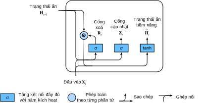
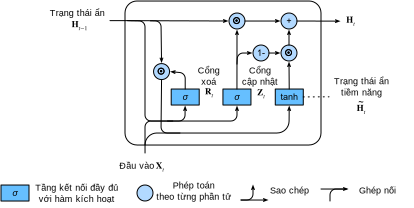

<!-- ===================== Bắt đầu dịch Phần 1 ==================== -->
<!-- ========================================= REVISE PHẦN 1 - BẮT ĐẦU =================================== -->

<!--
# Gated Recurrent Units (GRU)
-->

# *dịch tiêu đề phía trên*
:label:`sec_gru`

<!--
In the previous section, we discussed how gradients are calculated in a recurrent neural network.
In particular we found that long products of matrices can lead to vanishing or divergent gradients.
Let us briefly think about what such gradient anomalies mean in practice:
-->

Trong phần trước, chúng ta đã thảo luận về cách gradient được tính toán trong mạng nơ-ron truy hồi.
Cụ thể đã phát hiện được rằng những tích dài của các ma trận có thể dẫn đến việc tiêu biến hoặc phân kỳ gradient.
Giờ ta hãy nghĩ vắn tắt về việc những gradient bất thường như vậy có ý nghĩa như thế nào trong thực tế:

<!--
* We might encounter a situation where an early observation is highly significant for predicting all future observations.
Consider the somewhat contrived case where the first observation contains a checksum and the goal is to discern whether the checksum is correct at the end of the sequence.
In this case, the influence of the first token is vital.
We would like to have some mechanisms for storing vital early information in a *memory cell*.
Without such a mechanism, we will have to assign a very large gradient to this observation, since it affects all subsequent observations.
* We might encounter situations where some symbols carry no pertinent observation.
For instance, when parsing a web page there might be auxiliary HTML code that is irrelevant for the purpose of assessing the sentiment conveyed on the page.
We would like to have some mechanism for *skipping such symbols* in the latent state representation.
* We might encounter situations where there is a logical break between parts of a sequence.
For instance, there might be a transition between chapters in a book, or a transition between a bear and a bull market for securities.
In this case it would be nice to have a means of *resetting* our internal state representation.
-->

* Chúng ta có thể gặp phải những tình huống mà những quan sát (bước thời gian) xuất hiện sớm có ảnh hưởng đáng kể đến việc dự doán toàn bộ những quan sát ở tương lai.
Ví dụ, ta có một quan sát đầu tiên chứa checksum và mục tiêu ở đây là phân biệt liệu checksum có đúng hay không tại cuối dãy câu.
Trong trường hợp này, ảnh hưởng của thẻ (token) đầu tiên là tối quan trọng.
Chúng ta muốn có một vài cơ chế cho việc lưu trữ những thông tin ban đầu quan trọng trong *ngăn nhớ*.
Nếu không có cơ thế như vậy, một gradient cực lớn phải được cho quan sát này, vì nó ảnh hưởng đến toàn bộ các quan sát tiếp theo.
* Chúng ta có thể gặp phải những tình huống mà một vài ký hiệu không chứa quan sát phù hợp.
Ví dụ, khi phân tích một trang web, có thể sẽ có những mã HTML phụ trợ không liên quan đến mục tiêu là truyền tải thông tin trên trang web.
Chúng ta sẽ muốn có một số cơ chế để *bỏ qua những ký hiệu như vậy* trong việc biểu diễn trạng thái tiềm ẩn.
* Chúng ta có thể gặp phải những tình huống mà có những khoảng ngắt giữa những các phần của dãy câu.
Ví dụ, có thể sẽ có những đoạn chuyển tiếp giữa các chương của một quyển sách, hay chuyển biến giữa thị trường giá lên và thị trường giá xuống trong chứng khoán.
Trong trường hợp này, sẽ tốt hơn nếu có một phương tiện để đưa biểu diễn trạng thái bên trong *về trạng thái ban đầu (reset)*.

<!--
A number of methods have been proposed to address this.
One of the earliest is Long Short Term Memory (LSTM) :cite:`Hochreiter.Schmidhuber.1997` which we will discuss in :numref:`sec_lstm`.
Gated Recurrent Unit (GRU) :cite:`Cho.Van-Merrienboer.Bahdanau.ea.2014` is a slightly more streamlined variant that often offers comparable performance and is significantly faster to compute.
See also :cite:`Chung.Gulcehre.Cho.ea.2014` for more details.
Due to its simplicity, let us start with the GRU.
-->

Nhiều phương pháp đã được đề xuất để giải quyết những điều này.
Một trong những phương pháp sớm nhất chính là Bộ nhớ ngắn hạn dài (Long Short Term Memory - LSTM) :cite:`Hochreiter.Schmidhuber.1997`, sẽ được thảo luận ở :numref:`sec_lstm`.
Đơn vị hồi quy có cổng (Gated Recurrent Unit - GRU) :cite:`Cho.Van-Merrienboer.Bahdanau.ea.2014` là một biến thể của LSTM, được tổ chức hợp lý hơn một chút, thường mang lại hiệu quả tương đương và có thể tính toán nhanh hơn đáng kể.
Xem :cite:`Chung.Gulcehre.Cho.ea.2014` để biết thêm chi tiết.
Do GRU đơn giản hơn nên chúng ta sẽ bắt đầu với nó trước.

<!-- ===================== Kết thúc dịch Phần 1 ===================== -->

<!-- ===================== Bắt đầu dịch Phần 2 ===================== -->

<!--
## Gating the Hidden State
-->

## *dịch tiêu đề phía trên*

<!--
The key distinction between regular RNNs and GRUs is that the latter support gating of the hidden state.
This means that we have dedicated mechanisms for when a hidden state should be updated and also when it should be reset.
These mechanisms are learned and they address the concerns listed above.
For instance, if the first symbol is of great importance we will learn not to update the hidden state after the first observation.
Likewise, we will learn to skip irrelevant temporary observations.
Last, we will learn to reset the latent state whenever needed.
We discuss this in detail below.
-->

*dịch đoạn phía trên*

<!--
### Reset Gates and Update Gates
-->

### *dịch tiêu đề phía trên*

<!--
The first thing we need to introduce are reset and update gates.
We engineer them to be vectors with entries in $(0, 1)$ such that we can perform convex combinations.
For instance, a reset variable would allow us to control how much of the previous state we might still want to remember.
Likewise, an update variable would allow us to control how much of the new state is just a copy of the old state.
-->

*dịch đoạn phía trên*

<!--
We begin by engineering gates to generate these variables.
:numref:`fig_gru_1` illustrates the inputs for both reset and update gates in a GRU, given the current timestep input $\mathbf{X}_t$ and the hidden state of the previous timestep $\mathbf{H}_{t-1}$.
The output is given by a fully connected layer with a sigmoid as its activation function.
-->

*dịch đoạn phía trên*

<!--

-->


:label:`fig_gru_1`


<!--
For a given timestep $t$, the minibatch input is $\mathbf{X}_t \in \mathbb{R}^{n \times d}$ (number of examples: $n$, number of inputs: $d$) 
and the hidden state of the last timestep is $\mathbf{H}_{t-1} \in \mathbb{R}^{n \times h}$ (number of hidden states: $h$).
Then, the reset gate $\mathbf{R}_t \in \mathbb{R}^{n \times h}$ and update gate $\mathbf{Z}_t \in \mathbb{R}^{n \times h}$ are computed as follows:
-->

*dịch đoạn phía trên*


$$
\begin{aligned}
\mathbf{R}_t = \sigma(\mathbf{X}_t \mathbf{W}_{xr} + \mathbf{H}_{t-1} \mathbf{W}_{hr} + \mathbf{b}_r),\\
\mathbf{Z}_t = \sigma(\mathbf{X}_t \mathbf{W}_{xz} + \mathbf{H}_{t-1} \mathbf{W}_{hz} + \mathbf{b}_z).
\end{aligned}
$$


<!--
Here, $\mathbf{W}_{xr}, \mathbf{W}_{xz} \in \mathbb{R}^{d \times h}$ and
$\mathbf{W}_{hr}, \mathbf{W}_{hz} \in \mathbb{R}^{h \times h}$ are weight parameters 
and $\mathbf{b}_r, \mathbf{b}_z \in \mathbb{R}^{1 \times h}$ are biases.
We use a sigmoid function (as introduced in :numref:`sec_mlp`) to transform input values to the interval $(0, 1)$.
-->

*dịch đoạn phía trên*

<!-- ===================== Kết thúc dịch Phần 2 ===================== -->

<!-- ===================== Bắt đầu dịch Phần 3 ===================== -->

<!--
### Reset Gates in Action
-->

### *dịch tiêu đề phía trên*

<!--
We begin by integrating the reset gate with a regular latent state updating mechanism.
In a conventional RNN, we would have an hidden state update of the form
-->

*dịch đoạn phía trên*


$$\mathbf{H}_t = \tanh(\mathbf{X}_t \mathbf{W}_{xh} + \mathbf{H}_{t-1}\mathbf{W}_{hh} + \mathbf{b}_h).$$


<!--
This is essentially identical to the discussion of the previous section, albeit with a nonlinearity in the form of $\tanh$ to ensure that the values of the hidden states remain in the interval $(-1, 1)$.
If we want to be able to reduce the influence of the previous states we can multiply $\mathbf{H}_{t-1}$ with $\mathbf{R}_t$ elementwise.
Whenever the entries in the reset gate $\mathbf{R}_t$ are close to $1$, we recover a conventional RNN.
For all entries of the reset gate $\mathbf{R}_t$ that are close to $0$, the hidden state is the result of an MLP with $\mathbf{X}_t$ as input.
Any pre-existing hidden state is thus reset to defaults.
This leads to the following *candidate hidden state* (it is a *candidate* since we still need to incorporate the action of the update gate).
-->

*dịch đoạn phía trên*


$$\tilde{\mathbf{H}}_t = \tanh(\mathbf{X}_t \mathbf{W}_{xh} + \left(\mathbf{R}_t \odot \mathbf{H}_{t-1}\right) \mathbf{W}_{hh} + \mathbf{b}_h).$$


<!--
:numref:`fig_gru_2` illustrates the computational flow after applying the reset gate.
The symbol $\odot$ indicates pointwise multiplication between tensors.
-->

*dịch đoạn phía trên*

<!--

-->


:label:`fig_gru_2`

<!-- ===================== Kết thúc dịch Phần 3 ===================== -->

<!-- ===================== Bắt đầu dịch Phần 4 ===================== -->

<!--
### Update Gates in Action
-->

### *dịch tiêu đề phía trên*

<!--
Next we need to incorporate the effect of the update gate $\mathbf{Z}_t$, as shown in :numref:`fig_gru_3`.
This determines the extent to which the new state $\mathbf{H}_t$ is just the old state $\mathbf{H}_{t-1}$ and by how much the new candidate state $\tilde{\mathbf{H}}_t$ is used.
The gating variable $\mathbf{Z}_t$ can be used for this purpose, simply by taking elementwise convex combinations between both candidates.
This leads to the final update equation for the GRU.
-->

*dịch đoạn phía trên*


$$\mathbf{H}_t = \mathbf{Z}_t \odot \mathbf{H}_{t-1}  + (1 - \mathbf{Z}_t) \odot \tilde{\mathbf{H}}_t.$$


<!--

-->


:label:`fig_gru_3`

<!--
Whenever the update gate $\mathbf{Z}_t$ is close to $1$, we simply retain the old state.
In this case the information from $\mathbf{X}_t$ is essentially ignored, effectively skipping timestep $t$ in the dependency chain.
In contrast, whenever $\mathbf{Z}_t$ is close to $0$, the new latent state $\mathbf{H}_t$ approaches the candidate latent state $\tilde{\mathbf{H}}_t$.
These designs can help us cope with the vanishing gradient problem in RNNs and better capture dependencies for time series with large timestep distances.
In summary, GRUs have the following two distinguishing features:
-->

*dịch đoạn phía trên*

<!--
* Reset gates help capture short-term dependencies in time series.
* Update gates help capture long-term dependencies in time series.
-->

*dịch đoạn phía trên*

<!--
## Implementation from Scratch
-->

## *dịch tiêu đề phía trên*

<!--
To gain a better understanding of the model, let us implement a GRU from scratch.
-->

*dịch đoạn phía trên*

<!-- ===================== Kết thúc dịch Phần 4 ===================== -->

<!-- ===================== Bắt đầu dịch Phần 5 ===================== -->

<!-- ========================================= REVISE PHẦN 1 - KẾT THÚC ===================================-->

<!-- ========================================= REVISE PHẦN 2 - BẮT ĐẦU ===================================-->

<!--
### Reading the Dataset
-->

### *dịch tiêu đề phía trên*

<!--
We begin by reading *The Time Machine* corpus that we used in :numref:`sec_rnn_scratch`.
The code for reading the dataset is given below:
-->

*dịch đoạn phía trên*

```{.python .input  n=1}
import d2l
from mxnet import np, npx
from mxnet.gluon import rnn
npx.set_np()

batch_size, num_steps = 32, 35
train_iter, vocab = d2l.load_data_time_machine(batch_size, num_steps)
```

<!--
### Initializing Model Parameters
-->

### *dịch tiêu đề phía trên*

<!--
The next step is to initialize the model parameters.
We draw the weights from a Gaussian with variance to be $0.01$ and set the bias to $0$.
The hyperparameter `num_hiddens` defines the number of hidden units.
We instantiate all weights and biases relating to the update gate, the reset gate, and the candidate hidden state itself.
Subsequently, we attach gradients to all the parameters.
-->

*dịch đoạn phía trên*


```{.python .input  n=2}
def get_params(vocab_size, num_hiddens, ctx):
    num_inputs = num_outputs = vocab_size

    def normal(shape):
        return np.random.normal(scale=0.01, size=shape, ctx=ctx)

    def three():
        return (normal((num_inputs, num_hiddens)),
                normal((num_hiddens, num_hiddens)),
                np.zeros(num_hiddens, ctx=ctx))

    W_xz, W_hz, b_z = three()  # Update gate parameter
    W_xr, W_hr, b_r = three()  # Reset gate parameter
    W_xh, W_hh, b_h = three()  # Candidate hidden state parameter
    # Output layer parameters
    W_hq = normal((num_hiddens, num_outputs))
    b_q = np.zeros(num_outputs, ctx=ctx)
    # Attach gradients
    params = [W_xz, W_hz, b_z, W_xr, W_hr, b_r, W_xh, W_hh, b_h, W_hq, b_q]
    for param in params:
        param.attach_grad()
    return params
```

<!--
### Defining the Model
-->

### *dịch tiêu đề phía trên*

<!--
Now we will define the hidden state initialization function `init_gru_state`.
Just like the `init_rnn_state` function defined in :numref:`sec_rnn_scratch`, this function returns an `ndarray` with a shape (batch size, number of hidden units) whose values are all zeros.
-->

*dịch đoạn phía trên*


```{.python .input  n=3}
def init_gru_state(batch_size, num_hiddens, ctx):
    return (np.zeros(shape=(batch_size, num_hiddens), ctx=ctx), )
```

<!--
Now we are ready to define the GRU model.
Its structure is the same as the basic RNN cell, except that the update equations are more complex.
-->

*dịch đoạn phía trên*


```{.python .input  n=4}
def gru(inputs, state, params):
    W_xz, W_hz, b_z, W_xr, W_hr, b_r, W_xh, W_hh, b_h, W_hq, b_q = params
    H, = state
    outputs = []
    for X in inputs:
        Z = npx.sigmoid(np.dot(X, W_xz) + np.dot(H, W_hz) + b_z)
        R = npx.sigmoid(np.dot(X, W_xr) + np.dot(H, W_hr) + b_r)
        H_tilda = np.tanh(np.dot(X, W_xh) + np.dot(R * H, W_hh) + b_h)
        H = Z * H + (1 - Z) * H_tilda
        Y = np.dot(H, W_hq) + b_q
        outputs.append(Y)
    return np.concatenate(outputs, axis=0), (H,)
```

<!--
### Training and Prediction
-->

### *dịch tiêu đề phía trên*

<!--
Training and prediction work in exactly the same manner as before.
After training for one epoch, the perplexity and the output sentence will be like the following.
-->

*dịch đoạn phía trên*


```{.python .input  n=3}
vocab_size, num_hiddens, ctx = len(vocab), 256, d2l.try_gpu()
num_epochs, lr = 500, 1
model = d2l.RNNModelScratch(len(vocab), num_hiddens, ctx, get_params,
                            init_gru_state, gru)
d2l.train_ch8(model, train_iter, vocab, lr, num_epochs, ctx)
```

<!-- ===================== Kết thúc dịch Phần 5 ===================== -->

<!-- ===================== Bắt đầu dịch Phần 6 ===================== -->

<!--
## Concise Implementation
-->

## *dịch tiêu đề phía trên*

<!--
In Gluon, we can directly call the `GRU` class in the `rnn` module.
This encapsulates all the configuration detail that we made explicit above.
The code is significantly faster as it uses compiled operators rather than Python for many details that we spelled out in detail before.
-->

*dịch đoạn phía trên*


```{.python .input  n=9}
gru_layer = rnn.GRU(num_hiddens)
model = d2l.RNNModel(gru_layer, len(vocab))
d2l.train_ch8(model, train_iter, vocab, lr, num_epochs, ctx)
```

<!--
## Summary
-->

## Tóm tắt

<!--
* Gated recurrent neural networks are better at capturing dependencies for time series with large timestep distances.
* Reset gates help capture short-term dependencies in time series.
* Update gates help capture long-term dependencies in time series.
* GRUs contain basic RNNs as their extreme case whenever the reset gate is switched on. They can ignore sequences as needed.
-->

*dịch đoạn phía trên*


<!--
## Exercises
-->

## Bài tập

<!--
1. Compare runtime, perplexity, and the output strings for `rnn.RNN` and `rnn.GRU` implementations with each other.
2. Assume that we only want to use the input for timestep $t'$ to predict the output at timestep $t > t'$. What are the best values for the reset and update gates for each timestep?
3. Adjust the hyperparameters and observe and analyze the impact on running time, perplexity, and the written lyrics.
4. What happens if you implement only parts of a GRU? That is, implement a recurrent cell that only has a reset gate. Likewise, implement a recurrent cell only with an update gate.
-->

*dịch đoạn phía trên*

<!-- ===================== Kết thúc dịch Phần 6 ===================== -->
<!-- ========================================= REVISE PHẦN 2 - KẾT THÚC ===================================-->

## Thảo luận
* [Tiếng Anh](https://discuss.mxnet.io/t/2367)
* [Tiếng Việt](https://forum.machinelearningcoban.com/c/d2l)

## Những người thực hiện
Bản dịch trong trang này được thực hiện bởi:
<!--
Tác giả của mỗi Pull Request điền tên mình và tên những người review mà bạn thấy
hữu ích vào từng phần tương ứng. Mỗi dòng một tên, bắt đầu bằng dấu `*`.

Lưu ý:
* Nếu reviewer không cung cấp tên, bạn có thể dùng tên tài khoản GitHub của họ
với dấu `@` ở đầu. Ví dụ: @aivivn.

* Tên đầy đủ của các reviewer có thể được tìm thấy tại https://github.com/aivivn/d2l-vn/blob/master/docs/contributors_info.md
-->

* Đoàn Võ Duy Thanh
<!-- Phần 1 -->
* Võ Tấn Phát

<!-- Phần 2 -->
*

<!-- Phần 3 -->
*

<!-- Phần 4 -->
*

<!-- Phần 5 -->
*

<!-- Phần 6 -->
*
