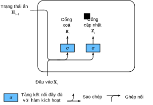

<!-- ===================== Bắt đầu dịch Phần 1 ==================== -->
<!-- ========================================= REVISE PHẦN 1 - BẮT ĐẦU =================================== -->

<!--
# Gated Recurrent Units (GRU)
-->

# Nút Hồi tiếp có Cổng (GRU)
:label:`sec_gru`

<!--
In the previous section, we discussed how gradients are calculated in a recurrent neural network.
In particular we found that long products of matrices can lead to vanishing or divergent gradients.
Let us briefly think about what such gradient anomalies mean in practice:
-->

Trong phần trước, chúng ta đã thảo luận cách tính gradient trong mạng nơ-ron hồi tiếp.
Cụ thể ta đã biết rằng tích của một chuỗi dài các ma trận có thể dẫn đến việc gradient tiêu biến hoặc bùng nổ.
Hãy điểm qua các tình huống thực tế thể hiện rõ hai bất thường đó:

<!--
* We might encounter a situation where an early observation is highly significant for predicting all future observations.
Consider the somewhat contrived case where the first observation contains a checksum and the goal is to discern whether the checksum is correct at the end of the sequence.
In this case, the influence of the first token is vital.
We would like to have some mechanisms for storing vital early information in a *memory cell*.
Without such a mechanism, we will have to assign a very large gradient to this observation, since it affects all subsequent observations.
* We might encounter situations where some symbols carry no pertinent observation.
For instance, when parsing a web page there might be auxiliary HTML code that is irrelevant for the purpose of assessing the sentiment conveyed on the page.
We would like to have some mechanism for *skipping such symbols* in the latent state representation.
* We might encounter situations where there is a logical break between parts of a sequence.
For instance, there might be a transition between chapters in a book, or a transition between a bear and a bull market for securities.
In this case it would be nice to have a means of *resetting* our internal state representation.
-->

* Ta có thể gặp tình huống mà những quan sát xuất hiện sớm có ảnh hưởng lớn đến việc dự đoán toàn bộ những quan sát trong tương lai.
Xét một ví dụ có chút cường điệu, trong đó quan sát đầu tiên chứa giá trị tổng kiểm (_checksum_) và mục tiêu là kiểm tra xem liệu giá trị tổng kiểm đó có đúng hay không tại cuối chuỗi.
Trong trường hợp này, ảnh hưởng của token đầu tiên là tối quan trọng.
Do đó ta muốn có cơ chế để lưu trữ những thông tin quan trọng ban đầu trong *ô nhớ*.
Nếu không, ta sẽ phải gán một giá trị gradient cực lớn cho quan sát ban đầu vì nó ảnh hưởng đến toàn bộ các quan sát tiếp theo.
* Một tình huống khác là khi một vài ký hiệu không chứa thông tin phù hợp.
Ví dụ, khi phân tích một trang web, ta có thể gặp các mã HTML không giúp ích gì cho việc xác định thông tin được truyền tải.
Do đó, ta cũng muốn có cơ chế để *bỏ qua những ký hiệu như vậy* trong các biểu diễn trạng thái tiềm ẩn.
* Ta cũng có thể gặp những khoảng ngắt giữa các phần trong một chuỗi.
Ví dụ như những phần chuyển tiếp giữa các chương của một quyển sách, hay chuyển biến xu hướng giữa thị trường giá lên và thị trường giá xuống trong chứng khoán.
Trong trường hợp này, sẽ tốt hơn nếu có một cách để *xóa* hay *đặt lại* các biểu diễn trạng thái ẩn về giá trị ban đầu.

<!--
A number of methods have been proposed to address this.
One of the earliest is Long Short Term Memory (LSTM) :cite:`Hochreiter.Schmidhuber.1997` which we will discuss in :numref:`sec_lstm`.
Gated Recurrent Unit (GRU) :cite:`Cho.Van-Merrienboer.Bahdanau.ea.2014` is a slightly more streamlined variant that often offers comparable performance and is significantly faster to compute.
See also :cite:`Chung.Gulcehre.Cho.ea.2014` for more details.
Due to its simplicity, let us start with the GRU.
-->

Nhiều phương pháp đã được đề xuất để giải quyết những vấn đề trên.
Một trong những phương pháp ra đời sớm nhất là Bộ nhớ ngắn hạn dài (*Long Short Term Memory - LSTM*) :cite:`Hochreiter.Schmidhuber.1997`, sẽ được thảo luận ở :numref:`sec_lstm`.
Nút Hồi tiếp có Cổng (*Gated Recurrent Unit - GRU*) :cite:`Cho.Van-Merrienboer.Bahdanau.ea.2014` là một biến thể gọn hơn của LSTM, thường có chất lượng tương đương và tính toán nhanh hơn đáng kể.
Tham khảo :cite:`Chung.Gulcehre.Cho.ea.2014` để biết thêm chi tiết.
Trong chương này, ta sẽ bắt đầu với GRU do nó đơn giản hơn.

<!-- ===================== Kết thúc dịch Phần 1 ===================== -->

<!-- ===================== Bắt đầu dịch Phần 2 ===================== -->

<!--
## Gating the Hidden State
-->

## Kiểm soát Trạng thái Ẩn

<!--
The key distinction between regular RNNs and GRUs is that the latter support gating of the hidden state.
This means that we have dedicated mechanisms for when a hidden state should be updated and also when it should be reset.
These mechanisms are learned and they address the concerns listed above.
For instance, if the first symbol is of great importance we will learn not to update the hidden state after the first observation.
Likewise, we will learn to skip irrelevant temporary observations.
Last, we will learn to reset the latent state whenever needed.
We discuss this in detail below.
-->

Sự khác biệt chính giữa RNN thông thường và GRU là GRU hỗ trợ việc kiểm soát trạng thái ẩn.
Điều này có nghĩa là ta có các cơ chế được học để quyết định khi nào nên cập nhật và khi nào nên xóa trạng thái ẩn.
Ví dụ, nếu ký tự đầu tiên có mức độ quan trọng cao, mô hình sẽ học để không cập nhật trạng thái ẩn sau lần quan sát đầu tiên.
Tương tự, mô hình sẽ học cách bỏ qua những quan sát tạm thời không liên quan, cũng như cách xóa trạng thái ẩn khi cần thiết.
Dưới đây ta sẽ thảo luận chi tiết vấn đề này.

<!--
### Reset Gates and Update Gates
-->

### Cổng Xóa và Cổng Cập nhật

<!--
The first thing we need to introduce are reset and update gates.
We engineer them to be vectors with entries in $(0, 1)$ such that we can perform convex combinations.
For instance, a reset variable would allow us to control how much of the previous state we might still want to remember.
Likewise, an update variable would allow us to control how much of the new state is just a copy of the old state.
-->

Đầu tiên ta giới thiệu cổng xóa và cổng cập nhật.
Ta thiết kế chúng thành các vector có các phần tử trong khoảng $(0, 1)$ để có thể biểu diễn các tổ hợp lồi.
Chẳng hạn, một biến xóa cho phép kiểm soát bao nhiêu phần của trạng thái trước đây được giữ lại.
Tương tự, một biến cập nhật cho phép kiểm soát bao nhiêu phần của trạng thái mới sẽ giống trạng thái cũ.

<!--
We begin by engineering gates to generate these variables.
:numref:`fig_gru_1` illustrates the inputs for both reset and update gates in a GRU, given the current timestep input $\mathbf{X}_t$ and the hidden state of the previous timestep $\mathbf{H}_{t-1}$.
The output is given by a fully connected layer with a sigmoid as its activation function.
-->

Ta bắt đầu bằng việc thiết kế các cổng tạo ra các biến này.
:numref:`fig_gru_1` minh họa các đầu vào cho cả cổng xóa và cổng cập nhật trong GRU, với đầu vào ở bước thời gian hiện tại $\mathbf{X}_t$ và trạng thái ẩn ở bước thời gian trước đó $\mathbf{H}_{t-1}$.
Đầu ra được tạo bởi một tầng kết nối đầy đủ với hàm kích hoạt sigmoid.

<!--

-->


:label:`fig_gru_1`


<!--
For a given timestep $t$, the minibatch input is $\mathbf{X}_t \in \mathbb{R}^{n \times d}$ (number of examples: $n$, number of inputs: $d$) 
and the hidden state of the last timestep is $\mathbf{H}_{t-1} \in \mathbb{R}^{n \times h}$ (number of hidden states: $h$).
Then, the reset gate $\mathbf{R}_t \in \mathbb{R}^{n \times h}$ and update gate $\mathbf{Z}_t \in \mathbb{R}^{n \times h}$ are computed as follows:
-->

Tại bước thời gian $t$, với đầu vào minibatch là $\mathbf{X}_t \in \mathbb{R}^{n \times d}$ (số lượng mẫu: $n$, số lượng đầu vào: $d$) và trạng thái ẩn ở bước thời gian gần nhất là $\mathbf{H}_{t-1} \in \mathbb{R}^{n \times h}$ (số lượng trạng thái ẩn: $h$), cổng xóa $\mathbf{R}_t \in \mathbb{R}^{n \times h}$ và cổng cập nhật $\mathbf{Z}_t \in \mathbb{R}^{n \times h}$ được tính như sau:


$$
\begin{aligned}
\mathbf{R}_t = \sigma(\mathbf{X}_t \mathbf{W}_{xr} + \mathbf{H}_{t-1} \mathbf{W}_{hr} + \mathbf{b}_r),\\
\mathbf{Z}_t = \sigma(\mathbf{X}_t \mathbf{W}_{xz} + \mathbf{H}_{t-1} \mathbf{W}_{hz} + \mathbf{b}_z).
\end{aligned}
$$


<!--
Here, $\mathbf{W}_{xr}, \mathbf{W}_{xz} \in \mathbb{R}^{d \times h}$ and
$\mathbf{W}_{hr}, \mathbf{W}_{hz} \in \mathbb{R}^{h \times h}$ are weight parameters 
and $\mathbf{b}_r, \mathbf{b}_z \in \mathbb{R}^{1 \times h}$ are biases.
We use a sigmoid function (as introduced in :numref:`sec_mlp`) to transform input values to the interval $(0, 1)$.
-->

Ở đây, $\mathbf{W}_{xr}, \mathbf{W}_{xz} \in \mathbb{R}^{d \times h}$ và $\mathbf{W}_{hr}, \mathbf{W}_{hz} \in \mathbb{R}^{h \times h}$ là các tham số trọng số và $\mathbf{b}_r, \mathbf{b}_z \in \mathbb{R}^{1 \times h}$ là các hệ số điều chỉnh.
Ta sẽ sử dụng hàm sigmoid (như trong :numref:`sec_mlp`) để biến đổi các giá trị đầu vào nằm trong khoảng $(0, 1)$.

<!-- ===================== Kết thúc dịch Phần 2 ===================== -->

<!-- ===================== Bắt đầu dịch Phần 3 ===================== -->

<!--
### Reset Gates in Action
-->

### Hoạt động của Cổng Xóa

<!--
We begin by integrating the reset gate with a regular latent state updating mechanism.
In a conventional RNN, we would have an hidden state update of the form
-->

Ta bắt đầu bằng việc tích hợp cổng xóa với một cơ chế cập nhật trạng thái tiềm ẩn thông thường.
Trong RNN thông thường, ta cập nhật trạng thái ẩn theo công thức


$$\mathbf{H}_t = \tanh(\mathbf{X}_t \mathbf{W}_{xh} + \mathbf{H}_{t-1}\mathbf{W}_{hh} + \mathbf{b}_h).$$


<!--
This is essentially identical to the discussion of the previous section, albeit with a nonlinearity in the form of $\tanh$ to ensure that the values of the hidden states remain in the interval $(-1, 1)$.
If we want to be able to reduce the influence of the previous states we can multiply $\mathbf{H}_{t-1}$ with $\mathbf{R}_t$ elementwise.
Whenever the entries in the reset gate $\mathbf{R}_t$ are close to $1$, we recover a conventional RNN.
For all entries of the reset gate $\mathbf{R}_t$ that are close to $0$, the hidden state is the result of an MLP with $\mathbf{X}_t$ as input.
Any pre-existing hidden state is thus reset to defaults.
This leads to the following *candidate hidden state* (it is a *candidate* since we still need to incorporate the action of the update gate).
-->

Điều này về cơ bản giống với những gì đã thảo luận ở phần trước, mặc dù có thêm tính phi tuyến dưới dạng hàm $\tanh$ để đảm bảo rằng các giá trị trạng thái ẩn nằm trong khoảng $(-1, 1)$.
Nếu muốn giảm ảnh hưởng của các trạng thái trước đó, ta có thể nhân $\mathbf{H}_{t-1}$ với $\mathbf{R}_t$ theo từng phần tử.
Nếu các phần tử trong cổng xóa $\mathbf{R}_t$ có giá trị gần với $1$, kết quả sẽ giống RNN thông thường.
Nếu tất cả các phần tử của cổng xóa $\mathbf{R}_t$ gần với $0$, trạng thái ẩn sẽ là đầu ra của một perceptron đa tầng với đầu vào là $\mathbf{X}_t$.
Bất kỳ trạng thái ẩn nào tồn tại trước đó đều được đặt lại về giá trị mặc định.
Tại đây nó được gọi là *trạng thái ẩn tiềm năng*, và chỉ là *tiềm năng* vì ta vẫn cần kết hợp thêm đầu ra của cổng cập nhật.


$$\tilde{\mathbf{H}}_t = \tanh(\mathbf{X}_t \mathbf{W}_{xh} + \left(\mathbf{R}_t \odot \mathbf{H}_{t-1}\right) \mathbf{W}_{hh} + \mathbf{b}_h).$$


<!--
:numref:`fig_gru_2` illustrates the computational flow after applying the reset gate.
The symbol $\odot$ indicates pointwise multiplication between tensors.
-->

:numref:`fig_gru_2` minh họa luồng tính toán sau khi áp dụng cổng xóa.
Ký hiệu $\odot$ biểu thị phép nhân theo từng phần tử giữa các tensor.

<!--

-->


:label:`fig_gru_2`

<!-- ===================== Kết thúc dịch Phần 3 ===================== -->

<!-- ===================== Bắt đầu dịch Phần 4 ===================== -->

<!--
### Update Gates in Action
-->

### Hoạt động của Cổng Cập nhật

<!--
Next we need to incorporate the effect of the update gate $\mathbf{Z}_t$, as shown in :numref:`fig_gru_3`.
This determines the extent to which the new state $\mathbf{H}_t$ is just the old state $\mathbf{H}_{t-1}$ and by how much the new candidate state $\tilde{\mathbf{H}}_t$ is used.
The gating variable $\mathbf{Z}_t$ can be used for this purpose, simply by taking elementwise convex combinations between both candidates.
This leads to the final update equation for the GRU.
-->

Tiếp theo ta sẽ kết hợp hiệu ứng của cổng cập nhật $\mathbf{Z}_t$ như trong :numref:`fig_gru_3`.
Cổng này xác định mức độ giống nhau giữa trạng thái mới $\mathbf{H}_t$ và trạng thái cũ $\mathbf{H}_{t-1}$, cũng như mức độ trạng thái ẩn tiềm năng $\tilde{\mathbf{H}}_t$ được sử dụng.
Biến cổng (_gating variable_) $\mathbf{Z}_t$ được sử dụng cho mục đích này, bằng cách áp dụng tổ hợp lồi giữa trạng thái cũ và trạng thái tiềm năng.
Ta có phương trình cập nhật cuối cùng cho GRU.


$$\mathbf{H}_t = \mathbf{Z}_t \odot \mathbf{H}_{t-1}  + (1 - \mathbf{Z}_t) \odot \tilde{\mathbf{H}}_t.$$


<!--

-->


:label:`fig_gru_3`

<!--
Whenever the update gate $\mathbf{Z}_t$ is close to $1$, we simply retain the old state.
In this case the information from $\mathbf{X}_t$ is essentially ignored, effectively skipping timestep $t$ in the dependency chain.
In contrast, whenever $\mathbf{Z}_t$ is close to $0$, the new latent state $\mathbf{H}_t$ approaches the candidate latent state $\tilde{\mathbf{H}}_t$.
These designs can help us cope with the vanishing gradient problem in RNNs and better capture dependencies for time series with large timestep distances.
In summary, GRUs have the following two distinguishing features:
-->

Nếu các giá trị trong cổng cập nhật $\mathbf{Z}_t$ bằng $1$, chúng ta chỉ đơn giản giữ lại trạng thái cũ.
Trong trường hợp này, thông tin từ $\mathbf{X}_t$ về cơ bản được bỏ qua, tương đương với việc bỏ qua bước thời gian $t$ trong chuỗi phụ thuộc.
Ngược lại, nếu $\mathbf{Z}_t$ gần giá trị $0$, trạng thái ẩn $\mathbf{H}_t$ sẽ gần với trạng thái ẩn tiềm năng $\tilde{\mathbf{H}}_t$.
Những thiết kế trên có thể giúp chúng ta giải quyết vấn đề tiêu biến gradient trong các mạng RNN và nắm bắt tốt hơn sự phụ thuộc xa trong chuỗi thời gian.
Tóm lại, các mạng GRU có hai tính chất nổi bật sau:

<!--
* Reset gates help capture short-term dependencies in time series.
* Update gates help capture long-term dependencies in time series.
-->

* Cổng xóa giúp nắm bắt các phụ thuộc ngắn hạn trong chuỗi thời gian.
* Cổng cập nhật giúp nắm bắt các phụ thuộc dài hạn trong chuỗi thời gian.

<!--
## Implementation from Scratch
-->

## Lập trình từ đầu

<!--
To gain a better understanding of the model, let us implement a GRU from scratch.
-->

Để hiểu rõ hơn, hãy lập trình mô hình GRU từ đầu.

<!-- ===================== Kết thúc dịch Phần 4 ===================== -->

<!-- ===================== Bắt đầu dịch Phần 5 ===================== -->

<!-- ========================================= REVISE PHẦN 1 - KẾT THÚC ===================================-->

<!-- ========================================= REVISE PHẦN 2 - BẮT ĐẦU ===================================-->

<!--
### Reading the Dataset
-->

### Đọc Dữ liệu

<!--
We begin by reading *The Time Machine* corpus that we used in :numref:`sec_rnn_scratch`.
The code for reading the dataset is given below:
-->

Chúng ta bắt đầu bằng việc đọc kho ngữ liệu *Cỗ máy Thời gian* đã sử dụng trong :numref:`sec_rnn_scratch`.
Dưới đây là mã nguồn đọc dữ liệu:

```{.python .input  n=1}
from d2l import mxnet as d2l
from mxnet import np, npx
from mxnet.gluon import rnn
npx.set_np()

batch_size, num_steps = 32, 35
train_iter, vocab = d2l.load_data_time_machine(batch_size, num_steps)
```

<!--
### Initializing Model Parameters
-->

### Khởi tạo Tham số Mô hình

<!--
The next step is to initialize the model parameters.
We draw the weights from a Gaussian with variance to be $0.01$ and set the bias to $0$.
The hyperparameter `num_hiddens` defines the number of hidden units.
We instantiate all weights and biases relating to the update gate, the reset gate, and the candidate hidden state itself.
Subsequently, we attach gradients to all the parameters.
-->

Bước tiếp theo là khởi tạo các tham số mô hình.
Ta khởi tạo các giá trị trọng số theo phân phối Gauss với phương sai $0.01$ và thiết lập các hệ số điều chỉnh bằng $0$.
Siêu tham số `num_hiddens` xác định số lượng đơn vị ẩn.
Ta khởi tạo tất cả các trọng số và các hệ số điều chỉnh của cổng cập nhật, cổng xóa, và các trạng thái ẩn tiềm năng.
Sau đó, gắn gradient cho tất cả các tham số.


```{.python .input  n=2}
def get_params(vocab_size, num_hiddens, ctx):
    num_inputs = num_outputs = vocab_size

    def normal(shape):
        return np.random.normal(scale=0.01, size=shape, ctx=ctx)

    def three():
        return (normal((num_inputs, num_hiddens)),
                normal((num_hiddens, num_hiddens)),
                np.zeros(num_hiddens, ctx=ctx))

    W_xz, W_hz, b_z = three()  # Update gate parameter
    W_xr, W_hr, b_r = three()  # Reset gate parameter
    W_xh, W_hh, b_h = three()  # Candidate hidden state parameter
    # Output layer parameters
    W_hq = normal((num_hiddens, num_outputs))
    b_q = np.zeros(num_outputs, ctx=ctx)
    # Attach gradients
    params = [W_xz, W_hz, b_z, W_xr, W_hr, b_r, W_xh, W_hh, b_h, W_hq, b_q]
    for param in params:
        param.attach_grad()
    return params
```

<!--
### Defining the Model
-->

### Định nghĩa Mô hình

<!--
Now we will define the hidden state initialization function `init_gru_state`.
Just like the `init_rnn_state` function defined in :numref:`sec_rnn_scratch`, this function returns an `ndarray` with a shape (batch size, number of hidden units) whose values are all zeros.
-->

Bây giờ ta sẽ định nghĩa hàm khởi tạo trạng thái ẩn `init_gru_state`.
Cũng giống như hàm `init_rnn_state` trong :numref:`sec_rnn_scratch`, hàm này trả về một mảng `ndarray` chứa các giá trị bằng không với kích thước (kích thước batch, số đơn vị ẩn).


```{.python .input  n=3}
def init_gru_state(batch_size, num_hiddens, ctx):
    return (np.zeros(shape=(batch_size, num_hiddens), ctx=ctx), )
```

<!--
Now we are ready to define the GRU model.
Its structure is the same as the basic RNN cell, except that the update equations are more complex.
-->

Giờ ta có thể định nghĩa mô hình GRU.
Cấu trúc GRU cũng giống một khối RNN cơ bản nhưng có phương trình cập nhật phức tạp hơn.


```{.python .input  n=4}
def gru(inputs, state, params):
    W_xz, W_hz, b_z, W_xr, W_hr, b_r, W_xh, W_hh, b_h, W_hq, b_q = params
    H, = state
    outputs = []
    for X in inputs:
        Z = npx.sigmoid(np.dot(X, W_xz) + np.dot(H, W_hz) + b_z)
        R = npx.sigmoid(np.dot(X, W_xr) + np.dot(H, W_hr) + b_r)
        H_tilda = np.tanh(np.dot(X, W_xh) + np.dot(R * H, W_hh) + b_h)
        H = Z * H + (1 - Z) * H_tilda
        Y = np.dot(H, W_hq) + b_q
        outputs.append(Y)
    return np.concatenate(outputs, axis=0), (H,)
```

<!--
### Training and Prediction
-->

### Huấn luyện và Dự đoán

<!--
Training and prediction work in exactly the same manner as before.
After training for one epoch, the perplexity and the output sentence will be like the following.
-->

Việc huấn luyện và dự đoán cũng được thực hiện tương tự như với RNN.
Sau khi huấn luyện một epoch, ta thu được perplexity và câu đầu ra như sau.


```{.python .input  n=3}
vocab_size, num_hiddens, ctx = len(vocab), 256, d2l.try_gpu()
num_epochs, lr = 500, 1
model = d2l.RNNModelScratch(len(vocab), num_hiddens, ctx, get_params,
                            init_gru_state, gru)
d2l.train_ch8(model, train_iter, vocab, lr, num_epochs, ctx)
```

<!-- ===================== Kết thúc dịch Phần 5 ===================== -->

<!-- ===================== Bắt đầu dịch Phần 6 ===================== -->

<!--
## Concise Implementation
-->

## Lập trình Súc tích

<!--
In Gluon, we can directly call the `GRU` class in the `rnn` module.
This encapsulates all the configuration detail that we made explicit above.
The code is significantly faster as it uses compiled operators rather than Python for many details that we spelled out in detail before.
-->

Trong Gluon, ta có thể trực tiếp gọi lớp `GRU` trong mô-đun `rnn`.
Mô-đun này đóng gói tất cả các cấu hình đã thực hiện tường minh ở trên.
Đoạn mã này nhanh hơn đáng kể do sử dụng các toán tử được biên dịch chứ không phải thuần Python như trên.


```{.python .input  n=9}
gru_layer = rnn.GRU(num_hiddens)
model = d2l.RNNModel(gru_layer, len(vocab))
d2l.train_ch8(model, train_iter, vocab, lr, num_epochs, ctx)
```

<!--
## Summary
-->

## Tóm tắt

<!--
* Gated recurrent neural networks are better at capturing dependencies for time series with large timestep distances.
* Reset gates help capture short-term dependencies in time series.
* Update gates help capture long-term dependencies in time series.
* GRUs contain basic RNNs as their extreme case whenever the reset gate is switched on. They can ignore sequences as needed.
-->

* Các mạng nơ-ron hồi tiếp có cổng nắm bắt các phụ thuộc xa trong chuỗi thời gian tốt hơn.
* Cổng xóa giúp nắm bắt phụ thuộc ngắn hạn trong chuỗi thời gian.
* Cổng cập nhật giúp nắm bắt các phụ thuộc dài hạn trong chuỗi thời gian.
* Trường hợp đặc biệt khi cổng xóa được kích hoạt, GRU trở thành RNN cơ bản. Chúng cũng có thể bỏ qua các các thành phần trong chuỗi khi cần.


<!--
## Exercises
-->

## Bài tập

<!--
1. Compare runtime, perplexity, and the output strings for `rnn.RNN` and `rnn.GRU` implementations with each other.
2. Assume that we only want to use the input for timestep $t'$ to predict the output at timestep $t > t'$. What are the best values for the reset and update gates for each timestep?
3. Adjust the hyperparameters and observe and analyze the impact on running time, perplexity, and the written lyrics.
4. What happens if you implement only parts of a GRU? That is, implement a recurrent cell that only has a reset gate. Likewise, implement a recurrent cell only with an update gate.
-->

1. Hãy so sánh thời gian chạy, perplexity và các chuỗi đầu ra của `rnn.RNN` và `rnn.GRU`.
2. Giả sử ta chỉ muốn sử dụng đầu vào tại bước thời gian $t'$ để dự đoán đầu ra tại bước thời gian $t > t'$. Hãy xác định các giá trị tốt nhất cho cổng xóa và cổng cập nhật tại mỗi bước thời gian?
3. Quan sát và phân tích tác động tới thời gian chạy, perplexity và các câu được sinh ra khi điều chỉnh các siêu tham số.
4. Điều gì xảy ra khi GRU được lập trình chỉ có cổng xóa hay chỉ có cổng cập nhật?


<!-- ===================== Kết thúc dịch Phần 6 ===================== -->
<!-- ========================================= REVISE PHẦN 2 - KẾT THÚC ===================================-->

## Thảo luận
* [Tiếng Anh](https://discuss.mxnet.io/t/2367)
* [Tiếng Việt](https://forum.machinelearningcoban.com/c/d2l)

## Những người thực hiện
Bản dịch trong trang này được thực hiện bởi:

* Đoàn Võ Duy Thanh
* Nguyễn Văn Cường
* Võ Tấn Phát
* Lê Khắc Hồng Phúc
* Nguyễn Duy Du
* Nguyễn Văn Quang
* Phạm Minh Đức
* Phạm Hồng Vinh
* Nguyễn Cảnh Thướng
