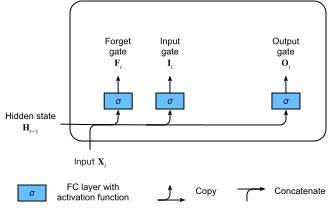
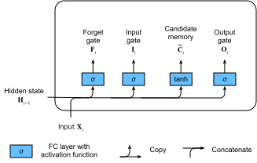
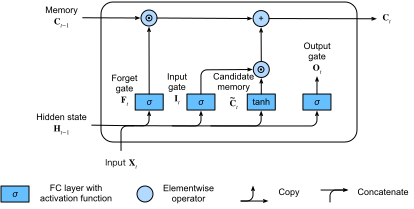
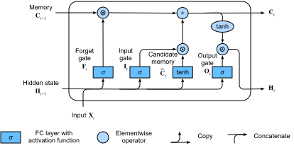

# Bộ nhớ ngắn hạn dài (LSTM)
:label:`sec_lstm`

Thách thức giải quyết việc bảo tồn thông tin dài hạn và bỏ qua đầu vào ngắn hạn trong các mô hình biến tiềm ẩn đã tồn tại trong một thời gian dài. Một trong những cách tiếp cận sớm nhất để giải quyết vấn đề này là bộ nhớ ngắn hạn dài (LSTM) :cite:`Hochreiter.Schmidhuber.1997`. Nó chia sẻ nhiều tài sản của GRU. Điều thú vị là LSTMs có thiết kế phức tạp hơn một chút so với Grus nhưng trước Grus gần hai thập kỷ. 

## Gated Memory Cell

Được cho là thiết kế của LSTM được lấy cảm hứng từ cổng logic của máy tính. LSTM giới thiệu một tế bào *memory cell* (hoặc *cell* nói ngắn) có hình dạng giống như trạng thái ẩn (một số văn học coi ô nhớ là một loại đặc biệt của trạng thái ẩn), được thiết kế để ghi lại thông tin bổ sung. Để kiểm soát tế bào bộ nhớ, chúng ta cần một số cổng. Một cổng là cần thiết để đọc các mục từ ô. Chúng tôi sẽ đề cập đến điều này là
*cổng đầu ra*.
Một cổng thứ hai là cần thiết để quyết định khi nào nên đọc dữ liệu vào ô. Chúng tôi gọi đây là cổng đầu vào **. Cuối cùng, chúng ta cần một cơ chế để thiết lập lại nội dung của ô, được chi phối bởi một cổng * quên *. Động lực cho một thiết kế như vậy giống như của Grus, cụ thể là có thể quyết định khi nào cần nhớ và khi nào bỏ qua các đầu vào ở trạng thái ẩn thông qua một cơ chế chuyên dụng. Hãy để chúng tôi xem làm thế nào điều này hoạt động trong thực tế. 

### Cổng đầu vào, Cổng quên và Cổng đầu ra

Cũng giống như trong Grus, việc cấp dữ liệu vào cổng LSTM là đầu vào ở bước thời gian hiện tại và trạng thái ẩn của bước thời gian trước đó, như minh họa trong :numref:`lstm_0`. Chúng được xử lý bởi ba lớp được kết nối hoàn toàn với chức năng kích hoạt sigmoid để tính toán các giá trị của đầu vào, quê. và cổng đầu ra. Kết quả là, các giá trị của ba cổng nằm trong khoảng $(0, 1)$. 


:label:`lstm_0`

Về mặt toán học, giả sử rằng có $h$ đơn vị ẩn, kích thước lô là $n$ và số lượng đầu vào là $d$. Do đó, đầu vào là $\mathbf{X}_t \in \mathbb{R}^{n \times d}$ và trạng thái ẩn của bước thời gian trước là $\mathbf{H}_{t-1} \in \mathbb{R}^{n \times h}$. Tương ứng, các cổng tại bước thời điểm $t$ được định nghĩa như sau: cổng đầu vào là $\mathbf{I}_t \in \mathbb{R}^{n \times h}$, cổng quên là $\mathbf{F}_t \in \mathbb{R}^{n \times h}$ và cổng đầu ra là $\mathbf{O}_t \in \mathbb{R}^{n \times h}$. Chúng được tính như sau: 

$$
\begin{aligned}
\mathbf{I}_t &= \sigma(\mathbf{X}_t \mathbf{W}_{xi} + \mathbf{H}_{t-1} \mathbf{W}_{hi} + \mathbf{b}_i),\\
\mathbf{F}_t &= \sigma(\mathbf{X}_t \mathbf{W}_{xf} + \mathbf{H}_{t-1} \mathbf{W}_{hf} + \mathbf{b}_f),\\
\mathbf{O}_t &= \sigma(\mathbf{X}_t \mathbf{W}_{xo} + \mathbf{H}_{t-1} \mathbf{W}_{ho} + \mathbf{b}_o),
\end{aligned}
$$

trong đó $\mathbf{W}_{xi}, \mathbf{W}_{xf}, \mathbf{W}_{xo} \in \mathbb{R}^{d \times h}$ và $\mathbf{W}_{hi}, \mathbf{W}_{hf}, \mathbf{W}_{ho} \in \mathbb{R}^{h \times h}$ là các thông số trọng lượng và $\mathbf{b}_i, \mathbf{b}_f, \mathbf{b}_o \in \mathbb{R}^{1 \times h}$ là các thông số thiên vị. 

### Tế bào bộ nhớ ứng cử viên

Tiếp theo chúng tôi thiết kế các tế bào bộ nhớ. Vì chúng tôi chưa chỉ định hành động của các cổng khác nhau, trước tiên chúng tôi giới thiệu tế bào bộ nhớ *ứng cử viên $\tilde{\mathbf{C}}_t \in \mathbb{R}^{n \times h}$. Tính toán của nó tương tự như của ba cổng được mô tả ở trên, nhưng sử dụng hàm $\tanh$ với phạm vi giá trị cho $(-1, 1)$ làm hàm kích hoạt. Điều này dẫn đến phương trình sau tại bước thời điểm $t$: 

$$\tilde{\mathbf{C}}_t = \text{tanh}(\mathbf{X}_t \mathbf{W}_{xc} + \mathbf{H}_{t-1} \mathbf{W}_{hc} + \mathbf{b}_c),$$

trong đó $\mathbf{W}_{xc} \in \mathbb{R}^{d \times h}$ và $\mathbf{W}_{hc} \in \mathbb{R}^{h \times h}$ là các thông số trọng lượng và $\mathbf{b}_c \in \mathbb{R}^{1 \times h}$ là một tham số thiên vị. 

Một minh họa nhanh chóng của tế bào bộ nhớ ứng cử viên được thể hiện trong :numref:`lstm_1`. 


:label:`lstm_1`

### Bộ nhớ Cell

Trong Grus, chúng ta có một cơ chế để chi phối đầu vào và quên (hoặc bỏ qua). Tương tự, trong LSTMs, chúng tôi có hai cổng chuyên dụng cho các mục đích như vậy: cổng đầu vào $\mathbf{I}_t$ chi phối số lượng chúng tôi tính đến dữ liệu mới thông qua $\tilde{\mathbf{C}}_t$ và cổng quên $\mathbf{F}_t$ giải quyết bao nhiêu nội dung tế bào bộ nhớ cũ $\mathbf{C}_{t-1} \in \mathbb{R}^{n \times h}$ chúng tôi giữ lại. Sử dụng cùng một thủ thuật nhân theo chiều ngang như trước đây, chúng tôi đến phương trình cập nhật sau: 

$$\mathbf{C}_t = \mathbf{F}_t \odot \mathbf{C}_{t-1} + \mathbf{I}_t \odot \tilde{\mathbf{C}}_t.$$

Nếu cổng quên luôn xấp xỉ 1 và cổng đầu vào luôn xấp xỉ 0, các ô bộ nhớ quá khứ $\mathbf{C}_{t-1}$ sẽ được lưu theo thời gian và được chuyển sang bước thời gian hiện tại. Thiết kế này được giới thiệu để giảm bớt vấn đề gradient biến mất và để nắm bắt tốt hơn các phụ thuộc tầm xa trong chuỗi. 

Do đó, chúng tôi đến sơ đồ dòng chảy trong :numref:`lstm_2`. 



:label:`lstm_2` 

### Nhà nước ẩn

Cuối cùng, chúng ta cần xác định cách tính trạng thái ẩn $\mathbf{H}_t \in \mathbb{R}^{n \times h}$. Đây là nơi cổng đầu ra phát huy tác dụng. Trong LSTM, nó chỉ đơn giản là một phiên bản cổng của $\tanh$ của tế bào bộ nhớ. Điều này đảm bảo rằng các giá trị của $\mathbf{H}_t$ luôn nằm trong khoảng $(-1, 1)$. 

$$\mathbf{H}_t = \mathbf{O}_t \odot \tanh(\mathbf{C}_t).$$

Bất cứ khi nào cổng đầu ra xấp xỉ 1, chúng tôi có hiệu quả truyền tất cả thông tin bộ nhớ đến bộ dự đoán, trong khi đối với cổng đầu ra gần 0, chúng tôi chỉ giữ lại tất cả thông tin trong ô nhớ và không thực hiện xử lý thêm. 

:numref:`lstm_3` có một minh họa đồ họa của luồng dữ liệu. 


:label:`lstm_3`

## Thực hiện từ đầu

Bây giờ chúng ta hãy thực hiện một LSTM từ đầu. Giống như các thí nghiệm trong :numref:`sec_rnn_scratch`, lần đầu tiên chúng ta tải tập dữ liệu máy thời gian.

```{.python .input}
from d2l import mxnet as d2l
from mxnet import np, npx
from mxnet.gluon import rnn
npx.set_np()

batch_size, num_steps = 32, 35
train_iter, vocab = d2l.load_data_time_machine(batch_size, num_steps)
```

```{.python .input}
#@tab pytorch
from d2l import torch as d2l
import torch
from torch import nn

batch_size, num_steps = 32, 35
train_iter, vocab = d2l.load_data_time_machine(batch_size, num_steps)
```

```{.python .input}
#@tab tensorflow
from d2l import tensorflow as d2l
import tensorflow as tf
batch_size, num_steps = 32, 35
train_iter, vocab = d2l.load_data_time_machine(batch_size, num_steps)
```

### [**Initializing Model Parameters**]

Tiếp theo chúng ta cần xác định và khởi tạo các tham số mô hình. Như trước đây, siêu tham số `num_hiddens` xác định số đơn vị ẩn. Chúng tôi khởi tạo các trọng lượng sau một phân phối Gaussian với 0,01 độ lệch chuẩn, và chúng tôi đặt các thành kiến là 0.

```{.python .input}
def get_lstm_params(vocab_size, num_hiddens, device):
    num_inputs = num_outputs = vocab_size

    def normal(shape):
        return np.random.normal(scale=0.01, size=shape, ctx=device)

    def three():
        return (normal((num_inputs, num_hiddens)),
                normal((num_hiddens, num_hiddens)),
                np.zeros(num_hiddens, ctx=device))

    W_xi, W_hi, b_i = three()  # Input gate parameters
    W_xf, W_hf, b_f = three()  # Forget gate parameters
    W_xo, W_ho, b_o = three()  # Output gate parameters
    W_xc, W_hc, b_c = three()  # Candidate memory cell parameters
    # Output layer parameters
    W_hq = normal((num_hiddens, num_outputs))
    b_q = np.zeros(num_outputs, ctx=device)
    # Attach gradients
    params = [W_xi, W_hi, b_i, W_xf, W_hf, b_f, W_xo, W_ho, b_o, W_xc, W_hc,
              b_c, W_hq, b_q]
    for param in params:
        param.attach_grad()
    return params
```

```{.python .input}
#@tab pytorch
def get_lstm_params(vocab_size, num_hiddens, device):
    num_inputs = num_outputs = vocab_size

    def normal(shape):
        return torch.randn(size=shape, device=device)*0.01

    def three():
        return (normal((num_inputs, num_hiddens)),
                normal((num_hiddens, num_hiddens)),
                d2l.zeros(num_hiddens, device=device))

    W_xi, W_hi, b_i = three()  # Input gate parameters
    W_xf, W_hf, b_f = three()  # Forget gate parameters
    W_xo, W_ho, b_o = three()  # Output gate parameters
    W_xc, W_hc, b_c = three()  # Candidate memory cell parameters
    # Output layer parameters
    W_hq = normal((num_hiddens, num_outputs))
    b_q = d2l.zeros(num_outputs, device=device)
    # Attach gradients
    params = [W_xi, W_hi, b_i, W_xf, W_hf, b_f, W_xo, W_ho, b_o, W_xc, W_hc,
              b_c, W_hq, b_q]
    for param in params:
        param.requires_grad_(True)
    return params
```

```{.python .input}
#@tab tensorflow
def get_lstm_params(vocab_size, num_hiddens):
    num_inputs = num_outputs = vocab_size

    def normal(shape):
        return tf.Variable(tf.random.normal(shape=shape, stddev=0.01,
                                            mean=0, dtype=tf.float32))
    def three():
        return (normal((num_inputs, num_hiddens)),
                normal((num_hiddens, num_hiddens)),
                tf.Variable(tf.zeros(num_hiddens), dtype=tf.float32))

    W_xi, W_hi, b_i = three()  # Input gate parameters
    W_xf, W_hf, b_f = three()  # Forget gate parameters
    W_xo, W_ho, b_o = three()  # Output gate parameters
    W_xc, W_hc, b_c = three()  # Candidate memory cell parameters
    # Output layer parameters
    W_hq = normal((num_hiddens, num_outputs))
    b_q = tf.Variable(tf.zeros(num_outputs), dtype=tf.float32)
    # Attach gradients
    params = [W_xi, W_hi, b_i, W_xf, W_hf, b_f, W_xo, W_ho, b_o, W_xc, W_hc,
              b_c, W_hq, b_q]
    return params
```

### Xác định mô hình

Trong [** the initialization function**], trạng thái ẩn của LSTM cần trả về một ô bộ nhớ *additional* với giá trị 0 và hình dạng (kích thước lô, số đơn vị ẩn). Do đó chúng tôi nhận được sự khởi tạo trạng thái sau đây.

```{.python .input}
def init_lstm_state(batch_size, num_hiddens, device):
    return (np.zeros((batch_size, num_hiddens), ctx=device),
            np.zeros((batch_size, num_hiddens), ctx=device))
```

```{.python .input}
#@tab pytorch
def init_lstm_state(batch_size, num_hiddens, device):
    return (torch.zeros((batch_size, num_hiddens), device=device),
            torch.zeros((batch_size, num_hiddens), device=device))
```

```{.python .input}
#@tab tensorflow
def init_lstm_state(batch_size, num_hiddens):
    return (tf.zeros(shape=(batch_size, num_hiddens)),
            tf.zeros(shape=(batch_size, num_hiddens)))
```

[**mô hình thực tế**] được định nghĩa giống như những gì chúng ta đã thảo luận trước đây: cung cấp ba cổng và một tế bào bộ nhớ phụ trợ. Lưu ý rằng chỉ có trạng thái ẩn được chuyển đến lớp đầu ra. Các tế bào bộ nhớ $\mathbf{C}_t$ không trực tiếp tham gia vào việc tính toán đầu ra.

```{.python .input}
def lstm(inputs, state, params):
    [W_xi, W_hi, b_i, W_xf, W_hf, b_f, W_xo, W_ho, b_o, W_xc, W_hc, b_c,
     W_hq, b_q] = params
    (H, C) = state
    outputs = []
    for X in inputs:
        I = npx.sigmoid(np.dot(X, W_xi) + np.dot(H, W_hi) + b_i)
        F = npx.sigmoid(np.dot(X, W_xf) + np.dot(H, W_hf) + b_f)
        O = npx.sigmoid(np.dot(X, W_xo) + np.dot(H, W_ho) + b_o)
        C_tilda = np.tanh(np.dot(X, W_xc) + np.dot(H, W_hc) + b_c)
        C = F * C + I * C_tilda
        H = O * np.tanh(C)
        Y = np.dot(H, W_hq) + b_q
        outputs.append(Y)
    return np.concatenate(outputs, axis=0), (H, C)
```

```{.python .input}
#@tab pytorch
def lstm(inputs, state, params):
    [W_xi, W_hi, b_i, W_xf, W_hf, b_f, W_xo, W_ho, b_o, W_xc, W_hc, b_c,
     W_hq, b_q] = params
    (H, C) = state
    outputs = []
    for X in inputs:
        I = torch.sigmoid((X @ W_xi) + (H @ W_hi) + b_i)
        F = torch.sigmoid((X @ W_xf) + (H @ W_hf) + b_f)
        O = torch.sigmoid((X @ W_xo) + (H @ W_ho) + b_o)
        C_tilda = torch.tanh((X @ W_xc) + (H @ W_hc) + b_c)
        C = F * C + I * C_tilda
        H = O * torch.tanh(C)
        Y = (H @ W_hq) + b_q
        outputs.append(Y)
    return torch.cat(outputs, dim=0), (H, C)
```

```{.python .input}
#@tab tensorflow
def lstm(inputs, state, params):
    W_xi, W_hi, b_i, W_xf, W_hf, b_f, W_xo, W_ho, b_o, W_xc, W_hc, b_c, W_hq, b_q = params
    (H, C) = state
    outputs = []
    for X in inputs:
        X=tf.reshape(X,[-1,W_xi.shape[0]])
        I = tf.sigmoid(tf.matmul(X, W_xi) + tf.matmul(H, W_hi) + b_i)
        F = tf.sigmoid(tf.matmul(X, W_xf) + tf.matmul(H, W_hf) + b_f)
        O = tf.sigmoid(tf.matmul(X, W_xo) + tf.matmul(H, W_ho) + b_o)
        C_tilda = tf.tanh(tf.matmul(X, W_xc) + tf.matmul(H, W_hc) + b_c)
        C = F * C + I * C_tilda
        H = O * tf.tanh(C)
        Y = tf.matmul(H, W_hq) + b_q
        outputs.append(Y)
    return tf.concat(outputs, axis=0), (H,C)
```

### [**Đào tạo**] và Dự đoán

Chúng ta hãy đào tạo một LSTM giống như những gì chúng tôi đã làm trong :numref:`sec_gru`, bằng cách khởi tạo lớp `RNNModelScratch` như được giới thiệu trong :numref:`sec_rnn_scratch`.

```{.python .input}
#@tab mxnet, pytorch
vocab_size, num_hiddens, device = len(vocab), 256, d2l.try_gpu()
num_epochs, lr = 500, 1
model = d2l.RNNModelScratch(len(vocab), num_hiddens, device, get_lstm_params,
                            init_lstm_state, lstm)
d2l.train_ch8(model, train_iter, vocab, lr, num_epochs, device)
```

```{.python .input}
#@tab tensorflow
vocab_size, num_hiddens, device_name = len(vocab), 256, d2l.try_gpu()._device_name
num_epochs, lr = 500, 1
strategy = tf.distribute.OneDeviceStrategy(device_name)
with strategy.scope():
    model = d2l.RNNModelScratch(len(vocab), num_hiddens, init_lstm_state, lstm, get_lstm_params)
d2l.train_ch8(model, train_iter, vocab, lr, num_epochs, strategy)
```

## [**Thiết tập**]

Sử dụng API cấp cao, chúng ta có thể khởi tạo trực tiếp một mô hình `LSTM`. Điều này đóng gói tất cả các chi tiết cấu hình mà chúng tôi đã thực hiện rõ ràng ở trên. Mã này nhanh hơn đáng kể vì nó sử dụng các toán tử được biên dịch hơn là Python cho nhiều chi tiết mà chúng tôi đã nêu chi tiết trước đây.

```{.python .input}
lstm_layer = rnn.LSTM(num_hiddens)
model = d2l.RNNModel(lstm_layer, len(vocab))
d2l.train_ch8(model, train_iter, vocab, lr, num_epochs, device)
```

```{.python .input}
#@tab pytorch
num_inputs = vocab_size
lstm_layer = nn.LSTM(num_inputs, num_hiddens)
model = d2l.RNNModel(lstm_layer, len(vocab))
model = model.to(device)
d2l.train_ch8(model, train_iter, vocab, lr, num_epochs, device)
```

```{.python .input}
#@tab tensorflow
lstm_cell = tf.keras.layers.LSTMCell(num_hiddens,
    kernel_initializer='glorot_uniform')
lstm_layer = tf.keras.layers.RNN(lstm_cell, time_major=True,
    return_sequences=True, return_state=True)
device_name = d2l.try_gpu()._device_name
strategy = tf.distribute.OneDeviceStrategy(device_name)
with strategy.scope():
    model = d2l.RNNModel(lstm_layer, vocab_size=len(vocab))
d2l.train_ch8(model, train_iter, vocab, lr, num_epochs, strategy)
```

LSTMs là mô hình autoregressive biến tiềm ẩn nguyên mẫu với điều khiển trạng thái không tầm thường. Nhiều biến thể của chúng đã được đề xuất trong những năm qua, ví dụ, nhiều lớp, kết nối còn lại, các loại chính quy hóa khác nhau. Tuy nhiên, việc đào tạo LSTMs và các mô hình trình tự khác (chẳng hạn như Grus) khá tốn kém do sự phụ thuộc tầm xa của trình tự. Sau đó chúng ta sẽ gặp phải các mô hình thay thế như máy biến áp có thể được sử dụng trong một số trường hợp. 

## Tóm tắt

* LSTMs có ba loại cổng: cổng đầu vào, cổng quên và cổng đầu ra kiểm soát luồng thông tin.
* Đầu ra lớp ẩn của LSTM bao gồm trạng thái ẩn và ô nhớ. Chỉ có trạng thái ẩn được truyền vào lớp đầu ra. Tế bào bộ nhớ hoàn toàn bên trong.
* LSTMs có thể làm giảm bớt độ dốc biến mất và bùng nổ.

## Bài tập

1. Điều chỉnh các siêu tham số và phân tích ảnh hưởng của chúng đối với thời gian chạy, bối rối và trình tự đầu ra.
1. Làm thế nào bạn sẽ cần phải thay đổi mô hình để tạo ra các từ thích hợp như trái ngược với chuỗi các ký tự?
1. So sánh chi phí tính toán cho Grus, LSTMs và RNN thông thường cho một chiều ẩn nhất định. Đặc biệt chú ý đến chi phí đào tạo và suy luận.
1. Vì ô bộ nhớ ứng cử viên đảm bảo rằng phạm vi giá trị nằm trong khoảng $-1$ và $1$ bằng cách sử dụng hàm $\tanh$, tại sao trạng thái ẩn cần sử dụng lại chức năng $\tanh$ để đảm bảo rằng phạm vi giá trị đầu ra nằm trong khoảng từ $-1$ và $1$?
1. Triển khai một mô hình LSTM cho dự đoán chuỗi thời gian hơn là dự đoán chuỗi ký tự.

:begin_tab:`mxnet`
[Discussions](https://discuss.d2l.ai/t/343)
:end_tab:

:begin_tab:`pytorch`
[Discussions](https://discuss.d2l.ai/t/1057)
:end_tab:
