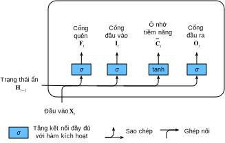
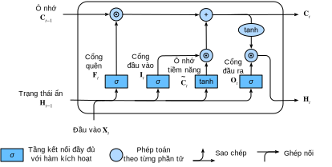

<!-- ===================== Bắt đầu dịch Phần 1 ==================== -->
<!-- ========================================= REVISE PHẦN 1 - BẮT ĐẦU =================================== -->

<!--
# Long Short Term Memory (LSTM)
-->

# *dịch tiêu đề phía trên*
:label:`sec_lstm`

<!--
The challenge to address long-term information preservation and short-term input skipping in latent variable models has existed for a long time.
One of the earliest approaches to address this was the LSTM :cite:`Hochreiter.Schmidhuber.1997`.
It shares many of the properties of the
Gated Recurrent Unit (GRU).
Interestingly, LSTM's design is slightly more complex than GRU but predates GRU by almost two decades.
-->

*dịch đoạn phía trên*

<!--
Arguably it is inspired by logic gates of a computer.
To control a memory cell we need a number of gates.
One gate is needed to read out the entries from the cell (as opposed to reading any other cell).
We will refer to this as the *output* gate.
A second gate is needed to decide when to read data into the cell.
We refer to this as the *input* gate.
Last, we need a mechanism to reset the contents of the cell, governed by a *forget* gate.
The motivation for such a design is the same as before, namely to be able to decide when to remember and when to ignore inputs in the latent state via a dedicated mechanism.
Let us see how this works in practice.
-->

*dịch đoạn phía trên*

<!--
## Gated Memory Cells
-->

## *dịch tiêu đề phía trên*

<!--
Three gates are introduced in LSTMs: the input gate, the forget gate, and the output gate.
In addition to that we will introduce the memory cell that has the same shape as the hidden state.
Strictly speaking this is just a fancy version of a hidden state, engineered to record additional information.
-->

*dịch đoạn phía trên*

<!-- ===================== Kết thúc dịch Phần 1 ===================== -->

<!-- ===================== Bắt đầu dịch Phần 2 ===================== -->

<!--
### Input Gates, Forget Gates, and Output Gates
-->

### *dịch tiêu đề phía trên*

<!--
Just like with GRUs, the data feeding into the LSTM gates is the input at the current timestep $\mathbf{X}_t$ and the hidden state of the previous timestep $\mathbf{H}_{t-1}$.
These inputs are processed by a fully connected layer and a sigmoid activation function to compute the values of input, forget and output gates.
As a result, the three gates all output values in the range of $[0, 1]$. :numref:`lstm_0` illustrates the data flow for the input, forget, and output gates.
-->

*dịch đoạn phía trên*

<!--

-->


:label:`lstm_0`

<!--
We assume that there are $h$ hidden units, the minibatch is of size $n$, and number of inputs is $d$.
Thus, the input is $\mathbf{X}_t \in \mathbb{R}^{n \times d}$ and the hidden state of the last timestep is $\mathbf{H}_{t-1} \in \mathbb{R}^{n \times h}$.
Correspondingly, the gates are defined as follows: the input gate is $\mathbf{I}_t \in \mathbb{R}^{n \times h}$, 
the forget gate is $\mathbf{F}_t \in \mathbb{R}^{n \times h}$, and the output gate is $\mathbf{O}_t \in \mathbb{R}^{n \times h}$.
They are calculated as follows:
-->

*dịch đoạn phía trên*


$$
\begin{aligned}
\mathbf{I}_t &= \sigma(\mathbf{X}_t \mathbf{W}_{xi} + \mathbf{H}_{t-1} \mathbf{W}_{hi} + \mathbf{b}_i),\\
\mathbf{F}_t &= \sigma(\mathbf{X}_t \mathbf{W}_{xf} + \mathbf{H}_{t-1} \mathbf{W}_{hf} + \mathbf{b}_f),\\
\mathbf{O}_t &= \sigma(\mathbf{X}_t \mathbf{W}_{xo} + \mathbf{H}_{t-1} \mathbf{W}_{ho} + \mathbf{b}_o),
\end{aligned}
$$


<!--
where $\mathbf{W}_{xi}, \mathbf{W}_{xf}, \mathbf{W}_{xo} \in \mathbb{R}^{d \times h}$ and $\mathbf{W}_{hi}, \mathbf{W}_{hf}, \mathbf{W}_{ho} \in \mathbb{R}^{h \times h}$ 
are weight parameters and $\mathbf{b}_i, \mathbf{b}_f, \mathbf{b}_o \in \mathbb{R}^{1 \times h}$ are bias parameters.
-->

*dịch đoạn phía trên*


<!--
### Candidate Memory Cell
-->

### *dịch tiêu đề phía trên*

<!--
Next we design the memory cell.
Since we have not specified the action of the various gates yet, we first introduce the *candidate* memory cell $\tilde{\mathbf{C}}_t \in \mathbb{R}^{n \times h}$.
Its computation is similar to the three gates described above, but using a $\tanh$ function with a value range for $[-1, 1]$ as the activation function.
This leads to the following equation at timestep $t$.
-->

*dịch đoạn phía trên*


$$\tilde{\mathbf{C}}_t = \text{tanh}(\mathbf{X}_t \mathbf{W}_{xc} + \mathbf{H}_{t-1} \mathbf{W}_{hc} + \mathbf{b}_c).$$


<!--
Here $\mathbf{W}_{xc} \in \mathbb{R}^{d \times h}$ and $\mathbf{W}_{hc} \in \mathbb{R}^{h \times h}$ are weight parameters and $\mathbf{b}_c \in \mathbb{R}^{1 \times h}$ is a bias parameter.
-->

*dịch đoạn phía trên*

<!--
A quick illustration of the candidate memory cell is shown in :numref:`lstm_1`.
-->

*dịch đoạn phía trên*

<!--

-->


:label:`lstm_1`

<!-- ===================== Kết thúc dịch Phần 2 ===================== -->

<!-- ===================== Bắt đầu dịch Phần 3 ===================== -->


<!--
### Memory Cell
-->

### Ô Nhớ

<!--
In GRUs, we had a single mechanism to govern input and forgetting.
Here in LSTMs we have two parameters, $\mathbf{I}_t$ which governs how much we take new data into account via $\tilde{\mathbf{C}}_t$ 
and the forget parameter $\mathbf{F}_t$ which addresses how much of the old memory cell content $\mathbf{C}_{t-1} \in \mathbb{R}^{n \times h}$ we retain.
Using the same pointwise multiplication trick as before, we arrive at the following update equation.
-->

Trong GRU, chúng ta có một cơ chế duy nhất để quản lý cả đầu vào và quá trình quên.
Trong LSTM, chúng ta có hai tham số, $\mathbf{I}_t$ điều chỉnh lượng dữ liệu mới cần lấy vào là bao nhiêu thông qua $\tilde{\mathbf{C}}_t$ và tham số quên $\mathbf{F}_t$ chỉ định nội dung cũ cần giữ lại trong ô nhớ $\mathbf{C}_{t-1} \in \mathbb{R}^{n \times h}$ là bao nhiêu.
Sử dụng cùng một cách tính nhân theo từng điểm (_pointwise_) như trước đây, chúng ta đi đến phương trình cập nhật như sau.


$$\mathbf{C}_t = \mathbf{F}_t \odot \mathbf{C}_{t-1} + \mathbf{I}_t \odot \tilde{\mathbf{C}}_t.$$


<!--
If the forget gate is always approximately $1$ and the input gate is always approximately $0$, the past memory cells $\mathbf{C}_{t-1}$ will be saved over time and passed to the current timestep.
This design was introduced to alleviate the vanishing gradient problem and to better capture dependencies for time series with long range dependencies.
We thus arrive at the flow diagram in :numref:`lstm_2`.
-->

Nếu giá trị ở cổng quên luôn xấp xỉ bằng $1$ và cổng đầu vào luôn xấp xỉ bằng $0$, thì giá trị ô nhớ trong quá khứ $\mathbf{C}_{t-1}$ sẽ được lưu lại qua thời gian và truyền tới bước thời gian hiện tại.
Thiết kế này đã được giới thiệu nhằm giảm bớt vấn đề tiêu biến gradient cũng như nắm bắt các phụ thuộc dài hạn cho chuỗi thời gian tốt hơn.
Do đó chúng ta có sơ đồ luồng trong :numref:`lstm_2`.

<!--

-->


:label:`lstm_2`


<!--
### Hidden States
-->

### Các Trạng thái Ẩn

<!--
Last, we need to define how to compute the hidden state $\mathbf{H}_t \in \mathbb{R}^{n \times h}$.
This is where the output gate comes into play.
In LSTM it is simply a gated version of the $\tanh$ of the memory cell.
This ensures that the values of $\mathbf{H}_t$ are always in the interval $(-1, 1)$.
Whenever the output gate is $1$ we effectively pass all memory information through to the predictor, 
whereas for output $0$ we retain all the information only within the memory cell and perform no further processing.
:numref:`lstm_3` has a graphical illustration of the data flow.
-->

Cuối cùng, chúng ta cần phải xác định cách tính trạng thái ẩn $\mathbf{H}_t \in \mathbb{R}^{n \times h}$.
Đây là nơi các cổng đầu ra được sử dụng.
Trong LSTM, đây chỉ đơn giản là một phiên bản hàm kích hoạt $\tanh$ có cổng trong ô nhớ.
Điều này đảm bảo rằng các giá trị của $\mathbf{H}_t$ luôn nằm trong khoảng $(-1, 1)$.
Bất cứ khi nào giá trị của cổng đầu ra là $1$, chúng ta cho tất cả thông tin bộ nhớ qua hàm dự đoán một cách hiệu quả.
Ngược lại khi giá trị của cổng đầu ra là $0$, chúng ta giữ lại tất cả các thông tin trong ô nhớ và không xử lý gì thêm.
:numref:`lstm_3` minh họa các luồng dữ liệu theo đồ thị.


$$\mathbf{H}_t = \mathbf{O}_t \odot \tanh(\mathbf{C}_t).$$


<!--

-->


:label:`lstm_3`

<!-- ===================== Kết thúc dịch Phần 3 ===================== -->

<!-- ===================== Bắt đầu dịch Phần 4 ===================== -->

<!--
## Implementation from Scratch
-->

## *dịch tiêu đề phía trên*

<!--
Now let us implement an LSTM from scratch.
As same as the experiments in the previous sections, we first load data of *The Time Machine*.
-->

*dịch đoạn phía trên*

```{.python .input  n=1}
import d2l
from mxnet import np, npx
from mxnet.gluon import rnn
npx.set_np()

batch_size, num_steps = 32, 35
train_iter, vocab = d2l.load_data_time_machine(batch_size, num_steps)
```

<!--
### Initializing Model Parameters
-->

### *dịch tiêu đề phía trên*

<!--
Next we need to define and initialize the model parameters.
As previously, the hyperparameter `num_hiddens` defines the number of hidden units.
We initialize weights following a Gaussian distribution with $0.01$ standard deviation, and we set the biases to $0$.
-->

*dịch đoạn phía trên*


```{.python .input  n=2}
def get_lstm_params(vocab_size, num_hiddens, ctx):
    num_inputs = num_outputs = vocab_size

    def normal(shape):
        return np.random.normal(scale=0.01, size=shape, ctx=ctx)

    def three():
        return (normal((num_inputs, num_hiddens)),
                normal((num_hiddens, num_hiddens)),
                np.zeros(num_hiddens, ctx=ctx))

    W_xi, W_hi, b_i = three()  # Input gate parameters
    W_xf, W_hf, b_f = three()  # Forget gate parameters
    W_xo, W_ho, b_o = three()  # Output gate parameters
    W_xc, W_hc, b_c = three()  # Candidate cell parameters
    # Output layer parameters
    W_hq = normal((num_hiddens, num_outputs))
    b_q = np.zeros(num_outputs, ctx=ctx)
    # Attach gradients
    params = [W_xi, W_hi, b_i, W_xf, W_hf, b_f, W_xo, W_ho, b_o, W_xc, W_hc,
              b_c, W_hq, b_q]
    for param in params:
        param.attach_grad()
    return params
```

<!-- ========================================= REVISE PHẦN 1 - KẾT THÚC ===================================-->

<!-- ========================================= REVISE PHẦN 2 - BẮT ĐẦU ===================================-->

<!--
### Defining the Model
-->

### *dịch tiêu đề phía trên*

<!--
In the initialization function, the hidden state of the LSTM needs to return an additional memory cell with a value of $0$ and a shape of (batch size, number of hidden units).
Hence we get the following state initialization.
-->

*dịch đoạn phía trên*

```{.python .input  n=3}
def init_lstm_state(batch_size, num_hiddens, ctx):
    return (np.zeros(shape=(batch_size, num_hiddens), ctx=ctx),
            np.zeros(shape=(batch_size, num_hiddens), ctx=ctx))
```

<!--
The actual model is defined just like what we discussed before: providing three gates and an auxiliary memory cell.
Note that only the hidden state is passed to the output layer.
The memory cells $\mathbf{C}_t$ do not participate in the output computation directly.
-->

*dịch đoạn phía trên*


```{.python .input  n=4}
def lstm(inputs, state, params):
    [W_xi, W_hi, b_i, W_xf, W_hf, b_f, W_xo, W_ho, b_o, W_xc, W_hc, b_c,
     W_hq, b_q] = params
    (H, C) = state
    outputs = []
    for X in inputs:
        I = npx.sigmoid(np.dot(X, W_xi) + np.dot(H, W_hi) + b_i)
        F = npx.sigmoid(np.dot(X, W_xf) + np.dot(H, W_hf) + b_f)
        O = npx.sigmoid(np.dot(X, W_xo) + np.dot(H, W_ho) + b_o)
        C_tilda = np.tanh(np.dot(X, W_xc) + np.dot(H, W_hc) + b_c)
        C = F * C + I * C_tilda
        H = O * np.tanh(C)
        Y = np.dot(H, W_hq) + b_q
        outputs.append(Y)
    return np.concatenate(outputs, axis=0), (H, C)
```

<!-- ===================== Kết thúc dịch Phần 4 ===================== -->

<!-- ===================== Bắt đầu dịch Phần 5 ===================== -->

<!--
### Training and Prediction
-->

### *dịch tiêu đề phía trên*

<!--
Let us train an LSTM as same as what we did in :numref:`sec_gru`, by calling the `RNNModelScratch` function as introduced in :numref:`sec_rnn_scratch`.
-->

*dịch đoạn phía trên*

```{.python .input  n=9}
vocab_size, num_hiddens, ctx = len(vocab), 256, d2l.try_gpu()
num_epochs, lr = 500, 1
model = d2l.RNNModelScratch(len(vocab), num_hiddens, ctx, get_lstm_params,
                            init_lstm_state, lstm)
d2l.train_ch8(model, train_iter, vocab, lr, num_epochs, ctx)
```

<!--
## Concise Implementation
-->

## *dịch tiêu đề phía trên*

<!--
In Gluon, we can directly call the `LSTM` class in the `rnn` module.
This encapsulates all the configuration details that we made explicit above.
The code is significantly faster as it uses compiled operators rather than Python for many details that we spelled out in detail before.
-->

*dịch đoạn phía trên*

```{.python .input  n=10}
lstm_layer = rnn.LSTM(num_hiddens)
model = d2l.RNNModel(lstm_layer, len(vocab))
d2l.train_ch8(model, train_iter, vocab, lr, num_epochs, ctx)
```

<!--
In many cases, LSTMs perform slightly better than GRUs but they are more costly to train and execute due to the larger latent state size.
LSTMs are the prototypical latent variable autoregressive model with nontrivial state control.
Many variants thereof have been proposed over the years, e.g., multiple layers, residual connections, different types of regularization.
However, training LSTMs and other sequence models (such as GRU) are quite costly due to the long range dependency of the sequence.
Later we will encounter alternative models such as Transformers that can be used in some cases.
-->

*dịch đoạn phía trên*

<!-- ===================== Kết thúc dịch Phần 5 ===================== -->

<!-- ===================== Bắt đầu dịch Phần 6 ===================== -->

<!--
## Summary
-->

## Tóm tắt

<!--
* LSTMs have three types of gates: input gates, forget gates, and output gates which control the flow of information.
* The hidden layer output of LSTM includes hidden states and memory cells. Only hidden states are passed into the output layer. Memory cells are entirely internal.
* LSTMs can cope with vanishing and exploding gradients.
-->

*dịch đoạn phía trên*


<!--
## Exercises
-->

## Bài tập

<!--
1. Adjust the hyperparameters. Observe and analyze the impact on runtime, perplexity, and the generated output.
2. How would you need to change the model to generate proper words as opposed to sequences of characters?
3. Compare the computational cost for GRUs, LSTMs, and regular RNNs for a given hidden dimension. Pay special attention to the training and inference cost.
4. Since the candidate memory cells ensure that the value range is between $-1$ and $1$ by  using the $\tanh$ function, 
why does the hidden state need to use the $\tanh$ function again to ensure that the output value range is between $-1$ and $1$?
5. Implement an LSTM for time series prediction rather than character sequence prediction.
-->

*dịch đoạn phía trên*

<!-- ===================== Kết thúc dịch Phần 6 ===================== -->
<!-- ========================================= REVISE PHẦN 2 - KẾT THÚC ===================================-->

## Thảo luận
* [Tiếng Anh](https://discuss.mxnet.io/t/2368)
* [Tiếng Việt](https://forum.machinelearningcoban.com/c/d2l)

## Những người thực hiện
Bản dịch trong trang này được thực hiện bởi:
<!--
Tác giả của mỗi Pull Request điền tên mình và tên những người review mà bạn thấy
hữu ích vào từng phần tương ứng. Mỗi dòng một tên, bắt đầu bằng dấu `*`.

Lưu ý:
* Nếu reviewer không cung cấp tên, bạn có thể dùng tên tài khoản GitHub của họ
với dấu `@` ở đầu. Ví dụ: @aivivn.

* Tên đầy đủ của các reviewer có thể được tìm thấy tại https://github.com/aivivn/d2l-vn/blob/master/docs/contributors_info.md
-->

* Đoàn Võ Duy Thanh
<!-- Phần 1 -->
*

<!-- Phần 2 -->
*

<!-- Phần 3 -->
* Nguyễn Văn Quang
* Nguyễn Lê Quang Nhật

<!-- Phần 4 -->
*

<!-- Phần 5 -->
*

<!-- Phần 6 -->
*
