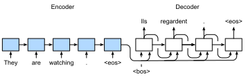

#  Trình tự để học trình tự
:label:`sec_seq2seq`

Như chúng ta đã thấy trong :numref:`sec_machine_translation`, trong dịch máy cả đầu vào và đầu ra là một chuỗi chiều dài biến đổi. Để giải quyết loại vấn đề này, chúng tôi đã thiết kế một kiến trúc bộ mã hóa giải mã chung trong :numref:`sec_encoder-decoder`. Trong phần này, chúng tôi sẽ sử dụng hai RNNđể thiết kế bộ mã hóa và bộ giải mã của kiến trúc này và áp dụng nó vào trình tự * trình tự để học tập cho dịch máy :cite:`Sutskever.Vinyals.Le.2014,Cho.Van-Merrienboer.Gulcehre.ea.2014`. 

Theo nguyên tắc thiết kế của kiến trúc bộ mã hóa-giải mã, bộ mã hóa RNN có thể lấy một chuỗi độ dài thay đổi làm đầu vào và biến nó thành trạng thái ẩn hình dạng cố định. Nói cách khác, thông tin của chuỗi đầu vào (nguồn) là *mã hóa* ở trạng thái ẩn của bộ mã hóa RNN. Để tạo ra mã thông báo chuỗi đầu ra theo mã thông báo, một bộ giải mã RNN riêng biệt có thể dự đoán token tiếp theo dựa trên những mã thông báo đã được nhìn thấy (chẳng hạn như trong mô hình ngôn ngữ) hoặc được tạo ra, cùng với thông tin được mã hóa của chuỗi đầu vào. :numref:`fig_seq2seq` minh họa cách sử dụng hai RNNđể trình tự learning học tập in machine máy móc translation dịch thuật. 


:label:`fig_seq2seq`

Năm :numref:`fig_seq2seq`, <eos>mã thông báo "" đặc biệt đánh dấu sự kết thúc của chuỗi. Mô hình có thể ngừng đưa ra dự đoán sau khi mã thông báo này được tạo ra. Tại bước thời gian ban đầu của bộ giải mã RNN, có hai quyết định thiết kế đặc biệt. Đầu tiên, <bos>mã thông báo bắt đầu chuỗi "" đặc biệt là một đầu vào. Thứ hai, trạng thái ẩn cuối cùng của bộ mã hóa RNN được sử dụng để bắt đầu trạng thái ẩn của bộ giải mã. Trong các thiết kế như :cite:`Sutskever.Vinyals.Le.2014`, đây chính xác là cách thông tin chuỗi đầu vào được mã hóa được đưa vào bộ giải mã để tạo ra chuỗi đầu ra (mục tiêu). Trong một số thiết kế khác như :cite:`Cho.Van-Merrienboer.Gulcehre.ea.2014`, trạng thái ẩn cuối cùng của bộ mã hóa cũng được đưa vào bộ giải mã như một phần của các đầu vào tại từng bước như thể hiện trong :numref:`fig_seq2seq`. Tương tự như việc đào tạo các mô hình ngôn ngữ trong :numref:`sec_language_model`, chúng ta có thể cho phép các nhãn là chuỗi đầu ra ban đầu, được dịch chuyển bởi một mã thông báo: "<bos>“, “Ils”, “regardent”, “.” $\rightarrow$ “Ils”, “regardent”,” . “,"<eos>”. 

Sau đây, chúng tôi sẽ giải thích thiết kế của :numref:`fig_seq2seq` chi tiết hơn. Chúng tôi sẽ đào tạo mô hình này để dịch máy trên tập dữ liệu tiếng Anh-Pháp như được giới thiệu trong :numref:`sec_machine_translation`.

```{.python .input}
import collections
from d2l import mxnet as d2l
import math
from mxnet import np, npx, init, gluon, autograd
from mxnet.gluon import nn, rnn
npx.set_np()
```

```{.python .input}
#@tab pytorch
import collections
from d2l import torch as d2l
import math
import torch
from torch import nn
```

```{.python .input}
#@tab tensorflow
import collections
from d2l import tensorflow as d2l
import math
import tensorflow as tf
```

## Bộ mã hóa

Về mặt kỹ thuật, bộ mã hóa biến đổi một chuỗi đầu vào có độ dài biến thành một biến đổi ngữ cảnh hình dạng cố định* $\mathbf{c}$ và mã hóa thông tin trình tự đầu vào trong biến ngữ cảnh này. Như được mô tả trong :numref:`fig_seq2seq`, chúng ta có thể sử dụng RNN để thiết kế bộ mã hóa. 

Chúng ta hãy xem xét một ví dụ trình tự (kích thước lô: 1). Giả sử chuỗi đầu vào là $x_1, \ldots, x_T$, sao cho $x_t$ là mã thông báo $t^{\mathrm{th}}$ trong chuỗi văn bản đầu vào. Tại bước thời gian $t$, RNN biến đổi vector tính năng đầu vào $\mathbf{x}_t$ cho $x_t$ và trạng thái ẩn $\mathbf{h} _{t-1}$ từ bước thời gian trước vào trạng thái ẩn hiện tại $\mathbf{h}_t$. Ta có thể sử dụng một hàm $f$ để thể hiện sự biến đổi của lớp tái phát của RNN: 

$$\mathbf{h}_t = f(\mathbf{x}_t, \mathbf{h}_{t-1}). $$

Nói chung, bộ mã hóa biến đổi các trạng thái ẩn ở tất cả các bước thời gian thành biến ngữ cảnh thông qua một chức năng tùy chỉnh $q$: 

$$\mathbf{c} =  q(\mathbf{h}_1, \ldots, \mathbf{h}_T).$$

Ví dụ, khi chọn $q(\mathbf{h}_1, \ldots, \mathbf{h}_T) = \mathbf{h}_T$ chẳng hạn như trong :numref:`fig_seq2seq`, biến ngữ cảnh chỉ là trạng thái ẩn $\mathbf{h}_T$ của chuỗi đầu vào ở bước thời gian cuối cùng. 

Cho đến nay chúng ta đã sử dụng RNN một chiều để thiết kế bộ mã hóa, trong đó trạng thái ẩn chỉ phụ thuộc vào dãy con đầu vào tại và trước bước thời gian của trạng thái ẩn. Chúng tôi cũng có thể xây dựng bộ mã hóa bằng cách sử dụng RNN hai chiều. Trong trường hợp này, trạng thái ẩn phụ thuộc vào dãy con trước và sau bước thời gian (bao gồm cả đầu vào ở bước thời gian hiện tại), mã hóa thông tin của toàn bộ chuỗi. 

Bây giờ chúng ta hãy [** thực hiện bộ mã hóa RNN**]. Lưu ý rằng chúng ta sử dụng một lớp * nhúng * để lấy vectơ tính năng cho mỗi mã thông báo trong chuỗi đầu vào. Trọng lượng của một lớp nhúng là một ma trận có số hàng bằng với kích thước của từ vựng đầu vào (`vocab_size`) và số cột bằng với kích thước của vectơ đối tượng (`embed_size`). Đối với bất kỳ chỉ số mã thông báo đầu vào $i$, lớp nhúng lấy hàng $i^{\mathrm{th}}$ (bắt đầu từ 0) của ma trận trọng lượng để trả về vectơ tính năng của nó. Bên cạnh đó, ở đây chúng tôi chọn một GRU nhiều lớp để thực hiện bộ mã hóa.

```{.python .input}
#@save
class Seq2SeqEncoder(d2l.Encoder):
    """The RNN encoder for sequence to sequence learning."""
    def __init__(self, vocab_size, embed_size, num_hiddens, num_layers,
                 dropout=0, **kwargs):
        super(Seq2SeqEncoder, self).__init__(**kwargs)
        # Embedding layer
        self.embedding = nn.Embedding(vocab_size, embed_size)
        self.rnn = rnn.GRU(num_hiddens, num_layers, dropout=dropout)

    def forward(self, X, *args):
        # The output `X` shape: (`batch_size`, `num_steps`, `embed_size`)
        X = self.embedding(X)
        # In RNN models, the first axis corresponds to time steps
        X = X.swapaxes(0, 1)
        state = self.rnn.begin_state(batch_size=X.shape[1], ctx=X.ctx)
        output, state = self.rnn(X, state)
        # `output` shape: (`num_steps`, `batch_size`, `num_hiddens`)
        # `state[0]` shape: (`num_layers`, `batch_size`, `num_hiddens`)
        return output, state
```

```{.python .input}
#@tab pytorch
#@save
class Seq2SeqEncoder(d2l.Encoder):
    """The RNN encoder for sequence to sequence learning."""
    def __init__(self, vocab_size, embed_size, num_hiddens, num_layers,
                 dropout=0, **kwargs):
        super(Seq2SeqEncoder, self).__init__(**kwargs)
        # Embedding layer
        self.embedding = nn.Embedding(vocab_size, embed_size)
        self.rnn = nn.GRU(embed_size, num_hiddens, num_layers,
                          dropout=dropout)

    def forward(self, X, *args):
        # The output `X` shape: (`batch_size`, `num_steps`, `embed_size`)
        X = self.embedding(X)
        # In RNN models, the first axis corresponds to time steps
        X = X.permute(1, 0, 2)
        # When state is not mentioned, it defaults to zeros
        output, state = self.rnn(X)
        # `output` shape: (`num_steps`, `batch_size`, `num_hiddens`)
        # `state` shape: (`num_layers`, `batch_size`, `num_hiddens`)
        return output, state
```

```{.python .input}
#@tab tensorflow
#@save
class Seq2SeqEncoder(d2l.Encoder):
    """The RNN encoder for sequence to sequence learning."""
    def __init__(self, vocab_size, embed_size, num_hiddens, num_layers, dropout=0, **kwargs): 
        super().__init__(*kwargs)
        # Embedding layer
        self.embedding = tf.keras.layers.Embedding(vocab_size, embed_size)
        self.rnn = tf.keras.layers.RNN(tf.keras.layers.StackedRNNCells(
            [tf.keras.layers.GRUCell(num_hiddens, dropout=dropout)
             for _ in range(num_layers)]), return_sequences=True,
                                       return_state=True)
    
    def call(self, X, *args, **kwargs):
        # The input `X` shape: (`batch_size`, `num_steps`)
        # The output `X` shape: (`batch_size`, `num_steps`, `embed_size`)
        X = self.embedding(X)
        output = self.rnn(X, **kwargs)
        state = output[1:]
        return output[0], state
```

Các biến trả về của các lớp tái phát đã được giải thích trong :numref:`sec_rnn-concise`. Chúng ta hãy vẫn sử dụng một ví dụ cụ thể để [** minh họa việc triển khai bộ mã hóa ở trên.**] Dưới đây chúng tôi khởi tạo một bộ mã hóa GRU hai lớp có số lượng đơn vị ẩn là 16. Với một minibatch các đầu vào chuỗi `X` (kích thước lô: 4, số bước thời gian: 7), các trạng thái ẩn của lớp cuối cùng ở tất cả các bước thời gian (`output` trả về bởi các lớp lặp lại của bộ mã hóa) là một tensor của hình dạng (số bước thời gian, kích thước lô, số đơn vị ẩn).

```{.python .input}
encoder = Seq2SeqEncoder(vocab_size=10, embed_size=8, num_hiddens=16,
                         num_layers=2)
encoder.initialize()
X = d2l.zeros((4, 7))
output, state = encoder(X)
output.shape
```

```{.python .input}
#@tab pytorch
encoder = Seq2SeqEncoder(vocab_size=10, embed_size=8, num_hiddens=16,
                         num_layers=2)
encoder.eval()
X = d2l.zeros((4, 7), dtype=torch.long)
output, state = encoder(X)
output.shape
```

```{.python .input}
#@tab tensorflow
encoder = Seq2SeqEncoder(vocab_size=10, embed_size=8, num_hiddens=16, num_layers=2)
X = tf.zeros((4, 7))
output, state = encoder(X, training=False)
output.shape
```

Vì GRU được sử dụng ở đây, hình dạng của các trạng thái ẩn nhiều lớp ở bước thời gian cuối cùng là (số lớp ẩn, kích thước lô, số đơn vị ẩn). Nếu một LSTM được sử dụng, thông tin tế bào bộ nhớ cũng sẽ được chứa trong `state`.

```{.python .input}
len(state), state[0].shape
```

```{.python .input}
#@tab pytorch
state.shape
```

```{.python .input}
#@tab tensorflow
len(state), [element.shape for element in state]
```

## [**Decoder**]
:label:`sec_seq2seq_decoder`

Như chúng tôi vừa đề cập, biến ngữ cảnh $\mathbf{c}$ của đầu ra của bộ mã hóa mã hóa toàn bộ chuỗi đầu vào $x_1, \ldots, x_T$. Với chuỗi đầu ra $y_1, y_2, \ldots, y_{T'}$ từ tập dữ liệu đào tạo, cho mỗi bước $t'$ thời gian (biểu tượng khác với bước thời gian $t$ của chuỗi đầu vào hoặc bộ mã hóa), xác suất của đầu ra bộ giải mã $y_{t'}$ có điều kiện trên dãy đầu ra trước $y_1, \ldots, y_{t'-1}$ và biến ngữ cảnh $\mathbf{c}$, tức là, $P(y_{t'} \mid y_1, \ldots, y_{t'-1}, \mathbf{c})$. 

Để mô hình hóa xác suất có điều kiện này trên các chuỗi, chúng ta có thể sử dụng một RNN khác làm bộ giải mã. Bất cứ lúc nào bước $t^\prime$ trên chuỗi đầu ra, RNN lấy đầu ra $y_{t^\prime-1}$ từ bước thời gian trước và biến ngữ cảnh $\mathbf{c}$ làm đầu vào của nó, sau đó biến đổi chúng và trạng thái ẩn trước đó $\mathbf{s}_{t^\prime-1}$ thành trạng thái ẩn $\mathbf{s}_{t^\prime}$ ở bước thời gian hiện tại. Kết quả là, chúng ta có thể sử dụng một hàm $g$ để thể hiện sự biến đổi của lớp ẩn của bộ giải mã: 

$$\mathbf{s}_{t^\prime} = g(y_{t^\prime-1}, \mathbf{c}, \mathbf{s}_{t^\prime-1}).$$
:eqlabel:`eq_seq2seq_s_t`

Sau khi có được trạng thái ẩn của bộ giải mã, chúng ta có thể sử dụng một lớp đầu ra và hoạt động softmax để tính toán phân phối xác suất có điều kiện $P(y_{t^\prime} \mid y_1, \ldots, y_{t^\prime-1}, \mathbf{c})$ cho đầu ra tại bước thời điểm $t^\prime$. 

Sau :numref:`fig_seq2seq`, khi triển khai bộ giải mã như sau, chúng tôi trực tiếp sử dụng trạng thái ẩn ở bước thời gian cuối cùng của bộ mã hóa để khởi tạo trạng thái ẩn của bộ giải mã. Điều này đòi hỏi bộ mã hóa RNN và bộ giải mã RNN có cùng số lớp và các đơn vị ẩn. Để kết hợp thêm thông tin chuỗi đầu vào được mã hóa, biến ngữ cảnh được nối với đầu vào bộ giải mã ở tất cả các bước thời gian. Để dự đoán phân phối xác suất của mã thông báo đầu ra, một lớp kết nối hoàn toàn được sử dụng để biến đổi trạng thái ẩn ở lớp cuối cùng của bộ giải mã RNN.

```{.python .input}
class Seq2SeqDecoder(d2l.Decoder):
    """The RNN decoder for sequence to sequence learning."""
    def __init__(self, vocab_size, embed_size, num_hiddens, num_layers,
                 dropout=0, **kwargs):
        super(Seq2SeqDecoder, self).__init__(**kwargs)
        self.embedding = nn.Embedding(vocab_size, embed_size)
        self.rnn = rnn.GRU(num_hiddens, num_layers, dropout=dropout)
        self.dense = nn.Dense(vocab_size, flatten=False)

    def init_state(self, enc_outputs, *args):
        return enc_outputs[1]

    def forward(self, X, state):
        # The output `X` shape: (`num_steps`, `batch_size`, `embed_size`)
        X = self.embedding(X).swapaxes(0, 1)
        # `context` shape: (`batch_size`, `num_hiddens`)
        context = state[0][-1]
        # Broadcast `context` so it has the same `num_steps` as `X`
        context = np.broadcast_to(context, (
            X.shape[0], context.shape[0], context.shape[1]))
        X_and_context = d2l.concat((X, context), 2)
        output, state = self.rnn(X_and_context, state)
        output = self.dense(output).swapaxes(0, 1)
        # `output` shape: (`batch_size`, `num_steps`, `vocab_size`)
        # `state[0]` shape: (`num_layers`, `batch_size`, `num_hiddens`)
        return output, state
```

```{.python .input}
#@tab pytorch
class Seq2SeqDecoder(d2l.Decoder):
    """The RNN decoder for sequence to sequence learning."""
    def __init__(self, vocab_size, embed_size, num_hiddens, num_layers,
                 dropout=0, **kwargs):
        super(Seq2SeqDecoder, self).__init__(**kwargs)
        self.embedding = nn.Embedding(vocab_size, embed_size)
        self.rnn = nn.GRU(embed_size + num_hiddens, num_hiddens, num_layers,
                          dropout=dropout)
        self.dense = nn.Linear(num_hiddens, vocab_size)

    def init_state(self, enc_outputs, *args):
        return enc_outputs[1]

    def forward(self, X, state):
        # The output `X` shape: (`num_steps`, `batch_size`, `embed_size`)
        X = self.embedding(X).permute(1, 0, 2)
        # Broadcast `context` so it has the same `num_steps` as `X`
        context = state[-1].repeat(X.shape[0], 1, 1)
        X_and_context = d2l.concat((X, context), 2)
        output, state = self.rnn(X_and_context, state)
        output = self.dense(output).permute(1, 0, 2)
        # `output` shape: (`batch_size`, `num_steps`, `vocab_size`)
        # `state` shape: (`num_layers`, `batch_size`, `num_hiddens`)
        return output, state
```

```{.python .input}
#@tab tensorflow
class Seq2SeqDecoder(d2l.Decoder):
    """The RNN decoder for sequence to sequence learning."""
    def __init__(self, vocab_size, embed_size, num_hiddens, num_layers,
                 dropout=0, **kwargs):
        super().__init__(**kwargs)
        self.embedding = tf.keras.layers.Embedding(vocab_size, embed_size)
        self.rnn = tf.keras.layers.RNN(tf.keras.layers.StackedRNNCells(
            [tf.keras.layers.GRUCell(num_hiddens, dropout=dropout)
             for _ in range(num_layers)]), return_sequences=True,
                                       return_state=True)
        self.dense = tf.keras.layers.Dense(vocab_size)
        
    def init_state(self, enc_outputs, *args):
        return enc_outputs[1]
    
    def call(self, X, state, **kwargs):
        # The output `X` shape: (`batch_size`, `num_steps`, `embed_size`)
        X = self.embedding(X)
        # Broadcast `context` so it has the same `num_steps` as `X`
        context = tf.repeat(tf.expand_dims(state[-1], axis=1), repeats=X.shape[1], axis=1)
        X_and_context = tf.concat((X, context), axis=2)
        rnn_output = self.rnn(X_and_context, state, **kwargs)
        output = self.dense(rnn_output[0])
        # `output` shape: (`batch_size`, `num_steps`, `vocab_size`)
        # `state` is a list with `num_layers` entries. Each entry has shape:
        # (`batch_size`, `num_hiddens`)
        return output, rnn_output[1:]
```

Để [** minh họa bộ giải mã đã thực hiện**], dưới đây chúng tôi khởi tạo nó với các siêu tham số tương tự từ bộ mã hóa đã nói ở trên. Như chúng ta có thể thấy, hình dạng đầu ra của bộ giải mã trở thành (kích thước lô, số bước thời gian, kích thước từ vựng), trong đó kích thước cuối cùng của tensor lưu trữ phân phối mã thông báo dự đoán.

```{.python .input}
decoder = Seq2SeqDecoder(vocab_size=10, embed_size=8, num_hiddens=16,
                         num_layers=2)
decoder.initialize()
state = decoder.init_state(encoder(X))
output, state = decoder(X, state)
output.shape, len(state), state[0].shape
```

```{.python .input}
#@tab pytorch
decoder = Seq2SeqDecoder(vocab_size=10, embed_size=8, num_hiddens=16,
                         num_layers=2)
decoder.eval()
state = decoder.init_state(encoder(X))
output, state = decoder(X, state)
output.shape, state.shape
```

```{.python .input}
#@tab tensorflow
decoder = Seq2SeqDecoder(vocab_size=10, embed_size=8, num_hiddens=16, num_layers=2)
state = decoder.init_state(encoder(X))
output, state = decoder(X, state, training=False)
output.shape, len(state), state[0].shape
```

Tóm lại, các lớp trong mô hình bộ mã hóa-giải mã RNN ở trên được minh họa trong :numref:`fig_seq2seq_details`. 


:label:`fig_seq2seq_details`

## Chức năng mất

Tại mỗi bước thời gian, bộ giải mã dự đoán phân phối xác suất cho các mã thông báo đầu ra. Tương tự như mô hình hóa ngôn ngữ, chúng ta có thể áp dụng softmax để có được sự phân bố và tính toán tổn thất chéo entropy để tối ưu hóa. Nhớ lại :numref:`sec_machine_translation` rằng các thẻ đệm đặc biệt được gắn vào cuối chuỗi để các chuỗi có độ dài khác nhau có thể được tải hiệu quả trong các minibatches có cùng hình dạng. Tuy nhiên, dự đoán của các mã thông báo đệm nên được loại trừ khỏi các tính toán mất mát. 

Để kết thúc này, chúng ta có thể sử dụng hàm `sequence_mask` sau để [**mask các mục không liên quan với giá trị bằng 0**] vì vậy sau này nhân của bất kỳ dự đoán không liên quan nào với 0 bằng 0. Ví dụ: nếu độ dài hợp lệ của hai chuỗi không bao gồm thẻ đệm là một và hai, tương ứng, các mục còn lại sau cái đầu tiên và hai mục đầu tiên được xóa thành số không.

```{.python .input}
X = np.array([[1, 2, 3], [4, 5, 6]])
npx.sequence_mask(X, np.array([1, 2]), True, axis=1)
```

```{.python .input}
#@tab pytorch
#@save
def sequence_mask(X, valid_len, value=0):
    """Mask irrelevant entries in sequences."""
    maxlen = X.size(1)
    mask = torch.arange((maxlen), dtype=torch.float32,
                        device=X.device)[None, :] < valid_len[:, None]
    X[~mask] = value
    return X

X = torch.tensor([[1, 2, 3], [4, 5, 6]])
sequence_mask(X, torch.tensor([1, 2]))
```

```{.python .input}
#@tab tensorflow
#@save
def sequence_mask(X, valid_len, value=0):
    """Mask irrelevant entries in sequences."""
    maxlen = X.shape[1]
    mask = tf.range(start=0, limit=maxlen, dtype=tf.float32)[
        None, :] < tf.cast(valid_len[:, None], dtype=tf.float32)
    
    if len(X.shape) == 3:
        return tf.where(tf.expand_dims(mask, axis=-1), X, value)
    else:
        return tf.where(mask, X, value)
    
X = tf.constant([[1, 2, 3], [4, 5, 6]])
sequence_mask(X, tf.constant([1, 2]))
```

(**Chúng tôi cũng có thể che dấu tất cả các mục trên vài trục cuối cùng.**) Nếu bạn thích, bạn thậm chí có thể chỉ định để thay thế các mục đó bằng giá trị không phải bằng không.

```{.python .input}
X = d2l.ones((2, 3, 4))
npx.sequence_mask(X, np.array([1, 2]), True, value=-1, axis=1)
```

```{.python .input}
#@tab pytorch
X = d2l.ones(2, 3, 4)
sequence_mask(X, torch.tensor([1, 2]), value=-1)
```

```{.python .input}
#@tab tensorflow
X = tf.ones((2,3,4))
sequence_mask(X, tf.constant([1, 2]), value=-1)
```

Bây giờ chúng ta có thể [** mở rộng lỗ liên entropy softmax để cho phép che dấu các dự đoán không liên quan**] Ban đầu, mặt nạ cho tất cả các token dự đoán được đặt thành một. Khi độ dài hợp lệ được đưa ra, mặt nạ tương ứng với bất kỳ mã thông báo padding nào sẽ bị xóa về 0. Cuối cùng, khoản lỗ cho tất cả các mã thông báo sẽ được mặt nạ tăng gấp bội để lọc ra những dự đoán không liên quan của các mã thông báo đệm trong khoản lỗ.

```{.python .input}
#@save
class MaskedSoftmaxCELoss(gluon.loss.SoftmaxCELoss):
    """The softmax cross-entropy loss with masks."""
    # `pred` shape: (`batch_size`, `num_steps`, `vocab_size`)
    # `label` shape: (`batch_size`, `num_steps`)
    # `valid_len` shape: (`batch_size`,)
    def forward(self, pred, label, valid_len):
        # `weights` shape: (`batch_size`, `num_steps`, 1)
        weights = np.expand_dims(np.ones_like(label), axis=-1)
        weights = npx.sequence_mask(weights, valid_len, True, axis=1)
        return super(MaskedSoftmaxCELoss, self).forward(pred, label, weights)
```

```{.python .input}
#@tab pytorch
#@save
class MaskedSoftmaxCELoss(nn.CrossEntropyLoss):
    """The softmax cross-entropy loss with masks."""
    # `pred` shape: (`batch_size`, `num_steps`, `vocab_size`)
    # `label` shape: (`batch_size`, `num_steps`)
    # `valid_len` shape: (`batch_size`,)
    def forward(self, pred, label, valid_len):
        weights = torch.ones_like(label)
        weights = sequence_mask(weights, valid_len)
        self.reduction='none'
        unweighted_loss = super(MaskedSoftmaxCELoss, self).forward(
            pred.permute(0, 2, 1), label)
        weighted_loss = (unweighted_loss * weights).mean(dim=1)
        return weighted_loss
```

```{.python .input}
#@tab tensorflow
#@save
class MaskedSoftmaxCELoss(tf.keras.losses.Loss):
    """The softmax cross-entropy loss with masks."""
    def __init__(self, valid_len):
        super().__init__(reduction='none')
        self.valid_len = valid_len
    
    # `pred` shape: (`batch_size`, `num_steps`, `vocab_size`)
    # `label` shape: (`batch_size`, `num_steps`)
    # `valid_len` shape: (`batch_size`,)
    def call(self, label, pred):
        weights = tf.ones_like(label, dtype=tf.float32)
        weights = sequence_mask(weights, self.valid_len)
        label_one_hot = tf.one_hot(label, depth=pred.shape[-1])
        unweighted_loss = tf.keras.losses.CategoricalCrossentropy(
            from_logits=True, reduction='none')(label_one_hot, pred)
        weighted_loss = tf.reduce_mean((unweighted_loss*weights), axis=1)
        return weighted_loss
```

Đối với [**a sanity check**], chúng ta có thể tạo ra ba chuỗi giống hệt nhau. Sau đó, chúng ta có thể chỉ định rằng độ dài hợp lệ của các chuỗi này là 4, 2 và 0, tương ứng. Do đó, sự mất mát của chuỗi đầu tiên phải lớn gấp đôi so với chuỗi thứ hai, trong khi chuỗi thứ ba phải có tổn thất bằng không.

```{.python .input}
loss = MaskedSoftmaxCELoss()
loss(d2l.ones((3, 4, 10)), d2l.ones((3, 4)), np.array([4, 2, 0]))
```

```{.python .input}
#@tab pytorch
loss = MaskedSoftmaxCELoss()
loss(d2l.ones(3, 4, 10), d2l.ones((3, 4), dtype=torch.long),
     torch.tensor([4, 2, 0]))
```

```{.python .input}
#@tab tensorflow
loss = MaskedSoftmaxCELoss(tf.constant([4, 2, 0]))
loss(tf.ones((3,4), dtype = tf.int32), tf.ones((3, 4, 10))).numpy()
```

## [**Đào tạo**]
:label:`sec_seq2seq_training`

Trong vòng đào tạo sau, chúng tôi nối mã thông báo bắt đầu chuỗi đặc biệt và chuỗi đầu ra ban đầu không bao gồm token cuối cùng làm đầu vào cho bộ giải mã, như thể hiện trong :numref:`fig_seq2seq`. Điều này được gọi là *giáo viên forcing* vì chuỗi đầu ra ban đầu (nhãn mã thông báo) được đưa vào bộ giải mã. Ngoài ra, chúng ta cũng có thể cung cấp token *predicted* từ bước thời gian trước làm đầu vào hiện tại cho bộ giải mã.

```{.python .input}
#@save
def train_seq2seq(net, data_iter, lr, num_epochs, tgt_vocab, device):
    """Train a model for sequence to sequence."""
    net.initialize(init.Xavier(), force_reinit=True, ctx=device)
    trainer = gluon.Trainer(net.collect_params(), 'adam',
                            {'learning_rate': lr})
    loss = MaskedSoftmaxCELoss()
    animator = d2l.Animator(xlabel='epoch', ylabel='loss',
                            xlim=[10, num_epochs])
    for epoch in range(num_epochs):
        timer = d2l.Timer()
        metric = d2l.Accumulator(2)  # Sum of training loss, no. of tokens
        for batch in data_iter:
            X, X_valid_len, Y, Y_valid_len = [
                x.as_in_ctx(device) for x in batch]
            bos = np.array(
                [tgt_vocab['<bos>']] * Y.shape[0], ctx=device).reshape(-1, 1)
            dec_input = d2l.concat([bos, Y[:, :-1]], 1)  # Teacher forcing
            with autograd.record():
                Y_hat, _ = net(X, dec_input, X_valid_len)
                l = loss(Y_hat, Y, Y_valid_len)
            l.backward()
            d2l.grad_clipping(net, 1)
            num_tokens = Y_valid_len.sum()
            trainer.step(num_tokens)
            metric.add(l.sum(), num_tokens)
        if (epoch + 1) % 10 == 0:
            animator.add(epoch + 1, (metric[0] / metric[1],))
    print(f'loss {metric[0] / metric[1]:.3f}, {metric[1] / timer.stop():.1f} '
          f'tokens/sec on {str(device)}')
```

```{.python .input}
#@tab pytorch
#@save
def train_seq2seq(net, data_iter, lr, num_epochs, tgt_vocab, device):
    """Train a model for sequence to sequence."""
    def xavier_init_weights(m):
        if type(m) == nn.Linear:
            nn.init.xavier_uniform_(m.weight)
        if type(m) == nn.GRU:
            for param in m._flat_weights_names:
                if "weight" in param:
                    nn.init.xavier_uniform_(m._parameters[param])
    net.apply(xavier_init_weights)
    net.to(device)
    optimizer = torch.optim.Adam(net.parameters(), lr=lr)
    loss = MaskedSoftmaxCELoss()
    net.train()
    animator = d2l.Animator(xlabel='epoch', ylabel='loss',
                            xlim=[10, num_epochs])
    for epoch in range(num_epochs):
        timer = d2l.Timer()
        metric = d2l.Accumulator(2)  # Sum of training loss, no. of tokens
        for batch in data_iter:
            optimizer.zero_grad()
            X, X_valid_len, Y, Y_valid_len = [x.to(device) for x in batch]
            bos = torch.tensor([tgt_vocab['<bos>']] * Y.shape[0],
                               device=device).reshape(-1, 1)
            dec_input = d2l.concat([bos, Y[:, :-1]], 1)  # Teacher forcing
            Y_hat, _ = net(X, dec_input, X_valid_len)
            l = loss(Y_hat, Y, Y_valid_len)
            l.sum().backward()  # Make the loss scalar for `backward`
            d2l.grad_clipping(net, 1)
            num_tokens = Y_valid_len.sum()
            optimizer.step()
            with torch.no_grad():
                metric.add(l.sum(), num_tokens)
        if (epoch + 1) % 10 == 0:
            animator.add(epoch + 1, (metric[0] / metric[1],))
    print(f'loss {metric[0] / metric[1]:.3f}, {metric[1] / timer.stop():.1f} '
          f'tokens/sec on {str(device)}')
```

```{.python .input}
#@tab tensorflow
#@save
def train_seq2seq(net, data_iter, lr, num_epochs, tgt_vocab, device):
    """Train a model for sequence to sequence."""
    optimizer = tf.keras.optimizers.Adam(learning_rate=lr)
    animator = d2l.Animator(xlabel="epoch", ylabel="loss",
                            xlim=[10, num_epochs])
    for epoch in range(num_epochs):
        timer = d2l.Timer()
        metric = d2l.Accumulator(2)  # Sum of training loss, no. of tokens
        for batch in data_iter:
            X, X_valid_len, Y, Y_valid_len = [x for x in batch]
            bos = tf.reshape(tf.constant([tgt_vocab['<bos>']] * Y.shape[0]),
                             shape=(-1, 1))
            dec_input = tf.concat([bos, Y[:, :-1]], 1)  # Teacher forcing
            with tf.GradientTape() as tape:
                Y_hat, _ = net(X, dec_input, X_valid_len, training=True)
                l = MaskedSoftmaxCELoss(Y_valid_len)(Y, Y_hat)
            gradients = tape.gradient(l, net.trainable_variables)
            gradients = d2l.grad_clipping(gradients, 1)
            optimizer.apply_gradients(zip(gradients, net.trainable_variables))
            num_tokens = tf.reduce_sum(Y_valid_len).numpy()
            metric.add(tf.reduce_sum(l), num_tokens)
        if (epoch + 1) % 10 == 0:
            animator.add(epoch + 1, (metric[0] / metric[1],))
    print(f'loss {metric[0] / metric[1]:.3f}, {metric[1] / timer.stop():.1f} '
          f'tokens/sec on {str(device)}')
```

Bây giờ chúng ta có thể [** tạo và đào tạo một mô hình bộ mã hóa-giải mã RNN**] cho trình tự để học trình tự trên bộ dữ liệu dịch máy.

```{.python .input}
#@tab all
embed_size, num_hiddens, num_layers, dropout = 32, 32, 2, 0.1
batch_size, num_steps = 64, 10
lr, num_epochs, device = 0.005, 300, d2l.try_gpu()

train_iter, src_vocab, tgt_vocab = d2l.load_data_nmt(batch_size, num_steps)
encoder = Seq2SeqEncoder(
    len(src_vocab), embed_size, num_hiddens, num_layers, dropout)
decoder = Seq2SeqDecoder(
    len(tgt_vocab), embed_size, num_hiddens, num_layers, dropout)
net = d2l.EncoderDecoder(encoder, decoder)
train_seq2seq(net, train_iter, lr, num_epochs, tgt_vocab, device)
```

## [**Prediction**]

Để dự đoán mã thông báo chuỗi đầu ra theo mã thông báo, tại mỗi bước thời gian giải mã, token dự đoán từ bước thời gian trước đó được đưa vào bộ giải mã như một đầu vào. Tương tự như đào tạo, tại bước thời gian ban đầu, mã <bos>thông báo bắt đầu trình tự (” “) được đưa vào bộ giải mã. Quá trình dự đoán này được minh họa trong :numref:`fig_seq2seq_predict`. Khi <eos>mã thông báo end-of-sequence (” “) được dự đoán, dự đoán của chuỗi đầu ra đã hoàn tất. 


:label:`fig_seq2seq_predict`

Chúng tôi sẽ giới thiệu các chiến lược khác nhau để tạo chuỗi trong :numref:`sec_beam-search`.

```{.python .input}
#@save
def predict_seq2seq(net, src_sentence, src_vocab, tgt_vocab, num_steps,
                    device, save_attention_weights=False):
    """Predict for sequence to sequence."""
    src_tokens = src_vocab[src_sentence.lower().split(' ')] + [
        src_vocab['<eos>']]
    enc_valid_len = np.array([len(src_tokens)], ctx=device)
    src_tokens = d2l.truncate_pad(src_tokens, num_steps, src_vocab['<pad>'])
    # Add the batch axis
    enc_X = np.expand_dims(np.array(src_tokens, ctx=device), axis=0)
    enc_outputs = net.encoder(enc_X, enc_valid_len)
    dec_state = net.decoder.init_state(enc_outputs, enc_valid_len)
    # Add the batch axis
    dec_X = np.expand_dims(np.array([tgt_vocab['<bos>']], ctx=device), axis=0)
    output_seq, attention_weight_seq = [], []
    for _ in range(num_steps):
        Y, dec_state = net.decoder(dec_X, dec_state)
        # We use the token with the highest prediction likelihood as the input
        # of the decoder at the next time step
        dec_X = Y.argmax(axis=2)
        pred = dec_X.squeeze(axis=0).astype('int32').item()
        # Save attention weights (to be covered later)
        if save_attention_weights:
            attention_weight_seq.append(net.decoder.attention_weights)
        # Once the end-of-sequence token is predicted, the generation of the
        # output sequence is complete
        if pred == tgt_vocab['<eos>']:
            break
        output_seq.append(pred)
    return ' '.join(tgt_vocab.to_tokens(output_seq)), attention_weight_seq
```

```{.python .input}
#@tab pytorch
#@save
def predict_seq2seq(net, src_sentence, src_vocab, tgt_vocab, num_steps,
                    device, save_attention_weights=False):
    """Predict for sequence to sequence."""
    # Set `net` to eval mode for inference
    net.eval()
    src_tokens = src_vocab[src_sentence.lower().split(' ')] + [
        src_vocab['<eos>']]
    enc_valid_len = torch.tensor([len(src_tokens)], device=device)
    src_tokens = d2l.truncate_pad(src_tokens, num_steps, src_vocab['<pad>'])
    # Add the batch axis
    enc_X = torch.unsqueeze(
        torch.tensor(src_tokens, dtype=torch.long, device=device), dim=0)
    enc_outputs = net.encoder(enc_X, enc_valid_len)
    dec_state = net.decoder.init_state(enc_outputs, enc_valid_len)
    # Add the batch axis
    dec_X = torch.unsqueeze(torch.tensor(
        [tgt_vocab['<bos>']], dtype=torch.long, device=device), dim=0)
    output_seq, attention_weight_seq = [], []
    for _ in range(num_steps):
        Y, dec_state = net.decoder(dec_X, dec_state)
        # We use the token with the highest prediction likelihood as the input
        # of the decoder at the next time step
        dec_X = Y.argmax(dim=2)
        pred = dec_X.squeeze(dim=0).type(torch.int32).item()
        # Save attention weights (to be covered later)
        if save_attention_weights:
            attention_weight_seq.append(net.decoder.attention_weights)
        # Once the end-of-sequence token is predicted, the generation of the
        # output sequence is complete
        if pred == tgt_vocab['<eos>']:
            break
        output_seq.append(pred)
    return ' '.join(tgt_vocab.to_tokens(output_seq)), attention_weight_seq
```

```{.python .input}
#@tab tensorflow
#@save
def predict_seq2seq(net, src_sentence, src_vocab, tgt_vocab, num_steps,
                    save_attention_weights=False):
    """Predict for sequence to sequence."""
    src_tokens = src_vocab[src_sentence.lower().split(' ')] + [
        src_vocab['<eos>']]
    enc_valid_len = tf.constant([len(src_tokens)])
    src_tokens = d2l.truncate_pad(src_tokens, num_steps, src_vocab['<pad>'])
    # Add the batch axis
    enc_X = tf.expand_dims(src_tokens, axis=0)
    enc_outputs = net.encoder(enc_X, enc_valid_len, training=False)
    dec_state = net.decoder.init_state(enc_outputs, enc_valid_len)
    # Add the batch axis
    dec_X = tf.expand_dims(tf.constant([tgt_vocab['<bos>']]), axis=0)
    output_seq, attention_weight_seq = [], []
    for _ in range(num_steps):
        Y, dec_state = net.decoder(dec_X, dec_state, training=False)
        # We use the token with the highest prediction likelihood as the input
        # of the decoder at the next time step
        dec_X = tf.argmax(Y, axis=2)
        pred = tf.squeeze(dec_X, axis=0)
        # Save attention weights
        if save_attention_weights:
            attention_weight_seq.append(net.decoder.attention_weights)
        # Once the end-of-sequence token is predicted, the generation of the
        # output sequence is complete
        if pred == tgt_vocab['<eos>']:
            break
        output_seq.append(pred.numpy())
    return ' '.join(tgt_vocab.to_tokens(tf.reshape(output_seq, shape = -1).numpy().tolist())), attention_weight_seq
```

## Đánh giá các chuỗi dự đoán

Chúng ta có thể đánh giá một chuỗi dự đoán bằng cách so sánh nó với chuỗi nhãn (sự thật mặt đất). BLEU (Nghiên cứu đánh giá song ngữ), mặc dù ban đầu được đề xuất để đánh giá kết quả dịch máy :cite:`Papineni.Roukos.Ward.ea.2002`, đã được sử dụng rộng rãi trong việc đo lường chất lượng trình tự đầu ra cho các ứng dụng khác nhau. Về nguyên tắc, đối với bất kỳ $n$-gram nào trong trình tự dự đoán, BLEU đánh giá liệu $n$-gram này có xuất hiện trong trình tự nhãn hay không. 

Biểu thị bằng $p_n$ độ chính xác của $n$-gram, là tỷ lệ của số lượng phù hợp $n$-gram trong các chuỗi dự đoán và nhãn với số $n$-gram trong trình tự dự đoán. Để giải thích, đưa ra một chuỗi nhãn $A$, $B$, $C$, $D$, $E$, $F$, và một chuỗi dự đoán $A$, $B$, $B$, $C$, $D$, chúng tôi có $p_1 = 4/5$, $p_1 = 4/5$, $p_2 = 3/4$ 293624, và $p_4 = 0$. Bên cạnh đó, hãy để $\mathrm{len}_{\text{label}}$ và $\mathrm{len}_{\text{pred}}$ là số lượng thẻ trong chuỗi nhãn và trình tự dự đoán, tương ứng. Sau đó, BLEU được định nghĩa là 

$$ \exp\left(\min\left(0, 1 - \frac{\mathrm{len}_{\text{label}}}{\mathrm{len}_{\text{pred}}}\right)\right) \prod_{n=1}^k p_n^{1/2^n},$$
:eqlabel:`eq_bleu`

trong đó $k$ là $n$-gram dài nhất để phù hợp. 

Dựa trên định nghĩa của BLEU năm :eqref:`eq_bleu`, bất cứ khi nào trình tự dự đoán giống như chuỗi nhãn, BLEU là 1. Hơn nữa, vì kết hợp lâu hơn $n$-gram khó khăn hơn, BLEU gán trọng lượng lớn hơn cho độ chính xác $n$-gram dài hơn. Cụ thể, khi $p_n$ được cố định, $p_n^{1/2^n}$ tăng lên khi $n$ phát triển (giấy gốc sử dụng $p_n^{1/n}$). Hơn nữa, vì dự đoán các chuỗi ngắn hơn có xu hướng đạt được giá trị $p_n$ cao hơn, hệ số trước thuật ngữ nhân trong :eqref:`eq_bleu` phạt các chuỗi dự đoán ngắn hơn. Ví dụ, khi $k=2$, với chuỗi nhãn $A$, $B$, $C$, $D$, $E$, $F$ và trình tự dự đoán $A$, $B$, mặc dù $p_1 = p_2 = 1$, hệ số hình phạt $\exp(1-6/2) \approx 0.14$ làm giảm BLEU. 

Chúng tôi [** thực hiện biện pháp BLEU**] như sau.

```{.python .input}
#@tab all
def bleu(pred_seq, label_seq, k):  #@save
    """Compute the BLEU."""
    pred_tokens, label_tokens = pred_seq.split(' '), label_seq.split(' ')
    len_pred, len_label = len(pred_tokens), len(label_tokens)
    score = math.exp(min(0, 1 - len_label / len_pred))
    for n in range(1, k + 1):
        num_matches, label_subs = 0, collections.defaultdict(int)
        for i in range(len_label - n + 1):
            label_subs[' '.join(label_tokens[i: i + n])] += 1
        for i in range(len_pred - n + 1):
            if label_subs[' '.join(pred_tokens[i: i + n])] > 0:
                num_matches += 1
                label_subs[' '.join(pred_tokens[i: i + n])] -= 1
        score *= math.pow(num_matches / (len_pred - n + 1), math.pow(0.5, n))
    return score
```

Cuối cùng, chúng tôi sử dụng bộ giải mã RNN được đào tạo để [** dịch một vài câu tiếng Anh sang tiếng Pháp**] và tính toán BLEU của kết quả.

```{.python .input}
#@tab mxnet, pytorch
engs = ['go .', "i lost .", 'he\'s calm .', 'i\'m home .']
fras = ['va !', 'j\'ai perdu .', 'il est calme .', 'je suis chez moi .']
for eng, fra in zip(engs, fras):
    translation, attention_weight_seq = predict_seq2seq(
        net, eng, src_vocab, tgt_vocab, num_steps, device)
    print(f'{eng} => {translation}, bleu {bleu(translation, fra, k=2):.3f}')
```

```{.python .input}
#@tab tensorflow
engs = ['go .', "i lost .", 'he\'s calm .', 'i\'m home .']
fras = ['va !', 'j\'ai perdu .', 'il est calme .', 'je suis chez moi .']
for eng, fra in zip(engs, fras):
    translation, attention_weight_seq = predict_seq2seq(
        net, eng, src_vocab, tgt_vocab, num_steps)
    print(f'{eng} => {translation}, bleu {bleu(translation, fra, k=2):.3f}')
```

## Tóm tắt

* Theo thiết kế của kiến trúc bộ mã hóa-giải mã, chúng ta có thể sử dụng hai RNNđể thiết kế một mô hình cho trình tự để học trình tự.
* Khi triển khai bộ mã hóa và bộ giải mã, chúng ta có thể sử dụng RNN nhiều lớp.
* Chúng ta có thể sử dụng mặt nạ để lọc ra các tính toán không liên quan, chẳng hạn như khi tính toán tổn thất.
* Trong đào tạo bộ mã hóa-giải mã, giáo viên buộc phương pháp tiếp cận cung cấp các chuỗi đầu ra ban đầu (trái ngược với dự đoán) vào bộ giải mã.
* BLEU là một thước đo phổ biến để đánh giá trình tự đầu ra bằng cách khớp $n$-gram giữa trình tự dự đoán và chuỗi nhãn.

## Bài tập

1. Bạn có thể điều chỉnh các siêu tham số để cải thiện kết quả dịch thuật không?
1. Chạy lại thí nghiệm mà không cần sử dụng mặt nạ trong tính toán mất mát. Bạn quan sát kết quả gì? Tại sao?
1. Nếu bộ mã hóa và bộ giải mã khác nhau về số lượng lớp hoặc số lượng đơn vị ẩn, làm thế nào chúng ta có thể khởi tạo trạng thái ẩn của bộ giải mã?
1. Trong đào tạo, thay thế giáo viên buộc bằng việc cho ăn dự đoán ở bước thời gian trước vào bộ giải mã. Làm thế nào để điều này ảnh hưởng đến hiệu suất?
1. Chạy lại thí nghiệm bằng cách thay thế GRU bằng LSTM.
1. Có cách nào khác để thiết kế lớp đầu ra của bộ giải mã không?

:begin_tab:`mxnet`
[Discussions](https://discuss.d2l.ai/t/345)
:end_tab:

:begin_tab:`pytorch`
[Discussions](https://discuss.d2l.ai/t/1062)
:end_tab:
