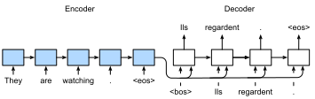

<!-- ===================== Bắt đầu dịch Phần 1 ==================== -->
<!-- ========================================= REVISE PHẦN 1 - BẮT ĐẦU =================================== -->

<!--
#  Sequence to Sequence
-->

# Chuỗi sang Chuỗi

:label:`sec_seq2seq`

<!--
The sequence to sequence (seq2seq) model is based on the encoder-decoder architecture to generate a sequence output for a sequence input, as demonstrated in :numref:`fig_seq2seq`.
Both the encoder and the decoder use recurrent neural networks (RNNs) to handle sequence inputs of variable length.
The hidden state of the encoder is used directly to initialize the decoder hidden state to pass information from the encoder to the decoder.
-->

Mô hình chuỗi sang chuỗi (*Sequence to Sequence -- seq2seq*) dựa trên kiến trúc mã hóa - giải mã để sinh ra chuỗi đầu ra từ chuỗi đầu vào như minh họa trong :numref:`fig_seq2seq`.
Cả bộ mã hóa và bộ giải mã sử dụng mạng nơ-ron hồi tiếp (RNN) để xử lý các chuỗi đầu vào với độ dài khác nhau.
Trạng thái ẩn của bộ giải mã được khởi tạo trực tiếp từ trạng thái ẩn của bộ mã hóa, giúp truyền thông tin từ bộ mã hóa tới bộ giải mã.

<!--

-->


:label:`fig_seq2seq`

<!--
The layers in the encoder and the decoder are illustrated in :numref:`fig_seq2seq_details`.
-->

Các tầng trong bộ mã hóa và bộ giải mã được minh họa trong :numref:`fig_seq2seq_details`.


<!--

-->


:label:`fig_seq2seq_details`

<!--
In this section we will explain and implement the seq2seq model to train on the machine translation dataset.
-->

Trong phần này chúng ta sẽ tìm hiểu và lập trình mô hình seq2seq để huấn luyện trên bộ dữ liệu dịch máy.


```{.python .input  n=1}
from d2l import mxnet as d2l
from mxnet import np, npx, init, gluon, autograd
from mxnet.gluon import nn, rnn
npx.set_np()
```

<!--
## Encoder
-->

## Bộ Mã hóa


<!--
Recall that the encoder of seq2seq can transform the inputs of variable length to a fixed-length context vector $\mathbf{c}$ by encoding the sequence information into $\mathbf{c}$.
We usually use RNN layers within the encoder.
Suppose that we have an input sequence $x_1, \ldots, x_T$, where $x_t$ is the $t^\mathrm{th}$ word.
At timestep $t$, the RNN will have two vectors as the input: the feature vector $\mathbf{x}_t$ of $x_t$ and the hidden state of the last timestep $\mathbf{h}_{t-1}$.
Let us denote the transformation of the RNN's hidden states by a function $f$:
-->

Nhắc lại rằng bộ mã hóa của mô hình seq2seq mã hóa thông tin của các chuỗi đầu vào với độ dài khác nhau thành một vector ngữ cảnh $\mathbf{c}$.
Ta thường sử dụng các tầng RNN trong bộ mã hóa.
Giả sử có một chuỗi đầu vào $x_1, \ldots, x_T$, trong đó $x_t$ là từ thứ $\mathrm{t}$.
Tại bước thời gian $t$, mô hình RNN sẽ có hai vector đầu vào: vector đặc trưng $\mathbf{x}_t$ của $x_t$ và trạng thái ẩn của bước thời gian trước đó $\mathbf{h}_{t-1}$.
Ta ký hiệu phép chuyển đổi của các trạng thái ẩn trong RNN bằng hàm $f$:


$$\mathbf{h}_t = f (\mathbf{x}_t, \mathbf{h}_{t-1}).$$

<!--
Next, the encoder captures information of all the hidden states and encodes it into the context vector $\mathbf{c}$ with a function $q$:
-->

Tiếp theo, bộ mã hóa nắm bắt thông tin của tất cả các trạng thái ẩn và mã hóa chúng thành vector ngữ cảnh $\mathbf{c}$ bằng hàm $q$:

$$\mathbf{c} = q (\mathbf{h}_1, \ldots, \mathbf{h}_T).$$

<!--
For example, if we choose $q$ as $q (\mathbf{h}_1, \ldots, \mathbf{h}_T) = \mathbf{h}_T$, then the context vector will be the final hidden state $\mathbf{h}_T$.
-->

Ví dụ, nếu chúng ta chọn $q$ là $q (\mathbf{h}_1, \ldots, \mathbf{h}_T) = \mathbf{h}_T$, thì vector ngữ cảnh sẽ là trạng thái ẩn của bước thời gian cuối cùng $\mathbf{h}_T$.


<!--
So far what we describe above is a unidirectional RNN, where each timestep's hidden state depends only on the previous timesteps'.
We can also use other forms of RNNs such as GRUs, LSTMs, and bidirectional RNNs to encode the sequential input.
-->

Cho đến nay ta mới mô tả bộ mã hóa sử dụng mạng RNN một chiều, ở đó trạng thái ẩn của mỗi bước thời gian chỉ phụ thuộc vào các bước thời gian trước.
Ta cũng có thể sử dụng các dạng RNN khác nhau như GRU, LSTM, hay RNN hai chiều để mã hóa chuỗi đầu vào.


<!-- ===================== Kết thúc dịch Phần 1 ===================== -->

<!-- ===================== Bắt đầu dịch Phần 2 ===================== -->

<!--
Now let us implement the seq2seq's encoder.
Here we use the word embedding layer to obtain the feature vector according to the word index of the input language.
Those feature vectors will be fed to a multi-layer LSTM.
The input for the encoder is a batch of sequences, which is 2-D tensor with shape (batch size, sequence length).
The encoder returns both the LSTM outputs, i.e., hidden states of all the timesteps, as well as the hidden state and the memory cell of the final timestep.
-->


Bây giờ hãy lập trình bộ mã hóa của mô hình seq2seq.
Ta sử dụng một tầng embedding từ ngữ để lấy vector đặc trưng tương ứng với chỉ số từ trong ngôn ngữ nguồn.
Những vector đặc trưng này sẽ được truyền vào một mạng LSTM đa tầng.
Batch đầu vào của bộ mã hóa là tensor 2 chiều có kích thước là (kích thước batch, độ dài chuỗi), với số lượng chuỗi bằng kích thước batch.
Bộ mã hóa trả về cả đầu ra của LSTM, gồm các trạng thái ẩn của tất cả các bước thời gian, cùng với trạng thái ẩn và ô nhớ ở bước thời gian cuối cùng.


```{.python .input  n=2}
# Saved in the d2l package for later use
class Seq2SeqEncoder(d2l.Encoder):
    def __init__(self, vocab_size, embed_size, num_hiddens, num_layers,
                 dropout=0, **kwargs):
        super(Seq2SeqEncoder, self).__init__(**kwargs)
        self.embedding = nn.Embedding(vocab_size, embed_size)
        self.rnn = rnn.LSTM(num_hiddens, num_layers, dropout=dropout)

    def forward(self, X, *args):
        X = self.embedding(X)  # X shape: (batch_size, seq_len, embed_size)
        # RNN needs first axes to be timestep, i.e., seq_len
        X = X.swapaxes(0, 1)
        state = self.rnn.begin_state(batch_size=X.shape[1], ctx=X.ctx)
        out, state = self.rnn(X, state)
        # out shape: (seq_len, batch_size, num_hiddens)
        # state shape: (num_layers, batch_size, num_hiddens),
        # where "state" contains the hidden state and the memory cell
        return out, state
```


<!--
Next, we will create a minibatch sequence input with a batch size of 4 and 7 timesteps.
We assume the number of hidden layers of the LSTM unit is 2 and the number of hidden units is 16.
The output shape returned by the encoder after performing forward calculation on the input is (number of timesteps, batch size, number of hidden units).
The shape of the multi-layer hidden state of the gated recurrent unit in the final timestep is (number of hidden layers, batch size, number of hidden units).
For the gated recurrent unit, the `state` list contains only one element, which is the hidden state.
If long short-term memory is used, the `state` list will also contain another element, which is the memory cell.
-->

Tiếp theo, chúng ta sẽ tạo một minibatch đầu vào dạng chuỗi với kích thước batch bằng 4 cùng số bước thời gian (độ dài chuỗi) bằng 7.
Giả sử nút LSTM có 2 tầng ẩn và 16 nút ẩn.
Đầu ra của bộ mã hóa sau khi thực hiện lượt truyền xuôi trên đầu vào có kích thước là (số bước thời gian, kích thước batch, số nút ẩn).
Nếu mạng nơ-ron hồi tiếp của bộ mã hóa là nút hồi tiếp có cổng (GRU), danh sách `state` chỉ chứa một phần tử, đó là trạng thái ẩn với kích thước (số tầng ẩn, kích thước batch, số nút ẩn).
Nếu LSTM được sử dụng thì danh sách `state` sẽ chứa thêm một phần tử khác, đó là ô nhớ với cùng kích thước. 


```{.python .input  n=3}
encoder = Seq2SeqEncoder(vocab_size=10, embed_size=8, num_hiddens=16,
                         num_layers=2)
encoder.initialize()
X = np.zeros((4, 7))
output, state = encoder(X)
output.shape
```


<!--
Since an LSTM is used, the `state` list will contain both the hidden state and the memory cell with same shape (number of hidden layers, batch size, number of hidden units).
However, if a GRU is used, the `state` list will contain only one element---the hidden state in the final timestep with shape (number of hidden layers, batch size, number of hidden units).
-->

Trong trường hợp này, vì LSTM đang được sử dụng, danh sách `state` sẽ chứa cả trạng thái ẩn và ô nhớ với cùng kích thước (số tầng ẩn, kích thước batch, số nút ẩn).


```{.python .input  n=4}
len(state), state[0].shape, state[1].shape
```

<!-- ===================== Kết thúc dịch Phần 2 ===================== -->

<!-- ===================== Bắt đầu dịch Phần 3 ===================== -->

<!--
## Decoder
-->

## Bộ giải mã
:label:`sec_seq2seq_decoder`

<!--
As we just introduced, the context vector $\mathbf{c}$ encodes the information from the whole input sequence $x_1, \ldots, x_T$.
Suppose that the given outputs in the training set are $y_1, \ldots, y_{T'}$.
At each timestep $t'$, the conditional probability of output $y_{t'}$ will depend on the previous output sequence $y_1, \ldots, y_{t'-1}$ and the context vector $\mathbf{c}$, i.e.,
-->

Như đã giới thiệu, vector ngữ cảnh $\mathbf{c}$ mã hóa thông tin của toàn bộ chuỗi đầu vào $x_1, \ldots, x_T$.
Giả sử đầu ra của tập huấn luyện là $y_1, \ldots, y_{T'}$.
Tại mỗi bước thời gian $t'$, xác suất có điều kiện của đầu ra $y_{t'}$ sẽ phụ thuộc vào đầu ra trước đó $y_1, \ldots, y_{t'-1}$ và vector ngữ cảnh $\mathbf{c}$, tức


$$P(y_{t'} \mid y_1, \ldots, y_{t'-1}, \mathbf{c}).$$

<!--
Hence, we can use another RNN as the decoder.
At timestep $t'$, the decoder will update its hidden state $\mathbf{s}_{t'}$ using three inputs: 
the feature vector $\mathbf{y}_{t'-1}$ of $y_{t'-1}$, the context vector $\mathbf{c}$, and the hidden state of the last timestep $\mathbf{s}_{t'-1}$.
Let us denote the transformation of the RNN's hidden states within the decoder by a function $g$:
-->

Do đó, chúng ta có thể sử dụng một mạng RNN khác trong bộ giải mã.
Tại mỗi bước thời gian $t'$, bộ giải mã cập nhật trạng thái ẩn của nó thông qua ba đầu vào: vector đặc trưng $\mathbf{y}_{t'-1}$ của $y_{t'-1}$, vector ngữ cảnh $\mathbf{c}$ và trạng thái ẩn tại bước thời gian trước đó $\mathbf{s}_{t'-1}$.
Hàm $g$ dưới đây biểu diễn quá trình biến đổi trạng thái ẩn của mạng RNN trong bộ giải mã:


$$\mathbf{s}_{t'} = g(\mathbf{y}_{t'-1}, \mathbf{c}, \mathbf{s}_{t'-1}).$$


<!--
When implementing the decoder, we directly use the hidden state of the encoder in the final timestep as the initial hidden state of the decoder.
This requires that the encoder and decoder RNNs have the same numbers of layers and hidden units.
The LSTM forward calculation of the decoder is similar to that of the encoder.
The only difference is that we add a dense layer after the LSTM layers, where the hidden size is the vocabulary size.
The dense layer will predict the confidence score for each word.
-->

Khi lập trình, ta sử dụng trực tiếp trạng thái ẩn của bộ mã hóa ở bước thời gian cuối cùng để khởi tạo trạng thái ẩn của bộ giải mã.
Điều này đòi hỏi bộ mã hóa và bộ giải mã phải có cùng số tầng và số nút ẩn.
Các bước tính toán lượt truyền xuôi trong bộ giải mã gần giống trong bộ mã hóa.
Điểm khác biệt duy nhất là có thêm một tầng kết nối dày đặc với kích thước bằng kích thước bộ từ vựng được đặt ở sau các tầng LSTM.
Tầng này sẽ dự đoán điểm tin cậy cho mỗi từ.


```{.python .input  n=5}
# Saved in the d2l package for later use
class Seq2SeqDecoder(d2l.Decoder):
    def __init__(self, vocab_size, embed_size, num_hiddens, num_layers,
                 dropout=0, **kwargs):
        super(Seq2SeqDecoder, self).__init__(**kwargs)
        self.embedding = nn.Embedding(vocab_size, embed_size)
        self.rnn = rnn.LSTM(num_hiddens, num_layers, dropout=dropout)
        self.dense = nn.Dense(vocab_size, flatten=False)

    def init_state(self, enc_outputs, *args):
        return enc_outputs[1]

    def forward(self, X, state):
        X = self.embedding(X).swapaxes(0, 1)
        out, state = self.rnn(X, state)
        # Make the batch to be the first dimension to simplify loss
        # computation
        out = self.dense(out).swapaxes(0, 1)
        return out, state
```


<!--
We create a decoder with the same hyper-parameters as the encoder. As we can see, the output shape is changed to (batch size, the sequence length, vocabulary size).
-->

Ta tạo bộ giải mã với cùng các siêu tham số như ở bộ mã hóa.
Có thể thấy kích thước đầu ra được thay đổi thành (kích thước batch, độ dài chuỗi, kích thước bộ từ vựng).


```{.python .input  n=6}
decoder = Seq2SeqDecoder(vocab_size=10, embed_size=8,
                         num_hiddens=16, num_layers=2)
decoder.initialize()
state = decoder.init_state(encoder(X))
out, state = decoder(X, state)
out.shape, len(state), state[0].shape, state[1].shape
```

<!-- ===================== Kết thúc dịch Phần 3 ===================== -->

<!-- ===================== Bắt đầu dịch Phần 4 ===================== -->

<!-- ========================================= REVISE PHẦN 1 - KẾT THÚC ===================================-->

<!-- ========================================= REVISE PHẦN 2 - BẮT ĐẦU ===================================-->

<!--
## The Loss Function
-->

## Hàm Mất mát

<!--
For each timestep, the decoder outputs a vocabulary-size confidence score vector to predict words.
Similar to language modeling, we can apply softmax to obtain the probabilities and then use cross-entropy loss to calculate the loss.
Note that we padded the target sentences to make them have the same length, but we do not need to compute the loss on the padding symbols.
-->

Tại mỗi bước thời gian, bộ giải mã tạo ra một vector điểm tin cậy có kích thước bằng bộ từ vựng để dự đoán các từ.
Tương tự như trong mô hình hóa ngôn ngữ, ta có thể áp dụng softmax để tính xác suất và sau đó sử dụng hàm mất mát entropy chéo để tính mất mát.
Lưu ý rằng ta đã đệm các câu đích để chúng có cùng độ dài, nhưng không cần tính mất mát trên các ký tự đệm này.

<!--
To implement the loss function that filters out some entries, we will use an operator called `SequenceMask`.
It can specify to mask the first dimension (`axis=0`) or the second one (`axis=1`).
If the second one is chosen, given a valid length vector `len` and 2-dim input `X`, this operator sets `X[i, len[i]:] = 0` for all $i$'s.
-->

Để lập trình hàm mất mát có khả năng lọc ra một số phần tử, ta sẽ sử dụng một toán tử gọi là `SequenceMask`.
Nó có thể gán mặt nạ cho chiều thứ nhất (`axis=0`) hoặc thứ hai (`axis=1`).
Nếu chiều thứ hai được chọn, với đầu vào là mảng hai chiều `X` và vector độ dài hợp lệ `len`, toán tử này sẽ gán `X[i, len[i]:] = 0` với mọi $i$.


```{.python .input  n=7}
X = np.array([[1, 2, 3], [4, 5, 6]])
npx.sequence_mask(X, np.array([1, 2]), True, axis=1)
```

<!--
Apply to $n$-dim tensor $X$, it sets `X[i, len[i]:, :, ..., :] = 0`.
In addition, we can specify the filling value such as $-1$ as shown below.
-->

Áp dụng vào tensor $n$-chiều $X$, toán tử sẽ gán `X[i, len[i]:, :, ..., :] = 0`.
Ta cũng có thể đặt giá trị mặt nạ khác, ví dụ như $-1$ dưới đây.

```{.python .input  n=8}
X = np.ones((2, 3, 4))
npx.sequence_mask(X, np.array([1, 2]), True, value=-1, axis=1)
```

<!--
Now we can implement the masked version of the softmax cross-entropy loss.
Note that each Gluon loss function allows to specify per-example weights, in default they are 1s.
Then we can just use a zero weight for each example we would like to remove.
So our customized loss function accepts an additional `valid_len` argument to ignore some failing elements in each sequence.
-->


Bây giờ ta có thể lập trình phiên bản có mặt nạ của hàm mất mát entropy chéo softmax.
Lưu ý rằng hàm mất mát trong Gluon cho phép đặt trọng số cho mỗi mẫu, theo mặc định thì giá trị này bằng 1.
Để loại bỏ một vài mẫu nhất định, ta có thể đặt trọng số cho chúng bằng 0.
Vì vậy, hàm mất mát có mặt nạ sẽ có thêm đối số `valid_len` cho toán tử `SequenceMask` để gán giá trị 0 cho trọng số của các mẫu ta muốn loại bỏ.


```{.python .input  n=9}
# Saved in the d2l package for later use
class MaskedSoftmaxCELoss(gluon.loss.SoftmaxCELoss):
    # pred shape: (batch_size, seq_len, vocab_size)
    # label shape: (batch_size, seq_len)
    # valid_len shape: (batch_size, )
    def forward(self, pred, label, valid_len):
        # weights shape: (batch_size, seq_len, 1)
        weights = np.expand_dims(np.ones_like(label), axis=-1)
        weights = npx.sequence_mask(weights, valid_len, True, axis=1)
        return super(MaskedSoftmaxCELoss, self).forward(pred, label, weights)
```

<!--
For a sanity check, we create identical three sequences, keep 4 elements for the first sequence, 2 elements for the second sequence, and none for the last one.
Then the first example loss should be 2 times larger than the second one, and the last loss should be 0.
-->

Để kiểm tra sơ bộ, ta tạo ba chuỗi giống hệt nhau, giữ 4 phần tử cho chuỗi thứ nhất, 2 phần tử cho chuỗi thứ hai và không phần tử nào cho chuỗi cuối cùng.
Khi đó, giá trị mất mát của chuỗi đầu tiên phải lớn gấp 2 lần so với chuỗi thứ hai, còn giá trị mất mát của chuỗi cuối cùng phải bằng 0.


```{.python .input  n=10}
loss = MaskedSoftmaxCELoss()
loss(np.ones((3, 4, 10)), np.ones((3, 4)), np.array([4, 2, 0]))
```

<!-- ===================== Kết thúc dịch Phần 4 ===================== -->

<!-- ===================== Bắt đầu dịch Phần 5 ===================== -->

<!--
## Training
-->

## Huấn luyện
:label:`sec_seq2seq_training`

<!--
During training, if the target sequence has length $n$, we feed the first $n-1$ tokens into the decoder as inputs, and the last $n-1$ tokens are used as ground truth label.
-->

Trong quá trình huấn luyện, nếu chuỗi đích có độ dài $n$, ta sẽ đưa $n-1$ token đầu tiên làm đầu vào bộ giải mã, còn $n-1$ token cuối cùng sẽ được sử dụng làm nhãn gốc.


```{.python .input  n=11}
# Saved in the d2l package for later use
def train_s2s_ch9(model, data_iter, lr, num_epochs, ctx):
    model.initialize(init.Xavier(), force_reinit=True, ctx=ctx)
    trainer = gluon.Trainer(model.collect_params(),
                            'adam', {'learning_rate': lr})
    loss = MaskedSoftmaxCELoss()
    animator = d2l.Animator(xlabel='epoch', ylabel='loss',
                            xlim=[1, num_epochs], ylim=[0, 0.25])
    for epoch in range(1, num_epochs + 1):
        timer = d2l.Timer()
        metric = d2l.Accumulator(2)  # loss_sum, num_tokens
        for batch in data_iter:
            X, X_vlen, Y, Y_vlen = [x.as_in_ctx(ctx) for x in batch]
            Y_input, Y_label, Y_vlen = Y[:, :-1], Y[:, 1:], Y_vlen-1
            with autograd.record():
                Y_hat, _ = model(X, Y_input, X_vlen, Y_vlen)
                l = loss(Y_hat, Y_label, Y_vlen)
            l.backward()
            d2l.grad_clipping(model, 1)
            num_tokens = Y_vlen.sum()
            trainer.step(num_tokens)
            metric.add(l.sum(), num_tokens)
        if epoch % 10 == 0:
            animator.add(epoch, (metric[0]/metric[1],))
    print('loss %.3f, %d tokens/sec on %s ' % (
        metric[0]/metric[1], metric[1]/timer.stop(), ctx))
```


<!--
Next, we create a model instance and set hyper-parameters.
Then, we can train the model.
-->

Tiếp theo, ta tạo một thực thể của mô hình, đặt các siêu tham số rồi huấn luyện.

```{.python .input  n=15}
embed_size, num_hiddens, num_layers, dropout = 32, 32, 2, 0.0
batch_size, num_steps = 64, 10
lr, num_epochs, ctx = 0.005, 300, d2l.try_gpu()

src_vocab, tgt_vocab, train_iter = d2l.load_data_nmt(batch_size, num_steps)
encoder = Seq2SeqEncoder(
    len(src_vocab), embed_size, num_hiddens, num_layers, dropout)
decoder = Seq2SeqDecoder(
    len(tgt_vocab), embed_size, num_hiddens, num_layers, dropout)
model = d2l.EncoderDecoder(encoder, decoder)
train_s2s_ch9(model, train_iter, lr, num_epochs, ctx)
```


<!--
## Predicting
-->

## Dự đoán

<!--
Here we implement the simplest method, greedy search, to generate an output sequence.
As illustrated in :numref:`fig_seq2seq_predict`, during predicting, we feed the same "&lt;bos&gt;" token to the decoder as training at timestep 0.
But the input token for a later timestep is the predicted token from the previous timestep.
-->

Ở đây, ta lập trình phương pháp đơn giản nhất có tên gọi *tìm kiếm tham lam* (_greedy search_), để tạo chuỗi đầu ra.
Như minh họa trong :numref:`fig_seq2seq_predict`, trong quá trình dự đoán, ta cũng đưa token bắt đầu câu "&lt;bos&gt;" vào bộ giải mã tại bước thời gian 0 giống quá trình huấn luyện.
Token đầu vào cho các bước thời gian sau sẽ là token được dự đoán từ bước thời gian trước nó.

<!--

-->


:label:`fig_seq2seq_predict`


```{.python .input  n=16}
# Saved in the d2l package for later use
def predict_s2s_ch9(model, src_sentence, src_vocab, tgt_vocab, num_steps,
                    ctx):
    src_tokens = src_vocab[src_sentence.lower().split(' ')]
    enc_valid_len = np.array([len(src_tokens)], ctx=ctx)
    src_tokens = d2l.truncate_pad(src_tokens, num_steps, src_vocab['<pad>'])
    enc_X = np.array(src_tokens, ctx=ctx)
    # Add the batch_size dimension
    enc_outputs = model.encoder(np.expand_dims(enc_X, axis=0),
                                enc_valid_len)
    dec_state = model.decoder.init_state(enc_outputs, enc_valid_len)
    dec_X = np.expand_dims(np.array([tgt_vocab['<bos>']], ctx=ctx), axis=0)
    predict_tokens = []
    for _ in range(num_steps):
        Y, dec_state = model.decoder(dec_X, dec_state)
        # The token with highest score is used as the next timestep input
        dec_X = Y.argmax(axis=2)
        py = dec_X.squeeze(axis=0).astype('int32').item()
        if py == tgt_vocab['<eos>']:
            break
        predict_tokens.append(py)
    return ' '.join(tgt_vocab.to_tokens(predict_tokens))
```


<!--
Try several examples:
-->

Ta sẽ thử một vài ví dụ:


```{.python .input  n=17}
for sentence in ['Go .', 'Wow !', "I'm OK .", 'I won !']:
    print(sentence + ' => ' + predict_s2s_ch9(
        model, sentence, src_vocab, tgt_vocab, num_steps, ctx))
```


<!--
## Summary
-->

## Tóm tắt

<!--
* The sequence to sequence (seq2seq) model is based on the encoder-decoder architecture to generate a sequence output from a sequence input.
* We use multiple LSTM layers for both the encoder and the decoder.
-->

* Mô hình chuỗi sang chuỗi (_sequence to sequence_ - seq2seq) dựa trên kiến trúc mã hóa-giải mã để tạo một chuỗi đầu ra từ chuỗi đầu vào.
* Ta sử dụng nhiều tầng LSTM cho cả bộ mã hóa và bộ giải mã.


<!--
## Exercises
-->

## Bài tập

<!--
1. Can you think of other use cases of seq2seq besides neural machine translation?
2. What if the input sequence in the example of this section is longer?
3. If we do not use the `SequenceMask` in the loss function, what may happen?
-->

1. Nêu một vài ứng dụng khác của seq2seq ngoài dịch máy.
2. Nếu chuỗi đầu vào trong các ví dụ trên dài hơn thì sao?
3. Điều gì có thể xảy ra nếu không sử dụng `SequenceMask` trong hàm mất mát?

<!-- ===================== Kết thúc dịch Phần 5 ===================== -->
<!-- ========================================= REVISE PHẦN 2 - KẾT THÚC ===================================-->


## Thảo luận
* [Tiếng Anh](https://discuss.mxnet.io/t/4357)
* [Tiếng Việt](https://forum.machinelearningcoban.com/c/d2l)

## Những người thực hiện
Bản dịch trong trang này được thực hiện bởi:

* Đoàn Võ Duy Thanh
* Nguyễn Văn Quang
* Đỗ Trường Giang
* Phạm Minh Đức
* Nguyễn Duy Du
* Phạm Hồng Vinh
* Lê Khắc Hồng Phúc
* Nguyễn Văn Cường
