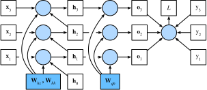

<!-- ===================== Bắt đầu dịch Phần 1 ==================== -->
<!-- ========================================= REVISE PHẦN 1 - BẮT ĐẦU =================================== -->

<!--
# Backpropagation Through Time
-->

# Lan truyền Ngược qua Thời gian
:label:`sec_bptt`

<!--
So far we repeatedly alluded to things like *exploding gradients*, *vanishing gradients*, *truncating backprop*, and the need to *detach the computational graph*.
For instance, in the previous section we invoked `s.detach()` on the sequence.
None of this was really fully explained, in the interest of being able to build a model quickly and to see how it works.
In this section we will delve a bit more deeply into the details of backpropagation for sequence models and why (and how) the math works.
For a more detailed discussion about randomization and backpropagation also see the paper by :cite:`Tallec.Ollivier.2017`.
-->

Cho đến nay chúng ta liên tục nhắc đến những vấn đề như *bùng nổ gradient*, *tiêu biến gradient*, *cắt xén lan truyển ngược* và sự cần thiết của việc *tách đồ thị tính toán*.
Ví dụ, trong phần trước chúng ta gọi hàm `s.detach()` trên chuỗi.
Vì muốn nhanh chóng xây dựng và quan sát cách một mô hình hoạt động nên những vấn đề này chưa được giải thích một cách đầy đủ.
Trong phần này chúng ta sẽ nghiên cứu sâu và chi tiết hơn về lan truyền ngược cho các mô hình chuỗi và giải thích nguyên lý toán học đằng sau.
Để hiểu chi tiết hơn về tính ngẫu nhiên và lan truyền ngược, hãy tham khảo bài báo :cite:`Tallec.Ollivier.2017`.

<!--
We encountered some of the effects of gradient explosion when we first implemented recurrent neural networks (:numref:`sec_rnn_scratch`).
In particular, if you solved the problems in the problem set, you would have seen that gradient clipping is vital to ensure proper convergence.
To provide a better understanding of this issue, this section will review how gradients are computed for sequence models.
Note that there is nothing conceptually new in how it works.
After all, we are still merely applying the chain rule to compute gradients.
Nonetheless, it is worth while reviewing backpropagation (:numref:`sec_backprop`) again.
-->

Chúng ta đã thấy một vài hậu quả của bùng nổ gradient khi lập trình mạng nơ-ron hồi tiếp (:numref:`sec_rnn_scratch`).
Cụ thể, nếu bạn đã làm xong bài tập ở phần đó, bạn sẽ thấy rằng việc gọt gradient đóng vai trò rất quan trọng để đảm bảo mô hình hội tụ.
Để có cái nhìn rõ hơn về vấn đề này, trong phần này chúng ta sẽ xem xét cách tính gradient cho các mô hình chuỗi.
Lưu ý rằng, về mặt khái niệm thì không có gì mới ở đây.
Sau cùng, chúng ta vẫn chỉ đơn thuần áp dụng các quy tắc dây chuyền để tính gradient.
Tuy nhiên, việc ôn lại lan truyền ngược (:numref:`sec_backprop`) vẫn rất hữu ích.

<!--
Forward propagation in a recurrent neural network is relatively straightforward.
*Backpropagation through time* is actually a specific application of back propagation in recurrent neural networks.
It requires us to expand the recurrent neural network one timestep at a time to obtain the dependencies between model variables and parameters.
Then, based on the chain rule, we apply backpropagation to compute and store gradients.
Since sequences can be rather long, the dependency can be rather lengthy.
For instance, for a sequence of 1000 characters, the first symbol could potentially have significant influence on the symbol at position 1000.
This is not really computationally feasible (it takes too long and requires too much memory) and it requires over 1000 matrix-vector products before we would arrive at that very elusive gradient.
This is a process fraught with computational and statistical uncertainty.
In the following we will elucidate what happens and how to address this in practice.
-->

Lượt truyền xuôi trong mạng nơ-ron hồi tiếp tương đối đơn giản.
*Lan truyền ngược qua thời gian* thực chất là một ứng dụng cụ thể của lan truyền ngược trong mạng nơ-ron hồi tiếp.
Nó đòi hỏi chúng ta mở rộng mạng nơ-ron hồi tiếp theo từng bước thời gian một để thu được sự phụ thuộc giữa các biến mô hình và các tham số.
Sau đó, dựa trên quy tắc dây chuyền, chúng ta áp dụng lan truyền ngược để tính toán và lưu các giá trị gradient.
Vì chuỗi có thể khá dài nên sự phụ thuộc trong chuỗi cũng có thể rất dài.
Ví dụ, đối với một chuỗi gồm 1000 ký tự, ký tự đầu tiên có thể ảnh hưởng đáng kể tới ký tự ở vị trí 1000.
Điều này không thực sự khả thi về mặt tính toán (cần quá nhiều thời gian và bộ nhớ) và nó đòi hỏi hơn 1000 phép nhân ma trận-vector trước khi thu được các giá trị gradient khó nắm bắt này.
Đây là một quá trình chứa đầy sự bất định về mặt tính toán và thống kê.
Trong phần tiếp theo chúng ta sẽ làm sáng tỏ những gì sẽ xảy ra và cách giải quyết vấn đề này trong thực tế.

<!-- ===================== Kết thúc dịch Phần 1 ===================== -->

<!-- ===================== Bắt đầu dịch Phần 2 ===================== -->

<!--
## A Simplified Recurrent Network
-->

## Mạng Hồi tiếp Giản thể

<!--
We start with a simplified model of how an RNN works.
This model ignores details about the specifics of the hidden state and how it is updated.
These details are immaterial to the analysis and would only serve to clutter the notation, but make it look more intimidating.
In this simplified model, we denote $h_t$ as the hidden state, $x_t$ as the input, and $o_t$ as the output at timestep $t$.
In addition, $w_h$ and $w_o$ indicate the weights of hidden states and the output layer, respectively.
As a result, the hidden states and outputs at each timesteps can be explained as
-->

Hãy bắt đầu với một mô hình đơn giản về cách mà mạng RNN hoạt động.
Mô hình này bỏ qua các chi tiết cụ thể của trạng thái ẩn và cách trạng thái này được cập nhật.
Những chi tiết này không quan trọng đối với việc phân tích dưới đây mà chỉ khiến các ký hiệu trở nên lộn xộn và phức tạp quá mức.
Trong mô hình đơn giản này, chúng ta ký hiệu $h_t$ là trạng thái ẩn, $x_t$ là đầu vào, và $o_t$ là đầu ra tại bước thời gian $t$.
Bên cạnh đó, $w_h$ và $w_o$ tương ứng với trọng số của các trạng thái ẩn và tầng đầu ra.
Kết quả là, các trạng thái ẩn và kết quả đầu ra tại mỗi bước thời gian có thể được giải thích như sau

$$h_t = f(x_t, h_{t-1}, w_h) \text{ và } o_t = g(h_t, w_o).$$

<!--
Hence, we have a chain of values $\{\ldots, (h_{t-1}, x_{t-1}, o_{t-1}), (h_{t}, x_{t}, o_t), \ldots\}$ that depend on each other via recursive computation.
The forward pass is fairly straightforward.
All we need is to loop through the $(x_t, h_t, o_t)$ triples one step at a time.
The discrepancy between outputs $o_t$ and the desired targets $y_t$ is then evaluated by an objective function as
-->

Do đó, chúng ta có một chuỗi các giá trị $\{\ldots, (h_{t-1}, x_{t-1}, o_{t-1}), (h_{t}, x_{t}, o_t), \ldots\}$ phụ thuộc vào nhau thông qua phép tính đệ quy.
Lượt truyền xuôi khá đơn giản.
Những gì chúng ta cần là lặp qua từng bộ ba $(x_t, h_t, o_t)$ một.
Sau đó, sự khác biệt giữa kết quả đầu ra $o_t$ và các giá trị mục tiêu mong muốn $y_t$ được tính bằng một hàm mục tiêu

$$L(x, y, w_h, w_o) = \sum_{t=1}^T l(y_t, o_t).$$

<!--
For backpropagation, matters are a bit more tricky, especially when we compute the gradients with regard to the parameters $w_h$ of the objective function $L$.
To be specific, by the chain rule,
-->

Đối với lan truyền ngược, mọi thứ lại phức tạp hơn một chút, đặc biệt là khi chúng ta tính gradient theo các tham số $w_h$ của hàm mục tiêu $L$.
Cụ thể, theo quy tắc dây chuyền ta có

$$\begin{aligned}
\partial_{w_h} L & = \sum_{t=1}^T \partial_{w_h} l(y_t, o_t) \\
	& = \sum_{t=1}^T \partial_{o_t} l(y_t, o_t) \partial_{h_t} g(h_t, w_h) \left[ \partial_{w_h} h_t\right].
\end{aligned}$$

<!--
The first and the second part of the derivative is easy to compute.
The third part $\partial_{w_h} h_t$ is where things get tricky, since we need to compute the effect of the parameters on $h_t$.
-->

Ta có thể tính phần đầu tiên và phần thứ hai của đạo hàm một cách dễ dàng.
Phần thứ ba $\partial_{w_h} h_t$ khiến mọi thứ trở nên khó khăn, vì chúng ta cần phải tính toán ảnh hưởng của các tham số tới $h_t$.

<!--
To derive the above gradient, assume that we have three sequences $\{a_{t}\},\{b_{t}\},\{c_{t}\}$ satisfying $a_{0}=0, a_{1}=b_{1}$, and $a_{t}=b_{t}+c_{t}a_{t-1}$ for $t=1, 2,\ldots$.
Then for $t\geq 1$, it is easy to show
-->

Để tính được gradient ở trên, giả sử rằng chúng ta có ba chuỗi $\{a_{t}\},\{b_{t}\},\{c_{t}\}$ thỏa mãn $a_{0}=0, a_{1}=b_{1}$ và $a_{t}=b_{t}+c_{t}a_{t-1}$ với $t=1, 2,\ldots$.
Sau đó, với $t\geq 1$ ta có

$$a_{t}=b_{t}+\sum_{i=1}^{t-1}\left(\prod_{j=i+1}^{t}c_{j}\right)b_{i}.$$
:eqlabel:`eq_bptt_at`

<!--
Now let us apply :eqref:`eq_bptt_at` with
-->

Bây giờ chúng ta áp dụng :eqref:`eq_bptt_at` với

$$a_t = \partial_{w_h}h_{t},$$

$$b_t = \partial_{w_h}f(x_{t},h_{t-1},w_h), $$

$$c_t = \partial_{h_{t-1}}f(x_{t},h_{t-1},w_h).$$

<!--
Therefore, $a_{t}=b_{t}+c_{t}a_{t-1}$ becomes the following recursion
-->

Vì vậy, công thức $a_{t}=b_{t}+c_{t}a_{t-1}$ trở thành phép đệ quy dưới đây

$$
\partial_{w_h}h_{t}=\partial_{w_h}f(x_{t},h_{t-1},w)+\partial_{h}f(x_{t},h_{t-1},w_h)\partial_{w_h}h_{t-1}.
$$

<!--
By :eqref:`eq_bptt_at`, the third part will be
-->

Sử dụng :eqref:`eq_bptt_at`, phần thứ ba sẽ trở thành

$$
\partial_{w_h}h_{t}=\partial_{w_h}f(x_{t},h_{t-1},w_h)+\sum_{i=1}^{t-1}\left(\prod_{j=i+1}^{t}\partial_{h_{j-1}}f(x_{j},h_{j-1},w_h)\right)\partial_{w_h}f(x_{i},h_{i-1},w_h).
$$

<!-- ===================== Kết thúc dịch Phần 2 ===================== -->

<!-- ===================== Bắt đầu dịch Phần 3 ===================== -->

<!--
While we can use the chain rule to compute $\partial_w h_t$ recursively, this chain can get very long whenever $t$ is large.
Let us discuss a number of strategies for dealing with this problem.
-->

Dù chúng ta có thể sử dụng quy tắc dây chuyền để tính $\partial_w h_t$ một cách đệ quy, dây chuyền này có thể trở nên rất dài khi giá trị $t$ lớn.
Hãy cùng thảo luận về một số chiến lược để giải quyết vấn đề này.

<!--
* **Compute the full sum.**
This is very slow and gradients can blow up, since subtle changes in the initial conditions can potentially affect the outcome a lot.
That is, we could see things similar to the butterfly effect where minimal changes in the initial conditions lead to disproportionate changes in the outcome.
This is actually quite undesirable in terms of the model that we want to estimate.
After all, we are looking for robust estimators that generalize well.
Hence this strategy is almost never used in practice.
-->

* **Tính toàn bộ tổng.**
Cách này rất chậm và gradient có thể bùng nổ vì những thay đổi nhỏ trong các điều kiện ban đầu cũng có khả năng ảnh hưởng đến kết quả rất nhiều.
Điều này tương tự như trong hiệu ứng cánh bướm, khi những thay đổi rất nhỏ trong điều kiện ban đầu dẫn đến những thay đổi không cân xứng trong kết quả.
Đây thực sự là điều không mong muốn khi xét tới mô hình mà chúng ta muốn ước lượng.
Sau cùng, chúng ta đang cố tìm kiếm một bộ ước lượng mạnh mẽ và có khả năng khái quát tốt.
Do đó chiến lược này hầu như không bao giờ được sử dụng trong thực tế.

<!--
* **Truncate the sum after** $\tau$ **steps.**
This is what we have been discussing so far.
This leads to an *approximation* of the true gradient, simply by terminating the sum above at $\partial_w h_{t-\tau}$.
The approximation error is thus given by $\partial_h f(x_t, h_{t-1}, w) \partial_w h_{t-1}$ (multiplied by a product of  gradients involving $\partial_h f$).
In practice this works quite well.
It is what is commonly referred to as truncated BPTT (backpropgation through time).
One of the consequences of this is that the model focuses primarily on short-term influence rather than long-term consequences.
This is actually *desirable*, since it biases the estimate towards simpler and more stable models.
-->

* **Cắt xén tổng sau** $\tau$ **bước.**
Cho đến giây phút hiện tại, đây là những gì chúng ta đã thảo luận.
Điều này dẫn tới một phép *xấp xỉ* của gradient, đơn giản bằng cách kết thúc tổng trên tại $\partial_w h_{t-\tau}$.
Do đó lỗi xấp xỉ là $\partial_h f(x_t, h_{t-1}, w) \partial_w h_{t-1}$ (nhân với tích của gradient liên quan đến $\partial_h f$).
Trong thực tế, chiến lược này hoạt động khá tốt.
Phương pháp này thường được gọi là BPTT (*backpropagation through time* --- lan truyền ngược qua thời gian) bị cắt xén.
Một trong những hệ quả của phương pháp này là mô hình sẽ tập trung chủ yếu vào ảnh hưởng ngắn hạn thay vì dài hạn.
Đây thực sự là điều mà chúng ta *mong muốn*, vì nó hướng sự ước lượng tới các mô hình đơn giản và ổn định hơn.

<!--
* **Randomized Truncation.** Last we can replace $\partial_{w_h} h_t$ by a random variable which is correct in expectation but which truncates the sequence.
* This is achieved by using a sequence of $\xi_t$ where $E[\xi_t] = 1$ and $P(\xi_t = 0) = 1-\pi$ and furthermore $P(\xi_t = \pi^{-1}) = \pi$.
* We use this to replace the gradient:
-->

* **Cắt xén Ngẫu nhiên.** Cuối cùng, chúng ta có thể thay thế $\partial_{w_h} h_t$ bằng một biến ngẫu nhiên có giá trị kỳ vọng đúng nhưng vẫn cắt xén chuỗi.
* Điều này có thể đạt được bằng cách sử dụng một chuỗi các $\xi_t$ trong đó $E[\xi_t] = 1$, $P(\xi_t = 0) = 1-\pi$ và $P(\xi_t = \pi^{-1}) = \pi$.
* Chúng ta sẽ sử dụng chúng thay vì gradient:

$$z_t  = \partial_w f(x_t, h_{t-1}, w) + \xi_t \partial_h f(x_t, h_{t-1}, w) \partial_w h_{t-1}.$$

<!-- ===================== Kết thúc dịch Phần 3 ===================== -->

<!-- ===================== Bắt đầu dịch Phần 4 ===================== -->

<!--
It follows from the definition of $\xi_t$ that $E[z_t] = \partial_w h_t$.
Whenever $\xi_t = 0$ the expansion terminates at that point.
This leads to a weighted sum of sequences of varying lengths where long sequences are rare but appropriately overweighted.
:cite:`Tallec.Ollivier.2017` proposed this in their paper.
Unfortunately, while appealing in theory, the model does not work much better than simple truncation, most likely due to a number of factors.
First, the effect of an observation after a number of backpropagation steps into the past is quite sufficient to capture dependencies in practice.
Second, the increased variance counteracts the fact that the gradient is more accurate.
Third, we actually *want* models that have only a short range of interaction.
Hence, BPTT has a slight regularizing effect which can be desirable.
-->

Từ định nghĩa của $\xi_t$, ta có $E[z_t] = \partial_w h_t$.
Bất cứ khi nào $\xi_t = 0$, khai triển sẽ kết thúc tại điểm đó.
Điều này dẫn đến một tổng trọng số của các chuỗi có chiều dài biến thiên, trong đó chuỗi dài sẽ hiếm hơn nhưng được đánh trọng số cao hơn tương ứng.
:cite:`Tallec.Ollivier.2017` đưa ra đề xuất này trong bài báo nghiên cứu của họ.
Không may, dù phương pháp này khá hấp dẫn về mặt lý thuyết, nó lại không tốt hơn phương pháp cắt xén đơn giản, nhiều khả năng do các yếu tố sau.
Thứ nhất, tác động của một quan sát đến quá khứ sau một vài lượt lan truyền ngược đã là tương đối đủ để nắm bắt các phụ thuộc trên thực tế.
Thứ hai, phương sai tăng lên làm phản tác dụng của việc có gradient chính xác hơn.
Thứ ba, ta thực sự *muốn* các mô hình có khoảng tương tác ngắn.
Do đó, BPTT có một hiệu ứng điều chuẩn nhỏ mà có thể có ích.

<!--

-->

:label:`fig_truncated_bptt`

<!--
:numref:`fig_truncated_bptt` illustrates the three cases when analyzing the first few words of *The Time Machine*:
* The first row is the randomized truncation which partitions the text into segments of varying length.
* The second row is the regular truncated BPTT which breaks it into sequences of the same length.
* The third row is the full BPTT that leads to a computationally infeasible expression.
-->

:numref:`fig_truncated_bptt` minh họa ba trường hợp trên khi phân tích một số từ đầu tiên trong *Cỗ máy Thời gian*:

* Dòng đầu tiên biểu diễn sự cắt xén ngẫu nhiên, chia văn bản thành các phần có độ dài biến thiên.
* Dòng thứ hai biểu diễn BPTT bị cắt xén đều, chia văn bản thành các phần có độ dài bằng nhau.
* Dòng thứ ba là BPTT đầy đủ, dẫn đến một biểu thức không khả thi về mặt tính toán.

<!-- ========================================= REVISE PHẦN 1 - KẾT THÚC ===================================-->

<!-- ========================================= REVISE PHẦN 2 - BẮT ĐẦU ===================================-->

<!--
## The Computational Graph
-->

## Đồ thị Tính toán

<!--
In order to visualize the dependencies between model variables and parameters during computation in a recurrent neural network, 
we can draw a computational graph for the model, as shown in :numref:`fig_rnn_bptt`.
For example, the computation of the hidden states of timestep 3, $\mathbf{h}_3$, depends on the model parameters $\mathbf{W}_{hx}$ and $\mathbf{W}_{hh}$, 
the hidden state of the last timestep $\mathbf{h}_2$, and the input of the current timestep $\mathbf{x}_3$.
-->

Để minh họa trực quan sự phụ thuộc giữa các biến và tham số mô hình trong suốt quá trình tính toán của mạng nơ-ron hồi tiếp, ta có thể vẽ đồ thị tính toán của mô hình, như trong :numref:`fig_rnn_bptt`.
Ví dụ, việc tính toán trạng thái ẩn ở bước thời gian 3, $\mathbf{h}_3$, phụ thuộc vào các tham số $\mathbf{W}_{hx}$ và $\mathbf{W}_{hh}$ của mô hình, trạng thái ẩn ở bước thời gian trước đó $\mathbf{h}_2$, và đầu vào ở bước thời gian hiện tại $\mathbf{x}_3$.

<!--

-->

:label:`fig_rnn_bptt`

<!-- ===================== Kết thúc dịch Phần 4 ===================== -->

<!-- ===================== Bắt đầu dịch Phần 5 ===================== -->

<!--
## BPTT in Detail
-->

## BPTT chi tiết

<!--
After discussing the general principle, let us discuss BPTT in detail.
By decomposing $\mathbf{W}$ into different sets of weight matrices ($\mathbf{W}_{hx}, \mathbf{W}_{hh}$ and $\mathbf{W}_{oh}$), 
we will get a simple linear latent variable model:
-->

Sau khi thảo luận các nguyên lý chung, hãy phân tích BPTT một cách chi tiết.
Bằng cách tách $\mathbf{W}$ thành các tập ma trận trọng số khác nhau $\mathbf{W}_{hx}, \mathbf{W}_{hh}$ và $\mathbf{W}_{oh}$), ta thu được mô hình biến tiềm ẩn tuyến tính đơn giản:

$$\mathbf{h}_t = \mathbf{W}_{hx} \mathbf{x}_t + \mathbf{W}_{hh} \mathbf{h}_{t-1} \text{ và }
\mathbf{o}_t = \mathbf{W}_{oh} \mathbf{h}_t.$$

<!--
Following the discussion in :numref:`sec_backprop`, we compute the gradients $\frac{\partial L}{\partial \mathbf{W}_{hx}}$, 
$\frac{\partial L}{\partial \mathbf{W}_{hh}}$, $\frac{\partial L}{\partial \mathbf{W}_{oh}}$ for
-->

Theo thảo luận ở :numref:`sec_backprop`, ta tính các gradient $\frac{\partial L}{\partial \mathbf{W}_{hx}}$, $\frac{\partial L}{\partial \mathbf{W}_{hh}}$, $\frac{\partial L}{\partial \mathbf{W}_{oh}}$ cho

$$L(\mathbf{x}, \mathbf{y}, \mathbf{W}) = \sum_{t=1}^T l(\mathbf{o}_t, y_t),$$

<!--
where $l(\cdot)$ denotes the chosen loss function.
Taking the derivatives with respect to $W_{oh}$ is fairly straightforward and we obtain
-->

với $l(\cdot)$ là hàm mất mát đã chọn trước.
Tính đạo hàm theo $W_{oh}$ khá đơn giản, ta có

$$\partial_{\mathbf{W}_{oh}} L = \sum_{t=1}^T \mathrm{prod}
\left(\partial_{\mathbf{o}_t} l(\mathbf{o}_t, y_t), \mathbf{h}_t\right),$$

<!--
where $\mathrm{prod} (\cdot)$ indicates the product of two or more matrices.
-->

với $\mathrm{prod} (\cdot)$ là tích của hai hoặc nhiều ma trận.

<!--
The dependency on $\mathbf{W}_{hx}$ and $\mathbf{W}_{hh}$ is a bit more tricky since it involves a chain of derivatives.
We begin with
-->

Sự phụ thuộc vào $\mathbf{W}_{hx}$ và $\mathbf{W}_{hh}$ thì khó khăn hơn một chút vì cần sử dụng quy tắc dây chuyền khi tính toán đạo hàm.
Ta sẽ bắt đầu với

$$\begin{aligned}
\partial_{\mathbf{W}_{hh}} L & = \sum_{t=1}^T \mathrm{prod}
\left(\partial_{\mathbf{o}_t} l(\mathbf{o}_t, y_t), \mathbf{W}_{oh}, \partial_{\mathbf{W}_{hh}} \mathbf{h}_t\right), \\
\partial_{\mathbf{W}_{hx}} L & = \sum_{t=1}^T \mathrm{prod}
\left(\partial_{\mathbf{o}_t} l(\mathbf{o}_t, y_t), \mathbf{W}_{oh}, \partial_{\mathbf{W}_{hx}} \mathbf{h}_t\right).
\end{aligned}$$

<!--
After all, hidden states depend on each other and on past inputs.
The key quantity is how past hidden states affect future hidden states.
-->

Sau cùng, các trạng thái ẩn phụ thuộc lẫn nhau và phụ thuộc vào đầu vào quá khứ.
Một đại lượng quan trọng là sư ảnh hưởng của các trạng thái ẩn quá khứ tới các trạng thái ẩn tương lai.

$$\partial_{\mathbf{h}_t} \mathbf{h}_{t+1} = \mathbf{W}_{hh}^\top
\text{ do~đó }
\partial_{\mathbf{h}_t} \mathbf{h}_T = \left(\mathbf{W}_{hh}^\top\right)^{T-t}.$$

<!--
Chaining terms together yields
-->

Áp dụng quy tắc dây chuyền ta được

$$\begin{aligned}
\partial_{\mathbf{W}_{hh}} \mathbf{h}_t & = \sum_{j=1}^t \left(\mathbf{W}_{hh}^\top\right)^{t-j} \mathbf{h}_j \\
\partial_{\mathbf{W}_{hx}} \mathbf{h}_t & = \sum_{j=1}^t \left(\mathbf{W}_{hh}^\top\right)^{t-j} \mathbf{x}_j.
\end{aligned}$$

<!-- ===================== Kết thúc dịch Phần 5 ===================== -->

<!-- ===================== Bắt đầu dịch Phần 6 ===================== -->

<!--
A number of things follow from this potentially very intimidating expression.
First, it pays to store intermediate results, i.e., powers of $\mathbf{W}_{hh}$ as we work our way through the terms of the loss function $L$.
Second, this simple linear example already exhibits some key problems of long sequence models: it involves potentially very large powers $\mathbf{W}_{hh}^j$.
In it, eigenvalues smaller than $1$ vanish for large $j$ and eigenvalues larger than $1$ diverge.
This is numerically unstable and gives undue importance to potentially irrelevant past detail.
One way to address this is to truncate the sum at a computationally convenient size.
Later on in :numref:`chap_modern_rnn` we will see how more sophisticated sequence models such as LSTMs can alleviate this further.
In practice, this truncation is effected by *detaching* the gradient after a given number of steps.
-->

Ta có thể rút ra nhiều điều từ biểu thức phức tạp này.
Đầu tiên, việc lưu lại các kết quả trung gian, tức các luỹ thừa của $\mathbf{W}_{hh}$ khi tính các số hạng của hàm mất mát $L$, là rất hữu ích.
Thứ hai, ví dụ tuyến tính này dù đơn giản nhưng đã làm lộ ra một vấn đề chủ chốt của các mô hình chuỗi dài: ta có thể phải làm việc với các luỹ thừa rất lớn của $\mathbf{W}_{hh}^j$.
Trong đó, khi $j$ lớn, các trị riêng nhỏ hơn $1$ sẽ tiêu biến, còn các trị riêng lớn hơn $1$ sẽ phân kì.
Các mô hình này không có tính ổn định số học, dẫn đến việc chúng quan trọng hóa quá mức các chi tiết không liên quan trong quá khứ. 
Một cách giải quyết vấn đề này là cắt xén các số hạng trong tổng ở một mức độ thuận tiện cho việc tính toán.
Sau này ở :numref:`chap_modern_rnn`, ta sẽ thấy cách các mô hình chuỗi phức tạp như LSTM giải quyết vấn đề này tốt hơn.
Khi lập trình, ta cắt xén các số hạng bằng cách *tách rời* gradient sau một số lượng bước nhất định.

<!--
## Summary
-->

## Tóm tắt

<!--
* Backpropagation through time is merely an application of backprop to sequence models with a hidden state.
* Truncation is needed for computational convenience and numerical stability.
* High powers of matrices can lead to divergent and vanishing eigenvalues. This manifests itself in the form of exploding or vanishing gradients.
* For efficient computation, intermediate values are cached.
-->

* Lan truyền ngược theo thời gian chỉ là việc áp dụng lan truyền ngược cho các mô hình chuỗi có trạng thái ẩn.
* Việc cắt xén là cần thiết để thuận tiện cho việc tính toán và ổn định các giá trị số.
* Luỹ thừa lớn của ma trận có thể làm các trị riêng tiêu biến hoặc phân kì, biểu hiện dưới hiện tượng tiêu biến hoặc bùng nổ gradient.
* Để tăng hiệu năng tính toán, các giá trị trung gian được lưu lại.

<!--
## Exercises
-->

## Bài tập

<!--
1. Assume that we have a symmetric matrix $\mathbf{M} \in \mathbb{R}^{n \times n}$ with eigenvalues $\lambda_i$.
Without loss of generality, assume that they are ordered in ascending order $\lambda_i \leq \lambda_{i+1}$.
Show that $\mathbf{M}^k$ has eigenvalues $\lambda_i^k$.
2. Prove that for a random vector $\mathbf{x} \in \mathbb{R}^n$, 
with high probability $\mathbf{M}^k \mathbf{x}$ will be very much aligned with the largest eigenvector $\mathbf{v}_n$ of $\mathbf{M}$.
Formalize this statement.
3. What does the above result mean for gradients in a recurrent neural network?
4. Besides gradient clipping, can you think of any other methods to cope with gradient explosion in recurrent neural networks?
-->

1. Cho ma trận đối xứng $\mathbf{M} \in \mathbb{R}^{n \times n}$ với các trị riêng $\lambda_i$.
Không làm mất tính tổng quát, ta giả sử chúng được sắp xếp theo thứ tự tăng dần $\lambda_i \leq \lambda_{i+1}$.
Chứng minh rằng $\mathbf{M}^k$ có các trị riêng là $\lambda_i^k$.
2. Chứng minh rằng với vector bất kì $\mathbf{x} \in \mathbb{R}^n$, xác suất cao là $\mathbf{M}^k \mathbf{x}$ sẽ xấp xỉ vector trị riêng lớn nhất $\mathbf{v}_n$ của $\mathbf{M}$.
3. Kết quả trên có ý nghĩa như thế nào khi tính gradient của mạng nơ-ron hồi tiếp?
4. Ngoài gọt gradient, có phương pháp nào để xử lý bùng nổ gradient trong mạng nơ-ron hồi tiếp không?

<!-- ===================== Kết thúc dịch Phần 6 ===================== -->
<!-- ========================================= REVISE PHẦN 2 - KẾT THÚC ===================================-->

## Thảo luận
* [Tiếng Anh](https://discuss.mxnet.io/t/2366)
* [Tiếng Việt](https://forum.machinelearningcoban.com/c/d2l)

## Những người thực hiện
Bản dịch trong trang này được thực hiện bởi:

* Đoàn Võ Duy Thanh
* Nguyễn Văn Quang
* Lê Khắc Hồng Phúc
* Nguyễn Văn Cường
* Phạm Minh Đức
* Phạm Hồng Vinh
